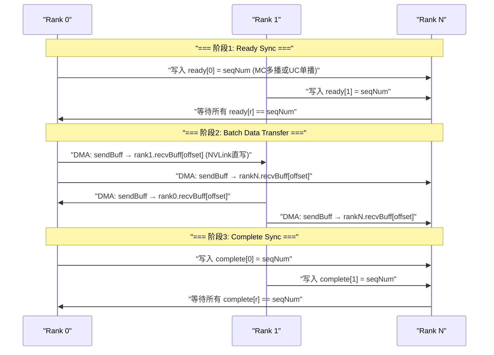
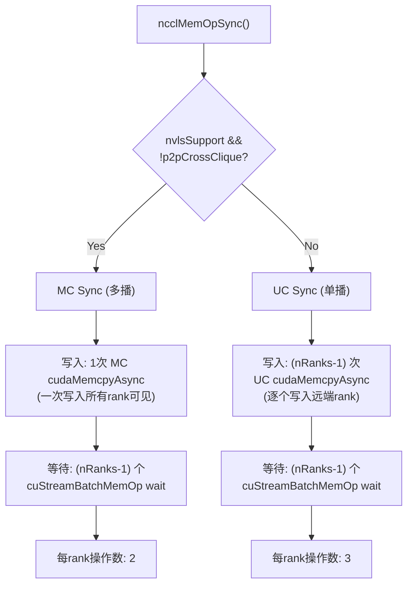
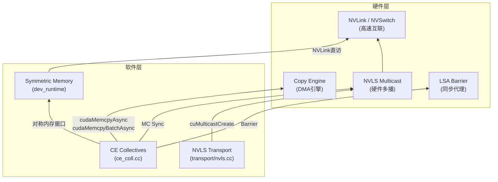
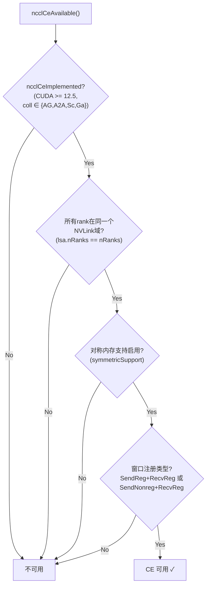
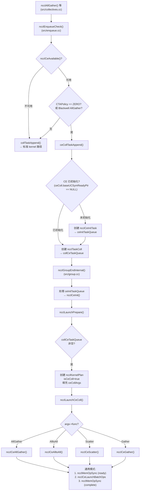
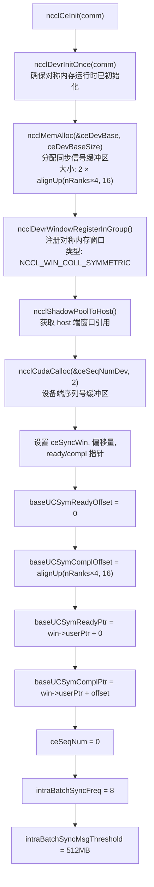
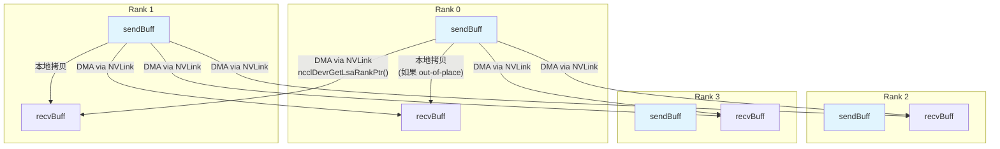
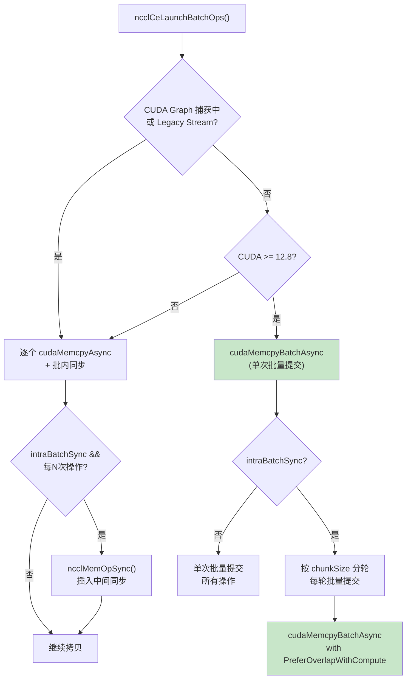
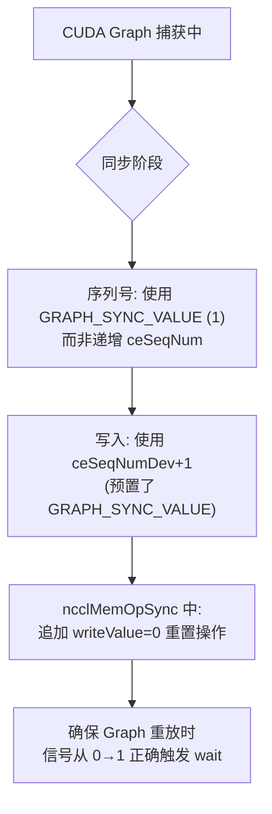

# NCCL Collective Engine (CE) 全面分析

## 一、设计目标

CE (Collective Engine) 的核心设计目标是**将集合通信操作从 GPU SM (Streaming Multiprocessor) 卸载到专用 DMA 硬件——Copy Engine 上执行**，从而：

1. **释放 GPU 计算资源**：传统集合通信需要启动 CUDA kernel 占用 SM，CE 路径通过 DMA 引擎完成数据搬运，SM 可同时执行用户计算任务
2. **利用对称内存直访**：NVLink 互联的 GPU 之间可直接访问彼此显存，无需中间缓冲区，实现零拷贝传输
3. **硬件加速同步**：利用 NVLS 多播或 CUDA Stream Memory Operations 实现高效跨 rank 同步
4. **批量化传输**：将多 rank 间的数据传输合并为批量操作，减少驱动层开销

## 二、实现机制

CE 路径**完全运行在 Host 端**，不启动任何自定义 CUDA kernel，而是利用 CUDA Runtime/Driver API 的流式内存操作：

| 机制 | 用途 | API |
|------|------|-----|
| 对称内存窗口 | 各 rank 直接访问远端显存 | `ncclDevrGetLsaRankPtr()`, `ncclDevrGetLsaTeamPtrMC()` |
| 批量内存拷贝 | 高效数据传输 | `cudaMemcpyBatchAsync` (12.8+) / `cudaMemcpyAsync` |
| 流内存操作 | 跨 rank 同步信号 | `cuStreamBatchMemOp`, `cuStreamWriteValue32` |
| NVLS 多播 | 一次写入通知所有 rank | `ncclDevrGetLsaTeamPtrMC()` 获取多播地址 |

### CE 支持的集合操作

仅支持**非规约型**操作（无需计算，纯数据搬运）：

| 操作 | 说明 |
|------|------|
| `ncclFuncAllGather` | 全收集 |
| `ncclFuncAlltoAll` | 全互联 |
| `ncclFuncScatter` | 散射（root → all） |
| `ncclFuncGather` | 收集（all → root） |

**不支持 AllReduce / Reduce / ReduceScatter**——这些需要规约计算，必须用 SM kernel。

## 三、核心原理

### 3.1 对称内存 (Symmetric Memory)

CE 的基础是**对称内存模型**：

```
Rank 0 显存          Rank 1 显存          Rank N 显存
┌────────────┐      ┌────────────┐      ┌────────────┐
│ sendBuff   │◄────►│ sendBuff   │◄────►│ sendBuff   │
│ recvBuff   │◄────►│ recvBuff   │◄────►│ recvBuff   │
│ CE sync    │◄────►│ CE sync    │◄────►│ CE sync    │
│ (ready[]   │      │ (ready[]   │      │ (ready[]   │
│  compl[])  │      │  compl[])  │      │  compl[])  │
└────────────┘      └────────────┘      └────────────┘
        ↕ NVLink 直访 ↕          ↕ NVLink 直访 ↕
```

- 每个 rank 通过 `ncclDevrWindowRegisterInGroup()` 将 buffer 注册到对称内存窗口
- 通过 `ncclDevrGetLsaRankPtr(comm, win, offset, targetRank, &peerPtr)` 获取**远端 rank 的对称地址**
- DMA 引擎可通过 NVLink 直接写入远端 rank 的显存，无需中间 proxy

### 3.2 两阶段同步协议

每个 CE 集合操作包含**两次同步屏障**：



- **Ready Sync**：所有 rank 就绪后才开始数据传输，防止读到未初始化数据
- **Complete Sync**：所有 rank 传输完成后操作才结束，保证数据一致性
- 同步信号使用**递增序列号** (`ceSeqNum`)，每次操作递增，确保不会误读旧值
- Ready/Complete 指针交替使用 (`useCompletePtr` 交替翻转)，实现流水线化

### 3.3 同步策略：多播 vs 单播



**MC 多播同步**（NVLS 支持）：
- 1 次多播写入即可让所有 rank 看到信号，每 rank 只需 2 个内存操作
- 使用 `ncclDevrGetLsaTeamPtrMC()` 获取 NVLS 多播地址

**UC 单播同步**（回退路径）：
- 需要逐 rank 写入，每 rank 需要 3 个内存操作 (nRanks-1 次 write + nRanks-1 次 wait)

## 四、底层硬件支持与特性

### 4.1 硬件依赖关系



### 4.2 关键硬件特性

| 硬件特性 | 作用 | 检测方式 |
|----------|------|----------|
| **Copy Engine** | 执行 DMA 拷贝，不占用 SM | CUDA stream 操作自动路由到 CE |
| **NVLink** | GPU 间高速互联 (300-900 GB/s)，对称内存前提 | `ncclTeamLsa(comm).nRanks == comm->nRanks` |
| **NVLS Multicast** | 一次写入多 rank 可见，加速同步 | `CU_DEVICE_ATTRIBUTE_MULTICAST_SUPPORTED` |
| **LSA (Local Sync Agent)** | NVLink 域内硬件 barrier | `ncclTeamLsa()` 获取 LSA team |
| **Multimem** | 单指令多存储加载 (AllReduce) | `comm->lsaMultimem` |

### 4.3 版本要求

| 特性 | 最低 CUDA 版本 | 说明 |
|------|---------------|------|
| NVLS 多播 | 12.1 | `cuMulticastCreate` API |
| CE Collectives | 12.5 | 驱动版本 >= 12050 |
| `cudaMemcpyBatchAsync` | 12.8 | 批量拷贝 + 属性 (OverlapWithCompute) |
| Blackwell CE 自动选择 | 12.5+ | `minCompCap >= 100` + `isAllDirectNvlink` |

### 4.4 CE 可用性判定



### 4.5 CE 路径选择策略

CE 路径有两种进入条件（`src/enqueue.cc`）：

**条件 1 — 用户显式请求**：
```
CTAPolicy == NCCL_CTA_POLICY_ZERO  &&  ceAvailable  &&  !hasSysmemSegment
```
用户设置 `CTAPolicy=0x02` (ZERO) 表示优先将 SM 让给计算，集合通信走 CE。

**条件 2 — 自动选择（仅 AllGather + Blackwell）**：
```
ceAvailable && symmetricSupport && coll == AllGather
  && count > NCCL_SYM_CE_THRESHOLD (8MB)
  && minCompCap >= 100  (Blackwell)
  && isAllDirectNvlink
```
Blackwell GPU 上大消息 AllGather 自动走 CE。

## 五、代码流程

### 5.1 完整端到端流程



### 5.2 CE 初始化流程 (`ncclCeInit`)



### 5.3 AllGather 数据流详解

以 `ncclCeAllGather` 为例说明数据流（4 rank 场景）：



每个 rank 将自己的 `sendBuff` 直接 DMA 写入**所有其他 rank 的 `recvBuff` 对应偏移位置**。写入地址通过 `ncclDevrGetLsaRankPtr()` 将本地偏移映射为远端 rank 的对称地址。

### 5.4 批量操作与批内同步



**批内同步 (Intra-Batch Sync)** 是大规模场景下的性能优化：
- 触发条件：`numOps > intraBatchSyncFreq (8)` 且 `总数据量 >= 512MB`
- 目的：避免 DMA 超时，在大规模传输中插入中间同步点
- 每 8 次操作插入一次 `ncclMemOpSync()`
- CUDA 12.8+ 路径将操作分块为多轮，每轮一次批量提交

### 5.5 CUDA Graph 支持

CE 完整支持 CUDA Graph 捕获：



- 捕获时使用固定值 `GRAPH_SYNC_VALUE=1` 替代递增序列号
- 同步结束后追加 `writeValue(0)` 重置信号，确保 Graph 重放时 wait 条件可再次满足
- `cudaMemcpyBatchAsync` 不支持 Graph 捕获，自动回退到逐个 `cudaMemcpyAsync`

## 六、与 NVLS/Symmetric Kernel 的关系

CE 和 Symmetric Kernel 是两条**并行的对称内存路径**：

| 维度 | CE 路径 | Symmetric Kernel 路径 |
|------|---------|---------------------|
| 执行单元 | Copy Engine (DMA) | GPU SM (CUDA Kernel) |
| 代码位置 | `src/ce_coll.cc` | `src/device/symmetric/` |
| 支持操作 | AllGather, AlltoAll, Scatter, Gather | AllReduce, AllGather, ReduceScatter |
| SM 开销 | 零 | 占用 SM 线程 |
| 选择条件 | CTAPolicy=ZERO 或 Blackwell AllGather | 默认对称内存路径 |
| 同步方式 | Host 端 cuStreamBatchMemOp | Device 端 LSA Barrier + Multimem |
| 数据搬运 | cudaMemcpyAsync / cudaMemcpyBatchAsync | TMA / Multimem Load/Store |

## 七、RMA CE 扩展

CE 机制也被 RMA (Remote Memory Access) 模块复用（`src/rma/rma_ce.cc`），用于 `ncclPutSignal` / `ncclWaitSignal` 操作：

- `ncclRmaCeCtx` 独立管理信号/确认缓冲区，布局为 `[per-rank signals][aggregate signal][graph signals][graph ack]`
- 每个上下文有自己的 `cudaStream_t ceStream` 和 `cudaEvent_t ceEvent`
- 支持多 RMA 上下文（由 `ncclConfig.numRmaCtx` 控制）

## 八、关键数据结构汇总

```c
// 通信器级 CE 上下文 (嵌入 ncclComm)
struct ncclCeColl {
  uint8_t* baseUCSymReadyPtr;         // Ready 信号数组基址 (nRanks × uint32_t)
  uint8_t* baseUCSymComplPtr;         // Complete 信号数组基址
  size_t baseUCSymReadyOffset;        // Ready 在窗口中的偏移
  size_t baseUCSymComplOffset;        // Complete 在窗口中的偏移
  uint32_t ceSeqNum;                  // 当前序列号 (每次同步递增)
  bool useCompletePtr;                // Ready/Complete 交替标志
  uint32_t intraBatchSyncFreq;        // 批内同步频率 (默认8)
  uint64_t intraBatchSyncMsgThreshold; // 批内同步消息阈值 (默认512MB)
  struct ncclDevrWindow* ceSyncWin;   // 同步信号对称内存窗口
  uint32_t* ceSeqNumDev;             // 设备端序列号 [0:当前, 1:GRAPH_SYNC_VALUE]
};

// 单次 CE 集合操作参数
struct ncclCeCollArgs {
  ncclFunc_t func;                    // 集合类型
  int rootRank;                       // Root rank (Scatter/Gather)
  ncclDataType_t datatype;            // 数据类型
  size_t nElts;                       // 元素数量
  size_t eltSize;                     // 单元素大小
  uint8_t* sendBuff;                  // 发送缓冲区
  uint8_t* recvBuff;                  // 接收缓冲区
  struct ncclDevrWindow* sendWin;     // 发送窗口 (对称内存)
  struct ncclDevrWindow* recvWin;     // 接收窗口 (对称内存)
};

// 批量操作参数
struct ncclCeBatchOpsParams {
  void** dsts;                        // 目标地址数组
  void** srcs;                        // 源地址数组
  size_t* sizes;                      // 大小数组
  size_t numOps;                      // 操作数
  bool intraBatchSync;                // 是否启用批内同步
  // CUDA 12.8+: cudaMemcpyAttributes, attrIdxs, numAttrs
};
```

## 九、局限性

1. **仅支持 4 种非规约操作**：AllGather、AlltoAll、Scatter、Gather
2. **要求全 NVLink 互联**：所有 rank 必须在同一 NVLink 域内
3. **单节点限制**：跨节点无法使用对称内存直访
4. **CUDA 12.5+**：驱动版本硬性要求
5. **需要对称内存注册**：Buffer 必须通过 `ncclDevrWindowRegisterInGroup()` 注册
6. **窗口注册类型限制**：仅支持 `SendReg+RecvReg` 或 `SendNonreg+RecvReg`
7. **延迟敏感场景不适用**：CE 路径的同步开销（两次屏障）在小消息场景下可能不如 kernel 路径
