# NCCL 总体架构、流程与机制深度分析

> 版本：NCCL 2.29.7 | 分析日期：2026-04-14

---

## 目录

1. [NCCL 简介](#1-nccl-简介)
2. [设计目的与权衡](#2-设计目的与权衡)
3. [总体架构概览](#3-总体架构概览)
4. [公共 API 详解](#4-公共-api-详解)
5. [初始化流程](#5-初始化流程)
6. [Channel 机制](#6-channel-机制)
7. [集合通信操作流程](#7-集合通信操作流程)
8. [传输层 (Transport)](#8-传输层-transport)
9. [Proxy 机制](#9-proxy-机制)
10. [拓扑发现与图搜索](#10-拓扑发现与图搜索)
11. [算法与协议](#11-算法与协议)
12. [Device 代码架构](#12-device-代码架构)
13. [Group 机制](#13-group-机制)
14. [插件系统](#14-插件系统)
15. [内存注册与缓存](#15-内存注册与缓存)
16. [NVLS (NVLink SHARP) 硬件加速](#16-nvls-nvlink-sharp-硬件加速)
17. [GIN (Global Interconnect Network)](#17-gin-global-interconnect-network)
18. [对称内存与 Device API](#18-对称内存与-device-api)
19. [RMA (Remote Memory Access)](#19-rma-remote-memory-access)
20. [调度器 (Scheduler)](#20-调度器-scheduler)
21. [RAS (可靠性可用性可维护性)](#21-ras-可靠性可用性可维护性)
22. [构建系统](#22-构建系统)
23. [环境变量与配置](#23-环境变量与配置)
24. [NCCL 高性能设计深度分析](#24-nccl-高性能设计深度分析)

---

## 1. NCCL 简介

### 1.1 什么是 NCCL

NCCL (NVIDIA Collective Communications Library，发音 "Nickel") 是 NVIDIA 开发的高性能 GPU 集合通信库。它为单节点和多节点 GPU 集群提供了标准化的通信原语，支持所有主流的集合通信操作。

### 1.2 核心能力

- **集合通信**：AllReduce、AllGather、ReduceScatter、Broadcast、Reduce、Gather、Scatter、AlltoAll
- **点对点通信**：Send/Recv
- **单边通信**：PutSignal/Signal/WaitSignal
- **多传输后端**：NVLink、PCIe P2P、共享内存、InfiniBand Verbs、TCP/IP Sockets、NVLink SHARP (NVLS)
- **多进程支持**：单进程多 GPU、多进程 (如 MPI) 多 GPU
- **对称内存与 Device API**：支持 GPU kernel 直接发起集合通信
- **硬件加速**：NVLS 硬件多播、CollNet (SHARP) 网络内归约

### 1.3 使用场景

| 场景 | 描述 |
|---|---|
| **分布式训练** | 深度学习框架 (PyTorch, TensorFlow, MXNet) 的梯度同步 (AllReduce/ReduceScatter) |
| **模型并行** | 张量并行中的 AllGather/ReduceScatter，流水线并行中的 Send/Recv |
| **大规模推理** | 多 GPU 推理中的数据分发 (Broadcast) 和结果聚合 (AllReduce) |
| **科学计算** | MPI 风格的集合通信，HPC 应用中的全局归约 |
| **多模态训练** | 跨节点模型参数同步，大规模 embedding 表的 AlltoAll |

---

## 2. 设计目的与权衡

### 2.1 核心设计目标

1. **高带宽**：充分利用 NVLink (可达 900 GB/s)、PCIe Gen5、InfiniBand NDR 等硬件带宽
2. **低延迟**：通过 LL (Low Latency) 和 LL128 协议最小化通信延迟
3. **可扩展性**：从 2 GPU 到数万 GPU 的线性或近线性扩展
4. **透明性**：自动拓扑发现、算法选择、传输选择，用户无需手动配置
5. **兼容性**：支持广泛的 GPU 架构 (Pascal 到 Blackwell)、CUDA 版本 (8.0+)、操作系统 (Linux/Windows)

### 2.2 关键设计权衡

| 权衡 | 选择 | 理由 |
|---|---|---|
| **CPU 代理 vs GPU 直连** | 双模式：Proxy 代理 + Device API 直连 | Proxy 模式通用性好，Device API 提供极致性能 |
| **多算法支持 vs 代码复杂度** | Tree/Ring/CollNet/NVLS/PAT 五种算法 | 不同算法在不同规模和操作下有不同最优解 |
| **Channel 并行 vs 资源开销** | 多 Channel 并行 (可达数百) | 通过增加并行度充分利用硬件带宽 |
| **运行时连接 vs 初始化连接** | 运行时按需连接 (Runtime Connect) | 减少初始化时间，但可能增加首次操作延迟 |
| **固定缓冲区 vs 动态缓冲区** | 固定大小 Channel 缓冲区 | 简化内存管理，避免运行时分配开销 |
| **同步 vs 异步** | 异步操作模型 (基于 CUDA Stream) | 与 CUDA 编程模型一致，允许计算/通信重叠 |

---

## 3. 总体架构概览

### 3.1 分层架构

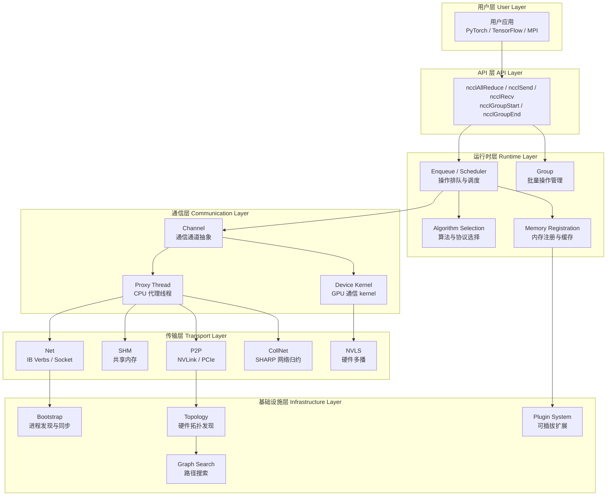

### 3.2 Host/Device 执行模型

NCCL 的核心设计是 **Host/Device 分离**：

- **Host 端 (CPU)**：负责初始化、拓扑发现、Channel 建立、Proxy 线程推进网络通信
- **Device 端 (GPU)**：负责数据搬运、规约计算、与 NVLink/PCIe 直连操作

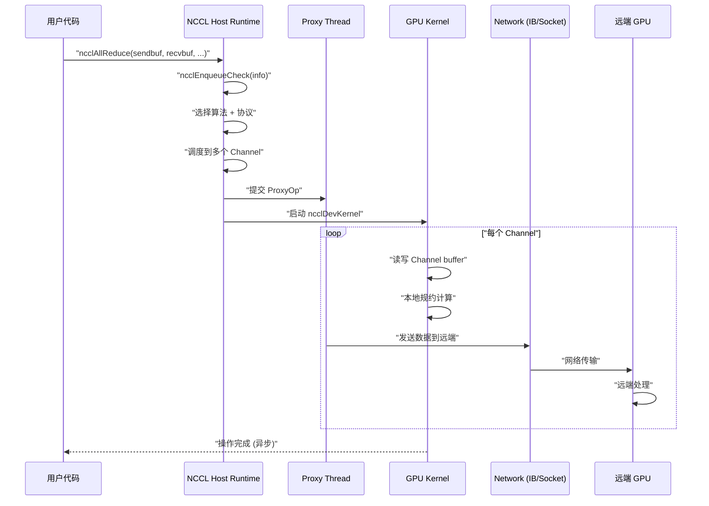

### 3.3 目录结构映射

| 目录 | 职责 |
|---|---|
| `src/*.cc` | Host 运行时：初始化、集合操作入口、Enqueue、Channel 管理 |
| `src/device/` | Device 代码：CUDA kernel、数据移动原语、集合算法 |
| `src/transport/` | 传输层：P2P、SHM、网络、CollNet、NVLS |
| `src/graph/` | 拓扑发现、路径搜索、Ring/Tree 构建、算法选择 |
| `src/plugin/` | 插件框架：网络、Tuner、Profiler、Env 插件 |
| `src/register/` | 内存注册缓存 |
| `src/scheduler/` | 操作调度 |
| `src/rma/` | 单边通信 (RMA) |
| `src/gas/` | 全局地址空间 |
| `src/gin/` | GIN 全局互连网络 |
| `src/ras/` | RAS 可靠性服务 |
| `src/include/` | 公共头文件 |
| `plugins/` | 独立插件实现 |
| `bindings/` | Python 绑定、LLVM IR 生成 |
| `contrib/` | 贡献代码 |

---

## 4. 公共 API 详解

### 4.1 核心数据类型

```c
// 通信子 (Communicator)
typedef struct ncclComm* ncclComm_t;
#define NCCL_COMM_NULL NULL

// 唯一标识符 (用于进程间初始握手)
#define NCCL_UNIQUE_ID_BYTES 128
typedef struct { char internal[NCCL_UNIQUE_ID_BYTES]; } ncclUniqueId;

// 返回码
typedef enum {
  ncclSuccess = 0,
  ncclUnhandledCudaError = 1,
  ncclSystemError = 2,
  ncclInternalError = 3,
  ncclInvalidArgument = 4,
  ncclInvalidUsage = 5,
  ncclRemoteError = 6,
  ncclInProgress = 7,
} ncclResult_t;

// 数据类型
typedef enum {
  ncclInt8 = 0,       // 8-bit 整数
  ncclUint8 = 1,      // 8-bit 无符号
  ncclInt32 = 2,      // 32-bit 整数
  ncclUint32 = 3,     // 32-bit 无符号
  ncclInt64 = 4,      // 64-bit 整数
  ncclUint64 = 5,     // 64-bit 无符号
  ncclFloat16 = 6,    // 半精度浮点 (fp16)
  ncclFloat32 = 7,    // 单精度浮点 (fp32)
  ncclFloat64 = 8,    // 双精度浮点 (fp64)
  ncclBfloat16 = 9,   // BFloat16
  ncclFloat8e4m3 = 10, // FP8 E4M3
  ncclFloat8e5m2 = 11, // FP8 E5M2
} ncclDataType_t;

// 规约操作
typedef enum {
  ncclSum = 0,   // 求和
  ncclProd = 1,  // 求积
  ncclMax = 2,   // 取最大值
  ncclMin = 3,   // 取最小值
  ncclAvg = 4,   // 取平均值
} ncclRedOp_t;
```

### 4.2 通信子管理 API

#### 4.2.1 初始化

```c
// 获取唯一 ID (由 rank 0 生成，广播给所有 rank)
ncclResult_t ncclGetUniqueId(ncclUniqueId* uniqueId);

// 使用 uniqueId 初始化通信子 (多进程模式)
ncclResult_t ncclCommInitRank(ncclComm_t* comm, int nranks,
                              ncclUniqueId commId, int rank);

// 带配置的初始化
ncclResult_t ncclCommInitRankConfig(ncclComm_t* comm, int nranks,
                                     ncclUniqueId commId, int rank,
                                     ncclConfig_t* config);

// 单进程多 GPU 初始化
ncclResult_t ncclCommInitAll(ncclComm_t* comm, int ndev, const int* devlist);
```

#### 4.2.2 销毁与错误处理

```c
ncclResult_t ncclCommFinalize(ncclComm_t comm);   // 优雅终止
ncclResult_t ncclCommDestroy(ncclComm_t comm);     // 销毁通信子
ncclResult_t ncclCommAbort(ncclComm_t comm);       // 强制中止
ncclResult_t ncclCommRevoke(ncclComm_t comm, int revokeFlags); // 撤销通信子

// 查询
ncclResult_t ncclCommGetAsyncError(ncclComm_t comm, ncclResult_t *asyncError);
ncclResult_t ncclCommCount(const ncclComm_t comm, int* count);
ncclResult_t ncclCommCuDevice(const ncclComm_t comm, int* device);
ncclResult_t ncclCommUserRank(const ncclComm_t comm, int* rank);
const char* ncclGetLastError(ncclComm_t comm);
```

#### 4.2.3 动态调整

```c
// 通信子分裂 (类似 MPI_Comm_split)
ncclResult_t ncclCommSplit(ncclComm_t comm, int color, int key,
                            ncclComm_t *newcomm, ncclConfig_t* config);

// 通信子收缩 (排除故障 rank)
ncclResult_t ncclCommShrink(ncclComm_t comm, int* excludeRanksList,
                             int excludeRanksCount, ncclComm_t* newcomm,
                             ncclConfig_t* config, int shrinkFlags);

// 通信子扩展 (增加新 rank)
ncclResult_t ncclCommGrow(ncclComm_t comm, int nRanks,
                           const ncclUniqueId* uniqueId, int rank,
                           ncclComm_t* newcomm, ncclConfig_t* config);
```

### 4.3 集合通信 API

#### 4.3.1 AllReduce

```c
ncclResult_t ncclAllReduce(const void* sendbuff, void* recvbuff,
    size_t count, ncclDataType_t datatype, ncclRedOp_t op,
    ncclComm_t comm, cudaStream_t stream);
```

**语义**：所有 rank 将 `sendbuff` 中的数据按 `op` 规约后，结果广播到所有 rank 的 `recvbuff`。

**数据流量**：
- Tree 算法：每个 rank 发送/接收约 `2 × count × sizeof(datatype) × log₂(N) / N`
- Ring 算法：每个 rank 发送约 `2 × (N-1) / N × count × sizeof(datatype)`

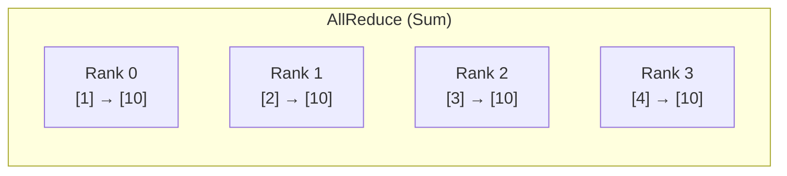

#### 4.3.2 AllGather

```c
ncclResult_t ncclAllGather(const void* sendbuff, void* recvbuff,
    size_t sendcount, ncclDataType_t datatype,
    ncclComm_t comm, cudaStream_t stream);
```

**语义**：每个 rank 贡献 `sendcount` 个元素，所有 rank 收集到全部数据。`recvbuff` 大小为 `nranks * sendcount`。

#### 4.3.3 ReduceScatter

```c
ncclResult_t ncclReduceScatter(const void* sendbuff, void* recvbuff,
    size_t recvcount, ncclDataType_t datatype, ncclRedOp_t op,
    ncclComm_t comm, cudaStream_t stream);
```

**语义**：对 `sendbuff` (大小 `nranks * recvcount`) 进行规约，然后每个 rank 获得等分后的一段。等价于 Reduce + Scatter。

#### 4.3.4 Broadcast

```c
ncclResult_t ncclBroadcast(const void* sendbuff, void* recvbuff,
    size_t count, ncclDataType_t datatype, int root,
    ncclComm_t comm, cudaStream_t stream);

// 原地版本
ncclResult_t ncclBcast(void* buff, size_t count, ncclDataType_t datatype,
    int root, ncclComm_t comm, cudaStream_t stream);
```

**语义**：root rank 将数据广播到所有 rank。

#### 4.3.5 Reduce

```c
ncclResult_t ncclReduce(const void* sendbuff, void* recvbuff,
    size_t count, ncclDataType_t datatype, ncclRedOp_t op, int root,
    ncclComm_t comm, cudaStream_t stream);
```

**语义**：所有 rank 的数据按 `op` 规约到 root rank 的 `recvbuff`。

#### 4.3.6 AlltoAll

```c
ncclResult_t ncclAlltoAll(const void* sendbuff, void* recvbuff,
    size_t count, ncclDataType_t datatype,
    ncclComm_t comm, cudaStream_t stream);
```

**语义**：每个 rank 向每个其他 rank 发送不同的数据段，实现全交换。

#### 4.3.7 Gather / Scatter

```c
ncclResult_t ncclGather(const void* sendbuff, void* recvbuff,
    size_t count, ncclDataType_t datatype, int root,
    ncclComm_t comm, cudaStream_t stream);

ncclResult_t ncclScatter(const void* sendbuff, void* recvbuff,
    size_t count, ncclDataType_t datatype, int root,
    ncclComm_t comm, cudaStream_t stream);
```

#### 4.3.8 点对点 Send/Recv

```c
ncclResult_t ncclSend(const void* sendbuff, size_t count,
    ncclDataType_t datatype, int peer, ncclComm_t comm,
    cudaStream_t stream);

ncclResult_t ncclRecv(void* recvbuff, size_t count,
    ncclDataType_t datatype, int peer, ncclComm_t comm,
    cudaStream_t stream);
```

**语义**：Send/Recv 必须成对调用，类似 MPI 的 `MPI_Send`/`MPI_Recv`。

#### 4.3.9 单边操作 (One-Sided)

```c
// Put + Signal：将本地数据写入远端 window 并发信号
ncclResult_t ncclPutSignal(const void* localbuff, size_t count,
    ncclDataType_t datatype, int peer, ncclWindow_t peerWin,
    size_t peerWinOffset, int sigIdx, int ctx, unsigned int flags,
    ncclComm_t comm, cudaStream_t stream);

// Signal：向远端发送信号
ncclResult_t ncclSignal(int peer, int sigIdx, int ctx,
    unsigned int flags, ncclComm_t comm, cudaStream_t stream);

// WaitSignal：等待来自远端的信号
ncclResult_t ncclWaitSignal(int nDesc, ncclWaitSignalDesc_t* signalDescs,
    ncclComm_t comm, cudaStream_t stream);
```

### 4.4 Group API

```c
ncclResult_t ncclGroupStart();
// ... 多个集合操作调用 ...
ncclResult_t ncclGroupEnd();
```

**语义**：将多个集合操作批量化，NCCL 在 GroupEnd 时统一调度、优化和启动。这在多通信子场景 (如张量并行) 中特别重要。

### 4.5 内存管理 API

```c
ncclResult_t ncclMemAlloc(void** ptr, size_t size);
ncclResult_t ncclMemFree(void *ptr);

// 缓冲区注册 (用于 RDMA 加速)
ncclResult_t ncclCommRegister(const ncclComm_t comm, void* buff,
                               size_t size, void** handle);
ncclResult_t ncclCommDeregister(const ncclComm_t comm, void* handle);

// Window 注册 (用于单边通信和对称内存)
ncclResult_t ncclCommWindowRegister(ncclComm_t comm, void* buff,
    size_t size, ncclWindow_t* win, int winFlags);
ncclResult_t ncclCommWindowDeregister(ncclComm_t comm, ncclWindow_t win);
```

### 4.6 配置结构

```c
typedef struct ncclConfig_t {
  int blocking;           // 阻塞/非阻塞模式
  int cgaClusterSize;     // CGA 集群大小
  int minCTAs;            // 最小 CTA 数
  int maxCTAs;            // 最大 CTA 数
  const char *netName;    // 指定网络插件
  int splitShare;         // CommSplit 是否共享资源
  int trafficClass;       // 流量类别
  const char *commName;   // 通信子名称
  int collnetEnable;      // 启用 CollNet
  int CTAPolicy;          // CTA 调度策略
  int shrinkShare;        // CommShrink 是否共享资源
  int nvlsCTAs;           // NVLS CTA 数量
  int nChannelsPerNetPeer;// 每个 network peer 的 channel 数
  int nvlinkCentricSched; // NVLink 优先调度
  int graphUsageMode;     // CUDA Graph 使用模式
  int numRmaCtx;          // RMA 上下文数
} ncclConfig_t;
```

---

## 5. 初始化流程

### 5.1 总体流程

NCCL 的初始化是最复杂的部分，涉及进程发现、拓扑构建、Channel 分配、传输建立等多步操作。

```mermaid
flowchart TD
    A["ncclGetUniqueId()"] --> B["广播 uniqueId 给所有 rank"]
    B --> C["ncclCommInitRank()"]
    C --> D["ncclInit() 全局一次性初始化"]
    D --> E["commAlloc() 分配通信子结构"]
    E --> F["bootstrapInit() 进程发现与同步"]
    F --> G["ncclTopoGetSystem() 拓扑发现"]
    G --> H["ncclTopoComputeCommCPU() CPU 架构检测"]
    H --> I["ncclTopoSearchInit() 初始化搜索参数"]
    I --> J["initTransportsRank() 传输层初始化"]
    J --> K["拓扑图搜索"]
    K --> L["Channel 分配"]
    L --> M["传输连接建立"]
    M --> N["Proxy 线程启动"]
    N --> O["devCommSetup() Device 端通信子设置"]
    O --> P["ncclCeInit() CopyEngine 初始化"]
    P --> Q["ncclRmaInit() RMA 初始化"]
    Q --> R["初始化完成"]

    style A fill:"#e1f5fe"
    style C fill:"#e1f5fe"
    style E fill:"#fff3e0"
    style F fill:"#fff3e0"
    style G fill:"#f3e5f5"
    style J fill:"#f3e5f5"
    style O fill:"#e8f5e9"
```

### 5.2 全局初始化 (ncclInit)

`ncclInit()` 使用 `std::call_once` 保证只执行一次：
1. `ncclOsInitialize()` — 操作系统级初始化
2. `initGdrCopy()` — 初始化 GPUDirect RDMA Copy (如果启用)
3. `bootstrapNetInit()` — 初始化 Bootstrap 网络 (Socket 接口选择)

### 5.3 Bootstrap 流程

Bootstrap 是 NCCL 在尚未建立任何通信通道之前的进程发现与同步机制，基于 TCP Socket 实现。

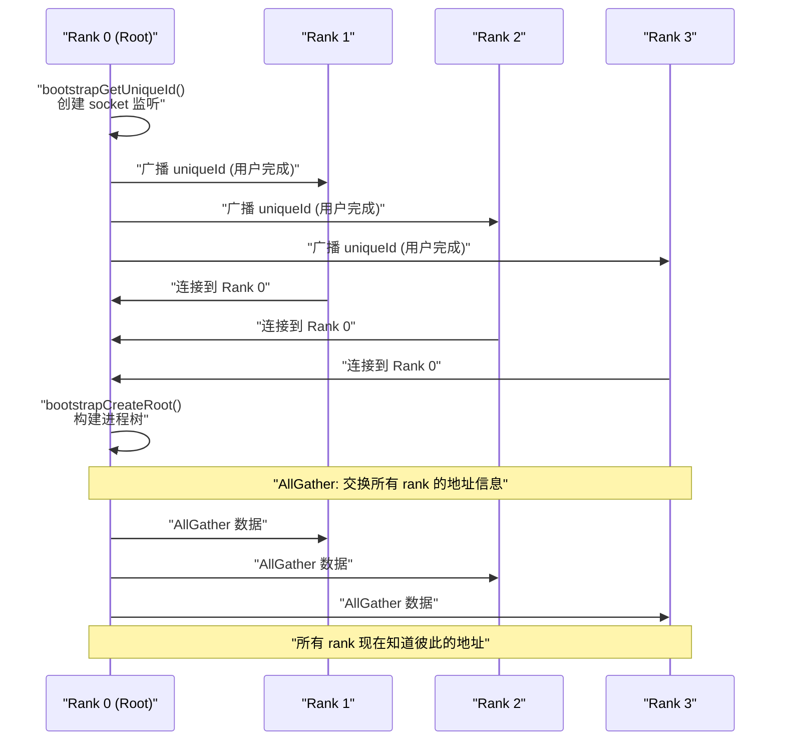

Bootstrap 的关键数据结构是 `ncclBootstrapHandle`，它包含：
- Root 监听 socket 的地址
- 一个 magic number 用于防碰撞

Bootstrap 实现了以下原语：
- **AllGather**：收集所有 rank 的信息
- **AllReduce**：对整数值的全局归约
- **Barrier**：全局同步屏障
- **Send/Recv**：点对点数据交换 (用于传输建立阶段)

### 5.4 通信子分配 (commAlloc)

`commAlloc()` 负责分配和初始化 `ncclComm` 结构体的核心字段：

1. 分配永久内存池 (`memPermanent`) 和作用域内存池 (`memScoped`)
2. 创建/共享 `ncclSharedResources` (跨 split 通信子共享的资源)
3. 初始化网络 (`ncclNetInit`) 和 GIN (`ncclGinInit`)
4. 获取 CUDA 设备信息 (busId, nvmlDev, compCap)
5. 初始化 DMA-BUF 支持检测
6. 创建内存池 (`cudaMemPoolCreate`)
7. 初始化 Channel 数组 (`comm->channels[MAXCHANNELS]`)

### 5.5 传输层初始化 (initTransportsRank)

这是初始化中最核心的步骤，定义在 `src/graph/` 相关代码中：

1. **拓扑构建** (`ncclTopoGetSystem`)
   - 通过 NVML 查询 GPU 拓扑
   - 检测 NVLink、PCIe、CPU、NIC 节点及其互连
   - 计算任意两个节点之间的路径带宽

2. **图搜索** (`ncclTopoSearchInit` + 搜索算法)
   - 为每种集合操作类型搜索最优通信图 (Ring/Tree)
   - 考虑带宽、延迟、拓扑距离等因素
   - 分配 Channel 给不同的通信路径

3. **传输选择**
   - 对每对需要通信的 rank，按优先级尝试传输：P2P > SHM > Net
   - `canConnect()` 检查物理可达性
   - `setup()` 建立 send/recv 连接器

4. **连接建立** (`ncclTransportP2pSetup`)
   - 通过 Bootstrap 交换连接信息 (`ncclConnect`)
   - 每对 rank 互发自己的连接参数
   - 建立 Proxy 连接

---

## 6. Channel 机制

### 6.1 Channel 概念

Channel 是 NCCL 中最核心的抽象。每个 Channel 代表一个独立的通信路径，包含：
- 一对发送/接收缓冲区
- 到每个 peer 的发送/接收连接器
- Ring 或 Tree 的 rank 排列
- 独立的状态机

### 6.2 Channel 结构

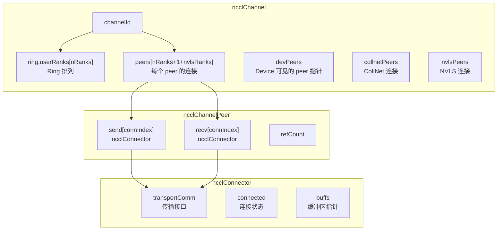

### 6.3 Channel 初始化

`initChannel()` (定义在 `src/channel.cc`) 的步骤：
1. 设置 `channel->id = channelId`
2. 分配 `peers` 数组 (nRanks + 1 for CollNet + nvlsRanks for NVLS)
3. 从共享资源 (`sharedRes`) 获取或分配 peer 结构
4. 分配 Device 端 peer 结构 (`devPeers`)
5. 分配 Ring 排列数组 (`ring.userRanks`)
6. 将 host 数据拷贝到 device

### 6.4 多 Channel 并行

NCCL 默认使用多个 Channel 来并行化通信，充分利用硬件带宽。Channel 数量由拓扑和配置决定：
- 每个 NVLink 连接可以分配多个 Channel
- 网络路径也分配多个 Channel
- `MAXCHANNELS = 64` (定义在 `src/include/device.h`) 定义了上限
- 实际使用的 Channel 数由图搜索算法根据拓扑确定

### 6.5 Channel Buffer 同步模型

每个 Channel 连接使用 **Producer-Consumer** 模型进行同步，核心是 `ncclSendMem` 和 `ncclRecvMem` 结构：

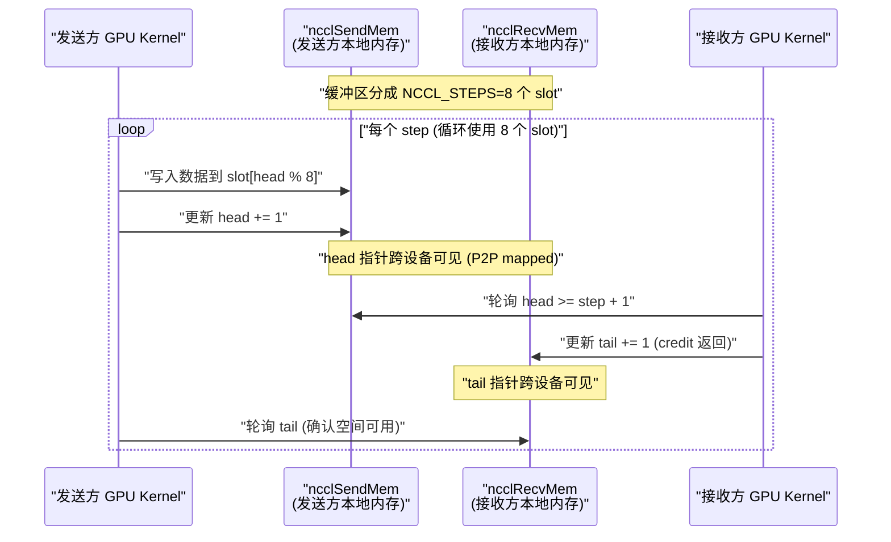

关键设计：
- **NCCL_STEPS = 8**：缓冲区被分为 8 个 slot，允许最多 8 个 step 同时在流水线中
- **head/tail 指针**：发送方维护 `head` (已写位置)，接收方维护 `tail` (已读位置)
- **流量控制**：发送方在 `head - tail >= NCCL_STEPS` 时阻塞等待，确保不会覆盖未读数据
- **跨设备映射**：对于 P2P 传输，`SendMem`/`RecvMem` 通过 NVLink/PCIe P2P 映射到远端 GPU

---

## 7. 集合通信操作流程

### 7.1 从 API 到 Kernel 的完整路径

以 `ncclAllReduce` 为例，展示完整的调用链：

```mermaid
flowchart TD
    A["ncclAllReduce()"] --> B["构造 ncclInfo"]
    B --> C["ncclEnqueueCheck(&info)"]
    C --> D["ncclGroupStart()? 检查是否在 Group 内"]
    D --> E["ncclEnqueue()"]
    E --> F["选择算法 (Tree/Ring/NVLS/CollNet/PAT)"]
    F --> G["选择协议 (LL/LL128/Simple)"]
    G --> H["计算 Channel 分配"]
    H --> I["构建 ProxyOps"]
    I --> J["构建 WorkBatch"]
    J --> K["ncclGroupEnd()? 是否在 Group 内"]
    K -->|是| L["等待 GroupEnd 统一调度"]
    K -->|否| M["立即调度"]
    L --> M
    M --> N["ncclKernelPlanExecute()"]
    N --> O["启动 CUDA Kernel"]
    O --> P["ncclDevKernel 在 GPU 上执行"]
    P --> Q["Kernel 通过 Channel buffer 通信"]
    Q --> R["Proxy 线程推进网络传输"]
    R --> S["操作完成"]

    style A fill:"#e1f5fe"
    style P fill:"#e8f5e9"
    style R fill:"#fff3e0"
```

### 7.2 ncclInfo 结构

每个集合操作首先被封装为 `ncclInfo` 结构：

```c
struct ncclInfo {
  ncclFunc_t collOp;       // 操作类型 (AllReduce, AllGather, ...)
  const char* collName;     // 操作名称字符串
  const void* sendbuff;     // 发送缓冲区
  void* recvbuff;           // 接收缓冲区
  size_t count;             // 元素数量
  ncclDataType_t datatype;  // 数据类型
  ncclRedOp_t op;           // 规约操作
  int root;                 // root rank (用于 Broadcast, Reduce)
  ncclComm_t comm;          // 通信子
  cudaStream_t stream;      // CUDA 流
  int chunkSteps;           // 块步数
  int sliceSteps;           // 切片步数
};
```

### 7.3 算法选择

NCCL 支持的算法 (定义在 `src/init.cc`):

```c
enum {
  NCCL_ALGO_TREE = 0,        // 树形算法
  NCCL_ALGO_RING = 1,        // 环形算法
  NCCL_ALGO_COLLNET_DIRECT = 2, // CollNet 直接
  NCCL_ALGO_COLLNET_CHAIN = 3,  // CollNet 链式
  NCCL_ALGO_NVLS = 4,        // NVLS 硬件多播
  NCCL_ALGO_NVLSTree = 5,    // NVLS 树
  NCCL_ALGO_PAT = 6,         // PAT 算法
};
```

**算法选择依据**：
- **Tree**：适用于中小规模 AllReduce/Reduce，延迟低
- **Ring**：适用于大规模 AllReduce/AllGather/ReduceScatter，带宽利用率高
- **CollNet**：有 SHARP 网络硬件时使用，网络内完成规约
- **NVLS**：NVLink SHARP 硬件可用时，节点内使用硬件多播

### 7.4 协议选择

NCCL 支持三种协议：

| 协议 | 特点 | 适用场景 |
|---|---|---|
| **Simple** | 大块传输，高带宽利用率 | 大消息 (>256KB) |
| **LL128** | 128 字节 cache line 粒度，每行 1 个 flag | 中等消息 |
| **LL (Low Latency)** | 16 字节行格式 (8B 数据 + 8B flag)，最小延迟 | 小消息，延迟敏感 |

### 7.5 Enqueue 流程

`ncclEnqueueCheck()` (定义在 `src/enqueue.cc`) 是所有集合操作的统一入口：

1. **参数检查** (`ncclArgCheck`)
2. **通信子状态检查** (`ncclCommEnsureReady`)
3. **构造异步任务** (`ncclAsyncLaunch`)
4. 如果在 Group 内，入队等待 GroupEnd
5. 如果不在 Group 内，直接执行

在 `ncclEnqueue()` 中：
1. 获取算法和协议选择
2. 检查是否需要预连接 (Runtime Connect)
3. 构建操作计划 (`ncclKernelPlan`)
4. 对每个 Channel：
   - 构建 WorkBatch (`ncclAddWorkBatchToPlan`)
   - 构建 ProxyOp (`ncclAddProxyOpIfNeeded`)
5. 执行计划 (`ncclKernelPlanExecute`)

### 7.6 WorkBatch 与 WorkFifo

NCCL 使用 WorkFifo 机制将 Host 端的操作计划传递给 Device 端：

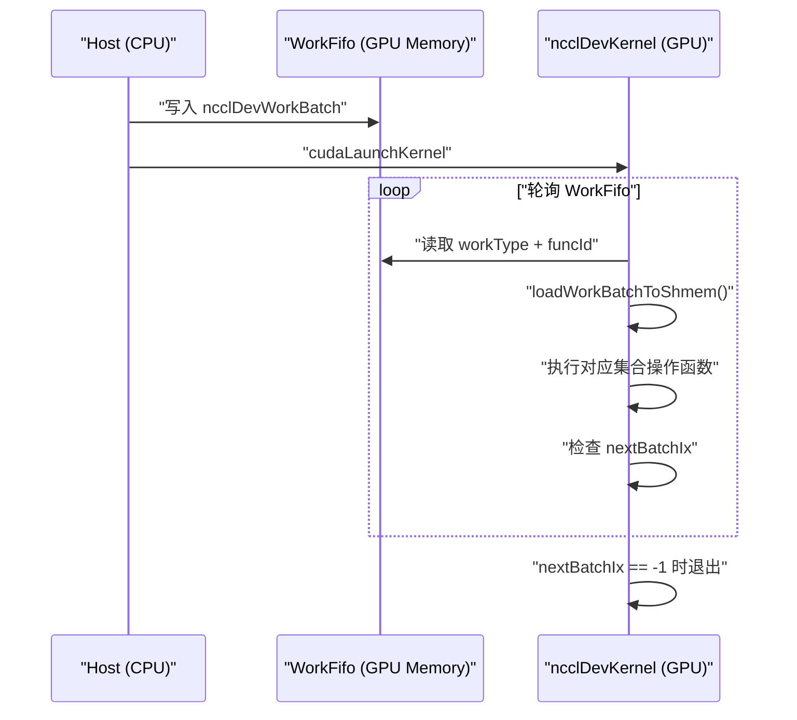

WorkBatch 的关键结构字段：

```c
struct ncclDevWorkBatch {
  uint32_t nextJump:14;      // 跳转到同一 channel 的下一个 batch
  uint32_t nextExtends:1;    // 下一个 batch 是否扩展当前 batch
  uint32_t workType:2;       // P2p, Coll, CollReg, Bcast
  uint32_t funcId:15;        // Kernel 函数索引
  uint32_t offsetBase;       // Work 结构在 FIFO 中的偏移
  uint64_t offsetBitset;     // 位图标记哪些 work 在此 batch 中
};
```

每个 CTA (Thread Block) 对应一个 Channel (`blockIdx.x`)，通过 `nextJump` 链表遍历该 Channel 上的所有 WorkBatch。

---

## 8. 传输层 (Transport)

### 8.1 传输接口

所有传输实现都遵循统一的接口 (`ncclTransportComm`)：

```c
struct ncclTransportComm {
  // 建立连接
  ncclResult_t (*setup)(comm, graph, myInfo, peerInfo, connect, connector, channelId, connIndex);
  ncclResult_t (*connect)(comm, connect, nranks, rank, connector);

  // 释放
  ncclResult_t (*free)(comm, connector);

  // Proxy 操作
  ncclResult_t (*proxySharedInit)(connection, proxyState, nChannels);
  ncclResult_t (*proxySetup)(connection, proxyState, reqBuff, reqSize, respBuff, respSize, done);
  ncclResult_t (*proxyConnect)(connection, proxyState, reqBuff, reqSize, respBuff, respSize, done);
  ncclResult_t (*proxyFree)(connection, proxyState);
  ncclResult_t (*proxyProgress)(proxyState, proxyArgs);  // 核心：推进数据传输
  ncclResult_t (*proxyRegister)(connection, proxyState, reqBuff, reqSize, respBuff, respSize, done);
  ncclResult_t (*proxyDeregister)(connection, proxyState, reqBuff, reqSize, done);
};
```

### 8.2 传输选择流程

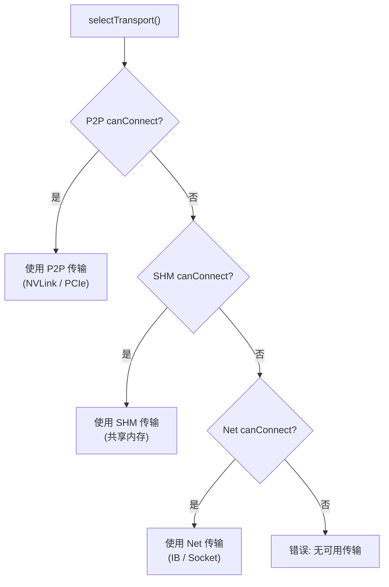

选择优先级：**P2P > SHM > Net**

### 8.3 P2P 传输 (`src/transport/p2p.cc`)

P2P 传输利用 GPU 间的直接互连 (NVLink 或 PCIe P2P) 进行通信：

- **NVLink**：最高带宽 (可达 900 GB/s)，用于同节点 GPU 间通信
- **PCIe P2P**：中等带宽，需要 GPU 支持 P2P，可能经过 CPU 交换

P2P 传输的特点：
- GPU kernel 直接读写远端 GPU 内存 (通过 NVLink 或 PCIe P2P 映射)
- **数据搬运不需要 Proxy 线程参与** — GPU kernel 自身完成所有数据搬移
- Proxy 仅用于连接建立和拆卸
- 支持四种模式：
  - **P2P_DIRECT**：同进程，直接指针访问
  - **P2P_IPC**：跨进程，通过 CUDA IPC handle 映射远端内存
  - **P2P_CUMEM**：通过 cuMem API 共享内存句柄
  - **P2P_INTERMEDIATE**：通过中间 rank 间接访问 (无直接 P2P 连接时)

### 8.4 SHM 传输 (`src/transport/shm.cc`)

共享内存传输用于同一节点上不支持 P2P 的 GPU 之间：

- 使用 POSIX 共享内存 (`shm_open`) 或 CUDA IPC 作为传输媒介
- Proxy 线程负责在共享内存和 GPU 之间搬运数据
- 带宽通常低于 P2P

### 8.5 网络传输 (`src/transport/net.cc`, `net_socket.cc`, `net_ib/`)

网络传输用于跨节点通信，支持两种后端：

#### 8.5.1 Socket 传输 (`net_socket.cc`)
- 基于 TCP/IP 的传输
- 通用性好，无需特殊硬件
- 带宽和延迟相对较高
- 作为 fallback 方案

#### 8.5.2 InfiniBand 传输 (`net_ib/`)
- 基于 IB Verbs 的高性能传输
- 支持 RDMA 写入
- 可选 GPUDirect RDMA (GDRCopy) 减少数据拷贝
- 可选 MLX5 Direct Verbs 绕过内核
- 支持 DOCA GPUNetIO (`net_ib/gdaki/`) 实现 GPU 直接网络通信

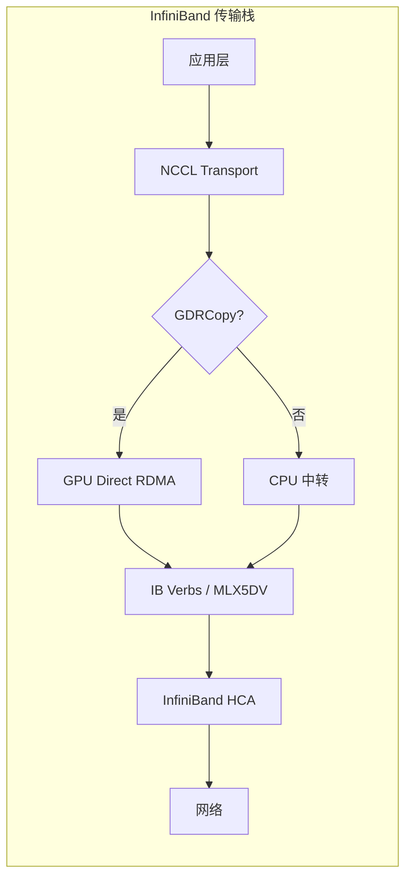

### 8.6 CollNet 传输 (`src/transport/coll_net.cc`)

CollNet 利用 SHARP (Scalable Hierarchical Aggregation and Reduction Protocol) 网络硬件：

- 在网络交换机内完成规约操作
- 大幅减少跨节点数据量
- 支持 Direct 模式 (GPU 直连网络) 和 Chain 模式 (通过 CPU)

### 8.7 NVLS 传输 (`src/transport/nvls.cc`)

NVLS (NVLink SHARP) 利用 NVIDIA NVLink 的硬件多播能力：

- 使用 CUDA 的 `CUmemGenericAllocationHandle` 创建多播内存
- 硬件级别的一对多数据复制
- 仅适用于 NVSwitch 连接的同节点 GPU

---

## 9. Proxy 机制

### 9.1 Proxy 的作用

Proxy 线程是 NCCL 中负责推进网络通信的 CPU 线程。当 GPU kernel 无法直接完成通信时 (如跨节点网络传输)，由 Proxy 线程代理完成。每个 GPU 创建 **三个 Proxy 线程**：
- **Proxy Service Thread** (`ncclProxyService`) — 处理连接建立和异步操作
- **Proxy Progress Thread** (`ncclProxyProgress`) — 推进活跃的数据传输操作
- **UDS Service Thread** (`ncclProxyServiceUDS`) — 处理用户自定义服务请求 (如内存注册/反注册)

### 9.2 Proxy 线程架构

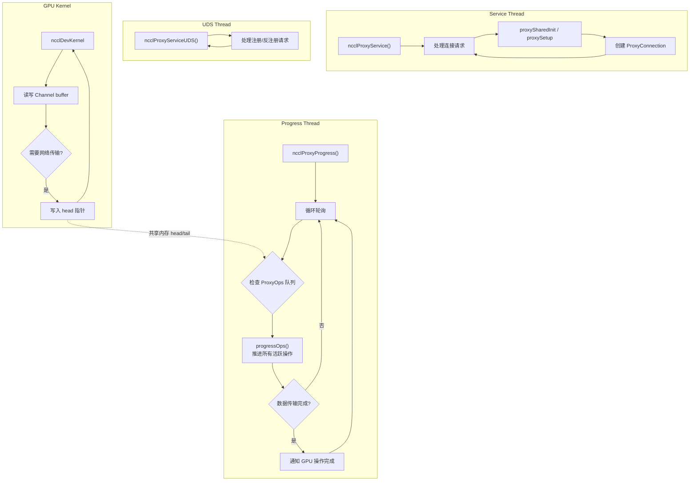

### 9.3 ProxyOp 生命周期

```mermaid
stateDiagram-v2
    [*] --> "创建 ProxyOp"
    "创建 ProxyOp" --> "Proxy 线程拾取"
    "Proxy 线程拾取" --> "执行 proxyProgress()"
    "执行 proxyProgress()" --> "数据传输中"
    "数据传输中" --> "执行 proxyProgress()"
    "执行 proxyProgress()" --> "传输完成"
    "传输完成" --> "设置 done 标志"
    "设置 done 标志" --> [*]
```

### 9.4 Proxy 连接管理

每个 Proxy 线程管理多个 Proxy 连接 (`ncclProxyConnection`)，每个连接对应一个网络传输通道。连接可以共享给多个 Channel 使用 (`proxySharedInit`)。

### 9.5 UDS (User Defined Service) 支持

Proxy 还支持 UDS 接口，允许外部服务通过 Proxy 线程执行自定义操作 (如注册/反注册)。

---

## 10. 拓扑发现与图搜索

### 10.1 拓扑节点类型

```c
enum ncclTopoNodeType {
  GPU,   // GPU 设备
  PCI,   // PCI 设备 (包括 PCI Switch)
  NVS,   // NVSwitch
  CPU,   // CPU / NUMA 节点
  NIC,   // 网卡
  NET,   // 网络设备
  GIN,   // GIN 设备
};
```

### 10.2 链路类型与路径类型

**链路类型 (Link Type)**:

| 类型 | 含义 | 典型带宽 |
|---|---|---|
| LOC | 本地 | N/A |
| NVL | NVLink (per link) | 25-100 GB/s (聚合可达 900 GB/s) |
| C2C | Chip-to-Chip (Grace-Hopper) | ~300 GB/s |
| PCI | PCIe | 16-64 GB/s (Gen3-Gen5 x16) |
| SYS | 跨 NUMA/Socket (UPI/QPI) | 20-40 GB/s |
| NET | 网络 (IB/Ethernet) | 12.5-400 Gb/s (1.5-50 GB/s) |

**路径类型 (Path Type)** — 从近到远（定义在 `src/graph/topo.h`）：

| 类型 | 值 | 含义 |
|---|---|---|
| PATH_LOC | 0 | 同一 GPU (本地) |
| PATH_NVL | 1 | NVLink 直连 |
| PATH_NVB | 2 | 经过 NVSwitch 或中间 GPU 的 NVLink |
| PATH_C2C | 3 | Chip-to-Chip 连接 (Grace-Hopper) |
| PATH_PIX | 4 | 同一 PCIe Switch 下 |
| PATH_PXB | 5 | 同一 CPU 下但不同 PCIe Switch |
| PATH_P2C | 6 | GPU 通过 C2C 到 CPU 再经 PCIe 到 NIC |
| PATH_PXN | 7 | 通过中间 GPU 的 PCIe 路径 (NIC 聚合) |
| PATH_PHB | 8 | 同一 PCIe Host Bridge (同 NUMA 节点) |
| PATH_SYS | 9 | 跨 Socket / 跨 NUMA (QPI/UPI) |
| PATH_NET | 10 | 通过网络 (跨节点) |
| PATH_DIS | 11 | 断开 / 不可达 |

### 10.3 拓扑发现流程

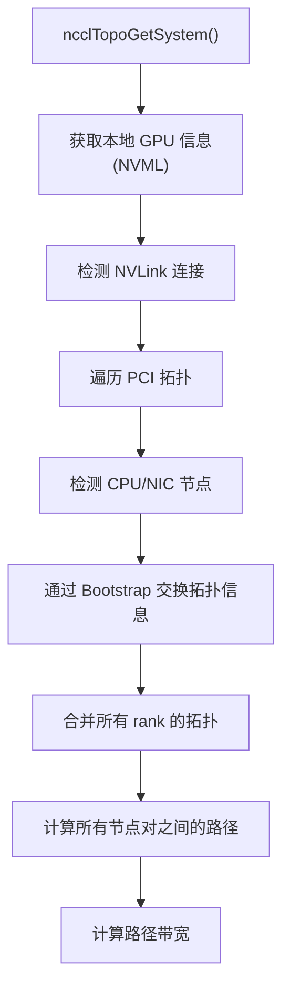

### 10.4 图搜索

图搜索 (`src/graph/search.cc`) 为每种集合操作类型寻找最优的通信图：

1. **Ring 搜索** (`rings.cc`)：为 AllReduce/AllGather/ReduceScatter 寻找最优环形排列
2. **Tree 搜索** (`trees.cc`)：为 AllReduce/Reduce/Broadcast 构建 double-tree
3. **路径搜索** (`paths.cc`)：计算任意 rank 对之间的最优路径

搜索算法会：
- 考虑带宽约束 (NVLink > PCIe > 网络)
- 尽量利用高带宽路径
- 分配 Channel 到不同路径
- 处理非对称拓扑

---

## 11. 算法与协议

### 11.1 Ring 算法

Ring 算法将所有 rank 排列成一个环，数据沿环传递：


**Ring AllReduce** 分为两个阶段：
1. **ReduceScatter 阶段**：`N-1` 步，每步发送 `count/N` 数据
2. **AllGather 阶段**：`N-1` 步，每步发送 `count/N` 数据

总数据量：`2 * (N-1) / N * count * size`，每步发送 `count/N` 数据，链路带宽利用率接近 100%

### 11.2 Tree 算法

Tree 算法使用二叉树结构，NCCL 使用 **double tree** 消除树根瓶颈：

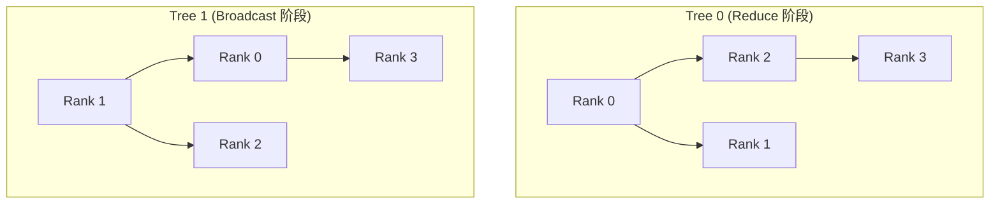

**Tree AllReduce**：
1. **Reduce 阶段**：叶子到根，`log2(N)` 步
2. **Broadcast 阶段**：根到叶子，`log2(N)` 步

### 11.3 CollNet 算法

利用网络硬件 (SHARP) 在交换机内完成规约：
- **Chain 模式**：GPU -> CPU -> 网络 -> SHARP -> 网络 -> CPU -> GPU
- **Direct 模式**：GPU 直接通过 GDR 发送到网络，SHARP 完成规约

### 11.4 NVLS 算法

利用 NVLink SHARP 的硬件多播：
1. 创建多播内存对象
2. 所有 GPU 直接写入多播地址
3. 硬件自动完成规约
4. 结果对所有 GPU 可见

### 11.5 PAT 算法

PAT (Parameter-Aware Tuning) 是根据参数特征动态选择最优通信路径的算法。

### 11.6 协议细节

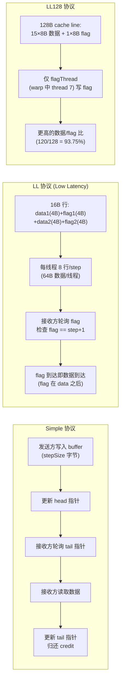

---

## 12. Device 代码架构

### 12.1 Device 代码组织

```
src/device/
├── common.cu          # Device 运行时，ncclDevKernel 入口
├── common.h           # 共享数据结构
├── common_kernel.h    # Kernel 内部使用的数据结构和辅助函数
├── generate.py        # 代码生成器 (生成特化的 kernel 变体)
├── primitives.h       # 数据移动原语类模板
├── prims_ll.h         # LL 协议原语
├── prims_ll128.h      # LL128 协议原语
├── prims_simple.h     # Simple 协议原语
├── all_reduce.h       # AllReduce 算法实现
├── all_gather.h       # AllGather 算法实现
├── all_gather_v.h     # 变长 AllGather
├── broadcast.h        # Broadcast 算法实现
├── reduce.h           # Reduce 算法实现
├── reduce_scatter.h   # ReduceScatter 算法实现
├── sendrecv.h         # Send/Recv 算法实现
├── op128.h            # 128 字节操作
├── network/           # GPU 发起的网络操作
└── symmetric/         # 对称内存相关
```

### 12.2 Kernel 入口

```c
__global__ void ncclDevKernel_Generic(ncclDevKernelArgs4K args4K) {
  ncclKernelMain<-1, RunWorkNop>(&args4K.args);
}
```

`ncclKernelMain` 是所有 NCCL kernel 的统一入口，它：
1. 从 kernel 参数获取 `ncclDevComm` 和 Channel 信息
2. 轮询 WorkFifo 获取 WorkBatch
3. 根据 `workType` 和 `funcId` 调用对应的集合操作函数

### 12.3 代码生成系统

`generate.py` 是 NCCL Device 代码的核心基础设施：

1. 读取所有算法头文件 (`.h`) 中的函数模板
2. 为每种数据类型 × 规约操作 × 协议 × Channel 配置的组合生成特化代码
3. 输出到 `build/obj/device/gensrc/`
4. 生成 `rules.mk` 供 Make 使用

这种设计使得算法代码可以高度模板化，同时通过代码生成获得最优的编译特化。

### 12.4 Primitives 架构

Primitives 是 Device 代码中最底层的抽象，封装了数据搬移的核心逻辑：

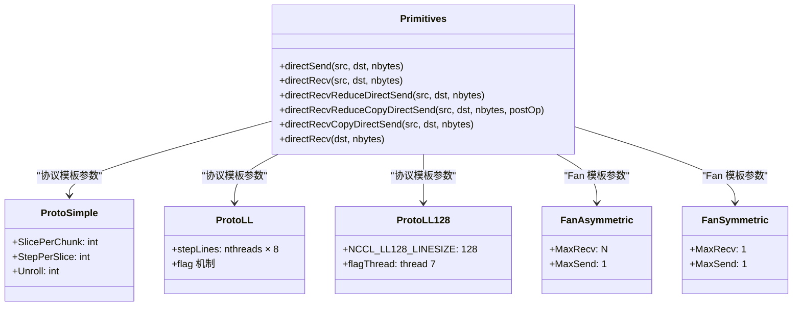

每个 Primitive 对象在构造时绑定到一个 Channel，负责：
- 管理 Channel buffer 的读写指针
- 根据协议类型处理 flag/同步
- 调用传输接口完成数据发送/接收
- 执行本地规约操作

### 12.5 共享内存 (Shared Memory)

NCCL kernel 大量使用 CUDA 共享内存 (`__shared__`) 来存储：
- Channel 元数据 (`ncclShmem`)
- 中间计算结果
- 协议相关的 flag 和 buffer

```c
__shared__ ncclShmemData ncclShmem;
```

---

## 13. Group 机制

### 13.1 Group 的作用

Group 机制允许用户将多个集合操作批量提交，NCCL 可以对它们进行全局优化：

```c
ncclGroupStart();
ncclAllReduce(sendbuf1, recvbuf1, ..., comm1, stream1);
ncclAllReduce(sendbuf2, recvbuf2, ..., comm2, stream2);
ncclBroadcast(sendbuf3, recvbuf3, ..., comm3, stream3);
ncclGroupEnd();
```

### 13.2 Group 实现机制

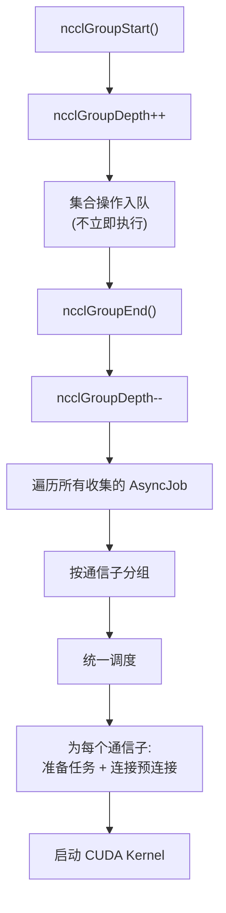

### 13.3 阻塞 vs 非阻塞

Group 支持阻塞和非阻塞模式：
- **阻塞** (`blocking=1`)：`ncclGroupEnd()` 等待所有操作完成
- **非阻塞** (`blocking=0`)：`ncclGroupEnd()` 立即返回，操作异步进行

### 13.4 AsyncJob 系统

每个 Group 内的操作被封装为 `ncclAsyncJob`，通过线程池异步执行连接预连接等耗时操作。

---

## 14. 插件系统

### 14.1 插件类型

NCCL 支持四类插件：

| 插件类型 | 目录 | 作用 |
|---|---|---|
| **Network** | `src/plugin/net/` | 自定义网络传输 |
| **Tuner** | `src/plugin/tuner/` | 覆盖默认算法选择 |
| **Profiler** | `src/plugin/profiler/` | 性能分析回调 |
| **Env** | `src/plugin/env/` | 环境感知优化 |

### 14.2 插件加载机制

插件通过 `dlopen`/`dlsym` 动态加载 (`src/plugin/plugin_open.cc`)：

```mermaid
flowchart TD
    A["ncclPluginOpen()"] --> B["读取环境变量<br/>NCCL_PLUGIN_PATH"]
    B --> C["dlopen(plugin.so)"]
    C --> D["dlsym("ncclPluginInit")"]
    D --> E["调用 ncclPluginInit()"]
    E --> F["插件注册自定义钩子"]
```

### 14.3 Network Plugin

网络插件允许用户自定义网络传输实现。接口定义了：
- `init()` — 初始化网络
- `getProperties()` — 获取网络属性
- `listen()` / `connect()` — 建立连接
- `isend()` / `irecv()` — 异步发送/接收
- `test()` — 测试完成状态
- `regMr()` / `deregMr()` — 内存注册/反注册

### 14.4 Tuner Plugin

Tuner 插件允许覆盖 NCCL 默认的算法选择逻辑。接口：
- `init()` — 初始化
- `getCollInfo()` — 返回推荐的算法、协议和 Channel 数量

### 14.5 Profiler Plugin

Profiler 插件提供性能分析回调：
- 集合操作开始/结束回调
- Proxy 操作回调
- 传输层回调

### 14.6 Env Plugin

Env 插件允许根据运行环境 (如云厂商) 进行优化调整。

---

## 15. 内存注册与缓存

### 15.1 内存注册的作用

内存注册将用户缓冲区注册到网络传输层，使得：
- InfiniBand 可以进行 RDMA 操作
- 避免每次操作重新 pin 内存
- 支持 GDRCopy 直接从 GPU 拷贝

### 15.2 注册缓存

NCCL 维护注册缓存 (`src/register/`)，避免重复注册：
- 按 page 粒度缓存注册状态
- 使用区间树 (interval tree) 快速查找
- 支持多 segment 注册 (Multi-Segment Registration)

### 15.3 DMA-BUF 支持

在支持 DMA-BUF 的系统上，NCCL 使用 `cudaMalloc` 返回的 DMA-BUF fd 进行注册，避免额外的内存拷贝。

---

## 16. NVLS (NVLink SHARP) 硬件加速

### 16.1 NVLS 原理

NVLS 利用 NVSwitch 的硬件多播能力，允许一次写入被多个 GPU 同时看到：

```mermaid
graph TD
    subgraph "NVLS 多播"
        GPU0["GPU 0 写入"]
        GPU1["GPU 1"]
        GPU2["GPU 2"]
        GPU3["GPU 3"]
        NVS["NVSwitch"]

        GPU0 -->|"写入多播地址"| NVS
        NVS -->|"多播"| GPU1
        NVS -->|"多播"| GPU2
        NVS -->|"多播"| GPU3
    end
```

### 16.2 NVLS 实现细节

NVLS 使用 CUDA 的 Multicast Memory API：
1. `CUmemGenericAllocationHandle` — 分配多播内存句柄
2. 创建 Unicast 和 Multicast 映射
3. 分配 Credit buffer 用于流控
4. GPU kernel 直接写入 Multicast 地址

### 16.3 NVLS Channel

NVLS 为每个 Channel 分配：
- `nvlsPeers` — NVLS peer 结构 (per local rank)
- `nvlsDevPeers` — Device 端可见的 peer 指针
- 多播 buffer 和 credit buffer

---

## 17. GIN (Global Interconnect Network)

### 17.1 GIN 概述

GIN 是 NCCL 的全局互连网络抽象，支持：
- **Signal** — 向远端 rank 发送信号
- **Counter** — 远端可读的计数器
- **Put** — 直接写入远端内存

### 17.2 GIN Backend

GIN 支持多种后端：
- **Proxy Backend** — 通过 CPU Proxy 线程实现
- **GDAKI Backend** — 通过 DOCA GPUNetIO 实现 GPU 直接网络操作

### 17.3 Device 端 GIN API

```c
// GPU kernel 中使用 GIN
template<unsigned backendMask>
struct ncclGin_BackendMask {
  void put(team, peer, dstWnd, dstOffset, srcWnd, srcOffset, bytes, ...);
  void signal(team, peer, remoteAction, ...);
  uint64_t readCounter(counter, bits, order);
  void waitCounter(coop, counter, least, bits, order);
  void waitSignal(coop, signal, least, bits, order);
  void resetCounter(counter);
  void resetSignal(signal);
};
```

---

## 18. 对称内存与 Device API

### 18.1 对称内存概念

对称内存 (Symmetric Memory) 是 NCCL 的高级特性，允许多个 rank 注册相同布局的内存窗口，从而实现直接寻址：

```
Rank 0: window offset 0 → GPU 0 的 buffer[0]
Rank 1: window offset 0 → GPU 1 的 buffer[0]
Rank 2: window offset 0 → GPU 2 的 buffer[0]
```

### 18.2 Window 注册

```c
ncclResult_t ncclCommWindowRegister(ncclComm_t comm, void* buff,
    size_t size, ncclWindow_t* win, int winFlags);
```

注册 flag：
- `NCCL_WIN_DEFAULT` — 默认
- `NCCL_WIN_COLL_SYMMETRIC` — 集合对称内存
- `NCCL_WIN_STRICT_ORDERING` — 严格内存序

### 18.3 Device 端指针操作

```c
// GPU kernel 中获取指针
void* ncclGetLocalPointer(ncclWindow_t w, size_t offset);   // 本地指针
void* ncclGetLsaPointer(ncclWindow_t w, size_t offset, int peer); // LSA peer 指针
void* ncclGetPeerPointer(ncclWindow_t w, size_t offset, int peer); // 远端 peer 指针
void* ncclGetMultimemPointer(ncclWindow_t w, size_t offset,
                              ncclMultimemHandle mmHandle);  // 多播指针
```

### 18.4 ncclSymPtr 模板

```c
template<typename T>
struct ncclSymPtr {
  ncclWindow_t window;
  size_t offset;

  T* localPtr() const;     // 本地 GPU 指针
  T* peerPtr(int peer) const; // 远端 GPU 指针
};
```

### 18.5 Device 端集合操作

```c
// LSA (Local Shared Address) Reduce
template<typename T, typename Coop, typename IntCount>
NCCL_DEVICE_INLINE void ncclLsaReduceSum(
    Coop, ncclSymPtr<T> src, T* dst, IntCount count, ncclTeam team);

// LSA Copy (1 -> N)
template<typename T, typename Coop, typename IntCount>
NCCL_DEVICE_INLINE void ncclLsaCopy(
    Coop, T* src, ncclSymPtr<T> dst, IntCount count, ncclTeam team);

// LSA Reduce + Copy (N -> M)
template<typename T, typename Coop, typename IntCount>
NCCL_DEVICE_INLINE void ncclLsaReduceSumCopy(
    Coop, ncclSymPtr<T> src, ncclSymPtr<T> dst, IntCount count, ncclTeam team);
```

### 18.6 ncclDevComm 和 Team

```c
// Device 端通信子
typedef struct ncclDevComm ncclDevComm_t;

// Team 表示一组 rank 的子集
typedef struct ncclTeam {
  int nRanks, rank, stride;
} ncclTeam_t;

ncclTeam_t ncclTeamWorld(ncclComm_t);  // 所有 rank
ncclTeam_t ncclTeamLsa(ncclComm_t);    // 本地共享地址 team
ncclTeam_t ncclTeamRail(ncclComm_t);   // Rail-aligned team
```

---

## 19. RMA (Remote Memory Access)

### 19.1 RMA 概述

RMA (定义在 `src/rma/`) 提供 GPU 间的单边内存访问能力：
- **Put** — 写入远端内存
- **Get** — 读取远端内存
- **Signal/Wait** — 通知和同步机制

### 19.2 RMA 与 Window 的关系

RMA 操作基于 Window 注册的对称内存：
1. 注册 Window 获取远端可寻址的内存区域
2. 使用 Put/Get 直接读写远端 Window
3. 使用 Signal/Wait 进行同步

### 19.3 RMA Context

RMA 支持多个独立上下文 (`numRmaCtx` 可配置)，每个上下文有独立的信号和计数器空间。

---

## 20. 调度器 (Scheduler)

### 20.1 调度器职责

调度器 (`src/scheduler/`) 负责：
1. 将集合操作分解为多个 Channel 上的子任务
2. 分配每个 Channel 的数据切分 (chunk/slice)
3. 管理 CTA (Cooperative Thread Array) 调度
4. 处理负载均衡

### 20.2 CTA 调度策略

```c
enum {
  NCCL_CTA_POLICY_DEFAULT = 0x00,    // 默认策略
  NCCL_CTA_POLICY_EFFICIENCY = 0x01, // 效率优先
  NCCL_CTA_POLICY_ZERO = 0x02,       // Zero 策略
};
```

CTA 策略通过 `NCCL_CTA_POLICY` 环境变量控制。

---

## 21. RAS (可靠性可用性可维护性)

### 21.1 RAS 概述

RAS (定义在 `src/ras/`) 是 NCCL 的可靠性子系统：
- **ncclras** — 独立的 RAS daemon 进程
- **client** — 库内的 RAS 客户端 (定义在 `ras/client.cc`)
- 提供故障检测、错误报告、健康监控

### 21.2 RAS 功能

- 监控通信子健康状态
- 检测超时和挂起操作
- 协助故障恢复 (CommShrink/CommGrow)
- 错误日志收集

---

## 22. 构建系统

### 22.1 Make 构建

```bash
# 基本构建
make -j src.build

# 带选项构建
make -j src.build CUDA_HOME=/usr/local/cuda \
  NVCC_GENCODE="-gencode=arch=compute_90,code=sm_90" \
  DEBUG=1 ASAN=1 TRACE=1

# 清理
make src.clean

# 格式化代码
make format
```

### 22.2 CMake 构建

```bash
mkdir build && cd build
cmake .. -DDEBUG=ON -DASAN=ON
make -j
```

### 22.3 Device 代码生成

Device 代码通过 `generate.py` 生成：
1. 读取算法头文件中的函数模板
2. 为所有数据类型 × 操作 × 协议的组合生成特化代码
3. 输出到 `build/obj/device/gensrc/`
4. 由 NVCC 编译生成的 `.cu` 文件

### 22.4 版本管理

版本定义在 `makefiles/version.mk`：
```makefile
NCCL_MAJOR   := 2
NCCL_MINOR   := 29
NCCL_PATCH   := 7
NCCL_SUFFIX  :=
PKG_REVISION := 1
```

`nccl.h` 由 `nccl.h.in` 模板生成，版本号通过 `sed` 替换。

---

## 23. 环境变量与配置

### 23.1 核心环境变量

NCCL 使用 `NCCL_PARAM` 宏定义可配置参数。以下是最重要的：

| 环境变量 | 默认值 | 说明 |
|---|---|---|
| `NCCL_COMM_ID` | - | Bootstrap root 地址 |
| `NCCL_DEBUG` | WARN | 日志级别 |
| `NCCL_NET_PLUGIN` | - | 网络插件名称 |
| `NCCL_ALGO` | - | 强制算法选择 |
| `NCCL_PROTO` | - | 强制协议选择 |
| `NCCL_MIN_NCHANNELS` | - | 最小 Channel 数 |
| `NCCL_MAX_NCHANNELS` | - | 最大 Channel 数 |
| `NCCL_P2P_LEVEL` | - | P2P 距离阈值 |
| `NCCL_SHM_DISABLE` | 0 | 禁用共享内存传输 |
| `NCCL_P2P_DISABLE` | 0 | 禁用 P2P 传输 |
| `NCCL_NET_GDR_LEVEL` | - | GPUDirect RDMA 级别 |
| `NCCL_IB_DISABLE` | 0 | 禁用 InfiniBand |
| `NCCL_SOCKET_IFNAME` | - | Socket 使用的网络接口 |
| `NCCL_TOPO_FILE` | - | 自定义拓扑文件 |
| `NCCL_CTA_POLICY` | DEFAULT | CTA 调度策略 |
| `NCCL_WORK_FIFO_BYTES` | 1MB | WorkFifo 大小 |
| `NCCL_RUNTIME_CONNECT` | 1 | 运行时按需连接 |
| `NCCL_GRAPH_HELPER_DISABLE` | 0 | 禁用图辅助 |

### 23.2 调试环境变量

| 环境变量 | 说明 |
|---|---|
| `NCCL_DEBUG=TRACE` | 最详细日志 |
| `NCCL_DEBUG=INFO` | 信息级日志 |
| `NCCL_DEBUG_SUBSYS=INIT` | 仅初始化日志 |
| `NCCL_DEBUG_SUBSYS=NET` | 仅网络日志 |
| `NCCL_DEBUG_SUBSYS=COLL` | 仅集合操作日志 |
| `NCCL_DEBUG_FILE` | 日志输出到文件 |

---

## 24. NCCL 高性能设计深度分析

NCCL 之所以能在大规模 GPU 集群上实现接近硬件峰值的通信性能，依赖于多层次、全维度的优化设计。本节从全局视角深入分析 NCCL 的高性能设计机制。

### 24.1 多级并行架构总览

NCCL 通过 **四个层次的并行** 充分利用硬件带宽：

```mermaid
flowchart TD
    subgraph "Level 1: 操作级并行"
        A1["CUDA Stream 异步执行"] --> A2["计算与通信重叠"]
        A2 --> A3["Group 批量操作并发"]
    end

    subgraph "Level 2: Channel 级并行"
        B1["多达 64 个 Channel 并行"] --> B2["每个 Channel 独立数据路径"]
        B2 --> B3["充分利用多 NVLink / 多 NIC"]
    end

    subgraph "Level 3: Pipeline 级并行"
        C1["NCCL_STEPS=8 深度流水线"] --> C2["8 个 step 同时在途"]
        C2 --> C3["chunkSteps/sliceSteps 细粒度流水"]
    end

    subgraph "Level 4: 线程级并行"
        D1["多 Warp 协作处理"] --> D2["Send/Recv/Reduce 角色分工"]
        D2 --> D3["Warp 级同步原语"]
    end

    A1 --> B1
    B1 --> C1
    C1 --> D1
```

### 24.2 Pipeline 流水线机制详解

Pipeline 是 NCCL 高性能的核心机制之一。它通过将通信操作分成多个 step 并重叠执行，使得链路上的数据传输可以像流水线一样持续满载。

#### 24.2.1 NCCL_STEPS = 8 的设计原理

```mermaid
flowchart LR
    subgraph "时间轴"
        T1["t0"] --> T2["t1"] --> T3["t2"] --> T3b["..."] --> T4["t7"] --> T5["t8"]
    end

    subgraph "Slot 使用 (循环)"
        S0["Slot 0: step 0, 8, 16, ..."]
        S1["Slot 1: step 1, 9, 17, ..."]
        S2["Slot 2: step 2, 10, 18, ..."]
        S3b["..."]
        S7["Slot 7: step 7, 15, 23, ..."]
    end

    T1 -.->|"写入"| S0
    T2 -.->|"写入"| S1
    T5 -.->|"写入 Slot 0<br/>(step 0 已被消费)"| S0
```

**核心设计**：

1. **缓冲区划分**：每个 Channel 的发送/接收缓冲区被均分为 `NCCL_STEPS = 8` 个 slot
2. **循环使用**：通过 `step % NCCL_STEPS` 计算 slot 索引，已消费的 slot 可被新数据覆盖
3. **Credit 流控**：发送方必须等待 `head - tail < NCCL_STEPS` 才能写入，防止覆盖未读数据
4. **深度选择**：8 是延迟和吞吐量的平衡点 — 太小无法填满流水线，太大浪费内存

#### 24.2.2 Ring AllReduce 的 Pipeline 执行

以 4 个 rank 的 Ring AllReduce 为例，展示 chunkSteps=2 时的 pipeline 流程：

```mermaid
sequenceDiagram
    participant R0 as "Rank 0"
    participant R1 as "Rank 1"
    participant R2 as "Rank 2"
    participant R3 as "Rank 3"

    Note over R0,R3: "ReduceScatter 阶段 (chunk 0)"

    R0->>R1: "step 0: chunk 0 发送到 R1"
    R1->>R2: "step 1: R1 规约后发送到 R2"
    R2->>R3: "step 2: R2 规约后发送到 R3"

    Note over R0,R3: "ReduceScatter 阶段 (chunk 1, 与 chunk 0 重叠)"

    R0->>R1: "step 3: chunk 1 发送到 R1 (chunk 0 step 1 同时进行)"

    Note over R0,R3: "AllGather 阶段"

    R3->>R0: "step 4: chunk 0 结果广播"
    R0->>R1: "step 5: chunk 0 广播"
    R1->>R2: "step 6: chunk 0 广播"

    Note over R0,R3: "总步数 = 2 × (N-1) × chunkSteps"
```

**Ring AllReduce Pipeline 关键参数**：

| 参数 | 含义 | 典型值 |
|---|---|---|
| `chunkSteps` | 一个 chunk 内的 pipeline 深度 | 1-4 (协议相关) |
| `sliceSteps` | 一个 slice 内的 pipeline 深度 | ≤ chunkSteps |
| `nStepsPerLoop` | 一个完整 ReduceScatter+AllGather 的步数 | `2 × (N-1) × chunkSteps` |
| `slicePerChunk` | 一个 chunk 被切成多少 slice | `chunkSteps / sliceSteps` |

#### 24.2.3 Simple 协议的 SlicePerChunk/StepPerSlice 模板参数

Simple 协议使用 C++ 模板参数实现编译时确定的 pipeline 配置：

```c
template<int SlicePerChunk, int StepPerSlice, int Unroll>
struct ProtoSimple;
```

- **SlicePerChunk**：每个 chunk 被切分为多少个 slice，控制 intra-chunk 并行度
- **StepPerSlice**：每个 slice 的 step 数，控制每个 slice 的数据量
- **Unroll**：循环展开因子，减少循环开销

在 kernel 中，pipeline 通过以下机制推进：

```c
// 等待远端数据可用
waitPeer<DirectRecv, DirectSend, Recv, Send, Src, Dst>(srcIx, dstIx, offset, nelts);
// 数据搬运 + 规约
reduceCopy(...);
// 推进 step 计数
step += StepPerSlice;
```

### 24.3 拓扑感知优化

NCCL 的拓扑感知是其自动获得高性能的关键，使用户无需手动配置即可获得最优性能。

#### 24.3.1 硬件拓扑自动发现

```mermaid
flowchart TD
    A["NVML 查询 GPU 信息"] --> B["检测 NVLink 连接<br/>(带宽、对端 GPU)"]
    B --> C["遍历 /sys/bus/pci/devices/<br/>构建 PCI 拓扑树"]
    C --> D["检测 CPU/NUMA 节点<br/>(vendor, arch, NUMA id)"]
    D --> E["检测 NIC<br/>(带宽、GDR 支持、端口)"]
    E --> F["构建 ncclTopoSystem 图"]
    F --> G["BFS 计算所有节点对的最优路径"]
    G --> H["计算路径带宽<br/>(取瓶颈链路带宽)"]
```

#### 24.3.2 图搜索优化 Channel 分配

图搜索算法 (`ncclTopoSearchRec`) 使用 **带回溯的递归深度优先搜索**：

```mermaid
flowchart TD
    A["输入: ncclTopoSystem 拓扑图"] --> B["对每种算法 (Ring/Tree/NVLS):"]
    B --> C["枚举不同的 GPU 排列"]
    C --> D["对每种排列计算带宽得分"]
    D --> E{"得分是否优于当前最优?"}
    E -->|是| F["更新最优解"]
    E -->|否| G["回溯，尝试下一排列"]
    F --> G
    G --> H{"搜索超时 (≈1s)?"}
    H -->|否| C
    H -->|是| I["输出最优 Channel 分配"]
```

**带宽评分优先级**：
1. **跨节点带宽** (最关键) — 节点间的瓶颈带宽
2. **跨节点 PCI 带宽** — GPU 到 NIC 的 PCIe 带宽
3. **跨节点跳数** — 经过多少网络跳
4. **节点内带宽** — NVLink/PCIe 内部带宽
5. **节点内跳数** — 内部路径距离

#### 24.3.3 传输选择策略

传输选择遵循严格的优先级顺序，确保总是使用最高效的可用路径：

```mermaid
flowchart TD
    A["rank A ↔ rank B"] --> B{"PATH_NVL?<br/>(NVLink 直连)"}
    B -->|是| C["P2P DIRECT<br/>GPU 直接读写远端内存<br/>无 Proxy 开销"]
    B -->|否| D{"PATH_NVB/PIX/PXB?<br/>(NVSwitch/PCIe)"}
    D -->|是| E["P2P (IPC/CUMEM)<br/>通过 NVSwitch/PCIe 映射<br/>无 Proxy 开销"]
    D -->|否| F{"同节点?"}
    F -->|是| G["SHM<br/>共享内存 + Proxy 搬运"]
    F -->|否| H["Net (IB/Socket)<br/>Proxy 推进 RDMA/TCP"}
    H --> I{"GPUDirect RDMA?"}
    I -->|是| J["GPU 内存直接注册到 NIC<br/>零拷贝网络传输"]
    I -->|否| K["CPU 中转 staging buffer"]
```

### 24.4 零拷贝与直连优化

#### 24.4.1 P2P Direct 模式

当两个 GPU 之间存在 NVLink 或 PCIe P2P 连接时，NCCL 使用 **Direct 模式** 实现零拷贝：

```mermaid
flowchart LR
    subgraph "传统方式 (有拷贝)"
        A1["GPU 0 Buffer"] -->|"DMA"| A2["中间 Buffer"]
        A2 -->|"DMA"| A3["GPU 1 Buffer"]
    end

    subgraph "NCCL Direct 模式 (零拷贝)"
        B1["GPU 0 Kernel"] -->|"NVLink/PCIe P2P<br/>直接读写"| B2["GPU 1 内存"]
    end
```

Direct 模式的实现：
- GPU kernel 通过 P2P 映射的指针 **直接读写远端 GPU 内存**
- 无需 CPU 参与，无需中间缓冲区
- Primitives 中的 `directSend`/`directRecv` 实现直接路径

#### 24.4.2 GPUDirect RDMA

对于跨节点通信，GPUDirect RDMA 允许 NIC 直接访问 GPU 内存：

```mermaid
flowchart LR
    subgraph "无 GPUDirect RDMA"
        A1["GPU Memory"] -->|"cudaMemcpy"| A2["CPU Staging Buffer"]
        A2 -->|"IB Verbs"| A3["NIC → 网络"]
    end

    subgraph "有 GPUDirect RDMA"
        B1["GPU Memory"] -->|"DMA-BUF 注册<br/>NIC 直接访问"| B2["NIC → 网络"]
    end
```

GPUDirect RDMA 支持三个级别 (由 `NCCL_NET_GDR_LEVEL` 控制)：
- **Level 0**：禁用，所有数据经 CPU 中转
- **Level 1-2**：小消息经 CPU，大消息使用 GDR
- **Level 3+**：尽可能使用 GDR，包括控制消息

#### 24.4.3 NVLS 硬件多播

NVLS 实现了 **一次写入、多 GPU 同时可见** 的硬件多播：

```mermaid
sequenceDiagram
    participant G0 as "GPU 0 (Writer)"
    participant NVS as "NVSwitch<br/>(Multicast)"
    participant G1 as "GPU 1"
    participant G2 as "GPU 2"
    participant G3 as "GPU 3"

    G0->>NVS: "写入 Multicast 内存地址"
    NVS->>G1: "硬件复制 1"
    NVS->>G2: "硬件复制 2"
    NVS->>G3: "硬件复制 3"

    Note over G0,G3: "单次写入 → N 份副本，带宽利用率 1/N"
```

NVLS 的带宽效率：
- Hopper (H100): 85% (`nvlsEfficiency = 0.85`)
- Blackwell: 74% (`nvlsEfficiency = 0.74`)
- AllReduce 可利用两次 pipeline (ReduceScatter + AllGather)，带宽翻倍

### 24.5 算法与协议的自动选择

#### 24.5.1 算法选择 Cost Model

NCCL 对每种算法/协议组合维护一个 **带宽表和延迟表** (`tuning.cc`)，选择最优组合：

```mermaid
flowchart TD
    A["输入: count × datatype × op"] --> B["计算消息大小 msgSize"]
    B --> C["对每种算法 (Tree/Ring/NVLS/CollNet/PAT):"]
    C --> D["对每种协议 (LL/LL128/Simple):"]
    D --> E["计算预期时间:<br/>latency + msgSize / bandwidth"]
    E --> F{"nChannels ≥ minChannels?"}
    F -->|否| G["跳过此组合"]
    F -->|是| H{"消息大小在范围内?"}
    H -->|否| G
    H -->|是| I["记录候选方案"]
    I --> D
    D --> C
    C --> J["选择时间最短的方案"]
```

#### 24.5.2 算法性能特征对比

```mermaid
graph LR
    subgraph "算法选择决策"
        A{"消息大小?"}
        A -->|"极小 (<4KB)"| B["Tree + LL<br/>最小延迟 log(N)"]
        A -->|"小-中 (4KB-1MB)"| C["Tree + LL128<br/>log(N) 步，高效率"]
        A -->|"大 (>1MB)"| D["Ring + Simple<br/>2(N-1) 步，100% 带宽"]
        A -->|"有 SHARP 硬件"| E["CollNet<br/>网络内规约"]
        A -->|"有 NVSwitch"| F["NVLS<br/>硬件多播"]
    end
```

**各算法理论分析** (N 个 rank，总数据量 S)：

| 算法 | 步数 | 每步数据量 | 总数据量 | 带宽利用率 |
|---|---|---|---|---|
| Tree (double tree) | 2×log₂(N) | S | 2×S×log₂(N)/N | 1/log₂(N) |
| Ring | 2×(N-1) | S/N | 2×S×(N-1)/N | ≈100% |
| CollNet Direct | 2 | S (in-network reduce) | 2×S | N/A (硬件) |
| NVLS | 2 | S (hardware multicast) | 2×S | N/A (硬件) |

Ring 算法在大规模时带宽利用率最高 (接近 100%)；Tree 算法在小规模和延迟敏感场景更优；NVLS/CollNet 在有硬件支持时可实现突破性性能。

### 24.6 Kernel 优化策略

#### 24.6.1 代码生成与 Kernel 特化

NCCL 使用 `generate.py` 代码生成器为每种 **操作 × 数据类型 × 规约操作 × 算法 × 协议** 的组合生成特化 kernel：

```mermaid
flowchart TD
    A["generate.py"] --> B["读取算法头文件<br/>(all_reduce.h, all_gather.h, ...)"]
    B --> C["枚举所有有效组合"]
    C --> D["生成特化 kernel 函数"]
    D --> E["生成 ncclDevFuncTable[]<br/>函数指针表"]
    D --> F["生成 rules.mk<br/>编译规则"]
    E --> G["常用组合: 专用 kernel<br/>(避免函数指针开销)"]
    F --> H["NVCC 编译特化代码"]
    H --> I["输出: build/obj/device/gensrc/"]
```

**Kernel 分派策略**：
- **Fast path**：常用操作 (如 `all_reduce_sum_f32_ring_simple`) 使用专用 kernel，直接内联调用
- **Slow path**：罕见操作通过 `ncclDevFuncTable[funcId]` 函数指针分派
- 这种设计消除了大多数热路径上的函数指针开销

#### 24.6.2 Shared Memory 使用策略

NCCL kernel 大量使用 CUDA shared memory (`__shared__`)，每个 CTA 分配：

```c
struct ncclShmemData {
    // 核心通信状态
    struct ncclDevComm* comm;
    int channelId;
    int funcId;

    // Work 存储 (可变大小)
    char workStorage[ncclMaxDevWorkBatchBytes()];

    // 连接指针数组 (per group)
    struct ncclDevConn* recvConns[NCCL_MAX_GROUPS];
    struct ncclDevConn* sendConns[NCCL_MAX_GROUPS];

    // 用户缓冲区 (per group)
    const void* userInput[NCCL_MAX_GROUPS];
    void* userOutput[NCCL_MAX_GROUPS];

    // 多源操作缓冲
    const void* srcs[NCCL_MAX_GROUPS * MaxRecv];
    void* dsts[NCCL_MAX_GROUPS * MaxSend];
};
```

Shared memory 的优势：
- **低延迟**：片上存储，访问延迟 ~1 cycle (vs Global Memory ~200 cycles)
- **高带宽**：~数 TB/s (vs Global Memory ~2 TB/s for HBM3)
- **Warp 级同步**：使用 `barrier_sync()` 原语实现 CTA 内同步

#### 24.6.3 CTA (Thread Block) 调度

每个 CTA 处理一个 Channel，Grid 大小等于活跃 Channel 数：

```mermaid
flowchart LR
    subgraph "CUDA Grid (nChannels blocks)"
        CTA0["CTA 0<br/>Channel 0"]
        CTA1["CTA 1<br/>Channel 1"]
        CTA2["CTA 2<br/>Channel 2"]
        CTAn["..."]
        CTAn2["CTA N<br/>Channel N"]
    end

    subgraph "每个 CTA 内部"
        W0["Warp 0<br/>Send+Recv+Reduce"]
        W1["Warp 1<br/>Send+Recv+Reduce"]
        W2["Warp 2<br/>Send+Recv+Reduce"]
    end

    CTA0 --> W0
    CTA0 --> W1
    CTA0 --> W2
```

- **Ring 算法**：每个 CTA 使用 3-8 个 warp，每个 warp 处理一个 ring 连接
- **Tree 算法**：每个 CTA 使用 16 个 warp (`NCCL_MAX_NTHREADS = 640`)，处理 double-tree 的上下行
- **CTA 策略**：`NCCL_CTA_POLICY` 控制调度策略 (DEFAULT / EFFICIENCY / ZERO)

### 24.7 Work Batching 与 Kernel 启动优化

#### 24.7.1 Work Batching 机制

NCCL 将多个操作打包成 WorkBatch，减少 kernel 启动开销：

```mermaid
flowchart TD
    subgraph "用户操作队列"
        OP1["AllReduce<br/>(comm1, 1MB)"]
        OP2["AllGather<br/>(comm2, 512KB)"]
        OP3["ReduceScatter<br/>(comm1, 2MB)"]
    end

    subgraph "WorkBatch 构建"
        B0["Batch 0: Channel 0<br/>OP1 work + OP3 work"]
        B1["Batch 1: Channel 1<br/>OP1 work + OP3 work"]
        B2["Batch 2: Channel 0<br/>OP2 work"]
        B3["Batch 3: Channel 1<br/>OP2 work"]
    end

    subgraph "Kernel 启动 (1-2 次)"
        K1["Kernel 1:<br/>CTA 0 → Batch 0<br/>CTA 1 → Batch 1"]
        K2["Kernel 2:<br/>CTA 0 → Batch 2<br/>CTA 1 → Batch 3"]
    end

    OP1 --> B0
    OP3 --> B0
    OP1 --> B1
    OP3 --> B1
    OP2 --> B2
    OP2 --> B3
    B0 --> K1
    B1 --> K1
    B2 --> K2
    B3 --> K2
```

**Batch 构建条件** — 新 Batch 在以下情况创建：
- `workType` 不同 (P2P vs 集合操作)
- `funcId` 不同 (不同 kernel 函数)
- 偏移超出 batch 范围
- P2P epoch 变化
- 空间超过 kernel 参数限制 (4KB)

#### 24.7.2 Kernel 参数空间管理

NCCL 使用两种 Work 存储策略，由预算管理器 (`ncclKernelPlanBudget`) 控制：

| 策略 | 存储位置 | 优点 | 限制 |
|---|---|---|---|
| **Args** | kernel 参数 (4KB) | 最低延迟，直接可用 | 空间有限 |
| **Fifo** | GPU 显存环形缓冲 | 空间大，支持大量 work | 需要额外拷贝 |

### 24.8 异步执行与计算-通信重叠

#### 24.8.1 异步操作模型

NCCL 的所有通信操作都是异步的，基于 CUDA Stream：

```mermaid
sequenceDiagram
    participant User as "用户代码"
    participant Stream as "CUDA Stream"
    participant NCCL as "NCCL Runtime"
    participant GPU as "GPU"
    participant Proxy as "Proxy Thread"

    User->>Stream: "compute_kernel<<<>>>"
    User->>Stream: "ncclAllReduce(...)"
    NCCL->>NCCL: "构建 WorkBatch + ProxyOp"
    NCCL->>Stream: "ncclDevKernel<<<>>>"
    NCCL->>Proxy: "提交 ProxyOp"

    par "并行执行"
        Stream->>GPU: "执行 compute_kernel"
        Stream->>GPU: "执行 ncclDevKernel<br/>(通信)"
        Proxy->>Proxy: "推进网络传输"
    end

    User->>Stream: "cudaStreamSynchronize()"
    Stream-->>User: "所有操作完成"
```

#### 24.8.2 CUDA Graph 支持

NCCL 支持 CUDA Graph 捕获，允许将整个计算-通信流水线捕获为图，重复执行时消除 kernel 启动开销：

- **Persistent 模式**：Work 存储在持久化缓冲区，可被 CUDA Graph 捕获
- **WorkFifo 模式**：环形缓冲区支持流式提交
- 由 `ncclConfig_t::graphUsageMode` 控制

### 24.9 内存管理优化

#### 24.9.1 内存注册缓存

NCCL 维护注册缓存 (`src/register/`) 以避免重复注册用户缓冲区：

```mermaid
flowchart TD
    A["ncclCommRegister(buff, size)"] --> B{"页面已在缓存中?"}
    B -->|是| C["增加引用计数<br/>返回缓存的 handle"]
    B -->|否| D["注册新内存区域<br/>(ibv_reg_mr / pin)"]
    D --> E["加入缓存<br/>(按页面粒度)"]
    E --> F["返回 handle"]
```

缓存使用 **区间树 (interval tree)** 进行快速查找，按页面粒度管理注册状态。

#### 24.9.2 DMA-BUF 支持

在 CUDA 11+ 上，`ncclMemAlloc()` 使用 CUDA Memory Pool 分配器：

- 通过 `cudaMemPoolCreate` 创建内存池
- 分配的内存在支持 DMA-BUF 的系统上可直接获取 fd
- NIC 可通过 fd 直接注册 GPU 内存 (GPUDirect RDMA)
- 避免额外的内存拷贝和 CPU 参与

### 24.10 性能优化总结

| 优化维度 | 机制 | 性能影响 |
|---|---|---|
| **多 Channel 并行** | 最多 64 个 Channel 并行通信 | 充分利用多 NVLink、多 NIC 带宽 |
| **Pipeline 流水线** | NCCL_STEPS=8 + chunkSteps/sliceSteps | 链路持续满载，隐藏延迟 |
| **拓扑感知** | 自动硬件发现 + 图搜索 | 自动选择最优路径和算法 |
| **零拷贝直连** | P2P Direct / GPUDirect RDMA | 消除 CPU 中转和额外拷贝 |
| **硬件加速** | NVLS 多播 / CollNet 网络归约 | 硬件完成规约和多播 |
| **协议优化** | LL/LL128/Simple 三级选择 | 小消息低延迟，大消息高带宽 |
| **Kernel 特化** | 代码生成 + 模板特化 | 消除函数指针开销，编译器完全优化 |
| **Work Batching** | 多操作打包为 WorkBatch | 减少 kernel 启动开销 |
| **异步模型** | CUDA Stream + Proxy 线程 | 计算/通信完全重叠 |
| **注册缓存** | 页面粒度缓存 + 区间树 | 避免重复注册开销 |
| **CUDA Graph** | 持久化 Work 缓冲区 | 消除重复 kernel 启动开销 |
| **内存池** | CUDA Memory Pool + DMA-BUF | 快速分配 + GPUDirect 支持 |

```mermaid
erDiagram
    "ncclComm" ||--o{ "ncclChannel" : "channels[MAXCHANNELS]"
    "ncclComm" ||--|| "ncclSharedResources" : "sharedRes"
    "ncclComm" ||--|| "ncclProxyState" : "proxyState"
    "ncclComm" ||--|| "ncclTopoSystem" : "topo"
    "ncclChannel" ||--o{ "ncclChannelPeer" : "peers[nRanks]"
    "ncclChannelPeer" ||--|| "ncclConnector" : "send"
    "ncclChannelPeer" ||--|| "ncclConnector" : "recv"
    "ncclConnector" ||--|| "ncclTransportComm" : "transportComm"
    "ncclSharedResources" ||--o{ "ncclChannelPeer" : "peers[channelId]"
    "ncclComm" ||--|| "ncclBootstrapState" : "bootstrap"
    "ncclComm" ||--o{ "ncclPeerInfo" : "peerInfo"
```

## 附录 B：执行模式对比

| 特性 | Proxy 模式 | Device API 模式 |
|---|---|---|
| 数据搬运执行者 | CPU Proxy 线程 + GPU Kernel | GPU Kernel 直接 |
| 网络通信 | Proxy 线程推进 | GIN/GDAKI GPU 直连 |
| 适用场景 | 通用场景 | 低延迟、高带宽需求 |
| 初始化开销 | 较低 | 较高 (需要 GIN/Window) |
| 灵活性 | 高 | 需要硬件支持 |

## 附录 C：NCCL 版本兼容性

| CUDA 版本 | 支持的 GPU 架构 |
|---|---|
| CUDA 8.x | SM60, SM61 |
| CUDA 9.x | SM70 |
| CUDA 10.x | SM75 |
| CUDA 11.0-11.7 | SM80 |
| CUDA 11.8+ | SM80, SM90 |
| CUDA 12.0-12.7 | SM50-SM90 |
| CUDA 12.8+ | SM50-SM90, SM100, SM120 |
| CUDA 13.x | SM50-SM120 |
