# NCCL 高性能通信：现状评估、优化方法论与成果论证

> 版本：v1.0 | 日期：2026-04-15 | 适用场景：分布式训练

---

## 目录

1. [总览：通信性能工程全景](#1-总览通信性能工程全景)
2. [第一部分：现状评估体系](#2-第一部分现状评估体系)
3. [第二部分：有效带宽利用率优化方法论](#3-第二部分有效带宽利用率优化方法论)
4. [第三部分：年底成果论证与汇报策略](#4-第三部分年底成果论证与汇报策略)
5. [附录：工具清单与数据采集脚本模板](#5-附录工具清单与数据采集脚本模板)

---

## 1. 总览：通信性能工程全景

### 1.1 问题背景

公司多种业务均依赖分布式训练，但面临高度异构的现实：

| 维度 | 异构表现 |
|---|---|
| **模型** | 参数量从百万到万亿、MoE/Dense/多模态等不同架构 |
| **训练规模** | 从单机 8 卡到数千卡 |
| **通信模式** | AllReduce (数据并行)、AllGather/ReduceScatter (张量并行)、Send/Recv (流水线并行)、AlltoAll (MoE 专家并行) |
| **GPU** | A100、H100、H20 等不同型号 |
| **网络** | InfiniBand NDR200/NDR400、RoCE、TCP 等不同带宽和延迟 |
| **机内互联** | 不同数量 NVLink、NVSwitch 有无、PCIe 拓扑差异 |

这些异构因素导致通信性能不是一个单一数字，而是一个 **多维矩阵**。

### 1.2 通信性能工程方法论总览

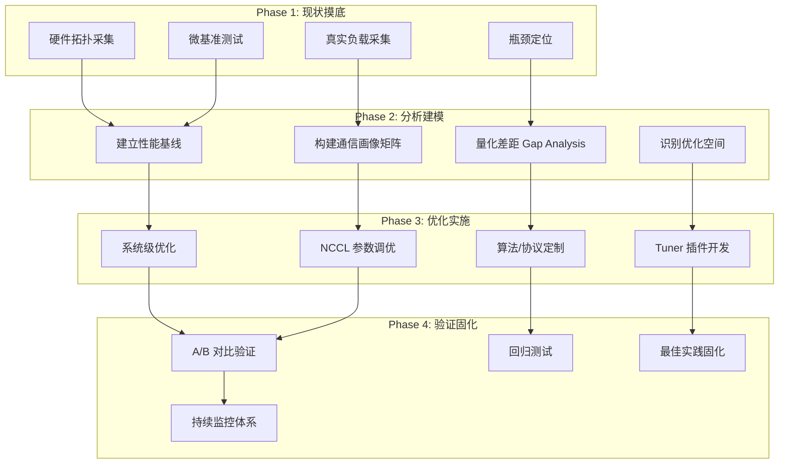

---

## 2. 第一部分：现状评估体系

### 2.1 评估框架：三层四维模型

对通信现状的评估，需要建立一套系统化的度量框架。

```mermaid
flowchart TD
    subgraph "第一层：硬件能力层"
        H1["理论峰值带宽"]
        H2["实测裸带宽"]
        H3["拓扑与互联能力"]
    end

    subgraph "第二层：通信库效率层"
        L1["NCCL 算法选择效率"]
        L2["协议利用率"]
        L3["Channel 并行度"]
        L4["Proxy 开销占比"]
    end

    subgraph "第三层：业务端到端层"
        B1["有效带宽利用率"]
        B2["通信时间占比"]
        B3["扩展效率"]
        B4["训练吞吐损失"]
    end

    subgraph "维度 A: 按通信操作"
        D1["AllReduce"]
        D2["AllGather / ReduceScatter"]
        D3["Send / Recv"]
        D4["AlltoAll"]
    end

    subgraph "维度 B: 按消息大小"
        M1["小消息 (≤4KB)"]
        M2["中等消息 (4KB-1MB)"]
        M3["大消息 (≥1MB)"]
    end

    subgraph "维度 C: 按集群规模"
        S1["单节点 (≤8 GPU)"]
        S2["小集群 (16-64 GPU)"]
        S3["中等集群 (64-512 GPU)"]
        S4["大规模 (≥512 GPU)"]
    end

    subgraph "维度 D: 按硬件平台"
        P1["平台 A: H100 + IB NDR"]
        P2["平台 B: A100 + RoCE"]
        P3["平台 C: H20 + ..."]
    end

    H1 --> L1
    L1 --> B1
    D1 --> B1
    M1 --> B1
    S1 --> B1
    P1 --> B1
```

### 2.2 第一步：硬件拓扑能力摸底

#### 2.2.1 采集内容与方法

对每类硬件平台，需采集以下数据：

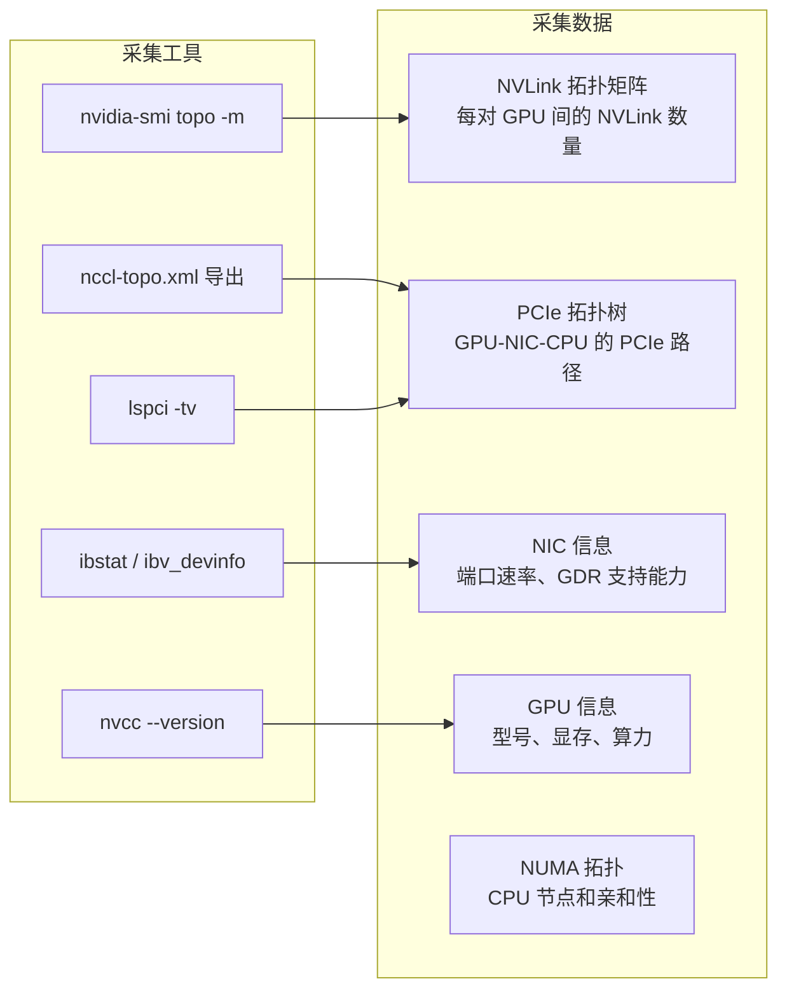

**关键指标**：

| 指标 | 含义 | 采集命令 |
|---|---|---|
| **NVLink 拓扑矩阵** | 每对 GPU 间 NVLink 连接数 | `nvidia-smi topo -m` |
| **理论 NVLink 带宽** | 单向聚合 NVLink 带宽 | 从 NVLink 数 × 每链路带宽计算 |
| **PCIe 带宽** | GPU-NIC PCIe 路径带宽 | `lspci -vv` 查看链路速率/宽度 |
| **NIC 理论带宽** | 网卡单端口/双端口带宽 | `ibstat` |
| **GDR 能力** | GPUDirect RDMA 是否可用 | `ibv_devinfo -v` 查看 |
| **NVSwitch** | 是否有 NVSwitch 及其版本 | `nvidia-smi topo -m` 中的 NVS 行 |

#### 2.2.2 建立硬件能力画像

对每类平台，生成一张标准化的 **硬件通信能力画像**：

```
平台: H100 × 8 + ConnectX-7 NDR200
┌─────────────────────────────────────────────┐
│ 节点内                                       │
│   GPU 互联: 4th Gen NVLink, 18 links/GPU     │
│   理论 NVLink 带宽: 900 GB/s (双向聚合)       │
│   NVSwitch: 3 × NVSwitch (全连接)             │
│   P2P 路径: 全部 PATH_NVL                     │
│                                              │
│ 节点间                                       │
│   NIC: ConnectX-7, 200 Gb/s × 8 port        │
│   总网络带宽: 1600 Gb/s (200 GB/s)            │
│   GPU↔NIC: PCIe Gen5 x16 (64 GB/s)          │
│   GDR: 支持 (GDRCopy 可用)                    │
│   拓扑: GPU-NIC 1:1 映射 (同 NUMA)           │
│                                              │
│ 理论峰值 (估算)                               │
│   AllReduce (单节点 8卡): ~900 GB/s           │
│   AllReduce (跨节点): ~200 GB/s              │
└─────────────────────────────────────────────┘
```

### 2.3 第二步：微基准测试 (Microbenchmarking)

#### 2.3.1 测试矩阵设计

使用 `nccl-tests` 进行的微基准测试必须覆盖完整的操作 × 消息大小 × 规模矩阵：

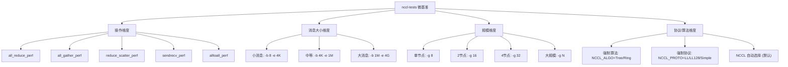

#### 2.3.2 标准测试命令模板

```bash
# ===== 单节点 AllReduce (全量扫) =====
mpirun -np 8 ./build/all_reduce_perf -b 8 -e 4G -f 2 -g 8 \
    -t 1 -w 5 -n 20

# ===== 跨节点 AllReduce (多规模) =====
# 2 节点
mpirun -np 16 -hostfile hosts_2 ./build/all_reduce_perf \
    -b 8 -e 4G -f 2 -g 8 -t 1 -w 5 -n 20

# ===== 逐算法对比 =====
for algo in Tree Ring; do
    mpirun -np 8 ./build/all_reduce_perf -b 1M -e 256M -f 2 -g 8 \
        -t 1 -w 3 -n 10 NCCL_ALGO=$algo
done

# ===== 逐协议对比 =====
for proto in LL LL128 Simple; do
    mpirun -np 8 ./build/all_reduce_perf -b 8 -e 4G -f 2 -g 8 \
        -t 1 -w 3 -n 10 NCCL_PROTO=$proto
done

# ===== 张量并行模式 (AllGather + ReduceScatter) =====
mpirun -np 8 ./build/all_gather_perf -b 8 -e 1G -f 2 -g 8
mpirun -np 8 ./build/reduce_scatter_perf -b 8 -e 1G -f 2 -g 8

# ===== MoE 专家并行 (AlltoAll) =====
mpirun -np 16 ./build/alltoall_perf -b 8 -e 128M -f 2 -g 8
```

#### 2.3.3 关键指标采集

nccl-tests 输出中需提取的核心指标：

| 输出列 | 含义 | 用途 |
|---|---|---|
| `size` | 消息字节数 | 横轴 |
| `time` | 操作延迟 (us) | 延迟分析 |
| `algbw` | 算法带宽 (GB/s) | **有效带宽** — 核心指标 |
| `busbw` | 总线带宽 (GB/s) | 反映链路实际负载 |
| `off` | 是否使用 CUDA Graph | 区分 launch 开销 |
| `min` / `avg` / `max` | 多次运行统计 | 分析稳定性 |

**核心指标定义**：

```
算法带宽 (algbw) = 消息大小 / 操作时间
                     = 用户视角的有效带宽

总线带宽 (busbw) = 算法带宽 × 算法通信量系数
                     = 物理链路上的实际流量

有效带宽利用率 = algbw / 理论峰值带宽 × 100%
```

### 2.4 第三步：真实负载通信画像

#### 2.4.1 采集方法

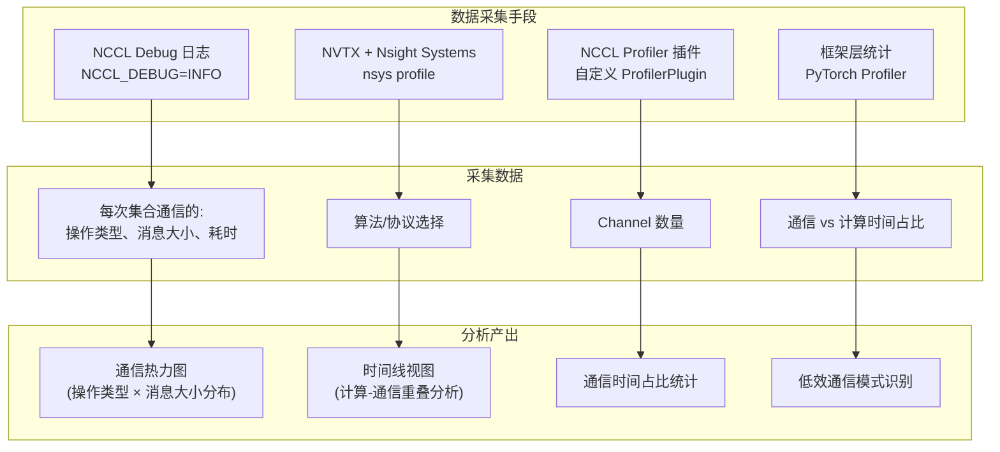

#### 2.4.2 NCCL Debug 日志采集

```bash
# 开启 NCCL 详细日志
export NCCL_DEBUG=INFO
export NCCL_DEBUG_SUBSYS=INIT,COLL,NET,TUNING,ENV
export NCCL_DEBUG_FILE=/mnt/logs/nccl_debug_rank${OMPI_COMM_WORLD_RANK}.log

# 运行训练任务
torchrun --nproc_per_node=8 train.py ...
```

**日志中可提取的关键信息**：

| 日志关键词 | 信息 | 用途 |
|---|---|---|
| `NCCL_TUNING` | 算法/协议选择决策 | 理解 NCCL 为何如此选择 |
| `Channel` | Channel 数量、nThreads | 资源利用情况 |
| `Using algorithm` | 实际使用的算法 | 验证是否最优 |
| `Using protocol` | 实际使用的协议 | 协议合理性 |
| `Max NVL` / `Max NET BW` | NCCL 估计的带宽上限 | NCCL 内部模型值 |

#### 2.4.3 Nsight Systems 采集

```bash
# 采集 GPU 时间线 (单节点为例)
nsys profile \
    --trace=cuda,nvtx,nccl \
    --gpu-metrics-device=all \
    --output=training_%p \
    --force-overwrite=true \
    torchrun --nproc_per_node=8 train.py --steps 10
```

**Nsight Systems 可分析的维度**：
- 每次 NCCL 调用的精确耗时
- 通信 kernel 与计算 kernel 的重叠情况
- NVLink / PCIe / 网络带宽利用率
- 通信 kernel 内部的 Channel 活跃度

#### 2.4.4 业务通信画像矩阵

对每个模型训练场景，生成通信画像：

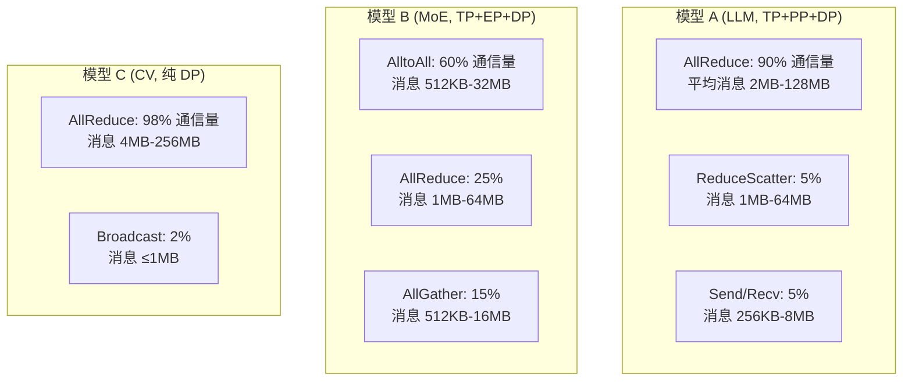

### 2.5 第四步：瓶颈定位

#### 2.5.1 瓶颈定位方法论

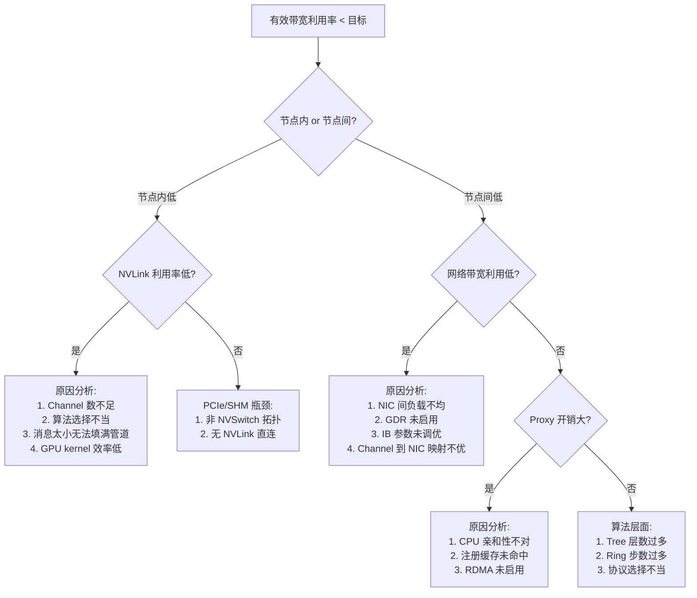

#### 2.5.2 Gap Analysis 框架

将实测数据与理论峰值做 Gap Analysis，形成量化差距表：

| 场景 | 理论峰值 | 实测带宽 | 利用率 | 差距原因 | 优化潜力 |
|---|---|---|---|---|---|
| AllReduce 128MB, 单节点 H100×8 | 900 GB/s | 540 GB/s | 60% | NVLS 未启用 | 高 |
| AllReduce 128MB, 2节点 H100 | 200 GB/s | 120 GB/s | 60% | GDR 配置不当 | 中 |
| ReduceScatter 16MB, 4节点 | 200 GB/s | 80 GB/s | 40% | Ring 步数多 | 中 |
| AlltoAll 8MB, 8节点 | 200 GB/s | 30 GB/s | 15% | AlltoAll 固有开销 | 低 |

### 2.6 现状描述的展示框架

#### 2.6.1 对内向公司汇报

**核心信息**：用一个数字矩阵概括全局。

```
有效带宽利用率矩阵 (示例)
               单节点    2节点    4节点    16节点
AllReduce      78%      62%      55%      48%
ReduceScatter  72%      58%      50%      42%
AllGather      75%      60%      52%      45%
AlltoAll       45%      30%      22%      15%
Send/Recv      82%      65%      --       --
```

**辅助图表**：

1. **带宽-消息大小曲线**：横轴消息大小，纵轴带宽，含理论峰值参考线
2. **时间线热力图**：Nsight Systems 导出的 GPU 时间线截图，展示通信占比
3. **通信画像饼图**：不同通信操作类型的时间/数据量占比
4. **平台对比雷达图**：不同硬件平台的各维度性能对比

#### 2.6.2 对外向业界阐述

**对标行业公开数据**：
- 对标 NVIDIA 官方 NCCL 性能白皮书数据
- 对标 MLPerf Training 基准测试的通信效率
- 对标开源社区 (如 Hugging Face DeepSpeed) 公布的数据

**关键差异化指标**：
- 自研优化后的带宽利用率提升百分比
- 针对特定业务场景的定制优化效果
- 与开源默认配置的性能差距

---

## 3. 第二部分：有效带宽利用率优化方法论

### 3.1 优化全局策略

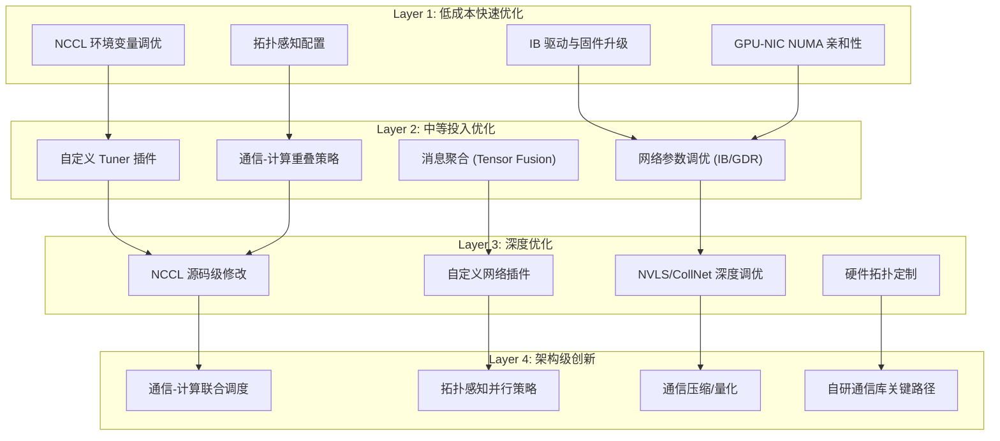

### 3.2 Layer 1：低成本快速优化

#### 3.2.1 NCCL 关键参数调优清单

以下是按优先级排序的环境变量调优项，每个都直接影响有效带宽利用率：

| 优先级 | 参数 | 调优方向 | 适用场景 |
|---|---|---|---|
| P0 | `NCCL_ALGO` | 对特定消息大小强制最优算法 | 算法选择不合理时 |
| P0 | `NCCL_PROTO` | 强制协议 (小消息用 LL/LL128) | 小消息延迟高时 |
| P0 | `NCCL_NET_GDR_LEVEL` | 提高到 3+ 启用 GPUDirect RDMA | 跨节点通信优化 |
| P1 | `NCCL_MAX_NCHANNELS` | 增加并行 Channel 数 | 带宽未饱和时 |
| P1 | `NCCL_BUFFSIZE` | 增大 Channel 缓冲区 | 大消息带宽不足 |
| P1 | `NCCL_NSOCKS_PER_THREAD` | 增加每线程 socket 数 | 网络带宽不饱和 |
| P1 | `NCCL_SOCKET_NTHREADS` | 增加 socket 处理线程数 | 网络带宽不饱和 |
| P2 | `NCCL_IB_GID_INDEX` | 正确的 IB GID 索引 | RoCE 环境常见问题 |
| P2 | `NCCL_IB_TC` | 设置正确的 Traffic Class | IB 网络拥塞控制 |
| P2 | `NCCL_IB_SPLIT_DATA_ON_QPS` | 启用多 QP 并行 | 大消息跨节点 |
| P3 | `NCCL_P2P_LEVEL` | 调整 P2P 距离阈值 | 传输选择不优时 |
| P3 | `NCCL_SHM_DISABLE` | 尝试禁用 SHM | SHM 反而比 P2P 慢时 |

#### 3.2.2 调优实验流程

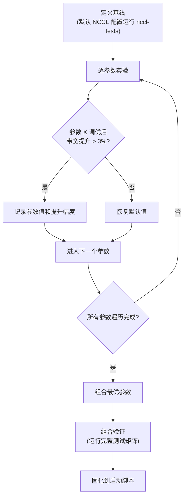

#### 3.2.3 GPU-NIC NUMA 亲和性

这是一项常被忽视但影响巨大的优化：

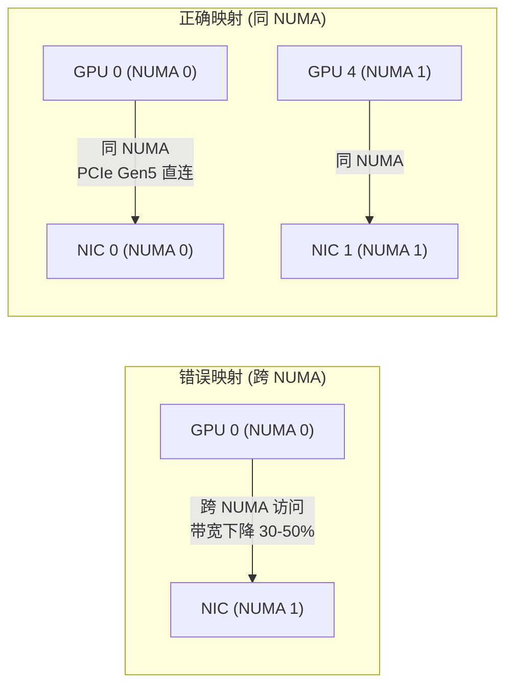

**操作方法**：
1. `lspci -tv` 查看每个 NIC 的 PCIe 路径和 NUMA 节点
2. `nvidia-smi topo -m` 确认 GPU-NIC 的拓扑关系
3. 通过 `NCCL_IB_HCA` 绑定 GPU 到最近 NUMA 的 NIC
4. 通过 `numactl` 控制 NCCL 进程的 CPU 亲和性

### 3.3 Layer 2：中等投入优化

#### 3.3.1 自定义 Tuner 插件

当 NCCL 默认的算法选择不够优时，开发自定义 Tuner 插件是最有效的中等投入优化手段。

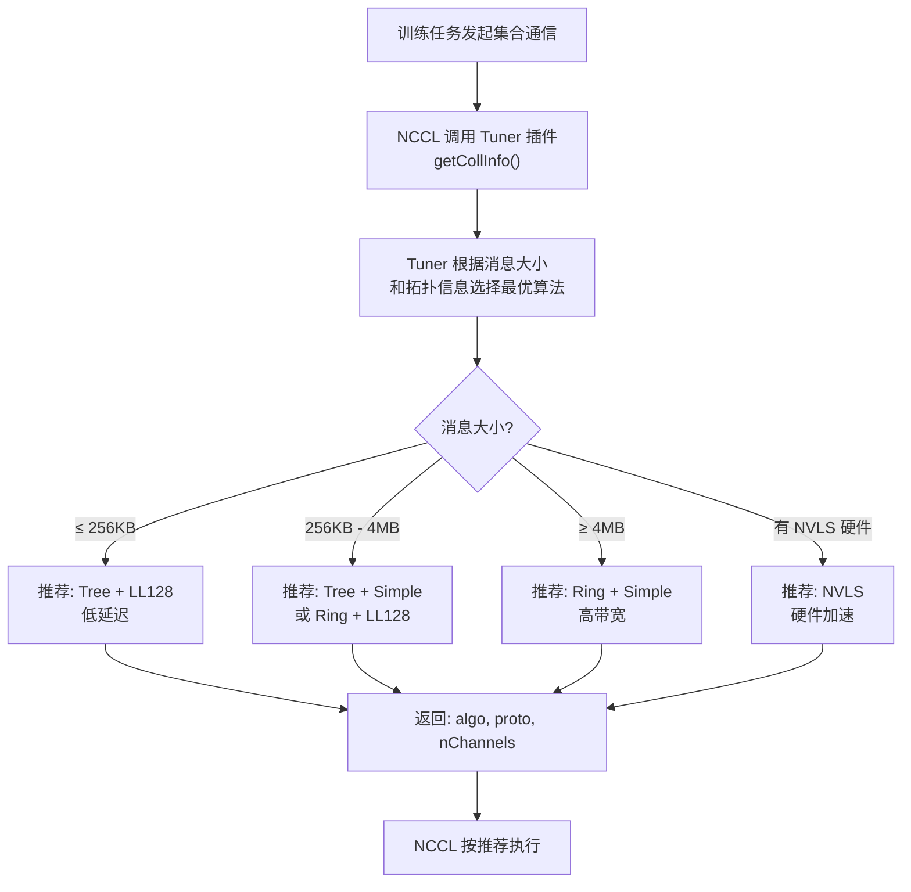

**Tuner 插件开发要点**：

```c
// 自定义 Tuner 插件核心接口
ncclResult_t myTunerGetCollInfo(
    const ncclTunerCollArgs_t* args,
    ncclTunerCollInfo_t* collInfo) {

    // 基于实测数据的最优算法查找表
    // key: (opType, msgSize, nRanks, topology)
    // value: (algo, proto, nChannels)

    collInfo->algo = bestAlgo;
    collInfo->proto = bestProto;
    collInfo->nChannels = bestNChannels;
    return ncclSuccess;
}
```

**构建 Tuner 的数据基础**：
1. 用 nccl-tests 对每种 (算法, 协议) 组合跑完整消息大小扫描
2. 建立查找表：`(操作类型, 消息大小, rank数) → (最优算法, 最优协议, 最优Channel数)`
3. 将查找表嵌入 Tuner 插件

#### 3.3.2 通信-计算重叠策略

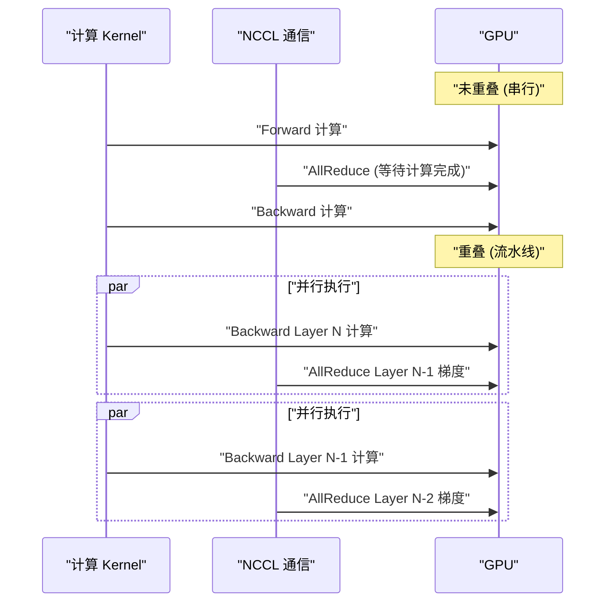

**实现要点**：
- 使用独立 CUDA Stream 进行通信
- 梯度分桶 (gradient bucketing)：将梯度分成多个 bucket，每个 bucket 的通信与前一个 bucket 的计算重叠
- 通过 `ncclGroupStart/End` 批量提交通信操作

#### 3.3.3 消息聚合 (Tensor Fusion)

当存在大量小消息通信时，合并为少量大消息可以显著提高带宽利用率：

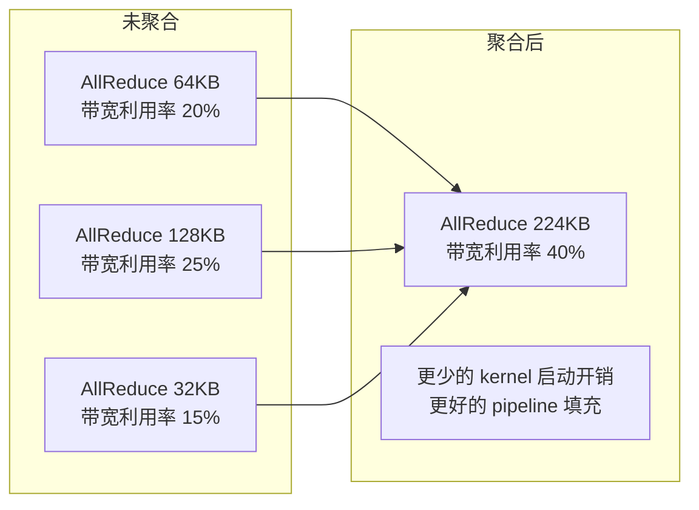

**NCCL 内置机制**：`ncclGroupStart/End` 可以自动合并同一 stream 上的多个小操作。对于跨 stream 的合并，需要在框架层实现 (如 PyTorch 的 `GradBucket`)。

### 3.4 Layer 3：深度优化

#### 3.4.1 网络层深度调优

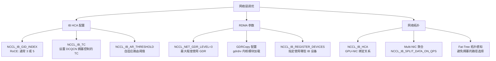

#### 3.4.2 Channel 级优化

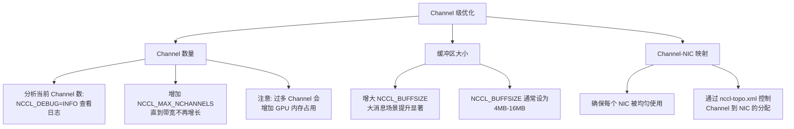

### 3.5 Layer 4：架构级创新

#### 3.5.1 拓扑感知并行策略

根据硬件拓扑自动选择最优的并行策略组合：

```mermaid
flowchart TD
    A["输入: 模型结构 + 硬件拓扑"] --> B{"NVSwitch 有?"}
    B -->|是| C["TP 优先<br/>(节点内 NVLink 高带宽)"}
    B -->|否| D{"IB 带宽?"}
    D -->|"≥ 400 Gb/s"| E["DP + PP 优先<br/>(充分利用网络)"]
    D -->|"< 400 Gb/s"| F["PP 优先<br/>(减少跨节点通信)"]

    C --> G{"模型参数量?"}
    G -->|"≥ 70B"| H["TP=8 + PP=4 + DP=N<br/>(张量并行占满节点内)"]
    G -->|"< 70B"| I["DP 优先<br/>(数据并行最大化)"]

    E --> G
    F --> G
```

#### 3.5.2 通信压缩与量化

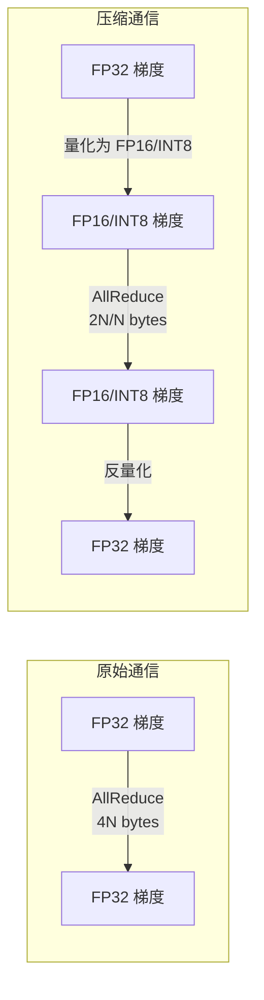

**权衡**：带宽节省 2-4× vs 训练精度可能受损。需根据业务容忍度决定。

### 3.6 优化效果预估框架

对每个优化手段，建立投入产出预估：

| 优化手段 | 预估提升 | 实施难度 | 周期 | 风险 |
|---|---|---|---|---|
| NCCL 环境变量调优 | 5-30% | 低 | 1-2 周 | 低 |
| GPU-NIC NUMA 亲和性 | 10-40% | 低 | 1 周 | 低 |
| IB 驱动/固件升级 | 5-15% | 低 | 1 周 | 中 (需维护窗口) |
| 自定义 Tuner 插件 | 10-40% | 中 | 4-8 周 | 低 |
| Tensor Fusion | 20-60% (小消息) | 中 | 2-4 周 | 低 |
| 通信-计算重叠 | 10-30% (端到端) | 中 | 4-8 周 | 低 |
| GDR 深度调优 | 10-25% (跨节点) | 中 | 2-4 周 | 中 |
| NCCL 源码定制 | 视具体问题 | 高 | 8-16 周 | 高 |
| 拓扑感知并行策略 | 10-50% (端到端) | 高 | 8-12 周 | 中 |
| 通信压缩/量化 | 50-75% (带宽节省) | 高 | 4-8 周 | 高 (精度) |

---

## 4. 第三部分：年底成果论证与汇报策略

### 4.1 有效带宽利用率数字的定义与论证

#### 4.1.1 为什么这个数字难以直接论证

有效带宽利用率面临三个论证挑战：

1. **定义模糊**："有效带宽" 和 "峰值带宽" 的定义有多种
2. **场景依赖**：不同操作/消息大小/规模下数字差异巨大
3. **可对比性**：缺少行业公认的统一基线

#### 4.1.2 严格的定义体系

必须首先建立严谨的定义，消除歧义：

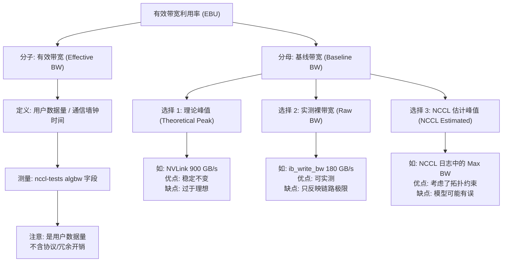

**推荐做法**：同时使用三个分母，给出三个数字：

```
                    EBU(theoretical)  EBU(raw)    EBU(NCCL)
AllReduce 128MB          60%            75%          85%
AllReduce 16MB           45%            58%          72%
ReduceScatter 64MB       55%            70%          80%
```

#### 4.1.3 让数字具备说服力的五条原则

**原则一：可复现性**

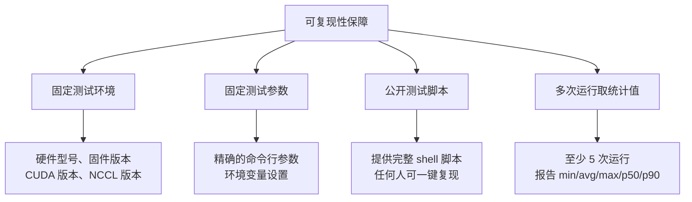

**原则二：多维度交叉验证**

不要只给一个数字，而是构建一个数据矩阵，从多个维度交叉验证：

| 维度 | 验证方式 |
|---|---|
| **工具维度** | nccl-tests 与 Nsight Systems 结果互相印证 |
| **方法维度** | 微基准测试与真实训练结果一致 |
| **时间维度** | 跨多次运行、不同时间段的稳定性 |
| **空间维度** | 不同节点、不同 rank 间的一致性 |

**原则三：与业界对标**

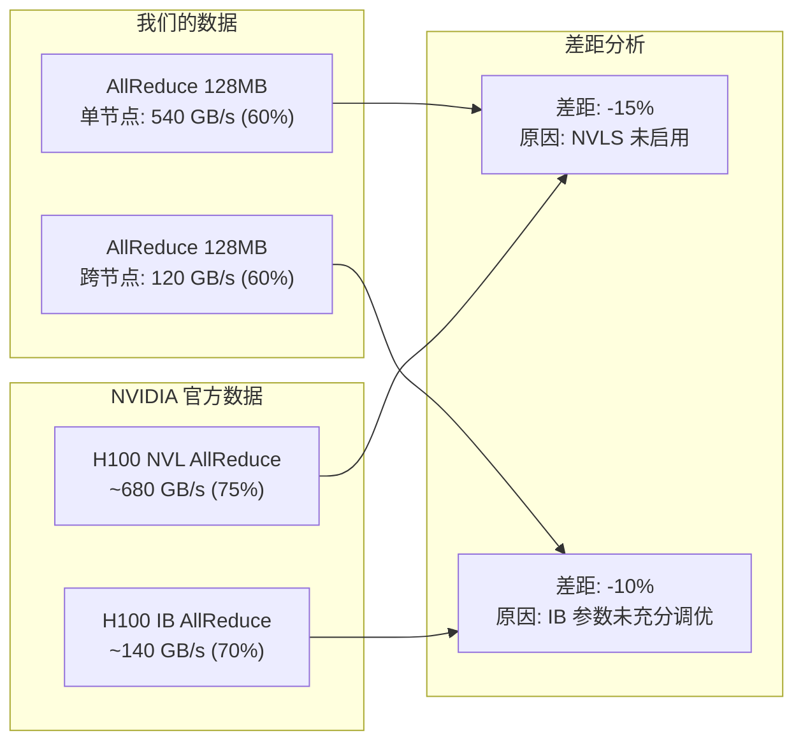

**原则四：端到端业务价值关联**

将通信效率提升翻译为业务可理解的收益：

```
通信带宽利用率: 50% → 75% (+50%)
  → 通信时间: 100ms/iter → 67ms/iter (-33ms)
    → 训练吞吐: 1000 samples/s → 1100 samples/s (+10%)
      → 训练成本: 1000 GPU·h → 910 GPU·h (-9%)
        → 一次完整训练: $500K → $455K (省 $45K)
```

**原则五：优化前后 A/B 对比**

```mermaid
flowchart TD
    subgraph "A/B 测试流程"
        A["同一硬件环境"] --> B["同一测试脚本"]
        B --> C["A 组: 默认 NCCL 配置"]
        B --> D["B 组: 优化后 NCCL 配置"]
        C --> E["跑 5 次, 取中位数"]
        D --> F["跑 5 次, 取中位数"]
        E --> G["计算提升幅度"]
        F --> G
        G --> H{"提升 > 统计显著性阈值?"}
        H -->|是| I["确认优化有效"]
        H -->|否| J["优化不显著<br/>需进一步分析"]
    end
```

统计显著性检验：使用 paired t-test 或 bootstrap 置信区间。对于 5 次以上运行，如果提升幅度 > 3 × 标准差，则认为显著。

### 4.2 汇报材料结构

#### 4.2.1 汇报框架

```mermaid
flowchart TD
    A["一、现状全景"] --> B["二、核心成果"]
    B --> C["三、技术深度"]
    C --> D["四、业务价值"]
    D --> E["五、下一步计划"]

    A --> A1["1. 硬件平台通信能力画像"]
    A --> A2["2. 各业务通信画像"]
    A --> A3["3. 带宽利用率矩阵"]

    B --> B1["1. 关键指标提升幅度"]
    B --> B2["2. 行业对标"]
    B --> B3["3. 业务收益量化"]

    C --> C1["1. 优化手段清单与效果"]
    C --> C2["2. 技术创新点"]
    C --> C3["3. 可复现性证据"]

    D --> D1["1. 训练吞吐提升"]
    D --> D2["2. 训练成本节约"]
    D --> D3["3. 新场景解锁能力"]

    E --> E1["1. 待优化空间"]
    E --> E2["2. 技术路线图"]
    E --> E3["3. 资源需求"]
```

#### 4.2.2 关键图表清单

| 图表编号 | 类型 | 内容 | 目的 |
|---|---|---|---|
| Fig.1 | 热力图 | 操作 × 消息大小 × 带宽利用率 | 展示全局现状 |
| Fig.2 | 折线图 | 带宽 vs 消息大小 (含理论峰值为参考线) | 展示实际性能曲线 |
| Fig.3 | 柱状图 | 各平台有效带宽利用率对比 | 跨平台比较 |
| Fig.4 | 柱状图 | 优化前后 A/B 对比 | 证明优化效果 |
| Fig.5 | 时间线图 | Nsight Systems 截图 | 通信-计算重叠分析 |
| Fig.6 | 雷达图 | 多维度性能指标 | 综合评价 |
| Fig.7 | 折线图 | 训练 Loss 曲线 (优化前后) | 证明精度无损 |
| Fig.8 | 堆叠柱状图 | 训练时间拆分 (计算/通信/其他) | 通信占比变化 |

#### 4.2.3 对不同受众的呈现策略

| 受众 | 关注点 | 呈现重点 |
|---|---|---|
| **技术团队** | 原理、方法、可复现性 | 完整的技术细节、测试脚本、原始数据 |
| **业务负责人** | 对训练效率的影响 | 训练吞吐提升、成本节约、业务交付加速 |
| **高管** | 投资回报、竞争力 | 一个核心数字 + 行业排名 + 成本节约金额 |
| **外部/业界** | 技术领先性 | 创新点、对标数据、开源贡献 |

### 4.3 避免"数字陷阱"

#### 4.3.1 常见的数字操纵手段 (应避免)

| 陷阱 | 表现 | 正确做法 |
|---|---|---|
| **精选场景** | 只展示最优场景的数据 | 展示完整矩阵，包含弱项 |
| **模糊基线** | 用不合理的基线抬高利用率 | 明确基线定义和计算方法 |
| **忽略方差** | 只报告单次最优值 | 报告 p50/p90 和方差 |
| **混淆带宽类型** | 混用 algbw 和 busbw | 明确区分，分别报告 |
| **忽略条件** | 不说明测试条件 | 完整披露硬件、软件、参数 |
| **外推结论** | 微基准结论外推到真实训练 | 同时提供两种数据 |

#### 4.3.2 建立可信度的最佳实践

1. **数据透明**：原始测试数据存档可查
2. **方法公开**：测试方法论文档化
3. **第三方验证**：邀请其他团队复现关键数据
4. **持续监控**：建立自动化监控，证明优化效果持续稳定
5. **负面影响披露**：如果优化引入了任何 trade-off (如内存增加)，主动说明

---

## 5. 附录：工具清单与数据采集脚本模板

### 5.1 核心工具清单

| 工具 | 用途 | 安装方式 |
|---|---|---|
| `nccl-tests` | NCCL 微基准测试 | `git clone https://github.com/NVIDIA/nccl-tests.git` |
| `nsys` (Nsight Systems) | GPU 时间线 profiling | CUDA Toolkit 自带 |
| `ncu` (Nsight Compute) | GPU kernel 级 profiling | CUDA Toolkit 自带 |
| `ibstat` / `ibv_devinfo` | IB 设备信息查询 | `rdma-core` 包 |
| `ib_write_bw` | IB 裸带宽测试 | `perftest` 包 |
| `nvidia-smi` | GPU 信息和拓扑 | NVIDIA 驱动自带 |
| `lspci` | PCIe 拓扑信息 | 系统自带 |
| `numactl` | NUMA 亲和性控制 | 系统包 |
| `hwloc-ls` | 硬件拓扑可视化 | `hwloc` 包 |

### 5.2 自动化采集脚本框架

```bash
#!/bin/bash
# nccl_perf_survey.sh - NCCL 性能现状自动采集脚本
# 用法: ./nccl_perf_survey.sh <nodes_file> <output_dir>

NODES_FILE=$1
OUTPUT_DIR=$2
TIMESTAMP=$(date +%Y%m%d_%H%M%S)

# ===== 1. 硬件信息采集 =====
echo "[1/5] 采集硬件信息..."
mkdir -p ${OUTPUT_DIR}/hw_info

# GPU 拓扑
nvidia-smi topo -m > ${OUTPUT_DIR}/hw_info/nvlink_topo.txt 2>&1
nvidia-smi -q > ${OUTPUT_DIR}/hw_info/gpu_info.txt 2>&1

# PCIe 拓扑
lspci -tv > ${OUTPUT_DIR}/hw_info/pcie_tree.txt 2>&1

# IB 信息
ibstat > ${OUTPUT_DIR}/hw_info/ibstat.txt 2>&1
ibv_devinfo > ${OUTPUT_DIR}/hw_info/ibv_devinfo.txt 2>&1

# NUMA 信息
lscpu > ${OUTPUT_DIR}/hw_info/cpu_info.txt 2>&1
numactl -H > ${OUTPUT_DIR}/hw_info/numa_topology.txt 2>&1

# ===== 2. IB 裸带宽测试 =====
echo "[2/5] 测试 IB 裸带宽..."
# (需要两个节点上分别运行 ib_write_bw 和 ib_write_bw -s)

# ===== 3. NCCL 微基准测试 =====
echo "[3/5] 运行 NCCL 微基准..."
NCCL_TESTS_DIR=/path/to/nccl-tests
OPS="all_reduce_perf all_gather_perf reduce_scatter_perf"
MSG_RANGE="-b 8 -e 4G -f 2"

for op in ${OPS}; do
    echo "  Testing ${op}..."
    mpirun -hostfile ${NODES_FILE} \
        ${NCCL_TESTS_DIR}/build/${op} \
        ${MSG_RANGE} -g 8 -t 1 -w 5 -n 20 \
        > ${OUTPUT_DIR}/microbench_${op}_${TIMESTAMP}.txt 2>&1
done

# ===== 4. 逐算法对比测试 =====
echo "[4/5] 运行算法对比测试..."
for algo in Tree Ring; do
    mpirun -hostfile ${NODES_FILE} \
        ${NCCL_TESTS_DIR}/build/all_reduce_perf \
        -b 8 -e 4G -f 2 -g 8 -t 1 -w 3 -n 10 \
        NCCL_ALGO=${algo} \
        > ${OUTPUT_DIR}/algo_${algo}_${TIMESTAMP}.txt 2>&1
done

# ===== 5. 生成 NCCL 拓扑 XML =====
echo "[5/5] 导出 NCCL 拓扑..."
export NCCL_DEBUG=INFO
export NCCL_DEBUG_SUBSYS=INIT
export NCCL_DEBUG_FILE=${OUTPUT_DIR}/nccl_init_debug.txt
mpirun -hostfile ${NODES_FILE} \
    ${NCCL_TESTS_DIR}/build/all_reduce_perf \
    -b 1M -e 1M -n 1 -g 8

echo "所有数据已保存到: ${OUTPUT_DIR}"
```

### 5.3 数据分析建议

采集到的原始数据建议用 Python 脚本做如下分析：

1. **解析 nccl-tests 输出**：提取 `size`、`time`、`algbw`、`busbw` 列
2. **计算利用率**：`utilization = algbw / theoretical_peak`
3. **绘制带宽曲线**：`size` vs `algbw`，含理论峰值参考线
4. **生成利用率热力图**：操作类型 × 消息大小 × 利用率
5. **对比不同算法/协议**：同一消息大小下各组合的带宽对比
6. **统计稳定性**：多次运行的均值、标准差、变异系数

---

## 附录：核心术语表

| 术语 | 定义 |
|---|---|
| **EBU (Effective Bandwidth Utilization)** | 有效带宽利用率 = 实测算法带宽 / 基线带宽 |
| **algbw (Algorithm Bandwidth)** | 用户数据量 / 操作时间，即用户视角的通信带宽 |
| **busbw (Bus Bandwidth)** | 链路实际承载数据量 / 操作时间，反映物理链路负载 |
| **理论峰值 (Theoretical Peak)** | 硬件标称的最大带宽，如 NVLink 900 GB/s |
| **实测裸带宽 (Raw BW)** | 底层工具 (如 ib_write_bw) 测得的实际链路带宽 |
| **NCCL 估计峰值** | NCCL 内部 tuning 模型计算的最大可达带宽 |
| **Pipeline 深度** | NCCL_STEPS=8，允许同时在途的 step 数量 |
| **Channel** | NCCL 的通信通道，每通道独立缓冲区和数据路径 |
| **Tuner 插件** | 覆盖 NCCL 默认算法选择的自定义插件 |
| **GPUDirect RDMA** | NIC 直接访问 GPU 内存的技术，避免 CPU 中转 |
