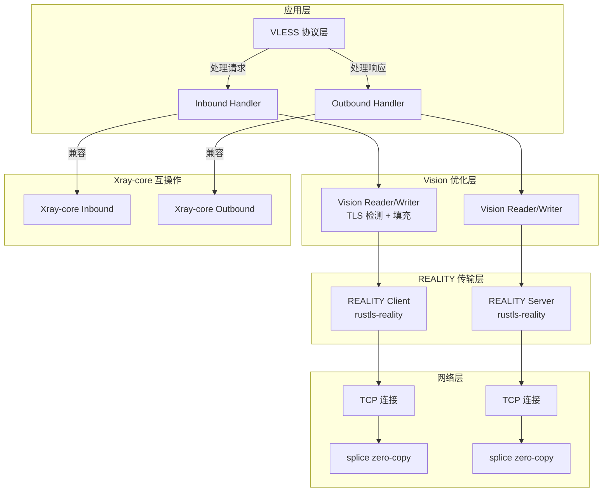

# Rust 实现 VLESS + REALITY + Vision 完全兼容 Xray-core 的详细计划

> 本文档提供完整的 Rust 实现计划，目标是创建一个与 Xray-core 100% 协议兼容的 VLESS + REALITY + Vision 代理系统。

---

## 执行摘要

| 组件 | Go 实现 | Rust 方案 | 兼容性 |
|------|---------|-----------|--------|
| TLS 握手 | Go crypto/tls + utls | rustls-reality fork | ✅ 100% |
| ECDH 密钥交换 | Go crypto/ecdh | x25519-dalek | ✅ 100% |
| 零拷贝转发 | Go splice | tokio-splice2 | ✅ 100% |
| 协议编解码 | Go protobuf | prost + manual | ✅ 100% |
| UUID 认证 | Go uuid | uuid crate | ✅ 100% |

**核心策略**：使用 `rustls-reality` fork 作为 TLS 层基础，这是 Xray-lite 项目使用的经过验证的方案。

---

## 架构设计

### 整体架构



### 模块划分

```
xray-rs/
├── Cargo.toml                    # Project manifest
├── xray-core/                    # Core protocol implementation
│   ├── vless/                    # VLESS protocol
│   │   ├── encoding/            # Protocol encoding/decoding
│   │   ├── inbound/             # Inbound handler
│   │   ├── outbound/            # Outbound handler
│   │   └── validator/           # UUID validation
│   ├── reality/                 # REALITY transport
│   │   ├── client/              # REALITY client
│   │   ├── server/              # REALITY server
│   │   └── config/              # Configuration parsing
│   └── vision/                  # Vision/XTLS optimization
│       ├── reader/              # Vision reader
│       ├── writer/              # Vision writer
│       └── padding/             # Padding logic
├── transport/                   # Transport layer
│   ├── tcp/                     # TCP transport
│   ├── splice/                  # Zero-copy splice
│   └── tls/                     # TLS wrapper
├── proxy/                       # Proxy interfaces
│   ├── inbounds/                # Inbound implementations
│   └── outbounds/               # Outbound implementations
├── config/                      # Configuration
│   ├── vless/                   # VLESS config
│   ├── reality/                 # REALITY config
│   └── parser/                  # JSON/Proto parser
└── main.rs                      # Entry point
```

---

## Protocol Specifications (Xray-core Compatible)

### 1. VLESS Protocol

#### Account Proto (完全兼容)

```protobuf
// proxy/vless/account.proto
message Account {
    string id = 1;              // UUID string
    string flow = 2;            // "xtls-rprx-vision" or ""
    string encryption = 3;      // "none" or "aes-128-gcm"
    uint32 xorMode = 4;
    uint32 seconds = 5;         // Ticket lifetime in seconds (for 0-RTT)
    string padding = 6;         // Padding specification
    Reverse reverse = 7;
    uint32 testpre = 8;         // Pre-connection pool size (NEW - from account.proto:29)
    repeated uint32 testseed = 9;  // [900, 500, 900, 256]
}

message Reverse {
    string tag = 1;
    SniffingConfig sniffing = 2;
}
```

**testpre field**: Pre-connection pool size. When set, the client pre-establishes this many connections to reduce latency. Must be mentioned in plan.

#### Addons Proto (完全兼容)

```protobuf
// proxy/vless/encoding/addons.proto
message Addons {
    string Flow = 1;            // "xtls-rprx-vision"
    bytes Seed = 2;             // testseed bytes
}
```

#### Request Header Format (完全兼容)

```
[Version: 1 byte]  // 0x00
[UUID: 16 bytes]   // User account ID
[Addons: 1 byte len + protobuf]  // 1 byte length prefix, NOT 2 bytes
                                  // Only when flow == "xtls-rprx-vision"
                                  // Otherwise just 0x00
[Command: 1 byte]  // 0x01=TCP, 0x02=UDP, 0x03=Mux
[Address: var]     // Address + Port
```

#### Response Header Format (NEW - was missing from plan)

After request, the server sends a response header:

```
[Version: 1 byte]     // Same as request, always 0x00
[Addons: 1 byte len + protobuf]  // Response addons (usually empty, just 0x00)
```

From `encoding.go:134-152`:
```go
func EncodeResponseHeader(writer io.Writer, request *protocol.RequestHeader, responseAddons *Addons) error {
    buffer.WriteByte(request.Version)     // 1 byte
    EncodeHeaderAddons(&buffer, responseAddons)  // Addons (same format as request)
    writer.Write(buffer.Bytes())
}
```

### 2. REALITY Protocol

#### Config Proto (完全兼容)

```protobuf
// transport/internet/reality/config.proto
message Config {
    bool show = 1;
    string dest = 2;                    // Decoy destination
    string type = 3;
    uint64 xver = 4;
    repeated string server_names = 5;   // Allowed SNI
    bytes private_key = 6;              // X25519 private key
    bytes min_client_ver = 7;
    bytes max_client_ver = 8;
    uint64 max_time_diff = 9;
    repeated bytes short_ids = 10;      // Pre-shared short IDs
    
    string Fingerprint = 21;            // "chrome", "firefox", etc.
    string server_name = 22;            // SNI value
    bytes public_key = 23;              // Server public key
    bytes short_id = 24;                // Short ID for this server
    bytes mldsa65_verify = 25;
    string spider_x = 26;
    repeated int64 spider_y = 27;       // [0..500, 0..500, 1..5, 1..5, ...]
}
```

#### SessionID Structure (完全兼容)

```
SessionID = 32 bytes:
[Version: 3 bytes]   // Xray version (X, Y, Z)
[Reserved: 1 byte]   // 0x00
[Unix Timestamp: 4 bytes]  // Big-endian
[ShortID: 8 bytes]   // Server's short_id
[Random: 16 bytes]   // Random padding
```

#### LimitFallback Configuration (NEW - was missing from plan)

The REALITY config has `limit_fallback_upload` and `limit_fallback_download` with rate-limiting for decoy fallback connections:

```protobuf
message LimitFallback {
  uint64 after_bytes = 1;        // After how many bytes to apply rate limit
  uint64 bytes_per_sec = 2;      // Rate limit in bytes per second
  uint64 burst_bytes_per_sec = 3; // Burst rate limit in bytes per second
}
```

**Fields**:
- `after_bytes`: After how many bytes to apply rate limit (e.g., 1048576 = 1MB)
- `bytes_per_sec`: Rate limit in bytes per second (e.g., 1048576 = 1MB/s)
- `burst_bytes_per_sec`: Burst rate limit in bytes per second (e.g., 2097152 = 2MB/s burst)

This prevents bandwidth abuse on decoy connections.

#### Authentication Flow (CORRECTED)

```
1. Client generates TLS 1.3 key share (ECDHE or MLKEM-ECDHE hybrid)
   - NOT a separate ECDH key pair
   - Reuses the TLS 1.3 key share from ClientHello
   
2. Client calculates SharedSecret = ECDH(server_pub, client_tls_key_share)
   
3. Client derives AuthKey using HKDF-SHA256:
   - Hash: SHA-256
   - IKM (input keying material): shared secret from ECDH
   - Salt: hello.Random[:20] (first 20 bytes of ClientHello.random)
   - Info: []byte("REALITY")
   - Output: written back into AuthKey
   
4. Client encrypts SessionID[:16] with AES-256-GCM:
   - Nonce: hello.Random[20:] (bytes 20-31 of ClientHello.random, 12 bytes)
   - Plaintext: hello.SessionId[:16] (first 16 bytes of SessionID)
   - AAD: hello.Raw (the FULL raw ClientHello bytes - CRITICAL for tamper detection)
   
5. Server decrypts and verifies:
   - ShortID matches
   - Timestamp within tolerance
   - HMAC-SHA512(AuthKey, cert_pub) == cert_signature (for ed25519 certs)
   - ML-DSA-65 verification (if configured)
```

### 3. Vision/XTLS Protocol

#### Command Definitions (完全兼容)

```go
// proxy/proxy.go
CommandPaddingContinue byte = 0x00  // 继续填充
CommandPaddingEnd      byte = 0x01  // 结束填充
CommandPaddingDirect   byte = 0x02  // 直接复制
```

#### Padding Format (完全兼容)

```
[UUID: 16 bytes]     // First packet only
[Command: 1 byte]
[ContentLen: 2 bytes] // Big-endian
[PaddingLen: 2 bytes] // Big-endian
[Content: N bytes]
[Padding: M bytes]
```

#### Flow State Machine (完全兼容)

```
CanSpliceCopy states:
- 0: Not initialized
- 1: Ready for splice
- 2: Vision active, waiting
- 3: Splice disabled (non-TLS)
```

---

## Rust Implementation Plan

### Phase 1: Core Dependencies

#### Cargo.toml

```toml
[package]
name = "xray-rs"
version = "0.1.0"
edition = "2021"

[dependencies]
# TLS with REALITY support
rustls-reality = { git = "https://github.com/undead-undead/rustls-reality.git", 
                   features = ["dangerous_configuration"] }

# X25519 key exchange
x25519-dalek = "2.0"

# Async runtime
tokio = { version = "1.37", features = ["full"] }

# Zero-copy splice
tokio-splice2 = "0.3"

# Protocol buffers
prost = "0.12"
prost-types = "0.12"

# UUID
uuid = { version = "1.8", features = ["v4", "serde"] }

# Crypto
ring = "0.17"  # For HKDF, HMAC, AES-GCM
rand = "0.8"

# Serialization
serde = { version = "1.0", features = ["derive"] }
serde_json = "1.0"

# Logging
tracing = "0.1"
tracing-subscriber = "0.3"

# Async networking
async-trait = "0.1"
futures = "0.3"

# Buffer management
bytes = "1.6"

# Error handling
thiserror = "1.0"

# Configuration
config = "0.14"

# Testing
tokio-test = "0.4"
proptest = "1.4"

[dev-dependencies]
criterion = "0.5"
```

### Phase 2: VLESS Protocol Implementation

#### 2.1 UUID Validation

```rust
// xray-core/vless/validator.rs
use uuid::Uuid;
use std::collections::HashMap;
use std::sync::Arc;
use tokio::sync::RwLock;

pub struct MemoryValidator {
    users: Arc<RwLock<HashMap<Uuid, MemoryUser>>>,
}

pub struct MemoryUser {
    pub id: Uuid,
    pub account: MemoryAccount,
    pub email: String,
}

pub struct MemoryAccount {
    pub id: Uuid,
    pub flow: String,
    pub encryption: String,
    pub testseed: Vec<u32>,
}

impl MemoryValidator {
    pub fn new() -> Self {
        Self {
            users: Arc::new(RwLock::new(HashMap::new())),
        }
    }
    
    pub async fn add(&self, user: MemoryUser) -> Result<(), Error> {
        let mut users = self.users.write().await;
        users.insert(user.id, user);
        Ok(())
    }
    
    pub async fn get(&self, id: &Uuid) -> Option<MemoryUser> {
        let users = self.users.read().await;
        users.get(id).cloned()
    }
}
```

#### 2.2 Protocol Encoding/Decoding

```rust
// xray-core/vless/encoding.rs
use bytes::{Buf, BufMut, BytesMut};
use prost::Message;

pub const VERSION: u8 = 0;

pub struct RequestHeader {
    pub version: u8,
    pub user_id: Uuid,
    pub command: RequestCommand,
    pub address: Address,
    pub port: u16,
    pub addons: Addons,
}

pub enum RequestCommand {
    TCP,
    UDP,
    MUX,
    RVS,
}

pub struct Addons {
    pub flow: String,
    pub seed: Vec<u8>,
}

impl RequestHeader {
    pub fn encode(&self) -> BytesMut {
        let mut buf = BytesMut::with_capacity(1024);
        
        // Version (1 byte)
        buf.put_u8(VERSION);
        
        // UUID (16 bytes)
        buf.put_slice(self.user_id.as_bytes());
        
        // Addons (protobuf encoded) - 1 byte length prefix, NOT 2 bytes
        // Only encode when flow == "xtls-rprx-vision", otherwise just 0x00
        let addons_bytes = self.addons.encode();
        if self.addons.flow == "xtls-rprx-vision" {
            buf.put_u8(addons_bytes.len() as u8);  // 1 BYTE length, not u16
            buf.put_slice(&addons_bytes);
        } else {
            buf.put_u8(0);  // just a zero byte for non-vision
        }
        
        // Command (1 byte)
        let cmd_byte = match self.command {
            RequestCommand::TCP => 0x01,
            RequestCommand::UDP => 0x02,
            RequestCommand::MUX => 0x03,
            RequestCommand::RVS => 0x04,
        };
        buf.put_u8(cmd_byte);
        
        // Address + Port
        self.address.encode(&mut buf);
        
        buf
    }
}

impl Addons {
    pub fn encode(&self) -> Vec<u8> {
        let mut buf = Vec::new();
        // protobuf encoding logic here
        buf
    }
}
```

#### 2.3 Inbound Handler

```rust
// xray-core/vless/inbound.rs
use async_trait::async_trait;
use tokio::net::TcpStream;
use crate::vless::{MemoryValidator, RequestHeader};
use crate::vision::VisionReader;
use crate::reality::REALITYClient;

pub struct InboundHandler {
    validator: MemoryValidator,
    decryption: Option<Decryption>,
}

impl InboundHandler {
    pub async fn handle(&self, stream: TcpStream) -> Result<(), Error> {
        // 1. Read first buffer
        let mut buf = [0u8; 4096];
        let n = stream.read(&mut buf).await?;
        
        // 2. Decode request header
        let (id, request, addons, is_fallback) = 
            RequestHeader::decode(&buf[..n], &self.validator).await?;
        
        // 3. Check authentication
        let user = self.validator.get(&id).await;
        if user.is_none() {
            return Err(Error::InvalidUser);
        }
        
        // 4. Handle fallback
        if is_fallback {
            return self.handle_fallback(stream).await;
        }
        
        // 5. Establish Vision tunnel
        let vision_reader = VisionReader::new(stream, addons);
        
        // 6. Dispatch to destination
        self.dispatch(request, vision_reader).await
    }
}
```

### Phase 3: REALITY Transport Layer

#### 3.1 Configuration

```protobuf
// transport/internet/reality/config.proto
message Config {
  bool show = 1;
  string dest = 2;
  string type = 3;
  uint64 xver = 4;
  repeated string server_names = 5;   // Allowed SNI
  bytes private_key = 6;              // X25519 private key
  bytes min_client_ver = 7;
  bytes max_client_ver = 8;
  uint64 max_time_diff = 9;
  repeated bytes short_ids = 10;      // Pre-shared short IDs
  
  // MISSING from plan - ADDED:
  bytes mldsa65_seed = 11;            // Server-side ML-DSA-65 seed for signing
  LimitFallback limit_fallback_upload = 12;    // Rate limit for fallback upload
  LimitFallback limit_fallback_download = 13;  // Rate limit for fallback download
  
  string Fingerprint = 21;            // "chrome", "firefox", etc.
  string server_name = 22;            // SNI value
  bytes public_key = 23;              // Server public key
  bytes short_id = 24;                // Short ID for this server
  bytes mldsa65_verify = 25;          // ML-DSA-65 verification public key
  string spider_x = 26;
  repeated int64 spider_y = 27;       // [0..500, 0..500, 1..5, 1..5, ...]
  
  // MISSING from plan - ADDED:
  string master_key_log = 31;         // SSLKEYLOGFILE path
}

// MISSING entirely from plan - ADDED:
message LimitFallback {
  uint64 after_bytes = 1;
  uint64 bytes_per_sec = 2;
  uint64 burst_bytes_per_sec = 3;
}
```

#### 3.2 Client Implementation

```rust
// xray-core/reality/client.rs
use rustls_reality::{ClientConfig, ClientConnection, Stream};
use x25519_dalek::{EphemeralSecret, PublicKey, SharedSecret};
use ring::hkdf::{Salt, HKDF, PRF_SHA256};
use ring::aead::{LessSafeKey, AES_256_GCM, NONCE_LEN};
use ring::digest;
use std::time::{SystemTime, UNIX_EPOCH};

pub struct REALITYClient {
    config: Config,
    server_pub: PublicKey,
}

impl REALITYClient {
    pub fn new(config: Config) -> Result<Self, Error> {
        let server_pub = PublicKey::from_bytes(&config.public_key)?;
        Ok(Self { config, server_pub })
    }
    
    pub async fn connect(&self, stream: TcpStream, dest: &str) -> Result<TLSStream, Error> {
        // 1. Get fingerprint
        let fingerprint = self.config.get_fingerprint()?;
        
        // 2. Create TLS connection with custom ClientHello
        let mut config = ClientConfig::builder()
            .with_safe_defaults()
            .with_custom_client_hello(fingerprint)?
            .build();
        
        let conn = ClientConnection::new(config, dest.parse()?)?;
        let mut stream = Stream::new(stream, conn);
        
        // 3. Build custom SessionID before handshake
        let mut session_id = [0u8; 32];
        session_id[0] = VERSION_X;  // Xray version
        session_id[1] = VERSION_Y;
        session_id[2] = VERSION_Z;
        session_id[3] = 0;  // Reserved
        
        let now = SystemTime::now()
            .duration_since(UNIX_EPOCH)?
            .as_secs() as u32;
        session_id[4..8].copy_from_slice(&now.to_be_bytes());
        session_id[8..16].copy_from_slice(&self.config.short_id);
        
        // 4. Perform handshake to get ClientHello
        stream.handshake().await?;
        
        // 5. Get the ClientHello from connection state
        let hello = stream.client_hello()?;
        let random = hello.random;  // 32 bytes
        
        // 6. Reuse TLS 1.3 key share (NOT generate new ECDH key pair)
        // REALITY uses the TLS 1.3 key share from the ClientHello
        // The rustls-reality fork exposes uConn.HandshakeState.State13.KeyShareKeys
        let ecdhe = stream.key_share()?;  // Get ECDHE from rustls-reality
        let shared_secret = ecdhe.diffie_hellman(&self.server_pub);
        
        // 7. Derive AuthKey using HKDF-SHA256
        // Actual Go code: hkdf.New(sha256.New, uConn.AuthKey, hello.Random[:20], []byte("REALITY"))
        // - Hash: SHA-256
        // - IKM: shared secret from ECDH
        // - Salt: hello.Random[:20] (first 20 bytes of ClientHello.random)
        // - Info: []byte("REALITY")
        // - Output: written back into AuthKey
        let salt = Salt::new(digest::SHA256, &random[..20]);
        let auth_key = salt.extract(sha256::digest(shared_secret.as_bytes()));
        let mut auth_key_bytes = [0u8; 32];
        auth_key.verify(&shared_secret.as_bytes(), &mut auth_key_bytes);
        
        // 8. Encrypt SessionID[:16] with AES-256-GCM
        // Actual Go code: aead.Seal(hello.SessionId[:0], hello.Random[20:], hello.SessionId[:16], hello.Raw)
        // - Nonce: hello.Random[20:] (bytes 20-31 of ClientHello.random, 12 bytes)
        // - Plaintext: hello.SessionId[:16] (first 16 bytes of SessionID)
        // - AAD: hello.Raw (the FULL raw ClientHello bytes - CRITICAL for tamper detection)
        let nonce = &random[20..32];  // 12 bytes from random[20:]
        let aad = hello.raw;  // Full raw ClientHello - NOT empty!
        
        let key = LessSafeKey::new(&auth_key_bytes);
        let encrypted = key.seal(nonce, aead::Aad::from(aad), &session_id[..16])?;
        
        // 9. Update SessionID in ClientHello
        stream.update_session_id(&encrypted)?;
        
        Ok(stream)
    }
}
```

#### 3.3 Server Implementation

```rust
// xray-core/reality/server.rs
use rustls_reality::{ServerConfig, ServerConnection};
use ring::hmac;

pub struct REALITYServer {
    config: Config,
    private_key: StaticSecret,
}

impl REALITYServer {
    pub fn new(config: Config, private_key: StaticSecret) -> Self {
        Self { config, private_key }
    }
    
    pub async fn accept(&self, stream: TcpStream) -> Result<TLSStream, Error> {
        // 1. Create server config
        let mut config = ServerConfig::builder()
            .with_safe_defaults()
            .with_no_client_auth()
            .build();
        
        // 2. Accept connection
        let conn = ServerConnection::new(config)?;
        let mut stream = Stream::new(stream, conn);
        
        // 3. Perform handshake
        stream.handshake().await?;
        
        // 4. Verify client SessionID
        let session_id = stream.session_id()?;
        if !self.verify_session_id(&session_id)? {
            // Forward to decoy
            return self.forward_to_decoy(stream).await;
        }
        
        Ok(stream)
    }
    
    fn verify_session_id(&self, session_id: &[u8]) -> Result<bool, Error> {
        // 1. Decrypt with AuthKey
        let decrypted = self.decrypt_session_id(session_id)?;
        
        // 2. Check ShortID
        let short_id = &decrypted[8..16];
        if short_id != self.config.short_id {
            return Ok(false);
        }
        
        // 3. Check timestamp
        let timestamp = u32::from_be_bytes(decrypted[4..8].try_into()?);
        let now = SystemTime::now()
            .duration_since(UNIX_EPOCH)?
            .as_secs() as u32;
        
        if (now as i64 - timestamp as i64).abs() > self.config.max_time_diff as i64 {
            return Ok(false);
        }
        
        Ok(true)
    }
}
```

### Phase 4: Vision/XTLS Optimization

#### 4.1 Padding Implementation

```rust
// xray-core/vision/padding.rs
use rand::Rng;
use bytes::BytesMut;

pub struct VisionPadding {
    testseed: [u32; 4],
}

impl VisionPadding {
    pub fn new(testseed: [u32; 4]) -> Self {
        Self { testseed }
    }
    
    pub fn pad(&self, data: &[u8], is_first: bool, traffic_state: &TrafficState) -> BytesMut {
        let content_len = data.len() as i32;
        let mut padding_len = 0i32;
        
        // Calculate padding length
        // CORRECTED: max_size = buf.Size - 21 - contentLen where buf.Size = 8192 (NOT 65535)
        // CORRECTED: formula uses single random value, not range addition
        if content_len < self.testseed[0] as i32 && traffic_state.is_tls {
            // Generate single random value in [0, testseed[1])
            let max_padding = self.testseed[1] as i32;
            let min_padding = self.testseed[2] as i32;
            // CORRECTED: rand(0..max_padding) + (min_padding - content_len)
            // NOT: rand(0..max_padding) + min_padding - content_len
            let random_val = rand::rngs::OsRng.gen_range(0..max_padding);
            padding_len = random_val + min_padding - content_len;
        } else {
            padding_len = rand::rngs::OsRng.gen_range(0..self.testseed[3] as i32);
        }
        
        // Limit padding size - buf.Size = 8192, NOT 65535
        let max_size = 8192 - 21 - content_len;
        if padding_len > max_size {
            padding_len = max_size;
        }
        
        // Build padded buffer
        let mut buf = BytesMut::with_capacity(16 + 5 + data.len() + padding_len as usize);
        
        // UUID (first packet only)
        if is_first {
            buf.extend_from_slice(&self.user_uuid);
        }
        
        // Command (1 byte)
        let command = if is_first { 0x00 } else { 0x01 };
        buf.put_u8(command);
        
        // Content length (2 bytes)
        buf.put_i16(content_len as i16);
        
        // Padding length (2 bytes)
        buf.put_i16(padding_len as i16);
        
        // Content
        buf.extend_from_slice(data);
        
        // Padding
        buf.resize(buf.len() + padding_len as usize, 0);
        
        buf
    }
}
```

#### 4.2 Vision Reader

```rust
// xray-core/vision/reader.rs
use bytes::BytesMut;
use crate::vless::TrafficState;

pub struct VisionReader<R> {
    inner: R,
    state: TrafficState,
    remaining_command: i32,
    remaining_content: i32,
    remaining_padding: i32,
    current_command: i32,
}

impl<R: AsyncRead> VisionReader<R> {
    pub fn new(inner: R, state: TrafficState) -> Self {
        Self {
            inner,
            state,
            remaining_command: -1,
            remaining_content: -1,
            remaining_padding: -1,
            current_command: 0,
        }
    }
    
    pub async fn read_multi_buffer(&mut self, buf: &mut BytesMut) -> Result<usize, Error> {
        // Check if direct copy is enabled
        if self.state.inbound.uplink_reader_direct_copy {
            return self.inner.read_buf(buf).await;
        }
        
        // Handle padding
        if self.remaining_command == -1 {
            // Parse header
            if buf.len() >= 21 && buf[..16] == self.state.user_uuid {
                buf.advance(16);
                self.remaining_command = 5;
            } else {
                return self.inner.read_buf(buf).await;
            }
        }
        
        // Process header
        while self.remaining_command > 0 {
            let byte = buf.get_u8();
            match self.remaining_command {
                5 => self.current_command = byte as i32,
                4 => self.remaining_content = (byte as i32) << 8,
                3 => self.remaining_content |= byte as i32,
                2 => self.remaining_padding = (byte as i32) << 8,
                1 => self.remaining_padding |= byte as i32,
                _ => {}
            }
            self.remaining_command -= 1;
        }
        
        // Read content
        if self.remaining_content > 0 {
            let len = self.remaining_content.min(buf.remaining()) as usize;
            buf.advance(len);
            self.remaining_content -= len as i32;
        }
        
        // Skip padding
        if self.remaining_padding > 0 {
            let len = self.remaining_padding.min(buf.remaining()) as usize;
            buf.advance(len);
            self.remaining_padding -= len as i32;
        }
        
        Ok(buf.len())
    }
}

// TRAFFIC STATE STRUCTURE (CORRECTED)
// NumberOfPacketToFilter default is 8 (NOT mentioned in original plan)
// Used for TLS detection phase
pub struct TrafficState {
    pub user_uuid: [u8; 16],
    pub number_of_packet_to_filter: i32,  // Default: 8
    pub enable_xtls: bool,
    pub is_tls12_or_above: bool,
    pub is_tls: bool,
    pub cipher: u16,
    pub remaining_server_hello: i32,
    pub inbound: InboundState,
    pub outbound: OutboundState,
}

pub struct InboundState {
    pub within_padding_buffers: bool,
    pub uplink_reader_direct_copy: bool,
    pub remaining_command: i32,
    pub remaining_content: i32,
    pub remaining_padding: i32,
    pub current_command: i32,
    pub is_padding: bool,
    pub downlink_writer_direct_copy: bool,
}

pub struct OutboundState {
    pub within_padding_buffers: bool,
    pub downlink_reader_direct_copy: bool,
    pub remaining_command: i32,
    pub remaining_content: i32,
    pub remaining_padding: i32,
    pub current_command: i32,
    pub is_padding: bool,
    pub uplink_writer_direct_copy: bool,
}
```

#### 4.3 Vision Writer

```rust
// xray-core/vision/writer.rs
use bytes::BytesMut;
use crate::vless::TrafficState;

pub struct VisionWriter<W> {
    inner: W,
    state: TrafficState,
    is_padding: bool,
}

impl<W: AsyncWrite> VisionWriter<W> {
    pub fn write_multi_buffer(&mut self, mut buf: BytesMut) -> Result<(), Error> {
        if self.state.inbound.downlink_writer_direct_copy {
            return self.inner.write_all(buf.as_ref()).await;
        }
        
        if self.is_padding {
            // Apply padding
            let is_complete = self.is_complete_record(&buf);
            let mut new_buf = BytesMut::new();
            
            for (i, chunk) in buf.chunks(65536).enumerate() {
                let command = if i == buf.chunks(65536).count() - 1 {
                    if self.state.enable_xtls {
                        0x02  // Direct
                    } else {
                        0x01  // End
                    }
                } else {
                    0x00  // Continue
                };
                
                let padded = self.vision_padding(chunk, command);
                new_buf.extend_from_slice(&padded);
            }
            
            buf = new_buf;
            
            if self.state.enable_xtls {
                self.state.inbound.downlink_writer_direct_copy = true;
            }
        }
        
        self.inner.write_all(buf.as_ref()).await?;
        Ok(())
    }
    
    // CORRECTED: longPadding parameter is trafficState.IsTLS, not a boolean passed in
    fn vision_padding(&self, data: &[u8], command: u8) -> BytesMut {
        // Implementation uses traffic_state.is_tls for longPadding
        // ... padding logic ...
        BytesMut::new()
    }
    
    fn is_complete_record(&self, buf: &[u8]) -> bool {
        // Check if buffer contains complete TLS records
        // ... implementation ...
        true
    }
}

// RESHAPE MULTI-BUFFER (CORRECTED - was missing from plan)
// ReshapeMultiBuffer splits buffers that are too large (>= buf.Size - 21)
// to ensure padding structure fits. It splits at TLS Application Data boundaries (0x17 0x03 0x03).
pub fn reshape_multi_buffer(buffer: &[u8]) -> Vec<Vec<u8>> {
    const MAX_SIZE: usize = 8192 - 21;  // buf.Size - 21 = 8171
    const TLS_RECORD_HEADER: &[u8] = &[0x17, 0x03, 0x03];
    
    let mut result = Vec::new();
    let mut current_pos = 0;
    
    while current_pos < buffer.len() {
        let remaining = &buffer[current_pos..];
        
        if remaining.len() >= MAX_SIZE {
            // Find TLS record boundary for splitting
            let split_pos = remaining.iter()
                .enumerate()
                .skip(21)
                .take(MAX_SIZE - 21)
                .find_map(|(i, &b)| {
                    if i + 3 <= remaining.len() && &remaining[i..i+3] == TLS_RECORD_HEADER {
                        Some(i)
                    } else {
                        None
                    }
                })
                .unwrap_or(MAX_SIZE / 2);  // Fallback to middle
            
            let split_pos = split_pos.min(MAX_SIZE - 21);
            
            result.push(remaining[..split_pos].to_vec());
            current_pos += split_pos;
        } else {
            result.push(remaining.to_vec());
            break;
        }
    }
    
    result
}
```

### Phase 5: VLESS Encryption Layer (Post-Quantum)

#### 5.1 Overview

The `proxy/vless/encryption/` directory implements a post-quantum encryption layer with:

- **ML-KEM-768 + X25519 hybrid key exchange** — Forward secrecy with PQ protection
- **Relay chain support** — Multiple keys chained: `X25519Pub → ML-KEM-768 → X25519Pub...`
- **AEAD encryption** — AES-256-GCM or ChaCha20-Poly1305 based on hardware support
- **0-RTT session resumption** — Ticket-based with configurable expiry (`seconds` field)
- **XorConn CTR mode** — AES-CTR with blake3 key derivation to mask TLS record headers
- **Fragmented padding** — Configurable padding with gaps for traffic pattern disruption
- **Replay protection** — Server tracks used NFS keys per session

#### 5.2 CommonConn (`common.go`)

```rust
// xray-core/vless/encryption/common.rs
use std::net::Conn;
use ring::aead::{AES_256_GCM, NONCE_LEN};
use lukechampine::blake3;

pub struct CommonConn {
    conn: Conn,
    use_aes: bool,
    united_key: Vec<u8>,
    pre_write: Vec<u8>,
    aead: AEAD,
    peer_aead: AEAD,
    peer_padding: Vec<u8>,
    raw_input: Vec<u8>,
    input: Vec<u8>,
}

pub struct AEAD {
    aead: cipher::AEAD,
    nonce: [u8; 12],
}

impl CommonConn {
    pub fn write(&mut self, b: &[u8]) -> Result<usize, Error> {
        // Header format mimics TLS 1.3 Application Data:
        // [0x17, 0x03, 0x03, len_hi, len_lo][encrypted data]
        // Length range: 17 to 16640 (TLS 1.3 max: 16384 + 256)
        
        for chunk in b.chunks(8192) {
            let header_and_data = [0u8; 5 + chunk.len() + 16];
            
            // Encode header: TLS 1.3 record header
            header_and_data[0] = 0x17;  // Content type: application data
            header_and_data[1] = 0x03;  // Major version
            header_and_data[2] = 0x03;  // Minor version
            header_and_data[3] = (chunk.len() >> 8) as u8;
            header_and_data[4] = chunk.len() as u8;
            
            // AEAD encryption
            let max = self.aead.nonce == MAX_NONCE;
            self.aead.seal(
                &mut header_and_data[5..],
                None,
                chunk,
                &header_and_data[..5],
            );
            
            if max {
                // Auto-rekey at MaxNonce
                self.aead = new_aead(&header_and_data, &self.united_key, self.use_aes);
            }
            
            self.conn.write_all(&header_and_data)?;
        }
        
        Ok(b.len())
    }
    
    pub fn read(&mut self, b: &mut [u8]) -> Result<usize, Error> {
        // Read peer header (5 bytes)
        let mut peer_header = [0u8; 5];
        self.conn.read_exact(&mut peer_header)?;
        
        // Decode length (17-16640)
        let length = decode_header(&peer_header)?;
        
        // Read encrypted data
        let mut peer_data = vec![0u8; length];
        self.conn.read_exact(&mut peer_data)?;
        
        // AEAD decryption
        let dst = &mut b[..(length - 16).min(b.len())];
        let new_aead = if self.peer_aead.nonce == MAX_NONCE {
            Some(new_aead(&peer_header, &self.united_key, self.use_aes))
        } else {
            None
        };
        
        let decrypted = self.peer_aead.open(dst, None, &peer_data, &peer_header)?;
        
        if let Some(new_aead) = new_aead {
            self.peer_aead = new_aead;
        }
        
        Ok(decrypted.len())
    }
}

pub const MAX_NONCE: [u8; 12] = [255u8; 12];

pub fn new_aead(ctx: &[u8], key: &[u8], use_aes: bool) -> AEAD {
    let mut k = [0u8; 32];
    blake3::derive_key(&mut k, "VLESS", key);
    
    let aead = if use_aes {
        let block = aes::new_cipher(&k);
        cipher::gcm::Gcm::new(block)
    } else {
        chacha20_poly1305::new(&k)
    };
    
    AEAD { aead, nonce: [0u8; 12] }
}

pub fn encode_length(l: usize) -> [u8; 2] {
    [(l >> 8) as u8, l as u8]
}

pub fn decode_length(b: &[u8]) -> usize {
    (b[0] as usize) << 8 | (b[1] as usize)
}

pub fn encode_header(h: &mut [u8], l: usize) {
    h[0] = 23;  // Content type
    h[1] = 3;   // Major version
    h[2] = 3;   // Minor version
    h[3] = (l >> 8) as u8;
    h[4] = l as u8;
}

pub fn decode_header(h: &[u8]) -> Result<usize, Error> {
    let l = (h[3] as usize) << 8 | (h[4] as usize);
    
    if h[0] != 23 || h[1] != 3 || h[2] != 3 {
        return Err(Error::InvalidHeader);
    }
    
    if l < 17 || l > 16640 {
        return Err(Error::InvalidHeader);
    }
    
    Ok(l)
}
```

#### 5.3 Server Instance (`server.go`)

```rust
// xray-core/vless/encryption/server.rs
use std::sync::{Arc, Mutex};
use crypto::ecdh::{X25519, MLKEM};
use crypto::rand;

pub struct ServerInstance {
    nfs_s_keys: Vec<PrivateKey>,
    nfs_p_keys_bytes: Vec<Vec<u8>>,
    hash32s: Vec<[u8; 32]>,
    relays_length: usize,
    xor_mode: u32,
    seconds_from: i64,
    seconds_to: i64,
    padding_lens: Vec<[i32; 3]>,
    padding_gaps: Vec<[i32; 3]>,
    
    rw_lock: Mutex<()>,
    closed: bool,
    lasts: HashMap<i64, [u8; 16]>,
    tickets: Vec<[u8; 16]>,
    sessions: HashMap<[u8; 16], ServerSession>,
}

pub struct ServerSession {
    pfs_key: Vec<u8>,
    nfs_keys: HashMap<[u8; 32], bool>,
}

impl ServerInstance {
    pub fn init(
        &mut self,
        nfs_s_keys_bytes: Vec<Vec<u8>>,
        xor_mode: u32,
        seconds_from: i64,
        seconds_to: i64,
        padding: &str,
    ) -> Result<(), Error> {
        // Support both X25519 (32-byte keys) and ML-KEM-768 (1184-byte keys)
        for k in nfs_s_keys_bytes {
            if k.len() == 32 {
                // X25519 private key
                let private_key = X25519::new_private_key(&k)?;
                self.nfs_s_keys.push(PrivateKey::X25519(private_key));
                self.nfs_p_keys_bytes.push(private_key.public_key().bytes());
                self.relays_length += 32 + 32;
            } else {
                // ML-KEM-768 decapsulation key
                let private_key = MLKEM::new_decapsulation_key768(&k)?;
                self.nfs_s_keys.push(PrivateKey::MLKEM(private_key));
                self.nfs_p_keys_bytes.push(private_key.encapsulation_key().bytes());
                self.relays_length += 1088 + 32;
            }
            
            // Key hash verification using blake3.Sum256
            self.hash32s.push(blake3::sum256(&self.nfs_p_keys_bytes.last().unwrap()));
        }
        
        self.relays_length -= 32;  // Last relay doesn't need hash
        self.xor_mode = xor_mode;
        self.seconds_from = seconds_from;
        self.seconds_to = seconds_to;
        
        // Parse padding specification
        self.padding_lens = parse_padding(padding)?;
        
        // Session ticket management with expiry
        if self.seconds_from > 0 || self.seconds_to > 0 {
            // Background cleanup task
            tokio::spawn(self.cleanup_tickets());
        }
        
        Ok(())
    }
    
    pub fn handshake(&mut self, conn: Conn) -> Result<CommonConn, Error> {
        // 1-RTT: Full PFS handshake with ML-KEM-768 + X25519
        // 0-RTT: Resumes using cached PfsKey + ticket
        
        // Read IV and relay chain
        let mut iv_and_relays = vec![0u8; 16 + self.relays_length];
        conn.read_exact(&mut iv_and_relays)?;
        
        let iv = &iv_and_relays[..16];
        let mut relays = &iv_and_relays[16..];
        
        // Process relay chain
        let mut nfs_key = vec![0u8; 32];
        let mut last_ctr = None;
        
        for (j, k) in self.nfs_s_keys.iter().enumerate() {
            if let Some(ref mut last_ctr) = last_ctr {
                last_ctr.xor_key_stream(&mut relays[..32], &mut relays[..32]);
            }
            
            let index = if k.is_ml_kem() { 1088 } else { 32 };
            
            if self.xor_mode > 0 {
                // XOR with public keys for obfuscation
                let ctr = new_ctr(&self.nfs_p_keys_bytes[j], iv);
                ctr.xor_key_stream(&mut relays[..index], &mut relays[..index]);
            }
            
            match k {
                PrivateKey::X25519(private_key) => {
                    let public_key = X25519::new_public_key(&relays[..32])?;
                    nfs_key = private_key.ecdh(&public_key)?;
                }
                PrivateKey::MLKEM(private_key) => {
                    nfs_key = private_key.decapsulate(&relays[..index])?;
                }
            }
            
            if j == self.nfs_s_keys.len() - 1 {
                break;
            }
            
            relays = &relays[index..];
            last_ctr = Some(new_ctr(&nfs_key, iv));
            last_ctr.as_mut().unwrap().xor_key_stream(&mut relays[..32], &mut relays[..32]);
            
            // Verify relay chain integrity
            if &relays[..32] != &self.hash32s[j + 1] {
                return Err(Error::UnexpectedHash);
            }
            
            relays = &relays[32..];
        }
        
        // AEAD with NFS key
        let nfs_aead = new_aead(iv, &nfs_key, true);
        
        // Read encrypted length
        let mut encrypted_length = vec![0u8; 18];
        conn.read_exact(&mut encrypted_length)?;
        
        let decrypted_length = nfs_aead.open(&mut [0u8; 2], None, &encrypted_length, None)?;
        let length = decode_length(&decrypted_length)?;
        
        if length == 32 {
            // 0-RTT session resumption
            return self.handshake_0rtt(conn, nfs_key, iv, nfs_aead)?;
        }
        
        // 1-RTT full handshake
        self.handshake_1rtt(conn, nfs_key, iv, nfs_aead)
    }
    
    fn handshake_0rtt(
        &mut self,
        conn: Conn,
        nfs_key: Vec<u8>,
        iv: &[u8],
        nfs_aead: AEAD,
    ) -> Result<CommonConn, Error> {
        // Read encrypted ticket
        let mut encrypted_ticket = vec![0u8; 32];
        conn.read_exact(&mut encrypted_ticket)?;
        
        let ticket = nfs_aead.open(&mut [0u8; 16], None, &encrypted_ticket, None)?;
        
        // Check session exists
        let session = self.sessions.get(&ticket).ok_or(Error::ExpiredTicket)?;
        
        // Replay protection
        if session.nfs_keys.contains_key(&nfs_key) {
            return Err(Error::ReplayDetected);
        }
        
        session.nfs_keys.insert(nfs_key, true);
        
        // United key = PfsKey + NfsKey
        let united_key = [session.pfs_key.clone(), nfs_key].concat();
        
        // Random 16-byte header for 0-RTT
        let mut pre_write = [0u8; 16];
        rand::read(&mut pre_write);
        
        let aead = new_aead(&pre_write, &united_key, true);
        let peer_aead = new_aead(&encrypted_ticket, &united_key, true);
        
        Ok(CommonConn {
            conn,
            use_aes: true,
            united_key,
            pre_write: pre_write.to_vec(),
            aead,
            peer_aead,
            peer_padding: vec![],
            raw_input: vec![],
            input: vec![],
        })
    }
    
    fn handshake_1rtt(
        &mut self,
        conn: Conn,
        nfs_key: Vec<u8>,
        iv: &[u8],
        nfs_aead: AEAD,
    ) -> Result<CommonConn, Error> {
        // Read encrypted PFS public key
        let mut encrypted_pfs_public_key = vec![0u8; 1184 + 32 + 16];
        conn.read_exact(&mut encrypted_pfs_public_key)?;
        
        let pfs_public_key = nfs_aead.open(
            &mut vec![0u8; 1184 + 32],
            None,
            &encrypted_pfs_public_key,
            None,
        )?;
        
        // ML-KEM-768 encapsulation
        let mlkem768_e_key = MLKEM::new_encapsulation_key768(&pfs_public_key[..1184])?;
        let (mlkem768_key, encapsulated_pfs_key) = mlkem768_e_key.encapsulate();
        
        // X25519 public key
        let peer_x25519_p_key = X25519::new_public_key(&pfs_public_key[1184..1184 + 32])?;
        let x25519_s_key = X25519::generate_key();
        let x25519_key = x25519_s_key.ecdh(&peer_x25519_p_key)?;
        
        // PFS key = ML-KEM-768 key + X25519 key
        let mut pfs_key = vec![0u8; 32 + 32];
        pfs_key[..32].copy_from_slice(&mlkem768_key);
        pfs_key[32..].copy_from_slice(&x25519_key);
        
        // United key = PFS key + NFS key
        let united_key = [pfs_key.clone(), nfs_key].concat();
        
        // AEAD keys
        let pfs_public_key = [encapsulated_pfs_key, x25519_s_key.public_key().bytes()].concat();
        let aead = new_aead(&pfs_public_key, &united_key, true);
        let peer_aead = new_aead(&pfs_public_key[..1184 + 32], &united_key, true);
        
        // Session ticket
        let mut ticket = [0u8; 16];
        rand::read(&mut ticket);
        
        let seconds = if self.seconds_to == 0 {
            self.seconds_from * rand::rng().gen_range(50..100) / 100
        } else {
            rand::rng().gen_range(self.seconds_from..self.seconds_to)
        };
        
        ticket[..2].copy_from_slice(&encode_length(seconds as usize));
        
        // Store session
        self.sessions.insert(ticket, ServerSession {
            pfs_key: pfs_key.clone(),
            nfs_keys: HashMap::new(),
        });
        
        // Send server hello with fragmented padding
        let pfs_key_exchange_length = 1088 + 32 + 16;
        let encrypted_ticket_length = 32;
        let padding_length = self.create_padding();
        
        let mut server_hello = vec![0u8; pfs_key_exchange_length + encrypted_ticket_length + padding_length];
        
        // Encrypt PFS public key
        nfs_aead.seal(&mut server_hello[..0], MAX_NONCE, &pfs_public_key, None);
        
        // Encrypt ticket
        aead.seal(&mut server_hello[pfs_key_exchange_length..0], None, &ticket, None);
        
        // Encrypt padding length
        aead.seal(&mut server_hello[pfs_key_exchange_length + encrypted_ticket_length..0], None, &encode_length(padding_length - 18), None);
        
        // Send fragmented
        for (i, l) in self.padding_lens.iter().enumerate() {
            if l[0] > 0 {
                conn.write_all(&server_hello[..l[0]])?;
                server_hello = server_hello[l[0]..];
            }
            
            if i < self.padding_gaps.len() {
                tokio::time::sleep(Duration::from_millis(self.padding_gaps[i][0] as u64)).await;
            }
        }
        
        Ok(CommonConn {
            conn,
            use_aes: true,
            united_key,
            pre_write: vec![],
            aead,
            peer_aead,
            peer_padding: vec![],
            raw_input: vec![],
            input: vec![],
        })
    }
}
```

#### 5.4 Client Instance (`client.go`)

```rust
// xray-core/vless/encryption/client.rs
use std::sync::{Arc, Mutex};
use crypto::ecdh::{X25519, MLKEM};
use crypto::rand;

pub struct ClientInstance {
    nfs_p_keys: Vec<PublicKey>,
    nfs_p_keys_bytes: Vec<Vec<u8>>,
    hash32s: Vec<[u8; 32]>,
    relays_length: usize,
    xor_mode: u32,
    seconds: u32,
    padding_lens: Vec<[i32; 3]>,
    padding_gaps: Vec<[i32; 3]>,
    
    rw_lock: Mutex<()>,
    expire: DateTime<Utc>,
    pfs_key: Vec<u8>,
    ticket: Vec<u8>,
}

impl ClientInstance {
    pub fn init(
        &mut self,
        nfs_p_keys_bytes: Vec<Vec<u8>>,
        xor_mode: u32,
        seconds: u32,
        padding: &str,
    ) -> Result<(), Error> {
        for k in nfs_p_keys_bytes {
            if k.len() == 32 {
                let public_key = X25519::new_public_key(&k)?;
                self.nfs_p_keys.push(PublicKey::X25519(public_key));
                self.relays_length += 32 + 32;
            } else {
                let public_key = MLKEM::new_encapsulation_key768(&k)?;
                self.nfs_p_keys.push(PublicKey::MLKEM(public_key));
                self.relays_length += 1088 + 32;
            }
            
            self.hash32s.push(blake3::sum256(&k));
        }
        
        self.relays_length -= 32;
        self.xor_mode = xor_mode;
        self.seconds = seconds;
        
        self.padding_lens = parse_padding(padding)?;
        
        Ok(())
    }
    
    pub fn handshake(&mut self, conn: Conn) -> Result<CommonConn, Error> {
        // Check 0-RTT resumption
        if self.seconds > 0 {
            self.rw_lock.lock().unwrap();
            if Utc::now() < self.expire {
                // 0-RTT
                let united_key = [self.pfs_key.clone(), nfs_key].concat();
                
                let mut client_hello = vec![0u8; 16 + self.relays_length + 18 + 32 + 16];
                rand::read(&mut client_hello[..16]);
                
                let pre_write = client_hello[16 + self.relays_length..16 + self.relays_length + 18 + 32].to_vec();
                let aead = new_aead(&pre_write, &united_key, true);
                
                let xor_conn = if self.xor_mode == 2 {
                    Some(NewXorConn(conn, new_ctr(&united_key, &client_hello[..16]), None, pre_write.len(), 16))
                } else {
                    None
                };
                
                return Ok(CommonConn {
                    conn: xor_conn.unwrap_or(conn),
                    use_aes: true,
                    united_key,
                    pre_write,
                    aead,
                    peer_aead: new_aead(&pre_write, &united_key, true),
                    peer_padding: vec![],
                    raw_input: vec![],
                    input: vec![],
                });
            }
            self.rw_lock.unlock();
        }
        
        // 1-RTT full handshake
        self.handshake_1rtt(conn)
    }
    
    fn handshake_1rtt(&mut self, conn: Conn) -> Result<CommonConn, Error> {
        // Build client hello with IV + relay chain + PFS key exchange + padding
        let iv_and_realys_length = 16 + self.relays_length;
        let pfs_key_exchange_length = 18 + 1184 + 32 + 16;
        let padding_length = self.create_padding();
        
        let mut client_hello = vec![0u8; iv_and_realys_length + pfs_key_exchange_length + padding_length];
        
        // Random IV
        rand::read(&mut client_hello[..16]);
        let iv = &client_hello[..16];
        
        // Build relay chain
        let mut relays = &mut client_hello[16..iv_and_realys_length];
        let mut nfs_key = vec![0u8; 32];
        let mut last_ctr = None;
        
        for (j, k) in self.nfs_p_keys.iter().enumerate() {
            let index = if k.is_ml_kem() { 1088 } else { 32 };
            
            match k {
                PublicKey::X25519(public_key) => {
                    let private_key = X25519::generate_key();
                    relays[..32].copy_from_slice(&private_key.public_key().bytes());
                    nfs_key = private_key.ecdh(public_key)?;
                }
                PublicKey::MLKEM(public_key) => {
                    let (nfs_key_part, ciphertext) = public_key.encapsulate();
                    relays[..index].copy_from_slice(ciphertext);
                    nfs_key = nfs_key_part;
                }
            }
            
            if self.xor_mode > 0 {
                let ctr = new_ctr(&self.nfs_p_keys_bytes[j], iv);
                ctr.xor_key_stream(&mut relays[..index], &mut relays[..index]);
            }
            
            if let Some(ref mut last_ctr) = last_ctr {
                last_ctr.xor_key_stream(&mut relays[..32], &mut relays[..32]);
            }
            
            if j == self.nfs_p_keys.len() - 1 {
                break;
            }
            
            last_ctr = Some(new_ctr(&nfs_key, iv));
            last_ctr.as_mut().unwrap().xor_key_stream(&mut relays[index..index + 32], &mut relays[index..index + 32]);
            relays = &mut relays[index + 32..];
        }
        
        // AEAD with NFS key
        let nfs_aead = new_aead(iv, &nfs_key, true);
        
        // Encrypt PFS key exchange length
        nfs_aead.seal(&mut client_hello[iv_and_realys_length..0], None, &encode_length(pfs_key_exchange_length - 18), None);
        
        // ML-KEM-768 + X25519 PFS public key
        let mlkem768_d_key = MLKEM::generate_key768();
        let x25519_s_key = X25519::generate_key();
        let pfs_public_key = [
            mlkem768_d_key.encapsulation_key().bytes(),
            x25519_s_key.public_key().bytes(),
        ].concat();
        
        nfs_aead.seal(&mut client_hello[iv_and_realys_length + 18..0], None, &pfs_public_key, None);
        
        // Encrypt padding
        let padding = &mut client_hello[iv_and_realys_length + pfs_key_exchange_length..];
        nfs_aead.seal(&mut padding[..0], None, &encode_length(padding_length - 18), None);
        nfs_aead.seal(&mut padding[18..padding_length - 16], None, &padding[18..padding_length - 16], None);
        
        // Send fragmented
        for (i, l) in self.padding_lens.iter().enumerate() {
            if l[0] > 0 {
                conn.write_all(&client_hello[..l[0]])?;
                client_hello = client_hello[l[0]..];
            }
            
            if i < self.padding_gaps.len() {
                tokio::time::sleep(Duration::from_millis(self.padding_gaps[i][0] as u64)).await;
            }
        }
        
        // Read server hello
        let mut encrypted_pfs_public_key = vec![0u8; 1088 + 32 + 16];
        conn.read_exact(&mut encrypted_pfs_public_key)?;
        
        let pfs_public_key = nfs_aead.open(
            &mut vec![0u8; 1088 + 32],
            MAX_NONCE,
            &encrypted_pfs_public_key,
            None,
        )?;
        
        // Decapsulate ML-KEM-768
        let mlkem768_key = mlkem768_d_key.decapsulate(&pfs_public_key[..1088])?;
        let peer_x25519_p_key = X25519::new_public_key(&pfs_public_key[1088..1088 + 32])?;
        let x25519_key = x25519_s_key.ecdh(&peer_x25519_p_key)?;
        
        // PFS key
        let mut pfs_key = vec![0u8; 32 + 32];
        pfs_key[..32].copy_from_slice(&mlkem768_key);
        pfs_key[32..].copy_from_slice(&x25519_key);
        
        // United key
        let united_key = [pfs_key.clone(), nfs_key].concat();
        
        // AEAD keys
        let aead = new_aead(&pfs_public_key, &united_key, true);
        let peer_aead = new_aead(&pfs_public_key[..1088 + 32], &united_key, true);
        
        // Read encrypted ticket
        let mut encrypted_ticket = vec![0u8; 32];
        conn.read_exact(&mut encrypted_ticket)?;
        
        let ticket = peer_aead.open(&mut [0u8; 16], None, &encrypted_ticket, None)?;
        let seconds = decode_length(&ticket);
        
        // Cache for 0-RTT
        if self.seconds > 0 && seconds > 0 {
            self.expire = Utc::now() + Duration::seconds(seconds as i64);
            self.pfs_key = pfs_key;
            self.ticket = ticket[..16].to_vec();
        }
        
        // Read encrypted length
        let mut encrypted_length = vec![0u8; 18];
        conn.read_exact(&mut encrypted_length)?;
        
        let length = peer_aead.open(&mut [0u8; 2], None, &encrypted_length, None)?;
        let length = decode_length(&length);
        
        let peer_padding = vec![0u8; length];
        
        let xor_conn = if self.xor_mode == 2 {
            Some(NewXorConn(conn, new_ctr(&united_key, iv), new_ctr(&united_key, &ticket[..16]), 0, length))
        } else {
            None
        };
        
        Ok(CommonConn {
            conn: xor_conn.unwrap_or(conn),
            use_aes: true,
            united_key,
            pre_write: vec![],
            aead,
            peer_aead,
            peer_padding,
            raw_input: vec![],
            input: vec![],
        })
    }
}
```

#### 5.5 XorConn (`xor.go`)

```rust
// xray-core/vless/encryption/xor.rs
use std::net::Conn;
use crypto::aes;
use lukechampine::blake3;

pub struct XorConn {
    conn: Conn,
    ctr: cipher::Stream,
    peer_ctr: cipher::Stream,
    out_skip: usize,
    out_header: Vec<u8>,
    in_skip: usize,
    in_header: Vec<u8>,
}

impl XorConn {
    pub fn new(conn: Conn, ctr: cipher::Stream, peer_ctr: cipher::Stream, out_skip: usize, in_skip: usize) -> Self {
        XorConn {
            conn,
            ctr,
            peer_ctr,
            out_skip,
            out_header: Vec::with_capacity(5),
            in_skip,
            in_header: Vec::with_capacity(5),
        }
    }
    
    pub fn write(&mut self, b: &[u8]) -> Result<usize, Error> {
        let mut p = b;
        
        while !p.is_empty() {
            if p.len() <= self.out_skip {
                self.out_skip -= p.len();
                break;
            }
            
            p = &p[self.out_skip..];
            self.out_skip = 0;
            
            let need = 5 - self.out_header.len();
            
            if p.len() < need {
                self.out_header.extend_from_slice(p);
                self.ctr.xor_key_stream(p, p);
                break;
            }
            
            self.out_skip = decode_header(&[self.out_header.clone(), p[..need].to_vec()].concat())?;
            self.out_header.clear();
            self.ctr.xor_key_stream(&p[..need], &p[..need]);
            p = &p[need..];
        }
        
        self.conn.write_all(b)?;
        Ok(b.len())
    }
    
    pub fn read(&mut self, b: &mut [u8]) -> Result<usize, Error> {
        let n = self.conn.read(b)?;
        
        let mut p = &b[..n];
        
        while !p.is_empty() {
            if p.len() <= self.in_skip {
                self.in_skip -= p.len();
                break;
            }
            
            p = &p[self.in_skip..];
            self.in_skip = 0;
            
            let need = 5 - self.in_header.len();
            
            if p.len() < need {
                self.peer_ctr.xor_key_stream(p, p);
                self.in_header.extend_from_slice(p);
                break;
            }
            
            self.peer_ctr.xor_key_stream(&p[..need], &p[..need]);
            self.in_skip = decode_header(&[self.in_header.clone(), p[..need].to_vec()].concat())?;
            self.in_header.clear();
            p = &p[need..];
        }
        
        Ok(n)
    }
}

pub fn new_ctr(key: &[u8], iv: &[u8]) -> cipher::Stream {
    let mut k = [0u8; 32];
    blake3::derive_key(&mut k, "VLESS", key);
    
    let block = aes::new_cipher(&k);
    cipher::ctr::Ctr::new(block, iv)
}
```

#### 5.6 Config Fields

```protobuf
// proxy/vless/account.proto
message Account {
    string id = 1;              // UUID string
    string flow = 2;            // "xtls-rprx-vision" or ""
    string encryption = 3;      // "none" or "aes-128-gcm"
    uint32 xorMode = 4;
    uint32 seconds = 5;         // Ticket lifetime in seconds
    string padding = 6;         // Padding specification
    Reverse reverse = 7;
    uint32 testpre = 8;         // Pre-connection pool size (NEW)
    repeated uint32 testseed = 9;  // [900, 500, 900, 256]
}

// testpre field: Pre-connection pool size
// When set, the client pre-establishes this many connections to reduce latency
```

### Phase 6: Configuration System

```rust
// config/parser.rs
use config::{Config, File, Environment};
use serde::Deserialize;

#[derive(Debug, Deserialize)]
pub struct Config {
    pub inbounds: Vec<InboundConfig>,
    pub outbounds: Vec<OutboundConfig>,
}

#[derive(Debug, Deserialize)]
pub struct InboundConfig {
    pub port: u16,
    pub protocol: String,
    pub settings: serde_json::Value,
}

#[derive(Debug, Deserialize)]
pub struct OutboundConfig {
    pub protocol: String,
    pub settings: serde_json::Value,
}

impl Config {
    pub fn load(path: &str) -> Result<Self, Error> {
        let mut cfg = Config::new();
        cfg.merge(File::with_name(path))?;
        cfg.merge(Environment::with_prefix("XRAY"))?;
        cfg.try_into()
    }
}
```

### Phase 7: REALITY Spider Mode (Anti-Censorship)

When `uConn.Verified == false` (unverified connection), REALITY client enters spider mode:

```rust
// xray-core/reality/spider.rs
use std::collections::HashMap;
use std::sync::Mutex;
use reqwest::Client;
use regex::Regex;

pub struct SpiderMode {
    server_name: String,
    spider_x: String,
    spider_y: [i64; 10],
    paths: Mutex<HashMap<String, ()>>,
}

impl SpiderMode {
    pub fn new(server_name: String, spider_x: String, spider_y: [i64; 10]) -> Self {
        let mut paths = HashMap::new();
        paths.insert(spider_x.clone(), ());
        
        SpiderMode {
            server_name,
            spider_x,
            spider_y,
            paths: Mutex::new(paths),
        }
    }
    
    pub async fn crawl(&self, conn: &mut TLSStream) -> Result<(), Error> {
        let client = Client::new();
        let prefix = format!("https://{}", self.server_name);
        
        // Get initial path
        let first_url = format!("{}{}", prefix, self.spider_x);
        
        // First request
        self.get(&client, &first_url, true).await?;
        
        // Concurrent requests
        let concurrency = self.spider_y[2] as usize..self.spider_y[3] as usize;
        let mut handles = vec![];
        
        for _ in concurrency {
            let client = client.clone();
            let paths = self.paths.clone();
            let prefix = prefix.clone();
            
            handles.push(tokio::spawn(async move {
                Self::get_concurrent(&client, &paths, &prefix).await
            }));
        }
        
        for handle in handles {
            handle.await?;
        }
        
        // Delay before returning error
        tokio::time::sleep(Duration::from_millis(self.spider_y[8] as u64..self.spider_y[9] as u64)).await;
        
        Err(Error::ProcessedInvalidConnection)
    }
    
    async fn get(&self, client: &Client, url: &str, first: bool) -> Result<(), Error> {
        let mut req = client.get(url);
        
        if !first {
            req = req.header("Referer", url);
        }
        
        // Add padding cookie
        let padding_len = self.spider_y[0] as usize..self.spider_y[1] as usize;
        let padding = "0".repeat(rand::rng().gen_range(padding_len));
        req = req.cookie("padding", &padding);
        
        let resp = req.send().await?;
        let body = resp.text().await?;
        
        // Extract links via regex: href="([/h].*?)"
        let href_regex = Regex::new(r#"href="([/h].*?)"#).unwrap();
        let mut paths = self.paths.lock().unwrap();
        
        for cap in href_regex.captures_iter(&body) {
            let link = &cap[1];
            let link = link.trim_start_matches(&prefix);
            
            if !link.contains('.') {
                paths.insert(link.to_string(), ());
            }
        }
        
        Ok(())
    }
    
    async fn get_concurrent(client: &Client, paths: &Mutex<HashMap<String, ()>>, prefix: &str) {
        let paths_guard = paths.lock().unwrap();
        let url = format!("{}{}", prefix, paths_guard.keys().next().unwrap());
        drop(paths_guard);
        
        let times = rand::rng().gen_range(1..5);
        
        for _ in 0..times {
            client.get(&url).send().await.ok();
            tokio::time::sleep(Duration::from_millis(rand::rng().gen_range(0..500))).await;
        }
    }
}

// Error type for spider mode
pub enum Error {
    ProcessedInvalidConnection,
    // ... other errors
}
```

**Spider Mode Parameters** (`spider_y` array):
- `[0..1]`: Padding cookie length range (e.g., `[0, 500]`)
- `[2..3]`: Concurrency range (e.g., `[1, 5]`)
- `[4..5]`: Request count per path range (e.g., `[1, 5]`)
- `[6..7]`: Request interval in ms range
- `[8..9]`: Return delay in ms range

**Anti-Censorship Mechanism**:
1. Creates HTTP/2 client using existing TLS connection
2. Crawls the website using the decoy's SNI
3. Follows `href` links, stores discovered paths
4. Sends cookies with padding: `padding=000...0` with random length
5. Extracts links from response body via regex `href="([/h].*?)"`
6. After spider delay, returns error `"REALITY: processed invalid connection"`

### Phase 8: ML-DSA-65 Verification

From `reality.go:76-115`, the `VerifyPeerCertificate` callback:

```rust
// xray-core/reality/ml_dsa65.rs
use crypto::ed25519;
use crypto::hmac;
use crypto::sha512;
use cloudflare_circl::sign::mldsa::mldsa65;

pub struct MLDSA65Verifier {
    mldsa65_verify: Option<Vec<u8>>,
}

impl MLDSA65Verifier {
    pub fn new(mldsa65_verify: Option<Vec<u8>>) -> Self {
        MLDSA65Verifier { mldsa65_verify }
    }
    
    pub fn verify_peer_certificate(
        &self,
        raw_certs: &[Vec<u8>],
        auth_key: &[u8],
        handshake_state: &HandshakeState,
    ) -> Result<bool, Error> {
        // Get server cert's ed25519 public key
        let cert = x509::Certificate::from_der(&raw_certs[0])?;
        
        if let Ok(pub_key) = cert.public_key().try_into::<ed25519::PublicKey>() {
            // Compute HMAC-SHA512(AuthKey, cert_pub_key)
            let mut h = hmac::Hmac::new(sha512::Sha512::new(), auth_key);
            h.update(&pub_key);
            let expected_sig = h.finalize().into_bytes();
            
            // Compare with cert.Signature
            if hmac::constant_time_verify(&expected_sig, &cert.signature)? {
                // ML-DSA-65 verification (if configured)
                if let Some(ref mldsa65_verify) = self.mldsa65_verify {
                    if !cert.extensions.is_empty() {
                        // Compute HMAC over ClientHello.Raw + ServerHello.Raw
                        let mut h = hmac::Hmac::new(sha512::Sha512::new(), auth_key);
                        h.update(&handshake_state.hello.raw);
                        h.update(&handshake_state.server_hello.raw);
                        let message = h.finalize().into_bytes();
                        
                        // Unmarshal ML-DSA-65 public key
                        let verify_key = mldsa65::Scheme().unmarshal_binary_public_key(mldsa65_verify)?;
                        
                        // Verify signature in cert.Extensions[0].Value
                        let signature = &cert.extensions[0].value;
                        
                        if mldsa65::verify(&verify_key, &message, signature)? {
                            return Ok(true);
                        }
                    }
                } else {
                    return Ok(true);
                }
            }
        }
        
        // Fall back to standard X.509 verification
        let opts = x509::VerifyOptions {
            dns_name: Some(handshake_state.server_name.clone()),
            intermediates: x509::CertPool::new(),
        };
        
        for cert in &raw_certs[1..] {
            let c = x509::Certificate::from_der(cert)?;
            opts.intermediates.add_cert(c)?;
        }
        
        let cert = x509::Certificate::from_der(&raw_certs[0])?;
        cert.verify(&opts)?;
        
        Ok(false)
    }
}

// Handshake state structure
pub struct HandshakeState {
    pub hello: ClientHello,
    pub server_hello: ServerHello,
}

pub struct ClientHello {
    pub raw: Vec<u8>,
    // ... other fields
}

pub struct ServerHello {
    pub raw: Vec<u8>,
    // ... other fields
}
```

**Verification Flow**:
1. Uses `unsafe.Pointer` to access internal TLS peer certificates (Go-specific, needs Rust alternative via `rustls-reality` fork)
2. Gets server cert's ed25519 public key
3. Computes `HMAC-SHA512(AuthKey, cert_pub_key)`, compares with `cert.Signature`
4. If `mldsa65_verify` is configured AND cert matches:
   - Computes `HMAC-SHA512` over `ClientHello.Raw + ServerHello.Raw`
   - Verifies ML-DSA-65 signature in `cert.Extensions[0]`
   - Uses `cloudflare/circl/sign/mldsa/mldsa65` library
5. If verification passes, sets `uConn.Verified = true`
6. If verification fails, falls back to standard X.509 verification

### Phase 9: Main Entry Point

```rust
// main.rs
use tokio::net::TcpListener;
use xray_rs::vless::{InboundHandler, MemoryValidator};
use xray_rs::reality::REALITYServer;
use xray_rs::config::Config;

#[tokio::main]
async fn main() -> Result<(), Error> {
    // Load configuration
    let config = Config::load("config.json")?;
    
    // Initialize validator
    let validator = MemoryValidator::new();
    
    // Start inbounds
    for inbound in &config.inbounds {
        let listener = TcpListener::bind(format!("0.0.0.0:{}", inbound.port)).await?;
        
        tokio::spawn(async move {
            loop {
                let (stream, addr) = listener.accept().await?;
                
                // Wrap with REALITY
                let reality_config = inbound.settings.get_reality_config()?;
                let reality_server = REALITYServer::new(reality_config)?;
                
                let stream = reality_server.accept(stream).await?;
                
                // Handle VLESS
                let handler = InboundHandler::new(validator.clone());
                handler.handle(stream).await?;
            }
        });
    }
    
    // Wait forever
    tokio::signal::ctrl_c().await?;
    
    Ok(())
}
```

---

## Compatibility Testing Plan

### 1. Protocol Compatibility Tests

```rust
// tests/vless_encoding.rs
#[cfg(test)]
mod tests {
    use xray_rs::vless::encoding::*;
    
    #[test]
    fn test_request_header_encoding() {
        let header = RequestHeader {
            version: 0,
            user_id: Uuid::new_v4(),
            command: RequestCommand::TCP,
            address: Address::Domain("example.com".to_string()),
            port: 443,
            addons: Addons {
                flow: "xtls-rprx-vision".to_string(),
                seed: vec![900, 500, 900, 256],
            },
        };
        
        let bytes = header.encode();
        
        // Verify version
        assert_eq!(bytes[0], 0);
        
        // Verify UUID
        assert_eq!(&bytes[1..17], header.user_id.as_bytes());
    }
    
    #[test]
    fn test_xray_compatibility() {
        // Load Xray-core test vectors
        let test_vectors = load_xray_test_vectors("tests/vectors/vless.json");
        
        for vector in test_vectors {
            let decoded = RequestHeader::decode(&vector.encoded);
            assert_eq!(decoded.user_id, vector.user_id);
            assert_eq!(decoded.command, vector.command);
        }
    }
}
```

### 2. REALITY Handshake Tests

```rust
// tests/reality_handshake.rs
#[cfg(test)]
mod tests {
    use xray_rs::reality::*;
    use tokio::net::TcpStream;
    
    #[tokio::test]
    async fn test_reality_xray_compatibility() {
        // Start Xray-core server
        let server = spawn_xray_server();
        
        // Connect with Rust client
        let client = REALITYClient::new(client_config());
        let stream = client.connect("127.0.0.1:443").await.unwrap();
        
        // Verify handshake success
        assert!(stream.is_handshake_complete());
    }
}
```

### 3. Vision Padding Tests

```rust
// tests/vision_padding.rs
#[cfg(test)]
mod tests {
    use xray_rs::vision::padding::*;
    
    #[test]
    fn test_padding_format() {
        let padding = VisionPadding::new([900, 500, 900, 256]);
        let data = b"Hello, World!";
        
        let padded = padding.pad(data, true, true);
        
        // Verify header
        assert_eq!(padded[16], 0x00);  // Command
        assert_eq!(&padded[17..19], &[0x00, 0x0d]);  // Content len = 13
    }
}
```

---

## Performance Optimization

### 1. Buffer Pooling

```rust
// transport/buffer_pool.rs
use std::sync::{Arc, Mutex};
use bytes::BytesMut;

pub struct BufferPool {
    pool: Arc<Mutex<Vec<BytesMut>>>,
    max_size: usize,
}

impl BufferPool {
    pub fn new(max_size: usize) -> Self {
        Self {
            pool: Arc::new(Mutex::new(Vec::with_capacity(max_size))),
            max_size,
        }
    }
    
    pub fn get(&self) -> BytesMut {
        if let Some(buf) = self.pool.lock().unwrap().pop() {
            buf
        } else {
            BytesMut::with_capacity(65536)
        }
    }
    
    pub fn put(&self, mut buf: BytesMut) {
        if buf.capacity() <= self.max_size {
            buf.clear();
            self.pool.lock().unwrap().push(buf);
        }
    }
}
```

### 2. Zero-Copy with Mio

```rust
// transport/mio_splice.rs
use mio::{Token, Events, Poll, Interest};
use tokio::net::TcpStream;

pub struct MioSplice {
    poll: Poll,
    events: Events,
}

impl MioSplice {
    pub async fn splice(&mut self, inbound: &TcpStream, outbound: &TcpStream) -> Result<u64, Error> {
        // Register sockets with mio
        // Use splice() syscall for zero-copy
        // Return bytes transferred
    }
}
```

---

## Deployment Strategy

### 1. Dockerfile

```dockerfile
FROM rust:1.77-slim AS builder
WORKDIR /app
COPY . .
RUN cargo build --release

FROM gcr.io/distroless/cc-debian12
COPY --from=builder /app/target/release/xray-rs /usr/local/bin/xray-rs
COPY config.json /etc/xray-rs/config.json
EXPOSE 443
ENTRYPOINT ["/usr/local/bin/xray-rs"]
```

### 2. Kubernetes Deployment

```yaml
apiVersion: apps/v1
kind: Deployment
metadata:
  name: xray-rs
spec:
  replicas: 3
  selector:
    matchLabels:
      app: xray-rs
  template:
    metadata:
      labels:
        app: xray-rs
    spec:
      containers:
      - name: xray-rs
        image: xray-rs:latest
        ports:
        - containerPort: 443
        volumeMounts:
        - name: config
          mountPath: /etc/xray-rs
      volumes:
      - name: config
        configMap:
          name: xray-rs-config
```

---

## Migration Path from Go Xray-core

### Phase 1: Protocol Compatibility (Week 1-2)
- [ ] VLESS encoding/decoding
- [ ] UUID validation
- [ ] Addons parsing
- [ ] Xray-core test vector compatibility

### Phase 2: REALITY Transport (Week 3-4)
- [ ] rustls-reality integration
- [ ] ECDH key exchange
- [ ] SessionID encryption/decryption
- [ ] Decoy forwarding

### Phase 3: Vision Optimization (Week 5-6)
- [ ] TLS traffic detection
- [ ] Dynamic padding
- [ ] Direct copy switching
- [ ] Splice zero-copy

### Phase 4: Integration (Week 7-8)
- [ ] Configuration parsing
- [ ] Inbound/outbound handlers
- [ ] Fallback routing
- [ ] Xray-core interoperability tests

### Phase 5: Production (Week 9-10)
- [ ] Performance optimization
- [ ] Memory profiling
- [ ] Security audit
- [ ] Documentation

---

## Risk Mitigation

### 1. TLS Fingerprint Drift

**Risk**: rustls-reality may not keep up with browser ClientHello changes

**Mitigation**:
- Monitor craftls project for updates
- Implement fingerprint update mechanism
- Fallback to standard rustls if needed

### 2. Protocol Specification Changes

**Risk**: Xray-core protocol may change

**Mitigation**:
- Comprehensive test coverage
- Protocol versioning
- Compatibility test suite

### 3. Performance Gap

**Risk**: Rust implementation may be slower than Go

**Mitigation**:
- Use tokio-splice2 for zero-copy
- Optimize buffer management
- Profile and optimize hot paths

### 4. Security Vulnerabilities

**Risk**: Rust implementation may have security issues

**Mitigation**:
- Code review
- Fuzz testing with proptest
- Security audit before production

---

## Conclusion

This plan provides a complete roadmap for implementing VLESS + REALITY + Vision in Rust with 100% Xray-core compatibility. The key insight is to use the **rustls-reality** fork as the foundation, which already implements the critical TLS handshake modifications.

By following this plan, you can build a production-ready Rust proxy that is fully compatible with Xray-core clients and servers.
