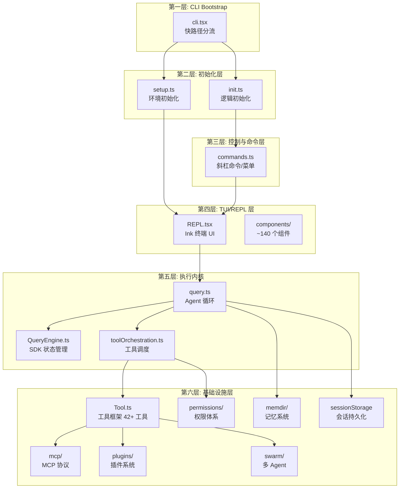
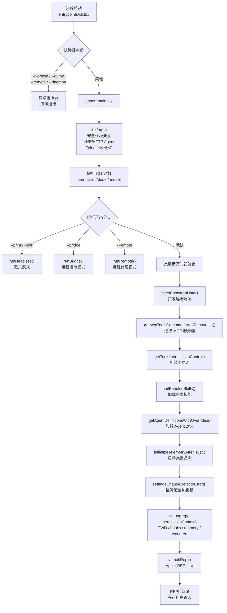
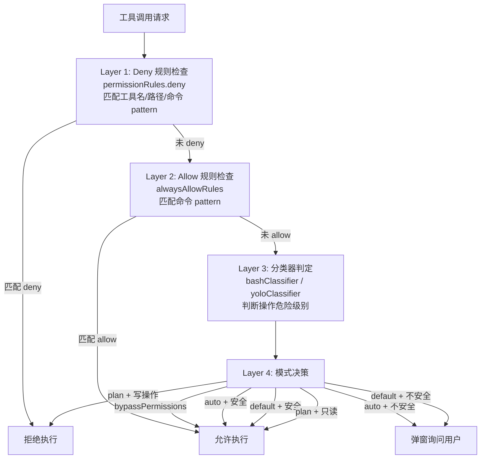
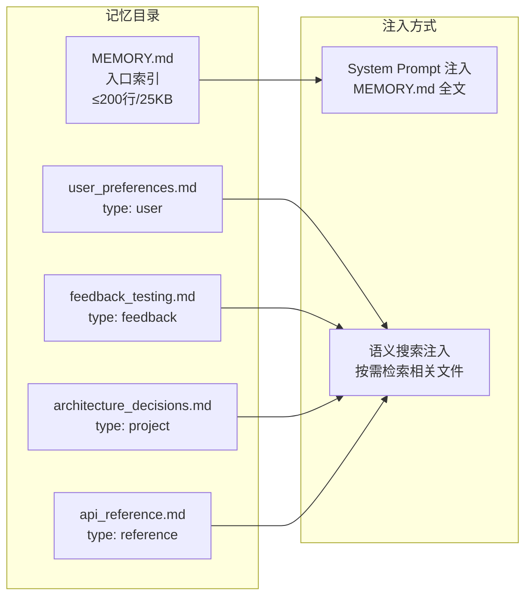
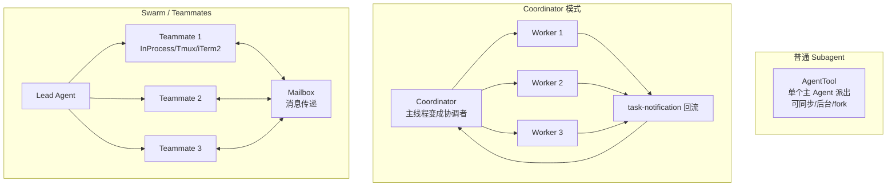
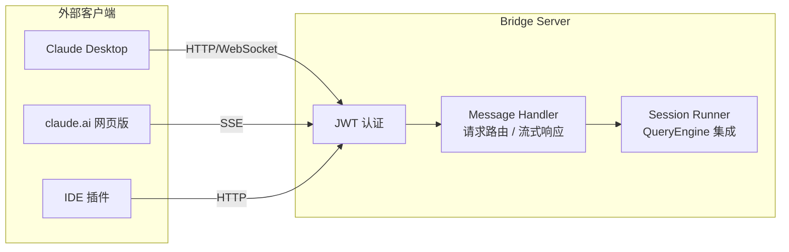

# Claude Code 系统总览

> 本文档是对 Anthropic 官方 CLI 工具 Claude Code 源码的全景式技术分析，覆盖架构设计、核心机制、关键权衡与实现细节。源码基于 2026 年 3 月从 npm 发布包中暴露的 source map 文件还原，共 1,902 个 TypeScript 文件、513K+ 行代码。

---

## 一、系统概述

Claude Code 是 Anthropic 推出的官方命令行工具，定位为"AI 编码代理平台"而非简单的聊天程序。它以 Claude 模型为推理内核，通过终端交互界面让用户以自然语言完成代码编写、项目分析、文件操作、Shell 命令执行等开发任务。

核心特征：

- **Agentic 架构**：采用 ReAct（Reason-Act-Observe）循环模式，LLM 推理与工具执行交替进行，直到任务完成
- **多入口形态**：支持交互式 TUI、无头 SDK、MCP Server、Bridge 远程控制四种运行模式，共享同一套执行内核
- **平台化设计**：内置 42+ 工具、多层权限体系、跨会话记忆系统、MCP/插件/技能扩展机制、多 Agent 协作能力
- **安全优先**：应用层权限检查与系统层沙盒隔离双重防护，配合密钥扫描、Unicode 清洗等专项安全机制

---

## 二、核心架构：六层分层结构

Claude Code 采用严格的六层分层架构，各层职责明确、依赖单向：



### 2.1 CLI Bootstrap 层

**核心文件**：`src/entrypoints/cli.tsx`

这是系统的入口分流器，职责是识别快路径并提前退出，避免启动完整应用。命中快路径时只做最少量的工作：

- `--version`：打印版本号后直接退出
- `--dump-system-prompt`：导出系统提示词后退出
- `--remote-control`：进入远程控制模式
- `--daemon` / `--bg` / `--runner`：进入守护进程或后台运行模式

未命中任何快路径时，通过 `await import('./main.tsx')` 进入完整主启动器。这种设计确保普通快速命令不需要加载 React、Ink、MCP 等重量级模块，启动速度快且副作用少。

### 2.2 初始化层

**核心文件**：`src/entrypoints/init.ts`、`src/setup.ts`

初始化被拆分为逻辑独立的两个阶段：

**`init.ts` — 逻辑初始化**：在 trust 建立前执行，只应用安全的环境变量。初始化证书与 HTTPS 代理、HTTP Agent 配置、注册 telemetry sink 但不发送事件。trust 通过后由 `main.tsx` 调用 `initializeTelemetryAfterTrust()` 应用全部环境变量并启动遥测。

**`setup.ts` — 运行环境初始化**：设置工作目录、启动 hooks 配置监听、初始化 worktree 快照、初始化 session memory 系统、启动 team memory 文件监听。

这种 trust 前后分离的设计意图是防止"配置文件/includes 本身是攻击面"的风险——在确认用户信任之前，不应用可能被恶意篡改的完整环境变量。

### 2.3 控制与命令层

**核心文件**：`src/commands.ts`、`src/commands/`

负责斜杠命令的注册、过滤与分发。命令系统通过 feature flag 控制可用命令集，内部专属命令（如 `backholeSessions`、`bughunter`、`commit`、`teleport` 等）在构建时从外部产物中剪除。命令可用性受 permissionContext、feature gates 和用户类型三重过滤。

### 2.4 TUI/REPL 层

**核心文件**：`src/screens/REPL.tsx`、`src/components/`、`src/ink/`

基于 Ink（React for CLI）构建的终端交互界面，定制了 Ink 框架以支持高效的终端渲染。`AppState` 是系统的共享状态总线，包含消息列表、权限上下文、模型配置、MCP 客户端、插件注册表、Agent 定义、通知队列、远程桥接状态等约 30 个字段。用户输入最终通过 `query()` 进入执行内核。

### 2.5 执行内核

**核心文件**：`src/query.ts`（1,729 行）、`src/QueryEngine.ts`（1,295 行）

这是系统的心脏。`query()` 是一个 async generator，实现了完整的 ReAct 循环：组装消息 -> 调用 API -> 提取工具调用 -> 执行工具 -> 追加结果 -> 下一轮循环。`QueryEngine` 封装了跨轮次的会话状态，支持 SDK 直接实例化而不依赖 Ink/React 渲染。

### 2.6 基础设施层

由四个子层组成：

- **Tool/Permission 层**：`src/Tool.ts` 定义工具接口，`src/tools/` 下有 42+ 工具实现，`src/utils/permissions/` 实现多层权限检查
- **Memory/Persistence 层**：`src/memdir/` 实现跨会话记忆，`src/utils/sessionStorage.ts` 实现会话持久化
- **Extension 层**：`src/services/mcp/` 实现 MCP 协议，`src/plugins/` 实现插件系统，`src/skills/` 实现技能系统
- **Multi-Agent 层**：`src/utils/swarm/` 实现 Swarm 架构，`src/tools/AgentTool/` 实现子代理，`src/coordinator/` 实现协调器模式

---

## 三、启动流程

从进程启动到 REPL 就绪的完整启动链路：



启动流程的关键设计点：

1. **并行预取**：`main.tsx` 在入口处立即发起 MDM 配置预取（`startMdmRawRead`）、Keychain 预取（`startKeychainPrefetch`）、API 预连接（`startApiPreconnect`），这些异步操作与后续初始化并行执行
2. **Trust 分界**：`init()` 只做安全初始化，`initializeTelemetryAfterTrust()` 在 trust 建立后才启动完整遥测
3. **能力装配顺序**：远端配置 -> MCP 连接 -> 工具池 -> 技能 -> Agent 定义 -> 遥测 -> 配置监听，每一步都依赖前一步的结果
4. **延迟加载**：`launchRepl()` 动态加载 `App + REPL` 组件后才启动 Ink 渲染循环

---

## 四、执行引擎

### 4.1 query() 主循环

`query()` 是整个系统的核心主循环，实现为 async generator，产出流式事件供 UI 层消费：

```typescript
// src/query.ts 主循环骨架
export async function* query(
  userMessages: Message[],
  systemPrompt: SystemPrompt,
  toolUseContext: ToolUseContext,
  deps: QueryDeps,
): AsyncGenerator<StreamEvent> {
  let messages = userMessages

  while (true) {
    // 1. 自动压缩检查
    if (shouldAutoCompact(messages)) {
      await autoCompact(messages)
    }

    // 2. 组装 API 请求
    const apiMessages = normalizeMessagesForAPI(messages)

    // 3. 流式调用 Claude API
    for await (const event of deps.claudeApi.stream(apiMessages, systemPrompt)) {
      yield event  // 实时推给 UI
    }

    // 4. 提取 tool_use
    const toolUseBlocks = extractToolUseBlocks(messages)
    if (toolUseBlocks.length === 0) break  // 无工具调用 -> 结束

    // 5. 执行工具
    for await (const update of runTools(toolUseBlocks, ...)) {
      yield update
    }

    // 6. Hook 执行与压缩
    await executePostSamplingHooks(messages, toolUseContext)
    if (shouldCompact(messages)) await compact(messages, toolUseContext)
  }
}
```

选择 async generator 的设计原因：

- **流式输出**：每个 API delta、工具执行进度都能实时 yield 给 UI，无需回调或事件发射器
- **可中断**：调用方可通过 `AbortController` 随时中断循环
- **状态机**：`for(;;)` 循环清晰表达 ReAct 模式的状态转换

### 4.2 stop_reason 处理

| stop_reason | 处理方式 |
|---|---|
| `end_turn` | 循环结束，返回最终结果 |
| `tool_use` | 提取工具调用块，执行工具，追加结果，继续循环 |
| `max_tokens` | 增大输出上限，添加"Please continue"提示，重试 |
| `refusal` | 模型拒绝，结束循环 |

### 4.3 恢复级联

当 `max_tokens` 触发截断时，系统启动恢复级联：

1. 首次：增大 `max_tokens` 至当前值的 2 倍（不超过模型上限）
2. 添加用户消息 "Please continue" 引导模型继续输出
3. 最多重试 3 次，超过后返回 `max_tokens_exceeded` 错误
4. API 返回 413（prompt_too_long）时，触发 Reactive Compact 紧急压缩后重试

### 4.4 QueryEngine 状态管理

`QueryEngine` 封装了跨轮次的可变状态：`mutableMessages`（对话历史）、`abortController`（中断控制）、`totalUsage`（累计 token 用量）、`permissionDenials`（权限拒绝记录）。SDK 可直接实例化 `QueryEngine`，不依赖 Ink/React 渲染。

---

## 五、工具系统

### 5.1 工具接口

所有工具实现统一的 `Tool` 接口（定义于 `src/Tool.ts`，792 行）：

- `name`：工具名称
- `description`：工具描述
- `parameters`：Zod Schema 定义输入参数
- `run(input, context)`：异步执行函数
- `isConcurrencySafe`：是否可并发执行
- `maxResultSizeChars`：结果大小限制

工具通过 `buildTool` 工厂函数构建，统一处理参数校验、权限检查、结果截断等横切关注点。

### 5.2 工具清单

`src/tools/` 下有 42+ 工具实现，按功能分类：

| 分类 | 工具 | 说明 |
|---|---|---|
| 文件操作 | `FileReadTool`、`FileEditTool`、`FileWriteTool` | 读取、编辑、写入文件 |
| 代码搜索 | `GlobTool`、`GrepTool` | 文件名匹配、内容搜索 |
| 命令执行 | `BashTool`、`PowerShellTool` | Shell 命令执行 |
| 网络访问 | `WebFetchTool`、`WebSearchTool` | 网页获取、搜索 |
| 多 Agent | `AgentTool`、`TeamCreateTool`、`SendMessageTool` | 子代理、团队创建、消息传递 |
| 任务管理 | `TodoWriteTool`、`TaskCreateTool`、`TaskGetTool`、`TaskUpdateTool`、`TaskListTool`、`TaskStopTool`、`TaskOutputTool` | 任务与待办管理 |
| 模式切换 | `EnterPlanModeTool`、`ExitPlanModeV2Tool`、`EnterWorktreeTool`、`ExitWorktreeTool` | 计划模式与工作树 |
| MCP | `MCPTool`、`ListMcpResourcesTool`、`ReadMcpResourceTool`、`McpAuthTool` | MCP 工具调用与认证 |
| 其他 | `AskUserQuestionTool`、`NotebookEditTool`、`SkillTool`、`BriefTool`、`ToolSearchTool`、`ConfigTool`、`LSPTool`、`SleepTool`、`ScheduleCronTool`、`REPLTool`、`RemoteTriggerTool`、`SyntheticOutputTool` | 交互、笔记本、技能、配置、LSP 等 |

### 5.3 工具过滤链

工具从注册到可用经历多级过滤：

```
getAllBaseTools()
  -> filterToolsByDenyRules()     # 按 permissionRules.deny 过滤
  -> getTools(permissionCtx)      # 按 mode (simple/full) 过滤
  -> assembleToolPool(mcpTools)   # 合并 MCP 工具，去重
  -> sortByName()                 # 按名称排序（prompt cache 稳定性）
```

最后一部的按名称排序至关重要——工具列表的顺序变化会导致 system prompt 变化，从而使 API 侧的 prompt cache 失效，增加 token 消耗。

### 5.4 工具调度与并发执行

`src/services/tools/toolOrchestration.ts` 中的 `runTools()` 是工具调度核心。`partitionToolCalls()` 将工具调用分为并发安全批次和串行批次：

- **并发安全工具**（`isConcurrencySafe = true`）：只读操作如 `Read`、`Grep`、`Glob`，可通过 `Promise.all` 并发执行，最大并发数 10
- **串行工具**（`isConcurrencySafe = false`）：写操作如 `Edit`、`Write`、`Bash`，必须逐个执行以避免竞态条件

分组的逻辑是贪心的：如果当前工具和前一个工具都是并发安全的，就合入同一批次；否则开启新批次。批次内部先收集 `contextModifier`，批次完毕后按序应用，确保状态一致性。

### 5.5 单工具执行流程

每个工具的执行经过完整的生命周期：

1. 获取工具实例
2. Zod Schema 参数校验
3. 权限检查（`canUseTool`）
4. 执行前 Hook（`preToolUseHooks`）
5. 工具实际执行（`tool.run()`）
6. 执行后 Hook（`postToolUseHooks`）
7. 结果截断与持久化（大结果写入磁盘）
8. 返回 `tool_result` 消息

---

## 六、权限系统

### 6.1 多模式权限

| 模式 | 说明 | 适用场景 |
|---|---|---|
| `default` | 每次敏感操作询问用户 | 日常使用，最安全 |
| `plan` | 只允许只读操作，拒绝所有写操作 | 方案评审与规划 |
| `acceptEdits` | 自动批准文件编辑，命令仍需确认 | 轻度自动化编码 |
| `auto` | ML 分类器自动判断安全性，安全的自动执行 | 高效开发 |
| `bypassPermissions` | 跳过所有权限检查（危险！） | CI/CD、测试脚本 |

`bypassPermissions` 模式有双重保护：Statsig 远程开关（`tengu_disable_bypass_permissions_mode`）可由企业强制禁用，本地配置 `disableBypassPermissionsMode: 'disable'` 也可禁用。即使命令行传入 `--dangerously-skip-permissions` 参数，这些保护仍会生效。

### 6.2 四层检查机制



### 6.3 规则系统

权限规则以配置文件形式管理，支持 Allow 和 Deny 两类规则：

- **Deny 规则**：优先级最高，匹配即拒绝。支持按工具名、路径 glob pattern、命令正则匹配
- **Allow 规则**：匹配即允许，不再弹窗。用户可在确认对话框中选择"Allow always"自动生成规则

规则优先级：MDM 策略（最高） > CLI 参数 > 项目配置 > 用户配置 > 默认规则

### 6.4 ML 分类器

Auto 模式下使用机器学习分类器辅助判断命令安全性：

- **bashClassifier**：将 Bash 命令分为 safe（如 `ls`、`git status`）、confirm（如 `rm`、`npm install`）、deny（如 `rm -rf /`、`mkfs`）三级
- **yoloClassifier**：判断整体操作的危险程度，辅助 auto 模式决策

Auto 模式还会自动剥离危险权限规则（如 `Bash(python:*)`），防止宽泛授权等于无限制运行任意脚本。

---

## 七、记忆系统

### 7.1 两层记忆架构

Claude Code 的记忆系统分为入口层和文件层：

- **入口层**：`MEMORY.md` 文件，每次对话开始时完整注入 system prompt，限制 200 行 / 25KB
- **文件层**：`~/.claude/projects/<project-slug>/memory/` 目录下的独立记忆文件，通过语义搜索按需注入



### 7.2 四种记忆类型

| 类型 | 用途 | 示例 |
|---|---|---|
| `user` | 用户偏好、工作风格 | "使用 bun 不用 npm"、"偏好函数式风格" |
| `feedback` | 用户纠正和反馈 | "不要使用 emoji"、"简洁回答" |
| `project` | 项目级非代码知识 | 截止日期、架构决策原因 |
| `reference` | 外部系统指针 | 仪表盘 URL、Linear 项目 ID |

### 7.3 LLM-in-the-Loop 回忆

记忆的写入不是简单的文本追加，而是通过 LLM 参与的提取过程：

1. 系统判断当前对话是否包含值得记忆的信息（`shouldExtractMemory`）
2. 如果是，fork 一个子 Agent 执行记忆提取（`runForkedAgent`）
3. 子 Agent 使用专门的提取 prompt 分析对话内容
4. 提取结果写入对应类型的记忆文件
5. 更新 `MEMORY.md` 索引

这种"LLM-in-the-loop"设计确保记忆内容的提炼质量，而非原始对话片段的简单堆砌。

### 7.4 与 CLAUDE.md 的关系

`CLAUDE.md` 是项目级指令文件，随代码仓库分发，所有开发者共享；Memory 是用户级知识，存储在 `~/.claude/` 下，每个用户独立。两者配合使用：CLAUDE.md 提供项目规范，Memory 提供个人定制，共同构成完整的上下文。

---

## 八、会话持久化

### 8.1 JSONL Transcript 格式

Claude Code 的会话持久化不是数据库快照模型，而是 append-only JSONL 事件流。每个 session 一个 `.jsonl` 文件，`user`/`assistant`/`attachment`/`system` 类型的消息以追加方式写入。

核心设计决策：`progress` 类型不是 transcript message，不进入 `parentUuid` 主链。旧版本把 progress 混进 transcript 后，恢复时会把真实对话链截断。

### 8.2 附加元数据条目

除了正文消息，transcript 中还包含独立的元数据条目：

- `summary` / `custom-title` / `tag`：会话摘要与标签
- `agent-setting` / `mode`：Agent 配置与运行模式
- `worktree-state` / `pr-link`：工作树状态与 PR 关联

这些元数据与正文同样写进 transcript，但恢复时单独按类型处理。

### 8.3 Session Resume 恢复流水线

`/resume` 不是简单地把旧消息数组重新塞回 REPL，而是经历完整的恢复流水线：

1. **日志加载**：读取 JSONL 文件，解析事件流
2. **链路修复**：修复 compact / snip / progress / parallel tool result 造成的链路断裂
3. **元数据恢复**：恢复 metadata / fileHistory / contextCollapse / worktree / agent 状态
4. **UI 重新接管**：交回 REPL 继续运行

### 8.4 Subagent Transcript 隔离

每个 subagent（fork / teammate / subagent）都有独立的 `.jsonl` 文件，与主 transcript 完全隔离。这确保了：

- 子代理的内部对话不污染主对话链
- 子代理的 transcript 可独立恢复
- 多个并行子代理的 transcript 不会互相干扰

---

## 九、压缩机制

Claude Code 采用三层压缩策略管理上下文窗口，确保长对话不爆 token 限制：

### 9.1 三层压缩架构

| 层级 | 名称 | 触发条件 | 机制 |
|---|---|---|---|
| 1 | 缓存微压缩（microCompact） | 每轮对话 | 清除旧工具结果，保留最近 N 个 |
| 2 | 会话记忆压缩（session-memory compact） | token 接近阈值 | 提取重要信息写入记忆文件 |
| 3 | 完整压缩（full compact） | token 超过阈值 | Fork 子 Agent 生成结构化摘要 |

### 9.2 microCompact

最轻量的压缩，每轮对话自动执行。只做一件事：将超过 `keepRecent`（默认 5 个）的旧工具结果替换为 `[Old tool result content cleared]`。保留用户消息和助手回复的文本，只清除占用大量 token 的工具执行结果。

### 9.3 session-memory compact

将重要信息从对话中提取出来写入记忆文件，而非直接摘要。提取的信息按四种记忆类型分类（user/feedback/project/reference），写入对应的记忆文件。这种方式的优势是信息可跨会话复用，而非仅在当前对话的摘要中。

### 9.4 full compact

最彻底的压缩，由 fork 的子 Agent 执行：

1. 移除所有图片（节省大量 token）
2. Fork 子 Agent 使用 9 节结构化摘要 prompt 生成摘要
3. 构建压缩后消息列表：压缩边界标记 + 摘要 + 最近修改的文件内容 + 最近的几条消息
4. 典型效果：180K tokens -> ~30K tokens，回收率 ~83%

### 9.5 Reactive Compact

当 API 返回 413（prompt_too_long）时触发的紧急压缩，使用更激进的压缩比（50%）后重试请求。这是最后的防线。

### 9.6 断路器保护

连续压缩失败 3 次后触发断路器，停止尝试压缩但继续运行。防止压缩失败导致循环卡死。

---

## 十、扩展机制

### 10.1 MCP 协议

**核心文件**：`src/services/mcp/`

MCP（Model Context Protocol）是 Claude Code 接入第三方工具的标准协议。Claude Code 既能作为 MCP client 消费外部能力，也能作为 MCP server 对外暴露能力。

MCP 连接管理器（`MCPConnectionManager`）支持两种传输层：

- **Stdio Transport**：本地 MCP 服务器，通过 stdin/stdout 通信
- **SSE/HTTP Transport**：远程 MCP 服务器，通过 HTTP+SSE 通信

MCP 工具命名规则：`mcp__<serverName>__<toolName>`，例如 `mcp__filesystem__read_file`。MCP 提供四种能力：Tools（工具注册）、Resources（资源提供）、Prompts（斜杠命令注册）、Elicitation（外部认证流程）。

所有 MCP 返回内容经过 `recursivelySanitizeUnicode` 清洗，防御 Unicode 隐写攻击。

### 10.2 Skills 系统

**核心文件**：`src/skills/`

技能系统是一种轻量级的领域专用扩展机制，比插件更简单，通过描述性配置定义自动激活规则和指令注入。技能由 `SKILL.md` 定义，包含描述、激活关键词/文件模式、详细指令、工具引用和参考文档。

技能发现路径：内置技能（`src/skills/`） -> 用户技能（`~/.claude/skills/`） -> 项目技能（`.claude/skills/`）。

当用户输入匹配技能的激活关键词或文件模式时，技能的指令自动注入上下文，无需用户手动调用。

### 10.3 Plugin 系统

**核心文件**：`src/plugins/`

插件系统允许第三方开发者扩展 Claude Code 的功能，包括自定义工具、斜杠命令、Hook 和 UI 扩展。插件通过 `plugin.json` 清单定义元数据和能力，支持 `fs.read`、`fs.write`、`network.fetch` 等权限声明。

与技能的区别：插件需要编写 JavaScript 代码，能力更强（工具、命令、Hook）；技能仅需配置文件，开发门槛更低（指令注入、自动激活）。

---

## 十一、多 Agent 架构

Claude Code 的 multi-agent 不是单一实现，而是三套并存的多 Agent 运行模型：



### 11.1 普通 Subagent

最基础的多 Agent 模式。主 Agent 通过 `AgentTool` 创建子 Agent，子 Agent 继承部分上下文与工具池，完成后把结果回传给主线程。支持同步等待、后台运行、fork 三种执行方式。

### 11.2 Coordinator 模式

**核心文件**：`src/coordinator/coordinatorMode.ts`

主线程变成 coordinator，通过 `AgentTool` 持续派出多个 worker。Worker 的结果通过 task-notification 机制回流给 coordinator，由 coordinator 统一整合。适合需要将大任务拆分为多个独立子任务并行处理的场景。

### 11.3 Swarm / Teammates 模式

**核心文件**：`src/utils/swarm/`

最复杂的多 Agent 模式，包含完整的 agent runtime：

- **Team 创建**：通过 `TeamCreateTool` 创建团队，指定 teammates 配置
- **多后端支持**：InProcess（同进程，最快）、Tmux（独立终端，可观察）、iTerm2（macOS 专用，AppleScript 控制）
- **Mailbox 消息传递**：通过 `SendMessageTool` 实现 teammate 间通信，`useInboxPoller` 轮询收件箱
- **权限桥接**：`leaderPermissionBridge.ts` 实现 lead -> teammate 的权限传递
- **共享任务平面**：`TaskCreateTool` / `TaskListTool` 等工具实现团队级任务管理

### 11.4 上下文隔离

所有多 Agent 模式都使用 `AsyncLocalStorage` 实现上下文隔离，确保子 Agent 的状态不污染父 Agent。子 Agent 继承父 Agent 的只读上下文，但拥有独立的可变状态。

---

## 十二、Bridge / 远程控制

### 12.1 架构概述

**核心文件**：`src/bridge/bridgeMain.ts`

Bridge 模式允许外部应用（如 claude.ai 网页版、Claude Desktop、IDE 插件）远程控制 Claude Code，实现双向通信。



### 12.2 通信协议

| 协议 | 用途 | 特点 |
|---|---|---|
| HTTP POST | 同步请求 | 简单直接 |
| WebSocket | 双向实时通信 | 全双工 |
| SSE | 服务器推送事件 | 单向推送，适合流式输出 |

### 12.3 JWT 认证

Bridge 使用 JWT 进行认证和授权。Token 包含标准 claims（iss/sub/aud/exp/iat）和自定义 claims（sessionId/permissions）。Token 有效期 1 小时，支持刷新。所有 API 请求必须携带有效 Token。

### 12.4 流式响应

Query 的响应通过 SSE 流式推送。客户端发送查询请求后，Bridge Server 建立 SSE 连接，将 `message_start`、`content_block_delta`、`message_stop` 等事件实时推送给客户端，实现与 TUI 相同的流式体验。

---

## 十三、设计哲学与权衡

### 13.1 Feature Flag 作为编译门（死代码消除）

Claude Code 使用 Bun 的 `feature()` 函数实现编译时死代码消除。未启用的功能代码在编译阶段被完全剔除，实现零运行时开销和更小的包体积。例如：

```typescript
const SleepTool = feature('PROACTIVE')
  ? require('./tools/SleepTool/SleepTool.js').SleepTool
  : null
```

运行时通过 GrowthBook 实现动态开关和 A/B 测试。编译时保证性能，运行时保证灵活性。

### 13.2 渐进加载与急切预取

`main.tsx` 入口处立即发起多个异步预取操作（MDM 配置、Keychain、API 预连接），这些操作与后续初始化并行执行。`launchRepl()` 动态加载 App + REPL 组件。整体策略是"能并行的就并行，能延迟的就延迟"，在启动速度和功能完整之间取得平衡。

### 13.3 Immutable Store 与 Selector 重渲染

`AppState` 采用不可变更新模式，配合 selector-based 精确重渲染。只有 selector 关心的字段变化时才触发组件更新，避免 React 全量重渲染在终端场景下的性能问题。这也是 Claude Code 定制 Ink 框架（而非使用原生 Ink）的原因之一。

### 13.4 Async Generator 作为查询循环状态机

`query()` 使用 async generator 而非传统回调或事件发射器，核心优势：

- 每个事件（API delta、工具进度）都能实时 yield 给消费者
- 消费者可通过 `for await...of` 语法自然消费流
- 内置可中断性（`AbortController` 配合 `yield` 检查）
- `for(;;)` 循环体清晰表达 ReAct 状态转换

### 13.5 流式工具执行

工具执行采用流式设计：`runTools()` 本身也是 async generator，实时 yield 执行进度。这使 UI 层能在工具执行过程中实时更新（显示进度条、中间结果），而非等待工具完全执行完毕后才刷新。

### 13.6 缓存感知的 Prompt 构建

System prompt 的构建顺序和工具列表排序经过精心设计，以最大化 API 侧的 prompt cache 命中率：

- 工具列表按名称字母序排序，确保工具集不变时 prompt 前缀稳定
- System prompt 采用分节构建（`systemPromptSections.ts`），静态部分（工具描述、安全规则）和动态部分（memory、git status）分离，静态部分可长期缓存
- Feature flag 变化时主动清除缓存，避免缓存不一致

### 13.7 安全优先的权限模型

权限系统的设计哲学是"宁可多问一次，不可漏放一次"：

- 默认模式（default）下所有写操作都需要用户确认
- Auto 模式不信任宽泛授权，自动剥离 `Bash(python:*)` 等危险规则
- `bypassPermissions` 模式有远程和本地双重开关，企业可强制禁用
- 权限检查在工具执行之前，沙盒隔离在工具执行之时，形成双重防护

---

## 十四、技术栈

| 技术 | 用途 | 说明 |
|---|---|---|
| TypeScript / TSX | 主要开发语言 | 全项目 1,902 个 TS/TSX 文件 |
| Bun | 运行时与构建工具 | 使用 `feature()` 编译时死代码消除 |
| Ink (定制版) | 终端 UI 框架 | React for CLI，定制了 reconciler 和渲染器 |
| React | UI 组件模型 | ~140 个组件，不可变状态更新 |
| Zod | Schema 校验 | 工具参数定义与运行时校验 |
| Commander.js | CLI 参数解析 | 命令行选项与子命令 |
| GrowthBook | Feature Flag | A/B 测试与运行时功能开关 |
| Statsig | 远程配置 | 企业级功能门控 |
| Datadog | 遥测后端 | 性能监控与错误追踪 |
| JWT | Bridge 认证 | 远程控制安全认证 |

---

## 十五、代码规模

| 指标 | 数值 |
|---|---|
| TypeScript 文件总数 | 1,902 |
| 代码总行数 | 513K+ |
| UI 组件数 | ~140 |

关键大文件：

| 文件 | 行数 | 职责 |
|---|---|---|
| `src/main.tsx` | 4,683 | 总控入口，系统编排中心 |
| `src/query.ts` | 1,729 | Agent 循环主状态机 |
| `src/QueryEngine.ts` | 1,295 | SDK 入口，会话状态管理 |
| `src/Tool.ts` | 792 | 工具类型定义与工厂函数 |
| `src/tools.ts` | 389 | 工具注册表与过滤 |
| `src/setup.ts` | 477 | 运行环境初始化 |

---

## 附录：术语表

| 术语 | 全称 | 含义 |
|---|---|---|
| ReAct | Reason-Act-Observe | 推理-行动-观察循环模式 |
| TUI | Terminal User Interface | 终端用户界面 |
| REPL | Read-Eval-Print Loop | 交互式命令循环 |
| MCP | Model Context Protocol | 模型上下文协议 |
| JSONL | JSON Lines | 逐行 JSON 格式 |
| SSE | Server-Sent Events | 服务器推送事件 |
| JWT | JSON Web Token | JSON 网络令牌 |
| MDM | Mobile Device Management | 移动设备管理（企业策略） |
| PII | Personally Identifiable Information | 个人身份信息 |
| async gen | Async Generator | 异步生成器 |
