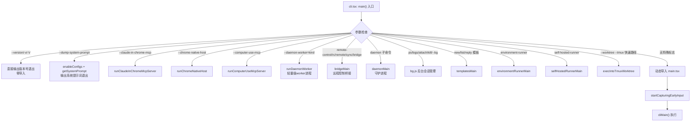
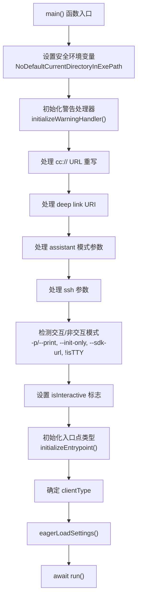
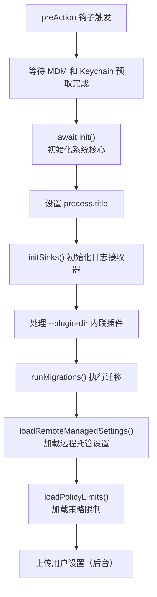
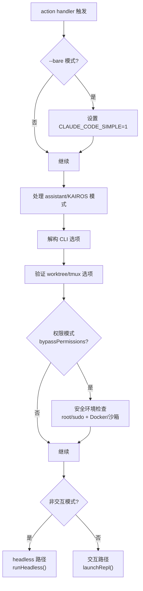

# 启动与引导流程

Claude Code 的启动过程采用分层引导架构，从轻量级入口点到完整 CLI 逐层加载，在快速路径和完整功能之间取得平衡。整个流程的核心思想是：**尽可能延迟模块加载，对特殊命令实现零依赖快速退出**。

## 整体架构概览

启动过程分为三个主要阶段：

1. **快速路径分发**（`src/entrypoints/cli.tsx`）：检查命令行参数，对特殊子命令直接处理并退出
2. **主函数入口**（`src/main.tsx`）：动态导入，构建 Commander.js 程序定义，执行初始化
3. **动作处理器**（`main.tsx` 中的 action handler）：根据交互/无头模式分支执行



## 阶段一：快速路径分发（cli.tsx）

### 环境预处理

在 `main()` 函数之前，`cli.tsx` 执行两项关键的环境预处理：

1. **corepack 自动固定修复**：设置 `COREPACK_ENABLE_AUTO_PIN='0'`，防止 corepack 意外修改 package.json
2. **CCR 堆内存限制**：当 `CLAUDE_CODE_REMOTE='true'` 时，设置 `NODE_OPTIONS` 增加 `--max-old-space-size=8192`，为容器环境提供更大的堆空间
3. **Ablation baseline**：当 `feature('ABLATION_BASELINE')` 启用且设置了 `CLAUDE_CODE_ABLATION_BASELINE` 环境变量时，批量设置简化模式相关的环境变量（`CLAUDE_CODE_SIMPLE`、`DISABLE_COMPACT` 等），这在模块导入前执行，因为 BashTool/AgentTool 在导入时即捕获这些环境变量

### 零导入版本检查

```typescript
// cli.tsx:L37-L42
if (args.length === 1 && (args[0] === '--version' || args[0] === '-v' || args[0] === '-V')) {
  console.log(`${MACRO.VERSION} (Claude Code)`);
  return;
}
```

`--version` 是最极致的快速路径：不触发任何动态导入，`MACRO.VERSION` 在构建时内联替换。此路径在约 1ms 内完成。

### 各快速路径详解

**`--dump-system-prompt`**（`cli.tsx:L53-L71`）：Ant-only 功能，用于系统提示词敏感性评估。仅加载 `enableConfigs`、`getMainLoopModel`、`getSystemPrompt` 三个模块，支持 `--model` 参数指定模型。

**MCP 服务器模式**（`cli.tsx:L72-L93`）：三个 MCP 服务器入口：
- `--claude-in-chrome-mcp`：Chrome 浏览器集成 MCP 服务器
- `--chrome-native-host`：Chrome 原生消息宿主
- `--computer-use-mcp`：计算机使用 MCP 服务器（需 `CHICAGO_MCP` 特性门控）

**`--daemon-worker`**（`cli.tsx:L100-L106`）：守护进程工作器入口。设计为轻量级——不调用 `enableConfigs()`、不初始化分析接收器。如果工作器需要配置/认证（如 assistant 类型），由其自身 `run()` 函数内部调用。

**远程控制/Bridge 模式**（`cli.tsx:L112-L162`）：支持 `remote-control`/`rc`/`remote`/`sync`/`bridge` 五个别名。执行严格的启动检查：
1. OAuth 认证检查（必须在 GrowthBook 门控检查之前，因为 GB 需要认证头来获取用户上下文）
2. GrowthBook 运行时门控检查
3. 最低版本检查
4. 组织策略限制检查（`allow_remote_control`）

**守护进程模式**（`cli.tsx:L165-L180`）：长运行监督进程，需 `DAEMON` 特性门控。加载 `enableConfigs` 和 `initSinks` 后进入 `daemonMain`。

**后台会话管理**（`cli.tsx:L185-L209`）：`ps`/`logs`/`attach`/`kill` 子命令及 `--bg`/`--background` 标志。操作 `~/.claude/sessions/` 注册表。标志字面量内联以确保 `bg.js` 仅在实际分发时加载。

**模板任务命令**（`cli.tsx:L212-L223`）：`new`/`list`/`reply` 子命令。使用 `process.exit(0)` 而非 `return`，因为 Ink TUI 可能留下阻止自然退出的事件循环句柄。

**Worktree + tmux 快速路径**（`cli.tsx:L248-L274`）：当同时指定 `--tmux` 和 `--worktree` 时，在加载完整 CLI 之前直接 exec 进入 tmux。这是性能敏感路径——需要在加载大量模块前完成 tmux 会话创建。

**`--bare` 标志提前设置**（`cli.tsx:L283-L285`）：在加载 main.tsx 之前设置 `CLAUDE_CODE_SIMPLE='1'`，确保特性门控在模块求值和 Commander 选项构建期间生效，而非仅在 action handler 内部。

### 主入口动态导入

```typescript
// cli.tsx:L288-L298
const { startCapturingEarlyInput } = await import('../utils/earlyInput.js');
startCapturingEarlyInput();
profileCheckpoint('cli_before_main_import');
const { main: cliMain } = await import('../main.js');
profileCheckpoint('cli_after_main_import');
await cliMain();
```

在动态导入 `main.js` 之前启动早期输入捕获，用户在模块加载期间键入的字符不会丢失。`profileCheckpoint` 调用用于启动性能分析。

## 阶段二：主函数入口（main.tsx）

### 模块求值阶段的并行预取

`main.tsx` 的顶层 import 区域（约 200 行 import 语句）执行期间，两个并行预取已经在运行：

```typescript
// main.tsx:L13-L20
import { startMdmRawRead } from './utils/settings/mdm/rawRead.js';
startMdmRawRead();   // MDM 子进程读取（plutil/reg query）
import { startKeychainPrefetch } from './utils/secureStorage/keychainPrefetch.js';
startKeychainPrefetch();  // macOS keychain 读取（OAuth + legacy API key）
```

这些子进程在约 135ms 的模块导入期间并行完成，使得后续 `init()` 中的同步读取变为接近零延迟。

### 调试器检测

`main.tsx` 在顶层执行调试器检测（`main.tsx:L232-L271`），检查 `process.execArgv` 和 `NODE_OPTIONS` 中的 `--inspect`/`--debug` 标志，以及 Node.js inspector 是否活跃。外部构建版本在检测到调试器时直接 `process.exit(1)`，防止逆向工程。

### main() 函数流程



**交互模式判定**（`main.tsx:L800-L812`）：当存在 `-p`/`--print`、`--init-only`、`--sdk-url` 或 `stdout` 不是 TTY 时，判定为非交互模式。非交互模式下停止早期输入捕获。

**入口点类型初始化**（`main.tsx:L517-L540`）：根据命令行参数设置 `CLAUDE_CODE_ENTRYPOINT` 环境变量，可能的值包括：`mcp`（MCP serve）、`claude-code-github-action`、`sdk-cli`、`cli`。SDK 和其他入口点通过环境变量提前设置，此处跳过。

**客户端类型确定**（`main.tsx:L818-L843`）：根据 `CLAUDE_CODE_ENTRYPOINT` 和其他环境变量确定客户端类型，如 `github-action`、`sdk-typescript`、`sdk-python`、`sdk-cli`、`claude-vscode`、`local-agent`、`claude-desktop`、`remote`、`cli`。

**eagerLoadSettings()**（`main.tsx:L502-L516`）：在 `init()` 之前解析 `--settings` 和 `--setting-sources` 标志，确保设置在初始化开始时就已过滤加载。

## 阶段三：Commander.js 程序定义与运行

### run() 函数与 Commander.js 程序

`run()` 函数（`main.tsx:L884` 起）创建 Commander.js 程序实例：

```typescript
const program = new CommanderCommand()
  .configureHelp(createSortedHelpConfig())
  .enablePositionalOptions();
```

帮助配置按长选项名排序，`enablePositionalOptions()` 允许位置参数与选项混合使用。

### preAction 钩子

preAction 钩子是初始化的核心枢纽，仅在执行命令时触发（不显示帮助时）：



**迁移系统**（`main.tsx:L326-L352`）：维护 `CURRENT_MIGRATION_VERSION`（当前版本 11），当全局配置中的版本号不匹配时执行所有迁移：
- `migrateAutoUpdatesToSettings`：自动更新设置迁移
- `migrateBypassPermissionsAcceptedToSettings`：跳过权限确认迁移
- `migrateEnableAllProjectMcpServersToSettings`：MCP 服务器设置迁移
- `resetProToOpusDefault`：重置 Pro 到 Opus 默认值
- `migrateSonnet1mToSonnet45`/`migrateSonnet45ToSonnet46`/`migrateOpusToOpus1m`：模型名称迁移
- `migrateReplBridgeEnabledToRemoteControlAtStartup`：Bridge 到远程控制迁移

### 动作处理器分支

动作处理器（`main.tsx:L1006` 起）是程序的主逻辑入口，处理所有 CLI 选项的解构和验证：



**Headless 路径**（`-p`/`--print`）：使用 `QueryEngine` 直接执行查询，输出结果到 stdout 后退出。支持 `--output-format`（text/json/stream-json）、`--max-turns`、`--max-budget-usd` 等选项。

**交互路径**：调用 `launchRepl()` 启动 Ink 终端 UI，进入 REPL 交互循环。

## 启动性能优化策略

Claude Code 的启动过程经过精心优化，主要策略包括：

1. **快速路径零导入**：`--version` 不触发任何动态导入
2. **选择性加载**：每个快速路径仅导入所需模块，避免加载完整 CLI
3. **并行预取**：MDM、Keychain 读取在模块求值阶段并行启动
4. **早期输入捕获**：`startCapturingEarlyInput()` 在导入 main.tsx 之前启动
5. **延迟初始化**：`init()` 通过 `memoize` 确保只执行一次，非关键初始化推迟到 `startDeferredPrefetches()`
6. **特性门控死代码消除**：`feature()` 标志在构建时消除未启用的代码路径
7. **API 预连接**：`preconnectAnthropicApi()` 在配置完成后立即发起 TCP+TLS 握手，与后续工作重叠约 100-200ms
8. **启动性能分析**：`profileCheckpoint()` 在关键节点记录时间戳，用于性能监控

## 关键文件索引

| 文件 | 职责 |
|------|------|
| `src/entrypoints/cli.tsx` | 快速路径分发，零导入版本检查 |
| `src/main.tsx` | Commander.js 程序定义，preAction 钩子，动作处理器 |
| `src/entrypoints/init.ts` | 核心初始化逻辑（memoized） |
| `src/setup.ts` | 运行时环境设置 |
| `src/utils/startupProfiler.js` | 启动性能分析 |
| `src/utils/earlyInput.js` | 早期输入捕获 |
| `src/bootstrap/state.js` | 全局状态管理 |
