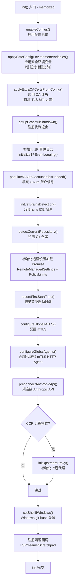
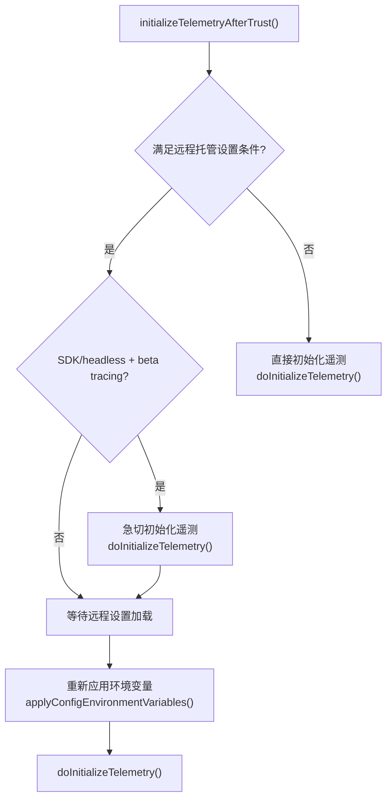
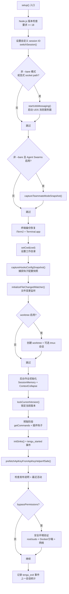

# 初始化系统

Claude Code 的初始化系统由两个核心模块组成：`init.ts` 负责全局一次性初始化，`setup.ts` 负责每次会话的运行时环境配置。两者协作确保从配置加载到安全检查的完整初始化链路正确执行。

## init.ts：记忆化全局初始化

`init.ts` 的核心导出是 `init` 函数，通过 `lodash-es/memoize` 包装，确保整个进程生命周期中只执行一次。这是所有后续操作的前置依赖——从配置读取到网络请求，都依赖 `init()` 完成后的环境状态。



### 配置系统启用

`enableConfigs()` 是初始化的第一步，启用配置读取系统。在此之前，任何对 `getGlobalConfig()` 或 `getSettingsForSource()` 的调用都会失败。此函数的调用时机经过精心设计：在 `cli.tsx` 的快速路径中，只有需要配置的路径（如 `--dump-system-prompt`、bridge、daemon）才会调用它。

### 安全环境变量应用

初始化分为两阶段环境变量应用：

1. **`applySafeConfigEnvironmentVariables()`**（`init.ts:L74`）：在信任对话框之前调用，仅应用不涉及安全风险的环境变量（如代理设置、模型配置等）
2. **`applyConfigEnvironmentVariables()`**：在信任对话框之后调用，应用完整的环境变量，包括远程托管设置中的变量

这种两阶段设计确保未受信任目录中的设置不会在用户明确授权前影响执行环境。

### CA 证书配置

```typescript
// init.ts:L78-L79
applyExtraCACertsFromConfig();
```

必须在首次 TLS 握手之前执行。Bun 通过 BoringSSL 在启动时缓存 TLS 证书存储，如果此步骤延迟，后续的 API 连接将无法使用自定义 CA 证书。

### 1P 事件日志初始化

```typescript
// init.ts:L94-L105
void Promise.all([
  import('../services/analytics/firstPartyEventLogger.js'),
  import('../services/analytics/growthbook.js'),
]).then(([fp, gb]) => {
  fp.initialize1PEventLogging();
  gb.onGrowthBookRefresh(() => {
    void fp.reinitialize1PEventLoggingIfConfigChanged();
  });
});
```

采用 fire-and-forget 模式，动态导入延迟加载 OpenTelemetry sdk-logs/resources 模块。`growthbook.js` 此时应已在模块缓存中（`firstPartyEventLogger` 导入了它），因此第二次动态导入不增加加载成本。当 GrowthBook 特性标志刷新时，重新初始化日志记录器以应用新配置。

### mTLS 与代理配置

mTLS 和代理配置是网络通信基础设施的核心：

1. **`configureGlobalMTLS()`**（`init.ts:L137`）：从配置中读取客户端证书设置，配置全局 mTLS
2. **`configureGlobalAgents()`**（`init.ts:L147`）：配置全局 HTTP Agent，处理代理和/或 mTLS 场景
3. **`preconnectAnthropicApi()`**（`init.ts:L159`）：预连接 Anthropic API，将 TCP+TLS 握手（约 100-200ms）与后续约 100ms 的 action handler 工作重叠。在代理/mTLS/Unix socket/云提供商环境下跳过

### 上游代理初始化

仅在 CCR（Claude Code Remote）模式下初始化（`init.ts:L167-L183`）。启动本地 CONNECT 中继，允许子进程通过凭证注入访问组织配置的上游代理。采用 fail-open 策略——初始化失败时继续运行，仅记录警告。

### 注册清理回调

`init.ts` 注册了三个清理回调：

1. **`shutdownLspServerManager`**：关闭 LSP 服务器管理器
2. **`cleanupSessionTeams`**：清理会话中创建的团队（懒加载 swarm 代码）
3. **`ensureScratchpadDir`**：确保 scratchpad 目录存在（仅在启用时）

### Scratchpad 初始化

当 `isScratchpadEnabled()` 返回 true 时，同步创建 scratchpad 目录。这是一个 await 操作，因为目录创建涉及文件系统 I/O。

## initializeTelemetryAfterTrust：信任后遥测初始化

`initializeTelemetryAfterTrust()` 在用户接受信任对话框后调用，根据是否满足远程托管设置条件分两条路径：



**急切初始化路径**（`init.ts:L252-L258`）：对于 SDK/headless 模式且启用了 beta tracing 的情况，立即初始化遥测，确保 tracer 在第一次查询运行前就绪。后续异步路径仍然运行，但 `doInitializeTelemetry()` 内部有防重入保护。

### 懒加载 OpenTelemetry

`setMeterState()` 函数（`init.ts:L305-L340`）通过动态导入延迟加载约 400KB 的 OpenTelemetry + protobuf 模块：

```typescript
const { initializeTelemetry } = await import('../utils/telemetry/instrumentation.js');
```

gRPC exporter（约 700KB 的 `@grpc/grpc-js`）在 `instrumentation.ts` 内部进一步懒加载。这种分层懒加载策略显著减少了启动时的模块加载开销。

## setup.ts：运行时环境配置

`setup()` 函数在 `init()` 完成后、REPL 渲染之前调用，负责会话级别的环境配置。



### Node.js 版本检查

```typescript
// setup.ts:L70-L79
const nodeVersion = process.version.match(/^v(\d+)\./)?.[1];
if (!nodeVersion || parseInt(nodeVersion) < 18) {
  console.error(chalk.bold.red('Error: Claude Code requires Node.js version 18 or higher.'));
  process.exit(1);
}
```

这是硬性要求，Node.js 18 以下版本直接退出。

### UDS 消息服务器

在 Mac/Linux 上启动 Unix Domain Socket 消息服务器（`setup.ts:L89-L102`）。此服务器为默认启用功能，创建 tmpdir 中的 socket 文件。必须在任何 hook（特别是 SessionStart）spawn 之前完成，因为 hook 子进程通过 `$CLAUDE_CODE_MESSAGING_SOCKET` 环境变量发现此 socket。`--bare` 模式跳过此步骤，除非通过 `--messaging-socket-path` 显式指定。

### Teammate 快照

当 Agent Swarms 启用且非 `--bare` 模式时，捕获 teammate 模式快照（`setup.ts:L105-L110`）。此快照在会话开始时一次性捕获，用于后续 teammate 模式决策。

### 终端备份恢复

仅交互模式下执行（`setup.ts:L115-L158`）。检查 iTerm2 和 Terminal.app 的备份恢复状态，处理之前被中断的终端设置过程。如果检测到中断的设置，恢复原始设置并提示用户重启终端。

### 工作目录与钩子配置

**`setCwd(cwd)`**（`setup.ts:L161`）必须在所有依赖 cwd 的代码之前调用。之后立即捕获钩子配置快照（`captureHooksConfigSnapshot()`），防止隐藏的钩子修改。快照在 `setCwd()` 之后执行，确保从正确目录加载钩子配置。

### Worktree 创建

当 `--worktree` 启用时（`setup.ts:L176-L285`），执行完整的 worktree 设置流程：

1. 验证 git 仓库或 WorktreeCreate hook 的存在
2. 解析到主仓库根目录（处理从 worktree 内部调用的情况）
3. 生成 tmux 会话名（如果 `--tmux` 启用）
4. 创建 worktree 和可选的 tmux 会话
5. 切换工作目录到新 worktree
6. 更新钩子配置快照

### 后台作业初始化

`setup.ts:L287-L304` 启动关键的后台作业：

- **`initSessionMemory()`**：注册内存钩子，同步操作，门控检查延迟执行
- **`initContextCollapse()`**：初始化上下文折叠服务（需 `CONTEXT_COLLAPSE` 特性门控）
- **`lockCurrentVersion()`**：锁定当前版本防止被其他进程删除

### 预取阶段

预取阶段（`setup.ts:L306-L381`）启动多项并行 I/O 操作：

1. **`getCommands()`**：加载所有命令源（技能、插件、工作流）
2. **`loadPluginHooks()`**：预加载插件钩子
3. **`setupPluginHookHotReload()`**：设置插件钩子热重载
4. **提交归属钩子**：Ant-only，注册 attribution 跟踪钩子
5. **会话文件访问钩子**：注册会话文件访问分析钩子
6. **团队内存同步监视器**：启动团队内存同步 watcher
7. **`initSinks()`**：附加错误日志和分析接收器
8. **`prefetchApiKeyFromApiKeyHelperIfSafe()`**：安全预取 API 密钥

### 权限安全强制

当权限模式为 `bypassPermissions` 或指定了 `--dangerously-skip-permissions` 时（`setup.ts:L396-L442`），执行严格的安全检查：

1. **root/sudo 检查**：Unix 系统上禁止以 root 运行（沙箱环境例外）
2. **Ant 内部用户检查**：必须运行在 Docker/Bubblewrap/沙箱环境中且无互联网访问

### 会话退出遥测

`setup.ts:L449-L476` 记录上一会话的 `tengu_exit` 事件，包含完整的会话统计：成本、持续时间、API/tool 耗时、代码行变更、token 使用量、FPS 指标等。这些值在会话退出时写入项目配置，不会在记录后清除，因为恢复会话时仍需使用。

## 错误处理

`init()` 的整个初始化过程包裹在 try-catch 中（`init.ts:L215-L237`）。对于 `ConfigParseError`：

- **非交互会话**：直接写入 stderr 并优雅退出
- **交互会话**：动态导入 `InvalidConfigDialog` 组件显示错误对话框

其他类型的错误直接重新抛出。

## 关键文件索引

| 文件 | 职责 |
|------|------|
| `src/entrypoints/init.ts` | 记忆化全局初始化，配置/证书/网络/遥测 |
| `src/setup.ts` | 会话级环境配置，权限安全，预取 |
| `src/utils/config.js` | 配置系统核心（enableConfigs 等） |
| `src/utils/managedEnv.js` | 环境变量管理（安全/完整应用） |
| `src/utils/caCertsConfig.js` | CA 证书配置 |
| `src/utils/gracefulShutdown.js` | 优雅退出机制 |
| `src/utils/proxy.js` | 代理配置 |
| `src/utils/mtls.js` | mTLS 配置 |
| `src/utils/telemetry/instrumentation.js` | OpenTelemetry 遥测初始化（懒加载） |
| `src/upstreamproxy/upstreamproxy.js` | CCR 上游代理 |
