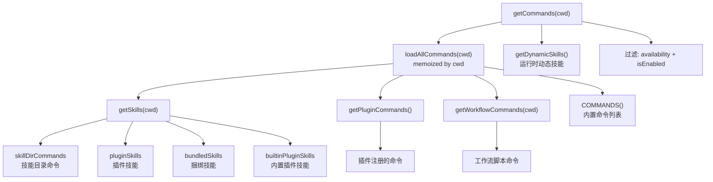
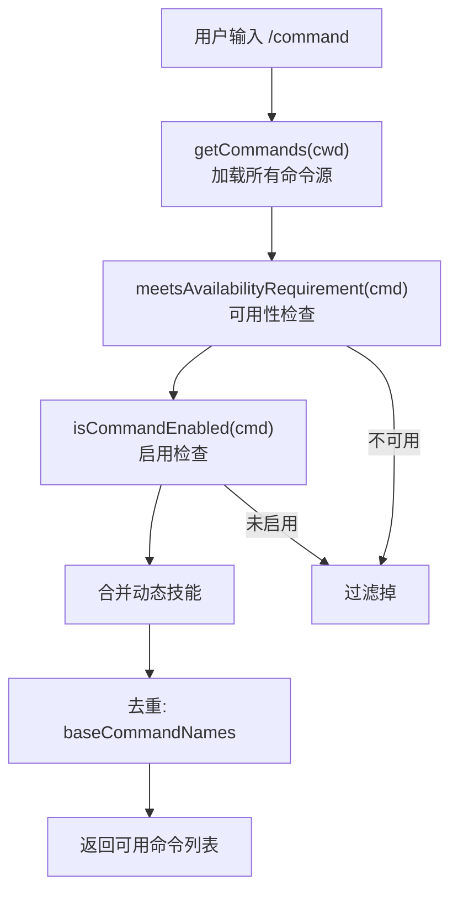

# CLI接口与命令系统

Claude Code 的 CLI 接口基于 Commander.js 构建，提供丰富的命令行选项和子命令体系。命令系统（`commands.ts`）注册了 90+ 个斜杠命令，来源涵盖内置命令、技能目录、插件、捆绑技能、内置插件、工作流和 MCP 等多个渠道，并通过特性门控、可用性要求和远程安全过滤实现精细的命令可见性控制。

## Commander.js 程序定义

`main.tsx` 中的 `run()` 函数创建 Commander.js 程序实例，定义了完整的 CLI 接口：

```typescript
// main.tsx:L902
const program = new CommanderCommand()
  .configureHelp(createSortedHelpConfig())
  .enablePositionalOptions();
```

帮助系统按长选项名排序，`enablePositionalOptions()` 允许位置参数与选项混合使用，支持 `claude "explain this code"` 的自然用法。

### 核心 CLI 选项

程序定义了超过 50 个顶层选项，按功能分类如下：

**调试与日志**：
- `-d, --debug [filter]`：启用调试模式，支持分类过滤（如 `"api,hooks"` 或 `"!1p,!file"`）
- `--debug-to-stderr`：调试输出到 stderr
- `--debug-file <path>`：调试日志写入指定文件
- `--verbose`：详细输出模式
- `--mcp-debug`：[已废弃] MCP 调试模式

**执行模式**：
- `-p, --print`：非交互模式，输出结果后退出。跳过信任对话框
- `--bare`：最小模式，跳过钩子/LSP/插件同步/归属/自动内存/后台预取/Keychain 读取/CLAUDE.md 自动发现，设置 `CLAUDE_CODE_SIMPLE=1`
- `--init`：运行 Setup init 钩子后继续
- `--init-only`：运行 Setup 和 SessionStart:startup 钩子后退出
- `--maintenance`：运行 Setup maintenance 钩子后继续

**输出控制**：
- `--output-format <format>`：输出格式（text/json/stream-json），仅 `--print` 模式
- `--json-schema <schema>`：结构化输出的 JSON Schema 验证
- `--input-format <format>`：输入格式（text/stream-json）
- `--include-hook-events`：包含钩子生命周期事件
- `--include-partial-messages`：包含部分消息块

**权限与安全**：
- `--dangerously-skip-permissions`：跳过所有权限检查，仅推荐用于无互联网沙箱
- `--allow-dangerously-skip-permissions`：允许但不默认启用跳过权限
- `--permission-mode <mode>`：权限模式选择
- `--permission-prompt-tool <tool>`：MCP 权限提示工具
- `--allowedTools, --allowed-tools <tools...>`：允许的工具列表
- `--disallowedTools, --disallowed-tools <tools...>`：禁止的工具列表
- `--tools <tools...>`：指定可用工具集

**模型与推理**：
- `--model <model>`：会话模型（别名如 'sonnet'/'opus' 或全名）
- `--effort <level>`：推理努力级别（low/medium/high/max）
- `--thinking <mode>`：思考模式（enabled/adaptive/disabled）
- `--max-thinking-tokens <tokens>`：[已废弃] 最大思考 token 数
- `--agent <agent>`：会话 agent，覆盖 'agent' 设置
- `--fallback-model <model>`：过载时自动回退模型

**系统提示词**：
- `--system-prompt <prompt>`：自定义系统提示词
- `--system-prompt-file <file>`：从文件读取系统提示词
- `--append-system-prompt <prompt>`：追加系统提示词
- `--append-system-prompt-file <file>`：从文件追加系统提示词

**会话管理**：
- `-c, --continue`：继续当前目录最近对话
- `-r, --resume [value]`：按会话 ID 恢复对话
- `--fork-session`：恢复时创建新会话 ID
- `--session-id <uuid>`：指定会话 ID（必须为有效 UUID）
- `-n, --name <name>`：设置会话显示名称
- `--no-session-persistence`：禁用会话持久化

**Worktree 与 Tmux**：
- `--worktree`：在 git worktree 中运行
- `--tmux`：在 tmux 会话中运行（需 `--worktree`）

**MCP 与插件**：
- `--mcp-config <configs...>`：加载 MCP 服务器配置
- `--strict-mcp-config`：仅使用 `--mcp-config` 中的 MCP 配置
- `--plugin-dir <path>`：加载插件目录（可重复）
- `--chrome` / `--no-chrome`：Chrome 集成控制
- `--disable-slash-commands`：禁用所有技能

**预算与限制**：
- `--max-turns <turns>`：最大 agent 轮次数
- `--max-budget-usd <amount>`：API 调用最大美元金额
- `--task-budget <tokens>`：API 端任务 token 预算

**其他**：
- `--settings <file-or-json>`：额外设置文件或 JSON
- `--add-dir <directories...>`：额外允许访问目录
- `--ide`：自动连接 IDE
- `--file <specs...>`：启动时下载文件资源
- `--betas <betas...>`：API beta 头
- `--agents <json>`：自定义 agent 定义 JSON
- `--setting-sources <sources>`：设置来源过滤

## 命令系统架构（commands.ts）

### 命令来源

Claude Code 的命令来自六个主要来源，通过 `loadAllCommands` 聚合：



### 内置命令列表

`COMMANDS` 常量（`commands.ts:L258`）通过 `memoize` 延迟计算，包含所有内置命令。部分命令通过 `feature()` 门控条件包含：

- **始终包含**：addDir, advisor, agents, branch, btw, chrome, clear, color, compact, config, copy, desktop, context, cost, diff, doctor, effort, exit, fast, files, heapDump, help, ide, init, keybindings, installGitHubApp, installSlackApp, mcp, memory, mobile, model, outputStyle, remoteEnv, plugin, pr_comments, releaseNotes, reloadPlugins, rename, resume, session, skills, stats, status, statusline, stickers, tag, theme, feedback, review, ultrareview, rewind, securityReview, terminalSetup, upgrade, usage, vim, thinkback, thinkbackPlay, permissions, plan, privacySettings, hooks, exportCommand, sandboxToggle, passes, tasks, effort, extraUsage, rateLimitOptions 等
- **条件包含**：webCmd（CCR_REMOTE_SETUP）、forkCmd（FORK_SUBAGENT）、buddy（BUDDY）、proactive（PROACTIVE/KAIROS）、briefCommand（KAIROS/KAIROS_BRIEF）、assistantCommand（KAIROS）、bridge（BRIDGE_MODE）、remoteControlServerCommand（DAEMON+BRIDGE_MODE）、voiceCommand（VOICE_MODE）、workflowsCmd（WORKFLOW_SCRIPTS）、torch（TORCH）、peersCmd（UDS_INBOX）

### 内部专用命令

`INTERNAL_ONLY_COMMANDS`（`commands.ts:L225`）列表中的命令在外部构建中通过死代码消除移除，包括：backfillSessions, breakCache, bughunter, commit, commitPushPr, ctx_viz, goodClaude, issue, initVerifiers, forceSnip, mockLimits, bridgeKick, version, ultraplan, subscribePr, resetLimits, onboarding, share, summary, teleport, antTrace, perfIssue, env, oauthRefresh, debugToolCall, agentsPlatform, autofixPr。

### 命令解析流程



### 可用性要求

`meetsAvailabilityRequirement()`（`commands.ts:L417`）检查命令的 `availability` 声明：

- `claude-ai`：要求用户是 Claude AI 订阅者
- `console`：要求用户是 Console API 密钥用户（非 Claude AI 订阅者、非 3P 服务、使用第一方 base URL）
- 无 `availability` 声明：通用可用

此检查在 `isEnabled()` 之前运行，确保提供者门控的命令无论特性标志状态如何都被隐藏。不记忆化——认证状态可能在会话中改变（如 `/login` 后）。

### 远程模式命令过滤

`REMOTE_SAFE_COMMANDS`（`commands.ts:L619`）定义了远程模式下可用的命令白名单：

session, exit, clear, help, theme, color, vim, cost, usage, copy, btw, feedback, plan, keybindings, statusline, stickers, mobile

`filterCommandsForRemoteMode()` 在 CCR 模式下预过滤命令，防止本地专用命令在 CCR 初始化消息到达前短暂可用。

### Bridge 安全命令

`BRIDGE_SAFE_COMMANDS`（`commands.ts:L651`）定义了通过 Remote Control bridge 可安全执行的本地命令：

compact, clear, cost, summary, releaseNotes, files

`isBridgeSafeCommand()` 的判断逻辑（`commands.ts:L672`）：
- `local-jsx` 类型命令：始终阻止（渲染 Ink UI）
- `prompt` 类型命令：始终允许（扩展为文本发送给模型）
- `local` 类型命令：需在 `BRIDGE_SAFE_COMMANDS` 白名单中

### 命令查找

`findCommand()`（`commands.ts:L688`）支持三种匹配方式：
1. 精确名称匹配（`_.name`）
2. `getCommandName()` 匹配
3. 别名匹配（`_.aliases`）

## 特性门控命令

多个命令通过 `feature()` 门控在构建时消除，确保未启用功能的代码不会出现在最终构建中：

| 特性标志 | 条件包含的命令 |
|----------|---------------|
| `BRIDGE_MODE` | bridge |
| `DAEMON` + `BRIDGE_MODE` | remoteControlServerCommand |
| `VOICE_MODE` | voiceCommand |
| `HISTORY_SNIP` | forceSnip |
| `WORKFLOW_SCRIPTS` | workflowsCmd |
| `CCR_REMOTE_SETUP` | webCmd |
| `EXPERIMENTAL_SKILL_SEARCH` | clearSkillIndexCache |
| `KAIROS_GITHUB_WEBHOOKS` | subscribePr |
| `ULTRAPLAN` | ultraplan |
| `TORCH` | torch |
| `UDS_INBOX` | peersCmd |
| `FORK_SUBAGENT` | forkCmd |
| `BUDDY` | buddy |
| `KAIROS` | assistantCommand, briefCommand, proactive |
| `PROACTIVE` | proactive |

## 命令加载的延迟与缓存策略

### 记忆化加载

`COMMANDS` 和 `loadAllCommands` 都通过 `memoize` 缓存，避免重复的磁盘 I/O 和动态导入。`loadAllCommands` 以 `cwd` 为键记忆化，因为技能目录命令依赖于当前工作目录。

### 懒加载

`usageReport`（`commands.ts:L190`）是 113KB 的大模块，通过懒加载 shim 延迟导入——仅在用户实际调用 `/insights` 时才加载实现模块。

### 动态技能发现

`getDynamicSkills()` 返回运行时发现的技能，这些技能不在初始加载的命令列表中。动态技能与基础命令去重，仅添加名称不冲突的技能。

## 关键文件索引

| 文件 | 职责 |
|------|------|
| `src/main.tsx` | Commander.js 程序定义，CLI 选项注册 |
| `src/commands.ts` | 命令注册表，加载/过滤/查找逻辑 |
| `src/types/command.js` | Command 类型定义 |
| `src/skills/loadSkillsDir.js` | 技能目录命令加载 |
| `src/skills/bundledSkills.js` | 捆绑技能加载 |
| `src/plugins/builtinPlugins.js` | 内置插件技能 |
| `src/utils/plugins/loadPluginCommands.js` | 插件命令加载 |
| `src/tools/WorkflowTool/createWorkflowCommand.js` | 工作流命令创建 |
