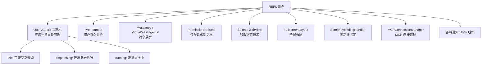
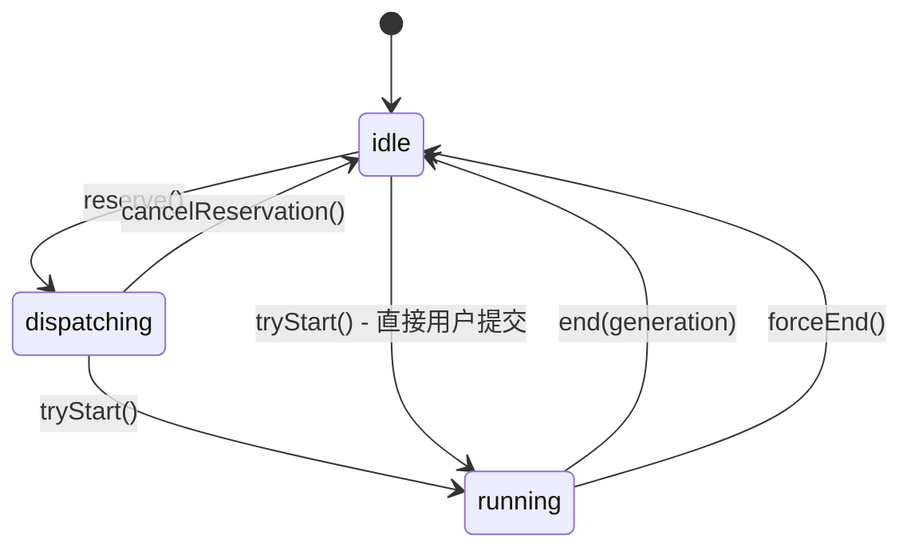
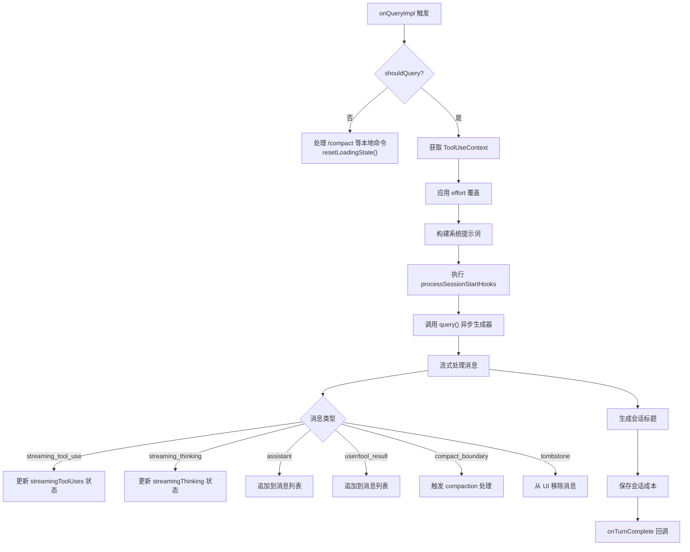

# REPL与终端用户界面

REPL（Read-Eval-Print Loop）是 Claude Code 交互模式的核心组件，基于 Ink 终端 UI 框架和 React 组件架构构建。`REPL.tsx` 作为主交互组件，管理从用户输入到查询执行的完整生命周期，包括流式状态管理、权限处理、滚动控制、终端动画等复杂交互。

## 架构概览

REPL 组件是 Claude Code 交互会话的顶层容器，集成了超过 200 个 import 和数十个子系统。它采用 React 函数组件 + Hooks 架构，通过 Ink 框架将 React 组件树渲染到终端。



## QueryGuard 状态机

`QueryGuard`（`src/utils/QueryGuard.ts`）是 REPL 查询生命周期的核心状态机，替代了之前的 `isLoading`/`isQueryRunning` 双布尔状态。它采用同步状态机设计，与 React 的 `useSyncExternalStore` 完全兼容。

### 三态模型



**idle**：无查询运行，可安全出队和处理新请求。

**dispatching**：已从队列中出队一个项目，异步链尚未到达 `onQuery`。此状态防止队列处理器在异步间隙中重新进入。

**running**：`onQuery` 已调用 `tryStart()`，查询正在执行。

### 关键方法

| 方法 | 转换 | 说明 |
|------|------|------|
| `reserve()` | idle -> dispatching | 为队列处理预留，非 idle 时返回 false |
| `cancelReservation()` | dispatching -> idle | 取消预留（队列无项目可处理时） |
| `tryStart()` | idle/dispatching -> running | 开始查询，返回 generation 号 |
| `end(generation)` | running -> idle | 正常结束，generation 匹配时执行清理 |
| `forceEnd()` | running/dispatching -> idle | 强制结束（如用户取消），递增 generation |

`isActive` 属性在 dispatching 和 running 状态下都返回 true，防止重入。`generation` 机制确保过时的 finally 块不会执行清理操作。

### 与 React 集成

```typescript
const queryGuard = useRef(new QueryGuard()).current;
const isQueryActive = useSyncExternalStore(
  queryGuard.subscribe,
  queryGuard.getSnapshot,
);
```

`subscribe` 和 `getSnapshot` 是稳定引用，安全用作 useEffect 依赖。`getSnapshot` 返回 `isActive` 布尔值，始终同步读取。

## onQueryImpl 回调

`onQueryImpl`（`REPL.tsx:L2661`）是查询执行的核心回调函数，处理从用户消息到 API 调用的完整流程：



### 会话标题生成

首次真实用户消息（非合成面包屑、非斜杠命令输出）触发 `generateSessionTitle()` 调用（`REPL.tsx:L2684-L2698`），使用 Haiku 模型生成简短标题。通过 `haikuTitleAttemptedRef` ref 确保只尝试一次，失败时重置标志允许重试。

### 斜杠命令工具作用域

斜杠命令的 `allowedTools`（来自技能 frontmatter）在每轮开始时应用到 store（`REPL.tsx:L2711-L2726`）。必须在 `!shouldQuery` 门控之前执行：forked 命令返回 `shouldQuery=false`，而 `createGetAppStateWithAllowedTools` 读取此字段，过期技能工具会泄漏到 forked agent 权限中。

## 流式状态管理

REPL 维护两个关键的流式状态用于 UI 渲染：

### streamingToolUses

追踪当前正在流式传输的工具使用块，用于实时显示工具调用进度。每个条目包含工具名称、输入参数和执行状态。

### streamingThinking

追踪当前正在流式传输的思考块，用于显示模型的推理过程。

这两个状态在 `handleMessageFromStream` 回调中更新，在 `onQueryImpl` 的 finally 块中清除。

## 滚动管理

REPL 实现了复杂的滚动管理系统，平衡了自动滚动到底部和用户手动滚动的需求：

### 自动置底逻辑

- 新消息到达时自动滚动到底部
- 用户手动滚动时暂停自动置底
- `RECENT_SCROLL_REPIN_WINDOW_MS`（3000ms）窗口内的用户滚动不会因输入而重新置底

### 搜索高亮

`TranscriptSearchBar` 组件（`REPL.tsx:L368`）提供类似 less 的搜索功能：
- `/` 键触发搜索模式
- 增量搜索：每次按键重新搜索并高亮
- `n`/`N` 导航匹配项
- `Enter` 提交搜索，`Esc` 撤销到搜索前状态

### Transcript 模式

`TranscriptModeFooter` 组件（`REPL.tsx:L321`）显示详细转录模式的底部状态栏，包含：
- 切换快捷键提示
- 搜索计数器
- 导航提示
- 可选的状态文本

## 终端标题动画

REPL 通过 Ink 的 `useTerminalTitle` hook 管理终端标签标题，显示会话名称和当前状态。`process.title` 在 `preAction` 钩子中设置为 `'claude'`（除非 `CLAUDE_CODE_DISABLE_TERMINAL_TITLE` 设置）。

## 权限请求处理

REPL 集成了多种权限请求 UI：

1. **`PermissionRequest`**：标准工具权限确认对话框
2. **`ElicitationDialog`**：MCP 工具的 URL 验证对话框
3. **`PromptDialog`**：Hook 的提示请求对话框
4. **`SandboxPermissionRequest`**：沙箱权限请求
5. **`WorkerPendingPermission`**：Swarm worker 的待处理权限

权限结果通过 `applyPermissionUpdate`/`applyPermissionUpdates` 应用到 `AppState` 中的 `toolPermissionContext`。

## 特性门控 UI

REPL 中多个 UI 组件通过特性门控条件加载，未启用的功能使用空操作 stub：

### 语音模式（VOICE_MODE）

```typescript
const useVoiceIntegration = feature('VOICE_MODE') 
  ? require('../hooks/useVoiceIntegration.js').useVoiceIntegration 
  : () => ({ stripTrailing: () => 0, handleKeyEvent: () => {}, resetAnchor: () => {} });
```

### 沮丧检测（Ant-only）

```typescript
const useFrustrationDetection = "external" === 'ant' 
  ? require('../components/FeedbackSurvey/useFrustrationDetection.js').useFrustrationDetection 
  : () => ({ state: 'closed', handleTranscriptSelect: () => {} });
```

### 伴侣/吉祥物（BUDDY）

`CompanionSprite` 和 `CompanionFloatingBubble` 组件仅在 `MIN_COLS_FOR_FULL_SPRITE` 列宽以上时显示完整版，窄终端自动降级。

### Proactive 模式

`useProactive` hook 在 `PROACTIVE` 或 `KAIROS` 特性启用时加载，提供定时任务调度能力。

### Coordinator 模式

`getCoordinatorUserContext` 在 `COORDINATOR_MODE` 启用时注入协调器特定的用户上下文。

## 消息队列处理器

`useQueueProcessor` hook 管理命令队列的处理：

1. 当 `QueryGuard` 处于 idle 状态时，从队列中取出下一个命令
2. 调用 `queryGuard.reserve()` 预留
3. 处理命令，调用 `onQueryImpl`
4. 完成后调用 `queryGuard.end()` 释放

队列优先级由 `getCommandsByMaxPriority()` 决定，支持高优先级命令插队。

## MCP 连接管理

`MCPConnectionManager` 管理所有 MCP 服务器连接的生命周期。REPL 通过 `useMergedClients` hook 合并初始 MCP 客户端和运行时动态添加的客户端。

### 邮箱桥接

`useMailboxBridge` hook 在 Swarm 模式下建立进程间通信，允许 leader 和 worker 之间传递权限请求和响应。

## 后台会话管理

`useSessionBackgrounding` hook 处理会话后台化：

- 当用户从 REPL 分离时（如 `--bg`），将当前会话转为后台运行
- `SessionBackgroundHint` 组件显示后台会话状态提示
- `startBackgroundSession` 启动后台会话任务

## 会话恢复

REPL 支持多种会话恢复方式：

1. **`--continue`**：继续最近对话（`-c` 标志）
2. **`--resume [uuid]`**：按 ID 恢复对话
3. **`--fork-session`**：恢复时创建分支
4. **`--from-pr`**：从 PR 恢复关联会话

恢复流程涉及：
- `deserializeMessages`：反序列化存储的消息
- `restoreSessionStateFromLog`：从日志恢复会话状态
- `restoreAgentFromSession`：恢复 agent 状态
- `restoreWorktreeForResume`：恢复 worktree 状态

## 成本追踪

`useCostSummary` hook 实时计算和展示会话成本。`saveCurrentSessionCosts()` 在每轮结束时保存成本数据，`resetCostState()` 在新会话开始时重置。

## FPS 追踪

`useFpsMetrics` hook 监控终端渲染帧率，用于检测和诊断 UI 性能问题。指标包括平均 FPS 和 1% 低 FPS。

## 关键文件索引

| 文件 | 职责 |
|------|------|
| `src/screens/REPL.tsx` | 主交互组件，2000+ 行 |
| `src/utils/QueryGuard.ts` | 查询生命周期状态机 |
| `src/utils/handlePromptSubmit.ts` | 提示词提交处理 |
| `src/components/PromptInput/PromptInput.js` | 用户输入组件 |
| `src/components/Messages.js` | 消息列表组件 |
| `src/components/permissions/PermissionRequest.js` | 权限请求 UI |
| `src/components/Spinner.js` | 加载状态指示器 |
| `src/components/FullscreenLayout.js` | 全屏布局 |
| `src/hooks/useQueueProcessor.js` | 命令队列处理 |
| `src/hooks/useMergedClients.js` | MCP 客户端合并 |
| `src/hooks/useSwarmInitialization.js` | Swarm 初始化 |
| `src/utils/messageQueueManager.js` | 消息队列管理器 |
