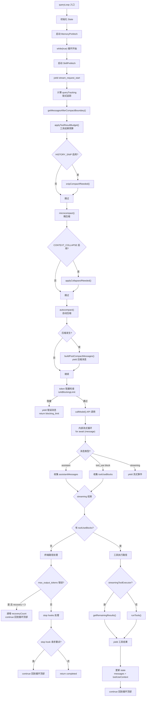

# 查询引擎与Agent执行循环

查询引擎是 Claude Code 的核心计算层，负责从用户输入到模型响应再到工具执行的完整 Agent 循环。`query.ts` 实现了核心的异步生成器循环，`QueryEngine.ts` 作为 SDK/headless 模式的外层包装，提供会话级状态管理和结构化输出接口。

## query.ts：核心异步生成器

`query.ts` 导出的 `query` 函数是一个 `async function*` 生成器，yield 各种消息类型（`StreamEvent`、`Message`、`TombstoneMessage` 等），最终返回 `Terminal` 结果。内部委托给 `queryLoop` 执行实际的循环逻辑。

### QueryParams 类型

```typescript
// query.ts:L181-L199
type QueryParams = {
  messages: Message[]          // 当前消息历史
  systemPrompt: SystemPrompt   // 系统提示词
  userContext: { [k: string]: string }  // 用户上下文
  systemContext: { [k: string]: string } // 系统上下文
  canUseTool: CanUseToolFn     // 工具权限检查函数
  toolUseContext: ToolUseContext // 工具使用上下文
  fallbackModel?: string       // 回退模型
  querySource: QuerySource     // 查询来源标识
  maxOutputTokensOverride?: number // 最大输出 token 覆盖
  maxTurns?: number            // 最大轮次数
  skipCacheWrite?: boolean     // 跳过缓存写入
  taskBudget?: { total: number } // API 端任务 token 预算
  deps?: QueryDeps             // 依赖注入（测试用）
}
```

### State 类型

跨迭代携带的可变状态：

```typescript
// query.ts:L204-L217
type State = {
  messages: Message[]
  toolUseContext: ToolUseContext
  autoCompactTracking: AutoCompactTrackingState | undefined
  maxOutputTokensRecoveryCount: number
  hasAttemptedReactiveCompact: boolean
  maxOutputTokensOverride: number | undefined
  pendingToolUseSummary: Promise<ToolUseSummaryMessage | null> | undefined
  stopHookActive: boolean | undefined
  turnCount: number
  transition: Continue | undefined
}
```

## queryLoop 完整流程



### 记忆预取

```typescript
// query.ts:L301-L304
using pendingMemoryPrefetch = startRelevantMemoryPrefetch(
  state.messages,
  state.toolUseContext,
);
```

`using` 语法确保在生成器所有退出路径上执行 dispose。每个用户轮次触发一次——提示词在循环迭代间不变。

### 工具结果预算

`applyToolResultBudget()`（`query.ts:L376-L394`）在微压缩之前执行，对聚合工具结果大小实施每消息预算。缓存微压缩通过 `tool_use_id` 操作（不检查内容），因此内容替换对其不可见，两者可干净组合。

### Snip 压缩

当 `HISTORY_SNIP` 特性启用时，`snipCompactIfNeeded()` 在微压缩之前运行（`query.ts:L401-L410`）。`snipTokensFreed` 传递给自动压缩，使其阈值检查反映 snip 移除的 token 数。

### 微压缩

`deps.microcompact()`（`query.ts:L414-L426`）在自动压缩之前应用，处理缓存的微压缩编辑。对于缓存微压缩，边界消息延迟到 API 响应之后，以使用实际的 `cache_deleted_input_tokens`。

### 上下文折叠

当 `CONTEXT_COLLAPSE` 启用时，`applyCollapsesIfNeeded()`（`query.ts:L440-L447`）在自动压缩之前提交折叠操作。折叠是读时投影——摘要消息存储在折叠存储中而非 REPL 数组，使折叠跨轮次持久化。

### 自动压缩

`deps.autocompact()`（`query.ts:L454-L467`）执行完整的自动压缩流程。压缩发生时：

1. 记录详细的压缩遥测（原始/压缩后的消息数和 token 数）
2. 捕获 `taskBudgetRemaining`（压缩前的最终上下文窗口）
3. 重置 `autoCompactTracking`（`turnId`、`turnCounter`、`consecutiveFailures`）
4. 构建并 yield 压缩后消息
5. 替换 `messagesForQuery` 为压缩后的消息

## 内部流式循环

API 调用后的流式循环是 Agent 执行的核心：

```typescript
// query.ts:L659
for await (const message of deps.callModel({...})) {
  // 处理每条流式消息
}
```

### StreamingToolExecutor

当 `streamingToolExecution` 门控启用时，创建 `StreamingToolExecutor`（`query.ts:L562-L568`），在流式传输期间并行执行工具，而非等待流式传输完成后再批量执行。

### FallbackTriggeredError 处理

当主模型过载触发回退时（`query.ts:L894-L949`）：

1. 切换到 `fallbackModel`
2. 为孤立的工具使用块生成错误结果的墓碑消息
3. 清空 `assistantMessages`、`toolResults`、`toolUseBlocks`
4. 丢弃旧的 `StreamingToolExecutor`，创建新实例
5. 对于 Ant 内部用户，剥离思考签名块（模型绑定的签名会导致 API 400 错误）
6. 记录 `tengu_model_fallback_triggered` 事件
7. yield 系统消息通知用户模型切换

### 思考规则

`query.ts` 中的注释（`L152-L163`）详细说明了思考块的规则：

1. 包含 thinking/redacted_thinking 块的消息必须属于 `max_thinking_length > 0` 的查询
2. thinking 块不能是消息中的最后一个块
3. thinking 块必须在完整的助手轨迹中保留（单轮，或包含 tool_use 时的后续 tool_result 和下一条 assistant 消息）

## 终端路径

当流式循环结束后没有 `toolUseBlocks` 时，进入终端路径：

### max_output_tokens 恢复

当助手消息因 `max_output_tokens` 截断时（最多 3 次恢复尝试），设置 `maxOutputTokensOverride` 并 `continue` 回到循环顶部。这是 `isWithheldMaxOutputTokens()` 判断的中间错误——对 SDK 调用者延迟暴露，直到确认恢复循环无法继续。

### 反应式压缩恢复

当 `REACTIVE_COMPACT` 启用且自动压缩启用时，`reactiveCompact` 模块处理 `prompt_too_long` 错误，尝试通过压缩恢复上下文。

### Stop hooks 处理

`handleStopHooks()`（`query.ts` 引用 `src/query/stopHooks.js`）在模型停止后执行，允许 hook 请求重试。如果 stop hook 请求继续，`continue` 回到循环顶部。

## 工具执行路径

当存在 `toolUseBlocks` 时，进入工具执行路径：

### StreamingToolExecutor vs runTools

```typescript
// query.ts:L1380-L1382
const toolUpdates = streamingToolExecutor
  ? streamingToolExecutor.getRemainingResults()
  : runTools(toolUseBlocks, assistantMessages, canUseTool, toolUseContext);
```

`StreamingToolExecutor` 在流式传输期间已开始并行执行工具，`getRemainingResults()` 返回尚未 yield 的结果。`runTools()` 是传统的批量执行路径。

### 工具结果处理

每条工具更新可能包含：
- `message`：工具结果消息（yield 给上层并追加到 `toolResults`）
- `newContext`：更新后的 `ToolUseContext`

特殊的 `hook_stopped_continuation` 附件类型设置 `shouldPreventContinuation`，阻止后续循环迭代。

### 工具使用摘要

工具批次完成后（`query.ts:L1411-L1449`），如果满足条件则生成工具使用摘要：
- `emitToolUseSummaries` 门控启用
- 存在 `toolUseBlocks`
- 未中止
- 非 subagent（subagent 不显示在移动 UI，跳过 Haiku 调用）

摘要通过 `generateToolUseSummary()` 使用 Haiku 模型异步生成，作为下轮迭代的 `pendingToolUseSummary`。

### 状态更新与循环继续

工具执行完成后，更新 `state`：

```typescript
state = {
  messages: [...messages, ...newMessages],
  toolUseContext: updatedToolUseContext,
  maxOutputTokensRecoveryCount,
  hasAttemptedReactiveCompact,
  maxOutputTokensOverride,
  autoCompactTracking: tracking,
  turnCount: turnCount + 1,
  pendingToolUseSummary: nextPendingToolUseSummary,
  stopHookActive: undefined,
  transition: { type: 'tool_use' },
};
continue; // 回到 while(true) 循环顶部
```

## QueryEngine.ts：SDK/Headless 包装器

`QueryEngine` 类是 `query()` 生成器的面向对象包装器，为 SDK 和 headless 模式提供会话级状态管理和结构化输出接口。

### QueryEngineConfig 类型

```typescript
// QueryEngine.ts:L130-L173
type QueryEngineConfig = {
  cwd: string
  tools: Tools
  commands: Command[]
  mcpClients: MCPServerConnection[]
  agents: AgentDefinition[]
  canUseTool: CanUseToolFn
  getAppState: () => AppState
  setAppState: (f: (prev: AppState) => AppState) => void
  initialMessages?: Message[]
  readFileCache: FileStateCache
  customSystemPrompt?: string
  appendSystemPrompt?: string
  userSpecifiedModel?: string
  fallbackModel?: string
  thinkingConfig?: ThinkingConfig
  maxTurns?: number
  maxBudgetUsd?: number
  taskBudget?: { total: number }
  jsonSchema?: Record<string, unknown>
  verbose?: boolean
  replayUserMessages?: boolean
  handleElicitation?: ToolUseContext['handleElicitation']
  includePartialMessages?: boolean
  setSDKStatus?: (status: SDKStatus) => void
  abortController?: AbortController
  orphanedPermission?: OrphanedPermission
  snipReplay?: (yieldedSystemMsg: Message, store: Message[]) => ...
}
```

### 会话作用域状态

```typescript
// QueryEngine.ts:L186-L198
class QueryEngine {
  private mutableMessages: Message[]        // 可变消息存储
  private abortController: AbortController  // 中止控制器
  private permissionDenials: SDKPermissionDenial[] // 权限拒绝记录
  private totalUsage: NonNullableUsage      // 累计使用量
  private hasHandledOrphanedPermission: boolean // 孤立权限处理标记
  private readFileState: FileStateCache     // 文件读取缓存
  private discoveredSkillNames: Set<string> // 已发现技能名
  private loadedNestedMemoryPaths: Set<string> // 已加载嵌套内存路径
}
```

每个 `QueryEngine` 实例对应一个对话。每次 `submitMessage()` 调用启动同一对话内的一个新轮次，状态（消息、文件缓存、使用量等）跨轮次持久化。

### submitMessage() 生成器

```typescript
// QueryEngine.ts:L209-L212
async *submitMessage(
  prompt: string | ContentBlockParam[],
  options?: { uuid?: string; isMeta?: boolean },
): AsyncGenerator<SDKMessage, void, unknown>
```

`submitMessage` 是 SDK/headless 模式的核心接口，yield `SDKMessage` 类型的消息。

### 权限拒绝追踪

`canUseTool` 被包装以追踪权限拒绝（`QueryEngine.ts:L244-L271`），每次工具被拒绝时记录到 `permissionDenials` 数组，供 SDK 查询。

### 系统提示词构建

`submitMessage` 中构建完整的系统提示词链（`QueryEngine.ts:L286-L325`）：

1. `fetchSystemPromptParts()`：获取默认系统提示词、用户上下文和系统上下文
2. 自定义系统提示词：替换默认提示词
3. 内存机制提示词：当自定义提示词 + `CLAUDE_COWORK_MEMORY_PATH_OVERRIDE` 时注入
4. 追加系统提示词：追加到末尾

### 消息持久化

用户消息在进入查询循环之前持久化到转录文件（`QueryEngine.ts:L450-L463`），确保即使进程在 API 响应前被终止，转录也可恢复。`--bare` 模式下使用 fire-and-forget 避免阻塞关键路径。

### 压缩边界的 GC 优化

`QueryEngine` 在压缩边界执行垃圾回收优化。当 `mutableMessages` 被压缩替换时，旧的大数组可以被 GC 回收，减少长期会话的内存占用。

### Snip 回放

`snipReplay` 配置选项（`QueryEngine.ts:L169-L172`）仅在 SDK 模式下使用。REPL 保留完整历史用于 UI 回滚和按需投影，而 QueryEngine 在此处截断以限制长会话的内存增长。

## 关键文件索引

| 文件 | 职责 |
|------|------|
| `src/query.ts` | 核心异步生成器，Agent 执行循环 |
| `src/QueryEngine.ts` | SDK/headless 包装器，会话级状态 |
| `src/services/compact/autoCompact.js` | 自动压缩逻辑 |
| `src/services/compact/snipCompact.js` | Snip 压缩 |
| `src/services/compact/microCompact.js` | 微压缩 |
| `src/services/compact/reactiveCompact.js` | 反应式压缩 |
| `src/services/contextCollapse/index.js` | 上下文折叠 |
| `src/services/tools/StreamingToolExecutor.js` | 流式工具执行器 |
| `src/services/tools/toolOrchestration.js` | 工具编排（runTools） |
| `src/query/config.js` | 查询配置构建 |
| `src/query/deps.js` | 依赖注入（productionDeps） |
| `src/query/transitions.js` | 循环转换类型 |
| `src/query/stopHooks.js` | Stop hook 处理 |
| `src/query/tokenBudget.js` | Token 预算追踪 |
