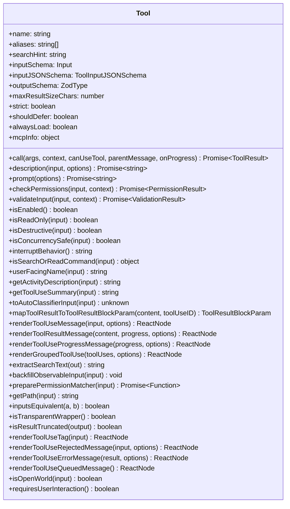

# 工具框架与接口设计

## 概述

Claude Code 的工具系统建立在 `src/Tool.ts` 中定义的完整类型体系之上。该文件定义了工具接口（Tool）、工具使用上下文（ToolUseContext）、工具结果（ToolResult）、工具工厂函数（buildTool）以及一系列辅助类型和函数。整个框架通过精确的 TypeScript 类型系统确保所有工具实现的统一性和安全性，同时利用条件类型（conditional types）在类型层面保证默认值的正确推导。

## Tool 接口：核心契约

`Tool<Input, Output, P>` 是所有工具必须实现的完整接口，它定义了工具从注册、验证、权限检查到执行、渲染的全生命周期。三个泛型参数分别对应输入 Schema 类型（`Input extends AnyObject`）、输出类型（`Output`）和进度数据类型（`P extends ToolProgressData`）。



### 核心属性

- **`name`**（必需）：工具的唯一标识符，用于 API 调用中的 `tool_use` 块匹配和权限规则匹配。
- **`aliases`**（可选）：向后兼容的别名列表。当工具重命名时，旧名称可作为别名保留，确保历史转录仍可正常解析。`toolMatchesName()` 函数同时匹配主名称和别名。
- **`searchHint`**（可选）：3-10 个词的能力描述短语，供 ToolSearch 工具进行关键词匹配。当工具被延迟加载（defer）时，模型通过此提示词找到并激活该工具。建议使用工具名中未出现的关键词（例如 NotebookEdit 使用 "jupyter"）。
- **`maxResultSizeChars`**（必需）：工具结果在持久化到磁盘前的最大字符数阈值。当结果超出此限制时，内容保存到文件，Claude 只接收预览和文件路径。对 Read 工具设为 `Infinity`，因为持久化会导致 Read→file→Read 的循环依赖，而该工具已有自有的内容限制机制。
- **`strict`**（可选）：当为 `true` 时，API 对该工具启用严格模式，更严格地遵循工具指令和参数 Schema。仅在 `tengu_tool_pear` 功能标志启用时生效。
- **`shouldDefer`**（可选）：标记该工具是否应延迟加载（以 `defer_loading: true` 发送给 API），需要先通过 ToolSearch 激活后才能调用。
- **`alwaysLoad`**（可选）：标记该工具永不延迟加载，即使在 ToolSearch 启用时其完整 Schema 也会出现在初始提示中。对 MCP 工具可通过 `_meta['anthropic/alwaysLoad']` 设置。用于模型必须在第一轮就看到的工具。

### 输入定义

- **`inputSchema`**（必需）：基于 Zod 的输入 Schema，定义工具参数的类型和验证规则。使用 `z.strictObject()` 确保不接受未定义的字段。
- **`inputJSONSchema`**（可选）：MCP 工具可直接提供 JSON Schema 格式的输入定义，而无需从 Zod Schema 转换。
- **`outputSchema`**（可选）：输出的 Zod Schema。当前 TungstenTool 未定义此字段（TODO：使其成为必需）。

### 生命周期方法

#### 执行方法

- **`call(args, context, canUseTool, parentMessage, onProgress?)`**：工具的核心执行方法。接收解析后的输入参数、工具使用上下文、权限检查函数、父助手消息和可选的进度回调。返回 `Promise<ToolResult<Output>>`，其中 ToolResult 包含 `data`（输出数据）、`newMessages`（额外消息）、`contextModifier`（上下文修改器）和 `mcpMeta`（MCP 协议元数据）。

#### 描述方法

- **`description(input, options)`**：返回工具的简短描述，用于工具定义中展示给模型。`options` 包含 `isNonInteractiveSession`、`toolPermissionContext` 和 `tools`。
- **`prompt(options)`**：返回工具的完整提示文本，用于构建系统提示。`options` 包含权限上下文、工具列表、代理定义等。

#### 验证与权限方法

- **`validateInput(input, context)`**：在权限检查之前验证输入值。返回 `ValidationResult`，即 `{ result: true }` 或 `{ result: false, message: string, errorCode: number }`。
- **`checkPermissions(input, context)`**：仅在 `validateInput()` 通过后调用，决定是否需要向用户请求权限。包含工具特定的权限逻辑，通用权限逻辑在 `permissions.ts` 中。
- **`preparePermissionMatcher(input)`**：为 Hook 的 `if` 条件准备匹配器。针对权限规则模式（如 `Bash(git *)`）进行解析，返回一个闭包用于逐模式匹配。未实现时仅支持工具名级别匹配。

### 行为标记方法

- **`isEnabled()`**：工具是否在当前环境中可用。默认 `true`。
- **`isReadOnly(input)`**：该调用是否为只读操作。影响并发调度——只读工具可并行执行。
- **`isDestructive(input)`**：该调用是否执行不可逆操作（删除、覆盖、发送）。默认 `false`。
- **`isConcurrencySafe(input)`**：该调用是否可与其他工具安全并发执行。默认 `false`（保守假设不安全）。
- **`interruptBehavior()`**：当用户在工具运行时提交新消息时的行为。`'cancel'` 停止工具并丢弃结果，`'block'` 保持运行。默认 `'block'`。
- **`isSearchOrReadCommand(input)`**：返回该操作是否为搜索/读取/列表操作，用于 UI 中的折叠显示。返回 `{ isSearch, isRead, isList? }`。
- **`isOpenWorld(input)`**：标记工具是否为"开放世界"操作（如 WebFetch 访问外部 URL）。
- **`requiresUserInteraction()`**：标记工具是否需要用户交互（如 AskUserQuestion）。

### 渲染方法

- **`renderToolUseMessage(input, options)`**：渲染工具调用消息。`input` 是 partial 类型，因为可能在参数完全流式传输完成之前渲染。
- **`renderToolResultMessage(content, progress, options)`**：渲染工具结果消息。可选，未实现时工具结果不显示（如 TodoWrite 更新面板而非转录）。
- **`renderToolUseProgressMessage(progress, options)`**：渲染进度消息。可选，未实现时不显示运行时进度。
- **`renderGroupedToolUse(toolUses, options)`**：将多个并行工具调用渲染为一组（仅在非详细模式下生效）。
- **`extractSearchText(out)`**：提取转录搜索索引文本。必须返回实际可见的文本，否则会导致计数与高亮不匹配的 bug。

### 辅助方法

- **`userFacingName(input)`**：面向用户的工具名称，用于 UI 显示。
- **`getActivityDescription(input)`**：返回进行时活动描述（如 "Reading src/foo.ts"），用于加载指示器。
- **`getToolUseSummary(input)`**：返回简短摘要字符串，用于紧凑视图。
- **`toAutoClassifierInput(input)`**：返回自动模式安全分类器的紧凑表示。返回空字符串表示跳过分类器。
- **`backfillObservableInput(input)`**：在观察者（SDK 流、转录、Hook）看到输入之前回填遗留/派生字段。必须幂等，原始 API 绑定的输入永远不会被修改。
- **`inputsEquivalent(a, b)`**：判断两次工具调用的输入是否等价，用于去重判断。

## ToolUseContext：执行上下文

`ToolUseContext` 是贯穿整个工具执行过程的关键类型，携带了工具执行所需的全部上下文信息：

```typescript
type ToolUseContext = {
  options: {
    commands: Command[]
    debug: boolean
    mainLoopModel: string
    tools: Tools
    verbose: boolean
    thinkingConfig: ThinkingConfig
    mcpClients: MCPServerConnection[]
    mcpResources: Record<string, ServerResource[]>
    isNonInteractiveSession: boolean
    agentDefinitions: AgentDefinitionsResult
    maxBudgetUsd?: number
    customSystemPrompt?: string
    appendSystemPrompt?: string
    querySource?: QuerySource
    refreshTools?: () => Tools
  }
  abortController: AbortController
  readFileState: FileStateCache
  getAppState(): AppState
  setAppState(f: (prev: AppState) => AppState): void
  // ... 更多字段
}
```

核心字段分为以下类别：

1. **配置选项**（`options`）：包含工具列表、MCP 客户端、代理定义、思考配置等静态配置。
2. **中止控制**（`abortController`）：用于取消正在进行的工具执行。子工具使用独立的子控制器，可单独中止而不影响父级。
3. **状态管理**（`getAppState`/`setAppState`）：读取和更新全局应用状态。`setAppStateForTasks` 是会话级基础设施专用版本，即使在异步代理中也能正常工作。
4. **UI 交互**（`setToolJSX`、`addNotification`、`sendOSNotification`）：用于 REPL 模式下的 UI 更新。
5. **文件追踪**（`readFileState`、`updateFileHistoryState`）：跟踪文件读取状态和编辑历史，支持文件修改检测和撤销。
6. **权限追踪**（`toolDecisions`）：记录每个工具调用的权限决策来源和结果，用于遥测和审计。
7. **代理上下文**（`agentId`、`agentType`、`queryTracking`）：子代理的标识和查询链追踪。
8. **内容替换**（`contentReplacementState`）：管理工具结果预算的内容替换状态。

## ToolResult：执行结果

```typescript
type ToolResult<T> = {
  data: T
  newMessages?: (UserMessage | AssistantMessage | AttachmentMessage | SystemMessage)[]
  contextModifier?: (context: ToolUseContext) => ToolUseContext
  mcpMeta?: {
    _meta?: Record<string, unknown>
    structuredContent?: Record<string, unknown>
  }
}
```

- **`data`**：工具的核心输出数据，类型由 `Tool<_, Output>` 的 `Output` 参数决定。
- **`newMessages`**：工具执行过程中产生的额外消息，会被添加到消息列表中。
- **`contextModifier`**：仅对非并发安全的工具有效。允许工具修改后续工具使用的上下文（如 Bash 的 `cd` 命令改变工作目录）。
- **`mcpMeta`**：MCP 协议元数据，传递 `structuredContent` 和 `_meta` 给 SDK 消费者。

## buildTool 工厂与 TOOL_DEFAULTS

`buildTool()` 是所有工具导出必须经过的工厂函数，它确保默认值集中管理，调用方永远不需要使用 `?.() ?? default` 模式。

### 默认值定义

```typescript
const TOOL_DEFAULTS = {
  isEnabled: () => true,
  isConcurrencySafe: (_input?: unknown) => false,
  isReadOnly: (_input?: unknown) => false,
  isDestructive: (_input?: unknown) => false,
  checkPermissions: (input, _ctx) =>
    Promise.resolve({ behavior: 'allow', updatedInput: input }),
  toAutoClassifierInput: (_input?: unknown) => '',
  userFacingName: (_input?: unknown) => '',
}
```

默认值遵循**安全优先**原则：

- **`isEnabled`** → `true`：假设工具默认可用。
- **`isConcurrencySafe`** → `false`：保守假设不安全，避免并发问题。
- **`isReadOnly`** → `false`：假设写入操作，确保权限检查不遗漏。
- **`isDestructive`** → `false`：假设非破坏性。
- **`checkPermissions`** → `{ behavior: 'allow' }`：延迟到通用权限系统处理。
- **`toAutoClassifierInput`** → `''`：跳过分类器，安全相关工具必须覆盖。
- **`userFacingName`** → 由 `buildTool()` 覆盖为 `() => def.name`。

### 类型级精度：BuiltTool\<D\>

`BuiltTool<D>` 使用条件类型在类型层面镜像运行时的 `{...TOOL_DEFAULTS, ...def}` 扩展行为：

```typescript
type BuiltTool<D> = Omit<D, DefaultableToolKeys> & {
  [K in DefaultableToolKeys]-?: K extends keyof D
    ? undefined extends D[K]
      ? ToolDefaults[K]
      : D[K]
    : ToolDefaults[K]
}
```

对于每个可默认的键：
- 如果 `D` 提供了该键（且非 `undefined`），使用 `D` 的类型。
- 如果 `D` 省略了该键或类型包含 `undefined`，使用默认值类型。
- 其他键原样保留 `D` 的类型，保留元数、可选性和字面量类型。

`ToolDef` 类型是 `Tool` 的部分版本，仅将 `DefaultableToolKeys` 对应的方法设为可选：

```typescript
type ToolDef<Input, Output, P> = Omit<Tool<Input, Output, P>, DefaultableToolKeys> &
  Partial<Pick<Tool<Input, Output, P>, DefaultableToolKeys>>
```

### 运行时实现

```typescript
export function buildTool<D extends AnyToolDef>(def: D): BuiltTool<D> {
  return {
    ...TOOL_DEFAULTS,
    userFacingName: () => def.name,
    ...def,
  } as BuiltTool<D>
}
```

运行时扩展直观明了：先铺展默认值，再覆盖 `userFacingName` 默认为工具名，最后铺展工具定义覆盖默认值。`as` 类型断言桥接了结构化的 any 约束和精确的 `BuiltTool<D>` 返回类型。此设计在 60+ 个工具的类型检查中零错误验证了其正确性。

## 辅助类型与函数

### ToolPermissionContext

```typescript
type ToolPermissionContext = DeepImmutable<{
  mode: PermissionMode
  additionalWorkingDirectories: Map<string, AdditionalWorkingDirectory>
  alwaysAllowRules: ToolPermissionRulesBySource
  alwaysDenyRules: ToolPermissionRulesBySource
  alwaysAskRules: ToolPermissionRulesBySource
  isBypassPermissionsModeAvailable: boolean
  isAutoModeAvailable?: boolean
  strippedDangerousRules?: ToolPermissionRulesBySource
  shouldAvoidPermissionPrompts?: boolean
  awaitAutomatedChecksBeforeDialog?: boolean
  prePlanMode?: PermissionMode
}>
```

使用 `DeepImmutable` 确保权限上下文在传递过程中不被意外修改。`getEmptyToolPermissionContext()` 提供一个安全的空默认值。

### ValidationResult

```typescript
type ValidationResult =
  | { result: true }
  | { result: false; message: string; errorCode: number }
```

使用判别联合而非 `boolean | Error` 的设计，确保错误情况必须提供消息和错误码。

### 工具查找函数

- **`findToolByName(tools, name)`**：从工具列表中按名称或别名查找工具，返回 `Tool | undefined`。
- **`toolMatchesName(tool, name)`**：检查工具是否匹配给定名称（主名称或别名）。

### 进度相关

- **`ToolProgress<P>`**：包装工具使用 ID 和进度数据。
- **`filterToolProgressMessages(progressMessages)`**：过滤掉 Hook 进度消息，仅保留工具进度消息。
- **`ToolCallProgress<P>`**：进度回调函数类型。

### Tools 集合类型

```typescript
type Tools = readonly Tool[]
```

使用 `readonly` 修饰符防止意外修改工具数组，同时明确标识这是工具集的传递点，而非普通数组。代码库中应使用 `Tools` 而非 `Tool[]`，便于追踪工具集的组装、传递和过滤。

## 设计哲学

1. **安全优先的默认值**：所有默认值都选择更保守的选项（非并发安全、非只读、非启用分类器），确保新工具不会因遗漏配置而产生安全隐患。
2. **类型级保证**：通过条件类型 `BuiltTool<D>` 在编译时确保默认值正确推导，消除运行时 `?.() ?? default` 的防御性代码。
3. **显式优于隐式**：`ToolDef` 明确标记可省略的方法（`DefaultableToolKeys`），其他方法必须实现。
4. **不可变传递**：`Tools` 使用 `readonly`、`ToolPermissionContext` 使用 `DeepImmutable`，防止上下文在传递中被意外修改。
5. **工厂模式统一**：所有工具通过 `buildTool()` 导出，默认值集中管理，避免散落在各工具实现中的防御性代码。
