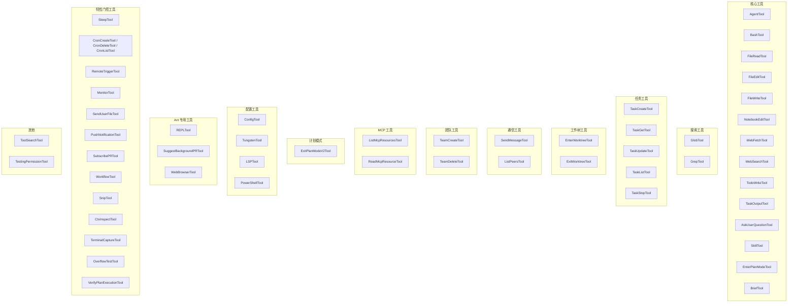
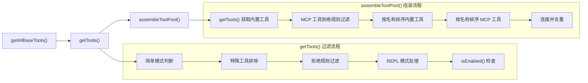

# 工具注册与组装

## 概述

`src/tools.ts` 是 Claude Code 的工具注册中心，负责声明、组装和过滤所有可用工具。该文件定义了 `getAllBaseTools()`、`getTools()`、`assembleToolPool()` 和 `filterToolsByDenyRules()` 等核心函数，构成了从工具声明到最终可用工具池的完整流水线。工具注册系统通过条件导入、特性标志和延迟加载实现了灵活的工具管理，同时保证提示缓存（prompt cache）的稳定性。

## 工具全景：getAllBaseTools()

`getAllBaseTools()` 是所有工具的权威来源，返回当前环境下可能可用的完整工具列表。该函数返回 42+ 个工具，按类别可分为以下几组：



### 核心工具

这些是 Claude Code 的基础工具，几乎所有模式下都可用：

| 工具名 | 类名 | 说明 |
|--------|------|------|
| Agent | AgentTool | 子代理调用，支持嵌套代理（仅 ant 用户） |
| Bash | BashTool | Shell 命令执行，最复杂的工具 |
| Read | FileReadTool | 文件读取，支持文本/图片/PDF/Notebook |
| Edit | FileEditTool | 文件搜索替换编辑 |
| Write | FileWriteTool | 文件完整写入/覆盖 |
| NotebookEdit | NotebookEditTool | Jupyter Notebook 单元格编辑 |
| WebFetch | WebFetchTool | URL 内容获取与处理 |
| WebSearch | WebSearchTool | 网络搜索 |
| TodoWrite | TodoWriteTool | 待办事项写入 |
| TaskOutput | TaskOutputTool | 任务输出获取 |
| AskUserQuestion | AskUserQuestionTool | 向用户提问 |
| Skill | SkillTool | 技能调用 |
| EnterPlanMode | EnterPlanModeTool | 进入计划模式 |
| Brief | BriefTool | 简要信息工具 |

### 搜索工具

GlobTool 和 GrepTool 是条件注册的——当 Ant 原生构建中嵌入了 bfs/ugrep（通过 bun 二进制的 ARGV0 技巧）时，Shell 中的 find/grep 已被别名指向这些快速工具，此时专用的 Glob/Grep 工具不再必要：

```typescript
...(hasEmbeddedSearchTools() ? [] : [GlobTool, GrepTool]),
```

### 条件注册模式

工具注册使用多种条件机制控制哪些工具出现在列表中：

1. **环境变量条件**（`process.env.USER_TYPE === 'ant'`）：ConfigTool、TungstenTool、REPLTool、SuggestBackgroundPRTool 等 Ant 内部工具。
2. **特性标志条件**（`feature('FLAG')`）：通过 `bun:bundle` 的 `feature()` 函数进行编译时死代码消除。
3. **功能开关条件**（`isTodoV2Enabled()`、`isWorktreeModeEnabled()` 等）：运行时功能判断。
4. **测试环境条件**（`process.env.NODE_ENV === 'test'`）：TestingPermissionTool 仅在测试中可用。

## 条件导入与死代码消除

### 静态条件导入

使用 `feature()` 函数的导入会在编译时被消除，确保非 Ant 构建不包含这些代码：

```typescript
const SleepTool =
  feature('PROACTIVE') || feature('KAIROS')
    ? require('./tools/SleepTool/SleepTool.js').SleepTool
    : null

const cronTools = feature('AGENT_TRIGGERS')
  ? [
      require('./tools/ScheduleCronTool/CronCreateTool.js').CronCreateTool,
      require('./tools/ScheduleCronTool/CronDeleteTool.js').CronDeleteTool,
      require('./tools/ScheduleCronTool/CronListTool.js').CronListTool,
    ]
  : []
```

当 `feature('AGENT_TRIGGERS')` 为 `false` 时，整个 `require()` 调用被编译器消除，Cron 相关代码不会出现在最终构建中。

### 环境变量条件导入

使用 `process.env.USER_TYPE` 的条件导入在运行时评估，但通过 `const` 赋值实现类似的惰性效果：

```typescript
const REPLTool =
  process.env.USER_TYPE === 'ant'
    ? require('./tools/REPLTool/REPLTool.js').REPLTool
    : null
```

### 延迟 Require 打破循环依赖

TeamCreateTool、TeamDeleteTool 和 SendMessageTool 使用函数式延迟加载，因为它们与 tools.ts 存在循环依赖：

```typescript
const getTeamCreateTool = () =>
  require('./tools/TeamCreateTool/TeamCreateTool.js')
    .TeamCreateTool as typeof import('./tools/TeamCreateTool/TeamCreateTool.js').TeamCreateTool
```

每次调用 `getTeamCreateTool()` 都执行一次 `require()`，Node.js 的模块缓存确保不会重复加载，但首次调用延迟到实际使用时，打破了模块初始化时的循环引用问题。

## 工具过滤流水线



### getTools()：模式感知过滤

`getTools()` 根据 `ToolPermissionContext` 过滤工具，实现模式感知的工具可用性：

1. **简单模式**（`CLAUDE_CODE_SIMPLE`）：仅保留 Bash、Read 和 Edit 三个基础工具。如果同时启用 REPL 模式，则用 REPL 替代这三个工具（REPL 在虚拟机内部包装了它们）。当协调器模式也激活时，追加 AgentTool、TaskStopTool 和 SendMessageTool。

2. **标准模式**：
   - 排除特殊工具（ListMcpResourcesTool、ReadMcpResourceTool、SyntheticOutputTool），这些工具在其他地方条件注册。
   - 通过 `filterToolsByDenyRules()` 过滤被拒绝规则完全禁止的工具。
   - REPL 模式激活时，隐藏 `REPL_ONLY_TOOLS` 集合中的原始工具（它们可通过 REPL 虚拟机上下文访问）。
   - 最后通过 `isEnabled()` 检查过滤不可用的工具。

### filterToolsByDenyRules()：权限规则过滤

```typescript
export function filterToolsByDenyRules<T extends {
  name: string
  mcpInfo?: { serverName: string; toolName: string }
}>(tools: readonly T[], permissionContext: ToolPermissionContext): T[]
```

使用与运行时权限检查相同的匹配器（`getDenyRuleForTool`），确保 MCP 服务器前缀规则（如 `mcp__server`）在模型看到工具列表之前就剥离该服务器的所有工具，而非仅在调用时拒绝。这是深度防御策略的一部分——不可见即不可调用。

### assembleToolPool()：确定性组装

`assembleToolPool()` 是组合内置工具和 MCP 工具的唯一入口，被 REPL.tsx（通过 useMergedTools hook）和 runAgent.ts（协调器 worker）共同使用。

```typescript
export function assembleToolPool(
  permissionContext: ToolPermissionContext,
  mcpTools: Tools,
): Tools
```

关键设计决策：

1. **确定性排序**：内置工具和 MCP 工具分别按名称字母排序，然后连接。`uniqBy('name')` 保留插入顺序，内置工具在名称冲突时优先。

2. **提示缓存稳定性**：服务器的 `claude_code_system_cache_policy` 在最后一个前缀匹配的内置工具之后放置全局缓存断点。如果扁平排序将 MCP 工具交错到内置工具之间，每次 MCP 工具排序位置变化都会使所有下游缓存键失效。将内置工具作为连续前缀保持了缓存稳定性。

3. **Node 18 兼容**：避免使用 `Array.toSorted()`（Node 20+），而是复制后排序。`builtInTools` 是 `readonly` 所以需要复制，`allowedMcpTools` 是 `.filter()` 的新数组可直接排序。

## TOOL_PRESETS 与预设系统

```typescript
export const TOOL_PRESETS = ['default'] as const
export type ToolPreset = (typeof TOOL_PRESETS)[number]

export function parseToolPreset(preset: string): ToolPreset | null
export function getToolsForDefaultPreset(): string[]
```

当前仅支持 `'default'` 预设，返回所有启用工具的名称列表。`getToolsForDefaultPreset()` 通过 `getAllBaseTools()` 获取工具并过滤 `isEnabled()` 为 `true` 的工具名。预设系统为 `--tools` 命令行标志提供支持，未来可扩展更多预设。

## 工具可用性常量

`src/constants/tools.ts` 定义了各场景下的工具可用性约束：

### 代理工具限制

- **`ALL_AGENT_DISALLOWED_TOOLS`**：所有子代理禁止使用的工具集合，包括 TaskOutputTool、ExitPlanModeV2Tool、EnterPlanModeTool、AskUserQuestionTool、TaskStopTool。AgentTool 仅对非 ant 用户禁止。
- **`CUSTOM_AGENT_DISALLOWED_TOOLS`**：自定义代理的工具限制，当前等同于全部限制集。
- **`ASYNC_AGENT_ALLOWED_TOOLS`**：异步代理允许使用的工具白名单，包括文件操作、搜索、Shell 工具、技能工具等。
- **`IN_PROCESS_TEAMMATE_ALLOWED_TOOLS`**：进程内队友额外允许的工具，包括任务管理、消息发送和 Cron 工具。
- **`COORDINATOR_MODE_ALLOWED_TOOLS`**：协调器模式允许的工具，仅包含 AgentTool、TaskStopTool、SendMessageTool 和 SyntheticOutputTool。

### 异步代理的工具策略

异步代理的工具集采用白名单模式（`ASYNC_AGENT_ALLOWED_TOOLS`），确保后台代理不会调用需要主线程状态的工具。被阻止的工具及原因：

- AgentTool：防止递归
- TaskOutputTool：防止递归
- ExitPlanModeTool：计划模式是主线程抽象
- TaskStopTool：需要主线程任务状态
- TungstenTool：使用单例虚拟终端，多代理冲突

## 工具搜索与延迟加载

ToolSearchTool 的注册使用乐观检查：

```typescript
...(isToolSearchEnabledOptimistic() ? [ToolSearchTool] : []),
```

`isToolSearchEnabledOptimistic()` 是乐观评估——实际的延迟决策在 `claude.ts` 的请求时做出。这确保 ToolSearch 在可能启用时出现在工具列表中，而不会在运行时频繁添加/移除。

## 设计要点总结

1. **单一数据源**：`getAllBaseTools()` 是所有工具的权威来源，其他函数在此基础上过滤和组装。
2. **编译时优化**：通过 `feature()` 实现死代码消除，确保非目标构建不包含无关工具代码。
3. **运行时安全**：循环依赖通过延迟 require 解决，权限规则在工具列表阶段就过滤掉被禁止的工具。
4. **缓存友好**：确定性排序和内置工具前缀策略确保提示缓存在 MCP 工具变化时保持稳定。
5. **模式适配**：简单模式、REPL 模式、协调器模式各有独立的工具子集，通过 `getTools()` 统一过滤。
