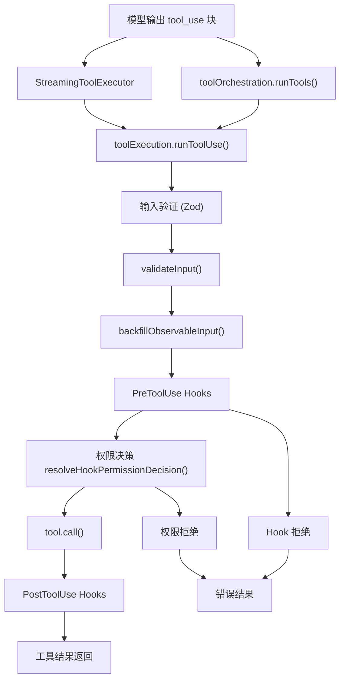
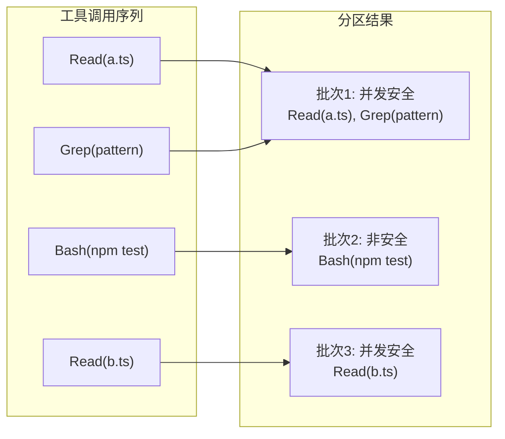
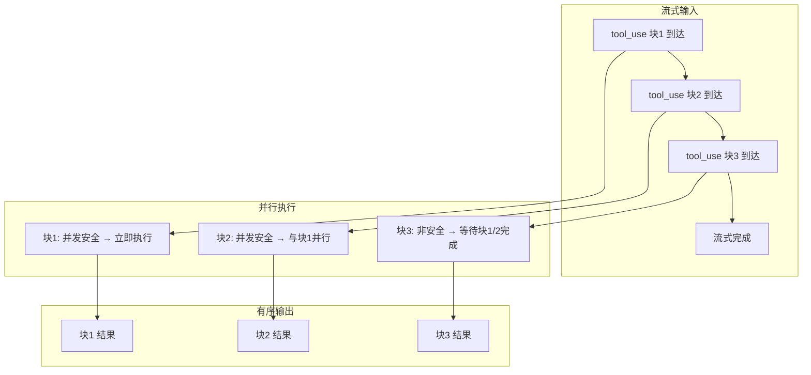

# 工具执行与编排

## 概述

Claude Code 的工具执行系统由四个核心模块协同工作：`toolOrchestration.ts` 负责工具调度的宏观编排，`toolExecution.ts` 负责单个工具执行的完整生命周期，`StreamingToolExecutor.ts` 实现流式工具执行以优化延迟，`toolHooks.ts` 管理 PreToolUse/PostToolUse Hook 的执行与权限决策集成。这四个模块共同实现了从模型输出 tool_use 块到工具结果返回的完整流水线。

## 整体架构



## 工具编排：toolOrchestration.ts

`toolOrchestration.ts` 负责工具调度的宏观策略，核心函数 `runTools()` 是一个异步生成器，处理一组 tool_use 块的执行。

### 分区调度策略

`partitionToolCalls()` 将工具调用按并发安全性分区为批次（Batch）：

```typescript
type Batch = { isConcurrencySafe: boolean; blocks: ToolUseBlock[] }
```

分区规则：
1. 连续的并发安全工具合并为一个批次，并行执行。
2. 非并发安全工具各自成为独立批次，串行执行。
3. 安全性判断调用 `tool.isConcurrencySafe(parsedInput)`，如果抛出异常（如 shell-quote 解析失败），保守地视为不安全。



### 并发执行：runToolsConcurrently()

并发安全批次的执行使用 `all()` 工具函数，限制最大并发数：

```typescript
function getMaxToolUseConcurrency(): number {
  return parseInt(process.env.CLAUDE_CODE_MAX_TOOL_USE_CONCURRENCY || '', 10) || 10
}
```

并发执行中的上下文修改器（contextModifier）被延迟收集，在所有工具完成后按工具 ID 顺序应用，避免并发修改竞争。

### 串行执行：runToolsSerially()

非并发安全工具逐个执行，每个工具完成后立即应用其上下文修改器，影响后续工具的执行上下文。

### 工具追踪

`setInProgressToolUseIDs` 在工具开始时添加 ID，完成后移除，用于 UI 展示当前正在执行的工具。

## 工具执行：toolExecution.ts

`toolExecution.ts` 实现了单个工具的完整执行流程，核心函数 `runToolUse()` 是异步生成器，逐步产出执行过程中的消息。

### 执行流程

```mermaid
sequenceDiagram
    participant Caller as 调用方
    participant runToolUse as runToolUse()
    participant tool as Tool
    participant hooks as toolHooks

    Caller->>runToolUse: toolUse block

    alt 工具不存在
        runToolUse->>Caller: 错误消息
    else 已中止
        runToolUse->>Caller: 取消消息
    else 正常执行
        runToolUse->>runToolUse: streamedCheckPermissionsAndCallTool()
        Note over runToolUse: "创建 Stream&lt;MessageUpdateLazy&gt;"

        runToolUse->>tool: inputSchema.safeParse(input)
        alt 验证失败
            runToolUse->>Caller: InputValidationError
        else 验证通过
            runToolUse->>tool: validateInput()
            alt 验证失败
                runToolUse->>Caller: 验证错误消息
            else 验证通过
                runToolUse->>runToolUse: backfillObservableInput()
                runToolUse->>hooks: runPreToolUseHooks()
                hooks-->>runToolUse: hookPermissionResult / 消息

                runToolUse->>hooks: resolveHookPermissionDecision()
                hooks-->>runToolUse: 权限决策

                alt 权限拒绝
                    runToolUse->>Caller: 权限拒绝消息
                else 权限允许
                    runToolUse->>tool: call(input, context, ...)
                    tool-->>runToolUse: ToolResult

                    runToolUse->>hooks: runPostToolUseHooks()
                    hooks-->>runToolUse: Hook 结果 / 消息

                    runToolUse->>Caller: 工具结果消息
                end
            end
        end
    end
```

### 输入验证阶段

1. **Schema 验证**：使用 Zod 的 `safeParse()` 验证输入结构。模型并不总是能生成有效输入，因此这一步至关重要。验证失败时，如果工具被延迟加载且不在已发现工具集合中，会附加 `buildSchemaNotSentHint()` 提示模型先调用 ToolSearch。

2. **业务验证**：调用 `tool.validateInput()` 执行工具特定的输入值验证（如路径存在性、模式兼容性等）。

3. **防御性清理**：对 BashTool，剥离模型可能注入的 `_simulatedSedEdit` 内部字段。该字段只能由权限系统（SedEditPermissionRequest）在用户批准后注入。

### BackfillObservableInput

```typescript
let callInput = processedInput
const backfilledClone =
  tool.backfillObservableInput && typeof processedInput === 'object' && processedInput !== null
    ? ({ ...processedInput } as typeof processedInput)
    : null
if (backfilledClone) {
  tool.backfillObservableInput!(backfilledClone as Record<string, unknown>)
  processedInput = backfilledClone
}
```

在浅拷贝上执行 backfill，确保观察者（Hook、canUseTool、SDK 流）看到回填字段，但原始 API 绑定输入不受影响。后续如果 Hook/权限返回了新的 `updatedInput`，则使用新输入；否则恢复原始输入以保持转录/VCR 哈希稳定。

### 推测性分类器启动

对 BashTool，在 PreToolUse Hook 执行期间提前启动推测性分类器检查：

```typescript
if (tool.name === BASH_TOOL_NAME && parsedInput.data && 'command' in parsedInput.data) {
  startSpeculativeClassifierCheck(
    (parsedInput.data as BashToolInput).command,
    appState.toolPermissionContext,
    toolUseContext.abortController.signal,
    toolUseContext.options.isNonInteractiveSession,
  )
}
```

这让分类器与 Hook 执行、拒绝/询问分类器和权限对话框设置并行运行，减少整体延迟。UI 指示器不在此处设置——仅在权限检查返回 `ask` 且有待处理分类器时才显示。

### 权限决策解析

`resolveHookPermissionDecision()` 是 Hook 权限结果与通用权限系统的桥梁：

1. **Hook 允许**（`behavior: 'allow'`）：不绕过 settings.json 的 deny/ask 规则。`checkRuleBasedPermissions()` 仍然适用——如果 deny 规则存在，覆盖 Hook 的允许；如果 ask 规则存在，仍需弹出对话框。
2. **Hook 拒绝**（`behavior: 'deny'`）：直接拒绝，不需要进一步检查。
3. **Hook 询问**（`behavior: 'ask'`）或无 Hook 决策：进入正常的 `canUseTool()` 流程，但可能携带 Hook 的询问消息作为 `forceDecision` 参数。

对于 `requiresUserInteraction()` 的工具，Hook 的 `updatedInput` 可以满足交互需求（如无头包装器收集了 AskUserQuestion 的答案），此时跳过交互式提示。

### 结果处理

工具成功执行后：

1. **结果映射**：`tool.mapToolResultToToolResultBlockParam()` 将输出数据转换为 API 格式，缓存避免重复映射。
2. **结果持久化**：`processToolResultBlock()` / `processPreMappedToolResultBlock()` 处理大结果的磁盘持久化。
3. **PostToolUse Hook**：非 MCP 工具在 Hook 前添加结果，MCP 工具在 Hook 后添加（因为 Hook 可能修改输出）。
4. **上下文修改器**：`ToolResult.contextModifier` 被包装为 `MessageUpdateLazy.contextModifier` 传递给编排层。
5. **附加消息**：`ToolResult.newMessages` 和 Hook 产生的附加消息被追加到结果列表。

### 错误处理

- **MCP 认证错误**（`McpAuthError`）：自动更新 MCP 客户端状态为 `'needs-auth'`，触发 UI 显示重新授权提示。
- **中止错误**（`AbortError`）：不记录错误日志，静默处理。
- **Shell 错误**（`ShellError`）：仅通过 `logForDebugging` 记录，不调用 `logError`（因为 Shell 错误是预期的操作失败）。
- **其他错误**：完整记录并通过 `classifyToolError()` 分类为遥测安全的字符串。

## 流式工具执行：StreamingToolExecutor

`StreamingToolExecutor.ts` 是一个关键的性能优化——工具在 tool_use 块流式传输时就开始执行，而不必等待完整响应完成。

### 核心设计



### 工具状态机

```typescript
type ToolStatus = 'queued' | 'executing' | 'completed' | 'yielded'
```

每个被追踪的工具经历四个状态：排队（queued）→ 执行中（executing）→ 完成（completed）→ 已产出（yielded）。结果在完成后按原始顺序产出，维护工具调用的因果一致性。

### 并发控制

`canExecuteTool()` 实现并发约束：

```typescript
private canExecuteTool(isConcurrencySafe: boolean): boolean {
  const executingTools = this.tools.filter(t => t.status === 'executing')
  return (
    executingTools.length === 0 ||
    (isConcurrencySafe && executingTools.every(t => t.isConcurrencySafe))
  )
}
```

- 如果没有工具在执行，任何工具都可以开始。
- 如果有工具在执行，只有当新工具是并发安全的且所有正在执行的工具也是并发安全的时，才允许并行。

### 兄弟错误级联

BashTool 错误会级联取消兄弟工具：

```typescript
if (isErrorResult) {
  thisToolErrored = true
  if (tool.block.name === BASH_TOOL_NAME) {
    this.hasErrored = true
    this.erroredToolDescription = this.getToolDescription(tool)
    this.siblingAbortController.abort('sibling_error')
  }
}
```

仅 Bash 错误触发级联取消，因为 Bash 命令通常有隐式依赖链（如 mkdir 失败 → 后续命令无意义）。Read/WebFetch 等独立工具的失败不应影响其他工具。

### 中断行为

当用户提交新消息时，根据工具的 `interruptBehavior()` 决定处理方式：

- `'cancel'`：生成用户中断错误消息（使用 `REJECT_MESSAGE` 显示"用户拒绝"）。
- `'block'`：继续运行，新消息等待。

### 进度消息即时产出

进度消息不等待顺序，立即通过 `pendingProgress` 队列产出：

```typescript
*getCompletedResults(): Generator<MessageUpdate, void> {
  for (const tool of this.tools) {
    while (tool.pendingProgress.length > 0) {
      const progressMessage = tool.pendingProgress.shift()!
      yield { message: progressMessage, newContext: this.toolUseContext }
    }
    // ...
  }
}
```

这确保用户能实时看到工具执行进度，而不是等到所有工具完成。

### 丢弃机制

`discard()` 方法用于流式回退场景——当 API 响应失败需要重试时，丢弃已开始执行的工具结果：

```typescript
discard(): void {
  this.discarded = true
}
```

被丢弃后，排队中的工具不会启动，正在执行的工具会收到合成错误消息。

## Hook 执行：toolHooks.ts

`toolHooks.ts` 管理 PreToolUse 和 PostToolUse Hook 的执行，是工具执行与用户自定义 Hook 系统的桥梁。

### PreToolUse Hooks

`runPreToolUseHooks()` 产出多种类型的事件：

| 事件类型 | 说明 |
|----------|------|
| `message` | Hook 产生的消息（进度或附件） |
| `hookPermissionResult` | Hook 的权限决策（allow/deny/ask） |
| `hookUpdatedInput` | Hook 修改了输入但未做权限决策（透传） |
| `preventContinuation` | Hook 请求阻止后续执行 |
| `stopReason` | 阻止执行的原因 |
| `additionalContext` | Hook 提供的额外上下文 |
| `stop` | 中止执行（如被 abort） |

Hook 的 `permissionBehavior` 映射为三种权限结果：
- `'allow'`：允许执行，但 `deny` 规则仍可覆盖。
- `'deny'`：拒绝执行，附带 `blockingError`。
- `'ask'`：强制弹出权限对话框，附带 Hook 的消息。

### PostToolUse Hooks

`runPostToolUseHooks()` 处理工具成功执行后的 Hook：

- **`blockingError`**：Hook 阻止工具结果传递给模型。
- **`preventContinuation`**：Hook 请求停止后续执行。
- **`additionalContexts`**：Hook 追加额外上下文信息。
- **`updatedMCPToolOutput`**：Hook 修改 MCP 工具的输出（仅对 MCP 工具生效）。
- **`hook_cancelled`**：Hook 被中止（如用户中断）。

### PostToolUseFailure Hooks

`runPostToolUseFailureHooks()` 在工具执行失败后运行，结构与 PostToolUse 类似，但接收错误信息而非工具输出。

### resolveHookPermissionDecision()：权限决策集成

这是 Hook 权限结果与通用权限系统的关键集成点，保证语义一致性：

1. **Hook 允许 + deny 规则**：deny 规则覆盖 Hook 的允许——Hook 信任不代表规则允许。
2. **Hook 允许 + ask 规则**：仍需弹出对话框，但可能携带 Hook 的额外信息。
3. **Hook 允许 + requiresUserInteraction**：如果 Hook 提供了 `updatedInput`（代表它已经完成了用户交互），则视为交互已满足；否则仍需调用 `canUseTool()`。
4. **Hook 拒绝**：直接返回拒绝结果。
5. **Hook 询问 / 无决策**：进入正常的 `canUseTool()` 流程。

## 性能优化总结

1. **流式执行**：工具在 tool_use 块流式到达时立即开始执行，而非等待完整响应，显著减少首工具延迟。
2. **推测性分类器**：BashTool 的分类器检查与 Hook 执行并行启动。
3. **进度即时产出**：进度消息不等待顺序约束，立即传递给 UI。
4. **结果缓存**：`mapToolResultToToolResultBlockParam()` 结果被缓存，避免重复序列化。
5. **Hook 并行执行**：Hook 的定时摘要使用挂钟时间（而非各 Hook 持续时间之和），因为 Hook 并行运行。
