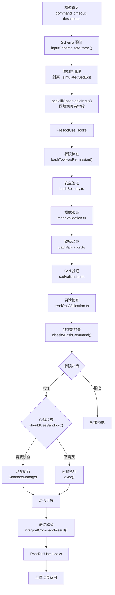

# Bash工具深度解析

## 概述

BashTool 是 Claude Code 中最复杂、最核心的工具，其实现横跨 17 个源文件，涵盖命令执行、安全验证、权限匹配、语义分析、只读约束、沙盒管理、sed 编辑解析等多个子系统。BashTool 的复杂性源于 Shell 命令的开放性和危险性——它必须在不限制模型能力的前提下，确保命令执行的安全性和可控性。

## 文件结构概览

| 文件 | 职责 |
|------|------|
| `BashTool.tsx` | 主定义：buildTool()、命令语义分类、输入/输出 Schema |
| `bashSecurity.ts` | 安全验证：命令替换模式、Zsh 危险命令、heredoc 分析 |
| `bashPermissions.ts` | 权限规则匹配、前缀提取、分类器集成 |
| `commandSemantics.ts` | 语义解释：命令退出码的上下文化解读 |
| `readOnlyValidation.ts` | 只读模式约束检查 |
| `modeValidation.ts` | 模式特定验证（如 acceptEdits 模式） |
| `pathValidation.ts` | 路径约束验证：危险路径、工作目录限制 |
| `sedValidation.ts` | sed 命令验证：标志白名单、安全模式检查 |
| `sedEditParser.ts` | sed 编辑命令解析：提取文件路径和替换模式 |
| `shouldUseSandbox.ts` | 沙盒模式决定：排除命令、特性标志检查 |
| `destructiveCommandWarning.ts` | 破坏性命令警告：信息性提示（不影响权限逻辑） |
| `commentLabel.ts` | 注释标签提取：首行 `# comment` 作为 UI 标签 |
| `toolName.ts` | 工具名常量 |
| `prompt.ts` | 工具提示文本和超时配置 |
| `utils.ts` | 工具函数：图片输出、Shell 重置、CWD 管理 |
| `UI.tsx` | UI 渲染组件 |
| `BashToolResultMessage.tsx` | 结果消息渲染 |

## Bash 执行流水线



## BashTool.tsx：主定义

### 输入 Schema

```typescript
const fullInputSchema = lazySchema(() => z.strictObject({
  command: z.string(),
  timeout: semanticNumber(z.number().optional()),
  description: z.string().optional(),
  run_in_background: semanticBoolean(z.boolean().optional()),
  dangerouslyDisableSandbox: semanticBoolean(z.boolean().optional()),
  _simulatedSedEdit: z.object({
    filePath: z.string(),
    newContent: z.string()
  }).optional(),
}))
```

`_simulatedSedEdit` 是内部字段，从模型可见 Schema 中剥离。它由 SedEditPermissionRequest 在用户批准 sed 编辑预览后注入，确保用户预览的内容与实际写入的内容完全一致。如果模型尝试注入此字段，Schema 的 `strictObject` 会拒绝，且 `toolExecution.ts` 有额外的防御性剥离。

`run_in_background` 在 `CLAUDE_CODE_DISABLE_BACKGROUND_TASKS` 启用时从 Schema 中移除。

### 输出 Schema

```typescript
const outputSchema = lazySchema(() => z.object({
  stdout: z.string(),
  stderr: z.string(),
  rawOutputPath: z.string().optional(),
  interrupted: z.boolean(),
  isImage: z.boolean().optional(),
  backgroundTaskId: z.string().optional(),
  backgroundedByUser: z.boolean().optional(),
  assistantAutoBackgrounded: z.boolean().optional(),
  dangerouslyDisableSandbox: z.boolean().optional(),
  returnCodeInterpretation: z.string().optional(),
  noOutputExpected: z.boolean().optional(),
  structuredContent: z.array(z.any()).optional(),
  persistedOutputPath: z.string().optional(),
  persistedOutputSize: z.number().optional(),
}))
```

`returnCodeInterpretation` 由 `commandSemantics.ts` 提供，将特殊退出码翻译为人类可读的语义。`noOutputExpected` 由 `isSilentBashCommand()` 判断，影响 UI 显示"Done"而非"(No output)"。

### 命令语义分类

BashTool 对命令进行细粒度的语义分类，影响 UI 的折叠显示：

```typescript
const BASH_SEARCH_COMMANDS = new Set(['find', 'grep', 'rg', 'ag', 'ack', 'locate', 'which', 'whereis'])
const BASH_READ_COMMANDS = new Set(['cat', 'head', 'tail', 'less', 'more', 'wc', 'stat', 'file', 'strings', 'jq', 'awk', 'cut', 'sort', 'uniq', 'tr'])
const BASH_LIST_COMMANDS = new Set(['ls', 'tree', 'du'])
const BASH_SEMANTIC_NEUTRAL_COMMANDS = new Set(['echo', 'printf', 'true', 'false', ':'])
const BASH_SILENT_COMMANDS = new Set(['mv', 'cp', 'rm', 'mkdir', 'rmdir', 'chmod', 'chown', 'chgrp', 'touch', 'ln', 'cd', 'export', 'unset', 'wait'])
```

`isSearchOrReadBashCommand()` 对管道命令（如 `cat file | jq`）要求所有部分都是搜索/读取命令才折叠，但语义中性命令（echo、printf）可以在任何位置跳过——`ls dir && echo "---" && ls dir2` 仍被视为读取操作。

### buildTool 配置

```typescript
export const BashTool = buildTool({
  name: BASH_TOOL_NAME,
  searchHint: 'execute shell commands',
  maxResultSizeChars: 30_000,
  strict: true,
  isConcurrencySafe(input) {
    return this.isReadOnly?.(input) ?? false
  },
  isReadOnly(input) {
    const compoundCommandHasCd = commandHasAnyCd(input.command)
    const result = checkReadOnlyConstraints(input, compoundCommandHasCd)
    return result.behavior === 'allow'
  },
  toAutoClassifierInput(input) {
    return input.command
  },
  // ...
})
```

关键设计：`isConcurrencySafe` 直接委托给 `isReadOnly`——只有只读 Bash 命令才可安全并发执行。`toAutoClassifierInput` 返回完整的命令字符串，因为 Bash 命令是自动模式安全分类器的核心输入。

## bashSecurity.ts：安全验证

### 命令替换模式检测

`COMMAND_SUBSTITUTION_PATTERNS` 检测 Shell 中的各种命令替换和参数扩展机制：

| 模式 | 说明 |
|------|------|
| `<(` / `>(` | 进程替换 |
| `=(` | Zsh 进程替换 |
| `=[a-zA-Z_]` | Zsh 等号扩展（`=cmd` → `$(which cmd)`，可绕过 Bash deny 规则） |
| `$(` | 命令替换 |
| `${` | 参数替换 |
| `$[` | 旧式算术扩展 |
| `~[` | Zsh 参数扩展 |
| `(e:` | Zsh glob 限定符 |
| `(+` | Zsh glob 限定符带命令执行 |
| `} always {` | Zsh always 块 |
| `<#` | PowerShell 注释语法（纵深防御） |

### Zsh 危险命令

`ZSH_DANGEROUS_COMMANDS` 集合包含可通过 `zmodload` 加载的模块命令：

- **zmodload**：加载危险模块的网关（mapfile、system、zpty、net/tcp、files）
- **emulate**：带 `-c` 标志时等同于 eval
- **sysopen/sysread/syswrite/sysseek**：zsh/system 模块的文件描述符操作
- **zpty**：伪终端命令执行
- **ztcp/zsocket**：网络外泄通道
- **zf_rm/zf_mv/zf_ln** 等：zsh/files 模块的内建文件操作，绕过二进制检查

### 安全检查 ID 系统

`BASH_SECURITY_CHECK_IDS` 为每种安全检查分配数字 ID，避免在遥测日志中暴露字符串：

```typescript
const BASH_SECURITY_CHECK_IDS = {
  INCOMPLETE_COMMANDS: 1,
  JQ_SYSTEM_FUNCTION: 2,
  JQ_FILE_ARGUMENTS: 3,
  OBFUSCATED_FLAGS: 4,
  SHELL_METACHARACTERS: 5,
  DANGEROUS_VARIABLES: 6,
  NEWLINES: 7,
  DANGEROUS_PATTERNS_COMMAND_SUBSTITUTION: 8,
  DANGEROUS_PATTERNS_INPUT_REDIRECTION: 9,
  DANGEROUS_PATTERNS_OUTPUT_REDIRECTION: 10,
  IFS_INJECTION: 11,
  GIT_COMMIT_SUBSTITUTION: 12,
  PROC_ENVIRON_ACCESS: 13,
  MALFORMED_TOKEN_INJECTION: 14,
  BACKSLASH_ESCAPED_WHITESPACE: 15,
  BRACE_EXPANSION: 16,
  CONTROL_CHARACTERS: 17,
  UNICODE_WHITESPACE: 18,
  MID_WORD_HASH: 19,
  ZSH_DANGEROUS_COMMANDS: 20,
  BACKSLASH_ESCAPED_OPERATORS: 21,
  COMMENT_QUOTE_DESYNC: 22,
  QUOTED_NEWLINE: 23,
}
```

## bashPermissions.ts：权限规则匹配

### 权限决策流程

BashTool 的权限检查是多层的，按照优先级依次检查：

1. **安全检查**（`bashSecurity.ts`）：检测危险模式（命令替换、Zsh 扩展等）
2. **模式验证**（`modeValidation.ts`）：模式特定规则（如 acceptEdits 模式自动允许文件系统命令）
3. **路径验证**（`pathValidation.ts`）：工作目录约束和危险路径检查
4. **Sed 验证**（`sedValidation.ts`）：sed 命令的标志和模式限制
5. **只读约束**（`readOnlyValidation.ts`）：只读模式下允许的命令白名单
6. **分类器检查**（`classifyBashCommand()`）：自动模式下的 AI 安全分类

### 规则匹配语法

BashTool 的权限规则支持多种匹配模式：

- **精确匹配**：`"npm run lint"` — 命令必须完全匹配
- **前缀匹配**：`"git *"` — 命令以前缀开头
- **通配符匹配**：`"npm run *"` — 支持通配符模式

`permissionRuleExtractPrefix()` 从规则模式中提取前缀，用于快速匹配。

### 推测性分类器

`startSpeculativeClassifierCheck()` 在权限对话框准备期间提前启动 Bash 命令的安全分类，与 Hook 执行并行运行，减少总体延迟。

## commandSemantics.ts：语义解释

不同命令使用退出码传达不同含义。`commandSemantics.ts` 为常见命令定义了语义解释：

| 命令 | 退出码 0 | 退出码 1 | 退出码 2+ |
|------|----------|----------|-----------|
| grep | 找到匹配 | 未找到匹配（非错误） | 错误 |
| rg | 找到匹配 | 未找到匹配（非错误） | 错误 |
| find | 成功 | 部分成功（某些目录不可访问） | 错误 |
| diff | 无差异 | 有差异（非错误） | 错误 |

`interpretCommandResult()` 应用这些语义，生成 `returnCodeInterpretation` 字段，让模型正确理解非零退出码不一定是错误。

## readOnlyValidation.ts：只读模式约束

只读模式下的 Bash 命令受到严格限制。`checkReadOnlyConstraints()` 使用统一的命令配置系统验证命令是否为只读：

- 每个命令定义了 `safeFlags`（安全标志白名单）
- 可选的 `regex` 用于额外验证
- 可选的 `additionalCommandIsDangerousCallback` 用于自定义危险检测

例如，fd 命令的安全标志排除了 `-x/--exec` 和 `-X/--exec-batch`，因为它们会为每个搜索结果执行任意命令。`-l/--list-details` 也被排除，因为它内部执行 `ls` 子进程，存在 PATH 劫持风险。

外部只读命令列表（`EXTERNAL_READONLY_COMMANDS`）包括 git、gh、docker 等工具的只读子命令，每个都经过单独验证。

## modeValidation.ts：模式特定验证

`checkPermissionMode()` 根据当前权限模式应用特殊规则：

- **acceptEdits 模式**：自动允许文件系统命令（mkdir、touch、rm、rmdir、mv、cp、sed），无需用户确认
- 其他模式：通过（passthrough），延迟到通用权限系统

## pathValidation.ts：路径约束验证

路径验证确保命令操作在允许的目录范围内：

1. **危险移除路径**：`rm -rf /`、`rm -rf ~` 等命令始终需要显式用户批准
2. **工作目录约束**：命令必须操作在项目目录或额外工作目录内
3. **路径提取**：`PATH_EXTRACTORS` 定义了 30+ 个命令的路径参数提取规则

`checkPathConstraints()` 解析命令参数，提取路径，验证每个路径是否在允许范围内。

## sedValidation.ts 与 sedEditParser.ts：Sed 命令处理

### sedEditParser.ts

`parseSedEditCommand()` 解析 `sed -i 's/pattern/replacement/flags' file` 格式的命令，提取：

- `filePath`：被编辑的文件路径
- `pattern`：搜索模式（正则表达式）
- `replacement`：替换字符串
- `flags`：替换标志（g、i 等）
- `extendedRegex`：是否使用扩展正则（-E 或 -r 标志）

解析器使用 BRE→ERE 转换占位符处理正则表达式差异，并通过 `tryParseShellCommand()` 正确处理 Shell 引用。

### sedValidation.ts

`sedCommandIsAllowedByAllowlist()` 验证 sed 命令是否在安全白名单内：

- **行打印模式**（`sed -n 'N'` 或 `sed -n 'N,M'`）：允许，因为只读取不修改
- **标志验证**：仅允许安全标志组合（-n、-E、-r、-z）
- **表达式验证**：检查 sed 表达式是否为只读操作

### 模拟 Sed 编辑

当权限系统检测到 sed 原地编辑时，会：

1. 解析 sed 命令，计算编辑后的文件内容
2. 在权限对话框中展示预览 diff
3. 用户批准后，将 `_simulatedSedEdit` 注入输入
4. `applySedEdit()` 直接应用预计算的内容，确保用户预览与实际写入一致

这种设计避免了"预览与执行不一致"的安全漏洞——如果运行实际 sed 命令，文件在预览和执行之间可能已被修改。

## shouldUseSandbox.ts：沙盒模式决定

`shouldUseSandbox()` 决定命令是否需要在沙盒中执行：

```typescript
export function shouldUseSandbox(input: Partial<SandboxInput>): boolean {
  if (!SandboxManager.isSandboxingEnabled()) return false
  if (input.dangerouslyDisableSandbox && SandboxManager.areUnsandboxedCommandsAllowed()) return false
  if (!input.command) return false
  if (containsExcludedCommand(input.command)) return false
  return true
}
```

`containsExcludedCommand()` 检查两类排除规则：

1. **动态配置**（`tengu_sandbox_disabled_commands`）：Ant 用户的远程配置
2. **用户配置**（`settings.json` 的 `sandbox.excludedCommands`）：支持精确匹配、前缀匹配和通配符匹配

排除命令检查使用不动点迭代，交替剥离环境变量前缀和安全包装器，直到不再产生新候选。这处理了 `timeout 300 FOO=bar bazel run` 等交错模式，单次组合会失败。

## destructiveCommandWarning.ts：破坏性命令警告

`destructiveCommandWarning.ts` 提供纯信息性的警告提示，不影响权限逻辑：

- **Git 操作**：`git reset --hard`、`git push --force`、`git clean -f`、`git checkout .`、`git stash drop/clear`、`git branch -D`
- **安全绕过**：`--no-verify`、`--amend`
- **文件删除**：`rm -rf`
- **数据覆盖**：`dd`、`truncate`
- **权限修改**：`chmod 000`、`chown`

警告字符串显示在权限对话框中，帮助用户理解操作的潜在影响。

## commentLabel.ts：注释标签

`extractBashCommentLabel()` 从命令首行提取注释标签：

```typescript
export function extractBashCommentLabel(command: string): string | undefined {
  const nl = command.indexOf('\n')
  const firstLine = (nl === -1 ? command : command.slice(0, nl)).trim()
  if (!firstLine.startsWith('#') || firstLine.startsWith('#!')) return undefined
  return firstLine.replace(/^#+\s*/, '') || undefined
}
```

在全屏模式下，这个注释文本作为工具调用标签和折叠组的提示，是 Claude 为人类写的操作描述。`#!` shebang 被排除，避免与脚本文件混淆。

## 图片输出处理

BashTool 支持检测和渲染终端图片输出：

- `isImageOutput()` 检测六角图（Sixel）图片数据
- `buildImageToolResult()` 将图片数据转换为 API 的 image 块
- `resizeShellImageOutput()` 调整图片大小以适应终端

## Shell 重置与 CWD 管理

- `resetCwdIfOutsideProject()`：当命令执行改变了工作目录到项目外时，重置到项目根目录
- `stdErrAppendShellResetMessage()`：在 stderr 中追加 Shell 重置消息，提示工作目录已变更
- `commandHasAnyCd()`：检测命令是否包含 `cd` 操作，影响只读判断

## 后台任务支持

BashTool 支持后台任务执行：

- `run_in_background` 参数允许命令在后台运行
- `COMMON_BACKGROUND_COMMANDS` 列表标识常见后台命令（npm、yarn、docker 等）
- `isAutobackgroundingAllowed()` 排除不应自动后台化的命令（如 sleep）
- `detectBlockedSleepPattern()` 检测应该使用 Monitor 工具的 sleep 模式

`ASSISTANT_BLOCKING_BUDGET_MS`（15 秒）是助手模式下阻塞 Bash 自动后台化的超时阈值。

## 设计总结

BashTool 的设计遵循**纵深防御**原则：

1. **第一层**：Schema 验证（Zod strictObject）阻止结构异常输入
2. **第二层**：安全验证（bashSecurity.ts）检测危险模式
3. **第三层**：模式验证（modeValidation.ts）应用模式特定规则
4. **第四层**：路径验证（pathValidation.ts）限制操作范围
5. **第五层**：Sed 验证（sedValidation.ts）限制 sed 命令
6. **第六层**：只读约束（readOnlyValidation.ts）白名单控制
7. **第七层**：分类器（bashClassifier.ts）AI 安全分类
8. **第八层**：沙盒隔离（SandboxManager）运行时隔离
9. **第九层**：用户确认（权限对话框）最终决策

每一层都是独立的防御，即使某一层被绕过，后续层仍能提供保护。这种分层设计确保了在保持模型灵活性的同时，最大程度地降低安全风险。
