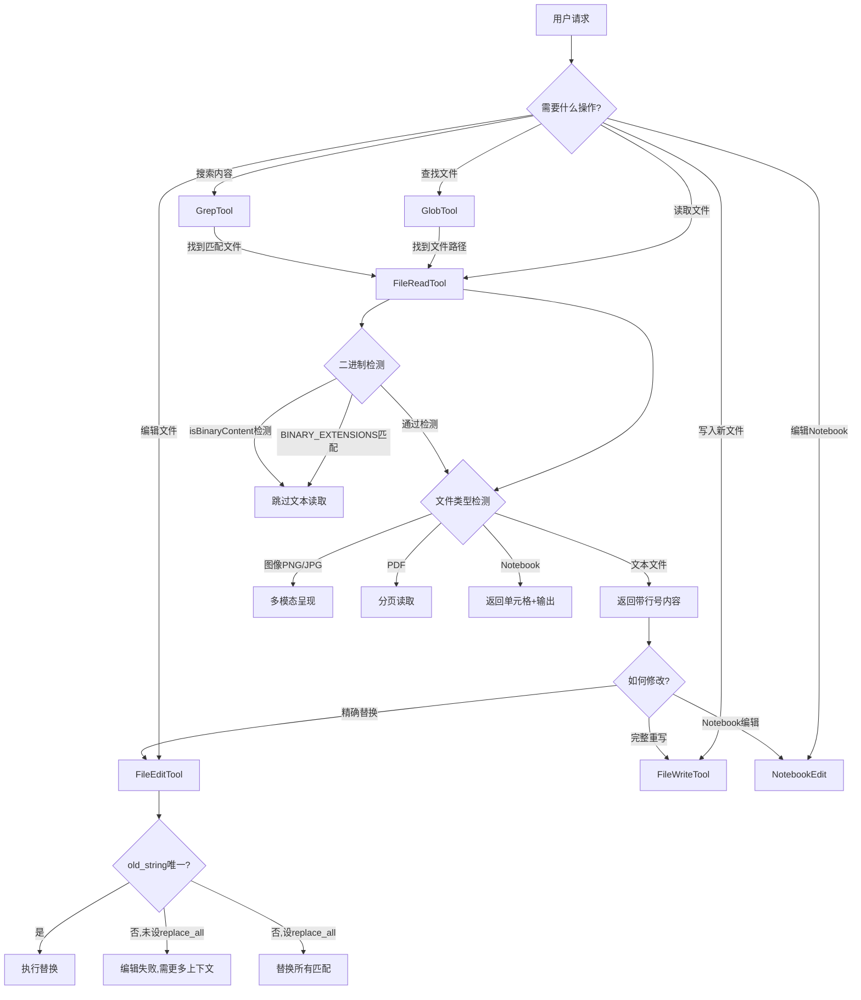
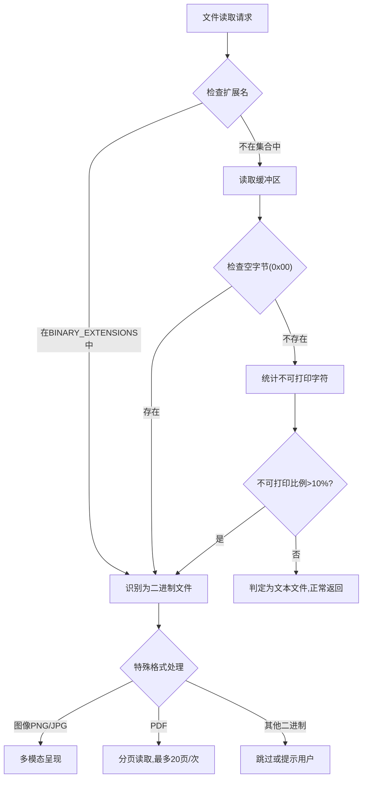

# 文件操作工具

## 概述

Claude Code 提供了一套完整的文件操作工具，覆盖文件的读取、编辑、写入、搜索和模式匹配等功能。这些工具构成了 Claude Code 与代码库交互的核心能力，支持文本文件、图像、PDF、Jupyter Notebook 等多种文件格式的操作。文件工具的设计原则是安全、精确和高效，通过严格的权限控制和验证机制确保文件操作不会意外破坏用户代码。

## 工具总览

Claude Code 的文件操作工具包括以下六个核心工具：

| 工具 | 功能 | 操作类型 |
|------|------|----------|
| FileReadTool | 读取文件内容 | 只读 |
| FileEditTool | 搜索替换编辑 | 修改 |
| FileWriteTool | 完整写入/覆盖文件 | 修改 |
| NotebookEdit | Jupyter Notebook 单元格编辑 | 修改 |
| GlobTool | 文件模式匹配搜索 | 只读 |
| GrepTool | 文件内容搜索 | 只读 |

## FileReadTool - 文件读取

FileReadTool 是 Claude Code 中最基础的文件操作工具，支持多种文件格式的读取。

### 支持的文件类型

**文本文件读取**：默认以 `cat -n` 格式返回内容（带行号），从第 1 行开始编号。支持指定行偏移量（offset）和行数限制（limit），用于读取大文件的特定部分。

**图像读取**：支持 PNG、JPG 等图像格式。FileReadTool 利用 Claude 的多模态能力直接呈现图像内容，无需进行文本转换。

**PDF 读取**：支持 `.pdf` 文件，但大 PDF（超过 10 页）必须使用 `pages` 参数指定页码范围（如 `pages: "1-5"`），每次请求最多 20 页。不提供 `pages` 参数时大 PDF 读取会失败。

**Jupyter Notebook 读取**：支持 `.ipynb` 文件，返回所有单元格及其输出，整合代码、文本和可视化内容。

### 二进制文件检测

Claude Code 通过 `src/constants/files.ts` 中的机制检测和跳过二进制文件：

**BINARY_EXTENSIONS 集合**：包含以下类别的文件扩展名：
- 图像：`.png`, `.jpg`, `.jpeg`, `.gif`, `.bmp`, `.ico`, `.webp`, `.tiff`
- 视频：`.mp4`, `.mov`, `.avi`, `.mkv`, `.webm`
- 音频：`.mp3`, `.wav`, `.ogg`, `.flac`, `.aac`
- 压缩包：`.zip`, `.tar`, `.gz`, `.bz2`, `.7z`, `.rar`
- 可执行文件：`.exe`, `.dll`, `.so`, `.dylib`, `.bin`
- 文档：`.pdf`, `.doc`, `.docx`, `.xls`, `.xlsx`（PDF 在调用点额外处理）
- 字体：`.ttf`, `.otf`, `.woff`, `.woff2`
- 字节码：`.pyc`, `.class`, `.jar`, `.node`, `.wasm`
- 数据库：`.sqlite`, `.sqlite3`, `.db`

**hasBinaryExtension 函数**：提取文件扩展名并检查是否在 `BINARY_EXTENSIONS` 集合中。

**isBinaryContent 函数**：基于缓冲区内容检测，检查前 8192 字节（`BINARY_CHECK_SIZE`）。核心逻辑包括：
- 遇到空字节（`0x00`）立即判定为二进制
- 统计不可打印字符比例（可打印 ASCII 为 32-126，加制表符 9、换行符 10、回车符 13）
- 不可打印字符超过 10% 则判定为二进制

## FileEditTool - 搜索替换编辑

FileEditTool 采用搜索替换（search-and-replace）模式进行文件编辑，确保编辑操作的精确性和安全性。

### 核心参数

- **file_path**：目标文件的绝对路径
- **old_string**：要替换的文本（必须在文件中唯一）
- **new_string**：替换后的文本（必须与 `old_string` 不同）
- **replace_all**：可选，设为 `true` 时替换文件中所有匹配实例

### 唯一性强制

FileEditTool 的核心设计约束是 `old_string` 必须在文件中唯一。如果 `old_string` 在文件中出现多次且未设置 `replace_all`，编辑操作会失败。这一机制防止了意外替换错误的位置。用户可以通过提供更多上下文来使匹配字符串唯一。

### 编辑原则

- 优先编辑现有文件，而非创建新文件
- 保持精确的缩进格式（使用 Read 工具读取时保留 tab 后的精确缩进）
- 不在文件中添加表情符号，除非用户明确要求
- 对于跨文件的变量重命名，使用 `replace_all` 选项

## FileWriteTool - 完整文件写入

FileWriteTool 用于完全覆盖文件内容或将内容写入新文件。

### 安全机制

- 修改已存在文件前，必须先使用 FileReadTool 读取该文件，否则操作会失败
- 这确保了 Claude 不会意外覆盖不了解的内容
- 文件路径必须使用绝对路径

### 使用场景

- 创建新文件
- 完全重写现有文件
- 不适合小幅修改（应使用 FileEditTool）

## NotebookEdit - Jupyter Notebook 编辑

NotebookEdit 专门用于编辑 Jupyter Notebook（`.ipynb`）文件的单元格级别操作。

### 操作模式

- **replace**：替换指定单元格的完整源代码
- **insert**：在指定位置插入新单元格
- **delete**：删除指定单元格

### 单元格定位

支持通过 `cell_id` 精确定位单元格，也支持通过 `cell_number`（0 索引）定位。`cell_id` 是更稳定的定位方式，不会因为其他单元格的增删而失效。插入新单元格时，通过 `cell_id` 指定插入位置，新单元格插入到该单元格之后。

### 单元格类型

支持两种单元格类型：
- **code**：代码单元格
- **markdown**：Markdown 文本单元格

## GlobTool - 文件模式匹配

GlobTool 使用 glob 模式进行文件名匹配搜索，按修改时间排序返回结果。

### 核心参数

- **pattern**：glob 模式，如 `**/*.js` 或 `src/**/*.ts`
- **path**：可选，指定搜索目录

### 搜索特性

- 按文件修改时间排序（最近修改的排在前面）
- 适用于按名称模式查找文件的场景
- 对于需要多轮搜索的开放性搜索，建议使用 Agent 工具

## GrepTool - 内容搜索

GrepTool 基于 ripgrep 构建的高性能内容搜索工具，支持完整的正则表达式语法。

### 核心参数

- **pattern**：正则表达式模式
- **path**：搜索目录（默认当前工作目录）
- **glob**：文件过滤模式（如 `*.js` 或 `**/*.tsx`）
- **type**：文件类型过滤（如 `js`, `py`, `rust`）

### 输出模式

- **content**：显示匹配行，支持上下文行数（`-A`, `-B`, `-C` 参数）和行号
- **files_with_matches**：仅显示匹配的文件路径（默认模式）
- **count**：显示每个文件的匹配计数

### 高级功能

- 支持多行模式（`multiline: true`），使 `.` 匹配换行符
- 支持大小写不敏感搜索（`-i` 参数）
- 支持行号显示（`-n` 参数）
- 支持偏移和限制（`offset` 和 `head_limit` 参数）
- 支持正则中的字面花括号转义（如 `interface\{\}`）

## 文件工具工作流

## 二进制检测流程

## 工具设计原则

1. **安全优先**：所有修改操作都需要权限检查，FileWriteTool 要求先读取后写入，防止意外覆盖
2. **精确操作**：FileEditTool 的唯一性约束确保每次编辑的准确性，避免误替换
3. **高效搜索**：GlobTool 按修改时间排序，GrepTool 基于 ripgrep 实现高性能正则搜索
4. **格式支持**：通过不同的处理路径支持文本、图像、PDF、Notebook 等多种格式
5. **二进制保护**：通过扩展名和内容双重检测机制，防止对二进制文件进行无意义的文本操作

## 与其他系统的集成

文件工具与 Claude Code 的多个核心系统紧密集成：

- **权限系统**：所有修改操作（FileEditTool、FileWriteTool、NotebookEdit）都需要通过权限检查
- **Hook 系统**：PreToolUse 和 PostToolUse Hook 可在文件操作前后执行自定义逻辑
- **沙箱系统**：文件操作受沙箱文件系统权限限制
- **Agent 系统**：Agent 工具中的子代理也使用相同的文件操作工具集
- **会话持久化**：文件操作的结果会被记录在会话转录中，支持通过 `--resume` 恢复
- **文件检查点**：通过 `fileCheckpointingEnabled` 配置，可在编辑前自动创建文件快照

## 源码位置

- 二进制检测：`src/constants/files.ts` - BINARY_EXTENSIONS 集合、hasBinaryExtension、isBinaryContent
- 工具注册：`src/tools.ts` - 所有文件工具的注册和导出
- 工具框架：`src/Tool.js` - buildTool 函数和 ToolDef 类型定义
- 权限检查：`src/utils/permissions/` - 工具权限验证逻辑
