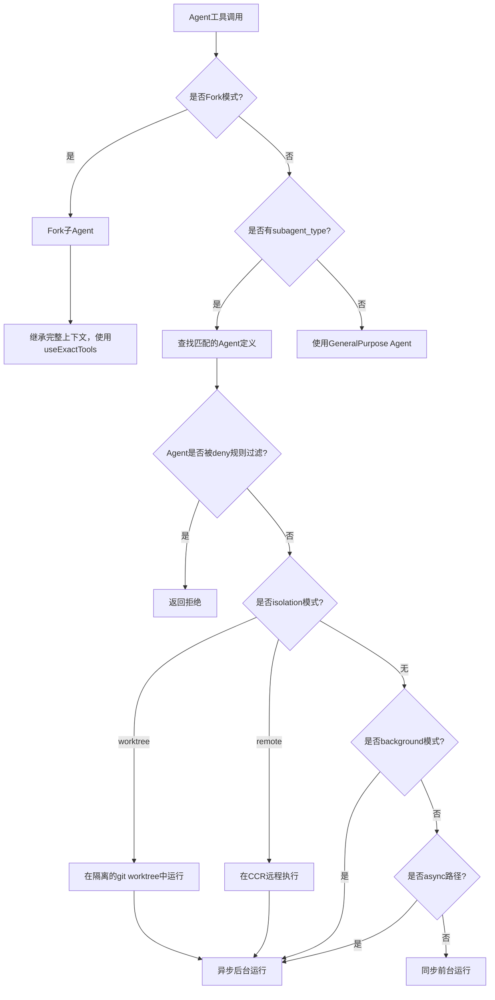

# 11 - Agent工具与子Agent系统

## 概述

Claude Code 的 Agent 工具系统是整个子 Agent 调度与执行的核心基础设施。它支持本地、远程、Fork 和 Teammate 四种分发模式，内置多种专用 Agent 定义，并提供了完整的生命周期管理，包括工具池解析、权限隔离、记忆持久化、MCP 服务器初始化和进度追踪。

## 核心架构

### AgentTool.tsx — 子 Agent 分发入口

`src/tools/AgentTool/AgentTool.tsx` 是 Agent 工具的主要实现文件，负责接收工具调用请求并决定子 Agent 的分发路径：

- **本地同步执行**：子 Agent 在主线程中同步运行，共享主线程的 `setAppState` 和 `abortController`
- **本地异步执行**：子 Agent 作为后台任务运行，拥有独立的 `AbortController`，通过任务通知系统与主线程通信
- **Fork 模式**：当省略 `subagent_type` 且 Fork 实验启用时，子 Agent 继承父 Agent 的完整对话上下文和系统提示
- **Teammate 模式**：进程内 Teammate 共享终端 UI，权限提示冒泡到父终端

分发决策的核心流程如下：



### builtInAgents.ts — 内置 Agent 定义

`src/tools/AgentTool/builtInAgents.ts` 提供以下内置 Agent：

| Agent | 用途 | 特殊配置 |
|-------|------|----------|
| **GeneralPurpose** | 通用任务执行 | 默认 Agent，无特殊工具限制 |
| **Explore** | 快速代码库探索 | 只读，省略 CLAUDE.md 和 gitStatus 以节省 token |
| **Plan** | 软件架构规划 | 只读，与 Explore 共享优化策略 |
| **Verification** | 独立代码审查 | 需 feature gate `tengu_hive_evidence` |
| **ClaudeCodeGuide** | CLI/API 使用指南 | 仅非 SDK 入口点可用 |
| **StatuslineSetup** | 状态栏配置 | 轻量级配置辅助 |

`areExplorePlanAgentsEnabled()` 通过 GrowthBook feature flag `BUILTIN_EXPLORE_PLAN_AGENTS` 和实验 `tengu_amber_stoat` 控制 Explore/Plan Agent 的可用性。SDK 用户可通过 `CLAUDE_AGENT_SDK_DISABLE_BUILTIN_AGENTS` 环境变量禁用所有内置 Agent。

### loadAgentsDir.ts — 自定义 Agent 加载

`src/tools/AgentTool/loadAgentsDir.ts` 实现了多来源 Agent 定义的加载和合并机制：

**Agent 定义类型体系**：
- `BuiltInAgentDefinition`：内置 Agent，具有动态 `getSystemPrompt()` 回调
- `CustomAgentDefinition`：来自 user/project/policy 设置的自定义 Agent
- `PluginAgentDefinition`：来自插件的 Agent，带有插件元数据

**Agent 来源优先级**（后者覆盖前者）：
1. 内置 Agent (`built-in`)
2. 插件 Agent (`plugin`)
3. 用户设置 (`userSettings`)
4. 项目设置 (`projectSettings`)
5. 标志设置 (`flagSettings`)
6. 托管设置 (`policySettings`)

**Markdown 格式解析**：Agent 定义以 `.md` 文件存放在 `.claude/agents/` 目录中，frontmatter 支持的字段包括：

```
name: my-agent
description: Agent描述
tools: ["Bash", "Read"]
disallowedTools: ["Write"]
model: inherit
effort: high
permissionMode: acceptEdits
mcpServers: ["slack"]
hooks: ...
maxTurns: 50
skills: ["my-skill"]
initialPrompt: "开始前先运行 /status"
memory: project
background: true
isolation: worktree
color: blue
```

**JSON 格式解析**：同样支持通过 `parseAgentFromJson()` 从 JSON 配置解析 Agent 定义，使用 Zod schema 验证。

### forkSubagent.ts — Fork 子 Agent 执行

`src/tools/AgentTool/forkSubagent.ts` 实现了 Fork 子 Agent 的完整流程：

**核心设计思想**：Fork 子 Agent 继承父 Agent 的完整对话上下文，为提示缓存共享优化而设计。所有 Fork 子进程必须产生字节级相同的 API 请求前缀以最大化缓存命中率。

**FORK_AGENT 定义**：
- `tools: ['*']` + `useExactTools: true`：继承父 Agent 的精确工具池
- `permissionMode: 'bubble'`：权限提示冒泡到父终端
- `model: 'inherit'`：保持父 Agent 的模型以维持上下文长度一致性

**递归 Fork 防护**：`isInForkChild()` 检测对话历史中的 Fork 样板标签，阻止 Fork 子进程再次 Fork。

**构建 Fork 消息**：`buildForkedMessages()` 的关键步骤：
1. 保留父 Assistant 消息的所有 `tool_use` 块
2. 为每个 `tool_use` 构建相同占位符文本的 `tool_result`
3. 附加每个子进程独有的指令文本块
4. 结果格式：`[...历史, assistant(所有tool_uses), user(占位符results..., 指令)]`

**Worktree 通知**：当 Fork 子进程运行在隔离的 worktree 中时，`buildWorktreeNotice()` 注入路径转换提醒。

### runAgent.ts — 核心 Agent 运行逻辑

`src/tools/AgentTool/runAgent.ts` 是子 Agent 执行的核心引擎，`runAgent()` 函数是一个异步生成器，负责完整的 Agent 生命周期：

**初始化阶段**：
1. 解析 Agent 模型（`getAgentModel`）
2. 创建唯一的 Agent ID
3. 注册 Perfetto 追踪
4. 过滤不完整的工具调用
5. 初始化文件状态缓存

**上下文构建**：
- 只读 Agent（Explore、Plan）省略 CLAUDE.md（节省 5-15 Gtok/周）和 gitStatus（节省 1-3 Gtok/周）
- 通过 `override.systemPrompt` 或动态生成构建系统提示
- 执行 SubagentStart 钩子，注入额外上下文

**工具池组装**：
- `resolveAgentTools()` 根据 Agent 定义的工具列表和禁用列表过滤工具
- Fork 模式使用 `useExactTools: true` 直接继承父工具池
- MCP 工具始终对 Agent 可用

**权限模式覆盖**：
- Agent 可定义自己的 `permissionMode`，但 `bypassPermissions` 和 `acceptEdits` 优先级更高
- 异步 Agent 设置 `shouldAvoidPermissionPrompts` 以自动拒绝权限提示
- `bubble` 模式始终显示权限提示

**MCP 服务器初始化**：`initializeAgentMcpServers()` 为 Agent 合并 MCP 服务器：
- 字符串引用：复用已有的 MCP 客户端连接
- 内联定义：创建新的 MCP 服务器连接，Agent 结束时清理
- 在 `strictPluginOnlyCustomization` 模式下，仅管理员信任的 Agent 可使用 frontmatter MCP

**执行与清理**：
- 每条消息通过 `recordSidechainTranscript()` 记录到 JSONL 副本
- `writeAgentMetadata()` 持久化元数据供恢复使用
- `finally` 块中执行全面清理：MCP 服务器、Session 钩子、文件状态缓存、Perfetto 注册、Todo 条目、后台 Shell 任务

### resumeAgent.ts — Agent 恢复

`src/tools/AgentTool/resumeAgent.ts` 实现 `resumeAgentBackground()`，恢复之前运行的 Agent：

**恢复流程**：
1. 读取 Agent 的 JSONL 副本和元数据（`.meta.json`）
2. 过滤掉不完整的工具调用和孤立思考消息
3. 重建内容替换状态（`reconstructForSubagentResume`）
4. 检查 worktree 路径是否仍然存在
5. 根据 `meta.agentType` 查找原始 Agent 定义
6. 重建 Fork 父系统提示（如果是 Fork 恢复）
7. 注册为异步 Agent 任务并运行

**元数据持久化**：Agent 元数据存储在 `.meta.json` 侧文件中，包含 `agentType`、`worktreePath`、`description` 等字段。

### agentToolUtils.ts — 共享工具函数

`src/tools/AgentTool/agentToolUtils.ts` 提供子 Agent 系统的核心工具函数：

**工具过滤**（`filterToolsForAgent`）：
- MCP 工具（`mcp__` 前缀）始终可用
- `ALL_AGENT_DISALLOWED_TOOLS` 中的工具被过滤（如 TaskOutputTool、EnterPlanModeTool 等）
- 自定义 Agent 受 `CUSTOM_AGENT_DISALLOWED_TOOLS` 额外限制
- 异步 Agent 仅允许 `ASYNC_AGENT_ALLOWED_TOOLS` 中的工具
- 进程内 Teammate 额外允许 `IN_PROCESS_TEAMMATE_ALLOWED_TOOLS`（任务管理工具）

**工具常量定义**（`src/constants/tools.ts`）：

| 常量 | 内容 |
|------|------|
| `ALL_AGENT_DISALLOWED_TOOLS` | 所有 Agent 禁用的工具集（TaskOutputTool、ExitPlanModeTool 等） |
| `ASYNC_AGENT_ALLOWED_TOOLS` | 异步 Agent 允许的工具集（Read、Bash、Edit、Write、Grep 等） |
| `IN_PROCESS_TEAMMATE_ALLOWED_TOOLS` | 进程内 Teammate 额外允许的工具（TaskCreate、SendMessage 等） |

**结果 Schema**（`agentToolResultSchema`）：定义 Agent 工具返回值的 Zod schema，包含 `agentId`、`content`、`totalToolUseCount`、`totalDurationMs`、`totalTokens` 和详细 `usage` 信息。

**异步 Agent 生命周期**（`runAsyncAgentLifecycle`）：驱动后台 Agent 从生成到终止通知的完整生命周期，包括进度追踪、摘要生成、Handoff 分类等。

**Handoff 分类**（`classifyHandoffIfNeeded`）：当 `TRANSCRIPT_CLASSIFIER` 功能启用且处于 `auto` 模式时，在子 Agent 完成交还控制权时进行安全审查。

### agentMemory.ts — Agent 记忆管理

`src/tools/AgentTool/agentMemory.ts` 实现了 Agent 级别的持久记忆系统：

**记忆作用域**：
- `user`：`~/.claude/agent-memory/<agentType>/`，跨项目通用
- `project`：`<cwd>/.claude/agent-memory/<agentType>/`，项目特定
- `local`：`<cwd>/.claude/agent-memory-local/<agentType>/`，不入版本控制

**记忆提示构建**：`loadAgentMemoryPrompt()` 为具有 `memory` 属性的 Agent 注入记忆提示，使用 `buildMemoryPrompt()` 构建完整的记忆行为指令。当记忆启用时，自动注入 Write/Edit/Read 工具以支持记忆文件访问。

**安全路径验证**：`isAgentMemoryPath()` 通过路径规范化检测 Agent 记忆路径，防止路径遍历攻击。

### agentMemorySnapshot.ts — 记忆快照

`src/tools/AgentTool/agentMemorySnapshot.ts` 实现项目级 Agent 记忆快照机制：

- `checkAgentMemorySnapshot()`：检查快照是否存在及是否比本地更新
- `initializeFromSnapshot()`：首次设置时从快照复制到本地
- `replaceFromSnapshot()`：用快照替换本地记忆
- `markSnapshotSynced()`：标记快照已同步

快照存储在 `<cwd>/.claude/agent-memory-snapshots/<agentType>/`，通过 `snapshot.json` 追踪更新时间戳。

### agentColorManager.ts — Agent 颜色分配

`src/tools/AgentTool/agentColorManager.ts` 为每个非 `general-purpose` 类型的 Agent 分配显示颜色，支持 8 种颜色（红、蓝、绿、黄、紫、橙、粉、青），颜色映射存储在全局状态中。

### agentDisplay.ts — 显示格式化

`src/tools/AgentTool/agentDisplay.ts` 提供共享的 Agent 显示工具函数：

- **来源分组**：`AGENT_SOURCE_GROUPS` 定义了 Agent 来源的显示分组和排序
- **覆盖解析**：`resolveAgentOverrides()` 标注被更高优先级来源覆盖的 Agent
- **模型显示**：`resolveAgentModelDisplay()` 解析 Agent 的模型显示名称

## 关键设计决策

1. **提示缓存共享**：Fork 路径通过字节级相同的 API 请求前缀最大化缓存命中率，所有 Fork 子进程共享相同的占位符文本
2. **权限隔离**：子 Agent 拥有独立的权限上下文，Agent 定义的 `permissionMode` 可覆盖父会话，但 `bypassPermissions` 和 `acceptEdits` 始终优先
3. **工具限制**：通过多层过滤机制（全局禁用、自定义禁用、异步白名单、Teammate 白名单）确保子 Agent 只能使用安全且适合其执行环境的工具
4. **生命周期清理**：`finally` 块中的全面清理确保无资源泄漏，包括 MCP 连接、钩子注册、文件缓存、Perfetto 追踪等
5. **记忆持久化**：Agent 记忆支持三个作用域，与项目级快照机制结合，实现跨会话知识传递
