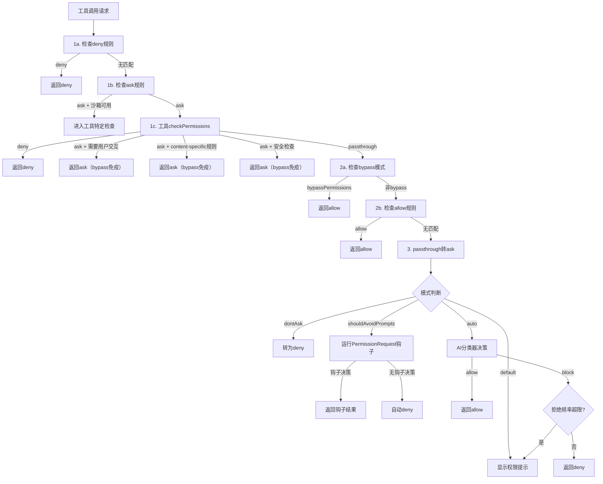

# 12 - 权限系统深度解析

## 概述

Claude Code 的权限系统是一个多层级、多来源的安全决策管道，控制着每个工具调用的执行权限。系统支持六种权限模式，通过规则聚合、ML 分类器、拒绝频率追踪和紧急关闭开关构建了纵深防御体系。从规则匹配到 AI 分类器决策，每一步都有明确的回退策略和安全保证。

## 权限模式

### PermissionMode.ts — 模式定义

`src/utils/permissions/PermissionMode.ts` 定义了以下权限模式：

| 模式 | 标题 | 行为 | 适用范围 |
|------|------|------|----------|
| `default` | 默认 | 每个工具调用都需要用户确认 | 所有用户 |
| `plan` | 计划模式 | 工具调用受限，仅允许规划相关操作 | 所有用户 |
| `acceptEdits` | 接受编辑 | 自动允许文件编辑操作 | 所有用户 |
| `bypassPermissions` | 绕过权限 | 自动允许所有操作 | 所有用户（受 killswitch 控制） |
| `dontAsk` | 不再询问 | 将 ask 决策转为 deny | 所有用户 |
| `auto` | 自动模式 | AI 分类器自动决策允许/拒绝 | 仅 ant 内部 |

`auto` 模式是 ant-only 功能，不包含在 `ExternalPermissionMode` 中。`isExternalPermissionMode()` 对外部用户始终返回 true。

## 规则体系

### PermissionRule.ts — 规则数据结构

`src/utils/permissions/PermissionRule.ts` 定义了权限规则的核心类型：

```typescript
type PermissionBehavior = 'allow' | 'deny' | 'ask'
type PermissionRuleValue = {
  toolName: string        // 工具名称，如 "Bash"
  ruleContent?: string    // 可选的内容限定，如 "npm install"
}
type PermissionRule = {
  source: PermissionRuleSource    // 规则来源
  ruleBehavior: PermissionBehavior  // 行为类型
  ruleValue: PermissionRuleValue    // 规则值
}
```

### permissionRuleParser.ts — 规则序列化

`src/utils/permissions/permissionRuleParser.ts` 实现规则字符串与结构化表示的双向转换：

**解析规则**（`permissionRuleValueFromString`）：
- `"Bash"` → `{ toolName: "Bash" }`（工具级规则）
- `"Bash(npm install)"` → `{ toolName: "Bash", ruleContent: "npm install" }`（内容级规则）
- `"Bash(*)"` 或 `"Bash()"` → `{ toolName: "Bash" }`（通配符退化为工具级规则）

**转义机制**：内容中的括号需要转义，如 `Bash(python -c "print\(1\)")`，解析器能正确处理转义字符。

**工具名别名**：`LEGACY_TOOL_NAME_ALIASES` 映射旧工具名到当前名称（如 `Task` → `Agent`），确保向后兼容。

## 规则来源与聚合

### 多来源规则聚合

`src/utils/permissions/permissions.ts` 是权限系统的核心协调器，从多个来源聚合规则：

**规则来源**（`PERMISSION_RULE_SOURCES`）：
1. `userSettings` — 用户全局设置
2. `projectSettings` — 项目级设置
3. `localSettings` — 本地设置
4. `policySettings` — 管理策略设置
5. `flagSettings` — 命令行标志
6. `cliArg` — CLI 参数
7. `command` — 命令注入
8. `session` — 会话级规则

**规则聚合函数**：
- `getAllowRules(context)` — 从所有来源收集允许规则
- `getDenyRules(context)` — 从所有来源收集拒绝规则
- `getAskRules(context)` — 从所有来源收集询问规则

每个函数遍历所有来源的对应规则数组，将规则字符串解析为结构化 `PermissionRule`。

**MCP 服务器级权限**：规则 `"mcp__server1"` 匹配工具 `"mcp__server1__tool1"`，规则 `"mcp__server1__*"` 匹配该服务器下的所有工具。

## 权限决策管道

权限决策管道由 `hasPermissionsToUseTool` 函数驱动，这是一个多步骤的决策流程：



### 管道步骤详解

**步骤 1a**：检查整个工具是否被 deny 规则拒绝。`getDenyRuleForTool()` 扫描所有来源的拒绝规则。

**步骤 1b**：检查整个工具是否有 ask 规则。如果启用了沙箱且命令可以在沙箱中运行，则跳过 ask 规则。

**步骤 1c**：调用工具自身的 `checkPermissions()` 方法进行工具特定权限检查（如 Bash 的子命令规则）。

**步骤 1e**：需要用户交互的工具（如 `AskUserQuestion`）即使在 bypass 模式下也需要用户确认。

**步骤 1f**：内容级 ask 规则（如 `Bash(npm publish:*)`）即使在 bypass 模式下也必须尊重。

**步骤 1g**：安全检查（`.git/`、`.claude/`、`.vscode/`、shell 配置文件等路径）是 bypass 免疫的。

**步骤 2a**：bypassPermissions 模式或 plan 模式下原始模式为 bypass 时，自动允许。

**步骤 2b**：检查工具是否在 allow 规则中。`toolAlwaysAllowedRule()` 查找匹配的允许规则。

**步骤 3**：将 passthrough 行为转换为 ask，然后根据当前模式做最终转换。

## Auto 模式分类器

### yoloClassifier.ts — ML 分类器

`src/utils/permissions/yoloClassifier.ts` 实现了 auto 模式的 AI 安全分类器：

**两阶段 XML 分类器**：

1. **Stage 1（快速阶段）**：使用 `max_tokens=64` 和 `stop_sequences=['</block>']` 快速决策，输出 `<block>yes/no</block>` 格式
2. **Stage 2（思考阶段）**：如果 Stage 1 阻止，使用 `max_tokens=4096` 和链式思考进行更仔细的审查

**系统提示构建**（`buildYoloSystemPrompt`）：
- 使用模板文件（`auto_mode_system_prompt.txt`）作为基础
- 替换 `<permissions_template>` 为外部或内部权限模板
- 替换 `<user_allow_rules_to_replace>`、`<user_deny_rules_to_replace>`、`<user_environment_to_replace>` 为用户自定义规则
- 合并 `settings.autoMode` 中的 allow/soft_deny/environment 配置
- Bash 分类器提供的 prompt 描述规则（`Bash(prompt:...)`）

**对话摘要构建**（`buildTranscriptEntries`）：
- 提取用户文本消息和 Assistant 的 `tool_use` 块
- 排除 Assistant 的文本内容（防止恶意内容影响分类器）
- 每个工具通过 `toAutoClassifierInput()` 投影自己的输入格式
- 支持 JSONL 格式（`{"Bash":"ls"}`）和文本格式（`Bash ls`）

**分类结果**：
- `shouldBlock: false` — 允许操作
- `shouldBlock: true` + `unavailable: false` — 主动阻止
- `shouldBlock: true` + `unavailable: true` — 分类器不可用（API 错误）

### bashClassifier.ts — Bash 命令分类

`src/utils/permissions/bashClassifier.ts`（外部构建为 stub）为 Bash 工具提供命令级别的分类，提取 `Bash(prompt:...)` 规则中的描述用于分类器提示。

## 拒绝频率追踪

### denialTracking.ts

`src/utils/permissions/denialTracking.ts` 实现了拒绝频率限制机制：

```typescript
type DenialTrackingState = {
  consecutiveDenials: number  // 连续拒绝次数
  totalDenials: number        // 总拒绝次数
}

const DENIAL_LIMITS = {
  maxConsecutive: 3,  // 连续拒绝上限
  maxTotal: 20,       // 总拒绝上限
}
```

- `shouldFallbackToPrompting()` — 当连续拒绝 >= 3 或总拒绝 >= 20 时，回退到手动提示
- 在无头模式下，达到限制直接抛出 `AbortError` 中止 Agent
- 每次成功允许操作后重置连续拒绝计数

## 危险模式检测

### dangerousPatterns.ts

`src/utils/permissions/dangerousPatterns.ts` 定义了危险 shell 工具的允许规则前缀模式：

**跨平台代码执行入口**（`CROSS_PLATFORM_CODE_EXEC`）：python、node、deno、ruby、perl、npx、bunx、npm run 等解释器和包运行器。

**Bash 特有危险模式**（`DANGEROUS_BASH_PATTERNS`）：在跨平台列表基础上增加 zsh、fish、eval、exec、sudo 等。ant 内部版本额外包含 fa run、coo、gh、curl、wget、git、kubectl、aws 等。

这些模式用于 `permissionSetup.ts` 中的 `isDangerousBashPermission` 检查，在 auto 模式入口时剥离过于宽泛的允许规则。

## 紧急关闭开关

### bypassPermissionsKillswitch.ts

`src/utils/permissions/bypassPermissionsKillswitch.ts` 实现了两层紧急关闭机制：

1. **bypassPermissions 关闭**：`checkAndDisableBypassPermissionsIfNeeded()` 在首次查询前检查 GrowthBook gate，如果需要则禁用 bypass 模式
2. **auto 模式关闭**：`checkAndDisableAutoModeIfNeeded()` 检查 auto 模式的 gate 访问权限，支持模型变更和 fast 模式切换时重新验证

两个检查都使用 React Hook（`useKickOffCheckAndDisableBypassPermissionsIfNeeded`、`useKickOffCheckAndDisableAutoModeIfNeeded`）在组件挂载时触发，且仅在 `/login` 后重置。

## 安全设计原则

1. **Fail-Closed 设计**：分类器不可用时默认拒绝（受 `tengu_iron_gate_closed` gate 控制），确保安全优先
2. **Bypass 免疫检查**：安全检查（`.git/`、`.claude/` 等敏感路径）和内容级 ask 规则在 bypassPermissions 模式下仍然强制执行
3. **工作区信任**：所有钩子执行需要工作区信任，frontmatter 钩子在 `strictPluginOnlyCustomization` 模式下仅管理员信任的 Agent 可注册
4. **拒绝频率限制**：连续拒绝和总拒绝的频率限制防止无限循环，达到限制后回退到手动审批
5. **危险模式过滤**：auto 模式入口时剥离过宽的 Bash/PowerShell 允许规则，防止绕过分类器
6. **分类器 fail-closed**：分类器 API 错误时阻止操作，提示过长时尝试截断重试，最终回退到手动提示
7. **Handoff 安全审查**：子 Agent 完成后，auto 模式通过分类器审查其输出，防止子 Agent 的恶意操作被无条件接受
