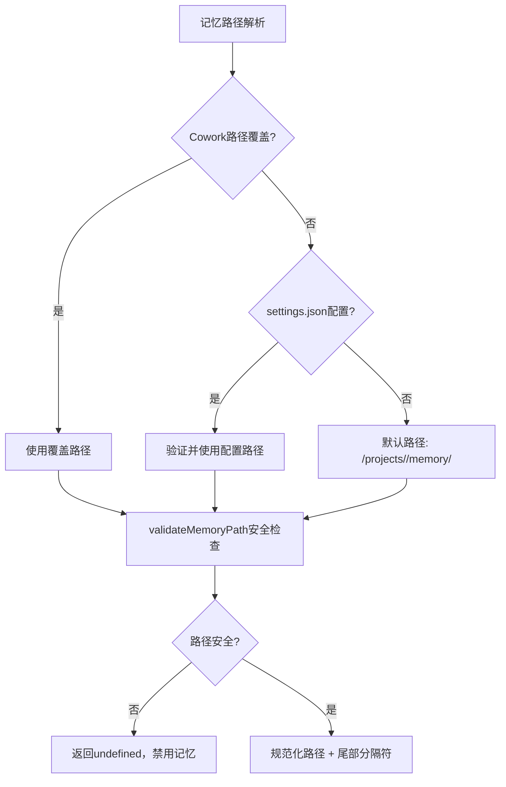
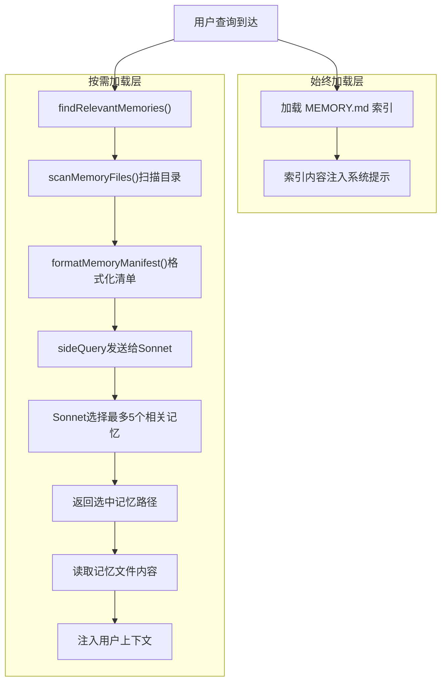

# 13 - 记忆系统

## 概述

Claude Code 的记忆系统是一个分层的、文件级持久化知识管理基础设施，位于 `src/memdir/` 目录。系统采用两层架构：MEMORY.md 索引文件（始终加载）+ 独立主题文件（按需加载），支持四种记忆类型分类、LLM-in-the-loop 智能召回、严格的安全路径验证和特性门控模式。该系统为 Agent 记忆和会话记忆提供统一的持久化框架。

## 目录结构与模块

```
src/memdir/
├── paths.ts              # 目录解析与安全验证
├── memoryTypes.ts         # 四类型分类法
├── memdir.ts              # 提示构建与目录管理
├── memoryScan.ts          # 记忆文件扫描
├── findRelevantMemories.ts # LLM 智能召回
├── memoryAge.ts           # 记忆时效性
├── teamMemPaths.ts        # 团队记忆路径
└── teamMemPrompts.ts      # 团队记忆提示
```

## 目录解析与安全

### paths.ts — 目录解析

`src/memdir/paths.ts` 是记忆系统路径解析的核心，负责确定记忆文件的存储位置并防止路径遍历攻击。

**自动记忆启用判断**（`isAutoMemoryEnabled`）：按优先级链解析：

1. `CLAUDE_CODE_DISABLE_AUTO_MEMORY` 环境变量（1/true → 禁用，0/false → 启用）
2. `CLAUDE_CODE_SIMPLE`（`--bare` 模式）→ 禁用
3. CCR 无持久存储（无 `CLAUDE_CODE_REMOTE_MEMORY_DIR`）→ 禁用
4. `settings.json` 中的 `autoMemoryEnabled` 字段（支持项目级关闭）
5. 默认：启用

**记忆基础目录**（`getMemoryBaseDir`）：
- 优先使用 `CLAUDE_CODE_REMOTE_MEMORY_DIR` 环境变量（CCR 远程存储）
- 回退到 `~/.claude`（默认配置主目录）

**自动记忆路径**（`getAutoMemPath`）：解析优先级链：

1. `CLAUDE_COWORK_MEMORY_PATH_OVERRIDE` 环境变量（完整路径覆盖，Cowork 使用）
2. `settings.json` 中的 `autoMemoryDirectory`（仅信任来源：policy/local/user，**排除 projectSettings**）
3. `<memoryBase>/projects/<sanitized-git-root>/memory/`

**安全路径验证**（`validateMemoryPath`）：拒绝危险路径：
- 相对路径（`../foo`）
- 根目录或近根路径（长度 < 3）
- Windows 驱动器根（`C:`）
- UNC 路径（`\\server\share`）
- 空字节注入
- `~/` 展开后的退化路径（`~`、`~/`、`~/..` 等扩展到 `$HOME` 或其祖先）

**项目路径共享**：`getAutoMemBase()` 使用 `findCanonicalGitRoot()` 获取 Git 仓库根目录，确保同一仓库的所有 worktree 共享一个记忆目录。

**路径归属检查**（`isAutoMemPath`）：通过规范化路径防止 `..` 段绕过，判断给定绝对路径是否在自动记忆目录内。

**日志文件路径**（`getAutoMemDailyLogPath`）：格式为 `<autoMemPath>/logs/YYYY/MM/YYYY-MM-DD.md`，用于助手模式的追加式日志记录。



## 记忆类型分类法

### memoryTypes.ts — 四类型分类

`src/memdir/memoryTypes.ts` 定义了四种记忆类型，每种类型都有明确的保存时机、使用方法和示例：

| 类型 | 作用域 | 描述 | 何时保存 |
|------|--------|------|----------|
| `user` | 始终私有 | 用户角色、目标、职责和知识 | 了解用户信息时 |
| `feedback` | 默认私有，项目级约定时团队 | 用户给出的工作指导（正反两方面） | 被纠正或确认非显而易见方法时 |
| `project` | 偏向团队 | 项目工作、目标、bug、事件等非代码可推导信息 | 了解谁在做什么、为什么、截止时间等 |
| `reference` | 通常团队 | 外部系统信息指针（Linear 项目、Slack 频道等） | 了解外部系统资源时 |

**两种模式提示**：
- `TYPES_SECTION_COMBINED`：包含 `<scope>` 标签和 private/team 限定符的完整版
- `TYPES_SECTION_INDIVIDUAL`：无 `<scope>` 标签的简化版（单目录模式）

**何时不保存**（`WHAT_NOT_TO_SAVE_SECTION`）：
- 代码模式、架构、文件路径（可从代码推导）
- Git 历史（`git log` / `git blame` 权威）
- 调试解决方案（修复在代码中，上下文在提交消息中）
- CLAUDE.md 中已有的内容
- 临时任务细节
- 即使用户明确要求保存这些内容也不应保存

**何时访问**（`WHEN_TO_ACCESS_SECTION`）：
- 记忆看似相关时或用户引用之前的工作
- 用户明确要求检查/回忆/记住时必须访问
- 用户要求忽略记忆时，完全当做 MEMORY.md 为空

**记忆漂移警告**（`MEMORY_DRIFT_CAVEAT`）：记忆可能过时，使用前应验证当前状态，如果冲突则信任观察到的现状。

**信任验证**（`TRUSTING_RECALL_SECTION`）：记忆中提到的具体函数、文件或标志可能已被重命名、删除或从未合并，推荐前应验证存在性。

## 提示构建

### memdir.ts — 提示构建与目录管理

`src/memdir/memdir.ts` 是记忆系统提示构建的核心模块。

**入口点限制**：
- `MAX_ENTRYPOINT_LINES = 200`：MEMORY.md 最多 200 行
- `MAX_ENTRYPOINT_BYTES = 25,000`：MEMORY.md 最大 25KB

**截断逻辑**（`truncateEntrypointContent`）：
1. 先按行数截断（自然边界）
2. 再按字节截断（在最后一个换行符处切割）
3. 附加警告信息说明哪个限制触发

**目录保证**（`ensureMemoryDirExists`）：使用 `getFsImplementation().mkdir()` 递归创建目录，幂等操作，允许模型直接写入而无需先检查目录是否存在。

**提示构建**（`buildMemoryLines`）：构建完整的记忆行为指令，包含以下章节：
1. 记忆系统介绍和目录路径
2. 类型分类（`TYPES_SECTION_INDIVIDUAL`）
3. 何时不保存
4. 如何保存记忆（两步过程：写文件 + 更新 MEMORY.md 索引）
5. 何时访问记忆
6. 推荐前验证
7. 记忆与其他持久化机制的区别（Plan vs Memory vs Tasks）
8. 搜索过去上下文（功能门控 `tengu_coral_fern`）

**记忆提示加载**（`loadMemoryPrompt`）：按优先级分派：
1. KAIROS 助手模式 → 每日日志提示
2. 团队记忆启用 → 组合提示
3. 自动记忆启用 → 单目录提示
4. 禁用 → 返回 null

**完整记忆提示**（`buildMemoryPrompt`）：用于 Agent 记忆，读取 MEMORY.md 入口文件内容并附加到行为指令后。

**助手模式日志**（`buildAssistantDailyLogPrompt`）：长生命期会话使用追加式日志，路径模式为 `logs/YYYY/MM/YYYY-MM-DD.md`，每次写入添加时间戳标记，独立的夜间进程将日志蒸馏到 MEMORY.md。

## 记忆文件扫描

### memoryScan.ts — 文件扫描

`src/memdir/memoryScan.ts` 提供记忆目录的扫描原语：

**文件扫描**（`scanMemoryFiles`）：
1. 递归读取目录中的 `.md` 文件（排除 `MEMORY.md`）
2. 读取每个文件的前 30 行（`FRONTMATTER_MAX_LINES`）
3. 解析 frontmatter 获取 `description` 和 `type` 字段
4. 按 `mtimeMs` 降序排序（最新优先）
5. 限制最多 200 个文件（`MAX_MEMORY_FILES`）

**单次遍历优化**：`readFileInRange` 内部执行 stat 操作并返回 `mtimeMs`，因此采用"读取-然后-排序"策略而非"stat-排序-读取"，在常见情况下（N <= 200）将系统调用减半。

**清单格式化**（`formatMemoryManifest`）：将扫描结果格式化为文本清单，每行包含类型标签、文件名、时间戳和描述：
```
- [user] user_role.md (2026-03-05T10:30:00.000Z): user is a data scientist
- [feedback] feedback_testing.md (2026-03-04T15:20:00.000Z): integration tests must hit real database
```

## 智能记忆召回

### findRelevantMemories.ts — LLM-in-the-Loop 召回

`src/memdir/findRelevantMemories.ts` 实现了使用 LLM 选择相关记忆的智能召回机制：

**核心流程**：
1. 扫描记忆目录获取所有记忆文件头信息
2. 过滤掉已展示过的记忆（`alreadySurfaced` 参数）
3. 将记忆清单和用户查询发送给 Sonnet 模型
4. Sonnet 最多选择 5 个最相关的记忆文件
5. 返回选中记忆的路径和修改时间

**Sonnet 选择提示**（`SELECT_MEMORIES_SYSTEM_PROMPT`）：
- 指导 LLM 选择对处理用户查询明确有用的记忆
- 不确定则不选，保持选择性和辨识力
- 没有明确有用的记忆则返回空列表
- 最近使用的工具的参考文档记忆不应选择（已在对话中使用），但包含警告或已知问题的记忆仍应选择

**最近使用工具过滤**：`recentTools` 参数将当前正在使用的工具名传递给选择器，避免选择正在使用的工具的参考文档记忆（关键词重叠导致的误报）。

**API 调用**：使用 `sideQuery` 发送请求，模型为默认 Sonnet，输出格式为 JSON schema，包含 `selected_memories` 字符串数组。验证返回的文件名在有效文件名集合中。

**遥测**：`MEMORY_SHAPE_TELEMETRY` 功能门控下记录记忆召回形态统计。

## 两层架构



**始终加载层**：MEMORY.md 索引文件在每次会话开始时作为系统提示的一部分加载，提供所有记忆文件的概览（文件名、描述、类型）。

**按需加载层**：当用户查询到达时，通过 LLM-in-the-loop 选择最相关的 5 个记忆文件，读取其完整内容并注入用户上下文。这种懒加载策略在保持上下文精简的同时确保关键记忆可用。

## 特性门控模式

记忆系统的多个功能通过 GrowthBook feature flag 和环境变量控制：

| 功能 | 门控 | 说明 |
|------|------|------|
| 自动记忆启用 | `isAutoMemoryEnabled()` | 总开关，优先级链解析 |
| 团队记忆 | `isTeamMemoryEnabled()` | 需要 `tengu_herring_clock` + 自动记忆启用 |
| 记忆提取 | `isExtractModeActive()` | `tengu_passport_quail` + 交互式会话 |
| 记忆召回 | `findRelevantMemories()` | 始终可用 |
| 搜索过去上下文 | `tengu_coral_fern` | 记忆和会话副本的搜索指导 |
| 跳过索引 | `tengu_moth_copse` | 简化记忆保存流程 |
| 助手日志模式 | `KAIROS` + `getKairosActive()` | 长生命期追加式日志 |

## 安全设计

1. **路径遍历防护**：`validateMemoryPath()` 拒绝相对路径、根路径、UNC 路径、空字节和退化 `~/` 展开
2. **项目设置排除**：`getAutoMemPathSetting()` 排除 `projectSettings`，防止恶意仓库将 `autoMemoryDirectory` 设为敏感目录
3. **规范化比较**：`isAutoMemPath()` 对路径进行 `normalize()` 处理后再比较，防止 `..` 段绕过
4. **Cowork 写入限制**：当 `CLAUDE_COWORK_MEMORY_PATH_OVERRIDE` 设置时，`isAutoMemPath()` 匹配覆盖目录但不隐含写入权限
5. **文件数量限制**：扫描最多 200 个记忆文件，防止超大目录导致性能问题
6. **入口点大小限制**：MEMORY.md 最大 200 行 + 25KB，带截断警告
