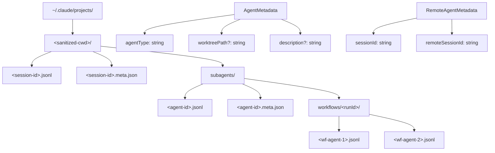

# 14 - 会话持久化与恢复

## 概述

Claude Code 的会话持久化系统基于 JSONL 格式的副本文件，实现了完整的会话状态保存与恢复机制。系统使用 UUID 链式消息结构、项目范围目录隔离、子 Agent 副本独立存储，并通过单例 Project 类提供退出时刷写保证。整个架构设计支持跨项目恢复、Agent 元数据持久化和大规模会话的高效读写。

## 核心模块

`src/utils/sessionStorage.ts` 是会话持久化的主要实现文件，提供了完整的会话存储和恢复 API。

## JSONL 副本格式

### 消息链结构

会话副本采用 JSONL（JSON Lines）格式存储，每行一个 JSON 对象。消息通过 `parentUuid` 构成链式结构：

```
消息A (uuid: "aaa", parentUuid: null)
消息B (uuid: "bbb", parentUuid: "aaa")
消息C (uuid: "ccc", parentUuid: "bbb")
```

这种 UUID 链式结构允许：
- 高效追加写入（O(1) 每条消息）
- 链完整性验证
- 分叉检测（同一 parentUuid 有多个子消息）
- 恢复时按链顺序重建消息序列

### 消息类型判断

**副本消息**（`isTranscriptMessage`）：
- `user` — 用户消息
- `assistant` — 助手消息
- `attachment` — 附件消息
- `system` — 系统消息

**进度消息排除**：`progress` 类型的消息**不**参与 `parentUuid` 链，因为它们是临时 UI 状态，持久化会导致链分叉并孤立真实对话消息。

**链参与者**（`isChainParticipant`）：所有非 `progress` 类型的消息参与链。

**临时工具进度**（`isEphemeralToolProgress`）：高频进度刻度（Bash/PowerShell/MCP 每秒更新、Sleep 进度等）是纯 UI 消息，不在 API 请求中发送，工具完成后不再渲染。集合包括：
- `bash_progress`
- `powershell_progress`
- `mcp_progress`
- `sleep_progress`（PROACTIVE/KAIROS 模式）

## 目录结构

### 项目范围目录

```
~/.claude/projects/
└── <sanitized-cwd>/
    ├── <session-id>.jsonl          # 主会话副本
    ├── <session-id>.meta.json      # 会话元数据
    └── subagents/
        ├── <agent-id>.jsonl        # 子Agent副本
        ├── <agent-id>.meta.json    # 子Agent元数据
        └── workflows/<runId>/      # 工作流子Agent分组
            ├── <agent-id-1>.jsonl
            └── <agent-id-2>.jsonl
```

**项目目录解析**：
- `getProjectsDir()` 返回 `~/.claude/projects`
- `sanitizePath(cwd)` 对工作目录进行路径清理，生成目录名
- `getOriginalCwd()` 在每次调用时获取（而非模块加载时捕获），避免 symlink 解析差异

**会话副本路径**：
- `getTranscriptPath()` / `getTranscriptPathForSession(sessionId)` 返回 `.jsonl` 文件路径
- `getAgentTranscriptPath(agentId)` 返回 `subagents/` 子目录下的副本路径



## Agent 元数据

### 侧文件存储

Agent 元数据存储在与副本文件同目录的 `.meta.json` 侧文件中：

**AgentMetadata**（`writeAgentMetadata` / `readAgentMetadata`）：
- `agentType` — Agent 类型名称（用于恢复时路由）
- `worktreePath` — Worktree 隔离路径（恢复时需要正确设置 cwd）
- `description` — 任务描述（恢复通知显示）

**RemoteAgentMetadata**（CCR 会话恢复）：
- `sessionId` — 本地会话 ID
- `remoteSessionId` — CCR 远程会话 ID

元数据写入是 fire-and-forget 操作，持久化失败不阻塞 Agent 运行。

## 读写限制

### 大文件保护

- `MAX_TRANSCRIPT_READ_BYTES = 50MB` — 防止 OOM，限制副本文件读取大小
- `MAX_TOMBSTONE_REWRITE_BYTES = 50MB` — 限制墓碑重写操作的文件大小（墓碑操作需要读取并重写整个会话文件，超大文件可能导致内存问题）

### 高效读取策略

- `readHeadAndTail()` — 读取文件头部和尾部，用于会话列表显示
- `readFileTailSync()` — 同步读取文件尾部，用于快速获取最近消息
- `readTranscriptForLoad()` — 完整读取用于会话恢复
- `SKIP_PRECOMPACT_THRESHOLD` — 跳过预压缩消息的阈值

### 轻量元数据提取

- `extractJsonStringField()` — 从 JSONL 文件中提取指定 JSON 字段
- `extractLastJsonStringField()` — 提取最后一个包含指定字段的行
- `LITE_READ_BUF_SIZE` — 轻量读取缓冲区大小

## 子 Agent 副本隔离

### 副本子目录管理

- `setAgentTranscriptSubdir(agentId, subdir)` — 设置子 Agent 的副本子目录（如 `workflows/<runId>`）
- `clearAgentTranscriptSubdir(agentId)` — Agent 结束时释放映射
- `getAgentTranscriptSubdir()` — 返回当前子目录映射

子目录机制允许将相关的工作流子 Agent 副本分组存储，便于管理和清理。

### 副本记录

- `recordSidechainTranscript(messages, agentId, parentUuid?)` — 记录子 Agent 的消息到其副本文件
- 每条消息使用正确的 `parentUuid` 维护链完整性
- 进度消息不记录到副本

## 单例 Project 类

### Project 类设计

`Project` 类是会话持久化的单例管理器，提供：

- **项目目录初始化**：创建 `.claude/projects/<sanitized-cwd>/` 目录结构
- **清理注册**（`registerCleanup`）：注册退出时执行的清理函数，确保刷写完成
- **会话切换**：支持在不同项目间切换会话

### 退出时刷写

通过 `registerCleanup()` 注册的清理函数在进程退出时执行，确保：
- 所有待写入的消息被刷写到磁盘
- Agent 元数据正确持久化
- 会话名称和标签被保存

## 会话恢复流程

### 恢复步骤

1. **定位会话文件**：根据 `--resume` 参数或会话 ID 找到 `.jsonl` 文件
2. **读取副本**：使用 `readTranscriptForLoad()` 读取完整的 JSONL 副本
3. **解析消息链**：按 `parentUuid` 重建消息序列
4. **过滤无效消息**：移除孤立进度消息、不完整工具调用等
5. **恢复状态**：重建文件状态缓存、工具结果存储等
6. **继续对话**：将恢复的消息作为上下文继续新对话

### 跨项目恢复

会话通过 `sanitizePath(cwd)` 确定的目录路径存储，当在不同工作目录恢复同一会话时：
- 如果原始工作目录的路径不同，会话文件位于原始项目的目录下
- 恢复时需要定位到正确的项目目录
- `getOriginalCwd()` 的延迟求值避免了 symlink 解析差异

### 子 Agent 恢复

子 Agent 的恢复通过 `resumeAgent.ts` 实现：
1. 读取子 Agent 的副本和元数据
2. 检查 worktree 路径是否仍然存在
3. 根据 `meta.agentType` 查找原始 Agent 定义
4. 重建系统提示和工具池
5. 作为后台任务继续运行

## 遗留进度条目处理

`isLegacyProgressEntry()` 处理 PR #24099 之前的旧格式进度条目。这些条目包含 `uuid` 和 `parentUuid` 字段，`loadTranscriptFile` 在链重建时桥接这些条目，确保旧格式副本仍然可以正确恢复。

## 关键设计决策

1. **JSONL 格式**：每行一个 JSON 对象，支持高效追加写入和流式读取，无需解析整个文件
2. **UUID 链式结构**：通过 `parentUuid` 构建消息链，支持完整性验证和分叉检测
3. **子目录隔离**：子 Agent 副本存储在 `subagents/` 子目录下，与主会话副本分离
4. **Fire-and-forget 写入**：元数据和副本写入不阻塞主流程，失败仅记录日志
5. **大文件保护**：50MB 的读写限制防止超大副本文件导致内存问题
6. **延迟路径解析**：`getOriginalCwd()` 在每次调用时获取，避免模块加载时的 symlink 解析差异
7. **清理注册模式**：通过 `registerCleanup()` 确保进程退出时完成必要的刷写操作
8. **进度消息排除**：高频进度消息不参与 `parentUuid` 链，防止链分叉和孤立消息
