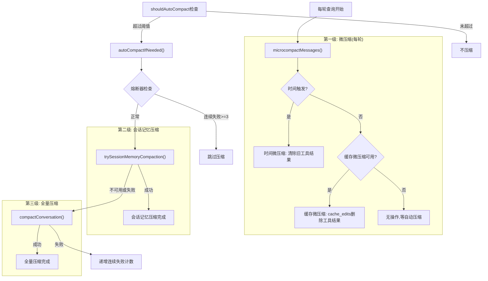

# 15 - 对话压缩机制

## 概述

Claude Code 的对话压缩系统是一套多层级上下文管理基础设施，在对话超出上下文窗口限制前自动压缩历史消息。系统采用三级策略：缓存微压缩（cache-editing API 删除工具结果而不使缓存前缀失效）、会话记忆压缩（使用 SessionMemory 摘要修剪旧消息）、全量压缩（通过 Fork Agent 流式生成摘要）。每级策略有明确的触发条件和回退逻辑，配合熔断器防止无限重试。

## 目录结构

```
src/services/compact/
├── compact.ts              # 核心压缩逻辑
├── prompt.ts               # 压缩提示模板
├── grouping.ts             # API轮次分组
├── autoCompact.ts          # 自动压缩触发与策略选择
├── microCompact.ts         # 微压缩（时间触发 + 缓存编辑）
├── apiMicrocompact.ts      # API层缓存编辑
├── cachedMicrocompact.js   # 缓存微压缩状态管理
├── sessionMemoryCompact.ts # 会话记忆压缩
├── postCompactCleanup.ts   # 压缩后清理
├── compactWarningState.ts  # 压缩警告抑制
├── compactWarningHook.ts   # 压缩警告钩子
└── timeBasedMCConfig.ts    # 时间触发配置
```

## 核心压缩流程

### compact.ts — 全量压缩

`src/services/compact/compact.ts` 实现了两种压缩模式：

#### compactConversation — 全量压缩

将所有历史消息压缩为一条摘要，适用于对话上下文完全超出限制的情况。

**执行流程**：

1. **PreCompact 钩子**：执行 `executePreCompactHooks()`，支持自定义指令注入
2. **图像剥离**：`stripImagesFromMessages()` 将用户消息中的图像替换为 `[image]`/`[document]` 标记，防止压缩 API 调用自身触发 prompt-too-long
3. **重新注入附件剥离**：`stripReinjectedAttachments()` 移除 `skill_discovery`/`skill_listing` 等压缩后会重新注入的附件类型
4. **流式摘要生成**：`streamCompactSummary()` 通过 Fork Agent（缓存共享路径）或独立流式请求生成摘要
5. **Prompt-Too-Long 重试**：如果压缩请求本身超出上下文，`truncateHeadForPTLRetry()` 删除最老的 API 轮次组并重试（最多 3 次）
6. **压缩后附件生成**：并行生成文件附件、异步 Agent 附件、Plan 附件、Skill 附件、工具/Agent/MCP 增量附件
7. **SessionStart 钩子**：压缩成功后执行 `processSessionStartHooks()`
8. **PostCompact 钩子**：执行 `executePostCompactHooks()`

**摘要后附件**：
- `createPostCompactFileAttachments()`：恢复最近访问的最多 5 个文件，受 50K token 总预算和 5K token 单文件限制
- `createAsyncAgentAttachmentsIfNeeded()`：注入后台 Agent 状态
- `createPlanAttachmentIfNeeded()`：保留 Plan 文件
- `createSkillAttachmentIfNeeded()`：保留已调用 Skill 内容（25K 总预算，5K 单 Skill 限制）
- 工具/Agent/MCP 增量附件：重新声明压缩中丢失的延迟加载工具

#### partialCompactConversation — 部分压缩

只压缩选定点之前或之后的消息，保留另一侧的完整上下文。

**两种方向**：
- `from`：压缩选定点之后的消息，保留之前的上下文（提示缓存保留）
- `up_to`：压缩选定点之前的消息，保留之后的消息（提示缓存失效）

**up_to 方向额外处理**：移除保留部分中的旧压缩边界和摘要，防止向后扫描找到过时边界而丢弃新摘要。

### prompt.ts — 压缩提示模板

`src/services/compact/prompt.ts` 定义了压缩提示的结构：

**NO_TOOLS_PREAMBLE**：强化的无工具前导指令，防止 Sonnet 4.6+ 自适应思考模型在 `maxTurns: 1` 下尝试工具调用（4.6 版本 2.79% 失败率 vs 4.5 的 0.01%）。

**9 段摘要结构**：
1. Primary Request and Intent — 用户的主要请求
2. Key Technical Concepts — 关键技术概念
3. Files and Code Sections — 文件和代码段
4. Errors and fixes — 错误和修复
5. Problem Solving — 问题解决
6. All user messages — 所有用户消息
7. Pending Tasks — 待办任务
8. Current Work / Work Completed — 当前/完成的工作
9. Optional Next Step / Context for Continuing Work — 下一步/继续工作的上下文

**摘要格式化**（`formatCompactSummary`）：剥离 `<analysis>` 草稿区，将 `<summary>` XML 标签替换为可读的章节标题。

**用户摘要消息**（`getCompactUserSummaryMessage`）：在摘要前添加说明文字，可选包含副本路径、保留消息提示和无追问继续指令。

### grouping.ts — API 轮次分组

`src/services/compact/grouping.ts` 的 `groupMessagesByApiRound()` 按照助手消息 ID 边界将消息分组：

- 每个 API 往返（一次助手响应 = 一次 API 调用）形成一个组
- 边界在新的助手响应开始时触发（不同的 `message.id`）
- 替代了之前的人类轮次分组，使反应式压缩可在单提示 Agent 会话上操作

## 三级压缩策略



## 第一级：微压缩

### microCompact.ts — 微压缩实现

`src/services/compact/microCompact.ts` 提供了两条微压缩路径：

#### 时间触发微压缩

当距离最后一次主循环助手消息的时间间隔超过配置阈值时触发。

**触发条件**（`evaluateTimeBasedTrigger`）：
- `timeBasedMCConfig.enabled` 为 true
- `querySource` 是主线程来源
- 最后一条助手消息距今超过 `gapThresholdMinutes`

**操作**：
1. 收集所有可压缩工具的 `tool_use` ID
2. 保留最近 N 个（`keepRecent`），其余加入清除集
3. 将清除集中的工具结果替换为 `[Old tool result content cleared]`
4. 重置缓存微压缩状态（因为服务器缓存已失效）
5. 通知缓存断点检测

**可压缩工具集合**（`COMPACTABLE_TOOLS`）：Read、Bash/PowerShell、Grep、Glob、WebSearch、WebFetch、Edit、Write。

#### 缓存微压缩

使用 Anthropic 的 cache-editing API 删除工具结果而不使缓存的提示前缀失效。

**核心机制**：
1. 注册工具结果到全局状态（`registerToolResult`）
2. 按用户消息分组注册（`registerToolMessage`）
3. 计算需要删除的工具结果（`getToolResultsToDelete`）
4. 创建 `cache_edits` 块（`createCacheEditsBlock`）
5. 在 API 层插入 `cache_reference` 和 `cache_edits`

**与时间微压缩的区别**：
- 不修改本地消息内容（编辑在 API 层添加）
- 使用基于计数的触发/保留阈值
- 不持久化到磁盘
- 仅主线程可用（Fork Agent 不使用）

**待处理缓存编辑**：`consumePendingCacheEdits()` 返回待插入的编辑块，`pinCacheEdits()` 将编辑块固定到特定用户消息位置，`getPinnedCacheEdits()` 返回需要重新发送的已固定编辑。

## 第二级：会话记忆压缩

### sessionMemoryCompact.ts — SM 压缩

`src/services/compact/sessionMemoryCompact.ts` 使用 SessionMemory 作为摘要来修剪旧消息，避免调用压缩 API。

**启用条件**（`shouldUseSessionMemoryCompaction`）：
- `tengu_session_memory` feature flag 为 true
- `tengu_sm_compact` feature flag 为 true
- 可通过 `ENABLE_CLAUDE_CODE_SM_COMPACT` / `DISABLE_CLAUDE_CODE_SM_COMPACT` 环境变量覆盖

**配置**（`SessionMemoryCompactConfig`）：
- `minTokens: 10,000` — 压缩后保留的最小 token 数
- `minTextBlockMessages: 5` — 保留的最少文本块消息数
- `maxTokens: 40,000` — 保留的最大 token 数（硬上限）

**执行流程**：

1. 等待进行中的 SessionMemory 提取完成
2. 获取 `lastSummarizedMessageId`（最后已摘要消息 ID）
3. 从 `lastSummarizedMessageId` 之后开始计算保留索引
4. 向后扩展直到满足 `minTokens` 和 `minTextBlockMessages` 最低要求
5. 不超过 `maxTokens` 硬上限
6. 在最后一个压缩边界处停止扩展
7. 调用 `adjustIndexToPreserveAPIInvariants()` 确保 tool_use/tool_result 对不被拆分

**API 不变量保护**（`adjustIndexToPreserveAPIInvariants`）：

步骤 1：处理 tool_use/tool_result 对
- 收集保留范围内所有 tool_result ID
- 查找匹配的 tool_use 块所在的助手消息
- 如果 tool_use 不在保留范围内，扩展索引以包含它

步骤 2：处理共享 message.id 的思考块
- 收集保留范围内所有助手消息的 message.id
- 向后查找具有相同 message.id 但不在保留范围内的助手消息
- 包含这些消息以确保思考块可以被正确合并

**阈值检查**：如果压缩后 token 数仍超过 `autoCompactThreshold`，则放弃 SM 压缩，回退到全量压缩。

## 第三级：全量压缩

### autoCompact.ts — 自动压缩触发

`src/services/compact/autoCompact.ts` 管理自动压缩的触发和策略选择。

**阈值计算**（`getAutoCompactThreshold`）：
```
有效上下文窗口 = getContextWindowForModel() - MAX_OUTPUT_TOKENS_FOR_SUMMARY(20000)
自动压缩阈值 = 有效上下文窗口 - AUTOCOMPACT_BUFFER_TOKENS(13000)
```

**压缩前检查**（`shouldAutoCompact`）：
- 递归防护：`session_memory` 和 `compact` 查询源跳过
- 上下文坍塌模式：如果启用则跳过（坍塌系统自己管理上下文）
- 反应式压缩模式：如果 `tengu_cobalt_raccoon` 启用则跳过主动压缩
- 禁用检查：`DISABLE_COMPACT` / `DISABLE_AUTO_COMPACT` 环境变量或用户设置

**策略选择**（`autoCompactIfNeeded`）：
1. 熔断器检查：连续失败 >= 3 则跳过
2. 尝试 SM 压缩（`trySessionMemoryCompaction`）
3. SM 成功则返回，失败则回退到全量压缩
4. 全量压缩成功则重置连续失败计数
5. 全量压缩失败则递增连续失败计数

**熔断器**（`MAX_CONSECUTIVE_AUTOCOMPACT_FAILURES = 3`）：防止上下文不可恢复地超出限制时会话在每个轮次尝试无效压缩（BQ 2026-03-10 观测到 1,279 个会话有 50+ 连续失败，浪费约 250K API 调用/天）。

**Token 状态判断**（`calculateTokenWarningState`）：
- `isAboveWarningThreshold`：token 使用 >= 阈值 - 20,000
- `isAboveErrorThreshold`：token 使用 >= 阈值 - 20,000
- `isAboveAutoCompactThreshold`：token 使用 >= 阈值 - 13,000
- `isAtBlockingLimit`：token 使用 >= 有效窗口 - 3,000

## 压缩提示缓存共享

`streamCompactSummary()` 支持两种摘要生成路径：

**Fork Agent 路径**（首选）：
- 使用 `runForkedAgent()` 复用主对话的缓存前缀
- 不设置 `maxOutputTokens`，避免通过 `budget_tokens` 的 `Math.min` 创建思考配置不匹配
- 如果 Fork 路径失败或无文本响应，回退到流式路径

**流式路径**（回退）：
- 使用 `queryModelWithStreaming()` 独立发送压缩请求
- 设置 `maxOutputTokensOverride` 限制输出
- 支持重试（`tengu_compact_streaming_retry` feature flag，最多 2 次）

## 压缩后处理

### 压缩后附件恢复

压缩清除了所有文件状态缓存，因此需要恢复关键上下文：

1. **文件附件**：重新读取最近访问的文件（受预算限制，去重保留尾部的读取结果）
2. **Plan 附件**：保留当前 Plan 文件内容
3. **Skill 附件**：保留已调用 Skill 的内容（截断到 5K token/Skill）
4. **工具/Agent/MCP 增量**：重新声明压缩中丢失的延迟加载工具、Agent 列表和 MCP 指令
5. **异步 Agent 状态**：注入后台 Agent 的当前状态

### 压缩后清理

- `runPostCompactCleanup()`：清理压缩后的临时状态
- 通知缓存断点检测（`notifyCompaction`）
- 重置 `markPostCompaction()` 标记
- 重新追加会话元数据（防止被压缩后消息推出 16KB 尾部窗口）

## 压缩边界标记

每个压缩操作都会创建一个 `SystemCompactBoundaryMessage`，记录：
- 触发类型（`auto` 或 `manual`）
- 压缩前 token 数
- 前一条消息的 UUID
- 保留段信息（`preservedSegment`：headUuid、anchorUuid、tailUuid）
- 预压缩发现的工具列表

保留段元数据用于加载器修补链，确保磁盘上的 `parentUuid` 链正确连接压缩边界和保留的消息。

## 关键设计决策

1. **三级策略递进**：从最轻量的微压缩到最昂贵的全量压缩，优先选择成本最低的策略
2. **缓存感知设计**：Fork Agent 路径复用主对话的缓存前缀，缓存微压缩通过 cache-editing API 保持缓存有效性
3. **熔断器保护**：3 次连续失败后停止尝试，避免无限重试浪费 API 资源
4. **API 不变量保护**：`adjustIndexToPreserveAPIInvariants()` 确保 tool_use/tool_result 对和共享 message.id 的思考块不被压缩边界拆分
5. **Prompt-Too-Long 重试**：压缩请求本身超出上下文时，按 API 轮次组删除最老的消息并重试，作为用户卡住时的最后逃生舱
6. **时间触发微压缩**：当服务器缓存确定已过期时，直接修改消息内容清除旧工具结果，因为缓存编辑假设热缓存已不成立
7. **压缩后附件恢复**：通过重新读取文件和重新注入工具/Agent/MCP 增量，最小化压缩对模型上下文的影响
8. **SessionMemory 优先**：SM 压缩不需要 API 调用，成本远低于全量压缩，因此优先尝试
