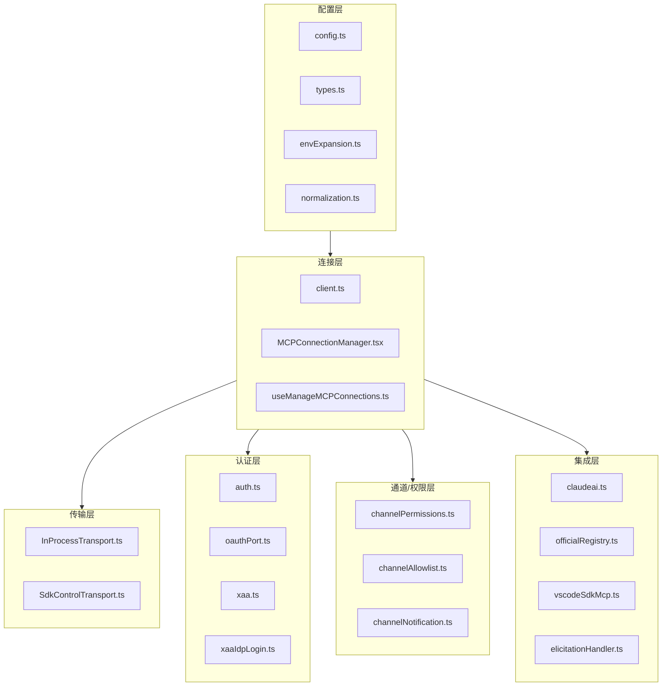
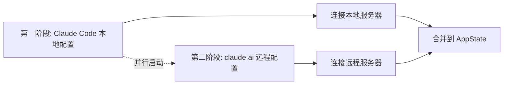
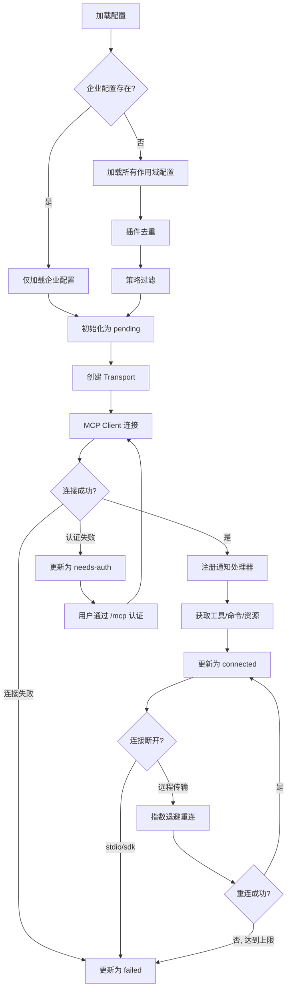

# MCP(Model Context Protocol)集成系统

## 概述

MCP(Model Context Protocol)集成系统是 Claude Code 与外部工具服务器通信的核心基础设施。该系统实现了完整的 MCP 协议栈，覆盖配置加载、连接管理、传输层、认证、权限控制、通道消息等关键功能。整个系统位于 `src/services/mcp/` 目录下，包含约 20 个模块，构成了一个分层架构。

## 架构分层



## 一、配置层

### 1.1 类型系统 (`types.ts`)

MCP 配置的核心类型定义位于 `src/services/mcp/types.ts`，定义了完整的配置作用域和传输类型体系。

**配置作用域(ConfigScope)**：定义了 MCP 服务器配置的来源层级，优先级从高到低：

| 作用域 | 说明 | 可写 |
|--------|------|------|
| `enterprise` | 企业管理配置，独占控制 | 否 |
| `local` | 项目本地配置(.claude/settings.local.json) | 是 |
| `project` | 项目配置(.mcp.json) | 是 |
| `user` | 用户全局配置 | 是 |
| `dynamic` | 插件动态注入 | 否 |
| `claudeai` | Claude.ai 连接器 | 否 |
| `managed` | 托管配置 | 否 |

**传输类型(Transport)**：支持多种传输协议，覆盖本地和远程场景：

- **stdio**：本地子进程通信，通过 `StdioClientTransport` 启动子进程并经 stdin/stdout 交换 JSON-RPC 消息
- **sse**：Server-Sent Events 远程连接，支持 OAuth 认证和自定义请求头
- **sse-ide**：IDE 扩展专用 SSE 传输，内部类型
- **http**：HTTP Streamable 传输(RFC 标准草案)，支持 OAuth 和请求头
- **ws**：WebSocket 传输，支持 TLS 和代理
- **ws-ide**：IDE 扩展专用 WebSocket 传输，带认证令牌
- **sdk**：SDK 进程内传输，通过控制消息桥接
- **claudeai-proxy**：Claude.ai 代理传输，经 CCR/session-ingress 代理路由

**连接状态类型**：

```typescript
type MCPServerConnection =
  | ConnectedMCPServer    // 已连接，含 Client、能力、工具等
  | FailedMCPServer       // 连接失败，含错误信息
  | NeedsAuthMCPServer    // 需要认证
  | PendingMCPServer      // 等待连接/重连中
  | DisabledMCPServer     // 已禁用
```

### 1.2 配置加载与策略 (`config.ts`)

配置加载是 MCP 系统的入口，核心函数 `getClaudeCodeMcpConfigs` 实现了**两阶段配置加载**和**内容签名去重**。

**两阶段配置加载**：第一阶段快速加载 Claude Code 本地配置(纯文件读取，无网络调用)；第二阶段异步加载 claude.ai 远程连接器配置(可能较慢)。两阶段并行执行，第二阶段不阻塞第一阶段的服务器连接。



**企业策略优先级**：当企业 MCP 配置存在时(`doesEnterpriseMcpConfigExist`)，系统进入独占模式——仅加载企业配置中的服务器，忽略所有其他作用域的配置。这是企业客户控制 MCP 使用的核心机制。

**内容签名去重**：通过 `getMcpServerSignature` 计算配置的内容签名：

- stdio 服务器：`stdio:["command","arg1","arg2"]` 形式
- 远程服务器：`url:<原始URL>` 形式，对 CCR 代理 URL 会自动解包 `mcp_url` 查询参数

`dedupPluginMcpServers` 和 `dedupClaudeAiMcpServers` 使用签名去重：手动配置优先于插件配置，插件配置优先于 claude.ai 连接器。这避免了同一底层服务器被多次启动(浪费 ~600 字符/轮的 token)。

**策略过滤**：`filterMcpServersByPolicy` 实现三层策略控制：

1. **黑名单(deniedMcpServers)**：绝对优先，支持按名称、命令数组、URL 通配符(含 `*` 模式)匹配
2. **白名单(allowedMcpServers)**：空数组表示阻止所有服务器；非空时，stdio 服务器必须匹配命令条目，远程服务器必须匹配 URL 模式
3. **仅托管模式(allowManagedMcpServersOnly)**：白名单仅从策略设置读取，用户仍可通过黑名单自行拒绝服务器

**配置增删操作**：

- `addMcpConfig`：添加服务器配置，验证名称格式(仅字母数字连线下划线)、检查保留名(`claude-in-chrome`)、企业独占模式拦截、策略合规性检查、作用域内唯一性验证
- `removeMcpConfig`：删除服务器配置，按作用域操作对应配置文件
- 写入 `.mcp.json` 使用原子重命名(temp file + datasync + rename)确保数据完整性

## 二、连接层

### 2.1 客户端连接 (`client.ts`)

`src/services/mcp/client.ts` 是 MCP 连接的核心模块，实现了服务器连接、工具发现、资源获取等关键功能。

**连接流程**：

1. 根据传输类型创建对应的 Transport 实例
2. 创建 MCP Client 并连接
3. 发现服务器能力(capabilities)
4. 获取工具列表、命令列表、资源列表
5. 为每个工具创建 `MCPTool` 包装器
6. 注册通知处理器(tools/prompts/resources 的 list_changed)

**关键设计决策**：

- **工具描述截断**：MCP 工具描述上限 2048 字符(`MAX_MCP_DESCRIPTION_LENGTH`)，防止 OpenAPI 生成的服务器注入 15-60KB 的端点文档
- **工具调用超时**：默认超时 ~27.8 小时(100M 毫秒)，可通过 `MCP_TOOL_TIMEOUT` 环境变量覆盖
- **认证缓存**：`needs-auth` 状态缓存 15 分钟(`MCP_AUTH_CACHE_TTL_MS`)，避免反复弹出认证提示
- **会话过期检测**：HTTP 404 + JSON-RPC code -32001 判定为会话过期，触发重新连接

**McpAuthError 与认证状态流转**：工具调用返回 401 时抛出 `McpAuthError`，连接层捕获后将服务器状态更新为 `needs-auth`，用户通过 `/mcp` 菜单重新认证。

### 2.2 连接管理器 (`MCPConnectionManager.tsx` + `useManageMCPConnections.ts`)

React 上下文封装层，提供 `useMcpReconnect` 和 `useMcpToggleEnabled` 两个 Hook。

**useManageMCPConnections** 是核心 Hook，管理完整的 MCP 生命周期：

**批量状态更新**：使用 16ms 时间窗口(`MCP_BATCH_FLUSH_MS`)合并多个服务器状态变更，通过 `setTimeout` 延迟刷新，减少 React 重渲染次数。当多个服务器在短时间内同时连接/断开时，这些更新会合并为一次 `setAppState` 调用。

**指数退避重连**：远程传输(sse/http/ws)断开后自动触发重连：

```typescript
const MAX_RECONNECT_ATTEMPTS = 5
const INITIAL_BACKOFF_MS = 1000    // 1s, 2s, 4s, 8s, 16s
const MAX_BACKOFF_MS = 30000       // 上限 30s
```

重连期间服务器状态设为 `pending`(含 `reconnectAttempt` 和 `maxReconnectAttempts`)，UI 可显示进度。禁用的服务器不会触发重连。

**stale 服务器清理**：插件重载时，已移除的插件服务器或配置变更的服务器会被标记为 stale，清理时取消重连定时器、断开连接、从状态中移除。

### 2.3 MCP 连接生命周期



## 三、传输层

### 3.1 进程内传输 (`InProcessTransport.ts`)

`src/services/mcp/InProcessTransport.ts` 实现了同一进程内的 MCP 服务器/客户端通信，无需启动子进程。通过 `createLinkedTransportPair` 创建一对关联传输，`send()` 通过 `queueMicrotask` 异步投递到对端的 `onmessage`，避免同步请求/响应循环的栈深度问题。`close()` 会同时关闭两端。

### 3.2 SDK 控制传输 (`SdkControlTransport.ts`)

`src/services/mcp/SdkControlTransport.ts` 桥接 CLI 进程和 SDK 进程的 MCP 通信：

- **SdkControlClientTransport**(CLI 端)：将 JSON-RPC 消息包装为控制请求(含 `server_name` 和 `request_id`)，通过 stdout 发送给 SDK 进程
- **SdkControlServerTransport**(SDK 端)：接收控制请求并转发给实际 MCP 服务器，响应通过回调返回

## 四、认证层

### 4.1 OAuth 认证 (`auth.ts` + `oauthPort.ts`)

`src/services/mcp/auth.ts` 实现了完整的 OAuth 2.0 授权码+PKCE 流程，核心类 `ClaudeAuthProvider` 实现了 `OAuthClientProvider` 接口。

**认证发现**：优先使用配置的 `authServerMetadataUrl`，否则按 RFC 9728(受保护资源元数据) -> RFC 8414(Authorization Server 元数据) 顺序发现。路径感知回退兼容旧服务器。

**Token 生命周期管理**：

- **主动刷新**：Token 过期前 5 分钟内自动刷新，避免请求失败再刷新的延迟
- **Step-up 认证**：检测 403 `insufficient_scope` 响应，标记 step-up 待定状态，省略 refresh_token 强制走 PKCE 流程(RFC 6749 Section 6 禁止通过刷新提升权限范围)
- **跨进程锁**：Token 刷新使用 lockfile 防止多进程竞态，最多重试 5 次获取锁
- **安全凭证存储**：使用系统 Keychain(macOS)或加密文件存储 OAuth 令牌，通过 `getServerKey`(名称+配置哈希)索引

**Token 撤销**：按 RFC 7009 先撤销 refresh_token 再撤销 access_token，支持 `client_secret_basic` 和 `client_secret_post` 两种认证方式。

### 4.2 跨应用访问 XAA (`xaa.ts` + `xaaIdpLogin.ts`)

XAA(Cross-App Access)允许通过一次 IdP 登录复用到所有 XAA 配置的 MCP 服务器：

1. 获取 IdP 的 id_token(缓存在 Keychain 中，过期才重新弹出浏览器)
2. 执行 RFC 8693 + RFC 7523 令牌交换(无需浏览器)
3. 保存令牌到与普通 OAuth 相同的 Keychain 槽位

XAA 不走标准同意流程——设置 `oauth.xaa` 后仅走 XAA 路径，确保不会意外降级到低信任度的同意流程。

### 4.3 Elicitation 交互 (`elicitationHandler.ts`)

Elicitation 允许 MCP 服务器向用户请求输入(表单或 URL 确认)。当服务器发送 `elicitation/request` 时，处理器将其入队到 `AppState.elicitation.queue`，UI 组件显示后用户响应通过 `respond` 回调返回。支持两种模式：表单模式和 URL 模式(带等待状态和完成通知)。

## 五、通道/权限层

### 5.1 通道权限 (`channelPermissions.ts`)

通道权限系统允许通过 Telegram、iMessage、Discord 等渠道中继权限提示。核心设计：

**短请求 ID**：`shortRequestId` 使用 FNV-1a 哈希 + 25 字符字母表(a-z 减 'l')编码为 5 字母 ID。约 9.8M 空间，50% 生日碰撞需要约 3000 个同时挂起的提示。字母专用避免手机用户切换键盘模式。

**亵渎词过滤**：5 个随机字母可能拼出不雅词汇。内置约 25 个子串黑名单，命中时加盐重哈希，最多重试 10 次(命中率约 1/700，(1/700)^10 可忽略)。

**权限回调**：`createChannelPermissionCallbacks` 创建回调对象，`onResponse` 注册解析器，`resolve` 从结构化通道事件(非文本正则匹配)解析用户回复。回调的 `pending` Map 闭包内持有，不放入 AppState(函数不可序列化)。

### 5.2 通道通知 (`channelNotification.ts`)

服务器推送消息通过 `notifications/claude/channel` 事件入队到消息队列管理器。`gateChannelServer` 决定是否注册处理器——需要同时满足：连接状态、通道白名单、声明 `claude/channel` 能力。

## 六、集成层

### 6.1 Claude.ai 连接器 (`claudeai.ts`)

`fetchClaudeAIMcpConfigsIfEligible` 从 Claude.ai 获取用户启用的 MCP 连接器配置。结果带 `claudeai` 作用域，通过 `dedupClaudeAiMcpServers` 与手动配置去重。缓存机制避免重复网络请求。

### 6.2 官方注册表 (`officialRegistry.ts`)

维护 Anthropic 官方 MCP 服务器的注册信息，用于验证和元数据补充。

### 6.3 VSCode SDK MCP (`vscodeSdkMcp.ts`)

桥接 VSCode 扩展的 MCP 服务器，通过 SDK 控制传输实现进程间通信。

## 七、MCPTool 包装器

`MCPTool` 是所有 MCP 工具调用的统一包装器，处理：

- 工具名称标准化(添加 `mcp__<server>__` 前缀)
- 输入验证和内容大小估算
- 二进制内容持久化和图片处理
- 输出截断(防止超长响应耗尽上下文)
- 进度回调转发

## 关键设计模式

1. **两阶段配置加载**：快速本地配置 + 异步远程配置，最大化启动速度
2. **内容签名去重**：基于命令数组/URL 的签名匹配，避免同一服务器重复启动
3. **批量状态更新**：16ms 窗口合并多个 MCP 状态变更，减少 React 重渲染
4. **指数退避重连**：远程传输断开后自动重连，1s-30s 指数退避，最多 5 次
5. **企业策略优先**：企业配置存在时独占控制，阻止用户添加自有服务器
6. **XAA 一次登录**：跨应用访问允许 IdP 登录复用到所有 XAA 服务器
7. **原子配置写入**：temp file + datasync + rename 确保 .mcp.json 写入完整性
