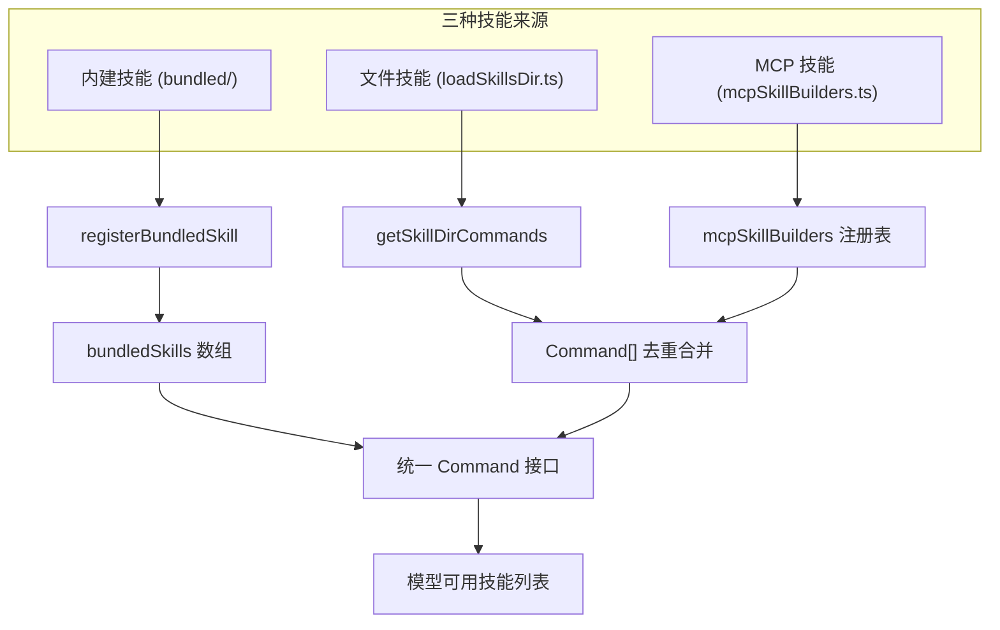
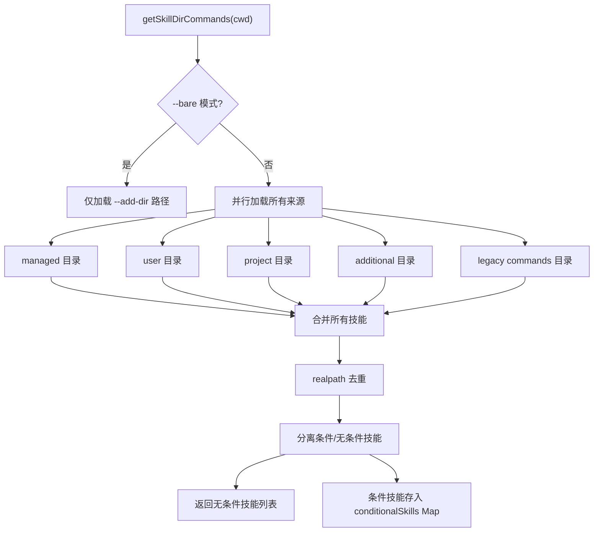
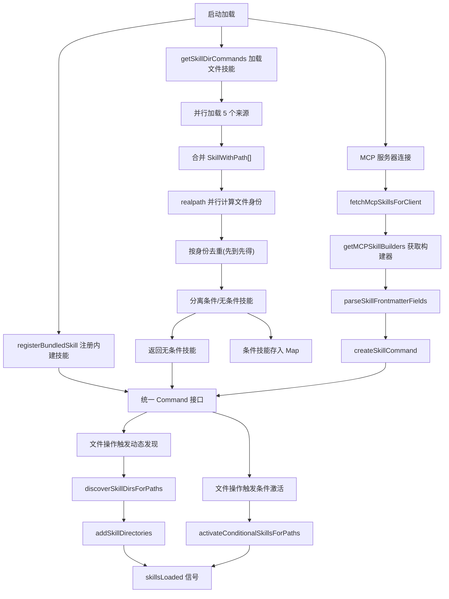

# Skills技能系统

## 概述

Skills技能系统是 Claude Code 的可扩展命令框架，允许用户和系统定义可复用的提示模板。技能通过 YAML frontmatter 定义元数据，支持三种来源：内建技能(bundled)、文件技能(file-based)和 MCP 技能。系统位于 `src/skills/` 目录，实现了从发现、加载、去重到条件激活的完整生命周期管理。

## 技能来源体系



## 一、内建技能 (Bundled Skills)

### 1.1 定义与注册

内建技能编译到 CLI 二进制中，所有用户可用。定义类型 `BundledSkillDefinition` 位于 `src/skills/bundledSkills.ts`：

```typescript
type BundledSkillDefinition = {
  name: string
  description: string
  aliases?: string[]
  whenToUse?: string
  argumentHint?: string
  allowedTools?: string[]
  model?: string
  disableModelInvocation?: boolean
  userInvocable?: boolean
  isEnabled?: () => boolean
  hooks?: HooksSettings
  context?: 'inline' | 'fork'
  agent?: string
  files?: Record<string, string>      // 参考文件(延迟提取)
  getPromptForCommand: (args, ctx) => Promise<ContentBlockParam[]>
}
```

通过 `registerBundledSkill` 在模块初始化时注册到 `bundledSkills` 数组，`getBundledSkills` 返回副本防止外部修改。

### 1.2 内建技能列表

位于 `src/skills/bundled/` 目录的内建技能包括：

| 技能名 | 文件 | 功能描述 |
|--------|------|----------|
| updateConfig | updateConfig.ts | 配置设置管理 |
| keybindings | keybindings.ts | 键盘快捷键自定义 |
| verify | verify.ts | 代码验证审查 |
| debug | debug.ts | 调试辅助 |
| simplify | simplify.ts | 代码简化优化 |
| remember | remember.ts | 记忆管理 |
| batch | batch.ts | 批量操作 |
| stuck | stuck.ts | 卡住时恢复 |
| claudeApi | claudeApi.ts | Claude API 构建/调试 |
| loop | loop.ts | 定时循环执行 |
| scheduleRemoteAgents | scheduleRemoteAgents.ts | 远程代理调度 |
| dream | loremIpsum.ts | 占位内容生成 |

### 1.3 安全文件提取

内建技能的 `files` 字段支持延迟提取参考文件到磁盘。提取过程采用多层安全措施：

- **确定性目录**：提取到 `getBundledSkillsRoot()` 下的进程随机 nonce 目录
- **安全写入标志**：使用 `O_NOFOLLOW | O_EXCL | O_WRONLY | O_CREAT` 标志打开文件
  - `O_NOFOLLOW`：不跟随符号链接(仅保护最终组件)
  - `O_EXCL`：排他创建，拒绝已存在文件
  - 不使用 `unlink + retry`，因为 `unlink()` 也跟随中间符号链接
- **目录权限**：`0o700`(仅所有者访问)，文件权限 `0o600`(仅所有者读写)
- **路径遍历防护**：`resolveSkillFilePath` 验证相对路径不含 `..` 和绝对路径组件
- **闭包级记忆化**：并发调用共享同一个提取 Promise，避免竞态写入

## 二、文件技能 (File-based Skills)

### 2.1 加载流程

文件技能通过 `src/skills/loadSkillsDir.ts` 中的 `getSkillDirCommands` 加载，该函数被 `memoize` 缓存。



**加载来源**：

1. **managed 目录**：`<managedPath>/.claude/skills/`，企业策略控制
2. **user 目录**：`~/.claude/skills/`，用户全局技能
3. **project 目录**：从 cwd 向上遍历到 home 的所有 `.claude/skills/`，更靠近 cwd 的优先
4. **additional 目录**：`--add-dir` 指定的路径下的 `.claude/skills/`
5. **legacy commands 目录**：`~/.claude/commands/` 和 `.claude/commands/`，向后兼容

**技能目录格式**：仅支持 `skill-name/SKILL.md` 目录格式。在 `/skills/` 目录下，单个 `.md` 文件不被识别；在 legacy `/commands/` 目录下，同时支持 `SKILL.md` 目录格式和单个 `.md` 文件格式。

### 2.2 Frontmatter 解析

技能通过 YAML frontmatter 定义元数据，`parseSkillFrontmatterFields` 解析共享字段：

| 字段 | 类型 | 说明 |
|------|------|------|
| `description` | string | 技能描述 |
| `allowed-tools` | string[] | 允许使用的工具列表 |
| `model` | string | 指定模型(支持 `inherit`) |
| `effort` | string/number | 推理努力级别 |
| `hooks` | object | 钩子配置 |
| `paths` | string | 条件激活的文件路径模式 |
| `user-invocable` | boolean | 是否用户可调用(默认 true) |
| `context` | string | 执行上下文(`fork` 或默认 inline) |
| `agent` | string | 代理类型 |
| `argument-hint` | string | 参数提示 |
| `arguments` | string/string[] | 命名参数定义 |
| `when_to_use` | string | 使用时机说明 |
| `disable-model-invocation` | boolean | 禁止模型调用 |
| `version` | string | 技能版本 |
| `shell` | string | Shell 执行配置 |

`parseSkillPaths` 处理 `paths` frontmatter，移除 `/**` 后缀(ignore 库将路径视为匹配自身及所有内容)，全匹配所有(`**`)模式视为无条件。

### 2.3 createSkillCommand

`createSkillCommand` 将解析后的 frontmatter 数据构建为统一的 `Command` 对象：

- **内容处理**：基础目录前缀 + 参数替换(`substituteArguments`) + `${CLAUDE_SKILL_DIR}` 变量替换 + `${CLAUDE_SESSION_ID}` 变量替换
- **Shell 命令执行**：MCP 技能(loadedFrom='mcp')从不执行内联 shell 命令(`!`...`` ` ``)，安全边界
- **Shell 前缀配置**：`shell` frontmatter 支持自定义 shell 执行器

### 2.4 去重机制

使用 `realpath` 解析符号链接获取文件真实路径，以此作为去重标识：

```typescript
async function getFileIdentity(filePath: string): Promise<string | null> {
  try {
    return await realpath(filePath)  // 文件系统无关，避免 inode 不可靠
  } catch {
    return null
  }
}
```

选择 `realpath` 而非 `inode` 的原因：某些虚拟/容器/NFS 文件系统报告不可靠的 inode 值(如 inode 0)，ExFAT 精度丢失。

去重规则：第一个加载的技能胜出，后续重复被跳过并记录日志。

### 2.5 条件技能

带有 `paths` frontmatter 的技能不立即加载，而是存入 `conditionalSkills` Map。当用户操作匹配路径时通过 `activateConditionalSkillsForPaths` 激活：

- 使用 `ignore` 库进行 gitignore 风格匹配
- 相对路径匹配(相对于 cwd)
- 激活后移入 `dynamicSkills` Map，名称加入 `activatedConditionalSkillNames` 集合(会话内持久)
- 激活触发 `skillsLoaded` 信号，通知缓存失效

### 2.6 动态技能发现

`discoverSkillDirsForPaths` 从文件路径向上遍历到 cwd，发现嵌套的 `.claude/skills/` 目录：

- 已检查路径记录在 `dynamicSkillDirs` Set 中避免重复 stat
- gitignored 目录自动跳过(通过 `isPathGitignored` 检查)
- 结果按路径深度降序排列(更靠近文件的技能优先)
- `addSkillDirectories` 加载发现的目录，浅路径先处理被深路径覆盖

## 三、MCP 技能

### 3.1 写入一次注册表 (`mcpSkillBuilders.ts`)

`src/skills/mcpSkillBuilders.ts` 是依赖图的叶子节点——它只导入类型，不导入任何值模块。这打破了循环依赖：`client.ts` -> `mcpSkills.ts` -> `loadSkillsDir.ts` -> ... -> `client.ts`。

```typescript
type MCPSkillBuilders = {
  createSkillCommand: typeof createSkillCommand
  parseSkillFrontmatterFields: typeof parseSkillFrontmatterFields
}
```

注册在 `loadSkillsDir.ts` 模块初始化时完成(通过顶层副作用 `registerMCPSkillBuilders`)，远早于任何 MCP 服务器连接。`getMCPSkillBuilders` 在未注册时抛出错误，防止在模块初始化前调用。

### 3.2 为什么需要注册表

两种替代方案都被否决：

1. **字面量动态导入**：`await import('./loadSkillsDir.js')` 通过 dep-cruiser 检查，但 `loadSkillsDir` 的传递依赖几乎覆盖所有模块，单条新边会引发大量循环违规
2. **变量说明符动态导入**：`await import(variable)` 在 Bun 打包二进制中运行时失败——说明符解析为 `/$bunfs/root/...` 路径，而非原始源树

## 四、技能加载管线



## 五、策略控制

- **pluginOnly 策略**：`isRestrictedToPluginOnly('skills')` 为 true 时，仅加载 managed 和插件技能
- **--bare 模式**：跳过自动发现，仅加载 `--add-dir` 路径中的技能
- **设置源开关**：`isSettingSourceEnabled` 控制各来源是否加载
- **缓存清理**：`clearSkillCaches` 清除 memoize 缓存、条件技能和动态技能状态

## 关键设计模式

1. **Frontmatter 驱动**：YAML frontmatter 定义元数据，正文是提示模板，简洁直观
2. **条件技能延迟加载**：`paths` frontmatter 实现按需激活，减少不相关技能的 token 开销
3. **realpath 去重**：符号链接安全的文件身份识别，避免 inode 不可靠问题
4. **写入一次注册表**：`mcpSkillBuilders.ts` 作为 DAG 叶子打破循环依赖
5. **安全文件提取**：`O_NOFOLLOW | O_EXCL` + 权限位 + 路径遍历防护的多层安全
6. **MCP 技能安全边界**：远程 MCP 技能从不执行内联 shell 命令
7. **动态技能发现**：从文件路径向上遍历，自动发现嵌套技能目录
