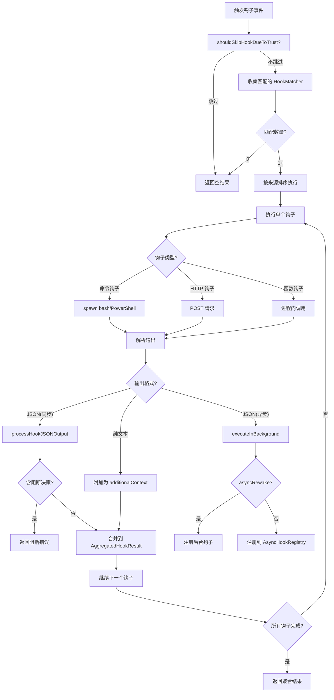

# Hook钩子系统

## 概述

Hook钩子系统是 Claude Code 的生命周期事件扩展机制，允许用户在关键节点注入自定义逻辑。系统位于 `src/utils/hooks.ts`，支持命令行钩子(bash/PowerShell)、HTTP 钩子和函数钩子三种执行后端，实现了结构化 JSON 输出协议、权限集成、异步执行模型和严格的安全控制。

## 核心类型

### HookResult

单次钩子执行的结果，包含所有可能的输出字段：

```typescript
interface HookResult {
  message?: HookResultMessage          // 用户可见消息
  systemMessage?: string               // 系统提示注入
  blockingError?: HookBlockingError    // 阻断错误(停止执行)
  outcome: 'success' | 'blocking' | 'non_blocking_error' | 'cancelled'
  preventContinuation?: boolean        // 阻止继续执行
  stopReason?: string                  // 停止原因
  permissionBehavior?: 'ask' | 'deny' | 'allow' | 'passthrough'
  hookPermissionDecisionReason?: string
  additionalContext?: string           // 附加上下文
  initialUserMessage?: string          // 初始用户消息(SessionStart)
  updatedInput?: Record<string, unknown>    // 修改后的工具输入
  updatedMCPToolOutput?: unknown            // 修改后的 MCP 工具输出
  permissionRequestResult?: PermissionRequestResult
  elicitationResponse?: ElicitationResponse
  watchPaths?: string[]                // 文件监视路径
  elicitationResultResponse?: ElicitationResponse
  retry?: boolean                      // 权限拒绝后重试
  hook: HookCommand | HookCallback | FunctionHook
}
```

### AggregatedHookResult

多个钩子结果的聚合，合并所有非冲突字段：

```typescript
type AggregatedHookResult = {
  message?: HookResultMessage
  blockingError?: HookBlockingError
  preventContinuation?: boolean
  stopReason?: string
  hookPermissionDecisionReason?: string
  hookSource?: string
  permissionBehavior?: PermissionResult['behavior']
  additionalContexts?: string[]          // 收集所有附加上下文
  initialUserMessage?: string
  updatedInput?: Record<string, unknown>
  updatedMCPToolOutput?: unknown
  permissionRequestResult?: PermissionRequestResult
  watchPaths?: string[]
  elicitationResponse?: ElicitationResponse
  elicitationResultResponse?: ElicitationResponse
  retry?: boolean
}
```

## 基础输入构建

`createBaseHookInput` 构造所有钩子事件共享的基础输入：

```typescript
function createBaseHookInput(permissionMode?, sessionId?, agentInfo?): {
  session_id: string         // 当前会话 ID
  transcript_path: string    // 会话转录文件路径
  cwd: string                // 当前工作目录
  permission_mode?: string   // 权限模式
  agent_id?: string          // 子代理 ID
  agent_type?: string        // 代理类型(子代理优先于 --agent 标志)
}
```

`agent_type` 的优先级：子代理的 `agentType`(来自 `toolUseContext`)优先于会话的 `--agent` 标志。钩子通过 `agent_id` 的存在区分子代理调用和主线程的 `--agent` 会话调用。

## 工作区信任检查

`shouldSkipHookDueToTrust` 实施严格的安全策略：**所有钩子都需要工作区信任**。

原因：钩子配置在信任对话框显示前就被捕获(`captureHooksConfigSnapshot`)。虽然大多数钩子不会在信任建立前执行，但对所有钩子强制信任检查可以防止：

- 未来代码路径意外在信任前执行钩子
- SessionEnd 钩子在用户拒绝信任时执行
- SubagentStop 钩子在子代理完成于信任前执行

例外：非交互模式(SDK)下信任是隐含的，总是执行。

## 执行后端

### 命令钩子 (Command Hooks)

通过子进程执行 bash 或 PowerShell 命令，环境变量注入包括：

- `CLAUDE_SESSION_ID`：会话 ID
- `CLAUDE_CWD`：当前工作目录
- `CLAUDE_TRANSCRIPT_PATH`：转录路径
- `CLAUDE_PERMISSION_MODE`：权限模式
- `CLAUDE_AGENT_ID`：代理 ID
- `CLAUDE_AGENT_TYPE`：代理类型
- 通过 `sessionEnvironment` 注入的额外环境变量

Windows 平台自动检测 Git Bash 路径，PowerShell 使用缓存检测的路径。

### HTTP 钩子

向配置的 URL 发送 POST 请求，请求体为 JSON 格式的钩子输入。响应必须是合法的 JSON，遵循相同的结构化输出协议。

### 函数钩子 (Function Hooks)

进程内 JavaScript 函数，直接在 Claude Code 进程中执行。通过 `getSessionFunctionHooks` 获取，绕过子进程开销。

## 结构化 JSON 输出协议

钩子输出遵循结构化 JSON 格式，由 `hookJSONOutputSchema` 验证：

```json
{
  "continue": true,
  "suppressOutput": false,
  "stopReason": "string",
  "decision": "approve | block",
  "reason": "string",
  "systemMessage": "string",
  "hookSpecificOutput": {
    "hookEventName": "PreToolUse | PostToolUse | ...",
    "permissionDecision": "allow | deny | ask",
    "permissionDecisionReason": "string",
    "updatedInput": {},
    "additionalContext": "string",
    "initialUserMessage": "string",
    "watchPaths": ["..."]
  }
}
```

**输出解析策略**：

1. 非JSON输出(不以 `{` 开头)：视为纯文本，`additionalContext` 传递给模型
2. JSON 但 schema 验证失败：视为纯文本并附带验证错误提示
3. 合法 JSON + schema 验证通过：按结构化输出处理

## 权限集成

PreToolUse 钩子可以返回权限决策，直接影响工具执行流程：

| 权限决策 | 效果 |
|----------|------|
| `allow` | 允许工具执行，跳过用户确认 |
| `deny` | 阻止工具执行，返回阻断错误 |
| `ask` | 转为用户确认(默认行为) |

**updatedInput**：PreToolUse 钩子可返回 `updatedInput` 修改工具的实际输入参数，实现输入预处理(如路径规范化、参数注入)。

**permissionDecision vs decision**：`decision`(approve/block)是顶层通用决策；`permissionDecision`(allow/deny/ask)是 PreToolUse 专用决策，后者优先。

## 异步执行模型

钩子支持异步执行模式，允许长时间运行的后台操作：

### asyncRewake 模式

`asyncRewake: true` 的钩子完全绕过注册表，在后台运行。完成时：

- 退出码 0：静默成功
- 退出码 2(阻断错误)：通过 `enqueuePendingNotification` 入队为任务通知，唤醒模型处理

关键设计：不调用 `shellCommand.background()`，因为该方法会将 stdout/stderr 溢出到磁盘，破坏内存中的数据捕获。

### 标准异步模式

通过 `registerPendingAsyncHook` 注册到 `AsyncHookRegistry`，后台执行完成后结果由轮询机制获取。

## 支持的钩子事件

| 事件 | 输入类型 | 说明 |
|------|----------|------|
| `PreToolUse` | PreToolUseHookInput | 工具执行前，可返回权限决策和修改输入 |
| `PostToolUse` | PostToolUseHookInput | 工具执行后，可附加上下文或修改输出 |
| `PostToolUseFailure` | PostToolUseFailureHookInput | 工具执行失败后 |
| `UserPromptSubmit` | UserPromptSubmitHookInput | 用户提交提示时，可注入附加上下文 |
| `SessionStart` | SessionStartHookInput | 会话启动，可设置初始消息和监视路径 |
| `SessionEnd` | SessionEndHookInput | 会话结束(超时 1.5s) |
| `Setup` | SetupHookInput | 初始设置阶段 |
| `Stop` | StopHookInput | 代理停止 |
| `StopFailure` | StopFailureHookInput | 代理异常停止 |
| `SubagentStart` | SubagentStartHookInput | 子代理启动 |
| `SubagentStop` | SubagentStopHookInput | 子代理停止 |
| `TeammateIdle` | TeammateIdleHookInput | 团队成员空闲 |
| `PreCompact` | PreCompactHookInput | 压缩前 |
| `PostCompact` | PostCompactHookInput | 压缩后 |
| `PermissionDenied` | PermissionDeniedHookInput | 权限被拒绝，可请求重试 |
| `PermissionRequest` | PermissionRequestHookInput | 权限请求，可返回决策 |
| `Elicitation` | ElicitationHookInput | MCP 请求用户输入 |
| `ElicitationResult` | ElicitationResultHookInput | MCP 用户输入结果 |
| `TaskCreated` | TaskCreatedHookInput | 任务创建 |
| `TaskCompleted` | TaskCompletedHookInput | 任务完成 |
| `ConfigChange` | ConfigChangeHookInput | 配置变更 |
| `CwdChanged` | CwdChangedHookInput | 工作目录变更 |
| `FileChanged` | FileChangedHookInput | 文件变更 |
| `InstructionsLoaded` | InstructionsLoadedHookInput | 指令加载 |
| `StatusLine` | StatusLineCommandInput | 状态栏更新 |
| `FileSuggestion` | FileSuggestionCommandInput | 文件建议 |

## 超时层级

| 场景 | 默认超时 | 说明 |
|------|----------|------|
| 工具相关钩子 | 10 分钟 | `TOOL_HOOK_EXECUTION_TIMEOUT_MS = 10 * 60 * 1000` |
| SessionEnd 钩子 | 1.5 秒 | `SESSION_END_HOOK_TIMEOUT_MS_DEFAULT = 1500` |
| SessionEnd 环境变量覆盖 | 自定义 | `CLAUDE_CODE_SESSIONEND_HOOKS_TIMEOUT_MS` |

SessionEnd 钩子超时极短的原因：在关闭/清理期间运行，不能长时间阻塞进程退出。SessionEnd 钩子并行执行，超时值同时用于单钩子超时和整体 AbortSignal 上限。

## 钩子执行流程



## 安全模型

1. **工作区信任必须**：所有钩子都需要工作区信任确认，非交互模式(SDK)隐含信任
2. **项目设置排除**：项目级别 `.claude/settings.json` 中的钩子被排除，防止仓库注入恶意钩子
3. **managed-only 模式**：`shouldAllowManagedHooksOnly` 为 true 时，仅执行企业管理的钩子
4. **全局禁用**：`shouldDisableAllHooksIncludingManaged` 可完全禁用所有钩子
5. **环境变量注入安全**：注入的环境变量仅包含会话上下文信息，不包含敏感凭证
6. **MCP 技能安全边界**：远程 MCP 技能不执行内联 shell 命令

## 关键设计模式

1. **三后端统一**：命令/HTTP/函数三种执行后端共享相同的输入输出协议
2. **结构化 JSON 协议**：纯文本降级 + JSON schema 验证的双模式输出解析
3. **权限集成**：PreToolUse 钩子可直接返回权限决策和修改工具输入
4. **异步双模式**：asyncRewake(独立后台)和标准异步(注册表管理)两种异步执行方式
5. **超时分层**：10 分钟工具钩子 vs 1.5 秒 SessionEnd，场景化超时控制
6. **信任栅栏**：所有钩子在执行前检查工作区信任，防御性安全措施
7. **聚合结果**：多钩子结果合并为单一的 AggregatedHookResult，冲突字段最后胜出者生效
