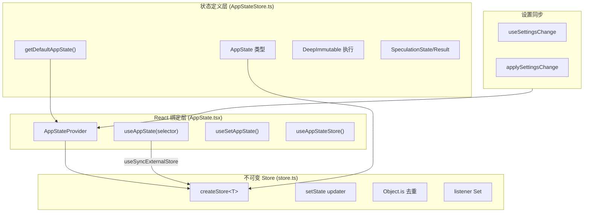
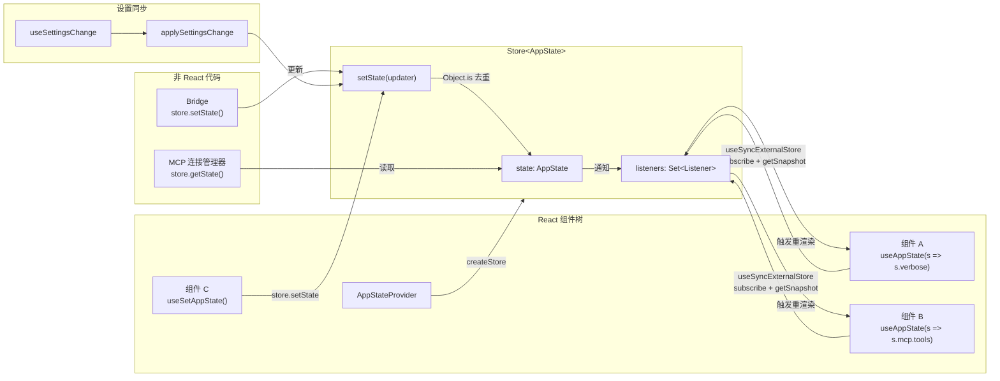

# 应用状态管理

## 概述

Claude Code 的应用状态管理采用外部存储模式(External Store Pattern)，由三层架构组成：底层不可变 Store、中间状态定义层(AppStateStore)、上层 React 绑定层(AppState)。系统位于 `src/state/` 目录，实现了类似简化版 Zustand 的状态管理方案，配合 React Compiler 运行时优化，支持 60+ 顶级状态字段的细粒度订阅。

## 架构总览



## 一、不可变 Store (`store.ts`)

`src/state/store.ts` 实现了极简的不可变 Store，本质上是去除中间件的 Zustand：

```typescript
type Store<T> = {
  getState: () => T
  setState: (updater: (prev: T) => T) => void
  subscribe: (listener: () => void) => () => void
}

function createStore<T>(initialState: T, onChange?: OnChange<T>): Store<T>
```

### 核心机制

**setState updater 模式**：`setState` 接受一个 updater 函数 `(prev: T) => T`，返回值成为新状态。这种模式天然支持：

- 基于前值的状态更新
- 不可变更新(展开运算符)
- 条件更新(返回原值跳过)

**Object.is 去重检测**：新状态通过 `Object.is(next, prev)` 与前值比较，相同则跳过更新和通知。这确保展开相同的对象不会触发无意义的重渲染。

```typescript
setState: (updater) => {
  const prev = state
  const next = updater(prev)
  if (Object.is(next, prev)) return  // 无变化则跳过
  state = next
  onChange?.({ newState: next, oldState: prev })
  for (const listener of listeners) listener()
}
```

**Listener Set**：使用 `Set<Listener>` 存储监听器，`subscribe` 返回取消订阅函数(通过 `Set.delete`)。Set 天然去重且删除操作 O(1)。

**onChange 回调**：可选的 `onChange` 回调在新旧状态不同时触发，用于外部副作用(如调试日志、状态持久化)。

## 二、状态定义层 (`AppStateStore.ts`)

`src/state/AppStateStore.ts` 定义了应用的完整状态类型和默认值工厂。

### DeepImmutable 强制

AppState 类型通过 `DeepImmutable` 包装，在类型层面强制不可变性：

```typescript
export type AppState = DeepImmutable<{
  settings: SettingsJson
  verbose: boolean
  mainLoopModel: ModelSetting
  // ...60+ 顶级字段
}> & {
  // 排除 DeepImmutable 的例外(含函数类型)
  tasks: { [taskId: string]: TaskState }
  agentNameRegistry: Map<string, AgentId>
  mcp: { clients: MCPServerConnection[]; tools: Tool[]; ... }
  // ...
}
```

例外字段使用交叉类型(&)而非 DeepImmutable，因为它们包含函数类型(TaskState 中的回调)或 Map/Set 等内置类型。

### 60+ 顶级字段分类

| 类别 | 字段 | 说明 |
|------|------|------|
| **核心会话** | `settings`, `verbose`, `mainLoopModel`, `mainLoopModelForSession` | 基础配置和模型选择 |
| **UI 状态** | `expandedView`, `isBriefOnly`, `selectedIPAgentIndex`, `coordinatorTaskIndex`, `footerSelection`, `spinnerTip`, `statusLineText` | 界面展示控制 |
| **远程/Bridge** | `remoteSessionUrl`, `remoteConnectionStatus`, `remoteBackgroundTaskCount`, `replBridgeEnabled`, `replBridgeConnected`, `replBridgeSessionActive`, ... | 远程会话和桥接控制 |
| **工具/权限** | `toolPermissionContext` | 工具权限上下文(含 alwaysAllowRules 等) |
| **MCP/插件** | `mcp`(clients/tools/commands/resources/pluginReconnectKey), `plugins`(enabled/disabled/commands/errors/installationStatus/needsRefresh) | MCP 服务器和插件系统 |
| **代理系统** | `agent`, `kairosEnabled`, `agentDefinitions`, `agentNameRegistry`, `foregroundedTaskId`, `viewingAgentTaskId` | 代理和子代理管理 |
| **团队/Swarm** | `teamContext`, `standaloneAgentContext`, `inbox`, `workerSandboxPermissions` | 团队协作和沙箱权限 |
| **推测** | `speculation`, `speculationSessionTimeSavedMs` | 管线推测执行状态 |
| **REPL 上下文** | `replContext`(vmContext/registeredTools/console) | REPL 工具的 VM 沙箱 |
| **计划/模式** | `hasExitedPlanMode`, `needsPlanModeExitAttachment`, `needsAutoModeExitAttachment` | 计划模式和自动模式状态 |
| **通知** | `notifications`(current/queue) | 通知系统 |
| **内存/技能** | `invokedSkills`, `skillImprovement` | 技能调用记录和改进建议 |
| **Elicitation** | `elicitation`(queue) | MCP 请求用户输入的队列 |
| **Thinking** | `thinkingEnabled` | 思考模式开关 |
| **Prompt 建议** | `promptSuggestionEnabled`, `promptSuggestion` | 提示建议系统 |
| **Session Hooks** | `sessionHooks` | 会话级钩子状态 |
| **Tungsten/Tmux** | `tungstenActiveSession`, `tungstenLastCapturedTime`, `tungstenPanelVisible` | Tmux 面板控制 |
| **Bagel/WebBrowser** | `bagelActive`, `bagelUrl`, `bagelPanelVisible` | 内置浏览器工具 |
| **Computer Use** | `computerUseMcpState` | 计算机 Use MCP 状态(允许应用/截图/显示器) |
| **文件历史** | `fileHistory`, `attribution` | 文件编辑历史和归属 |
| **Todos** | `todos` | 代理级待办列表 |
| **任务** | `tasks` | 统一任务状态 |
| **远程代理** | `remoteAgentTaskSuggestions` | 远程代理任务建议 |

### SpeculationState/SpeculationResult

管线推测执行状态，用于在模型响应等待期间预生成下一轮内容：

```typescript
type SpeculationState =
  | { status: 'idle' }
  | {
      status: 'active'
      id: string
      abort: () => void
      startTime: number
      messagesRef: { current: Message[] }        // 可变引用，避免每条消息展开数组
      writtenPathsRef: { current: Set<string> }  // 可变引用，相对路径写入集
      boundary: CompletionBoundary | null
      suggestionLength: number
      toolUseCount: number
      isPipelined: boolean
      contextRef: { current: REPLHookContext }
      pipelinedSuggestion?: { ... }
    }
```

`messagesRef` 和 `writtenPathsRef` 使用可变引用避免数组/集合展开的性能开销——推测执行可能产生大量消息，不可变更新每次都复制整个数组。

### getDefaultAppState()

工厂函数创建默认状态，所有字段初始化为安全的零值。关键默认值：

- `expandedView: 'none'`
- `remoteConnectionStatus: 'connecting'`
- `replBridgeEnabled: false`
- `promptSuggestionEnabled: shouldEnablePromptSuggestion()`(动态计算)
- `speculation: IDLE_SPECULATION_STATE`
- `mcp: { clients: [], tools: [], commands: [], resources: {}, pluginReconnectKey: 0 }`
- `plugins: { enabled: [], disabled: [], commands: [], errors: [], installationStatus: {...}, needsRefresh: false }`

## 三、React 绑定层 (`AppState.tsx`)

`src/state/AppState.tsx` 将不可变 Store 连接到 React 组件树。

### AppStateProvider

```typescript
function AppStateProvider({
  children,
  initialState,
  onChangeAppState,
}: Props): React.ReactNode
```

**创建 Store**：通过 `useState(() => createStore(...))` 确保 Store 实例只创建一次，引用稳定不变。

**Bypass-permissions 竞态处理**：挂载时检查远程设置是否在组件挂载前就已加载(此时 `isBypassPermissionsModeDisabled` 为 true)，如果是则立即禁用 bypass 模式。这处理了通知在无监听器时发送的竞态条件。

**设置同步**：通过 `useSettingsChange` + `useEffectEvent` 监听外部设置变更，调用 `applySettingsChange` 将变更同步到 AppState。

**嵌套保护**：`HasAppStateContext` 确保不出现嵌套的 `AppStateProvider`。

### useAppState(selector)

细粒度状态订阅 Hook，核心实现使用 `useSyncExternalStore`：

```typescript
function useAppState<T>(selector: (state: AppState) => T): T {
  const store = useAppStore()
  const get = () => selector(store.getState())
  return useSyncExternalStore(store.subscribe, get, get)
}
```

**优化要点**：

- 仅当 selector 返回值变化(Object.is)时触发重渲染
- 建议返回已有子对象引用，而非新创建对象
- 多个独立字段应调用多次 Hook 而非返回多字段对象
- 使用 React Compiler 运行时(`_c`)缓存 selector 结果

### useSetAppState()

返回 `store.setState` 的稳定引用，不订阅任何状态，组件不会因状态变更而重渲染。适用于仅需要更新状态而不读取状态的场景。

### useAppStateStore()

直接获取 Store 实例，供非 React 代码使用(如 MCP 连接管理器中 `store.getState().mcp.clients`)。

### useAppStateMaybeOutsideOfProvider

安全版本，在 `AppStateProvider` 外部返回 `undefined` 而非抛出错误。使用空订阅函数 `NOOP_SUBSCRIBE` 避免在无 Store 时尝试订阅。

## 四、状态架构图



## 关键设计模式

1. **外部存储模式**：Store 独立于 React，通过 `useSyncExternalStore` 桥接，支持非 React 代码直接访问
2. **DeepImmutable 类型强制**：在类型层面保证状态不可变，运行时通过展开运算符实现
3. **细粒度订阅**：selector 模式仅订阅需要的切片，避免不相关状态变更导致的重渲染
4. **Object.is 去重**：setState 内置去重检测，相同引用跳过更新和通知
5. **Bypass-permissions 竞态防护**：挂载时检查远程设置提前加载的情况
6. **可变引用优化**：SpeculationState 中的 `messagesRef`/`writtenPathsRef` 避免高频更新场景的数组复制开销
7. **React Compiler 优化**：使用 `_c` 运行时缓存减少不必要的计算
