# Bootstrap全局状态

## 概述

`src/bootstrap/state.ts` 是 Claude Code 的单一全局状态存储，约 1760 行代码。该模块刻意设计为导入 DAG(有向无环图)的叶子节点——它几乎不导入其他模块，但被几乎所有模块导入。这种设计确保全局状态不会引入循环依赖。

文件开头即有明确警告：`DO NOT ADD MORE STATE HERE — BE JUDICIOUS WITH GLOBAL STATE`，强调添加全局状态的审慎性。

## 状态架构

```mermaid
flowchart TB
    subgraph IdentityDirs["身份与目录"]
        A["sessionId"]
        B["parentSessionId"]
        C["originalCwd"]
        D["projectRoot"]
        E["cwd"]
        F["sessionProjectDir"]
    end

    subgraph CostMetrics["成本与指标"]
        G["totalCostUSD"]
        H["totalAPIDuration"]
        I["totalToolDuration"]
        J["modelUsage"]
        K["totalLinesAdded/Removed"]
    end

    subgraph TurnMetrics["轮次指标"]
        L["turnHookDurationMs"]
        M["turnToolDurationMs"]
        N["turnClassifierDurationMs"]
        O["turnToolCount / turnHookCount"]
    end

    subgraph ModeFlags["模式与标志"]
        P["isInteractive"]
        Q["kairosActive"]
        R["strictToolResultPairing"]
        S["sessionBypassPermissionsMode"]
        T["isRemoteMode"]
    end

    subgraph Telemetry["遥测"]
        U["meter"]
        V["sessionCounter / locCounter"]
        W["loggerProvider / meterProvider"]
    end

    subgraph AuthConfig["认证与配置"]
        X["sessionIngressToken"]
        Y["oauthTokenFromFd"]
        Z["apiKeyFromFd"]
        AA["allowedSettingSources"]
        AB["flagSettingsPath / flagSettingsInline"]
    end

    subgraph AgentState["代理状态"]
        AC["agentColorMap"]
        AD["mainThreadAgentType"]
        AE["registeredHooks"]
    end

    subgraph SessionTracking["会话追踪"]
        AF["startTime"]
        AG["lastInteractionTime"]
        AH["sessionSource"]
    end

    subgraph PromptCache["提示缓存"]
        AI["promptCache1hAllowlist"]
        AJ["promptCache1hEligible"]
        AK["afkModeHeaderLatched"]
        AL["fastModeHeaderLatched"]
        AM["cacheEditingHeaderLatched"]
        AN["thinkingClearLatched"]
    end

    subgraph ConversationState["对话状态"]
        AO["lastAPIRequest"]
        AP["cachedClaudeMdContent"]
        AQ["systemPromptSectionCache"]
        AR["pendingPostCompaction"]
        AS["promptId / lastMainRequestId"]
    end
```



## 一、身份与目录

这是最基础的状态类别，定义了会话的空间身份：

| 字段 | 类型 | 说明 |
|------|------|------|
| `sessionId` | `SessionId` | 当前会话唯一标识(UUID) |
| `parentSessionId` | `SessionId \| undefined` | 父会话 ID(如计划模式到实现的谱系追踪) |
| `originalCwd` | `string` | 原始工作目录(启动时设置，会话期间不变) |
| `projectRoot` | `string` | 稳定项目根目录(不受 EnterWorktreeTool 影响) |
| `cwd` | `string` | 当前工作目录(可被工具修改) |
| `sessionProjectDir` | `string \| null` | 会话转录文件目录(null 表示从 originalCwd 派生) |

**关键设计**：

- `originalCwd` 和 `cwd` 都通过 `normalize('NFC')` 统一 Unicode 编码
- `projectRoot` 仅在启动时通过 `--worktree` 标志设置，中途进入 worktree 不会改变它
- `switchSession` 原子更新 `sessionId` + `sessionProjectDir`，确保两者不漂移

**路径解析**：启动时使用 `realpathSync` 解析 cwd 的符号链接，与 `shell.ts` 的 `setCwd` 行为一致。异常处理覆盖 CloudStorage 挂载的 File Provider EPERM 错误。

## 二、成本与指标

| 字段 | 类型 | 说明 |
|------|------|------|
| `totalCostUSD` | `number` | 累计美元成本 |
| `totalAPIDuration` | `number` | 累计 API 调用时长(毫秒) |
| `totalAPIDurationWithoutRetries` | `number` | 不含重试的累计 API 时长 |
| `totalToolDuration` | `number` | 累计工具执行时长 |
| `totalLinesAdded` | `number` | 累计添加行数 |
| `totalLinesRemoved` | `number` | 累计删除行数 |
| `hasUnknownModelCost` | `boolean` | 是否存在未知模型成本 |
| `modelUsage` | `{ [modelName: string]: ModelUsage }` | 按模型的使用量统计 |

成本追踪通过 `addToTotalCostState` 累加，每次 API 调用后更新。`modelUsage` 记录每个模型的详细使用数据(输入/输出 token 数等)。

## 三、轮次指标

| 字段 | 类型 | 说明 |
|------|------|------|
| `turnHookDurationMs` | `number` | 当前轮次钩子执行时长 |
| `turnToolDurationMs` | `number` | 当前轮次工具执行时长 |
| `turnClassifierDurationMs` | `number` | 当前轮次分类器执行时长 |
| `turnToolCount` | `number` | 当前轮次工具调用次数 |
| `turnHookCount` | `number` | 当前轮次钩子执行次数 |
| `turnClassifierCount` | `number` | 当前轮次分类器调用次数 |

这些指标在每轮对话开始时重置，结束时记录。`addToToolDuration` 同时累加 `totalToolDuration` 和 `turnToolDurationMs`，实现双层追踪。

## 四、模式与标志

| 字段 | 类型 | 说明 |
|------|------|------|
| `isInteractive` | `boolean` | 是否交互模式(SDK 为 false) |
| `kairosActive` | `boolean` | Kairos(助手模式)是否激活 |
| `strictToolResultPairing` | `boolean` | 严格工具结果配对(不匹配时抛错) |
| `sessionBypassPermissionsMode` | `boolean` | 会话级绕过权限模式(不持久化) |
| `isRemoteMode` | `boolean` | 远程模式(`--remote` 标志) |
| `sdkAgentProgressSummariesEnabled` | `boolean` | SDK 代理进度摘要 |
| `userMsgOptIn` | `boolean` | 用户消息选择加入 |
| `scheduledTasksEnabled` | `boolean` | 定时任务启用标志 |
| `sessionPersistenceDisabled` | `boolean` | 会话持久化禁用标志 |
| `hasExitedPlanMode` | `boolean` | 是否已退出计划模式 |
| `sessionTrustAccepted` | `boolean` | 会话级信任标志(主目录运行时不持久化) |

**strictToolResultPairing**：HFI(高频交互)模式在启动时启用，确保工具结果不匹配时快速失败而非用合成占位符修复。这避免模型在假工具结果上继续条件化。

## 五、遥测

| 字段 | 类型 | 说明 |
|------|------|------|
| `meter` | `Meter \| null` | OpenTelemetry Meter 实例 |
| `sessionCounter` | `AttributedCounter \| null` | 会话计数器 |
| `locCounter` | `AttributedCounter \| null` | 代码行计数器 |
| `prCounter` | `AttributedCounter \| null` | PR 计数器 |
| `commitCounter` | `AttributedCounter \| null` | 提交计数器 |
| `costCounter` | `AttributedCounter \| null` | 成本计数器 |
| `tokenCounter` | `AttributedCounter \| null` | Token 计数器 |
| `codeEditToolDecisionCounter` | `AttributedCounter \| null` | 代码编辑工具决策计数器 |
| `activeTimeCounter` | `AttributedCounter \| null` | 活跃时间计数器 |
| `statsStore` | `{ observe(name, value) } \| null` | 统计观察器 |
| `loggerProvider` | `LoggerProvider \| null` | OpenTelemetry Logger 提供者 |
| `eventLogger` | `Logger \| null` | 事件日志器 |
| `meterProvider` | `MeterProvider \| null` | Meter 提供者 |
| `tracerProvider` | `BasicTracerProvider \| null` | Tracer 提供者 |

`AttributedCounter` 是带属性的计数器接口，封装 OpenTelemetry 的 `Counter.add(value, attributes)` 方法。

## 六、认证与配置

| 字段 | 类型 | 说明 |
|------|------|------|
| `sessionIngressToken` | `string \| null \| undefined` | 会话入口认证令牌 |
| `oauthTokenFromFd` | `string \| null \| undefined` | 从文件描述符读取的 OAuth 令牌 |
| `apiKeyFromFd` | `string \| null \| undefined` | 从文件描述符读取的 API 密钥 |
| `allowedSettingSources` | `SettingSource[]` | 允许的设置来源列表 |
| `flagSettingsPath` | `string \| undefined` | `--settings` 标志指定的设置路径 |
| `flagSettingsInline` | `Record<string, unknown> \| null` | 内联设置 |
| `clientType` | `string` | 客户端类型(默认 'cli') |
| `sessionSource` | `string \| undefined` | 会话来源标识 |
| `questionPreviewFormat` | `'markdown' \| 'html' \| undefined` | 问题预览格式 |

## 七、代理状态

| 字段 | 类型 | 说明 |
|------|------|------|
| `agentColorMap` | `Map<string, AgentColorName>` | 代理 ID 到颜色名称的映射 |
| `agentColorIndex` | `number` | 颜色分配索引(循环使用) |
| `mainThreadAgentType` | `string \| undefined` | 主线程代理类型(`--agent` 标志) |
| `registeredHooks` | `Partial<Record<HookEvent, RegisteredHookMatcher[]>> \| null` | 已注册的 SDK/插件钩子 |

**RegisteredHookMatcher** 联合类型：`HookCallbackMatcher`(SDK 回调)或 `PluginHookMatcher`(插件原生钩子)。

## 八、会话追踪

| 字段 | 类型 | 说明 |
|------|------|------|
| `startTime` | `number` | 会话启动时间戳 |
| `lastInteractionTime` | `number` | 最后交互时间戳 |

**updateLastInteractionTime 批处理**：交互时间更新通过 dirty flag 延迟刷新。`updateLastInteractionTime` 仅设置脏标志，实际更新由 Ink 渲染周期在 `useSyncExternalStore` 的 `getSnapshot` 中执行。这避免高频交互(如快速按键)导致的过度更新。

## 九、提示缓存管理

提示缓存是性能关键路径，管理多个 header latch 确保缓存命中率：

| 字段 | 类型 | 说明 |
|------|------|------|
| `promptCache1hAllowlist` | `string[] \| null` | 1 小时 TTL 缓存白名单(GrowthBook) |
| `promptCache1hEligible` | `boolean \| null` | 1 小时 TTL 用户资格(首次评估后锁存) |
| `afkModeHeaderLatched` | `boolean \| null` | AFK 模式 beta header 锁存 |
| `fastModeHeaderLatched` | `boolean \| null` | 快速模式 beta header 锁存 |
| `cacheEditingHeaderLatched` | `boolean \| null` | 缓存编辑 beta header 锁存 |
| `thinkingClearLatched` | `boolean \| null` | 清除思考 beta header 锁存 |

**Header Latch 机制**：一旦某个 beta header 首次启用，它就被锁存(latch)为 true 并在会话剩余时间内保持发送。这防止中会话的开关切换导致约 50-70K token 的提示缓存失效。

**promptCache1hEligible**：首次评估时锁存，中会话的超量翻转不会改变 `cache_control` TTL，避免服务端提示缓存失效。

**thinkingClearLatched**：当距离上次 API 调用超过 1 小时触发(确认缓存失效，保留思考无缓存命中收益)。锁存后保持开启，确保新热化的清除思考缓存不会被切回 `keep:'all'` 再次失效。

## 十、对话状态

| 字段 | 类型 | 说明 |
|------|------|------|
| `lastAPIRequest` | `BetaMessageStreamParams \| null` | 最近 API 请求参数(排除 messages) |
| `lastAPIRequestMessages` | `BetaMessageStreamParams['messages'] \| null` | 最近 API 请求消息(ant-only) |
| `lastClassifierRequests` | `unknown[] \| null` | 最近自动模式分类器请求 |
| `cachedClaudeMdContent` | `string \| null` | CLAUDE.md 内容缓存(打破 yoloClassifier 循环) |
| `systemPromptSectionCache` | `Map<string, string \| null>` | 系统提示段缓存 |
| `pendingPostCompaction` | `boolean` | 压缩后第一次 API 调用标记 |
| `promptId` | `string \| null` | 当前提示 ID(关联 OTel 事件) |
| `lastMainRequestId` | `string \| undefined` | 最近主对话 API requestId |
| `lastApiCompletionTimestamp` | `number \| null` | 最近 API 调用完成时间戳 |

**cachedClaudeMdContent**：打破 `yoloClassifier` -> `claudemd` -> `filesystem` -> `permissions` 循环。自动模式分类器需要 CLAUDE.md 内容，但加载它触发文件系统权限请求，权限请求又触发分类器。

## 十一、关键设计

### 单一可变 STATE + 显式 getter/setter

不使用 Proxy 自动 getter/setter，所有状态访问通过显式函数：

```typescript
function getSessionId(): SessionId { return STATE.sessionId }
function getTotalCostUSD(): number { return STATE.totalCostUSD }
```

这种设计的优势：明确的读写边界、可断点调试、可审计状态变更、无 Proxy 性能开销。

### sessionSwitched 信号

`switchSession` 原子更新 `sessionId` + `sessionProjectDir`，并发射 `sessionSwitched` 信号：

```typescript
const sessionSwitched = createSignal<[id: SessionId]>()
export function switchSession(sessionId, projectDir = null): void {
  STATE.planSlugCache.delete(STATE.sessionId)  // 清理旧会话的 slug
  STATE.sessionId = sessionId
  STATE.sessionProjectDir = projectDir
  sessionSwitched.emit(sessionId)
}
export const onSessionSwitch = sessionSwitched.subscribe
```

外部模块(如 `concurrentSessions.ts`)通过 `onSessionSwitch` 注册回调，保持 PID 文件中的 sessionId 与 `--resume` 同步。

### updateLastInteractionTime 批处理

交互时间更新使用脏标志延迟：

1. `updateLastInteractionTime()` 仅设置脏标志
2. `getLastInteractionTimeForSnapshot()` 在 Ink 渲染周期中被调用，检查脏标志并更新时间
3. 这种批处理避免高频交互下的过度更新

### resetStateForTests 逐字段重置

测试重置不使用 `Object.assign(STATE, getInitialState())`，而是逐字段赋值。原因是某些字段的类型可能在不同版本间变化，逐字段赋值确保类型安全且可审计。

### "DO NOT ADD MORE STATE HERE" 哲学

文件多处出现此警告。全局状态是最后的手段，应优先考虑：

- 局部状态(组件或模块内)
- AppState(React 响应式状态)
- 专门的 Store(如 MCP 连接状态)

Bootstrap 全局状态仅存放：跨模块共享的基础设施数据、无法放入 React 状态的非 UI 数据、性能关键的频繁访问数据。

## 十二、通道与额外目录

| 字段 | 类型 | 说明 |
|------|------|------|
| `allowedChannels` | `ChannelEntry[]` | `--channels` 白名单 |
| `hasDevChannels` | `boolean` | 是否有开发通道条目 |
| `additionalDirectoriesForClaudeMd` | `string[]` | `--add-dir` 额外目录 |
| `directConnectServerUrl` | `string \| undefined` | 直连服务器 URL |

**ChannelEntry** 类型区分 `plugin`(需市场验证 + 白名单)和 `server`(白名单总是失败)，两种类型的 `dev` 标志可绕过白名单。

## 十三、其他状态

| 字段 | 类型 | 说明 |
|------|------|------|
| `inlinePlugins` | `string[]` | `--plugin-dir` 会话级插件 |
| `chromeFlagOverride` | `boolean \| undefined` | `--chrome`/`--no-chrome` 标志 |
| `useCoworkPlugins` | `boolean` | 使用 cowork_plugins 目录 |
| `sessionCronTasks` | `SessionCronTask[]` | 会话级临时定时任务 |
| `sessionCreatedTeams` | `Set<string>` | 会话创建的团队(清理时删除) |
| `initJsonSchema` | `Record<string, unknown> \| null` | SDK 初始化事件 schema |
| `planSlugCache` | `Map<string, string>` | 计划 slug 缓存 |
| `teleportedSessionInfo` | `object \| null` | 迁移会话追踪 |
| `invokedSkills` | `Map` | 已调用技能(压缩后保留) |
| `slowOperations` | `Array` | 慢操作追踪(ant-only) |
| `sdkBetas` | `string[] \| undefined` | SDK 提供的 beta 标志 |
| `lspRecommendationShownThisSession` | `boolean` | LSP 推荐是否已显示 |
| `inMemoryErrorLog` | `Array` | 内存错误日志 |

## 关键设计模式

1. **DAG 叶子设计**：bootstrap/state 几乎不导入其他模块，避免循环依赖
2. **单可变 STATE + 显式 getter/setter**：无 Proxy，明确的读写边界
3. **sessionSwitched 信号**：原子更新 sessionId + sessionProjectDir，外部订阅通知
4. **脏标志批处理**：`updateLastInteractionTime` 通过 Ink 渲染周期延迟刷新
5. **Header Latch**：beta header 一旦启用即锁存，防止中会话切换破坏提示缓存
6. **逐字段测试重置**：不使用 Object.assign，确保类型安全
7. **"DO NOT ADD MORE STATE"** 审慎哲学：全局状态是最后手段
