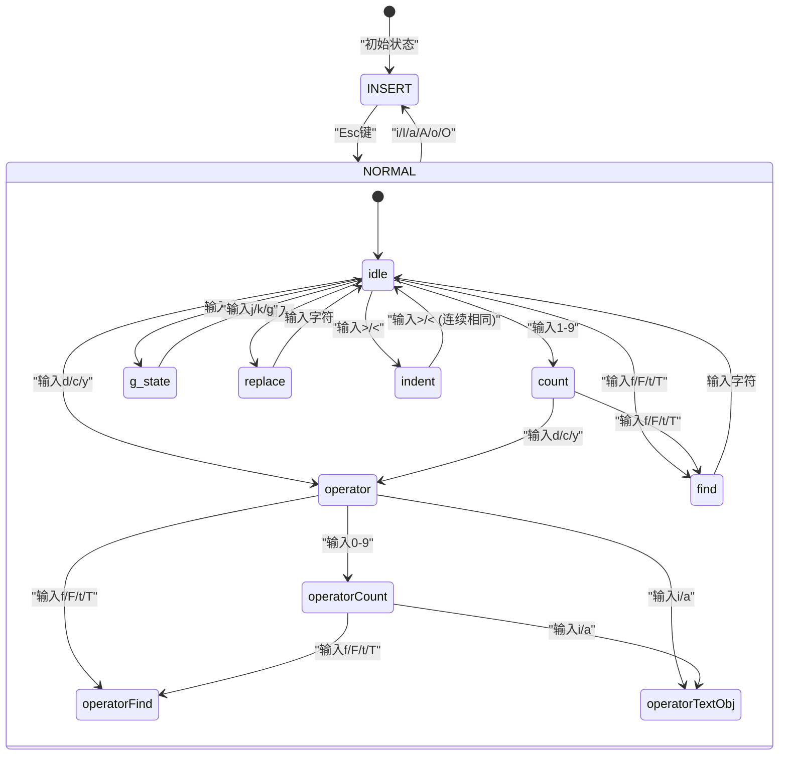

# 26. Vim模拟系统

## 概述

Claude Code内置了一套完整的Vim模拟系统，位于`src/vim/`目录，采用纯函数式状态机架构实现了Normal模式和Insert模式的核心Vim键绑定。该系统的设计哲学是"类型即文档"——通过TypeScript的判别联合类型（Discriminated Union）精确描述状态机的每一个状态，使得类型系统本身成为最权威的状态转换文档。

### 核心设计原则

- **纯函数核心**：所有运动、操作和状态转换函数均为纯函数，无副作用
- **副作用注入**：通过`OperatorContext`回调接口注入副作用，保持核心逻辑的可测试性
- **类型驱动**：状态机的每个状态都有独立的TypeScript类型，确保穷举匹配
- **Unicode安全**：使用`Intl.Segmenter`进行grapheme级别的迭代，正确处理多字节字符

## 架构总览



## 类型系统详解

### VimState：顶层状态判别联合

定义于`src/vim/types.ts`，`VimState`是最顶层的状态类型，区分两种基本模式：

```typescript
export type VimState =
  | { mode: 'INSERT'; insertedText: string }
  | { mode: 'NORMAL'; command: CommandState }
```

- **INSERT模式**：跟踪当前插入的文本（`insertedText`），用于dot-repeat回放
- **NORMAL模式**：包含一个`CommandState`状态机，解析命令序列

### CommandState：命令状态机

`CommandState`定义了Normal模式下的11种子状态，每种状态都携带该状态所需的上下文数据：

| 状态类型 | 说明 | 关键数据 |
|---------|------|---------|
| `idle` | 空闲，等待新命令 | 无 |
| `count` | 正在输入计数前缀 | `digits: string` |
| `operator` | 已输入操作符，等待motion | `op: Operator, count: number` |
| `operatorCount` | 操作符后的计数 | `op, count, digits` |
| `operatorFind` | 操作符+查找模式 | `op, count, find: FindType` |
| `operatorTextObj` | 操作符+文本对象 | `op, count, scope: TextObjScope` |
| `find` | 查找模式（f/F/t/T） | `find: FindType, count: number` |
| `g` | g前缀等待 | `count: number` |
| `operatorG` | 操作符+g前缀 | `op, count` |
| `replace` | 替换模式（r） | `count: number` |
| `indent` | 缩进模式（>/<） | `dir, count` |

### PersistentState：持久化状态

跨命令保持的状态，是Vim的"记忆"：

```typescript
export type PersistentState = {
  lastChange: RecordedChange | null    // 上次变更（用于dot-repeat）
  lastFind: { type: FindType; char: string } | null  // 上次查找
  register: string          // 寄存器内容
  registerIsLinewise: boolean  // 是否行级寄存器
}
```

### RecordedChange：Dot-Repeat录制

`RecordedChange`是一个包含10种变体的联合类型，捕获了完整重放一个命令所需的全部信息：

- `insert` - 插入文本
- `operator` - 操作符+motion（如`d3w`）
- `operatorTextObj` - 操作符+文本对象（如`ciw`）
- `operatorFind` - 操作符+查找（如`df,`）
- `replace` - 替换字符
- `x` - 删除字符
- `toggleCase` - 大小写切换
- `indent` - 缩进
- `openLine` - 开新行
- `join` - 合并行

### 键组常量

系统定义了一组命名常量，避免魔法字符串：

- **OPERATORS**：`{ d: 'delete', c: 'change', y: 'yank' }`
- **SIMPLE_MOTIONS**：基本移动（h/l/j/k）、单词移动（w/b/e/W/B/E）、行位置（0/^/$）
- **FIND_KEYS**：`f, F, t, T`
- **TEXT_OBJ_SCOPES**：`{ i: 'inner', a: 'around' }`
- **TEXT_OBJ_TYPES**：单词(w/W)、引号("/'/`)、括号(()/b/[]/{}/B/<>)
- **MAX_VIM_COUNT**：10000，计数上限

## 状态转换引擎

### transition函数

定义于`src/vim/transitions.ts`，`transition(state, input, ctx)`是状态机的核心调度函数。它根据当前`CommandState`的`type`字段分发到对应的处理函数：

```typescript
export function transition(
  state: CommandState,
  input: string,
  ctx: TransitionContext,
): TransitionResult {
  switch (state.type) {
    case 'idle':      return fromIdle(input, ctx)
    case 'count':     return fromCount(state, input, ctx)
    case 'operator':  return fromOperator(state, input, ctx)
    // ... 11个状态全部穷举
  }
}
```

TypeScript的穷举检查确保每个状态都有对应的处理分支，遗漏任何一个状态都会在编译时报错。

### TransitionResult

转换结果包含两个可选字段：

```typescript
export type TransitionResult = {
  next?: CommandState    // 转换到的新状态
  execute?: () => void   // 需要执行的回调
}
```

- 当`next`存在时，状态机进入新状态
- 当`execute`存在时，执行对应的操作（移动光标、修改文本等）
- 两者可以同时存在，先执行操作再更新状态

### 共享输入处理

`handleNormalInput`和`handleOperatorInput`是两个重要的共享函数，分别处理idle/count状态和operator相关状态的输入逻辑，避免代码重复。

#### handleNormalInput

处理idle和count状态共用的输入，包括：
- 操作符键（d/c/y）→ 进入operator状态
- 简单motion → 直接执行光标移动
- 查找键（f/F/t/T）→ 进入find状态
- g → 进入g状态
- r → 进入replace状态
- >/\< → 进入indent状态
- ~ → 执行大小写切换
- x → 执行删除字符
- J → 执行合并行
- p/P → 执行粘贴
- D/C/Y → 快捷操作（等价于d$/c$/yy）
- G → 跳转行
- . → dot-repeat
- ;/, → 重复/反向重复查找
- u → 撤销
- i/I/a/A/o/O → 进入Insert模式

#### fromIdle的特殊处理

`fromIdle`函数有一个重要细节：数字`0`在idle状态下是行首motion（不是计数前缀），而`1-9`才启动计数。这与Vim的行为完全一致。

### 计数乘法

当存在operator计数和motion计数时，两者相乘得到有效计数。例如`2d3w`等价于`d6w`：

```typescript
const effectiveCount = state.count * motionCount
```

## 运动系统

### resolveMotion

定义于`src/vim/motions.ts`，`resolveMotion`通过迭代单步运动来解析带计数的motion：

```typescript
export function resolveMotion(key: string, cursor: Cursor, count: number): Cursor {
  let result = cursor
  for (let i = 0; i < count; i++) {
    const next = applySingleMotion(key, result)
    if (next.equals(result)) break  // 无法继续移动时提前终止
    result = next
  }
  return result
}
```

这种迭代方式确保复合motion（如`3w`）是三个单步`w`的累加，而不是跳过3个单词的专门实现，保证了行为的一致性。

### 支持的Motion

| Motion | 说明 | 类型 |
|--------|------|------|
| h/l | 左右移动 | 排除性 |
| j/k | 逻辑行上下 | 行级 |
| gj/gk | 视觉行上下 | 排除性 |
| w/b/e | Vim单词移动 | 排除/包含 |
| W/B/E | WORD移动 | 排除/包含 |
| 0/^/$ | 行首/首字符/行尾 | 排除/包含 |
| G | 最后一行 | 行级 |
| gg | 第一行 | 行级 |

### Motion分类

两类关键分类决定操作符的范围计算：

- **包含性motion**（`isInclusiveMotion`）：`e, E, $` —— 范围包含目标字符
- **行级motion**（`isLinewiseMotion`）：`j, k, G, gg` —— 操作整行

## 操作符执行系统

### OperatorContext

定义于`src/vim/operators.ts`，`OperatorContext`是副作用注入接口，将纯函数核心与实际文本编辑解耦：

```typescript
export type OperatorContext = {
  cursor: Cursor
  text: string
  setText: (text: string) => void
  setOffset: (offset: number) => void
  enterInsert: (offset: number) => void
  getRegister: () => string
  setRegister: (content: string, linewise: boolean) => void
  getLastFind: () => { type: FindType; char: string } | null
  setLastFind: (type: FindType, char: string) => void
  recordChange: (change: RecordedChange) => void
}
```

### 核心操作符

#### executeOperatorMotion

最通用的操作符执行路径。计算motion目标位置，然后通过`getOperatorRange`确定操作范围，最后由`applyOperator`执行具体的删除/修改/复制操作。

**cw→ce映射**：在Vim中，`cw`的行为等价于`ce`（修改到单词结尾而非下一个单词开头），这是一个重要的兼容性细节，在`getOperatorRange`中专门处理：

```typescript
if (op === 'change' && (motion === 'w' || motion === 'W')) {
  // cw映射为ce行为
  const wordEnd = motion === 'w' ? wordCursor.endOfVimWord() : wordCursor.endOfWORD()
  to = cursor.measuredText.nextOffset(wordEnd.offset)
}
```

#### executeLineOp

处理`dd/cc/yy`行级操作。关键细节：
- 行级内容确保以换行符结尾（用于粘贴检测）
- 删除最后一行时，如果前面有换行符则一并删除，避免留下尾部空行
- `cc`在单行时清空整行进入Insert，多行时删除后保留一行空行

#### executeX

删除字符命令，使用grapheme级别的移动（而非代码单元），正确处理Unicode字符。

#### executeReplace

替换命令，使用`firstGrapheme`获取被替换字符的grapheme长度，确保多字节字符被完整替换。

#### executeToggleCase

大小写切换，逐个grapheme处理，支持Unicode字符的大小写转换。

#### executeJoin

合并行命令，自动去除下一行的前导空白，在非空行之间插入空格。

#### executePaste

粘贴命令，区分行级和字符级寄存器：
- 行级粘贴：在当前行上方或下方插入
- 字符级粘贴：在光标后或光标位置插入，支持计数重复

#### executeIndent

缩进/反缩进，使用两个空格作为缩进单位，反缩进时优先匹配空格缩进，其次匹配tab。

#### executeOpenLine

开新行命令（o/O），在当前行下方或上方插入空行并进入Insert模式。

### Image引用处理

操作范围计算中有一个特殊的`snapOutOfImageRef`处理，确保操作范围不会切割`[Image #N]`占位符。当word motion落在图片引用内部时，范围自动扩展到覆盖整个占位符。

## 文本对象系统

定义于`src/vim/textObjects.ts`，`findTextObject`支持多种文本对象的范围查找。

### 文本对象类型

#### 单词对象（iw/aw/iW/aW）

使用`Intl.Segmenter`进行grapheme安全迭代。根据光标位置的字符类型（单词/空白/标点）向两侧扩展同类字符，`around`变体额外包含周围的空白。

#### 引号对象（i"/a"/i'/a'/i`/a`）

在同一行内查找引号对，按位置配对（0-1, 2-3, 4-5...）。`inner`变体不含引号本身，`around`变体包含。

#### 括号对象

支持所有括号类型：圆括号`(/)/b`、方括号`[/]`、花括号`{/}/B`、尖括号`</>`。通过深度计数器匹配嵌套结构，`inner`变体不含括号，`around`变体包含。

### PAIRS映射表

```typescript
const PAIRS: Record<string, [string, string]> = {
  '(': ['(', ')'], ')': ['(', ')'], b: ['(', ')'],
  '[': ['[', ']'], ']': ['[', ']'],
  '{': ['{', '}'], '}': ['{', '}'], B: ['{', '}'],
  '<': ['<', '>'], '>': ['<', '>'],
  '"': ['"', '"'], "'": ["'", "'"], '`': ['`', '`'],
}
```

开括号和闭括号键都映射到同一对，使得用户可以在光标位于任意一侧时触发文本对象。

## 纯函数架构与副作用隔离

整个Vim系统的核心是一个纯函数状态机，所有状态转换和操作计算都不产生副作用。实际的效果（修改文本、移动光标、进入Insert模式）通过`OperatorContext`和`TransitionContext`的回调函数注入：

```
用户输入 → transition(状态, 输入, 上下文) → TransitionResult
                                                  ↓
                                          execute回调 → 通过上下文回调产生副作用
                                          next状态 → 更新状态机
```

这种架构的优势：
1. **完全可测试**：状态转换逻辑可以在没有任何UI或编辑器依赖的情况下测试
2. **确定性**：相同的输入和状态总是产生相同的输出
3. **可调试**：状态序列可以完整追踪和重放
4. **安全**：核心逻辑不可能意外修改编辑器状态

## Dot-Repeat机制

Dot-repeat（`.`命令）是Vim最重要的功能之一。系统通过`RecordedChange`捕获完整的变更信息，使得`.`可以精确重放之前的命令。

关键设计：
- INSERT模式的文本通过`insertedText`字段记录
- 每个操作符执行后都调用`recordChange`记录变更
- `RecordedChange`的10种变体确保了每种命令都有足够的上下文进行重放
- `PersistentState.lastChange`保存最近一次变更，供`.`命令使用

## 总结

Claude Code的Vim模拟系统是一个精心设计的纯函数式状态机，通过TypeScript的类型系统强制穷举处理所有状态转换，通过回调注入实现副作用隔离，通过`Intl.Segmenter`确保Unicode安全。它不是一个简单的键绑定映射，而是一个完整的、可扩展的Vim命令解析和执行引擎，核心代码约1500行，却涵盖了Vim编辑器中最常用的功能集。
