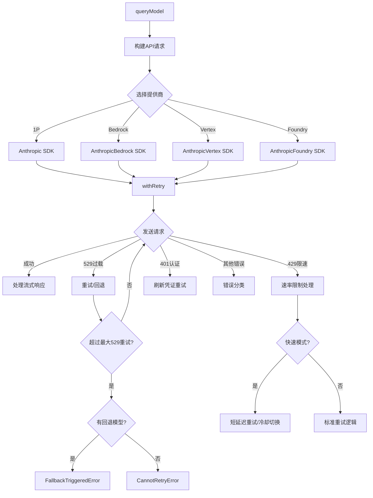

# 27. API客户端与模型通信

## 概述

Claude Code的API客户端系统位于`src/services/api/`目录，是与Claude模型通信的核心层。该系统负责API客户端构建、多提供商路由（1P/Bedrock/Vertex/Foundry）、流式响应处理、重试逻辑、错误分类、模型回退、请求调试、速率限制管理等多个关键功能。

## 架构总览



## API客户端构建

### getAnthropicClient

定义于`src/services/api/client.ts`，`getAnthropicClient`是API客户端的工厂函数，根据环境变量和配置选择不同的提供商SDK。

#### 四种提供商路由

1. **1P（直接API）**：使用`@anthropic-ai/sdk`，支持API Key和OAuth认证
2. **Bedrock（AWS）**：使用`@anthropic-ai/bedrock-sdk`，支持AWS凭证和Bearer Token
3. **Vertex（GCP）**：使用`@anthropic-ai/vertex-sdk`，支持GoogleAuth和ADC
4. **Foundry（Azure）**：使用`@anthropic-ai/foundry-sdk`，支持API Key和Azure AD

路由决策通过环境变量控制：
- `CLAUDE_CODE_USE_BEDROCK` → Bedrock路由
- `CLAUDE_CODE_USE_FOUNDRY` → Foundry路由
- `CLAUDE_CODE_USE_VERTEX` → Vertex路由
- 以上均未设置 → 1P路由

#### 认证配置

**1P认证**：
- OAuth订阅用户：使用`authToken`（accessToken）
- API Key用户：使用`apiKey`或`Authorization: Bearer`头（通过apiKeyHelper获取）

**Bedrock认证**：
- AWS凭证：自动刷新，支持`AWS_BEARER_TOKEN_BEDROCK`
- 跳过认证：`CLAUDE_CODE_SKIP_BEDROCK_AUTH`

**Vertex认证**：
- GoogleAuth：自动发现项目ID，防止12秒元数据服务器超时
- 项目ID优先级：环境变量 > 凭证文件 > `ANTHROPIC_VERTEX_PROJECT_ID`
- 区域选择：支持模型级别区域覆盖（`VERTEX_REGION_CLAUDE_*`）

**Foundry认证**：
- API Key：`ANTHROPIC_FOUNDRY_API_KEY`
- Azure AD：`DefaultAzureCredential`自动发现

#### 请求头注入

每个API请求都注入了标准头信息：
- `x-app: cli` - 应用标识
- `User-Agent` - 自定义用户代理
- `X-Claude-Code-Session-Id` - 会话ID
- `x-client-request-id` - 客户端请求ID（仅1P，用于超时关联）
- `x-claude-remote-container-id` / `x-claude-remote-session-id` - 远程会话标识
- `x-anthropic-additional-protection` - 额外保护头

### buildFetch

`buildFetch`函数包装了全局`fetch`，注入客户端请求ID并记录请求日志。客户端请求ID使用UUID生成，使得即使超时（无服务端请求ID返回）也能通过日志关联。

## Beta Headers系统

定义于`src/constants/betas.ts`，Beta headers控制API的实验性功能：

| Beta Header | 用途 | 说明 |
|-------------|------|------|
| `interleaved-thinking-2025-05-14` | 交错思考 | 允许思考块与文本/工具块交错 |
| `context-1m-2025-08-07` | 1M上下文 | 扩展上下文窗口至1M token |
| `context-management-2025-06-27` | 上下文管理 | 支持上下文管理功能 |
| `structured-outputs-2025-12-15` | 结构化输出 | 强制JSON格式输出 |
| `web-search-2025-03-05` | 网页搜索 | 内置网页搜索工具 |
| `effort-2025-11-24` | 努力度控制 | 允许设置模型推理力度 |
| `fast-mode-2026-02-01` | 快速模式 | 低延迟模式 |
| `redact-thinking-2026-02-12` | 隐藏思考 | 隐藏思考内容以节省token |
| `afk-mode-2026-01-31` | AFK模式 | 自动模式（需TRANSCRIPT_CLASSIFIER） |
| `prompt-caching-scope-2026-01-05` | 缓存范围 | 全局缓存作用域 |
| `task-budgets-2026-03-13` | 任务预算 | API侧token预算感知 |

### Bedrock/Vertex兼容性

Beta headers在不同提供商的传递方式不同：
- **Bedrock**：部分beta headers（交错思考、1M上下文、工具搜索）必须通过`extraBodyParams.anthropic_beta`传递，不能放在请求头中
- **Vertex**：countTokens API只接受有限的beta headers集合
- **1P**：所有beta headers通过标准`anthropic-beta`头传递

## 流式查询引擎

### queryModel

定义于`src/services/api/claude.ts`，`queryModel`是核心查询函数，提供两种使用方式：

- **queryModelWithStreaming**：返回AsyncGenerator，逐步yield流式事件
- **queryModelWithoutStreaming**：收集完整响应后返回

两个函数都通过`withStreamingVCR`包装，支持请求/响应的录制和回放（VCR模式），用于测试和调试。

### 请求构建流程

1. **消息标准化**：通过`normalizeMessagesForAPI`处理消息格式
2. **系统提示构建**：组合前缀、系统提示、缓存编辑
3. **工具模式转换**：`toolToAPISchema`将内部工具定义转换为API schema
4. **Beta headers收集**：`getModelBetas`根据模型能力收集所需beta headers
5. **额外参数注入**：`getExtraBodyParams`处理环境变量覆盖和Bedrock兼容性
6. **思考配置**：根据模型能力设置thinking参数
7. **Effort配置**：`configureEffortParams`设置推理力度
8. **任务预算**：`configureTaskBudgetParams`设置API侧token预算

### Prompt Caching

Prompt caching通过`getCacheControl`函数控制，支持两种TTL：
- **默认**：5分钟缓存
- **1小时**：对符合条件的用户和查询源

1小时缓存的资格判断：
- 3P Bedrock用户：通过`ENABLE_PROMPT_CACHING_1H_BEDROCK`环境变量启用
- 1P用户：需要是ant或非超额订阅用户，且查询源在GrowthBook允许列表中
- 允许列表支持通配符前缀匹配（如`repl_main_thread*`）

## 重试系统

### withRetry

定义于`src/services/api/withRetry.ts`，`withRetry`是一个AsyncGenerator函数，实现了完整的重试策略。

#### 重试策略分类

| 错误类型 | 处理策略 |
|---------|---------|
| 529过载 | 前台查询源重试最多3次，超限触发模型回退 |
| 429限速 | 订阅用户不重试，企业用户重试 |
| 401认证 | 刷新凭证后重试 |
| 403 OAuth撤销 | 刷新OAuth token后重试 |
| 连接错误 | 自动重试 |
| 上下文溢出 | 调整max_tokens后重试 |
| 连接重置 | 禁用keep-alive后重连 |

#### 指数退避

默认退避策略：基础延迟500ms，指数增长，添加25%随机抖动：
```
delay = min(500 * 2^(attempt-1), maxDelay) + random * 0.25 * baseDelay
```

#### 持久重试模式

`CLAUDE_CODE_UNATTENDED_RETRY`启用后，429/529错误无限重试，最大退避5分钟，6小时上限。长时间等待被分块（30秒间隔），通过SystemAPIErrorMessage yield保持活跃。

#### 快速模式处理

快速模式遇到429/529时的策略：
- 短延迟retry-after（<20s）：保持快速模式重试，保护prompt缓存
- 长延迟retry-after：进入冷却期（最低10分钟），切换到标准模型
- 超额拒绝：永久禁用快速模式

#### 模型回退

当连续529错误达到`MAX_529_RETRIES`（3次）时：
- 有`fallbackModel`：抛出`FallbackTriggeredError`，上层切换到回退模型
- 无回退模型：外部用户抛出`CannotRetryError`

### CannotRetryError与FallbackTriggeredError

- `CannotRetryError`：包装原始错误和重试上下文，表示无法继续重试
- `FallbackTriggeredError`：特殊信号，包含原始模型和回退模型信息，由上层`query.ts`处理模型切换

## 错误处理系统

### getAssistantMessageFromError

定义于`src/services/api/errors.ts`，将API错误转换为用户友好的助手消息。该函数处理了数十种错误场景：

- 超时错误 → "Request timed out"
- 图片过大 → 带有操作建议的错误消息
- 速率限制 → 根据header提取具体限速信息
- Prompt过长 → 保留原始token计数供reactive compact使用
- PDF错误 → 区分过大/密码保护/无效三种情况
- 认证失败 → 区分CCR模式/外部Key/OAuth等场景
- 组织禁用 → 特殊处理env var覆盖OAuth的情况

### classifyAPIError

将API错误分类为标准化标签，用于Datadog监控和分析：
`aborted`, `api_timeout`, `repeated_529`, `capacity_off_switch`, `rate_limit`, `server_overload`, `prompt_too_long`, `pdf_too_large`, `image_too_large`, `tool_use_mismatch`, `auth_error`, `ssl_cert_error`等。

## 请求调试

### dumpPrompts

定义于`src/services/api/dumpPrompts.ts`，为ant用户缓存最近的API请求，用于`/issue`命令：

- 最多缓存5个请求
- 使用SHA-256指纹检测系统提示/工具schema变化
- 增量写入：首次写init数据，后续只写新增用户消息
- 异步写入：使用`setImmediate`推迟JSON解析，不阻塞API调用
- 流式响应捕获：SSE事件流被解析为chunks数组

## 用量追踪

### usage模块

定义于`src/services/api/usage.ts`，追踪每次API调用的token使用量，支持：
- 输入/输出/缓存读取/缓存创建token计数
- 思考token计数
- USD成本计算
- 会话累计成本追踪

## 会话入口

### sessionIngress

定义于`src/services/api/sessionIngress.ts`，处理新会话的入口逻辑，包括首次token日期记录等初始化操作。

## Ultrareview配额

### ultrareviewQuota

定义于`src/services/api/ultrareviewQuota.ts`，管理ultrareview功能的配额检查，确定用户是否有权限使用该功能。

## 模型解析流程

模型选择遵循以下优先级：
1. `ANTHROPIC_MODEL`环境变量 → 直接使用
2. 用户通过`/model`命令选择 → 会话级覆盖
3. 默认模型 → 根据用户类型和订阅级别确定

小快模型（Haiku）用于辅助任务：
- API Key验证
- WebFetch内容处理
- 标题生成
- 摘要生成

## 总结

Claude Code的API客户端系统是一个多层次的通信框架，核心设计包括：四提供商统一接口（1P/Bedrock/Vertex/Foundry）、智能重试与模型回退、细粒度错误分类与用户友好消息、Beta headers的提供商兼容处理、prompt caching的TTL优化，以及VCR模式的请求录制。整个系统通过`withRetry`的AsyncGenerator架构实现了复杂重试逻辑的同时保持代码可读性，通过`OperatorContext`式的回调注入使得错误处理和状态管理高度解耦。
