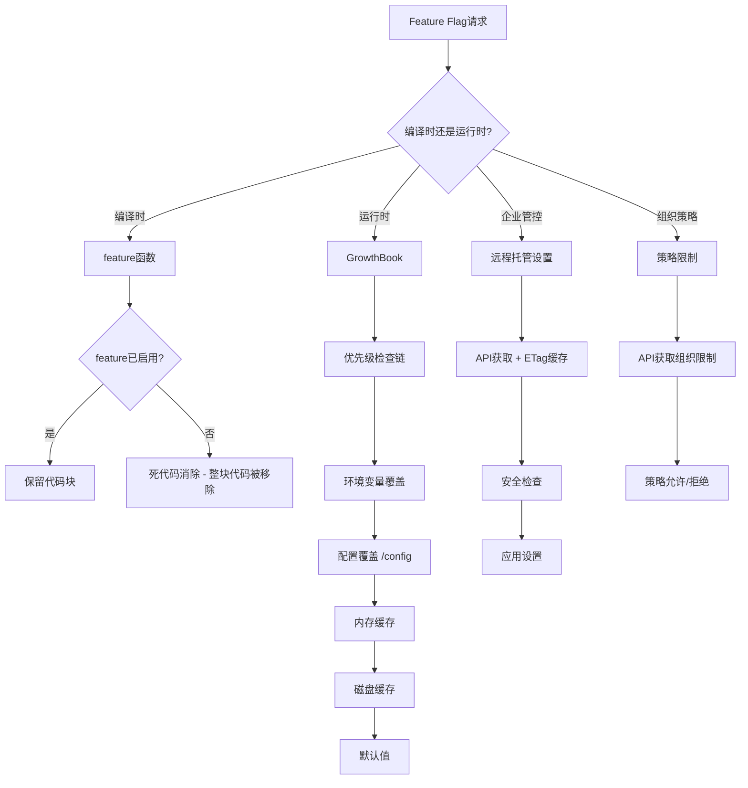

# 28. Feature Flags与构建系统

## 概述

Claude Code使用双层的Feature Flag系统：编译时通过`bun:bundle`的`feature()`函数实现死代码消除，运行时通过GrowthBook实现功能开关。这两种机制服务于不同的目的——`feature()`用于减小外部构建的二进制体积，GrowthBook用于A/B测试和灰度发布。此外，远程托管设置（Remote Managed Settings）和策略限制（Policy Limits）为企业客户提供了组织级别的配置控制。

## 双层Feature Flag架构



## 编译时Feature Flags

### feature()函数

`feature()`从`bun:bundle`模块导入，在构建时由Bun打包器进行内联替换。当某个feature未启用时，整个包含该feature检查的代码块会被死代码消除移除，完全不出现在最终二进制中。

```typescript
import { feature } from 'bun:bundle'

// 编译时feature检查
if (feature('KAIROS')) {
  // 这整段代码在外部构建中不存在
  const assistantModule = require('./assistant/index.js')
}
```

### 核心Feature Flags

在`src/entrypoints/cli.tsx`和`src/main.tsx`中，`feature()`调用控制着整个应用的功能模块加载：

| Feature Flag | 用途 | 影响范围 |
|-------------|------|---------|
| `ABLATION_BASELINE` | 消融基线测试 | CLI启动时的环境变量设置 |
| `COORDINATOR_MODE` | 协调器模式 | 多agent协调系统 |
| `KAIROS` | 助手模式 | 完整的交互式助手系统 |
| `KAIROS_BRIEF` | 简报模式 | 状态简报工具 |
| `KAIROS_CHANNELS` | 频道系统 | 多频道通信 |
| `PROACTIVE` | 主动推送 | 主动消息推送能力 |
| `TRANSCRIPT_CLASSIFIER` | 对话分类 | AFK模式、自动模式状态、安全分类器 |
| `BASH_CLASSIFIER` | Bash分类 | Bash命令安全分类 |
| `DAEMON` | 守护进程 | 后台守护进程工作模式 |
| `BG_SESSIONS` | 后台会话 | 后台会话管理（ps/logs/attach/kill） |
| `CHICAGO_MCP` | Computer Use MCP | 计算机使用MCP服务器 |
| `BRIDGE_MODE` | 桥接模式 | 远程控制/同步/桥接功能 |
| `DIRECT_CONNECT` | 直连 | P2P直连通信 |
| `SSH_REMOTE` | SSH远程 | SSH远程会话 |
| `LODESTONE` | 罗盘模块 | 特定功能模块 |
| `TEMPLATES` | 模板系统 | new/list/reply模板命令 |
| `BYOC_ENVIRONMENT_RUNNER` | BYOC环境运行器 | 自定义环境运行器 |
| `SELF_HOSTED_RUNNER` | 自托管运行器 | 自托管执行环境 |
| `WEB_BROWSER_TOOL` | Web浏览器工具 | 内置WebView浏览器 |
| `UDS_INBOX` | Unix域套接字收件箱 | 进程间消息传递 |
| `DUMP_SYSTEM_PROMPT` | 系统提示转储 | 调试用系统提示导出 |
| `UNATTENDED_RETRY` | 无人值守重试 | 无限重试529/429错误 |
| `CONNECTOR_TEXT` | 连接器文本 | 特殊文本块处理 |
| `ANTI_DISTILLATION_CC` | 反蒸馏 | 假工具注入防止模型蒸馏 |
| `CACHED_MICROCOMPACT` | 缓存微压缩 | 微压缩缓存优化 |
| `CCR` | Claude Code Remote | 远程模式JWT认证 |
| `UPLOAD_USER_SETTINGS` | 用户设置上传 | 设置同步功能 |

### feature()的工作原理

Bun打包器在构建时处理`feature()`调用的机制：

1. **内联替换**：`feature('X')`被替换为`true`或`false`常量
2. **死代码消除**：当替换为`false`时，包含该条件的整个代码块被移除
3. **条件导入**：`require()`调用放在`feature()`检查内部，使得整个模块及其依赖都不会被打包

```typescript
// 源代码
const coordinatorModule = feature('COORDINATOR_MODE')
  ? require('./coordinator/coordinatorMode.js')
  : null

// 外部构建（COORDINATOR_MODE=false）
const coordinatorModule = null

// 内部构建（COORDINATOR_MODE=true）
const coordinatorModule = require('./coordinator/coordinatorMode.js')
```

### 对代码架构的影响

`feature()`系统对代码架构产生了深远影响：

1. **懒加载require**：为避免循环依赖，条件导入使用`require()`而非ES `import`
2. **模块级变量**：feature检查的模块引用存储在模块级const变量中
3. **类型安全**：条件require的类型断言保持类型检查正确性

```typescript
// 典型模式：条件导入 + 类型断言
const autoModeStateModule = feature('TRANSCRIPT_CLASSIFIER')
  ? require('../../utils/permissions/autoModeState.js') as typeof import('../../utils/permissions/autoModeState.js')
  : null

// 使用时的空值检查
if (autoModeStateModule) {
  autoModeStateModule.someFunction()
}
```

## 运行时Feature Flags：GrowthBook

### GrowthBook集成

定义于`src/services/analytics/growthbook.ts`，GrowthBook提供了运行时的功能开关和A/B测试能力。

### 初始化流程

1. **创建客户端**：使用`clientKey`和用户属性创建GrowthBook实例
2. **远程评估**：`remoteEval: true`启用服务端预评估，避免客户端规则泄露
3. **有效载荷处理**：`processRemoteEvalPayload`处理API返回的数据，修复`value`/`defaultValue`格式差异
4. **磁盘同步**：`syncRemoteEvalToDisk`将特性值写入`~/.claude.json`的`cachedGrowthBookFeatures`字段
5. **通知订阅者**：`refreshed.emit()`通知所有监听器特性值已更新

### 值获取优先级

`getFeatureValue_CACHED_MAY_BE_STALE`的查找链：

1. **环境变量覆盖**：`CLAUDE_INTERNAL_FC_OVERRIDES`（仅ant用户）
2. **配置覆盖**：`/config` Gates标签页设置（仅ant用户）
3. **内存缓存**：`remoteEvalFeatureValues` Map
4. **磁盘缓存**：`getGlobalConfig().cachedGrowthBookFeatures`
5. **默认值**

### 多种获取模式

| 函数 | 阻塞性 | 用途 |
|-----|--------|------|
| `getFeatureValue_CACHED_MAY_BE_STALE` | 非阻塞 | 启动关键路径，可能过期 |
| `getFeatureValue_DEPRECATED` | 阻塞 | 需要最新值，可能慢启动 |
| `getDynamicConfig_BLOCKS_ON_INIT` | 阻塞 | 动态配置，等待初始化 |
| `getDynamicConfig_CACHED_MAY_BE_STALE` | 非阻塞 | 动态配置，接受过期 |
| `checkGate_CACHED_OR_BLOCKING` | 条件阻塞 | 快速路径返回true，慢路径阻塞 |
| `checkSecurityRestrictionGate` | 条件阻塞 | 安全门控，等待重新初始化 |

### 定期刷新

- **ant用户**：每20分钟刷新
- **外部用户**：每6小时刷新
- 刷新使用轻量级`refreshFeatures()`，不重建客户端
- 认证变更时使用`refreshGrowthBookAfterAuthChange()`，完全重建客户端

### 实验暴露日志

当特性来源为实验时，GrowthBook记录实验暴露事件：
- 每个特性每个会话最多记录一次（`loggedExposures`去重）
- 通过`logGrowthBookExperimentTo1P`发送到1P事件日志
- 在特性访问前注册的暴露被延迟到初始化完成后

### 订阅机制

`onGrowthBookRefresh`允许系统订阅特性值变更通知：
- 订阅者自行做变更检测（使用`isEqual`）
- 初始化已完成时，新订阅者在下一个微任务收到catch-up通知
- 不受`resetGrowthBook`影响（跨认证重置保持）

## 远程托管设置（Remote Managed Settings）

定义于`src/services/remoteManagedSettings/`，为企业管理员提供远程配置Claude Code设置的能力。

### 资格判定

- Console用户（API Key）：所有用户均有资格
- OAuth用户：仅Enterprise/C4E和Team订阅者有资格
- 3P提供商用户：无资格

### 工作流程

1. **启动加载**：`loadRemoteManagedSettings()`在CLI初始化时调用
2. **缓存优先**：先应用磁盘缓存，再异步获取最新设置
3. **ETag缓存**：使用SHA-256 checksum作为ETag，304 Not Modified时跳过更新
4. **安全检查**：`checkManagedSettingsSecurity`检测危险设置变更
5. **后台轮询**：每小时检查一次设置变更
6. **失败开放**：获取失败时使用缓存设置继续运行

### 安全检查

当远程设置发生变更时，`securityCheck.tsx`会检测潜在的危险操作（如权限范围扩大），并在应用前向用户确认。

### 文件缓存

设置保存在`~/.claude/remote-managed-settings.json`，包含：
- 完整的`SettingsJson`对象
- 通过Zod schema验证
- checksum在需要时从内容重新计算

## 策略限制（Policy Limits）

定义于`src/services/policyLimits/`，从API获取组织级别的功能限制。

### 工作方式

1. **获取限制**：`loadPolicyLimits()`从`/api/claude_code/policy_limits`获取
2. **缓存机制**：与远程托管设置相同的ETag/文件缓存模式
3. **策略检查**：`isPolicyAllowed(policy)`检查特定策略是否允许
4. **失败开放**：默认允许未知/不可用的策略

### 特殊处理

在essential-traffic-only模式下，`ESSENTIAL_TRAFFIC_DENY_ON_MISS`集合中的策略在缓存不可用时默认拒绝（而非允许），防止HIPAA组织因网络问题意外启用受限功能。

### 响应格式

```typescript
type PolicyLimitsResponse = {
  restrictions: Record<string, { allowed: boolean }>
}
```

仅包含被限制的策略，未出现的策略默认允许。

## 编译时与运行时的协同

两种Feature Flag机制的协同关系：

| 维度 | feature() | GrowthBook |
|------|-----------|------------|
| 时机 | 编译时 | 运行时 |
| 目的 | 减小二进制体积 | A/B测试/灰度发布 |
| 粒度 | 模块级别 | 特性值级别 |
| 变更 | 需要重新构建 | 实时生效 |
| 安全性 | 代码完全不存在 | 代码存在但被禁用 |
| 典型用途 | 内部工具/实验功能 | 用户体验优化/功能开关 |

在某些场景中，两者会协同工作。例如`TRANSCRIPT_CLASSIFIER` feature flag同时控制：
- 编译时：AFK模式代码、自动模式状态模块的包含/排除
- 运行时：通过GrowthBook控制相关行为的启用/禁用

## 设置系统集成

`src/utils/settings/settings.ts`整合了所有配置源：

1. **项目设置**：`.claude/settings.json`
2. **用户设置**：`~/.claude/settings.json`
3. **远程托管设置**：来自API的企业级设置
4. **策略限制**：组织级功能限制
5. **GrowthBook覆盖**：`/config` Gates标签页

设置合并遵循优先级：远程托管 > 策略限制 > 用户 > 项目，确保企业管控始终优先于个人偏好。

## 总结

Claude Code的Feature Flag系统是一个精心设计的双层架构：编译时通过`feature()`实现死代码消除，将内部功能完全从外部构建中移除，既减小了二进制体积又保护了知识产权；运行时通过GrowthBook实现了细粒度的功能开关、A/B测试和灰度发布，配合多层缓存和失败开放策略确保了稳定性。远程托管设置和策略限制为企业客户提供了组织级别的配置控制，安全检查机制防止了危险设置的静默应用。这种架构使得Claude Code能够在同一个代码库中维护多种构建变体，同时保持高度的灵活性和安全性。
