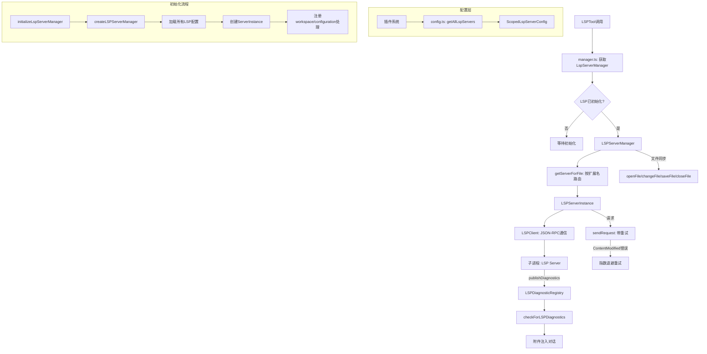

# 29. LSP语言服务集成

## 概述

Claude Code通过Language Server Protocol（LSP）集成了语言智能服务，位于`src/services/lsp/`目录。该系统实现了完整的LSP客户端，支持多种编程语言的代码分析、诊断、导航等功能。LSP集成使得Claude Code能够在代码编辑后自动检查诊断信息，在agent循环中访问语言智能（如跳转定义、查找引用等），为AI辅助编程提供了精准的代码理解能力。

## 架构总览



## 核心组件

### LSPClient

定义于`src/services/lsp/LSPClient.ts`，`LSPClient`是LSP协议的底层通信层，使用`vscode-jsonrpc`库通过stdio与LSP服务器进程通信。

#### 接口定义

```typescript
export type LSPClient = {
  readonly capabilities: ServerCapabilities | undefined
  readonly isInitialized: boolean
  start(command, args, options?): Promise<void>
  initialize(params: InitializeParams): Promise<InitializeResult>
  sendRequest<TResult>(method, params): Promise<TResult>
  sendNotification(method, params): Promise<void>
  onNotification(method, handler): void
  onRequest<TParams, TResult>(method, handler): void
  stop(): Promise<void>
}
```

#### 进程生命周期管理

`start`方法启动LSP服务器进程，关键步骤：

1. **spawn子进程**：以stdio模式启动，stdin/stdout用于JSON-RPC通信
2. **等待spawn确认**：监听`spawn`事件确保进程成功启动，避免ENOENT等异步错误导致未处理的Promise拒绝
3. **创建JSON-RPC连接**：使用`StreamMessageReader`和`StreamMessageWriter`包装进程的stdio流
4. **注册错误处理**：连接错误和进程退出都有对应处理
5. **启用协议追踪**：`Trace.Verbose`模式记录所有JSON-RPC消息
6. **应用排队的处理器**：在连接建立前注册的处理器被排队，连接建立后批量应用

#### 崩溃处理

`onCrash`回调在进程非正常退出时被调用，将状态传播到`LSPServerInstance`，使其可以在下次使用时重启。`isStopping`标志防止正常关闭时触发错误日志。

#### 懒初始化处理器

通知和请求处理器可以在连接建立前注册，会被暂存在`pendingHandlers`和`pendingRequestHandlers`队列中，连接建立后自动应用。这解决了LSP客户端创建和连接建立的时序问题。

#### 优雅停止

`stop`方法遵循LSP协议规范：
1. 发送`shutdown`请求
2. 发送`exit`通知
3. 释放连接资源
4. 终止子进程
5. 清理所有事件监听器，防止内存泄漏

### LSPServerInstance

定义于`src/services/lsp/LSPServerInstance.ts`，`LSPServerInstance`管理单个LSP服务器实例的完整生命周期。

#### 状态机

服务器实例的状态转换：

```
stopped → starting → running
running → stopping → stopped
any → error（失败时）
error → starting（重试时）
```

#### 崩溃恢复

- `crashRecoveryCount`跟踪崩溃恢复次数
- 超过`maxRestarts`（默认3次）后拒绝重启
- 崩溃时状态自动设置为`error`，`ensureServerStarted`在下次使用时触发重启

#### 初始化参数

`start`方法发送完整的LSP初始化参数：

**工作区信息**：
- `workspaceFolders`：LSP 3.16+推荐的现代方式
- `rootPath`/`rootUri`：旧版兼容，部分服务器（如typescript-language-server）仍需要

**客户端能力声明**：
- 文本同步：支持didSave，不支持willSave/willSaveWaitUntil
- 诊断：支持相关信息、标签（Unnecessary/Deprecated）、代码描述
- 悬停：支持markdown和纯文本格式
- 定义：支持LocationLink
- 引用/文档符号/调用层次结构：基本支持
- 位置编码：UTF-16

**显式禁用的能力**：
- `workspace.configuration: false` - 防止服务器请求我们无法提供的配置
- `workspace.workspaceFolders: false` - 防止工作区文件夹变更通知

#### ContentModified重试

`sendRequest`实现了对LSP `ContentModified`错误（代码-32801）的自动重试：
- 最多重试3次
- 指数退避：500ms, 1000ms, 2000ms
- 常见于rust-analyzer等项目索引期间

### LSPServerManager

定义于`src/services/lsp/LSPServerManager.ts`，`LSPServerManager`协调多个LSP服务器实例，基于文件扩展名路由请求。

#### 文件扩展名路由

1. 初始化时从配置中读取每个服务器支持的扩展名
2. 构建`extensionMap`：扩展名 → 服务器名称列表
3. 请求时通过`path.extname`查找对应服务器

#### 文件同步

LSP协议要求服务器在处理请求前知道文件内容。`LSPServerManager`实现了完整的文件同步协议：

| 方法 | LSP通知 | 说明 |
|------|---------|------|
| `openFile` | `textDocument/didOpen` | 首次访问时发送文件内容和语言ID |
| `changeFile` | `textDocument/didChange` | 文件内容变更时发送全文更新 |
| `saveFile` | `textDocument/didSave` | 文件保存时通知（触发诊断） |
| `closeFile` | `textDocument/didClose` | 文件关闭时通知 |

关键设计：
- **去重**：`openedFiles` Map跟踪每个URI在哪个服务器上打开，避免重复didOpen
- **自动打开**：changeFile在文件未打开时自动降级为openFile
- **语言ID映射**：从服务器的`extensionToLanguage`配置中获取

#### workspace/configuration处理

某些LSP服务器（如TypeScript）即使在客户端声明不支持`workspace/configuration`时也会发送请求。`LSPServerManager`为每个服务器实例注册了处理器，返回`null`满足协议而不提供实际配置。

### LSPDiagnosticRegistry

定义于`src/services/lsp/LSPDiagnosticRegistry.ts`，诊断注册表存储LSP服务器异步发送的诊断信息。

#### 诊断流程

```
LSP Server → publishDiagnostics通知
           → registerPendingLSPDiagnostic()
           → 存储到pendingDiagnostics Map
           → checkForLSPDiagnostics()
           → 去重 + 限流
           → 附件注入对话
```

#### 去重机制

两层去重确保同一诊断不会重复显示：
1. **批次内去重**：同一批次中的重复诊断通过`createDiagnosticKey`（消息+严重性+范围+来源+代码的哈希）去除
2. **跨轮次去重**：`deliveredDiagnostics` LRU缓存（最多500个文件）跟踪已交付的诊断

#### 容量限制

- 每个文件最多10条诊断
- 总共最多30条诊断
- 按严重性排序优先显示错误，其次是警告、信息和提示

#### 文件编辑后重置

`clearDeliveredDiagnosticsForFile`在文件被编辑时调用，使得新的诊断能够再次显示（即使与之前相同）。

### 管理器单例

定义于`src/services/lsp/manager.ts`，管理器单例控制LSP系统的全局生命周期。

#### 初始化状态

```typescript
type InitializationState = 'not-started' | 'pending' | 'success' | 'failed'
```

- `initializeLspServerManager()`：创建管理器实例，异步初始化不阻塞启动
- `waitForInitialization()`：等待初始化完成
- `reinitializeLspServerManager()`：强制重新初始化（插件刷新后调用）
- `shutdownLspServerManager()`：优雅关闭所有服务器

#### 代数计数器

`initializationGeneration`防止过期的初始化Promise更新状态。当重新初始化时，旧Promise的回调检查代数是否匹配，不匹配则跳过。

#### 裸模式跳过

`--bare`/SIMPLE模式下跳过LSP初始化，因为脚本化调用不需要编辑器集成功能。

## LSPTool集成

定义于`src/tools/LSPTool/LSPTool.ts`，LSPTool是将LSP能力暴露给agent循环的工具。

### 支持的操作

| 操作 | LSP方法 | 说明 |
|------|---------|------|
| `goToDefinition` | `textDocument/definition` | 跳转到定义 |
| `findReferences` | `textDocument/references` | 查找所有引用 |
| `hover` | `textDocument/hover` | 获取悬停信息 |
| `documentSymbol` | `textDocument/documentSymbol` | 文档符号列表 |
| `workspaceSymbol` | `workspace/symbol` | 工作区符号搜索 |
| `goToImplementation` | `textDocument/implementation` | 跳转到实现 |
| `prepareCallHierarchy` | `textDocument/prepareCallHierarchy` | 准备调用层次 |
| `incomingCalls` | `callHierarchy/incomingCalls` | 来电层次 |
| `outgoingCalls` | `callHierarchy/outgoingCalls` | 去电层次 |

### 调用流程

1. **等待初始化**：如果LSP还在初始化中，等待完成
2. **文件打开**：确保文件在LSP服务器中已打开（必要时读取文件内容）
3. **发送请求**：通过LSPServerManager发送请求到对应服务器
4. **结果过滤**：使用`git check-ignore`过滤掉gitignore文件中的结果
5. **格式化输出**：根据操作类型格式化结果

### 两步式调用

`incomingCalls`和`outgoingCalls`需要两步：
1. 先调用`prepareCallHierarchy`获取`CallHierarchyItem`
2. 再使用item调用`callHierarchy/incomingCalls`或`callHierarchy/outgoingCalls`

### 延迟加载

LSPTool设置了`shouldDefer: true`，当LSP初始化未完成时，工具以`defer_loading: true`状态发送给API，模型不会调用它直到LSP准备就绪。

### 文件大小限制

超过10MB的文件不进行LSP分析，避免内存和性能问题。

## 配置系统

### 插件化配置

定义于`src/services/lsp/config.ts`，LSP服务器配置完全通过插件系统提供，不支持用户/项目级设置。

```typescript
export async function getAllLspServers(): Promise<{
  servers: Record<string, ScopedLspServerConfig>
}>
```

1. 加载所有已启用的插件
2. 并行从每个插件获取LSP服务器配置
3. 合并到`allServers`对象中

### ScopedLspServerConfig

每个LSP服务器配置包含：
- `command`：启动命令
- `args`：命令参数
- `env`：环境变量
- `workspaceFolder`：工作区目录
- `extensionToLanguage`：文件扩展名到语言ID的映射
- `initializationOptions`：初始化选项
- `startupTimeout`：启动超时
- `maxRestarts`：最大重启次数

## 文件编辑集成

LSP与文件编辑工具（FileEditTool/FileWriteTool）的集成流程：

1. **编辑前**：文件可能已在LSP服务器中打开
2. **编辑后**：通过`changeFile`通知LSP服务器内容变更
3. **保存时**：`saveFile`触发LSP服务器重新分析
4. **诊断发布**：LSP服务器异步发送`publishDiagnostics`
5. **诊断收集**：`LSPDiagnosticRegistry`收集并去重
6. **诊断注入**：在下一次query中作为附件注入对话

这种异步集成确保了编辑操作不会被LSP分析阻塞，同时诊断信息能够及时反馈到对话中。

## 多语言支持

LSP集成通过插件配置支持多种编程语言，每种语言可以配置独立的LSP服务器。系统不内置任何语言服务器定义，完全依赖插件系统提供。这意味着：
- 添加新语言支持只需添加插件配置
- 不同项目可以有不同的语言服务器配置
- 服务器实例按需启动，不影响不使用LSP的场景

## 总结

Claude Code的LSP集成是一个完整的、模块化的语言服务系统。从底层的JSON-RPC通信（LSPClient），到服务器实例生命周期管理（LSPServerInstance），到多服务器协调和文件同步（LSPServerManager），再到诊断收集和注入（LSPDiagnosticRegistry），每一层都有清晰的职责边界。LSPTool将这些能力暴露给agent循环，使AI能够利用精确的代码理解能力进行辅助编程。整个系统采用纯函数式风格（工厂函数+闭包而非类），与Vim模拟系统的设计哲学一致，通过懒加载、延迟初始化和后台初始化确保不影响启动速度。
