# 30. Web搜索与获取工具

## 概述

Claude Code通过WebFetchTool和WebSearchTool两个工具实现了外部信息获取能力。这两个工具构成了系统边界上的关键接口——外部数据通过它们进入Claude Code的对话上下文。WebFetchTool从指定URL获取内容并转换为markdown，WebSearchTool通过网络搜索获取最新信息。两者都有严格的安全机制，包括域名黑名单检查、重定向控制和认证URL限制。

## 架构总览

```mermaid
flowchart TD
    subgraph WebFetchTool
        A[用户URL输入] --> B[URL验证]
        B --> C{HTTP自动升级HTTPS}
        C --> D[域名黑名单检查]
        D -->|允许| E[HTTP获取]
        D -->|阻止| F[DomainBlockedError]
        D -->|检查失败| G[DomainCheckFailedError]

        E --> H{重定向?}
        H -->|同源重定向| E
        H -->|跨源重定向| I[返回重定向信息]
        H -->|无重定向| J[内容转换]

        J --> K{预批准域名?}
        K -->|是 + markdown + 小于100K| L[直接返回内容]
        K -->|否| M[applyPromptToMarkdown]
        M --> N[Haiku模型处理]
        N --> O[返回处理结果]

        E --> P[15分钟LRU缓存]
    end

    subgraph WebSearchTool
        Q[搜索查询] --> R[构建web_search工具schema]
        R --> S[queryModelWithStreaming]
        S --> T[API内置web_search执行]
        T --> U[流式结果解析]
        U --> V[server_tool_use + web_search_tool_result]
        V --> W[makeOutputFromSearchResponse]
        W --> X[格式化输出 + Sources提醒]
    end

    subgraph 安全层
        Y[域名预批准列表]
        Z[权限检查系统]
        AA[URL长度限制 2000]
        BB[内容大小限制 10MB]
        CC[禁止用户名/密码URL]
    end
```



## WebFetchTool

### 工具定义

定义于`src/tools/WebFetchTool/WebFetchTool.ts`，WebFetchTool从URL获取内容，将HTML转换为markdown，并可选择用AI模型处理内容。

#### 输入Schema

```typescript
z.strictObject({
  url: z.string().url(),       // 必须是合法URL
  prompt: z.string(),           // 对获取内容执行的提示
})
```

#### 输出Schema

```typescript
z.object({
  bytes: z.number(),            // 内容字节数
  code: z.number(),             // HTTP状态码
  codeText: z.string(),         // HTTP状态文本
  result: z.string(),           // 处理后的结果
  durationMs: z.number(),       // 耗时
  url: z.string(),              // 获取的URL
})
```

### URL获取流程

#### URL验证

`validateURL`函数执行严格验证：
- URL长度不超过2000字符
- 必须能被`new URL()`解析
- 不能包含用户名或密码
- 主机名必须是公网可解析的（至少两级域名）

#### 域名黑名单检查

`checkDomainBlocklist`通过Anthropic API检查域名是否被允许获取：
- 请求`https://api.anthropic.com/api/web_fetch/domain_info?domain=...`
- `can_fetch === true`时域名被缓存5分钟
- 被阻止或检查失败时抛出对应错误
- 企业用户可通过`skipWebFetchPreflight`设置跳过检查

#### HTTP获取

`getWithPermittedRedirects`实现了安全的重定向处理：
- 禁用自动重定向（`maxRedirects: 0`）
- 手动检查重定向并验证安全性
- 同源重定向（允许www前缀变化）自动跟随
- 跨源重定向返回重定向信息，让Claude决定是否继续
- 最多10次同源重定向，防止无限循环

#### 内容转换

获取的内容根据Content-Type进行不同处理：
- **HTML**（`text/html`）：使用Turndown库转换为markdown
- **其他类型**：直接使用原始文本

Turndown库懒加载（~1.4MB），只在首次HTML获取时初始化。

#### 二进制内容处理

对于二进制内容（PDF等），系统：
1. 将原始字节保存到磁盘（带MIME类型推导的扩展名）
2. 仍然尝试UTF-8解码（PDF的ASCII结构足够Haiku总结）
3. 在结果中附加保存路径信息

### 内容处理策略

#### 预批准域名

对于预批准域名（如Claude Code文档站），如果内容是markdown且小于100K字符，直接返回内容不经过模型处理，节省token和时间。

#### AI模型处理

`applyPromptToMarkdown`将内容和提示发送给Haiku模型处理：
- 内容超过100K字符时截断
- 使用`queryHaiku`发送请求
- 查询源标记为`web_fetch_apply`
- 支持中止信号传播

### 缓存机制

URL内容缓存使用LRU缓存：
- **TTL**：15分钟
- **最大大小**：50MB
- **键**：原始URL（不是升级或重定向后的URL）
- **大小计算**：基于markdown内容的字节长度

### 权限系统

WebFetchTool的权限检查基于域名：
1. **预批准主机**：自动允许，无需用户确认
2. **域名级规则**：`domain:hostname`格式的权限规则
3. **默认行为**：需要用户确认

### 重定向处理

跨源重定向时不自动跟随，返回包含原始URL、重定向URL和状态码的信息，让Claude决定是否使用新URL再次调用WebFetch。这防止了开放重定向攻击——攻击者可以利用可信域的开放重定向漏洞将用户引导到恶意域。

### 安全提示

工具的prompt始终包含认证URL警告，无论ToolSearch是否当前可用：

```
IMPORTANT: WebFetch WILL FAIL for authenticated or private URLs.
Before using this tool, check if the URL points to an authenticated
service (e.g. Google Docs, Confluence, Jira, GitHub). If so, look
for a specialized MCP tool that provides authenticated access.
```

这个提示不会根据ToolSearch的可用性动态切换，因为切换会导致工具描述在SDK query()调用之间闪烁，使API prompt缓存失效。

## WebSearchTool

### 工具定义

定义于`src/tools/WebSearchTool/WebSearchTool.ts`，WebSearchTool利用API内置的web_search功能进行网络搜索。

#### 输入Schema

```typescript
z.strictObject({
  query: z.string().min(2),                   // 搜索查询
  allowed_domains: z.array(z.string()).optional(), // 仅包含这些域名的结果
  blocked_domains: z.array(z.string()).optional(), // 排除这些域名的结果
})
```

#### 输出Schema

```typescript
z.object({
  query: z.string(),                                    // 执行的搜索查询
  results: z.array(z.union([searchResultSchema, z.string()])), // 搜索结果和评论
  durationSeconds: z.number(),                          // 耗时
})
```

### 搜索流程

WebSearchTool的搜索流程与普通工具不同——它不直接调用搜索API，而是通过Claude API的内置`web_search`工具执行搜索：

1. **构建用户消息**：创建包含搜索查询的用户消息
2. **构建工具Schema**：创建`web_search_20250305`类型的工具定义
3. **调用API**：通过`queryModelWithStreaming`发送请求
4. **流式解析**：处理流式响应中的多种内容块
5. **结果组装**：将搜索结果和文本评论组装为输出

### 流式结果解析

API返回的流式响应包含以下内容块类型：

| 内容块类型 | 说明 |
|-----------|------|
| `server_tool_use` | API发起的搜索请求 |
| `web_search_tool_result` | 搜索结果（含标题和URL） |
| `text` | 文本评论（含引用标记） |

解析逻辑：
- 文本块在搜索结果之前或之间出现，作为评论保留
- 搜索结果包含`tool_use_id`和`content`数组
- 错误结果包含`error_code`而非搜索链接

### 进度报告

搜索过程中实时报告进度：
- **查询更新**：当`input_json_delta`中提取到完整查询时
- **结果接收**：当`web_search_tool_result`内容块开始时

### 模型选择

搜索使用的模型由GrowthBook特性`tengu_plum_vx3`控制：
- **启用**：使用Haiku模型 + `tool_choice: { type: 'tool', name: 'web_search' }`
- **禁用**：使用主循环模型 + 自然提示

### 提供商兼容性

WebSearchTool的可用性取决于提供商：
- **1P**：始终可用
- **Vertex**：仅Claude 4.0+模型支持
- **Foundry**：始终可用（Foundry仅发布支持Web Search的模型）
- **Bedrock**：不支持

### 输入验证

- 查询不能为空
- 不能同时指定`allowed_domains`和`blocked_domains`

### 结果格式化

搜索结果被格式化为包含以下信息的文本：
- 搜索查询
- 搜索结果链接（JSON格式）
- 文本摘要
- 必须包含Sources部分的提醒

## 安全考虑

### 系统边界验证

WebFetchTool和WebSearchTool是外部数据进入Claude Code的两个主要入口。作为系统边界验证器，它们需要处理各种安全问题：

#### 数据泄露防护

- **URL长度限制**：2000字符上限，降低通过URL参数泄露数据的风险
- **禁止认证信息**：URL中不允许包含用户名/密码
- **内容大小限制**：10MB上限，防止资源消耗攻击
- **获取超时**：60秒超时，防止悬挂请求

#### 重定向安全

- **禁止自动跨源重定向**：防止开放重定向攻击
- **同源重定向限制**：最多10次，防止无限循环
- **重定向URL验证**：与原始URL相同的安全检查

#### 域名安全

- **黑名单检查**：通过Anthropic API验证域名安全性
- **预批准列表**：特定域名免确认
- **域名缓存**：5分钟缓存减少重复检查
- **出口代理检测**：检测`X-Proxy-Error: blocked-by-allowlist`响应

#### 内容安全

- **HTML转换**：Turndown将HTML转为纯markdown，去除脚本和样式
- **内容截断**：100K字符限制防止token爆炸
- **模型处理**：通过Haiku模型二次处理，过滤敏感内容

### MCP工具推荐

当URL指向需要认证的服务时（Google Docs、Confluence、Jira、GitHub等），工具提示Claude查找专门的MCP工具，这些工具提供了认证访问能力，避免了WebFetch无法获取需要登录的内容的问题。

## 工具特性对比

| 特性 | WebFetchTool | WebSearchTool |
|------|-------------|---------------|
| 数据来源 | 指定URL | 网络搜索 |
| 内容类型 | HTML/PDF/原始文本 | 搜索结果链接+摘要 |
| 模型处理 | Haiku处理内容 | API内置搜索 |
| 缓存 | 15分钟LRU缓存 | 无客户端缓存 |
| 重定向 | 手动安全处理 | API内部处理 |
| 域名过滤 | 黑名单检查 | allowed/blocked_domains |
| 认证URL | 会失败 | 不适用 |
| 权限模型 | 域名级规则 | 通用许可 |
| 只读性 | 是 | 是 |
| 并发安全 | 是 | 是 |
| 延迟加载 | 是 | 是 |

## 请求限制

### WebFetchTool限制

- **URL长度**：最大2000字符
- **HTTP内容大小**：最大10MB
- **获取超时**：60秒
- **域名检查超时**：10秒
- **同源重定向**：最多10次
- **Markdown内容**：最大100K字符
- **缓存TTL**：15分钟
- **缓存总大小**：50MB

### WebSearchTool限制

- **最大搜索次数**：每次调用8次（`max_uses: 8`）
- **查询最小长度**：2字符

## 与Agent循环的集成

两个工具在agent循环中的角色：

1. **WebFetchTool**：当Claude需要获取特定网页内容时调用
2. **WebSearchTool**：当Claude需要搜索最新信息时调用

两者都标记为`shouldDefer: true`，意味着在API请求中可以被延迟加载。两者都是只读的（`isReadOnly: true`），不会修改文件系统。两者都是并发安全的（`isConcurrencySafe: true`），可以并行调用。

搜索结果和获取内容都作为工具结果注入对话上下文，Claude基于这些信息生成回复时必须包含Sources部分（对于搜索）或引用来源URL（对于获取）。

## 总结

WebFetchTool和WebSearchTool构成了Claude Code的外部信息获取层。WebFetchTool通过安全的HTTP获取和内容转换提供特定URL的内容访问，WebSearchTool通过API内置搜索提供网络信息检索。两者的设计都强调了安全性——域名黑名单、重定向控制、URL验证、内容大小限制等多层防护机制确保外部数据安全地进入系统。作为系统边界上的关键接口，这些工具的设计体现了"最小权限"和"防御性编程"的原则，在功能性和安全性之间取得了平衡。
