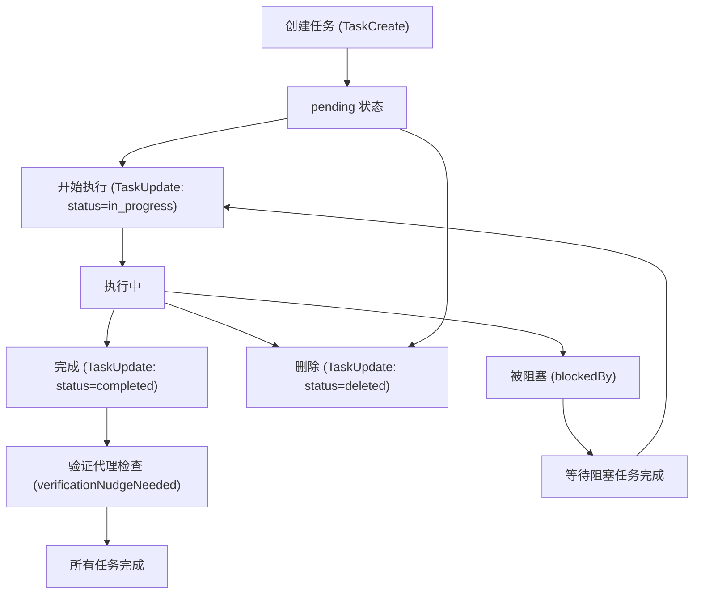

# 任务与Todo管理

## 概述

Claude Code 的任务管理系统经历了从简单的 Todo 列表到功能完善的 Task 系统的演进。V1 版本的 `TodoWriteTool` 提供轻量级的会话内任务清单，V2 版本的 Task 工具集（`TaskCreateTool`、`TaskUpdateTool`、`TaskListTool`、`TaskGetTool`、`TaskOutputTool`、`TaskStopTool`）则提供了更丰富的任务生命周期管理，包括状态流转、依赖关系、所有权分配、后台任务输出获取和验证代理等功能。两套系统通过 `isTodoV2Enabled()` 开关进行切换，在交互式会话中默认使用 V2。

## 系统版本对比

| 特性 | V1 (TodoWriteTool) | V2 (Task 工具集) |
|------|-------------------|-----------------|
| 数据存储 | AppState.todos（内存） | 文件系统（`~/.claude/tasks/`） |
| 任务标识 | 无 ID | 自增数字 ID |
| 状态 | pending/in_progress/completed | pending/in_progress/completed/deleted |
| 依赖关系 | 不支持 | blocks/blockedBy |
| 所有权 | 不支持 | owner 字段 |
| 并发安全 | 否 | 是（isConcurrencySafe） |
| 代理协作 | 不支持 | 支持队友邮件通知 |
| 验证代理 | 支持（verificationNudgeNeeded） | 支持（verificationNudgeNeeded） |
| 元数据 | 不支持 | metadata（Record<string, unknown>） |
| 后台任务 | 不涉及 | TaskOutputTool / TaskStopTool |

## 任务生命周期



## V1: TodoWriteTool

### 核心设计

`TodoWriteTool`（位于 `src/tools/TodoWriteTool/TodoWriteTool.ts`）是一个简化的任务管理工具，适用于不需要复杂依赖关系的场景。它将整个待办列表作为一个原子操作进行更新。

### 输入模式

```typescript
z.strictObject({
  todos: TodoListSchema().describe("The updated todo list"),
})
```

### 输出模式

```typescript
z.object({
  oldTodos: TodoListSchema().describe("The todo list before the update"),
  newTodos: TodoListSchema().describe("The todo list after the update"),
  verificationNudgeNeeded: z.boolean().optional(),
})
```

### 关键行为

1. **全部完成自动清空**：当所有 todo 项都标记为 `completed` 时，`newTodos` 被设置为空数组 `[]`，避免在界面上显示已完成的列表。

2. **会话隔离**：使用 `context.agentId ?? getSessionId()` 作为键，每个代理或会话拥有独立的 todo 列表，互不干扰。

3. **验证代理提示**：当主线程代理关闭了 3 个或更多任务且其中没有验证步骤时，`verificationNudgeNeeded` 被设置为 `true`，在工具结果中追加验证代理提醒，确保复杂工作得到验证。

4. **权限豁免**：`checkPermissions` 始终返回 `{ behavior: 'allow' }`，todo 操作不需要用户确认。

5. **V2 互斥**：`isEnabled()` 返回 `!isTodoV2Enabled()`，当 V2 启用时 V1 自动禁用。

## V2: Task 工具集

### TaskCreateTool

`TaskCreateTool`（位于 `src/tools/TaskCreateTool/TaskCreateTool.ts`）用于创建新任务。

#### 输入模式

```typescript
z.strictObject({
  subject: z.string().describe("A brief title for the task"),
  description: z.string().describe("What needs to be done"),
  activeForm: z.string().optional()
    .describe('Present continuous form shown in spinner when in_progress'),
  metadata: z.record(z.string(), z.unknown()).optional()
    .describe("Arbitrary metadata to attach to the task"),
})
```

#### 核心流程

1. 调用 `createTask(getTaskListId(), {...})` 创建任务，初始状态为 `pending`，`owner` 为 `undefined`，`blocks` 和 `blockedBy` 为空数组。
2. 执行 `TaskCreated` 钩子（`executeTaskCreatedHooks`），如果任何钩子返回 `blockingError`，则删除刚创建的任务并抛出异常。
3. 自动展开任务列表视图（`setAppState({ expandedView: 'tasks' })`）。
4. 返回任务 ID 和标题。

#### 钩子集成

`TaskCreated` 钩子允许外部系统在任务创建时进行干预。例如，CI/CD 系统可以拒绝不符合规范的任务，安全系统可以阻止敏感操作的任务创建。阻塞错误会触发任务回滚（先创建后删除）。

### TaskUpdateTool

`TaskUpdateTool`（位于 `src/tools/TaskUpdateTool/TaskUpdateTool.ts`）是任务系统中功能最丰富的工具，支持字段更新、状态流转、依赖管理和所有权变更。

#### 输入模式

```typescript
z.strictObject({
  taskId: z.string().describe("The ID of the task to update"),
  subject: z.string().optional(),
  description: z.string().optional(),
  activeForm: z.string().optional(),
  status: TaskUpdateStatusSchema.optional(), // 包含 'deleted' 特殊状态
  addBlocks: z.array(z.string()).optional()
    .describe("Task IDs that this task blocks"),
  addBlockedBy: z.array(z.string()).optional()
    .describe("Task IDs that block this task"),
  owner: z.string().optional(),
  metadata: z.record(z.string(), z.unknown()).optional(),
})
```

#### 状态流转

- **pending → in_progress**：任务开始执行。在 `isAgentSwarmsEnabled()` 启用时，如果代理未显式指定 owner 且任务当前无 owner，则自动将 `agentName` 设置为 owner。
- **in_progress → completed**：任务完成。执行 `TaskCompleted` 钩子，阻塞错误会阻止状态变更。
- **任意 → deleted**：特殊状态，直接调用 `deleteTask()` 删除任务文件，绕过常规更新流程。

#### 依赖管理

- **addBlocks**：指定当前任务阻塞的其他任务 ID。对于新添加的阻塞关系，调用 `blockTask(taskListId, taskId, blockId)`。
- **addBlockedBy**：指定阻塞当前任务的其他任务 ID。反向调用 `blockTask(taskListId, blockerId, taskId)` 建立阻塞关系。

依赖关系在 `TaskListTool` 输出中通过 `blockedBy` 字段体现，已完成任务的 ID 会被过滤，不会显示为阻塞项。

#### 所有权与队友通知

当 `owner` 字段变更且 `isAgentSwarmsEnabled()` 启用时：
1. 通过 `writeToMailbox()` 向新 owner 的邮箱发送 `task_assignment` 消息。
2. 消息包含任务 ID、标题、描述、分配者和时间戳。
3. 在进程内队友模式下，队友完成当前任务后会收到提示调用 `TaskList` 查找下一个可用任务。

#### 验证代理提示

与 V1 类似，当主线程代理将任务标记为 `completed` 且所有任务均已完成（3 个以上）且无验证步骤时，设置 `verificationNudgeNeeded = true`。此逻辑位于 `TaskUpdateTool` 中，确保 V2 交互式会话也获得验证保护。

### TaskGetTool

`TaskGetTool`（位于 `src/tools/TaskGetTool/TaskGetTool.ts`）用于获取单个任务的完整详情。

#### 输出内容

- `id`：任务 ID
- `subject`：任务标题
- `description`：任务描述
- `status`：当前状态
- `blocks`：该任务阻塞的其他任务 ID 列表
- `blockedBy`：阻塞该任务的其他任务 ID 列表

如果任务不存在，返回 `{ task: null }`，工具结果消息为 "Task not found"。

该工具标记为 `isReadOnly: true`，不会修改任何状态。

### TaskListTool

`TaskListTool`（位于 `src/tools/TaskListTool/TaskListTool.ts`）列出当前任务列表中的所有任务。

#### 过滤逻辑

1. **内部任务过滤**：排除 `metadata._internal` 为真的任务（如系统内部使用的跟踪任务）。
2. **已解决依赖过滤**：已完成任务的 ID 不会出现在其他任务的 `blockedBy` 列表中，因为已完成的任务不再构成阻塞。

#### 输出格式

每个任务显示为 `#id [status] subject (owner) [blocked by #id1, #id2]`，其中 owner 和 blockedBy 部分仅在存在时显示。

### TaskOutputTool

`TaskOutputTool`（位于 `src/tools/TaskOutputTool/TaskOutputTool.tsx`）用于获取后台任务的输出。这是任务系统与后台执行框架的桥梁。

#### 输入模式

```typescript
z.strictObject({
  task_id: z.string().describe("The task ID to get output from"),
  block: z.boolean().default(true).describe("Whether to wait for completion"),
  timeout: z.number().min(0).max(600000).default(30000)
    .describe("Max wait time in ms"),
})
```

#### 任务类型支持

- **local_bash**：本地 Shell 命令，通过 `shellCommand.taskOutput` 获取 stdout/stderr。
- **local_agent**：本地代理任务，优先使用内存中的 `result.content`（干净的最终答案），回退到磁盘 JSONL 转录。
- **remote_agent**：远程代理任务，从磁盘输出获取。
- **其他类型**：通用磁盘输出。

#### 阻塞模式

- `block=true`（默认）：等待任务完成或超时，轮询 `AppState.tasks` 中的任务状态。
- `block=false`：立即返回当前输出（可能不完整）。

### TaskStopTool

`TaskStopTool`（位于 `src/tools/TaskStopTool/TaskStopTool.ts`）用于停止运行中的后台任务。

#### 验证逻辑

1. `task_id` 或 `shell_id`（已弃用，向后兼容 `KillShell`）必须提供。
2. 任务必须存在于 `AppState.tasks` 中。
3. 任务状态必须为 `running`，否则拒绝操作。

#### 执行流程

调用 `stopTask(id, { getAppState, setAppState })` 停止任务，返回包含 `task_id`、`task_type` 和 `command` 的结果消息。

## AppState 集成

任务系统通过以下方式与 `AppState` 集成：

1. **AppState.todos**：V1 的 todo 列表存储在此，键为 `agentId ?? sessionId`。
2. **AppState.tasks**：V2 的后台任务状态，`TaskStopTool` 和 `TaskOutputTool` 从此读取。
3. **AppState.expandedView**：创建或更新任务时自动设置为 `'tasks'`，展开任务列表面板。

## Footer Pill 标签

`pillLabel.ts`（位于 `src/tasks/pillLabel.ts`）为后台任务提供紧凑的底部标签文本，用于在终端底部栏显示后台任务状态。

### 标签生成逻辑

- **local_bash**：区分 `shell` 和 `monitor`，显示 "1 shell, 2 monitors" 等。
- **in_process_teammate**：按团队去重，显示 "1 team" 或 "N teams"。
- **local_agent**：显示 "1 local agent" 或 "N local agents"。
- **remote_agent**：普通远程代理显示带空心菱形的 "1 cloud session"；ultraplan 任务显示 "ultraplan ready"（实心菱形）或 "ultraplan needs your input"（空心菱形）。
- **local_workflow**：显示 "1 background workflow" 或 "N background workflows"。
- **monitor_mcp**：显示 "1 monitor" 或 "N monitors"。
- **dream**：固定显示 "dreaming"。
- **混合类型**：显示 "N background tasks"。

### CTA（行动号召）

`pillNeedsCta()` 函数仅在单个远程代理任务处于 `needs_input` 或 `plan_ready` 状态时返回 `true`，提示用户按下方向键查看详情。

## 与代理循环的集成

### 主动任务创建

在代理循环中，当代理遇到复杂的多步骤工作时，会主动调用 `TaskCreate` 创建任务列表：

1. 分析用户请求，识别子任务。
2. 为每个子任务创建 Task，设置 `subject`、`description` 和 `activeForm`。
3. 通过 `addBlocks`/`addBlockedBy` 建立依赖关系。
4. 按依赖顺序依次执行，更新状态。

### 状态追踪

任务状态变更通过 `TaskUpdate` 实时反映在 UI 中：
- `activeForm` 在 `in_progress` 状态时显示为旋转器文本。
- `owner` 字段在团队协作中标识任务执行者。
- `blockedBy` 使代理知道哪些任务需要等待。

### 验证保护

验证代理提示机制确保复杂工作不会跳过验证步骤：
- V1：在 `TodoWriteTool.call()` 中检测。
- V2：在 `TaskUpdateTool.call()` 中检测，当 `updates.status === 'completed'` 时触发。
- 两者都要求主线程（`!context.agentId`）才能触发，子代理不受此限制。

## 关键源文件

| 文件 | 功能 |
|------|------|
| `src/tools/TodoWriteTool/TodoWriteTool.ts` | V1 Todo 写入工具 |
| `src/tools/TaskCreateTool/TaskCreateTool.ts` | V2 任务创建 |
| `src/tools/TaskUpdateTool/TaskUpdateTool.ts` | V2 任务更新（状态/依赖/所有权） |
| `src/tools/TaskGetTool/TaskGetTool.ts` | V2 任务详情查询 |
| `src/tools/TaskListTool/TaskListTool.ts` | V2 任务列表查询 |
| `src/tools/TaskOutputTool/TaskOutputTool.tsx` | 后台任务输出获取 |
| `src/tools/TaskStopTool/TaskStopTool.ts` | 后台任务停止 |
| `src/tasks/pillLabel.ts` | Footer pill 标签生成 |
| `src/utils/tasks.ts` | 任务工具函数（createTask, getTask, listTasks, blockTask 等） |
| `src/utils/todo/types.ts` | Todo 类型定义和 schema |
