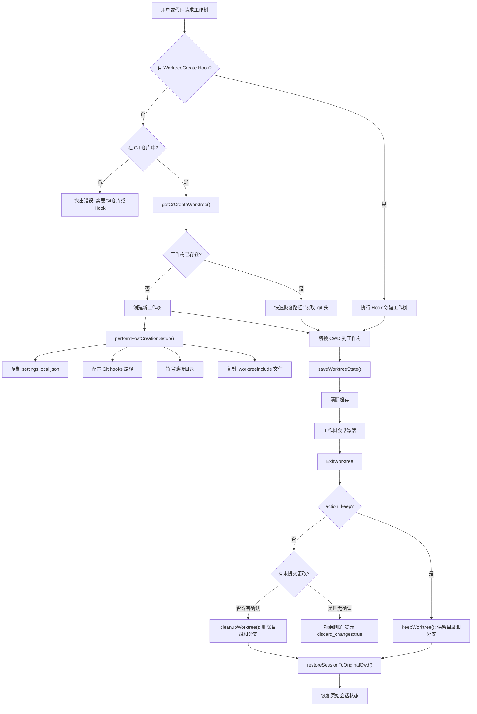

# Git Worktree 工作树系统

## 概述

Claude Code 的 Worktree 工作树系统提供了一种隔离开发环境的能力，允许代理在不影响主工作目录的情况下进行并行开发。系统由 `EnterWorktreeTool` 和 `ExitWorktreeTool` 两个核心工具组成，配合底层工具函数 `src/utils/worktree.ts` 实现 Git 工作树的创建、管理和清理。工作树路径统一存储在 `.claude/worktrees/` 目录下，每个工作树对应独立的 Git 分支。系统还支持 Hook 驱动的非 Git VCS 后端，通过 `WorktreeCreate`/`WorktreeRemove` 钩子实现自定义版本控制集成。

## 工作树生命周期



## EnterWorktreeTool

`EnterWorktreeTool`（位于 `src/tools/EnterWorktreeTool/EnterWorktreeTool.ts`）创建隔离的 Git 工作树并将会话切换到该工作树中。

### 输入模式

```typescript
z.strictObject({
  name: z.string().optional()
    .describe("Optional name for the worktree"),
})
```

名称验证通过 `validateWorktreeSlug()` 进行：
- 每个 `/` 分隔的段只能包含字母、数字、点、下划线和连字符
- 总长度不超过 64 个字符
- 不允许 `.` 或 `..` 段（防止路径遍历）
- 未提供名称时自动生成（使用 `getPlanSlug()`）

### 执行流程

1. **重复检查**：`getCurrentWorktreeSession()` 检查是否已在工作树会话中，防止嵌套。
2. **解析主仓库根目录**：`findCanonicalGitRoot(getCwd())` 找到 Git 仓库根目录，如果当前目录是工作树子目录则切换回主仓库。
3. **创建工作树**：`createWorktreeForSession(getSessionId(), slug)` 执行实际创建。
4. **切换目录**：`process.chdir(worktreePath)` 和 `setCwd(worktreePath)` 更新工作目录。
5. **保存状态**：`setOriginalCwd(getCwd())` 记录工作树路径为原始目录。
6. **持久化**：`saveWorktreeState(worktreeSession)` 将工作树会话信息写入会话存储，支持 `--resume` 恢复。
7. **清除缓存**：`clearSystemPromptSections()`、`clearMemoryFileCaches()`、`getPlansDirectory.cache.clear()` 清除所有依赖 CWD 的缓存。

### 工作树创建详解

`createWorktreeForSession()`（位于 `src/utils/worktree.ts`）是核心创建逻辑：

#### Hook 驱动路径

当 `hasWorktreeCreateHook()` 返回 `true` 时，执行 `executeWorktreeCreateHook(slug)` 创建工作树。这允许用户配置非 Git 的版本控制系统（如 Mercurial、SVN 等）。Hook 返回 `{ worktreePath: string }`，系统不执行任何 Git 操作。

#### Git 路径

1. **Slug 扁平化**：`flattenSlug(slug)` 将 `user/feature` 转为 `user+feature`，避免 Git ref D/F 冲突和嵌套目录问题。
2. **分支命名**：`worktree-<flattened-slug>`，使用 `-B`（强制创建/重置）而非 `-b`。
3. **快速恢复**：`readWorktreeHeadSha(worktreePath)` 直接读取 `.git` 指针文件，跳过 `git fetch` 和 `git worktree add`，节省约 15ms 的子进程开销。
4. **基础分支解析**：优先使用本地已有的 `origin/<defaultBranch>` 引用（通过 `resolveRef` 直接读取），仅在不存在时执行 `git fetch`。
5. **稀疏检出**：当 `settings.worktree.sparsePaths` 配置时，使用 `--no-checkout` 创建工作树后执行 `git sparse-checkout set` 和 `git checkout HEAD`。

#### 创建后设置

`performPostCreationSetup()` 执行以下操作：

1. **复制本地设置**：将 `settings.local.json` 从主仓库复制到工作树，传递本地配置（可能包含密钥）。
2. **配置 Git Hooks**：检测 `.husky` 或 `.git/hooks` 目录，设置 `core.hooksPath` 指向主仓库的 hooks 目录，解决 Husky 相对路径问题。
3. **符号链接目录**：根据 `settings.worktree.symlinkDirectories`（如 `node_modules`）创建符号链接，避免磁盘膨胀。
4. **复制 .worktreeinclude 文件**：将 `.gitignore` 但匹配 `.worktreeinclude` 模式的文件复制到工作树（如 `.env`、配置文件等）。
5. **安装归因 Hook**：在 `COMMIT_ATTRIBUTION` 功能启用时，在工作树的 `.husky/` 目录安装 `prepare-commit-msg` 钩子。

### .worktreeinclude 机制

`.worktreeinclude` 文件使用 `.gitignore` 语法，指定哪些被 Git 忽略的文件应复制到工作树。复制逻辑优化了大型仓库的性能：

1. 使用 `git ls-files --others --ignored --exclude-standard --directory` 列出被忽略的文件，`--directory` 将完全忽略的目录折叠为单条目（如 `node_modules/`）。
2. 使用 `ignore` 库在进程内过滤匹配 `.worktreeinclude` 的文件。
3. 对于折叠目录中包含匹配文件的情况，执行范围限定的第二次 `ls-files` 调用展开目录。

## ExitWorktreeTool

`ExitWorktreeTool`（位于 `src/tools/ExitWorktreeTool/ExitWorktreeTool.ts`）退出工作树会话并恢复原始工作目录。

### 输入模式

```typescript
z.strictObject({
  action: z.enum(["keep", "remove"])
    .describe('"keep" leaves the worktree; "remove" deletes both.'),
  discard_changes: z.boolean().optional()
    .describe("Required true when removing with uncommitted changes"),
})
```

### 安全验证

`validateInput()` 执行严格的安全检查：

1. **会话范围守卫**：`getCurrentWorktreeSession()` 必须非空，即只能退出当前会话中通过 `EnterWorktree` 创建的工作树。手动创建的 `git worktree add` 或上一个会话的工作树不受此工具管理。
2. **变更检测**：当 `action === 'remove'` 且未设置 `discard_changes: true` 时，调用 `countWorktreeChanges()` 检查未提交的文件和未推送的提交。
3. **失败封闭**：如果 `countWorktreeChanges()` 返回 `null`（Git 命令失败、无基准提交等），拒绝删除，除非显式确认。

### 变更计数

`countWorktreeChanges()` 检查两类变更：

1. **未提交文件**：`git status --porcelain` 统计修改的文件数。
2. **未推送提交**：`git rev-list --count <originalHeadCommit>..HEAD` 统计新提交数。

返回 `null` 的情况（失败封闭）：
- `git status` 退出码非零（锁文件、损坏的索引、错误的引用）
- `originalHeadCommit` 未定义（Hook 创建的工作树，无法确定基准）
- `git rev-list` 退出码非零

### 会话恢复

`restoreSessionToOriginalCwd()` 是 `EnterWorktreeTool.call()` 的逆操作：

1. `setCwd(originalCwd)`：恢复工作目录。
2. `setOriginalCwd(originalCwd)`：重置原始目录记录。
3. `setProjectRoot(originalCwd)`：仅当 `projectRootIsWorktree` 为 `true` 时恢复（`--worktree` 启动场景），并重新读取 hooks 快照。
4. `saveWorktreeState(null)`：清除持久化的工作树状态。
5. `clearSystemPromptSections()`、`clearMemoryFileCaches()`、`getPlansDirectory.cache.clear()`：清除所有依赖 CWD 的缓存。

### 清理路径

#### keep 模式

1. `keepWorktree()`：切换回原始目录，清除 `currentWorktreeSession`，更新项目配置。
2. 工作树目录和分支保留在磁盘上，用户可以稍后 `cd` 继续。
3. tmux 会话（如果有）不会被终止，提示用户 `tmux attach` 重新连接。

#### remove 模式

1. `killTmuxSession(tmuxSessionName)`：终止 tmux 会话（如果存在）。
2. `cleanupWorktree()`：
   - Hook 模式：执行 `WorktreeRemove` hook。
   - Git 模式：`git worktree remove --force` + `git branch -D <branch>`。
3. 记录丢弃的文件数和提交数。

## 代理工作树

`createAgentWorktree()` 和 `removeAgentWorktree()` 为子代理提供轻量级工作树创建，**不修改全局会话状态**（不切换 CWD、不设置 `currentWorktreeSession`、不修改项目配置）。

### 关键差异

- 代理工作树始终在主仓库的 `.claude/worktrees/` 中创建（使用 `findCanonicalGitRoot`），即使从会话工作树中派生也不会嵌套。
- 恢复已有工作树时会更新 mtime（`utimes`），防止 30 天过期清理误删活跃的工作树。

### 过期清理

`cleanupStaleAgentWorktrees()` 定期清理超过 30 天的临时工作树：

1. 仅匹配临时模式（`agent-a<7hex>`、`wf_<runId>-<idx>`、`bridge-<id>`、`job-<template>-<8hex>`），不触碰用户命名的工作树。
2. 跳过当前会话的工作树。
3. 失败封闭：`git status` 失败或显示已跟踪更改则跳过；`rev-list` 显示未推送提交则跳过。
4. 清理后执行 `git worktree prune` 移除过时引用。

## CLI 集成: --worktree 标志

### execIntoTmuxWorktree

`execIntoTmuxWorktree()` 是 `--worktree --tmux` 的快速路径处理器，在完整 CLI 加载之前执行：

1. 验证平台和 tmux 可用性。
2. 解析工作树名称，支持 PR 引用（`#123` 或 GitHub URL）。
3. 创建或恢复工作树（支持 Hook 和 Git 两种路径）。
4. 创建 tmux 会话，在 iTerm2 中使用 Control Mode（`-CC`）实现原生标签页集成。
5. 设置环境变量（`CLAUDE_CODE_TMUX_SESSION`、`CLAUDE_CODE_TMUX_PREFIX`）用于内部 Claude 实例显示 tmux 信息。
6. 检测 tmux 前缀键冲突（Claude 绑定了 C-b 等），通知用户。

### 会话恢复

在 `--resume` 时，`restoreWorktreeSession()` 从持久化状态恢复工作树会话，使恢复的会话能正确识别自己处于工作树中。

## 与代理系统的集成

工作树系统与代理循环的集成体现在以下几个方面：

1. **并行开发**：多个子代理可以在各自的工作树中并行工作，不会产生文件冲突。
2. **AgentTool 集成**：AgentTool 创建子代理时可以选择创建独立工作树，使用 `createAgentWorktree()` 而非 `createWorktreeForSession()`。
3. **隔离保证**：每个工作树有独立的 Git 分支、独立的 `settings.local.json` 和独立的 hooks 配置。

## WorktreeSession 数据结构

```typescript
type WorktreeSession = {
  originalCwd: string;           // 进入工作树前的目录
  worktreePath: string;          // 工作树路径
  worktreeName: string;          // 工作树名称（slug）
  worktreeBranch?: string;       // Git 分支名
  originalBranch?: string;       // 原始分支名
  originalHeadCommit?: string;   // 创建时的 HEAD commit
  sessionId: string;             // 会话 ID
  tmuxSessionName?: string;      // tmux 会话名
  hookBased?: boolean;           // 是否通过 Hook 创建
  creationDurationMs?: number;   // 创建耗时
  usedSparsePaths?: boolean;     // 是否使用稀疏检出
}
```

## 关键源文件

| 文件 | 功能 |
|------|------|
| `src/tools/EnterWorktreeTool/EnterWorktreeTool.ts` | 工作树进入工具 |
| `src/tools/ExitWorktreeTool/ExitWorktreeTool.ts` | 工作树退出工具 |
| `src/utils/worktree.ts` | 工作树核心逻辑（创建/清理/过期管理） |
| `src/utils/worktreeModeEnabled.ts` | 工作树模式启用检测 |
| `src/utils/getWorktreePaths.ts` | 工作树路径工具 |
| `src/utils/getWorktreePathsPortable.ts` | 可移植路径工具 |
| `src/components/WorktreeExitDialog.tsx` | 工作树退出对话框 UI |
| `src/utils/sessionStorage.ts` | 会话存储（saveWorktreeState） |
