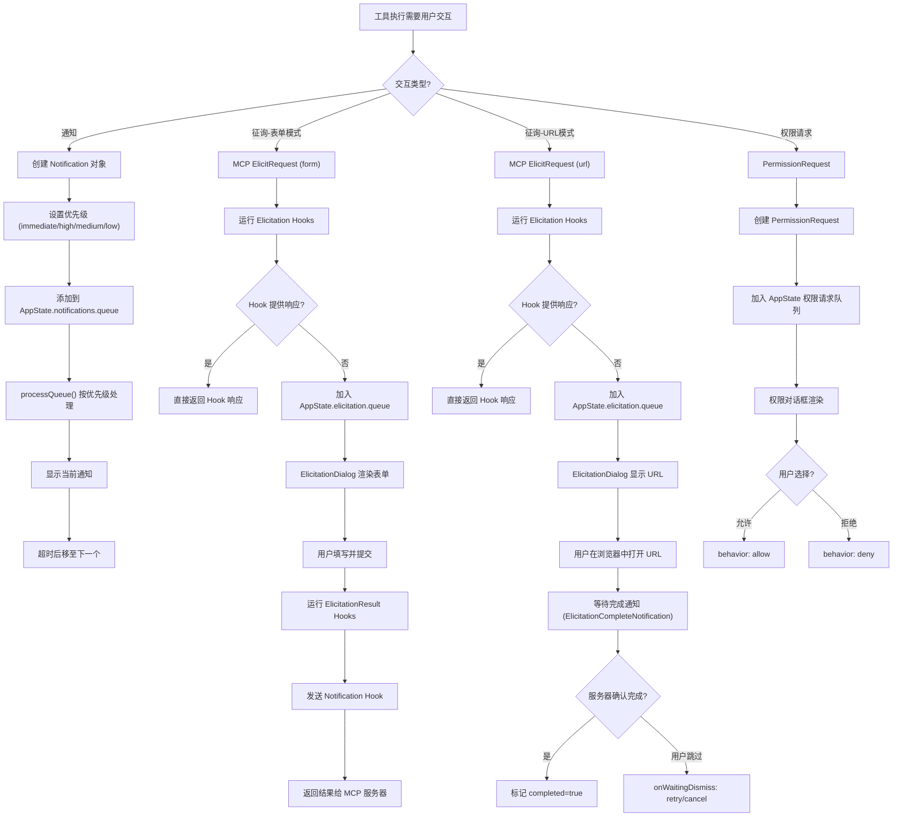

# 通知与征询系统

## 概述

Claude Code 的通知与征询系统提供了两种不同类型的异步用户交互机制：通知（Notification）用于向用户推送信息，征询（Elicitation）用于从用户收集结构化数据。通知系统支持多种终端通知渠道（iTerm2、kitty、ghostty、终端响铃等），征询系统与 MCP 协议深度集成，支持表单和 URL 两种模式。两者都通过 AppState 管理状态，并与 Hook 系统紧密协作，支持在工具执行期间的异步交互。

## 通知与征询流程



## 通知系统

### AppState.notifications

通知状态存储在 `AppState.notifications` 中，包含两个核心字段：

- **current**：当前正在显示的通知（`Notification | null`）
- **queue**：等待显示的通知队列（`Notification[]`）

### 通知类型

```typescript
type Notification = TextNotification | JSXNotification;

type TextNotification = BaseNotification & {
  text: string;
  color?: keyof Theme;
};

type JSXNotification = BaseNotification & {
  jsx: React.ReactNode;
};

type BaseNotification = {
  key: string;                    // 唯一标识，用于去重和折叠
  invalidates?: string[];         // 使指定 key 的通知失效
  priority: 'immediate' | 'high' | 'medium' | 'low';
  timeoutMs?: number;             // 显示时长，默认 8000ms
  fold?: (accumulator: Notification, incoming: Notification) => Notification;
};
```

### 优先级机制

通知系统有四个优先级级别，数值越小优先级越高：

| 优先级 | 数值 | 行为 |
|--------|------|------|
| immediate | 0 | 立即显示，打断当前通知，将当前通知重新入队 |
| high | 1 | 按队列顺序显示 |
| medium | 2 | 按队列顺序显示 |
| low | 3 | 按队列顺序显示 |

`getNext()` 函数从队列中选择优先级最高的通知进行显示。

### 折叠机制

`fold` 函数允许相同 `key` 的通知合并，类似于 `Array.reduce()`：

1. 如果新通知的 `key` 与当前显示的通知匹配，调用 `fold` 合并，重置超时计时器。
2. 如果新通知的 `key` 与队列中的通知匹配，同样合并。
3. 不提供 `fold` 时，相同 `key` 的通知会被去重（不重复入队）。

### 失效机制

`invalidates` 字段允许通知主动使其他通知失效：

1. 新通知的 `invalidates` 中的 `key` 匹配当前显示的通知时，立即清除当前通知。
2. 队列中匹配的通知也会被移除。
3. `immediate` 优先级的通知会自动移除队列中所有 `immediate` 优先级的旧通知。

### 通知服务

`sendNotification()`（位于 `src/services/notifier.ts`）是发送通知的入口：

1. 获取用户偏好的通知渠道（`config.preferredNotifChannel`）。
2. 执行 Notification hooks（`executeNotificationHooks`）。
3. 根据渠道发送通知。
4. 记录使用的通知方法（`logEvent('tengu_notification_method_used')`）。

### 通知渠道

| 渠道 | 说明 |
|------|------|
| auto | 自动检测终端类型并选择最佳方法 |
| iterm2 | iTerm2 原生通知 |
| iterm2_with_bell | iTerm2 通知 + 终端响铃 |
| kitty | kitty 终端通知 |
| ghostty | ghostty 终端通知 |
| terminal_bell | 仅终端响铃 |
| notifications_disabled | 禁用通知 |

`auto` 模式的自动检测逻辑：
- Apple Terminal：检查响铃是否启用，启用则使用 `terminal_bell`
- iTerm2：使用 iTerm2 原生通知
- kitty：使用 kitty 通知
- ghostty：使用 ghostty 通知
- 其他终端：无可用的通知方法

### Apple Terminal 响铃检测

对 Apple Terminal 的响铃检测是特殊处理：

1. 通过 `osascript` 获取当前终端配置名称。
2. 通过 `defaults export com.apple.Terminal` 导出终端配置。
3. 使用 `plist` 库解析配置，检查 `Bell` 字段是否为 `false`。

## 征询系统

### MCP 征询处理器

`registerElicitationHandler()`（位于 `src/services/mcp/elicitationHandler.ts`）在 MCP 客户端上注册征询请求处理器。

#### 表单模式 (form)

1. MCP 服务器发送 `ElicitRequest`，`params.mode` 为 `'form'` 或未指定。
2. 首先运行 Elicitation Hooks（`executeElicitationHooks`），如果 Hook 提供了响应则直接返回，不显示 UI。
3. 将征询请求加入 `AppState.elicitation.queue`，包含 `respond` 回调函数。
4. UI 渲染 `ElicitationDialog` 组件，显示表单字段。
5. 用户填写并提交后，`respond` 回调被调用，Promise 解析。
6. 运行 ElicitationResult Hooks（`executeElicitationResultHooks`），允许修改或阻止响应。
7. 发送 `elicitation_response` 通知 Hook。

#### URL 模式 (url)

1. MCP 服务器发送 `ElicitRequest`，`params.mode` 为 `'url'`，包含 `url` 和 `elicitationId`。
2. 运行 Elicitation Hooks，如果 Hook 提供了响应则直接返回。
3. 将征询请求加入队列，附带 `waitingState`（显示 "Skip confirmation" 按钮）。
4. UI 显示 URL，用户点击在浏览器中打开。
5. 等待 MCP 服务器发送 `ElicitationCompleteNotification`（包含 `elicitationId`）。
6. 收到完成通知后，设置 `completed: true`，UI 反映完成状态。
7. 如果用户在完成前跳过，调用 `onWaitingDismiss`，可选择 `dismiss`/`retry`/`cancel`。

### ElicitationRequestEvent

```typescript
type ElicitationRequestEvent = {
  serverName: string;              // MCP 服务器名称
  requestId: string | number;      // JSON-RPC 请求 ID
  params: ElicitRequestParams;     // 征询参数
  signal: AbortSignal;             // 中止信号
  respond: (response: ElicitResult) => void;  // 响应回调
  waitingState?: ElicitationWaitingState;     // URL 模式的等待状态
  onWaitingDismiss?: (action: 'dismiss' | 'retry' | 'cancel') => void;
  completed?: boolean;             // URL 模式的完成标记
}
```

### Hook 集成

征询系统在两个阶段运行 Hook：

1. **Elicitation Hooks**（请求阶段）：在显示 UI 之前运行，可以编程式地提供响应。
   - `blockingError`：返回 `{ action: 'decline' }`，拒绝征询。
   - `elicitationResponse`：直接提供响应，跳过 UI 显示。

2. **ElicitationResult Hooks**（响应阶段）：在用户响应后运行，可以修改或阻止响应。
   - `blockingError`：返回 `{ action: 'decline' }`，覆盖用户选择。
   - `elicitationResultResponse`：修改用户的响应内容或动作。

### ElicitationDialog 组件

`ElicitationDialog`（位于 `src/components/mcp/ElicitationDialog.tsx`）是征询系统的 UI 组件，负责渲染表单字段和处理用户输入。

#### 表单字段支持

- 文本输入（string/number/integer 类型）
- 枚举选择（enum 类型，支持 typeahead）
- 多选枚举（multiSelect enum）
- 日期时间选择（date/datetime 类型）
- 异步解析字段（显示旋转器动画）

#### URL 模式 UI

- 显示 URL 和 "Open in browser" 按钮
- 等待阶段显示 "Skip confirmation" 按钮
- 收到完成通知后自动关闭

### 征询验证

`elicitationValidation.ts`（位于 `src/utils/mcp/elicitationValidation.ts`）提供输入验证功能：

- `validateElicitationInput()`：同步验证表单输入
- `validateElicitationInputAsync()`：异步验证（支持远程验证）
- `isEnumSchema()`/`isMultiSelectEnumSchema()`：检测枚举类型
- `getEnumValues()`/`getEnumLabel()`：枚举值处理

## 权限请求通知

权限请求是与通知和征询系统并行但独立的异步交互机制，用于在工具执行期间请求用户授权。

### 流程对比

| 维度 | 通知 | 征询 | 权限请求 |
|------|------|------|---------|
| 方向 | 系统 → 用户 | MCP 服务器 → 用户 | 工具 → 用户 |
| 响应 | 无需响应 | accept/decline/cancel | allow/deny |
| 数据 | 纯文本/JSX | 结构化表单数据 | 工具名称和参数 |
| 来源 | 内部事件 | MCP 协议 | 工具执行 |
| Hook | Notification | Elicitation/ElicitationResult | PermissionRequest |

### 短请求 ID 中继

权限请求使用短请求 ID 进行进程间通信，特别是在渠道权限中继场景中（如 Telegram/Discord 集成）。短 ID 简化了在受限界面中显示和输入的操作。

## 推送通知集成

推送通知系统通过环境变量和配置项控制：

- `taskCompleteNotifEnabled`：任务完成时推送通知
- `inputNeededNotifEnabled`：需要用户输入时推送通知
- `agentPushNotifEnabled`：代理事件推送通知

这些配置存储在 `GlobalConfig` 中，默认关闭，需要显式启用。

## 异步交互处理

Claude Code 在工具执行期间处理异步用户交互的核心模式：

1. **Promise 阻塞**：工具的 `call()` 方法创建一个 Promise，通过 `setAppState` 将 resolve 回调放入队列。
2. **UI 渲染**：React 组件从 `AppState` 读取队列，渲染交互界面。
3. **用户响应**：用户操作触发 `respond()` 回调，Promise 解析。
4. **Hook 后处理**：响应可能被 Hook 修改或阻止。
5. **工具继续**：Promise 解析后，工具的 `call()` 方法继续执行。

这种模式确保了工具执行不会被阻塞在 UI 线程上，同时保持了响应的有序性和可追溯性。

## 关键源文件

| 文件 | 功能 |
|------|------|
| `src/context/notifications.tsx` | 通知队列管理（useNotifications hook） |
| `src/services/notifier.ts` | 通知发送服务 |
| `src/services/mcp/elicitationHandler.ts` | MCP 征询处理器 |
| `src/components/mcp/ElicitationDialog.tsx` | 征询对话框 UI 组件 |
| `src/utils/mcp/elicitationValidation.ts` | 征询输入验证 |
| `src/utils/hooks.ts` | Hook 执行函数（executeNotificationHooks 等） |
