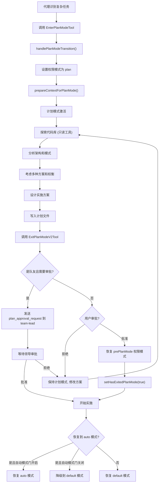

# 计划模式

## 概述

计划模式（Plan Mode）是 Claude Code 的一种特殊执行模式，要求代理在编写代码之前先设计实施方案。这种机制为复杂任务提供了一个安全的探索和规划阶段，防止代理在没有充分理解代码库的情况下贸然修改代码。通过 `EnterPlanModeTool` 进入计划模式，通过 `ExitPlanModeV2Tool` 退出并提交计划供用户审批。计划模式通过工具限制、权限模式变更和状态管理来确保规划阶段的纯粹性。系统还支持 Plan 子代理，作为 AgentTool 内置的规划专用代理类型。

## 计划模式工作流



## EnterPlanModeTool

`EnterPlanModeTool`（位于 `src/tools/EnterPlanModeTool/EnterPlanModeTool.ts`）请求进入计划模式。

### 输入与输出

输入为空对象（无需参数），输出包含一条确认消息。

### 执行流程

1. **代理上下文检查**：`context.agentId` 存在时抛出错误，子代理不能自行进入计划模式。
2. **模式转换**：`handlePlanModeTransition(appState.toolPermissionContext.mode, 'plan')` 处理模式过渡逻辑。
3. **权限上下文更新**：
   - `prepareContextForPlanMode()` 准备计划模式下的权限上下文，在 `defaultMode` 为 `'auto'` 时运行分类器激活副作用。
   - `applyPermissionUpdate()` 应用 `setMode: 'plan'` 变更，目标为 `'session'`。
4. **状态持久化**：通过 `context.setAppState()` 更新 `toolPermissionContext`。

### 启用条件

`isEnabled()` 在以下情况下返回 `false`（禁用进入）：
- `--channels` 模式激活时（计划审批对话框需要终端 UI，渠道模式下无法显示）

### 工具结果

进入计划模式后的指导消息根据是否启用面试阶段（`isPlanModeInterviewPhaseEnabled()`）有所不同：

**面试阶段模式**：
```
Entered plan mode. You should now focus on exploring the codebase
and designing an implementation approach.
DO NOT write or edit any files except the plan file.
Detailed workflow instructions will follow.
```

**标准模式**：
```
Entered plan mode. You should now focus on exploring the codebase
and designing an implementation approach.
In plan mode, you should:
1. Thoroughly explore the codebase to understand existing patterns
2. Identify similar features and architectural approaches
3. Consider multiple approaches and their trade-offs
4. Use AskUserQuestion if you need to clarify the approach
5. Design a concrete implementation strategy
6. When ready, use ExitPlanMode to present your plan for approval
Remember: DO NOT write or edit any files yet.
This is a read-only exploration and planning phase.
```

## ExitPlanModeV2Tool

`ExitPlanModeV2Tool`（位于 `src/tools/ExitPlanModeTool/ExitPlanModeV2Tool.ts`）退出计划模式并提交计划供审批。

### 输入模式

```typescript
z.strictObject({
  allowedPrompts: z.array(z.object({
    tool: z.enum(['Bash']),
    prompt: z.string(),
  })).optional(),
}).passthrough()
```

SDK 面向的输入模式还包含通过 `normalizeToolInput` 注入的 `plan` 和 `planFilePath` 字段。

### 输出模式

```typescript
z.object({
  plan: z.string().nullable(),          // 提交给用户的计划
  isAgent: z.boolean(),                 // 是否在代理上下文中
  filePath: z.string().optional(),      // 计划文件路径
  hasTaskTool: z.boolean().optional(),  // AgentTool 是否可用
  planWasEdited: z.boolean().optional(), // 用户是否编辑了计划
  awaitingLeaderApproval: z.boolean().optional(), // 队友等待领导审批
  requestId: z.string().optional(),     // 计划审批请求 ID
})
```

### 验证逻辑

1. **队友**：始终通过验证（`isTeammate()` 返回 true 时）。
2. **非队友**：
   - 必须处于 `plan` 模式中，否则拒绝并记录 `tengu_exit_plan_mode_called_outside_plan` 事件。
   - 此检查在 `checkPermissions` 之前执行，避免在非计划模式下显示审批对话框。

### 权限检查

1. **队友**：`behavior: 'allow'`，跳过权限 UI，避免发送 `permission_request`。
2. **非队友**：`behavior: 'ask'`，消息为 "Exit plan mode?"，需要用户确认。

### 执行流程

#### 队友审批路径

当 `isTeammate() && isPlanModeRequired()` 时：

1. 检查计划文件是否存在，不存在则抛出错误。
2. 生成 `plan_approval_request`，包含 `from`、`timestamp`、`planFilePath`、`planContent`、`requestId`。
3. 通过 `writeToMailbox('team-lead', ...)` 发送到团队领导的邮箱。
4. 更新任务状态（`setAwaitingPlanApproval`）显示等待审批。
5. 返回 `awaitingLeaderApproval: true`，提示队友等待。

#### 普通用户路径

1. **计划同步**：如果用户通过 CCR web UI 编辑了计划（`inputPlan` 存在），将编辑后的计划写入磁盘并重新快照。
2. **自动模式门检查**：如果 `prePlanMode` 为 `'auto'` 但自动模式门已关闭（熔断器或设置禁用），降级到 `'default'` 模式，并显示通知。
3. **模式恢复**：
   - 设置 `toolPermissionContext.mode` 为 `restoreMode`（`prePlanMode ?? 'default'`）。
   - 清除 `prePlanMode`。
   - 如果恢复到 `auto`，保持危险权限剥离；否则恢复之前剥离的权限。
4. **状态标记**：
   - `setHasExitedPlanMode(true)`
   - `setNeedsPlanModeExitAttachment(true)`
   - 如果自动模式不再活跃但之前使用过，设置 `setNeedsAutoModeExitAttachment(true)`

### 权限模式恢复细节

计划模式退出时的权限恢复是最复杂的部分：

1. **prePlanMode 保存**：进入计划模式时，当前模式保存在 `toolPermissionContext.prePlanMode` 中。
2. **危险权限剥离**：进入计划模式时，如果来自 `auto` 模式，`stripDangerousPermissionsForAutoMode()` 会移除某些权限规则。这些规则保存在 `strippedDangerousRules` 中。
3. **恢复判断**：
   - 恢复到 `auto`：保持剥离状态（`stripDangerousPermissionsForAutoMode`）。
   - 恢复到非 `auto`：调用 `restoreDangerousPermissions()` 恢复之前剥离的规则。
4. **熔断器保护**：即使 `prePlanMode` 为 `auto`，如果自动模式门已关闭，降级到 `default`。

### 工具结果

根据不同场景返回不同的结果消息：

1. **队友等待审批**：显示 "Your plan has been submitted to the team lead for approval"，列出后续步骤。
2. **代理**：简单返回 "User has approved the plan"。
3. **空计划**：返回 "User has approved exiting plan mode. You can now proceed."
4. **正常**：显示 "User has approved your plan" + 计划内容 + 团队工具提示（如果可用）。

## Plan 子代理

Plan 是 AgentTool 的内置代理类型之一，专门用于规划任务。当主代理需要为复杂任务制定计划时，可以生成 Plan 子代理。

### 特点

- **只读探索**：Plan 子代理在计划模式下运行，只能使用只读工具。
- **方案设计**：专注于代码库探索和方案设计，不直接编写代码。
- **结果交付**：完成规划后通过 `ExitPlanMode` 提交计划。

## 计划文件系统

计划文件存储在 `.claude/plans/` 目录下，路径由 `getPlanFilePath(agentId)` 生成：

- 主代理：`.claude/plans/plan.md`
- 子代理：`.claude/plans/<agentId>/plan.md`

`getPlan(agentId)` 读取计划文件内容，`persistFileSnapshotIfRemote()` 在远程代理场景下持久化文件快照。

## 计划模式的权限含义

### 工具限制

在计划模式下，代理只能使用只读工具：

- **允许**：Read、Grep、Glob、TaskList、TaskGet、AskUserQuestion 等
- **禁止**：Write、Edit、Bash（写操作）、AgentTool（非 Plan 类型）等

### 权限模式

计划模式是一种独立的权限模式（`mode: 'plan'`），与 `default`、`auto` 等模式平行。进入计划模式会切换 `toolPermissionContext.mode`，退出时恢复到之前的模式。

### 安全机制

1. **只读保证**：计划模式下的工具限制确保代理不会意外修改文件。
2. **用户审批**：退出计划模式需要用户明确批准，防止代理绕过规划阶段。
3. **模式恢复**：退出时恢复到之前的权限模式，不会意外提升权限。
4. **熔断器保护**：自动模式降级机制防止权限过度开放。

## pendingPlanVerification

`AppState` 中的 `pendingPlanVerification` 字段用于跟踪计划验证状态。当计划被批准后，系统可能需要验证实施是否与计划一致。

## 关键源文件

| 文件 | 功能 |
|------|------|
| `src/tools/EnterPlanModeTool/EnterPlanModeTool.ts` | 进入计划模式工具 |
| `src/tools/ExitPlanModeTool/ExitPlanModeV2Tool.ts` | 退出计划模式工具 |
| `src/components/permissions/EnterPlanModePermissionRequest/` | 进入计划模式权限请求 UI |
| `src/components/permissions/ExitPlanModePermissionRequest/` | 退出计划模式权限请求 UI |
| `src/utils/planModeV2.ts` | 计划模式 V2 功能开关 |
| `src/utils/plans.ts` | 计划文件管理 |
| `src/utils/permissions/permissionSetup.ts` | 权限上下文准备 |
| `src/utils/permissions/autoModeState.ts` | 自动模式状态管理 |
| `src/utils/teammate.ts` | 队友检测（isPlanModeRequired） |
