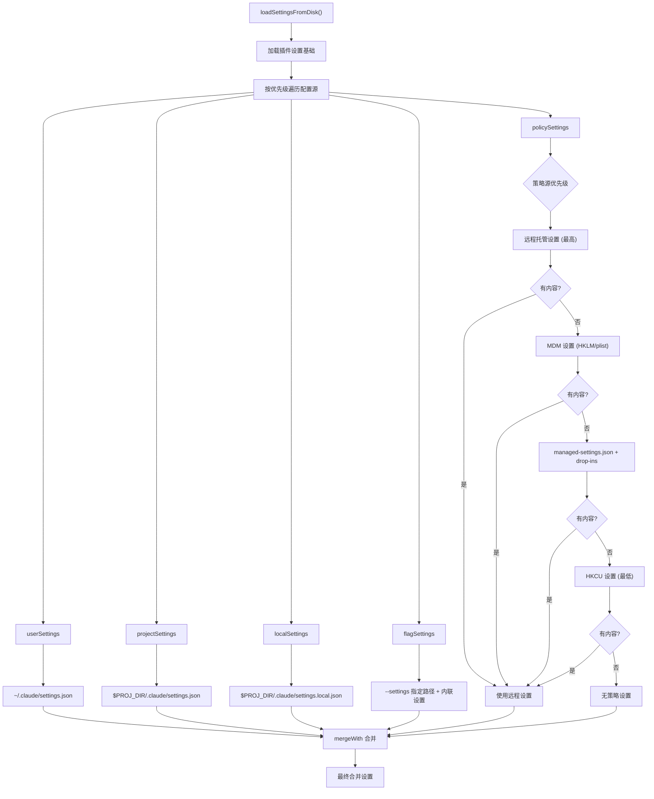

# 设置与配置系统

## 概述

Claude Code 的设置与配置系统采用多层级的配置源架构，支持用户设置、项目设置、本地设置、标志设置、策略设置和远程托管设置等多种来源，通过优先级合并机制生成最终生效的配置。系统包含完善的迁移框架（当前版本 11）、远程托管设置同步、MDM 策略限制、环境变量安全管理、配置缓存和备份恢复等子系统，确保配置的灵活性、安全性和性能。`CLAUDE.md` 文件作为项目级配置的补充，提供了基于 Markdown 的指令系统。

## 设置解析流程



## 配置源详解

### 用户设置 (userSettings)

**路径**：`~/.claude/settings.json`

用户级全局设置，适用于所有项目。存储用户个人偏好，如主题、通知渠道、编辑器模式等。在 cowork 模式下使用 `cowork_settings.json`。

### 项目设置 (projectSettings)

**路径**：`$PROJ_DIR/.claude/settings.json`

项目级共享设置，通常提交到版本控制中。包含项目范围的权限规则、MCP 服务器配置、hooks 等。

### 本地设置 (localSettings)

**路径**：`$PROJ_DIR/.claude/settings.local.json`

项目级本地设置，不应提交到版本控制。存储敏感信息（如 API 密钥）和本地覆盖。系统在写入 `localSettings` 时自动将 `.claude/settings.local.json` 添加到 `.gitignore`。

### 标志设置 (flagSettings)

**路径**：`--settings` 命令行参数指定 + 内联设置

通过 `--settings` 标志指定的配置文件，以及通过 SDK 注入的内联设置。内联设置与文件设置合并，内联设置优先。

### 策略设置 (policySettings)

策略设置采用"首个来源获胜"（first source wins）策略，优先级从高到低：

1. **远程托管设置**（最高）：通过 `services/remoteManagedSettings/` 服务同步，缓存在 `syncCacheState` 中。
2. **MDM 管理设置**：macOS 的 plist（通过 `getMdmSettings()`）或 Windows 的 HKLM 注册表。这些是管理员级别的设置，普通用户无法修改。
3. **文件管理设置**：`managed-settings.json` + `managed-settings.d/*.json` drop-in 文件。Drop-in 文件按字母顺序排序，后加载的优先级更高（类似 systemd/sudoers 约定）。
4. **HKCU 设置**（最低）：Windows 的 HKCU 注册表项，用户可写。

### 远程托管设置

远程托管设置通过 `services/remoteManagedSettings/` 服务从远程服务器同步：

- `syncCacheState.ts`：同步缓存状态管理，提供 `getRemoteManagedSettingsSyncFromCache()` 快速读取。
- 远程设置在会话启动时加载并缓存，避免每次读取配置时的网络请求。
- 远程设置作为策略源的最高优先级，可以覆盖所有本地策略。

### managed-settings.json + Drop-ins

文件管理设置支持 drop-in 目录机制：

- **基础文件**：`<managedPath>/managed-settings.json`
- **Drop-in 目录**：`<managed-settings.d/>`，其中所有 `.json` 文件按字母顺序排序后合并
- 不同的团队可以独立发布策略片段（如 `10-otel.json`、`20-security.json`），无需协调编辑单一文件

## 合并策略

`settingsMergeCustomizer()` 使用 lodash `mergeWith` 进行深度合并：

- **数组**：连接并去重（`uniq([...target, ...source])`）
- **其他类型**：使用 lodash 默认合并行为（源覆盖目标）
- **undefined 值**：在 `updateSettingsForSource()` 中用于删除键

## 设置文件解析

`parseSettingsFile()` 解析设置文件，带缓存和验证：

1. 检查缓存（`getCachedParsedFile`），命中则返回克隆的结果。
2. 读取文件内容，处理 BOM（`stripBOM`）。
3. `safeParseJSON()` 解析 JSON。
4. `filterInvalidPermissionRules()` 在 schema 验证前过滤无效的权限规则。
5. `SettingsSchema().safeParse()` 进行 schema 验证。
6. 验证失败时返回 `null` 设置和格式化的错误列表。

## 全局配置 (GlobalConfig)

`GlobalConfig`（位于 `src/utils/config.ts`）是全局配置的主数据结构，存储在 `~/.claude.json` 中。

### 核心字段

| 字段 | 类型 | 说明 |
|------|------|------|
| numStartups | number | 启动次数 |
| theme | ThemeSetting | 主题设置 |
| preferredNotifChannel | NotificationChannel | 通知渠道 |
| autoCompactEnabled | boolean | 自动压缩 |
| verbose | boolean | 详细模式 |
| projects | Record<string, ProjectConfig> | 项目配置 |
| mcpServers | Record<string, McpServerConfig> | MCP 服务器 |
| env | Record<string, string> | 环境变量 |
| todoFeatureEnabled | boolean | Todo 功能开关 |
| fileCheckpointingEnabled | boolean | 文件检查点 |
| cachedStatsigGates | Record<string, boolean> | 缓存的功能门 |
| migrationVersion | number | 迁移版本号 |

### 项目配置 (ProjectConfig)

每个项目有独立的配置，键为规范化的项目路径：

| 字段 | 说明 |
|------|------|
| allowedTools | 允许的工具列表 |
| hasTrustDialogAccepted | 信任对话框是否已接受 |
| activeWorktreeSession | 活跃的工作树会话 |
| mcpServers | 项目级 MCP 服务器 |
| hasCompletedProjectOnboarding | 是否完成项目引导 |

### 信任对话框

信任对话框检查 `checkHasTrustDialogAccepted()` 采用向上遍历策略：

1. 检查会话级信任（`getSessionTrustAccepted()`）。
2. 检查项目路径的配置。
3. 从 CWD 向上遍历父目录，检查是否有父目录已接受信任。
4. 一旦为 `true` 就锁定（`_trustAccepted`），不再重新检查。

### 配置读写

- **读取**：`getGlobalConfig()` 使用 mtime 缓存 + `watchFile` 后台刷新，避免每次读取都进行磁盘 I/O。
- **写入**：`saveGlobalConfig()` 使用文件锁（`lockfile.lockSync`）防止并发写入竞争。
- **备份**：写入前创建时间戳备份（`~/.claude/backups/`），保留最近 5 个。
- **损坏恢复**：读取到损坏的配置时，自动备份损坏文件并回退到默认值。

### 写穿缓存

`writeThroughGlobalConfigCache()` 在写入后立即更新缓存，缓存 mtime 设为 `Date.now()`（大于文件实际 mtime），使 `watchFile` 回调跳过自身写入的重新读取。

### Auth 丢失防护

`wouldLoseAuthState()` 检测写入是否会丢失认证状态（`oauthAccount` 和 `hasCompletedOnboarding`）。当从损坏的文件读取到默认值时，拒绝写回，防止永久性认证丢失（GH #3117）。

## 迁移系统

迁移系统（位于 `src/main.tsx`）维护 `CURRENT_MIGRATION_VERSION = 11`，当全局配置中的 `migrationVersion` 不匹配时执行所有迁移。

### 迁移列表

| 迁移文件 | 说明 |
|----------|------|
| migrateAutoUpdatesToSettings.ts | 自动更新设置迁移 |
| migrateBypassPermissionsAcceptedToSettings.ts | 绕过权限接受迁移 |
| migrateEnableAllProjectMcpServersToSettings.ts | MCP 服务器启用迁移 |
| migrateFennecToOpus.ts | Fennec 到 Opus 模型迁移 |
| migrateLegacyOpusToCurrent.ts | 旧版 Opus 到当前版迁移 |
| migrateOpusToOpus1m.ts | Opus 到 Opus-1M 迁移 |
| migrateReplBridgeEnabledToRemoteControlAtStartup.ts | REPL 桥接到远程控制迁移 |
| migrateSonnet1mToSonnet45.ts | Sonnet-1M 到 Sonnet-4.5 迁移 |
| migrateSonnet45ToSonnet46.ts | Sonnet-4.5 到 Sonnet-4.6 迁移 |
| resetAutoModeOptInForDefaultOffer.ts | 自动模式选择重置 |
| resetProToOpusDefault.ts | Pro 到 Opus 默认重置 |

### 执行逻辑

```typescript
const CURRENT_MIGRATION_VERSION = 11;

if (getGlobalConfig().migrationVersion !== CURRENT_MIGRATION_VERSION) {
  // 执行所有迁移
  runMigrations();
  saveGlobalConfig(prev => prev.migrationVersion === CURRENT_MIGRATION_VERSION
    ? prev
    : { ...prev, migrationVersion: CURRENT_MIGRATION_VERSION }
  );
}
```

当 `migrationVersion` 匹配时，跳过所有同步迁移，避免每次启动执行 11 次锁+重读操作。

## 环境变量管理

### 安全环境变量 vs 完整环境变量

系统区分两类环境变量应用时机：

1. **安全环境变量**（`applySafeConfigEnvironmentVariables()`）：在信任对话框之前应用，只包含不敏感的变量（如路径配置）。
2. **完整环境变量**（`applyConfigEnvironmentVariables()`）：在信任对话框之后应用，包含所有配置的环境变量（可能包含密钥）。

这种分离确保了未受信任的项目不会在信任确认前获取敏感环境变量。

### 配置方式

环境变量可以通过三种方式设置：

1. **GlobalConfig.env**：通过 `~/.claude.json` 的 `env` 字段设置（已弃用，推荐使用 settings）。
2. **settings.env**：通过 `settings.json` 的 `env` 字段设置。
3. **系统环境变量**：直接在 shell 中设置，如 `CLAUDE_CODE_*` 前缀的变量。

## ConfigTool

`ConfigTool`（位于 `src/commands/config/config.tsx`）提供运行时配置管理，允许用户在会话中修改设置。它通过 `updateSettingsForSource()` 写入配置文件，并自动刷新设置缓存。

## CLAUDE.md 项目级配置

`CLAUDE.md` 文件作为项目级配置的补充，提供基于 Markdown 的指令系统：

| 文件 | 作用域 | 说明 |
|------|--------|------|
| `~/.claude/CLAUDE.md` | 用户级 | 个人全局指令 |
| `$PROJ/CLAUDE.md` | 项目级 | 项目共享指令（提交到 VCS） |
| `$PROJ/CLAUDE.local.md` | 项目本地 | 项目本地指令（不提交） |
| `$PROJ/.claude/rules/*.md` | 规则目录 | 项目规则文件 |

详见第 13 章"记忆系统"。

## MDM 设置

`getMdmSettings()`（位于 `src/utils/settings/mdm/settings.ts`）读取操作系统级的管理设置：

- **macOS**：通过 `CFPreferences` API 读取 plist 配置（管理员级别）。
- **Windows**：读取 HKLM 注册表项（管理员级别）。

MDM 设置是策略源的一部分，具有高于文件管理设置的优先级。

## HKCU 设置

`getHkcuSettings()` 读取 Windows 的 HKCU 注册表项。HKCU 是用户可写的注册表区域，作为策略源的最低优先级。

## 设置缓存系统

设置缓存（`src/utils/settings/settingsCache.ts`）提供多层缓存：

1. **文件解析缓存**（`parsedFileCache`）：缓存 `parseSettingsFile()` 的结果。
2. **源级缓存**（`settingsForSourceCache`）：缓存每个源的合并设置。
3. **会话级缓存**（`sessionSettingsCache`）：缓存最终合并的设置结果。
4. **失效机制**：`resetSettingsCache()` 在设置更新时清除所有缓存。

## 策略限制

策略限制系统（`services/policyLimits/`）提供企业级配置限制：

- 管理员可以限制用户可配置的范围
- 策略设置无法被用户覆盖
- 权限规则（`permissions.allow`/`deny`）在策略级别设置后不可降级

## 设置同步

远程托管设置同步服务（`services/remoteManagedSettings/`）确保多设备间的策略一致性：

- 启动时从远程服务器拉取最新策略
- 本地缓存减少网络请求
- 策略变更在下次启动或手动刷新时生效

## SettingsSchema 类型

`SettingsJson` 类型（`src/utils/settings/types.ts`）定义了设置文件的完整 schema，包括：

- `permissions`：权限规则（allow/deny/defaultMode 等）
- `env`：环境变量
- `hooks`：钩子配置
- `mcpServers`：MCP 服务器配置
- `sandbox`：沙箱配置
- `worktree`：工作树配置（sparsePaths/symlinkDirectories）
- `agent`：代理配置
- 其他功能开关和配置项

## 关键源文件

| 文件 | 功能 |
|------|------|
| `src/utils/settings/settings.ts` | 设置加载/合并/更新核心逻辑 |
| `src/utils/settings/types.ts` | SettingsJson 类型定义和 schema |
| `src/utils/settings/settingsCache.ts` | 多层设置缓存 |
| `src/utils/settings/validation.ts` | 设置验证和错误格式化 |
| `src/utils/settings/constants.ts` | 配置源枚举和常量 |
| `src/utils/settings/managedPath.ts` | 托管设置路径管理 |
| `src/utils/settings/mdm/settings.ts` | MDM 设置读取 |
| `src/utils/settings/internalWrites.ts` | 内部写入标记 |
| `src/utils/config.ts` | 全局配置管理 |
| `src/utils/configConstants.ts` | 配置常量 |
| `src/main.tsx` | 迁移系统入口 |
| `src/migrations/` | 迁移文件目录 |
| `src/commands/config/config.tsx` | ConfigTool 运行时配置 |
