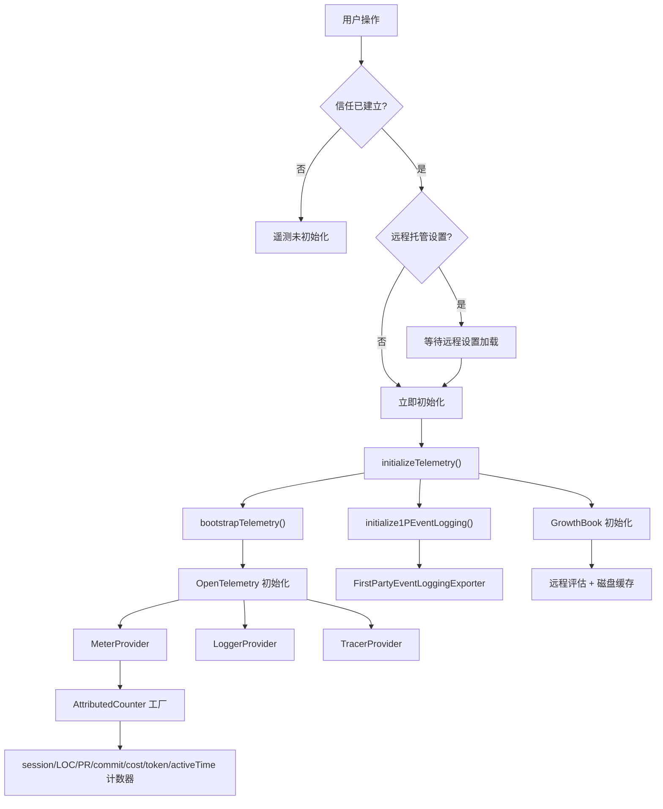
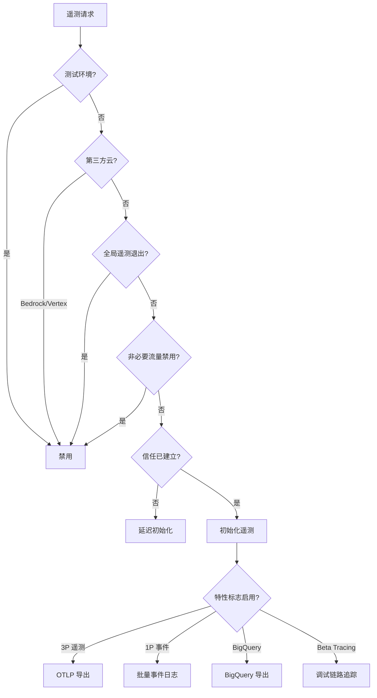

# 遥测与分析系统

## 概述

Claude Code 的遥测与分析系统是一个多层次的数据采集基础设施，负责收集运行时指标、事件日志和实验数据。该系统基于 OpenTelemetry 标准构建，同时集成了 Anthropic 内部的第一方（1P）事件日志、GrowthBook 特性标志与 A/B 测试平台，以及诊断跟踪和内部日志服务。遥测系统的设计核心原则是：所有数据采集均受用户信任授权和特性标志的门控，且内部事件与客户遥测严格隔离。

## 架构总览

遥测系统由两条相互独立的数据管道组成：

1. **第三方（3P）OpenTelemetry 管道**：面向客户自托管的后端，采集 OpenTelemetry 标准指标（Metrics）、日志（Logs）和链路追踪（Traces）
2. **第一方（1P）事件日志管道**：面向 Anthropic 内部分析平台，采集产品使用事件和实验数据

两条管道使用完全独立的 Provider 实例，确保内部事件不会泄漏到客户端点，反之亦然。



## OpenTelemetry 集成

### 懒加载策略

OpenTelemetry SDK 及其依赖（protobuf 等）体积约 400KB，gRPC 导出器额外约 700KB。为避免影响启动性能，系统采用懒加载策略：

- `instrumentation.ts` 整体通过 `import()` 动态加载
- gRPC 导出器在协议切换时按需加载（仅加载实际使用的协议变体）
- 每个进程最多使用一种协议变体，静态导入会无谓地加载全部 6 种变体

### initializeTelemetry() 函数

这是 OpenTelemetry 管道的核心初始化函数，执行以下步骤：

1. **bootstrapTelemetry()**：将 ANT_ 前缀的环境变量映射到标准 OTEL 变量（仅限内部用户），设置默认的 delta 时间性
2. **流式输出模式检测**：在 stream-json 模式下移除 console 导出器，避免污染 stdout
3. **Perfetto 追踪初始化**：独立于 OTEL 的性能追踪（通过 `CLAUDE_CODE_PERFETTO_TRACE` 启用）
4. **客户导出器配置**：根据 `OTEL_METRICS_EXPORTER` 环境变量配置导出器
5. **BigQuery 导出器**：为 API 客户和 C4E/Team 用户自动启用
6. **资源属性合并**：合并基础资源、OS 检测器、主机架构检测器和环境检测器的属性
7. **Provider 创建**：依次创建 MeterProvider、LoggerProvider（可选）和 TracerProvider（可选）

### 导出器协议支持

每种信号类型（Metrics/Logs/Traces）都支持以下协议：

| 协议 | 导出器模块 | 体积 |
|------|-----------|------|
| `grpc` | `@opentelemetry/exporter-*-otlp-grpc` | ~700KB（含 @grpc/grpc-js） |
| `http/json` | `@opentelemetry/exporter-*-otlp-http` | 较小 |
| `http/protobuf` | `@opentelemetry/exporter-*-otlp-proto` | 较小 |
| `console` | 内置 ConsoleExporter | 零开销 |
| `prometheus` | `@opentelemetry/exporter-prometheus` | 仅 Metrics |

### AttributedCounter 工厂

`AttributedCounter` 是对 OpenTelemetry Counter 的封装，自动附加遥测属性（如 session ID、模型信息等）：

```typescript
export type AttributedCounter = {
  add(value: number, additionalAttributes?: Attributes): void
}
```

系统注册了以下计数器：

| 计数器名称 | 描述 | 单位 |
|------------|------|------|
| `claude_code.session.count` | CLI 会话启动计数 | - |
| `claude_code.lines_of_code.count` | 代码行数修改计数 | - |
| `claude_code.pull_request.count` | 创建的 PR 数量 | - |
| `claude_code.commit.count` | 创建的 git commit 数量 | - |
| `claude_code.cost.usage` | 会话成本 | USD |
| `claude_code.token.usage` | Token 使用量 | tokens |
| `claude_code.code_edit_tool.decision` | 代码编辑工具权限决策 | - |
| `claude_code.active_time.total` | 总活跃时间 | s |

每次调用 `add()` 时，工厂函数自动获取最新的遥测属性并合并到计数中，确保属性始终反映当前状态。

### initializeTelemetryAfterTrust() 双路径

遥测初始化必须在用户信任授权后才能执行。`initializeTelemetryAfterTrust()` 根据用户是否适用远程托管设置采取不同路径：

1. **远程托管设置适用用户**：先等待远程设置加载完成（非阻塞），然后重新应用环境变量（纳入远程设置中的遥测配置），最后初始化遥测。对于 SDK/headless 模式下的 beta tracing 用户，先执行即时初始化确保 tracer 在首个查询前就绪
2. **非适用用户**：立即初始化遥测

### BigQuery 导出器

`BigQueryMetricsExporter` 自动为以下用户启用：
- API 客户（非 Bedrock/Vertex）
- Claude for Enterprise (C4E) 用户
- Claude for Teams 用户

导出间隔为 5 分钟，以减少后端负载。

### 关闭与刷新

`shutdownTelemetry()` 注册到清理注册表，在进程退出时执行：
- 结束活跃的交互 Span
- 并行关闭 MeterProvider、LoggerProvider 和 TracerProvider
- 与超时竞争（默认 2 秒），防止关闭操作阻塞进程退出

`flushTelemetry()` 用于登出或切换组织前刷新数据，防止数据泄漏，超时 5 秒。

## 第一方事件日志

### 概述

1P 事件日志系统是 Anthropic 内部的分析数据管道，与客户 OpenTelemetry 遥测完全分离。事件通过 `FirstPartyEventLoggingExporter` 批量导出到 `/api/event_logging/batch` 端点。

### 启用条件

1P 事件日志遵循以下退出条件（任一为真则禁用）：
- 测试环境
- 第三方云提供商（Bedrock/Vertex）
- 全局遥测退出设置
- 非必要流量被禁用

**注意**：与 BigQuery 指标不同，1P 事件日志不检查组织级别的指标退出设置。

### 事件采样

通过 GrowthBook 的 `tengu_event_sampling_config` 动态配置，支持按事件名称设置采样率（0-1）：
- 未配置的事件以 100% 速率记录
- 采样率为 0 的事件被丢弃
- 采样后的事件附加 `sample_rate` 元数据，供分析管道加权

### 批处理配置

通过 `tengu_1p_event_batch_config` 动态配置：

| 参数 | 默认值 | 说明 |
|------|--------|------|
| `scheduledDelayMillis` | 10000ms | 批处理导出间隔 |
| `maxExportBatchSize` | 200 | 单批最大事件数 |
| `maxQueueSize` | 8192 | 队列最大容量 |

### 事件记录

`logEventTo1P()` 自动附加核心元数据：
- `event_name`：事件名称
- `event_id`：随机 UUID
- `core_metadata`：模型、会话、环境上下文等
- `user_metadata`：核心用户数据
- `event_metadata`：调用方提供的额外元数据（仅支持数字和布尔值，避免意外记录代码/文件路径）

### GrowthBook 实验事件

`logGrowthBookExperimentTo1P()` 记录实验分配事件，包含实验 ID、变体 ID、用户属性和环境（固定为 "production"）。每个特性在每个会话中仅记录一次（去重）。

### 配置变更热重载

`reinitialize1PEventLoggingIfConfigChanged()` 在 GrowthBook 刷新时检查批处理配置是否变更。变更时的安全策略：
1. 先将 logger 设为 null，阻止新事件进入旧管道
2. 强制刷新旧 Provider 的缓冲区
3. 磁盘备份确保未导出的事件在新 Provider 启动后仍可恢复
4. 交换到新 Provider/Logger

## GrowthBook 集成

### 概述

GrowthBook 是 Claude Code 的特性标志和 A/B 测试平台，替代了原先的 Statsig。它使用远程评估（remoteEval）模式，服务器端预计算特性值，客户端直接读取结果。

### 用户属性

发送到 GrowthBook 的用户属性包括：

| 属性 | 说明 |
|------|------|
| `id` / `deviceID` | 设备 ID |
| `sessionId` | 会话 ID |
| `platform` | 平台（win32/darwin/linux） |
| `organizationUUID` | 组织 UUID |
| `accountUUID` | 账户 UUID |
| `userType` | 用户类型 |
| `subscriptionType` | 订阅类型 |
| `rateLimitTier` | 速率限制层级 |
| `firstTokenTime` | 首次 token 时间 |
| `email` | 邮箱 |
| `apiBaseUrlHost` | API 基础 URL 主机名（仅企业代理） |

### 远程评估与缓存

GrowthBook 使用远程评估，服务器预计算特性值并返回给客户端。为解决 SDK 不遵守远程评估结果的 bug，系统维护了自己的缓存：

1. **内存缓存**（`remoteEvalFeatureValues`）：`processRemoteEvalPayload()` 在初始化和每次刷新后从 payload 中提取值
2. **磁盘缓存**（`cachedGrowthBookFeatures`）：写入全局配置文件，跨进程重启存活
3. **环境变量覆盖**（`CLAUDE_INTERNAL_FC_OVERRIDES`）：仅限内部用户，用于评估框架
4. **配置覆盖**（`growthBookOverrides`）：仅限内部用户，通过 /config Gates 标签页设置

### 特性值读取 API

| 函数 | 行为 | 适用场景 |
|------|------|----------|
| `getFeatureValue_CACHED_MAY_BE_STALE` | 非阻塞，立即返回缓存值 | 启动关键路径、同步上下文 |
| `getFeatureValue_DEPRECATED` | 阻塞等待初始化 | 遗留代码（已弃用） |
| `checkGate_CACHED_OR_BLOCKING` | 缓存为 true 立即返回，否则阻塞获取 | 用户触发的功能门控 |
| `checkSecurityRestrictionGate` | 等待重新初始化完成 | 安全关键门控 |
| `checkStatsigFeatureGate_CACHED_MAY_BE_STALE` | 先查 GrowthBook，回退 Statsig | 迁移期兼容（已弃用） |

### 刷新机制

- **定期刷新**：内部用户 20 分钟，外部用户 6 小时
- **认证变更刷新**：登录/登出时销毁并重建客户端（因为 `apiHostRequestHeaders` 创建后不可更新）
- **轻量刷新**：不重建客户端，仅重新获取特性值

### 实验暴露日志

当特性与实验关联时，系统自动记录实验暴露事件。每个特性在每个会话中仅记录一次（去重），防止热路径中的重复记录。

## 诊断跟踪

### DiagnosticTrackingService

诊断跟踪服务监控 IDE 中的代码诊断（错误、警告等）变化。它是一个单例服务，主要功能包括：

1. **基线采集**（`beforeFileEdited`）：在编辑文件前捕获当前诊断状态作为基线
2. **增量检测**（`getNewDiagnostics`）：获取编辑后出现的新诊断（排除基线中已有的）
3. **双文件协议支持**：同时处理 `file://` 和 `_claude_fs_right:` 协议的诊断
4. **格式化输出**（`formatDiagnosticsSummary`）：将诊断格式化为可读摘要，截断上限 4000 字符

### 工作流程


## 内部日志

`internalLogging.ts` 专为 Anthropic 内部环境设计，提供以下功能：

1. **Kubernetes 命名空间检测**：读取 `/var/run/secrets/kubernetes.io/serviceaccount/namespace`，仅内部用户
2. **OCI 容器 ID 检测**：从 `/proc/self/mountinfo` 解析 Docker 或 containerd 容器 ID
3. **权限上下文日志**（`logPermissionContextForAnts`）：记录工具权限上下文、命名空间和容器 ID，用于内部调试

## 启动与会话遥测

### logStartupTelemetry()

在交互式启动和 headless 模式下均调用，记录：
- 是否在 git 仓库中
- 工作树数量
- GitHub 认证状态
- 沙箱配置
- 自动更新器状态

### logSessionTelemetry()

记录每个会话的技能和插件状态：
- 已加载的技能
- 已启用的插件
- 插件加载错误

## 遥测门控总结



## 启动性能分析

`profileCheckpoint()` 在遥测初始化的关键节点记录时间戳，用于启动性能分析：
- `telemetry_init_start`
- `1p_event_logging_start`
- `1p_event_after_growthbook_config`

这些检查点帮助定位遥测初始化中的性能瓶颈。

## 安全考量

1. **1P 事件元数据限制**：仅允许数字和布尔值，防止意外记录代码或文件路径
2. **管道隔离**：1P 和 3P 使用独立 Provider，数据不会交叉泄漏
3. **认证头延迟**：GrowthBook 客户端在信任对话完成前不发送认证头，避免在信任建立前执行 `apiKeyHelper` 命令
4. **Sink Killswitch**：`isSinkKilled()` 函数提供紧急关闭开关，可即时禁用特定数据管道
5. **关闭超时**：所有关闭操作均有超时保护，防止网络问题阻塞进程退出
