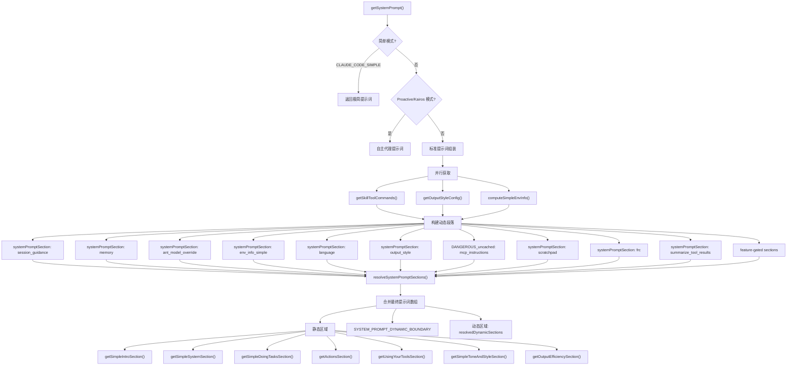

# 系统提示词构建

## 概述

系统提示词（System Prompt）是 Claude Code 与 Claude 模型交互的核心载体，包含了模型行为指令、工具使用规范、环境信息、MCP 服务器指令、输出风格配置等所有上下文。`constants/prompts.ts` 是系统中最大的常量文件，负责组装这些提示词。提示词构建的架构设计围绕一个关键优化目标展开：**最大化 API 提示词缓存命中率**，从而降低延迟和成本。

## 提示词缓存优化策略

### 核心原理

Anthropic API 的提示词缓存机制（Prompt Caching）会将已发送的提示词前缀缓存起来，如果后续请求的前缀相同，则直接使用缓存而无需重新处理。这意味着：

- **缓存命中的部分**：不消耗输入 token 费用，响应更快
- **缓存失效**：当提示词内容变化时，缓存失效，需要重新处理整个前缀

因此，系统将提示词分为两类：

1. **缓存区（Cached Section）**：跨轮次不变或很少变化的内容，使用 `systemPromptSection()` 创建
2. **易变区（Volatile Section）**：每轮可能变化的内容，使用 `DANGEROUS_uncachedSystemPromptSection()` 创建

### systemPromptSection()

创建可缓存的提示词段落，计算一次后缓存直到 `/clear` 或 `/compact`：

```typescript
export function systemPromptSection(
  name: string,
  compute: ComputeFn,
): SystemPromptSection {
  return { name, compute, cacheBreak: false }
}
```

缓存逻辑在 `resolveSystemPromptSections()` 中实现：
- 如果段落不是 `cacheBreak` 且缓存中已存在，直接返回缓存值
- 否则重新计算并写入缓存

### DANGEROUS_uncachedSystemPromptSection()

创建每轮重新计算的易变段落，会导致提示词缓存失效：

```typescript
export function DANGEROUS_uncachedSystemPromptSection(
  name: string,
  compute: ComputeFn,
  _reason: string,  // 必须说明缓存失效的原因
): SystemPromptSection {
  return { name, compute, cacheBreak: true }
}
```

目前仅有一个段落使用此标记：`mcp_instructions`，因为 MCP 服务器在轮次之间可能连接或断开。

### 动态边界标记

`SYSTEM_PROMPT_DYNAMIC_BOUNDARY` 常量标记了静态内容与动态内容的分界线：

- **边界之前**：静态内容（跨组织可缓存），可使用 `scope: 'global'`
- **边界之后**：动态内容（用户/会话特定），不应全局缓存

此标记在 `src/utils/api.ts`（`splitSysPromptPrefix`）和 `src/services/api/claude.ts`（`buildSystemPromptBlocks`）中使用，决定缓存范围。

## 提示词组装管线



## 提示词段落详解

### 静态区域（缓存友好）

#### 1. 简介段（Intro Section）

`getSimpleIntroSection()` 定义模型的基本身份和行为边界：
- 核心身份："You are an interactive agent..."
- 网络安全指令（`CYBER_RISK_INSTRUCTION`）：明确授权边界——协助授权的安全测试、CTF 和教育场景，拒绝破坏性攻击
- URL 安全规则：禁止生成或猜测 URL，除非与编程相关

#### 2. 系统段（System Section）

`getSimpleSystemSection()` 定义系统级行为规范：
- 文本输出格式：Github-flavored Markdown，等宽字体渲染
- 工具权限模式说明
- 系统提醒标签说明
- 外部数据安全：标记可能的注入攻击
- Hook 反馈处理
- 自动压缩说明

#### 3. 任务执行段（Doing Tasks Section）

`getSimpleDoingTasksSection()` 是最长的段落之一，定义软件工程任务的行为准则：
- 代码风格子指令：不过度添加功能、不添加不必要错误处理、避免过早抽象
- 内部用户（ant）额外指令：注释规范、完成验证、如实报告
- 用户帮助信息

#### 4. 行为谨慎段（Actions Section）

`getActionsSection()` 定义高风险操作的确认规则：
- 不可逆操作需要确认
- 共享状态变更需要确认
- 第三方内容上传需要注意敏感性
- 遇到障碍不使用破坏性操作作为捷径

#### 5. 工具使用段（Using Your Tools Section）

`getUsingYourToolsSection()` 定义工具使用偏好：
- 优先使用专用工具（Read/Edit/Write/Glob/Grep）而非 Bash
- REPL 模式下的特殊指引
- 并行工具调用规则
- Task/Todo 管理指引

#### 6. 语气与风格段（Tone and Style Section）

- 禁止使用 Emoji（除非用户明确要求）
- 代码引用格式（file_path:line_number）
- GitHub 引用格式（owner/repo#123）

#### 7. 输出效率段（Output Efficiency Section）

根据用户类型区分：
- **内部用户**：详细的沟通指引，强调流畅散文体、倒金字塔结构
- **外部用户**：极简指引，"Go straight to the point"

### 动态区域（每轮可能变化）

#### 1. 会话引导段（session_guidance）

`getSessionSpecificGuidanceSection()` 包含依赖运行时状态的指引：
- AskUserQuestion 工具指引
- 非交互会话的 shell 命令建议
- Agent 工具/Fork 子代理指引
- Explore 代理指引
- 技能（Skill）调用指引
- 验证代理（Verification Agent）指引（特性门控）

**注意**：这些条件是运行时位，放在动态边界后可避免 Blake2b 前缀哈希变体的组合爆炸。

#### 2. 记忆段（memory）

`loadMemoryPrompt()` 从内存目录（memdir）加载持久化记忆内容。

#### 3. MCP 指令段（mcp_instructions）

这是唯一使用 `DANGEROUS_uncachedSystemPromptSection` 的段落，因为 MCP 服务器在轮次间可能连接或断开。当 MCP 指令增量模式（`isMcpInstructionsDeltaEnabled`）启用时，此段返回 null，改用持久化的 `mcp_instructions_delta` 附件传递。

#### 4. 环境信息段（env_info_simple）

`computeSimpleEnvInfo()` 提供运行环境详情：
- 工作目录
- Git 仓库状态
- 工作树标识
- 平台和 Shell 信息
- 模型名称和 ID
- 知识截止日期
- 最新模型家族 ID

#### 5. 输出风格段（output_style）

当配置了自定义输出风格时，附加风格名称和提示词。

#### 6. 语言段（language）

当设置了语言偏好时，指示模型始终使用指定语言回应。

#### 7. 函数结果清除段（frc）

仅在 `CACHED_MICROCOMPACT` 特性启用且模型支持时出现，提示旧工具结果将被自动清除。

#### 8. Token 预算段（token_budget）

`TOKEN_BUDGET` 特性门控，指示模型在用户指定 token 目标时持续工作直到接近目标。

#### 9. Brief 段（brief）

`KAIROS` / `KAIROS_BRIEF` 特性门控，附加 Brief 工具的主动模式指令。

## 特性门控段落

多个段落受编译时特性标志门控，通过 `feature()` 宏实现死代码消除（DCE），确保外部构建中不包含这些功能：

| 特性标志 | 影响的段落 | 说明 |
|----------|-----------|------|
| `PROACTIVE` / `KAIROS` | 主动模式整个提示词路径 | 自主代理行为 |
| `KAIROS_BRIEF` | Brief 段落 | 简报工具指令 |
| `CACHED_MICROCOMPACT` | 函数结果清除段 | 缓存微压缩 |
| `TOKEN_BUDGET` | Token 预算段 | Token 消耗目标 |
| `EXPERIMENTAL_SKILL_SEARCH` | 技能发现指引 | 技能搜索工具 |
| `VERIFICATION_AGENT` | 验证代理段 | 对抗性验证 |

## XML 标签命名空间

`constants/xml.ts` 定义了提示词中使用的结构化 XML 标签，用于在消息中标记不同类型的内容：

### 命令与终端标签

| 标签 | 用途 |
|------|------|
| `command-name` | 技能/命令元数据 |
| `command-message` | 命令消息内容 |
| `command-args` | 命令参数 |
| `bash-input` | Bash 命令输入 |
| `bash-stdout` / `bash-stderr` | Bash 输出 |
| `local-command-stdout` / `local-command-stderr` | 本地命令输出 |

### 任务通知标签

| 标签 | 用途 |
|------|------|
| `task-notification` | 后台任务完成通知 |
| `task-id` / `tool-use-id` | 任务/工具标识 |
| `status` / `summary` / `reason` | 任务状态信息 |

### 协作标签

| 标签 | 用途 |
|------|------|
| `teammate-message` | Swarm 代理间通信 |
| `channel-message` / `channel` | 外部通道消息 |
| `cross-session-message` | 跨会话 UDS 消息 |
| `fork-boilerplate` | Fork 子代理消息模板 |

### 特殊标签

| 标签 | 用途 |
|------|------|
| `tick` | 主动模式的唤醒信号 |
| `ultraplan` | 远程并行规划 |
| `remote-review` / `remote-review-progress` | 远程审查结果 |

## 网络安全指令

`constants/cyberRiskInstruction.ts` 包含安全相关指令，由 Safeguards 团队拥有和维护：

- 协助授权的安全测试、防御性安全、CTF 和教育场景
- 拒绝破坏性技术、DoS 攻击、大规模目标攻击、供应链攻击和恶意规避
- 双用途安全工具（C2 框架、凭据测试、漏洞利用开发）需要明确的授权上下文

**重要**：此指令的修改需要 Safeguards 团队审查和明确批准。

## 清除提示词段落

`clearSystemPromptSections()` 在以下场景调用：
- `/clear` 命令
- `/compact` 命令

同时重置 beta header 锁存器，确保新对话获得最新的 AFK/fast-mode/cache-editing header 评估。

## 子代理提示词

`DEFAULT_AGENT_PROMPT` 和 `enhanceSystemPromptWithEnvDetails()` 为子代理构建提示词：
- 基本身份："You are an agent for Claude Code..."
- 环境详情（工作目录、平台等）
- 子代理注意事项（使用绝对路径、避免 Emoji 等）
- 技能发现指引（如果启用）

## 提示词缓存优化实例

### MCP 指令增量模式

传统方式下，MCP 指令每轮重新计算并包含在系统提示词中（`DANGEROUS_uncachedSystemPromptSection`），这会在 MCP 服务器晚连接时破坏缓存。增量模式（`mcp_instructions_delta`）将 MCP 指令作为持久化附件传递，避免每轮重算：

- 模式关闭：`mcp_instructions` 段落每轮重算，破坏缓存
- 模式开启：`mcp_instructions` 段落返回 null，指令通过附件传递

### 会话特定指引位置

`getSessionSpecificGuidanceSection()` 放在动态边界之后而非之前，因为其中的条件（如 `isForkSubagentEnabled()` 读取 `getIsNonInteractiveSession()`）是运行时位。如果放在边界前，N 个条件会产生 2^N 个 Blake2b 前缀哈希变体，严重降低缓存效率。

### 数值长度锚点

内部用户的 `numeric_length_anchors` 段落使用 "<=25 words" / "<=100 words" 的数值锚点，研究显示可减少约 1.2% 的输出 token，比定性描述 "be concise" 更有效。
