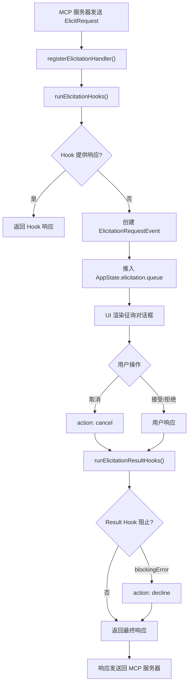
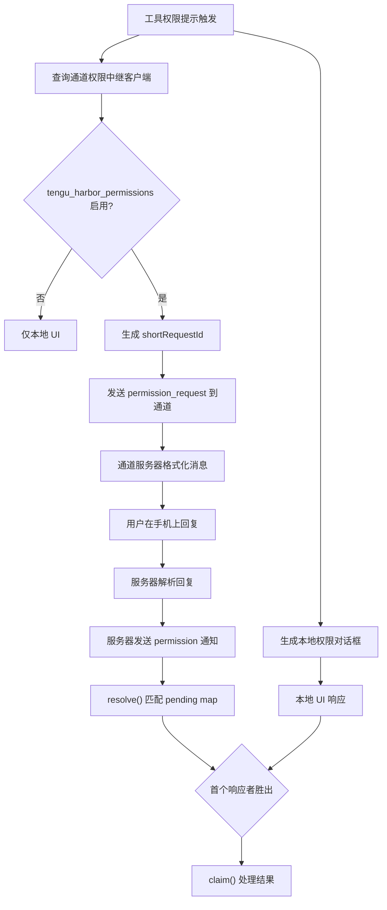
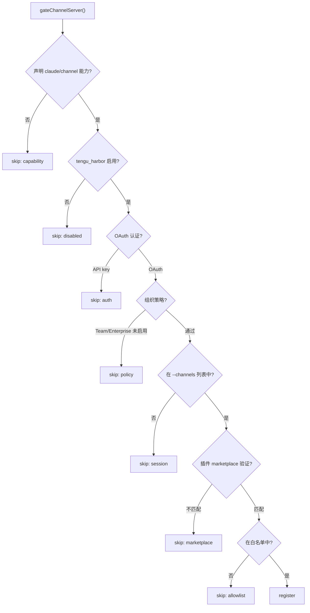

# MCP征询与通道权限

## 概述

MCP 征询（Elicitation）和通道权限（Channel Permissions）是 Claude Code 中两个紧密关联的系统，共同实现了人机交互的安全边界。征询机制允许 MCP 服务器向用户请求信息或确认，通道权限系统则将权限提示路由到移动设备等远程界面，使用户能够从 Telegram、iMessage、Discord 等渠道批准或拒绝工具调用。这两个系统的设计核心是：确保 AI 系统无法自行批准权限请求，所有批准必须来自人类用户的明确操作。

## MCP 征询系统

### 概述

征询（Elicitation）是 MCP 协议中服务器主动向用户请求信息或确认的机制。当 MCP 服务器需要用户输入（如 OAuth 认证确认、配置选择等）时，通过征询请求将交互推送给用户。

### 两种征询模式

| 模式 | 说明 | 用途 |
|------|------|------|
| `form` | 表单模式，服务器请求结构化数据 | 配置输入、参数收集 |
| `url` | URL 模式，引导用户访问外部 URL | OAuth 认证、外部确认流程 |

### 征询请求流程



### ElicitationRequestEvent 结构

每个征询请求在 AppState 的队列中存储以下信息：

```typescript
export type ElicitationRequestEvent = {
  serverName: string          // MCP 服务器名称
  requestId: string | number  // JSON-RPC 请求 ID
  params: ElicitRequestParams // 征询参数（消息、模式、URL 等）
  signal: AbortSignal         // 中止信号
  respond: (response: ElicitResult) => void  // 响应回调
  waitingState?: ElicitationWaitingState     // URL 模式的等待状态
  onWaitingDismiss?: (action) => void         // 等待状态消除回调
  completed?: boolean         // 服务器确认完成标志
}
```

### URL 模式的两阶段交互

URL 模式支持两阶段交互流程：

1. **第一阶段**：用户打开 URL（如 OAuth 认证页面）
2. **等待状态**：显示等待界面，提供 "Skip confirmation" 按钮
3. **完成通知**：服务器通过 `ElicitationCompleteNotification` 确认操作完成
4. **第二阶段消除**：用户可以跳过等待、重试或取消

### 征询 Hook 系统

征询系统有两层 Hook：

1. **前置 Hook**（`runElicitationHooks`）：在显示 UI 之前执行，可以程序化提供响应
   - 如果 Hook 返回 `blockingError`，直接返回 `decline`
   - 如果 Hook 返回 `elicitationResponse`，使用该响应跳过 UI

2. **后置 Hook**（`runElicitationResultHooks`）：在用户响应后执行，可以修改或阻止响应
   - 如果 Hook 返回 `blockingError`，覆盖为 `decline`
   - 如果 Hook 返回 `elicitationResultResponse`，覆盖原始响应
   - 无论结果如何，都触发 `elicitation_response` 通知

### 中止处理

征询请求支持通过 `AbortSignal` 中止：
- 信号触发时自动返回 `{ action: 'cancel' }`
- 使用 `{ once: true }` 避免重复监听
- 中止后从信号中移除监听器

## 通道权限系统

### 概述

通道权限系统允许用户通过移动设备（Telegram、iMessage、Discord）远程批准或拒绝工具权限提示。当 Claude Code 遇到权限对话框时，它同时将提示发送到活跃的通道，与本地 UI、Bridge、Hook 和分类器竞争——首个响应者胜出。

### 设计安全考量

通道权限系统的核心安全问题是：这会让 Claude 自行批准权限吗？答案是"不会"：

1. **批准方是人类**：通过通道操作的始终是人类用户
2. **信任边界是白名单**（`tengu_harbor_ledger`）：而非终端本身
3. **已接受的权衡**：被入侵的通道服务器确实可以伪造 "yes <id>" 响应，但被入侵的通道已经有无限的对话注入能力（长期社会工程学攻击、等待 acceptEdits 等）；注入后自行批准只是更快，不是更有能力

### 通道权限中继流程



### shortRequestId 生成

`shortRequestId()` 将工具使用 ID 转换为 5 个字母的短 ID，方便手机用户输入：

**FNV-1a 哈希算法**：
1. 初始值 `h = 0x811c9dc5`
2. 逐字符 XOR 并乘以 `0x01000193`
3. 转为 uint32 后以 25 为基数编码

**25 字母表**：`a-z` 减去 `l`（因为在许多字体中看起来像 `1` 或 `I`），25^5 约 980 万种组合

**亵渎词语过滤**：5 个随机字母可能拼出不雅词汇。系统维护了一个屏蔽子字符串列表，如果生成的 ID 包含任何屏蔽词，则加盐重新哈希。约 1/700 的概率命中屏蔽列表，重试 10 次后 (1/700)^10 的概率可忽略不计。

### 通道权限回调

`createChannelPermissionCallbacks()` 创建回调对象，管理待处理的权限请求：

```typescript
export type ChannelPermissionCallbacks = {
  onResponse(requestId, handler): () => void  // 注册响应处理器
  resolve(requestId, behavior, fromServer): boolean  // 解决待处理请求
}
```

**关键设计决策**：
- `pending` Map 是闭包内的局部变量，不是模块级变量，也不是 AppState 的一部分（函数放入状态会导致相等性/序列化问题）
- `resolve()` 在调用处理器前删除条目，防止重复事件和重入问题
- 键统一为小写，确保大小写不敏感匹配

### 回复格式规范

通道服务器实现以下正则表达式来匹配用户回复：

```
/^\s*(y|yes|n|no)\s+([a-km-z]{5})\s*$/i
```

规则：
- 必须以 yes/no 开头，后跟 5 字母 ID
- 大小写不敏感（手机自动纠正友好）
- 不允许裸 yes/no（避免对话性文本误匹配）
- 不允许前后附加文本

### 权限中继客户端过滤

`filterPermissionRelayClients()` 从 MCP 客户端中筛选能够中继权限提示的服务器，必须同时满足三个条件：

1. **已连接**（`type === 'connected'`）
2. **在会话 `--channels` 白名单中**（`isInAllowlist(c.name)`）
3. **声明了两个能力**：
   - `capabilities.experimental['claude/channel']`（通道能力）
   - `capabilities.experimental['claude/channel/permission']`（权限中继能力）

第二个能力是服务器的明确选择加入——仅中继文本的通道永远不会意外成为权限界面。

### 工具输入预览截断

`truncateForPreview()` 将工具输入截断为约 200 字符的 JSON 预览，适合手机屏幕显示。完整输入仍在本地终端对话框中可见。

## 通道访问控制

### 白名单系统

通道白名单（`channelAllowlist.ts`）控制哪些 MCP 插件可以作为通道注册：

- **数据源**：GrowthBook 的 `tengu_harbor_ledger` 特性，可在不发布新版本的情况下更新
- **粒度**：插件级别（`{marketplace, plugin}`），而非服务器级别
- **逻辑**：如果插件被批准，其所有通道服务器都被批准
- **安全边界**：白名单检查是纯 `{marketplace, plugin}` 比较，不验证实际安装内容

### 总开关

`isChannelsEnabled()` 检查 `tengu_harbor` 特性标志，当为 false 时，`--channels` 参数无效，不注册任何处理器。

### 通道门控流程

`gateChannelServer()` 按顺序检查以下条件：



### 组织级控制

- **Team/Enterprise 组织**：必须在托管设置中显式启用 `channelsEnabled: true`
- **允许列表来源**：组织可设置 `allowedChannelPlugins` 替代 GrowthBook 白名单
- **API key 用户**：目前被阻止（Console 管理界面尚不支持通道启用）

## 通道通知

### 通知格式

`channelNotification.ts` 定义了通道消息的包装格式：

```xml
<channel source="server_name" attr1="value1" attr2="value2">
  消息内容
</channel>
```

**安全措施**：
- Meta 键必须是纯标识符（`/^[a-zA-Z_][a-zA-Z0-9_]*$/`），防止 XML 属性注入
- 属性值通过 `escapeXmlAttr()` 转义

### 权限请求/响应协议

**出站（CC 到服务器）**：
- 方法：`notifications/claude/channel/permission_request`
- 参数：`request_id`、`tool_name`、`description`、`input_preview`

**入站（服务器到 CC）**：
- 方法：`notifications/claude/channel/permission`
- 参数：`request_id`、`behavior`（allow/deny）

服务器解析用户回复 "yes tbxkq" 为结构化事件，CC 不再正则匹配文本，通道中的通用文本无法意外批准任何操作。

### 通道与权限中继的关系

通道系统提供消息路由能力，权限中继是其上的一个专门功能：
- 通道负责消息的双向传递
- 权限中继添加了短 ID 生成、回复匹配和竞争解决机制
- 两者通过独立的能力声明解耦——通道可以只做消息中继而不同时成为权限界面

## 安全模型总结

| 层级 | 机制 | 保护目标 |
|------|------|----------|
| 传输层 | OAuth Bearer 认证 + TLS | 防止未授权访问 |
| 能力层 | 双能力声明（channel + permission） | 防止意外权限面 |
| 会话层 | `--channels` 显式选择加入 | 防止服务器偷偷添加能力 |
| 白名单层 | GrowthBook/组织级允许列表 | 防止恶意插件 |
| Marketplace 验证 | 标签与实际安装源匹配 | 防止插件冒充 |
| 协议层 | 结构化事件替代文本正则 | 防止对话文本误触发 |
| 输入验证 | XML 属性键白名单 + 值转义 | 防止注入攻击 |
