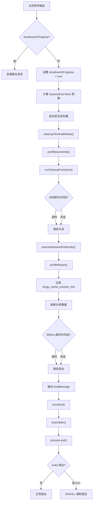

# 优雅关闭与资源清理

## 概述

优雅关闭（Graceful Shutdown）是 Claude Code 进程终止时的核心流程，确保所有资源被正确清理、数据被持久化、终端状态被恢复。该系统通过 `utils/gracefulShutdown.ts` 实现，采用信号处理器、清理注册表、超时保护和强制退出等机制，在正常退出和异常终止场景下都能保证系统的一致性。

## 关闭序列总览



## 信号处理

### setupGracefulShutdown()

该函数通过 `memoize` 确保只执行一次，注册以下信号处理器：

| 信号 | 退出码 | 说明 |
|------|--------|------|
| SIGINT | 0 | 用户按 Ctrl+C。Print 模式下跳过（print.ts 有自己的处理器） |
| SIGTERM | 143 | 128 + 15，标准 SIGTERM 退出码 |
| SIGHUP | 129 | 128 + 1，终端关闭（仅非 Windows） |

### signal-exit Pin

系统使用 signal-exit v4 库来处理进程退出。但 Bun 运行时存在一个 bug：`process.removeListener(sig, fn)` 会重置内核的 sigaction，即使其他 JS 监听器仍然存在，信号也会回退到默认动作（终止），导致自定义处理器失效。

**触发场景**：短期 signal-exit 订阅者（如 execa 的子进程、Ink 实例）取消订阅时，如果它是 v4 的最后一个订阅者，v4 的 `unload()` 会调用 `removeListener`，触发 Bun bug。

**修复**：注册一个永不取消订阅的空操作回调，保持 v4 内部发射器计数大于 0，阻止 `unload()` 执行。

### 孤儿进程检测

在非 Windows 平台上，当终端关闭但未传递 SIGHUP 时（如 macOS 撤销 TTY 文件描述符），进程可能变为孤儿进程但仍然存活。系统每 30 秒检查 `process.stdout.writable` 和 `process.stdin.readable`，如果检测到失效则触发优雅关闭。

### 未捕获异常与拒绝处理

注册 `uncaughtException` 和 `unhandledRejection` 处理器，记录错误信息到诊断日志和分析事件：
- 错误名称（如 "TypeError"）不敏感，可以安全记录
- 错误消息截断到 2000 字符
- 错误堆栈截断到 4000 字符（仅未处理拒绝）

## 终端模式清理

### cleanupTerminalModes()

该函数在进程退出前同步清理终端状态，使用 `writeSync` 确保写入在退出前完成。清理顺序经过精心设计：

1. **禁用鼠标追踪**：最先执行，因为终端需要一轮 RTT 时间处理
2. **退出备用屏幕**：通过 Ink 的 `unmount()` 而非直接写 ESC 序列，避免：
   - 重复 1049l 导致光标跳回
   - unmount 在主缓冲区上错误渲染
3. **排空 stdin**：捕获在 unmount 树遍历期间到达的事件
4. **分离 Ink 实例**：标记为已卸载，防止 signal-exit 的延迟 ink.unmount() 发送冗余序列
5. **禁用扩展键报告**：`DISABLE_MODIFY_OTHER_KEYS` 和 `DISABLE_KITTY_KEYBOARD`
6. **禁用焦点事件**：DFE（DECSET 1004）
7. **禁用括号粘贴模式**：DBP
8. **显示光标**：SHOW_CURSOR
9. **清除 iTerm2 进度条**
10. **清除标签状态**：OSC 21337
11. **清除终端标题**：尊重 `CLAUDE_CODE_DISABLE_TERMINAL_TITLE` 设置

所有清理序列无条件发送，因为：
- 终端检测不一定准确（如在 tmux/screen 中）
- 不支持的终端会忽略这些序列（无操作）
- 未能禁用会让终端处于损坏状态

## 恢复提示

### printResumeHint()

在退出前打印会话恢复提示，仅在以下条件同时满足时显示：
- stdout 是 TTY
- 交互式会话
- 会话持久化未禁用
- 会话文件存在

提示内容：
```
Resume this session with:
claude --resume <session_id_or_title>
```

使用 `writeSync` 确保在强制退出前写入完成。

## 清理注册表

### 注册模式

`cleanupRegistry.ts` 提供了全局清理函数注册表，与 `gracefulShutdown.ts` 分离以避免循环依赖：

```typescript
const cleanupFunctions = new Set<() => Promise<void>>()

export function registerCleanup(cleanupFn: () => Promise<void>): () => void {
  cleanupFunctions.add(cleanupFn)
  return () => cleanupFunctions.delete(cleanupFn)  // 返回取消注册函数
}
```

### 使用清理注册表的系统

| 系统 | 清理内容 |
|------|----------|
| OpenTelemetry | MeterProvider/LoggerProvider/TracerProvider 关闭 |
| 1P 事件日志 | LoggerProvider 关闭 |
| GrowthBook | 客户端销毁 |
| LSP 服务器管理器 | 关闭 LSP 服务器 |
| 会话团队 | 清理团队资源 |
| MCP 服务器 | 断开连接 |
| Beta Tracing | Provider 刷新与关闭 |
| 文件描述符 | 关闭打开的文件句柄 |

### 执行策略

`runCleanupFunctions()` 使用 `Promise.all` 并行执行所有清理函数，并设置 2 秒超时：
- 如果所有清理函数在超时内完成，正常继续
- 如果超时，继续关闭流程，不等待剩余清理
- 所有错误被静默忽略

## SessionEnd Hook 执行

### 执行方式

`executeSessionEndHooks()` 在清理函数之后执行，包含：
- 原因参数（'user_exit'、'signal'、'other' 等）
- AbortSignal 超时控制
- 整体执行预算通过 `CLAUDE_CODE_SESSIONEND_HOOKS_TIMEOUT_MS` 配置（默认 1.5 秒）

### 预算计算

安全定时器的预算为 `max(5s, hookTimeoutMs + 3500ms)`，确保即使 Hook 预算较大，安全定时器也能覆盖。

## 分析数据刷新

### 刷新策略

分析数据刷新使用 500ms 超时上限：
- `shutdown1PEventLogging()`：1P 事件日志 Provider 关闭
- `shutdownDatadog()`：Datadog 客户端关闭

**设计决策**：丢失慢网络上的分析数据是可以接受的；挂起的退出则不可接受。之前的实现是无界等待——1P 导出器等待所有 pending 的 axios POST（每个 10 秒），可能耗尽整个安全定时器预算。

## 缓存淘汰提示

退出时记录 `tengu_cache_eviction_hint` 事件，包含 `last_request_id`，通知推理层此会话的缓存可以淘汰。此事件在分析刷新前发出，确保事件能进入管道。

## 强制退出

### forceExit()

`forceExit()` 是最终的退出函数，处理终端已关闭的情况：

1. 清除安全定时器
2. 排空 stdin（捕获飞行中的终端事件）
3. 尝试 `process.exit(exitCode)`
4. 如果 `process.exit()` 抛出 EIO（终端已关闭），使用 `SIGKILL`

### 终端已关闭场景

当终端/PTY 已关闭（如 SIGHUP、SSH 断开）时，`process.exit()` 可能抛出 EIO 错误，因为 Bun 尝试向已死亡的文件描述符刷新 stdout。此时回退到 `SIGKILL`，它不尝试刷新任何内容。

### 测试环境处理

在测试环境中，`process.exit` 被模拟为抛出异常，需要重新抛出以便测试能捕获。

## 关闭中的并发控制

### shutdownInProgress 标志

`shutdownInProgress` 标志防止重复进入关闭流程：
- 首次进入时设为 `true`
- 后续的 SIGINT/SIGTERM 等信号被忽略
- 仅在测试中通过 `resetShutdownState()` 重置

### pendingShutdown Promise

`pendingShutdown` 存储正在进行的关闭 Promise，用于：
- `gracefulShutdownSync()` 中等待异步关闭完成
- 测试中通过 `getPendingShutdownForTesting()` 等待关闭

### 同步关闭入口

`gracefulShutdownSync()` 提供同步入口，用于无法等待异步操作的场景：
1. 设置 `process.exitCode`
2. 启动异步 `gracefulShutdown()`
3. 捕获所有错误，确保最终调用 `forceExit()`

## 中止控制器与查询中断

### 进行中查询的中止

关闭时，进行中的 API 查询需要被中止。这通过以下机制实现：
- 每个查询关联的 AbortController 在关闭时触发
- API 流（Streaming）的中止由客户端中断处理
- 工具执行中的长时间运行操作检查中止信号

### pendingPostCompaction 清理

如果关闭时正在进行压缩后的操作，系统确保这些操作被正确清理，避免数据不一致。

## 会话持久化与崩溃恢复

### 设计原则

会话持久化确保即使进程意外终止，用户也能恢复之前的工作：
- 每轮对话后自动保存会话状态
- 会话文件包含完整的消息历史和工具调用结果
- 退出时显示恢复提示（`printResumeHint()`）
- 崩溃后的下一次启动自动检测未完成的会话

### 关闭时的数据安全

关闭流程中的数据安全由以下措施保证：
1. **会话数据优先刷新**：在任何可能挂起的操作之前完成
2. **超时保护**：所有异步操作都有超时上限
3. **安全定时器**：保证进程最终退出
4. **同步写入**：关键数据使用 `writeSync` 确保写入

## 超时层次总结

| 阶段 | 超时 | 说明 |
|------|------|------|
| 清理函数 | 2000ms | 并行执行所有注册的清理函数 |
| SessionEnd Hook | 1500ms（默认） | 可通过环境变量配置 |
| 分析刷新 | 500ms | 1P 事件日志 + Datadog |
| 安全定时器 | max(5000ms, hookTimeout + 3500ms) | 保证进程最终退出 |
| OTEL 关闭 | 2000ms（默认） | 可通过 `CLAUDE_CODE_OTEL_SHUTDOWN_TIMEOUT_MS` 配置 |
| OTEL 刷新 | 5000ms（默认） | 可通过 `CLAUDE_CODE_OTEL_FLUSH_TIMEOUT_MS` 配置 |
| 孤儿检测 | 30000ms 间隔 | 检查 TTY 有效性 |
