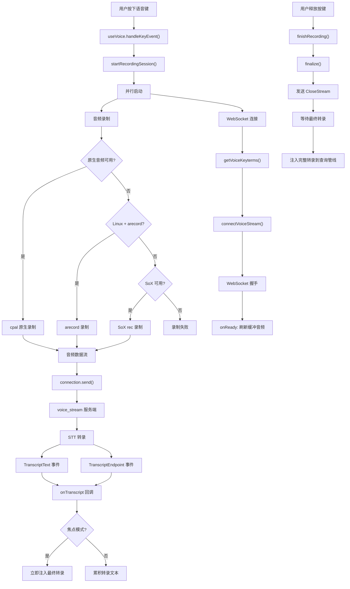

# 语音模式

## 概述

语音模式是 Claude Code 的替代输入方式，允许用户通过语音而非键盘输入查询。系统采用"按住说话"（Hold-to-Talk）交互模型，同时支持"焦点模式"下的连续语音输入。语音输入通过 Anthropic 的 `voice_stream` WebSocket 端点进行实时流式语音转文字（STT），使用与 Claude Code 相同的 OAuth 凭证认证。

语音模式由三个核心模块组成：
- `services/voice.ts`：音频录制，支持原生音频捕获（cpal）和 SoX/arecord 后备
- `services/voiceStreamSTT.ts`：WebSocket 流式语音转文字客户端
- `services/voiceKeyterms.ts`：领域关键词提示，提升 STT 准确率

## 语音输入管线

## 特性门控

### 编译时门控

语音模式通过 `feature('VOICE_MODE')` 编译时特性标志控制。在外部构建中，此特性被死代码消除（DCE），相关模块完全不存在。

### 运行时门控

`useVoiceEnabled()` Hook 组合三个条件：

1. **用户意图**：`settings.voiceEnabled === true`（用户在设置中启用）
2. **认证状态**：`hasVoiceAuth()`（需要 Claude.ai OAuth 认证）
3. **GrowthBook 开关**：`isVoiceGrowthBookEnabled()`（运行时 kill-switch）

只有三个条件同时为真时，语音模式才可用。

### 认证要求

语音模式使用与 Claude Code 相同的 OAuth 凭证连接 `voice_stream` 端点：
- 需要 `isAnthropicAuthEnabled()` 为真
- 需要 `getClaudeAIOAuthTokens().accessToken` 存在
- API Key 用户无法使用语音模式

## 音频录制

### 录制后端优先级

系统按以下优先级尝试音频录制后端：

1. **原生音频模块**（`audio-capture-napi`）：基于 cpal，macOS 使用 CoreAudio + AudioUnit，Linux 使用 ALSA，Windows 使用 WASAPI
2. **arecord**：Linux ALSA 工具，仅 Linux 平台
3. **SoX rec**：跨平台后备

### 原生音频模块

原生音频模块通过 NAPI 桥接 cpal 库：
- **懒加载**：`audio-capture-napi` 在首次语音按键时才加载，因为 `dlopen` 是同步操作，会阻塞事件循环 1-8 秒（取决于 CoreAudio 状态）
- **macOS TCC 权限**：首次使用会触发系统麦克风权限对话框
- **WSL 兼容**：cpal 的 ALSA 后端在 WSL 上可能无法找到声卡，系统额外检查 `/proc/asound/cards`

### arecord 后端

在 Linux 上，arecord 是原生模块的后备：
- 记录参数：S16_LE、16kHz、16-bit、单声道
- **探测机制**（`probeArecord()`）：通过实际启动 arecord 来验证设备是否可用（`hasCommand` 不够，因为二进制文件可能存在但设备不可用）
- 不支持内置静音检测，适合按住说话模式
- WSL2+WSLg（Windows 11）通过 PulseAudio RDP 管道工作

### SoX 后备

SoX 是最后的后备方案：
- 记录参数：raw PCM、16kHz、16-bit signed、单声道
- `--buffer 1024`：强制 SoX 以小块刷新音频，避免管道模式下的缓冲延迟
- 内置静音检测：2 秒静音后自动停止，3% 阈值
- 包管理器自动检测：brew（macOS）、apt-get/dnf/pacman（Linux）

### 可用性检查

`checkRecordingAvailability()` 执行完整的可用性探测：

| 条件 | 结果 |
|------|------|
| 远程环境（Homespace/REMOTE） | 不可用 |
| 原生模块可用 | 可用 |
| Windows 无原生模块 | 不可用 |
| Linux + arecord 探测通过 | 可用 |
| WSL 无音频设备 | 不可用（WSL 特定提示） |
| SoX 可用 | 可用 |
| 无任何后端 | 不可用（安装指引） |

## 流式语音转文字

### 连接建立

`connectVoiceStream()` 建立与 Anthropic `voice_stream` 端点的 WebSocket 连接：

1. **OAuth 刷新**：确保 token 有效
2. **端点选择**：使用 `api.anthropic.com` 而非 `claude.ai`（后者使用 Cloudflare TLS 指纹检测，会阻止非浏览器客户端）
3. **查询参数**：
   - `encoding=linear16`
   - `sample_rate=16000`
   - `channels=1`
   - `endpointing_ms=300`
   - `utterance_end_ms=1000`
   - `language=<BCP-47>`（默认 `en`）
   - `keyterms=<term>`（可重复）

### Deepgram Nova 3 集成

当 `tengu_cobalt_frost` 特性标志启用时，使用 Deepgram Nova 3：
- 添加 `use_conversation_engine=true` 和 `stt_provider=deepgram-nova3` 参数
- Nova 3 的中间结果是跨段累积的，可以修订早期文本
- 禁用自动终结逻辑（Nova 3 仅在最终刷新时发送端点）

### KeepAlive 机制

WebSocket 连接使用定期 KeepAlive 防止空闲超时：
- 连接建立后立即发送一条 KeepAlive
- 每 8 秒发送后续 KeepAlive
- 原因：音频硬件初始化可能超过 1 秒，KeepAlive 防止服务器在音频捕获开始前关闭连接

### Wire 协议

**客户端到服务器**：
- 二进制帧：原始 PCM 音频数据
- `{"type":"KeepAlive"}`：保持连接活跃
- `{"type":"CloseStream"}`：通知服务器音频输入结束

**服务器到客户端**：
- `{"type":"TranscriptText","data":"..."}`：转录文本（中间或最终）
- `{"type":"TranscriptEndpoint"}`：话语端点标记
- `{"type":"TranscriptError","error_code":"...","description":"..."}`：转录错误

### 段落自动终结

服务器有时会发送多个非累积的 TranscriptText 而没有端点。系统检测到新段落时（当前文本与前一文本互不为前缀），自动将前一段落终结为最终文本，防止新段落覆盖旧段落。

Nova 3 模式下禁用此逻辑，因为其中间结果是累积和可修订的，自动终结会导致文本重复。

### Finalize 流程

当用户释放按键时，`finalize()` 执行以下步骤：

1. **延迟 CloseStream**：通过 `setTimeout(0)` 推迟到下一个事件循环迭代，确保原生录制模块的待处理音频回调先刷新到 WebSocket
2. **四种解析触发器**：
   - `post_closestream_endpoint`：服务器在 CloseStream 后发送 TranscriptEndpoint（约 300ms，最快路径）
   - `no_data_timeout`：1500ms 内未收到新数据（服务器无内容可返回）
   - `ws_close`：WebSocket 关闭（约 3-5 秒服务器拆解）
   - `safety_timeout`：5 秒安全上限

3. **未报告中间文本提升**：所有解析触发器都会将最后的中间文本提升为最终文本

### 静默丢弃重放

约 1% 的会话会遇到"粘性损坏的 CE pod"问题：服务器接受音频但返回零转录。系统检测此场景并自动重试：

条件：`no_data_timeout` + `hadAudioSignal` + `wsConnected` + 非焦点模式 + 零已累积文本 + 首次重试 + 有缓冲音频

重试流程：
1. 关闭当前连接
2. 等待 250ms 退避
3. 在新连接上重放完整音频缓冲区
4. 仅重试一次

### 早期错误重试

连接建立后但在收到任何转录之前的错误，可能是瞬时上游竞争（CE 拒绝、Deepgram 未就绪）。系统自动重试一次，250ms 退避。致命错误（4xx 状态码、Cloudflare 挑战）不重试。

## 关键词提示

### 概述

`voiceKeyterms.ts` 为 STT 引擎提供领域特定词汇提示（Deepgram "keywords"），确保编码术语、项目名称和分支名称被正确识别。

### 全局关键词

硬编码的全局关键词包括：
- MCP、symlink、grep、regex、localhost
- codebase、TypeScript、JSON、OAuth
- webhook、gRPC、dotfiles、subagent、worktree

### 上下文关键词

动态生成的上下文关键词：

1. **项目根目录名**：保持完整名称（用户通常说出完整短语而非拆分单词）
2. **Git 分支词**：通过 `splitIdentifier()` 拆分（如 `feat/voice-keyterms` → "feat"、"voice"、"keyterms"）
3. **最近文件名**：提取文件名词干并拆分标识符

### 标识符拆分

`splitIdentifier()` 处理多种命名约定：
- camelCase / PascalCase：正则拆分
- kebab-case / snake_case：分隔符拆分
- 路径分段：按 `/` 拆分
- 过滤：长度 2-20 字符的片段

### 关键词限制

最多 50 个关键词。全局关键词优先，然后按项目根、分支、最近文件的顺序填充剩余槽位。

## 按住说话交互

### 键事件处理

`handleKeyEvent()` 在每次按键（包括终端自动重复）时调用：

1. **首次按键**（idle 状态）：
   - 立即开始录制会话
   - 设置回退定时器（`FIRST_PRESS_FALLBACK_MS = 2000ms`），如果 OS 按键重复延迟内未检测到自动重复

2. **后续按键**（recording 状态）：
   - 标记检测到自动重复（`seenRepeatRef = true`）
   - 重置释放定时器

3. **释放检测**：
   - 两次按键间隔超过 `RELEASE_TIMEOUT_MS = 200ms` 视为释放
   - 终端自动重复通常 30-80ms，200ms 覆盖抖动

### 为什么等待自动重复？

macOS 默认按键重复延迟约 500ms。如果首次按键就启动释放定时器，定时器会在自动重复开始前触发，导致误判释放。因此只在检测到自动重复后才启动释放定时器。

## 焦点模式

### 概述

焦点模式是一种替代交互模型，用户无需按键，仅通过终端焦点控制录制：
- 终端获得焦点：自动开始录制
- 终端失去焦点：自动停止录制
- 每段最终转录立即注入到查询中（不等待释放）

### 焦点静默超时

焦点模式下，如果 5 秒内没有语音输入，自动拆解会话以释放 WebSocket 连接。此超时在：
- 会话启动时启动
- 每次最终转录后重置
- 检测到中间语音时重置

### 焦点与按键交互

- 按键时如果焦点录制正在活跃，忽略按键事件
- 焦点静默超时后，按键重新启动录制
- 禁用焦点模式时，如果焦点驱动录制正在进行，立即停止

## 语言支持

### 语言规范化

`normalizeLanguageForSTT()` 将用户语言偏好转换为 STT 支持的 BCP-47 代码：

1. 直接匹配支持代码（如 "en"、"zh"）
2. 语言名称查找（如 "english" → "en"、"日本語" → "ja"）
3. 基础标签匹配（如 "zh-CN" → "zh"...但 zh 不在支持列表中）
4. 回退到默认 "en"

### 支持的语言

en、es、fr、ja、de、pt、it、ko、hi、id、ru、pl、tr、nl、uk、el、cs、da、sv、no

## 与 REPL 的集成

`useVoiceIntegration` Hook 将语音模式集成到 REPL 中：
- 受 `VOICE_MODE` 特性标志门控
- 监听语音键绑定
- 将转录文本注入查询管线
- 在录制期间显示波形可视化器

## 音频级别可视化

`computeLevel()` 从 16-bit 有符号 PCM 缓冲区计算 RMS 振幅：
- 归一化到 0-1 范围
- 使用平方根曲线扩展安静级别的可视范围
- 16 条音频柱的直方图
- 通过 AppState 的 `voiceAudioLevels` 驱动 React 渲染

## 会话代际管理

`sessionGenRef` 防止僵尸 WebSocket 连接干扰新会话：
- 每次开始新录制会话时递增代际
- 所有回调在执行前检查代际是否匹配
- 防止慢连接的旧 WebSocket 在用户已经开始新会话后触发回调

`attemptGenRef` 提供更细粒度的代际控制，用于早期错误重试场景，防止重试连接的尾随错误覆盖当前连接状态。
