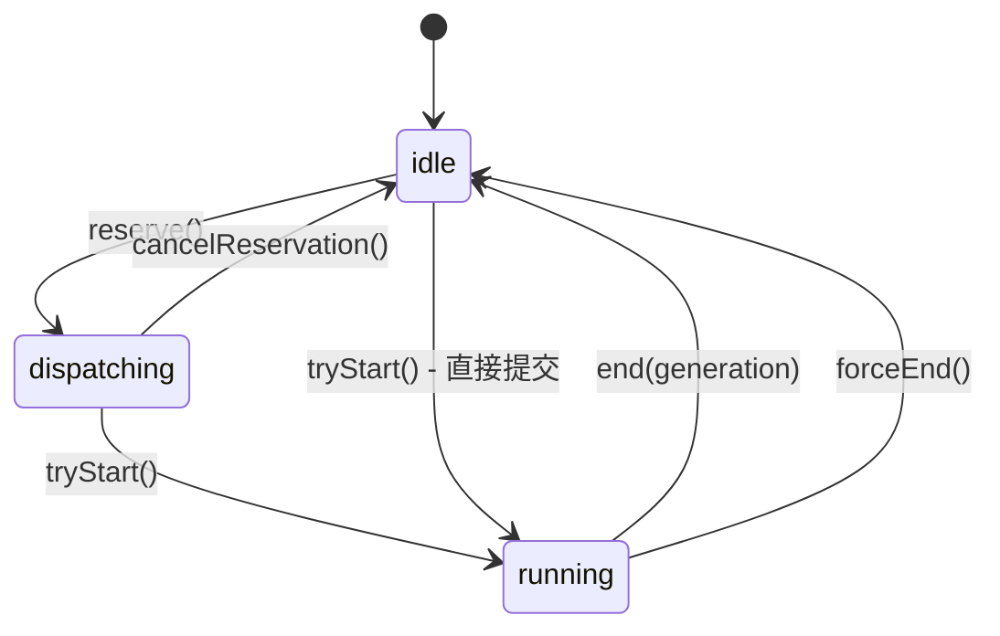

# 推测执行与流水线

## 概述

Claude Code 的推测执行（Speculation）子系统是一个前端优化机制，在用户阅读当前响应时，系统预测性地开始处理下一个可能的操作。通过与提示建议系统（PromptSuggestion）和查询引擎的紧密协作，推测执行可以显著减少用户感知到的延迟。流水线（Pipelining）机制进一步优化了这一过程——当一个推测完成时，系统已经生成了下一个建议并开始其推测执行，形成连续的处理链。

## 推测执行流程

```mermaid
flowchart TD
    A["提示建议生成"] --> B["用户看到建议"]
    B --> C{"用户接受建议?"}
    C -- "否" --> D["推测中止<br/>abortSpeculation()"]
    C -- "是" --> E["接受推测<br/>acceptSpeculation()"]
    E --> F["复制覆盖层文件到主目录"]
    F --> G["注入推测消息到对话"]
    G --> H{"推测是否完整完成?"}
    H -- "是" --> I["无需额外查询"]
    H -- "否" --> J["发起后续查询<br/>从边界继续"]
    I --> K{"有流水线建议?"}
    K -- "是" --> L["提升流水线建议<br/>开始新一轮推测"]
    K -- "否" --> M["等待用户输入"]
    J --> M

    A --> N["startSpeculation()"]
    N --> O["创建覆盖层目录"]
    O --> P["运行forkedAgent"]
    P --> Q{"工具权限检查"}
    Q -- "只读工具" --> R["允许执行"]
    Q -- "写工具且权限允许" --> S["重定向到覆盖层<br/>Copy-on-Write"]
    Q -- "写工具且权限不允许" --> T["设置边界并中止"]
    Q -- "非只读Bash" --> T
    Q -- "其他工具" --> T
    R --> P
    S --> P
    T --> U["记录边界类型<br/>boundary"]
    U --> V{"推测已完成?"}
    V -- "是" --> W["生成流水线建议<br/>generatePipelinedSuggestion()"]
    V -- "否" --> X["等待边界处理"]

    style I fill:"#6f6",stroke:"#333"
    style T fill:"#f96",stroke:"#333"
    style W fill:"#6cf",stroke:"#333"
```

## 一、类型定义与状态

### SpeculationState 类型

`src/state/AppStateStore.ts` 定义了推测执行的核心状态类型：

```typescript
export type SpeculationState =
  | { status: 'idle' }
  | {
      status: 'active'
      id: string                    // 8字符唯一标识
      abort: () => void             // 中止函数
      startTime: number             // 开始时间戳
      messagesRef: { current: Message[] }     // 可变引用，避免每条消息数组展开
      writablePathsRef: { current: Set<string> }  // 写入覆盖层的相对路径集合
      boundary: CompletionBoundary | null      // 完成边界
      suggestionLength: number      // 建议文本长度
      toolUseCount: number          // 已执行工具数
      isPipelined: boolean          // 是否为流水线推测
      contextRef: { current: REPLHookContext }  // 可变上下文引用
      pipelinedSuggestion?: {       // 流水线建议（已完成时生成）
        text: string
        promptId: 'user_intent' | 'stated_intent'
        generationRequestId: string | null
      } | null
    }
```

### SpeculationResult 类型

推测接受后返回的结果：

```typescript
export type SpeculationResult = {
  messages: Message[]               // 推测期间生成的消息
  boundary: CompletionBoundary | null  // 完成边界
  timeSavedMs: number               // 节省的毫秒数
}
```

### CompletionBoundary 类型

推测可能在以下边界处停止：

| 边界类型 | 说明 | 包含信息 |
|----------|------|----------|
| `complete` | 推测完整完成 | 完成时间、输出 token 数 |
| `bash` | 遇到非只读 Bash 命令 | 命令内容、完成时间 |
| `edit` | 遇到文件编辑且权限不允许 | 工具名、文件路径、完成时间 |
| `denied_tool` | 遇到不允许的工具 | 工具名、详情、完成时间 |

### IDLE_SPECULATION_STATE

常量 `{ status: 'idle' }` 表示空闲状态。所有推测状态转换都通过替换整个 `speculation` 字段实现，确保 React 状态更新的不可变性。

### speculationSessionTimeSavedMs

`AppState` 中的 `speculationSessionTimeSavedMs` 字段追踪整个会话中推测执行累计节省的时间。每次接受推测时累加当前推测节省的毫秒数，用于生成 Ant-only 的反馈消息。

## 二、推测执行核心：startSpeculation()

### 实现位置

`src/services/PromptSuggestion/speculation.ts`

### 触发条件

`isSpeculationEnabled()` 检查两个条件：
1. `USER_TYPE === 'ant'`（仅 Ant 用户可用）
2. `getGlobalConfig().speculationEnabled` 默认为 `true`（可在全局配置中禁用）

### 执行流程

1. **中止现有推测**：`abortSpeculation(setAppState)` 确保同一时间只有一个推测运行
2. **生成唯一 ID**：`randomUUID().slice(0, 8)` 生成 8 字符标识
3. **创建子 AbortController**：`createChildAbortController(context.toolUseContext.abortController)`，父查询中止时推测也中止
4. **创建覆盖层目录**：`getOverlayPath(id)` 在 `~/.claude/tmp/speculation/<pid>/<id>` 下创建隔离目录
5. **设置状态**：将 `speculation` 字段设为 `active` 状态
6. **运行 forkedAgent**：`runForkedAgent()` 在独立代理中执行推测，`skipTranscript: true` 跳过转录记录

### 覆盖层隔离机制

推测执行使用 Copy-on-Write 覆盖层实现文件隔离，确保推测期间的写入不影响用户的工作目录：

- **写工具**（Edit/Write/NotebookEdit）：文件路径重定向到覆盖层目录。首次写入时将原始文件复制到覆盖层，后续写入直接修改覆盖层副本。写入路径记录在 `writtenPathsRef` 中
- **读工具**（Read/Glob/Grep/ToolSearch/LSP/TaskGet/TaskList）：如果文件已在覆盖层中存在写入版本，读取覆盖层版本；否则读取主目录原始文件
- **路径外写入**：写入 CWD 外的路径被拒绝（`relative()` 返回绝对路径或 `..` 开头）
- **路径外读取**：读取 CWD 外的路径允许（只读操作安全）

### 工具权限决策

`canUseTool` 回调实现精细的工具权限控制：

1. **写工具**：检查权限模式。`acceptEdits`、`bypassPermissions` 或 `plan + isBypassPermissionsModeAvailable` 模式下允许文件编辑，否则设置 `edit` 边界并中止
2. **只读工具**（Read/Glob/Grep/ToolSearch/LSP/TaskGet/TaskList）：允许执行，路径重定向到覆盖层
3. **Bash 命令**：通过 `checkReadOnlyConstraints` 检查是否只读。只读命令允许，非只读命令设置 `bash` 边界并中止
4. **其他工具**：默认拒绝，设置 `denied_tool` 边界并中止

### 限制条件

- `MAX_SPECULATION_TURNS = 20`：最大推测轮次
- `MAX_SPECULATION_MESSAGES = 100`：最大消息数，超出时调用 `abortController.abort()`

## 三、流水线机制

### generatePipelinedSuggestion()

当推测完整完成（`boundary.type === 'complete'`）时，系统启动流水线建议生成：

1. 检查建议是否被抑制（`getSuggestionSuppressReason`），如被抑制则记录 `logSuggestionSuppressed`
2. 构建增强上下文：原始上下文 + 建议消息 + 推测消息，作为后续建议的输入
3. 创建子 AbortController：`createChildAbortController(parentAbortController)`
4. 生成建议：`generateSuggestion()` 使用增强上下文产生下一个建议
5. 过滤检查：`shouldFilterSuggestion()` 确保建议质量
6. 存储到状态：更新 `pipelinedSuggestion` 字段，包含 `text`、`promptId`、`generationRequestId`

### 流水线提升

当用户接受一个完整推测时，`handleSpeculationAccept()` 自动提升流水线建议：

```typescript
if (isComplete && speculationState.pipelinedSuggestion) {
  const { text, promptId, generationRequestId } = speculationState.pipelinedSuggestion
  setAppState(prev => ({
    ...prev,
    promptSuggestion: { text, promptId, shownAt: Date.now(), acceptedAt: 0, generationRequestId },
  }))
  void startSpeculation(text, augmentedContext, setAppState, true)
}
```

`isPipelined = true` 标记区分流水线推测和普通推测，用于遥测分析。

### 延迟优化效果

流水线机制减少了用户等待时间：

1. **无流水线**：用户接受建议 → 系统生成建议 → 用户接受 → 系统开始推测 → ...（串行）
2. **有流水线**：用户阅读第一个推测结果时，系统已经生成了下一个建议并可能开始了下一轮推测（重叠）

`speculationSessionTimeSavedMs` 追踪累计节省时间，用于 Ant-only 的反馈消息。

## 四、QueryGuard 系统

### 设计目标

`src/utils/QueryGuard.ts` 解决了 `isLoading` 和 `isQueryRunning` 之间的双态失同步问题。React 状态批处理延迟可能导致 `isLoading`（React state）和实际查询运行状态不一致。QueryGuard 使用同步状态机，兼容 React 的 `useSyncExternalStore`。

### 状态机

三个状态：`idle`、`dispatching`、`running`



### 生命周期方法

| 方法 | 转换 | 说明 |
|------|------|------|
| `reserve()` | idle → dispatching | 队列处理预约，非 idle 返回 false |
| `cancelReservation()` | dispatching → idle | 队列无内容时取消预约 |
| `tryStart()` | idle/dispatching → running | 返回 generation 号，running 状态返回 null |
| `end(generation)` | running → idle | 仅当前 generation 匹配时转换，返回是否应执行清理 |
| `forceEnd()` | 任意 → idle | 强制终止，递增 generation 使过期的 finally 块跳过清理 |

### generation 机制

`_generation` 计数器确保过期的异步操作不会干扰当前状态。`end(generation)` 仅在 generation 匹配时执行清理；`forceEnd()` 递增 generation，使被取消查询的 finally 块看到不匹配的 generation 号而跳过清理。这避免了中止操作后的竞态条件。

### React 集成

```typescript
const queryGuard = useRef(new QueryGuard()).current
const isQueryActive = useSyncExternalStore(
  queryGuard.subscribe,
  queryGuard.getSnapshot,
)
```

`subscribe` 和 `getSnapshot` 作为稳定引用，可直接用作 `useSyncExternalStore` 参数。`isActive` 属性始终同步返回，不受 React 状态批处理延迟影响。`getSnapshot` 返回 `this._status !== 'idle'`，即 `isActive` 的快照。

### 信号机制

内部使用 `createSignal()` 实现发布-订阅。每次状态转换调用 `_notify()` 触发信号发射，`useSyncExternalStore` 的订阅者收到通知后重新获取快照。

## 五、推测接受与消息注入

### acceptSpeculation()

接受流程：

1. **调用中止函数**：`abort()` 停止推测代理
2. **复制覆盖层**：`copyOverlayToMain()` 将覆盖层中修改的文件复制回主目录（仅当 `cleanMessageCount > 0` 时）
3. **清理覆盖层**：`safeRemoveOverlay()` 删除临时目录
4. **计算节省时间**：`min(acceptedAt, boundary.completedAt ?? Infinity) - startTime`
5. **更新累计时间**：`speculationSessionTimeSavedMs += timeSavedMs`
6. **记录到转录文件**：写入 `speculation-accept` 类型的日志条目，包含节省时间

### prepareMessagesForInjection()

在注入消息前进行清理：

1. **移除 thinking 块**：`type === 'thinking'` 和 `type === 'redacted_thinking'`
2. **只保留有成功结果的 tool_use**：移除挂起和中断的 tool_use 块及其 tool_result
3. **移除中断消息**：`INTERRUPT_MESSAGE` 和 `INTERRUPT_MESSAGE_FOR_TOOL_USE`
4. **移除空白消息**：API 拒绝仅含空白的 text content blocks
5. **保持消息连续性**：清理后确保对话结构有效

### handleSpeculationAccept()

完整的接受处理流程：

1. **清除提示建议状态**：重置 `promptSuggestion` 字段
2. **准备消息**：`prepareMessagesForInjection()` 清理推测消息
3. **注入用户消息**：立即添加以提供视觉反馈
4. **接受推测**：`acceptSpeculation()` 执行文件复制和状态更新
5. **处理不完整推测**：如果推测未完成，截断末尾的 assistant 消息（不支持 prefill 的模型拒绝以 assistant 消息结尾的对话）
6. **注入推测消息**：将清理后的消息添加到对话
7. **合并文件状态缓存**：更新 `readFileState` 以包含推测期间的读取操作
8. **添加反馈消息**：Ant-only 的推测统计反馈
9. **提升流水线建议**：如果推测完整完成且有流水线建议，开始新一轮推测

返回 `{ queryRequired: !isComplete }`：完整推测不需要额外查询，不完整推测需要发起后续查询从边界继续。

## 六、推测中止

### abortSpeculation()

中止流程：

1. 记录调试日志
2. 调用 `abort()` 终止推测代理
3. `safeRemoveOverlay()` 删除覆盖层目录
4. 重置 `speculation` 状态为 `IDLE_SPECULATION_STATE`
5. 记录遥测事件（`tengu_speculation`, outcome: 'aborted'）

### 自动中止场景

- **用户输入新消息**：`handlePromptSubmit` 检测到推测活跃时自动中止
- **父查询中止**：`abortController.signal.aborted` 传播到子控制器
- **工具权限拒绝**：`canUseTool` 返回 deny 后调用 `abortController.abort()`

## 七、与提示建议系统的交互

### 服务位置

`src/services/PromptSuggestion/` 目录包含提示建议系统的完整实现。

### 交互模式

1. **建议生成**：`generateSuggestion()` 生成建议文本，使用 `user_intent` 或 `stated_intent` prompt 变体
2. **推测触发**：建议显示后，`startSpeculation()` 使用建议文本作为输入
3. **流水线衔接**：推测完成后，`generatePipelinedSuggestion()` 使用增强上下文生成下一个建议
4. **建议抑制**：`getSuggestionSuppressReason()` 和 `shouldFilterSuggestion()` 控制建议的显示和过滤

### 特性门控

- 推测执行：`USER_TYPE === 'ant'` + `speculationEnabled` 配置
- 提示建议：`shouldEnablePromptSuggestion()` 检查
- 流水线：推测完成后的自动行为，无需额外门控

## 八、遥测与分析

### 事件记录

`logSpeculation()` 记录 `tengu_speculation` 事件，包含：

- `speculation_id`：推测唯一标识
- `outcome`：accepted / aborted / error
- `duration_ms`：持续时间
- `suggestion_length`：建议文本长度
- `tools_executed`：执行的工具数
- `completed`：是否完整完成
- `boundary_type` / `boundary_tool`：边界类型和工具
- `is_pipelined`：是否为流水线推测
- `message_count`：消息数（仅 accepted）
- `time_saved_ms`：节省时间（仅 accepted）

### 反馈消息

`createSpeculationFeedbackMessage()` 为 Ant 用户生成统计反馈：

```
[ANT-ONLY] Speculated 5 tool uses · +2.3s saved (5.1s this session)
```

包含：工具使用数或轮次数、token 数（完整推测时）、节省时间、会话累计时间。

## 九、错误处理

推测执行遵循"失败开放"（fail open）原则——出错时回退到正常查询流程，确保用户消息被处理：

1. **覆盖层创建失败**：记录日志，不启动推测
2. **代理运行错误**：AbortError 时清理并重置状态；其他错误记录到 `logError` 和遥测的 `error_type`/`error_message`/`error_phase` 字段
3. **接受处理失败**：`handleSpeculationAccept` 捕获所有异常，记录错误，回退到正常查询流程（返回 `{ queryRequired: true }`）

覆盖层目录使用 `safeRemoveOverlay()` 清理，该函数使用 `recursive: true, force: true, maxRetries: 3` 确保可靠删除。

## 关键源文件

| 文件 | 职责 |
|------|------|
| `src/services/PromptSuggestion/speculation.ts` | 推测执行核心逻辑 |
| `src/state/AppStateStore.ts` | SpeculationState/SpeculationResult 类型定义 |
| `src/utils/QueryGuard.ts` | 查询生命周期同步状态机 |
| `src/services/PromptSuggestion/promptSuggestion.ts` | 提示建议生成 |
| `src/utils/forkedAgent.ts` | 分叉代理执行 |
| `src/utils/permissions/filesystem.ts` | 只读约束检查 |
| `src/tools/BashTool/bashPermissions.ts` | Bash 权限规则匹配 |
| `src/tools/BashTool/readOnlyValidation.ts` | 只读命令验证 |
