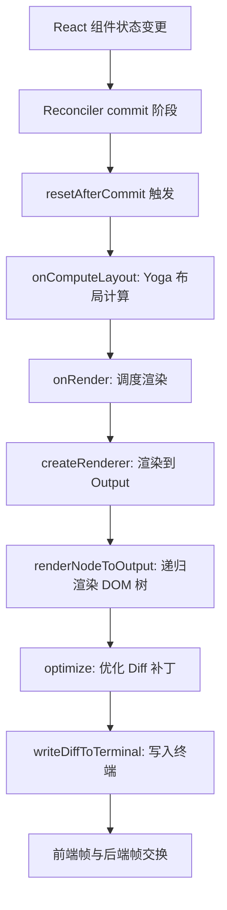
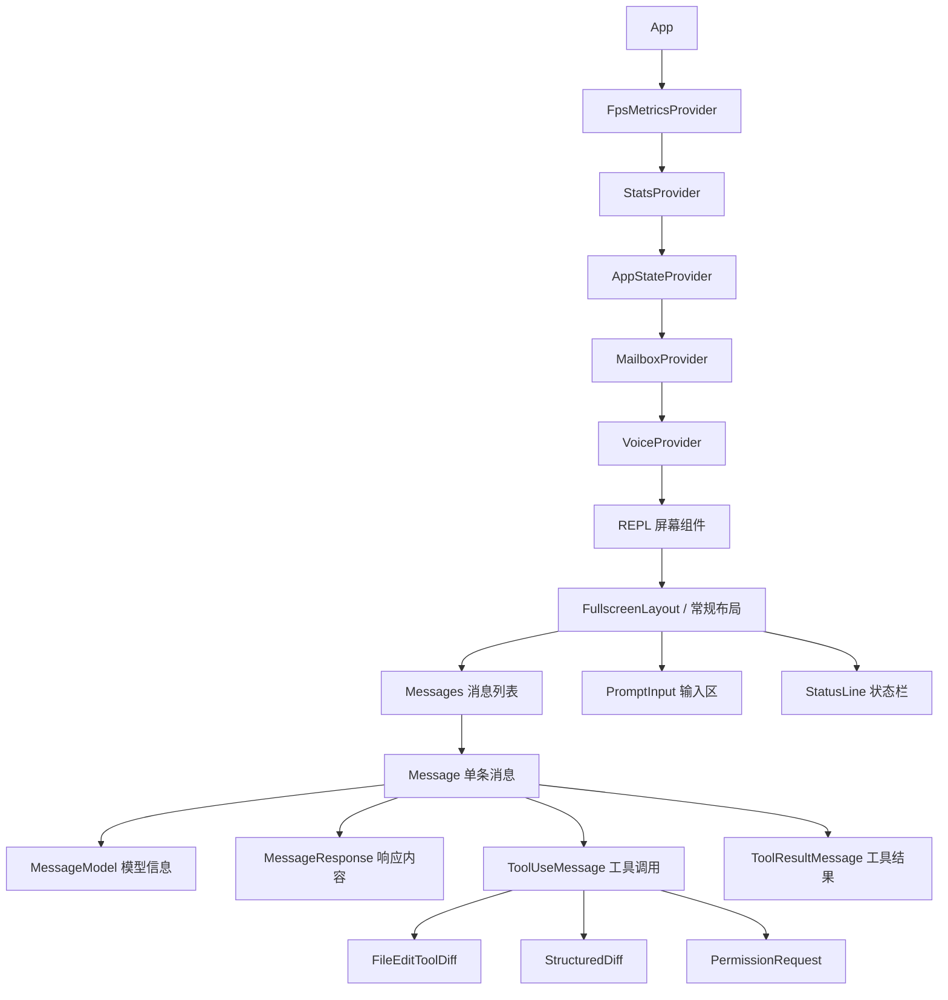

# Ink终端UI框架定制

## 概述

Claude Code 的终端用户界面建立在 Ink 框架之上——这是一个由 Vadim Demedes 创建的 React 风格终端 UI 框架。Claude Code 对 Ink 进行了大量定制和深度改造，使其从开源 Ink 的基础版本演化为一个专为长时间交互式 AI 对话场景设计的终端渲染引擎。整个 UI 系统包含约 70+ 个组件文件、自定义 Yoga 布局引擎、双缓冲屏幕渲染、选择/搜索高亮、以及基于 React Reconciler 的高效更新机制。

## Ink 框架架构

### 核心类与渲染管线

Ink 框架的核心是 `src/ink/ink.tsx` 中的 `Ink` 类，它管理整个终端渲染生命周期：

1. **React Reconciler 集成**：使用 `react-reconciler` 创建自定义渲染器，将 React 组件树映射到终端 DOM 节点
2. **双缓冲帧系统**：维护 `frontFrame`（当前屏幕状态）和 `backFrame`（下一帧），通过差异比对实现最小化终端写入
3. **Yoga 布局引擎**：使用 Flexbox 布局计算组件在终端中的精确位置
4. **屏幕缓冲区**：使用 `StylePool`、`CharPool`、`HyperlinkPool` 管理终端单元格，支持增量更新

### 渲染流程



### 自定义 DOM 模型

Ink 的 DOM 模型（`src/ink/dom.ts`）定义了终端特有的节点类型：

- `ink-root`：根容器节点
- `ink-box`：Flexbox 容器（对应 `<Box>` 组件）
- `ink-text`：文本容器（对应 `<Text>` 组件）
- `ink-virtual-text`：嵌套在 `<Text>` 内的文本（避免非法嵌套）
- `ink-link`：超链接节点
- `ink-progress`：进度条节点
- `ink-raw-ansi`：原始 ANSI 序列节点

每个 DOM 节点包含：
- `yogaNode`：关联的 Yoga 布局节点，用于 Flexbox 位置计算
- `style`：样式属性（颜色、粗体、斜体等）
- `childNodes`：子节点列表
- 滚动状态（`scrollTop`、`scrollHeight`、`stickyScroll`）
- 事件处理器（`_eventHandlers`）

### Reconciler 定制

`src/ink/reconciler.ts` 实现了自定义的 React Reconciler，关键定制包括：

- **commitUpdate 优化**：通过 `diff` 函数比较新旧 props，只更新变化的属性，避免全量重建
- **Yoga 节点生命周期管理**：在 `removeChild` 时正确释放 WASM 内存（`cleanupYogaNode`），防止内存泄漏
- **提交性能追踪**：内置 `COMMIT_LOG` 调试机制，记录提交间隔、Yoga 布局耗时、慢渲染警告
- **Yoga 计数器**：通过 `getYogaCounters()` 获取布局缓存命中/未命中统计
- **React 19 兼容**：支持 `NotPendingTransition`、`HostTransitionContext` 等 React 19 新增 API

## 组件体系

### 顶层架构



### 关键组件详解

#### App 组件（`src/components/App.tsx`）

App 是顶层包装组件，提供三个核心 Context：

1. **AppStateProvider**：全局不可变状态存储，通过 `useAppState` 选择器实现高效订阅
2. **StatsProvider**：统计信息上下文
3. **FpsMetricsProvider**：帧率指标上下文

App 组件经 React Compiler 编译后，输出包含 `_c`（编译器运行时）和缓存槽位（`$[0]`、`$[1]`...）的优化代码。缓存槽位在 props 未变化时直接复用上一次的计算结果，避免不必要的 React 元素重建。

#### Messages 组件

Messages 是消息列表的核心容器，使用虚拟滚动（`VirtualMessageList`）处理长对话。关键特性：
- 基于 `useAppState` 选择器只订阅消息列表变化
- 使用 `OffscreenFreeze` 冻结屏幕外消息的更新
- 支持 `follow` 模式（自动滚动到底部）和手动滚动

#### PromptInput 组件（`src/components/PromptInput/`）

PromptInput 是用户输入区域，支持：
- Vim 模式编辑（通过 `VimTextInput`）
- 多行输入与自动补全（`useTypeahead`）
- 图片粘贴（`ctrl+v` / `alt+v`）
- 历史搜索（`ctrl+r`）
- @提及 IDE 文件（`useIdeAtMentioned`）
- 快捷键绑定集成（`useKeybinding`）

#### StatusLine 组件（`src/components/StatusLine.tsx`）

StatusLine 显示在终端底部，包含模型名称、权限模式、上下文使用率、费用等信息。它通过 `statusLineShouldDisplay` 控制是否显示，支持自定义命令输出。

### Ink 内部组件（`src/ink/components/`）

Ink 框架本身提供的基础组件：

| 组件 | 用途 |
|------|------|
| `Box` | Flexbox 容器，支持 flexDirection、margin、padding 等 |
| `Text` | 文本渲染，支持颜色、粗体、斜体等样式 |
| `Newline` | 换行符 |
| `Spacer` | 弹性空间 |
| `Button` | 可点击按钮（终端中通过回车触发） |
| `Link` | 终端超链接（OSC 8 协议） |
| `ScrollBox` | 可滚动容器，支持虚拟滚动 |
| `AlternateScreen` | 切换到终端备用屏幕 |
| `RawAnsi` | 渲染原始 ANSI 转义序列 |

## useAppState 选择器模式

### 不可变状态架构

AppState 采用不可变存储模式，核心设计原则：

1. **单一状态源**：所有 UI 状态存储在 `AppStateStore` 中
2. **选择器订阅**：组件通过 `useAppState(selector)` 只订阅需要的状态切片
3. **变更回调**：`onChangeAppState` 在状态变更时触发，用于副作用处理

```typescript
// 选择器示例：只订阅消息列表
const messages = useAppState(state => state.messages)

// 选择器示例：只订阅当前模型
const model = useAppState(state => state.mainLoopModel)
```

### React Compiler 运行时

经 React Compiler 编译的组件使用 `_c` 运行时和缓存槽位实现自动记忆化：

```typescript
// 编译后的 App 组件结构
export function App(t0) {
  const $ = _c(9);  // 9 个缓存槽位
  const { children, initialState } = t0;
  let t1;
  if ($[0] !== children || $[1] !== initialState) {
    t1 = <AppStateProvider initialState={initialState}>
      {children}
    </AppStateProvider>;
    $[0] = children;
    $[1] = initialState;
    $[2] = t1;
  } else {
    t1 = $[2];  // 缓存命中，复用
  }
  // ...
}
```

缓存槽位的编号由编译器自动分配，当依赖项（props、state）未变化时跳过重新计算。这对高频更新的终端 UI 至关重要——流式响应期间每秒可能触发数十次渲染，缓存命中的组件完全跳过重建。

## 流式更新处理

### 消息流式渲染

在 LLM 响应的流式传输过程中，Ink 组件树需要处理持续的增量更新：

1. **消息追加**：新 token 通过 AppState 更新触发 Messages 重渲染
2. **虚拟列表优化**：`VirtualMessageList` 只渲染可见区域的消息，避免全量重绘
3. **Yoga 增量布局**：只有 dirty 标记的节点重新计算布局
4. **Diff 补丁优化**：`optimizer.ts` 合并连续的 cursorMove、取消 hide/show 对、跳过空补丁

### 工具调用渲染

工具调用消息的渲染流程：
1. `ToolUseMessage` 显示工具名称和参数摘要
2. `ToolUseLoader` 显示执行中的旋转动画
3. `ToolResultMessage` 显示执行结果
4. 特定工具的自定义渲染器（如 `FileEditToolDiff`、`StructuredDiff`）

## 按键绑定系统

### 架构设计

Claude Code 的按键绑定系统支持完全自定义，配置存储在 `~/.claude/keybindings.json`。

核心文件：
- `src/keybindings/schema.ts`：按键绑定 JSON Schema 定义
- `src/keybindings/defaultBindings.ts`：默认按键绑定
- `src/keybindings/loadUserBindings.ts`：加载用户自定义绑定
- `src/keybindings/validate.ts`：绑定验证

### 上下文系统

按键绑定在特定上下文中生效，已定义的上下文包括：

| 上下文 | 描述 |
|--------|------|
| `Global` | 全局生效，不受焦点影响 |
| `Chat` | 聊天输入框获得焦点时 |
| `Autocomplete` | 自动补全菜单可见时 |
| `Confirmation` | 确认/权限对话框显示时 |
| `Help` | 帮助叠加层打开时 |
| `Transcript` | 查看对话记录时 |
| `HistorySearch` | 搜索命令历史时 |
| `Task` | 任务/代理在前台运行时 |
| `ThemePicker` | 主题选择器打开时 |
| `Settings` | 设置菜单打开时 |
| `Select` | 列表选择组件获得焦点时 |

### 默认按键绑定

```typescript
// 全局绑定
'ctrl+c': 'app:interrupt'     // 中断当前操作
'ctrl+d': 'app:exit'          // 退出（双击生效）
'ctrl+l': 'app:redraw'        // 重绘终端
'ctrl+t': 'app:toggleTodos'   // 切换待办事项
'ctrl+o': 'app:toggleTranscript' // 切换对话记录

// 聊天上下文绑定
'escape': 'chat:cancel'       // 取消当前输入
'shift+tab': 'chat:cycleMode' // 循环权限模式
'enter': 'chat:submit'        // 提交消息
'up/down': 'history:previous/next' // 历史记录导航
```

### 平台适配

按键绑定系统针对不同平台做了适配：
- Windows 上 `ctrl+v` 与系统粘贴冲突，改用 `alt+v` 进行图片粘贴
- `shift+tab` 在 Windows Terminal 的 VT 模式下可能不可靠，自动降级为 `meta+m`
- Kitty 键盘协议终端支持 `cmd+` 修饰键

## 终端特性支持

### 备用屏幕模式

Ink 支持 `AlternateScreen` 组件，切换到终端备用屏幕缓冲区，提供全屏沉浸式体验。备用屏幕模式下：
- 光标始终固定在终端底部
- 退出时恢复原始屏幕内容
- 支持鼠标选择和搜索高亮

### 文本选择

选择系统（`src/ink/selection.ts`）支持：
- 鼠标拖选（基于终端单元格）
- 词选（双击）和行选（三击）
- 选择内容复制到剪贴板
- 通过 `selectionListeners` 通知 UI 更新

### 搜索高亮

搜索高亮系统支持两种模式：
1. **文本搜索**：用户输入查询字符串，匹配的终端单元格被高亮
2. **位置搜索**：VirtualMessageList 预扫描的消息位置，支持当前位置黄色高亮

## 性能优化

### 渲染节流

Ink 使用 `FRAME_INTERVAL_MS` 常量控制最大帧率，避免终端 I/O 过载。`scheduleRender` 使用 `throttle` 确保不会在短时间内发送过多更新。

### 缓冲池管理

`StylePool`、`CharPool`、`HyperlinkPool` 管理终端单元格的样式/字符/链接数据，支持：
- 增量更新：只修改变化的单元格
- 代际重置：当池需要完全重建时（如终端大小变化），替换整个池实例
- 池排水：定期清理不再使用的池条目

### Yoga 布局缓存

原生 Yoga 模块（`src/native-ts/yoga-layout/`）实现了布局缓存，通过 `getYogaCounters()` 可查看：
- `visited`：访问的节点数
- `measured`：实际测量的节点数
- `cacheHits`：缓存命中次数
- `live`：活跃节点数

### Diff 优化

`optimizer.ts` 对渲染 Diff 应用多规则优化：
1. 移除空 stdout 补丁
2. 合并连续 cursorMove 补丁
3. 移除 no-op cursorMove(0,0)
4. 合并相邻样式补丁
5. 去重连续相同 URI 的超链接
6. 取消 cursor hide/show 对
7. 移除 count=0 的 clear 补丁

## 与查询生命周期的关系

Ink 组件树与 Claude Code 的查询生命周期紧密耦合：

1. **查询开始**：用户输入触发 `query()` 函数，AppState 更新 `isProcessing` 状态
2. **流式响应**：LLM token 逐步到达，通过 AppState 更新触发 Messages 组件增量重渲染
3. **工具调用**：工具执行状态通过 AppState.tasks 传播，StatusLine 和 TaskListV2 显示进度
4. **权限请求**：`requiresUserInteraction()` 的工具触发 PermissionRequest 组件，暂停查询等待用户响应
5. **查询完成**：AppState 更新 `isProcessing = false`，StatusLine 恢复空闲状态

这种设计确保了终端 UI 在保持响应性的同时，能准确反映后台查询引擎的每一步进展。

## 关键文件索引

| 文件路径 | 职责 |
|----------|------|
| `src/ink/ink.tsx` | Ink 核心类，渲染管线管理 |
| `src/ink/reconciler.ts` | React Reconciler 自定义实现 |
| `src/ink/dom.ts` | 终端 DOM 模型 |
| `src/ink/renderer.ts` | 帧渲染器 |
| `src/ink/optimizer.ts` | Diff 补丁优化 |
| `src/ink/output.ts` | 终端输出抽象 |
| `src/ink/screen.ts` | 屏幕缓冲区管理 |
| `src/ink/selection.ts` | 文本选择系统 |
| `src/ink/components/App.tsx` | Ink 内部 App 组件 |
| `src/ink/components/Box.tsx` | Flexbox 容器组件 |
| `src/ink/components/Text.tsx` | 文本渲染组件 |
| `src/ink/components/ScrollBox.tsx` | 可滚动容器 |
| `src/ink/hooks/use-input.ts` | 键盘输入 Hook |
| `src/ink/hooks/use-app.ts` | 应用生命周期 Hook |
| `src/components/App.tsx` | Claude Code 顶层 App |
| `src/components/Messages.tsx` | 消息列表 |
| `src/components/PromptInput/` | 输入组件目录 |
| `src/components/StatusLine.tsx` | 状态栏 |
| `src/keybindings/` | 按键绑定系统 |
| `src/state/AppState.tsx` | 全局状态 Provider |
| `src/state/AppStateStore.ts` | 全局状态定义 |
