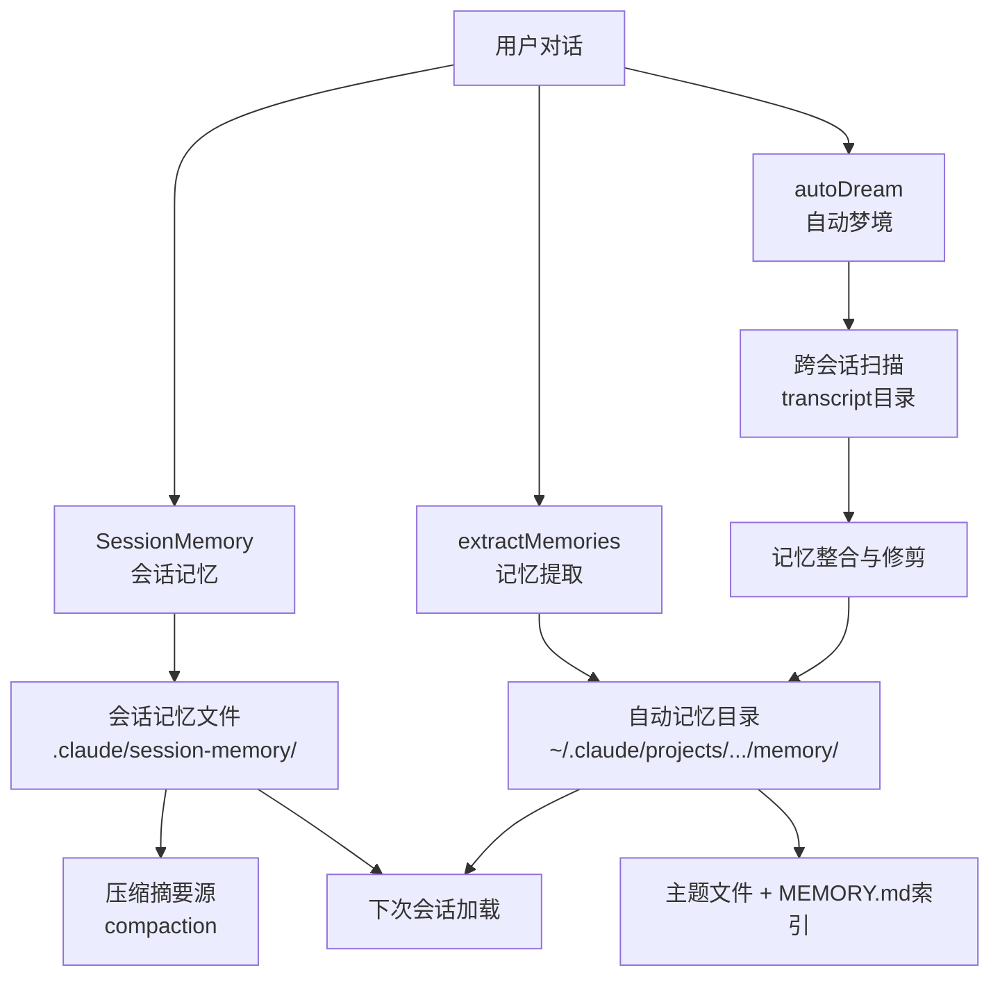
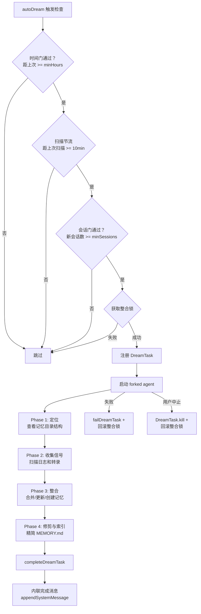

# 会话记忆与Dream代理

## 概述

Claude Code 的记忆系统由三个协同工作的子系统构成：SessionMemory（会话记忆）负责实时记录当前对话的关键信息，extractMemories（记忆提取）在后台从对话中提取持久化记忆，autoDream（自动梦境）则作为更深层的记忆整合代理，跨会话分析对话历史并优化记忆文件。这三者共同构成了一个分层记忆架构，确保 AI 助手在长对话和跨会话场景下保持上下文连续性。

## 系统架构



## SessionMemory：会话记忆服务

### 核心职责

SessionMemory（`src/services/SessionMemory/sessionMemory.ts`）自动维护一个 Markdown 格式的会话笔记文件，记录当前对话的关键信息。它在后台使用 forked subagent 定期提取和更新笔记，不影响主对话流程。

### 初始化与注册

```typescript
export function initSessionMemory(): void {
  if (getIsRemoteMode()) return
  const autoCompactEnabled = isAutoCompactEnabled()
  if (!autoCompactEnabled) return
  registerPostSamplingHook(extractSessionMemory)
}
```

初始化时注册 `postSamplingHook`，在每次采样后检查是否需要提取。SessionMemory 与自动压缩（autoCompact）绑定——只有启用了自动压缩的会话才使用会话记忆。

### 提取触发条件

`shouldExtractMemory()` 函数决定何时触发提取：

1. **初始化阈值**：会话的 token 总数达到 `minimumMessageTokensToInit` 时，首次创建会话记忆文件
2. **更新阈值**：需要同时满足：
   - token 增长阈值（`minimumTokensBetweenUpdate`）
   - 工具调用次数阈值（`toolCallsBetweenUpdates`），或者最后一轮助手消息没有工具调用（自然对话断点）
3. **安全条件**：最后一轮助手消息没有未完成的工具调用（避免产生孤立的 tool_result）

### 会话记忆文件结构

会话记忆文件存储在 `.claude/session-memory/` 目录下，使用预定义的 Markdown 模板，包含以下章节：

- **Session Title**：5-10词的描述性标题
- **Current State**：当前正在处理的内容、未完成任务、即时下一步
- **Task specification**：用户要求、设计决策
- **Files and Functions**：重要文件及其内容和相关性
- **Workflow**：常用命令及其顺序
- **Errors & Corrections**：遇到的错误和修复方法
- **Codebase and System Documentation**：重要系统组件及协作方式
- **Learnings**：有效/无效的方法总结
- **Key results**：用户要求的具体输出
- **Worklog**：逐步工作记录

模板和提示词支持自定义：用户可以在 `~/.claude/session-memory/config/template.md` 放置自定义模板，在 `~/.claude/session-memory/config/prompt.md` 放置自定义更新提示词，支持 `{{currentNotes}}` 和 `{{notesPath}}` 变量替换。

### Forked Agent 执行

SessionMemory 使用 `runForkedAgent` 模式执行更新：

1. 创建隔离的 subagent 上下文（`createSubagentContext`），避免污染父级缓存
2. 调用 `setupSessionMemoryFile` 设置目录和文件，读取当前内容
3. 构建 `buildSessionMemoryUpdatePrompt`，包含当前笔记和更新指令，附带章节大小警告
4. 工具权限限制：只允许 `FileEditTool` 操作特定的记忆文件路径（`createMemoryFileCanUseTool`）
5. 使用 `sequential()` 包装确保串行执行，避免并发写入冲突

### 与压缩的关系

SessionMemory 是自动压缩（compaction）的重要数据源。当会话上下文接近 token 限制时，压缩系统会读取会话记忆文件作为压缩后的上下文摘要基础。文件有大小限制：每节不超过 `MAX_SECTION_LENGTH`（约 2000 token），总文件不超过 `MAX_TOTAL_SESSION_MEMORY_TOKENS`（约 12000 token）。`truncateSessionMemoryForCompact()` 函数在插入压缩消息时截断超长节。

### 手动提取

`manuallyExtractSessionMemory()` 函数支持通过 `/summary` 命令手动触发提取，绕过阈值检查。它使用完整的缓存安全参数（独立的 systemPrompt、userContext、systemContext），而非复用上下文的 `createCacheSafeParams`。

## extractMemories：记忆提取服务

### 核心职责

extractMemories（`src/services/extractMemories/extractMemories.ts`）在每个查询循环结束时运行（通过 `handleStopHooks`），从对话中提取持久化记忆并写入自动记忆目录。与 SessionMemory 不同，extractMemories 关注的是跨会话的持久知识，而非当前对话的临时笔记。

### 特性门控

提取需要通过 `tengu_passport_quail` 特性门，且仅对主代理线程运行（`agentId` 为空时）。远程模式和自动记忆未启用时自动跳过。

### 闭包作用域状态

extractMemories 使用闭包作用域管理状态，而非模块级变量：

- `inFlightExtractions`：所有尚未解决的提取 Promise 集合，用于 `drainPendingExtraction` 等待
- `lastMemoryMessageUuid`：上次处理的消息 UUID 游标
- `inProgress`：防止重叠运行的互斥标志
- `turnsSinceLastExtraction`：自上次提取以来的轮次计数
- `pendingContext`：提取进行中暂存的新请求上下文

这种闭包模式确保测试可以在 `beforeEach` 中调用 `initExtractMemories()` 获得全新的闭包，避免测试间状态泄漏。

### 互斥与尾部提取

当提取正在进行时收到新的提取请求：
1. **暂存上下文**：将新请求的上下文存入 `pendingContext`（覆盖旧值——最新上下文包含最多消息）
2. **尾部提取**：当前提取完成后，在 `finally` 块中检查是否有暂存上下文，若有则运行一次 `isTrailingRun` 提取
3. **游标推进**：每次成功提取后推进 `lastMemoryMessageUuid` 游标；提取失败时游标不动，下次重新处理

### 主代理写入检测

如果主代理在当前轮次已经写了记忆文件，extractMemories 会跳过：

```typescript
if (hasMemoryWritesSince(messages, lastMemoryMessageUuid)) {
  lastMemoryMessageUuid = messages.at(-1)?.uuid
  return  // 跳过——对话已直接写入记忆文件
}
```

这确保主代理和 forked 代理对同一内容的处理互斥——当主代理的提示词中已包含完整的保存指令且它选择直接保存时，后台提取是冗余的。

### 工具权限控制

`createAutoMemCanUseTool`（由 extractMemories 和 autoDream 共享）创建严格权限控制：

- **允许**：Read/Grep/Glob（无限制只读）
- **允许**：只读 Bash 命令（`ls`、`find`、`grep`、`cat`、`stat`、`wc`、`head`、`tail` 等）
- **允许**：REPL 工具（其 VM 上下文会重新调用 canUseTool 验证内部操作）
- **允许**：Edit/Write 仅限自动记忆目录内的路径
- **拒绝**：所有其他工具（MCP、Agent、写操作 Bash 等）

REPL 工具的允许是一个精妙设计：forked 代理的工具列表必须与主代理完全一致（否则会破坏 prompt cache 共享），所以 REPL 被允许但其内部操作仍受 canUseTool 约束。

### 提取提示词策略

提取代理使用专门的提示词（`src/services/extractMemories/prompts.ts`），分为两种变体：

1. **Auto-Only 提示词**：仅个人记忆，四类型分类法
2. **Combined 提示词**：个人 + 团队记忆，每个类型附带作用域指导

两种提示词共享相同的开场白，指导代理：
- 只使用最近 N 条消息的内容更新记忆
- 高效使用 turn 预算（5轮上限）：第1轮并行读取，第2轮并行写入
- 语义组织（按主题而非时间排列）
- 更新或删除过时/错误的记忆
- 预注入记忆目录清单，避免浪费一轮 `ls`

## autoDream：自动梦境整合

### 核心职责

autoDream（`src/services/autoDream/autoDream.ts`）是更深层的记忆整合代理。它不是一个简单的提取器，而是一个跨会话的"梦境"——定期回顾多个会话的对话记录，整合零散信息，修剪过时记忆，保持记忆文件的组织性和准确性。

### 梦境整合流程



### 三重门控机制

autoDream 使用三重门控避免过度触发：

1. **时间门（Time Gate）**：距上次整合（`lastConsolidatedAt`）至少 `minHours`（默认 24 小时）。锁文件的 mtime 即为 `lastConsolidatedAt`，一次 `stat` 即可检查
2. **会话门（Session Gate）**：自上次整合以来至少有 `minSessions`（默认 5 个）会话被修改。扫描转录目录的 mtime 实现，排除当前会话
3. **整合锁（Lock）**：确保没有其他进程正在进行整合。锁文件 `.consolidate-lock` 存储持有者 PID，通过 `isProcessRunning` 检测死锁和 PID 复用

门控按成本从低到高排列：stat 一条记录 < 扫描会话目录 < 获取锁。

### 配置来源

门控参数来自 GrowthBook 特性标志 `tengu_onyx_plover`，支持远程动态调整。用户也可以通过 `settings.json` 中的 `autoDreamEnabled` 手动启用/禁用。

```typescript
function getConfig(): AutoDreamConfig {
  const raw = getFeatureValue_CACHED_MAY_BE_STALE('tengu_onyx_plover', null)
  return {
    minHours: typeof raw?.minHours === 'number' && raw.minHours > 0
      ? raw.minHours : DEFAULTS.minHours,    // 默认 24
    minSessions: typeof raw?.minSessions === 'number' && raw.minSessions > 0
      ? raw.minSessions : DEFAULTS.minSessions, // 默认 5
  }
}
```

### DreamTask 状态管理

DreamTask（`src/tasks/DreamTask/DreamTask.ts`）将原本不可见的 forked agent 可视化，在终端底部的任务药丸和 Shift+Down 对话框中显示。

DreamTask 状态包含：
- `phase`：`'starting'` -> `'updating'`（首次 Edit/Write 工具调用触发翻转）
- `sessionsReviewing`：正在审查的会话数
- `filesTouched`：通过 onMessage 观察到的 Edit/Write 路径（不完整——缺少 bash 间接写入）
- `turns`：助手文本响应（工具调用折叠为计数），最多保留 30 轮
- `abortController`：用于用户中止
- `priorMtime`：锁获取前的 mtime，用于中止/失败时回滚

### 梦境提示词的四阶段结构

梦境代理使用精心设计的四阶段提示词（`src/services/autoDream/consolidationPrompt.ts`）：

**Phase 1 — 定位（Orient）**：
- `ls` 记忆目录查看现有结构
- 读取 `MEMORY.md` 理解当前索引
- 浏览现有主题文件，避免创建重复

**Phase 2 — 收集信号（Gather）**：
- 优先查看日志文件（`logs/YYYY/MM/YYYY-MM-DD.md`）
- 检查已偏移的现有记忆（与代码库现状矛盾的事实）
- 必要时搜索 JSONL 转录（`grep -rn "<窄词>" <转录目录>/ --include="*.jsonl" | tail -50`）

**Phase 3 — 整合（Consolidate）**：
- 合并新信号到现有主题文件
- 将相对日期（"昨天"、"上周"）转换为绝对日期
- 删除被反驳的事实

**Phase 4 — 修剪与索引（Prune and Index）**：
- 更新 `MEMORY.md` 索引，保持在 200 行和 25KB 以内
- 每个索引条目一行，不超过 150 字符
- 删除过期/错误/被取代的指针
- 精简过长的索引行

### 进度监控

`makeDreamProgressWatcher` 函数创建 onMessage 回调，监控 forked agent 的消息流：
- 提取文本块（代理的推理/摘要）和工具调用计数
- 收集 Edit/Write 工具的 `file_path` 参数
- 调用 `addDreamTurn` 更新 DreamTask 状态，触发 UI 重渲染

### 整合锁机制

整合锁（`src/services/autoDream/consolidationLock.ts`）使用锁文件 `.consolidate-lock` 实现：

- **锁文件路径**：`<memoryDir>/.consolidate-lock`
- **锁文件内容**：持有者 PID
- **锁文件 mtime**：即 `lastConsolidatedAt` 时间戳
- **过期检测**：mtime 超过 1 小时视为过期，即使 PID 仍活跃（PID 复用防护）
- **竞态处理**：两个进程同时获取锁时，后写入者胜出，通过重读验证
- **回滚机制**：失败时调用 `rollbackConsolidationLock(priorMtime)` 回退 mtime，确保下次触发时时间门仍通过

### 错误处理与中止

- **fork 失败**：`failDreamTask` + 回滚整合锁，下次时间门通过时重试
- **用户中止**：通过 `DreamTask.kill` 触发 `abortController.abort()`，同时回滚锁
- **锁获取失败**：静默跳过，不覆盖其他进程的整合

## 记忆目录（memdir）结构

自动记忆目录（`~/.claude/projects/<path>/memory/`）的文件结构：

```
memory/
  MEMORY.md          # 索引文件（最多 200 行）
  user_preferences.md # 主题文件
  project_architecture.md
  testing_approach.md
  ...
  .consolidate-lock   # 整合锁文件
  logs/               # 日志子目录（KAIROS 模式）
    YYYY/MM/YYYY-MM-DD.md
```

每个主题文件使用 frontmatter 格式，包含 `type`、`scope`、`created` 等元数据。记忆类型包括用户偏好、项目架构、工作流、错误和修正等。

## Skill "dream"

`/dream` 命令是手动触发记忆整合的技能，特性门控为 KAIROS。它使用与 autoDream 相同的提示词模板，但在主循环中以正常权限运行（而非受限的 canUseTool）。手动 dream 运行后调用 `recordConsolidation()` 更新锁文件 mtime，作为最佳努力的标记。

## 三系统的协同关系

三个记忆子系统形成互补的层次结构：

| 维度 | SessionMemory | extractMemories | autoDream |
|------|--------------|----------------|-----------|
| 作用域 | 当前会话 | 当前会话 | 跨会话 |
| 存储位置 | session-memory/ | memory/ | memory/ |
| 触发频率 | 每轮采样 | 每轮查询结束 | 每天一次 |
| 内容类型 | 临时笔记 | 持久记忆 | 记忆整合 |
| 权限范围 | 仅编辑记忆文件 | 读取+记忆目录写入 | 读取+记忆目录写入 |
| 与压缩的关系 | 压缩摘要源 | 无直接关系 | 无直接关系 |
| 运行方式 | forked agent | forked agent | forked agent |

SessionMemory 为压缩提供摘要基础，extractMemories 从对话中提取持久知识，autoDream 定期整合和修剪这些知识。三者共同确保了 AI 助手在长对话和跨会话场景下保持上下文连续性。

## 关键文件索引

| 文件路径 | 职责 |
|----------|------|
| `src/services/SessionMemory/sessionMemory.ts` | 会话记忆主逻辑 |
| `src/services/SessionMemory/sessionMemoryUtils.ts` | 会话记忆工具函数和配置 |
| `src/services/SessionMemory/prompts.ts` | 会话记忆提示词和模板 |
| `src/services/extractMemories/extractMemories.ts` | 记忆提取主逻辑 |
| `src/services/extractMemories/prompts.ts` | 记忆提取提示词 |
| `src/services/autoDream/autoDream.ts` | 自动梦境主逻辑 |
| `src/services/autoDream/config.ts` | 梦境配置（启用/禁用） |
| `src/services/autoDream/consolidationPrompt.ts` | 梦境整合提示词（四阶段） |
| `src/services/autoDream/consolidationLock.ts` | 整合锁机制 |
| `src/tasks/DreamTask/DreamTask.ts` | DreamTask 状态管理 |
| `src/memdir/memdir.ts` | 记忆目录常量定义 |
| `src/memdir/paths.ts` | 记忆目录路径工具 |
| `src/memdir/memoryScan.ts` | 记忆文件扫描 |
| `src/memdir/memoryTypes.ts` | 记忆类型定义 |
