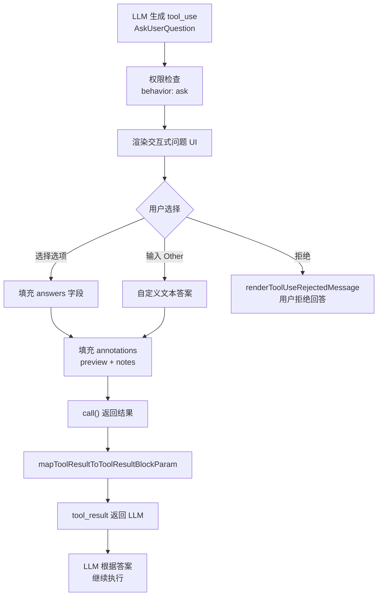

# 用户交互工具

## 概述

AskUserQuestionTool 是 Claude Code 中实现人机交互的核心工具。它允许 AI 代理在执行过程中向用户提出多选题，收集偏好、澄清歧义、做出决策。这个工具是 "human-in-the-loop" 工作模式的关键基础设施，使代理能够在关键决策点暂停执行流，等待用户输入后再继续，而不需要中断整个代理执行循环。

## 工具定义

### 基本信息

AskUserQuestionTool 定义在 `src/tools/AskUserQuestionTool/AskUserQuestionTool.tsx`，通过 `buildTool` 工厂函数创建：

- **名称**：`AskUserQuestion`
- **搜索提示**：`prompt the user with a multiple-choice question`
- **并发安全**：`isConcurrencySafe() = true`，多个提问可以并行
- **只读**：`isReadOnly() = true`，不修改文件系统
- **延迟执行**：`shouldDefer = true`，确保在权限检查前被正确处理
- **需要用户交互**：`requiresUserInteraction() = true`，触发交互式权限对话框

### 输入 Schema

输入采用严格对象模式（`z.strictObject`），包含以下字段：

```typescript
{
  questions: [1..4] Question,   // 1到4个问题
  answers?: Record<string, string>, // 用户答案（权限组件填充）
  annotations?: Record<string, {
    preview?: string,  // 选中选项的预览内容
    notes?: string     // 用户附加的备注
  }>,
  metadata?: {
    source?: string    // 来源标识（如 "remember" 用于 /remember 命令）
  }
}
```

每个 Question 的结构：

```typescript
{
  question: string,        // 完整的问题文本
  header: string,          // 短标签（最多12字符），显示为芯片/标签
  options: [2..4] {        // 2到4个选项
    label: string,         // 选项显示文本（1-5词）
    description: string,   // 选项解释
    preview?: string       // 可选预览内容
  },
  multiSelect?: boolean    // 是否允许多选（默认 false）
}
```

### 唯一性约束

Schema 使用 `refine` 验证器确保：
- 所有问题文本必须唯一
- 同一问题内的选项标签必须唯一

### 输出 Schema

```typescript
{
  questions: Question[],                    // 被问的问题
  answers: Record<string, string>,          // 问题文本 -> 答案字符串
  annotations?: Record<string, {           // 问题文本 -> 注解
    preview?: string,
    notes?: string
  }>
}
```

多选题的答案以逗号分隔。

## 权限与交互流程

### 权限检查

AskUserQuestionTool 的 `checkPermissions` 返回 `{ behavior: 'ask', message: 'Answer questions?' }`，这会触发权限请求对话框。权限系统识别 `requiresUserInteraction()` 标志，将工具调用转为交互式 UI 流程。

### 交互流程



### 渲染组件

AskUserQuestionTool 使用 React 组件渲染交互界面：

**工具使用中**：`renderToolUseMessage()` 和 `renderToolUseProgressMessage()` 都返回 `null`——问题 UI 由权限系统的交互式处理程序渲染，不在此处。

**工具结果**：`AskUserQuestionResultMessage` 组件渲染答案摘要：

```typescript
function AskUserQuestionResultMessage({ answers }) {
  return (
    <Box flexDirection="column" marginTop={1}>
      <Box flexDirection="row">
        <Text color={getModeColor("default")}>{BLACK_CIRCLE} </Text>
        <Text>User answered Claude's questions:</Text>
      </Box>
      <MessageResponse>
        <Box flexDirection="column">
          {Object.entries(answers).map(([questionText, answer]) => (
            <Text key={questionText} color="inactive">
              · {questionText} → {answer}
            </Text>
          ))}
        </Box>
      </MessageResponse>
    </Box>
  )
}
```

**用户拒绝**：显示 "User declined to answer questions" 消息。

### 返回给 LLM 的结果

`mapToolResultToToolResultBlockParam` 将用户答案格式化为 LLM 可理解的文本：

```
User has answered your questions: "Which library?"="React (Recommended)" selected preview:
<预览内容> user notes: 希望用 TypeScript, "Styling approach?"="Tailwind". You can now continue with the user's answers in mind.
```

每个答案包含：
- 问题文本和答案字符串
- 如果有预览，附加 `selected preview` 内容
- 如果有用户备注，附加 `user notes` 内容

## Preview 预览功能

### 两种格式

Preview 功能支持两种内容格式，取决于 `getQuestionPreviewFormat()` 的返回值：

1. **Markdown 格式**（终端模式）：
   - ASCII 模型的 UI 布局
   - 代码片段
   - 图表变体
   - 配置示例

2. **HTML 格式**（SDK/Web 模式）：
   - HTML 模型的 UI 布局
   - 格式化的代码片段
   - 视觉比较或图表
   - 必须是自包含的 HTML 片段（无 `<html>/<body>` 包装）

### HTML 预览验证

当预览格式为 HTML 时，`validateHtmlPreview` 函数执行轻量级检查：

- 不允许完整 HTML 文档（`<html>`、`<body>`、`<!DOCTYPE>`）
- 不允许 `<script>` 或 `<style>` 标签（防止代码执行和页面样式篡改）
- 必须包含 HTML 标签（纯文本不是有效的 HTML 预览）
- 内联事件处理器（`onclick` 等）仍可能存在，消费者应自行消毒

### 预览与布局

当任何选项有预览时，UI 切换到并排布局：
- 左侧：垂直选项列表
- 右侧：当前聚焦选项的预览内容

预览仅在单选题（`multiSelect: false`）时支持。

## 多选题支持

### 单选与多选

- **单选**（`multiSelect: false`，默认）：用户选择一个选项，答案为选项标签
- **多选**（`multiSelect: true`）：用户可选择多个选项，答案以逗号分隔

多选题的问题措辞应相应调整，例如 "Which features do you want to enable?" 而非 "Which feature should we use?"。

### Other 选项

用户始终可以选择 "Other" 提供自定义文本输入，这是自动提供的，不需要 LLM 在选项列表中包含。这也意味着选项列表不应包含 "Other" 选项——系统会自动添加。

## 计划模式集成

### 与 ExitPlanMode 的关系

AskUserQuestionTool 与 ExitPlanModeTool 在计划模式中有明确的职责划分：

- **AskUserQuestion**：在最终确定计划之前，用于澄清需求或选择方案
- **ExitPlanMode**：用于请求用户批准计划

关键规则：
1. 不要用 AskUserQuestion 问 "Is my plan ready?" 或 "Should I proceed?"——使用 ExitPlanMode
2. 不要在问题中引用 "the plan"（如 "Do you have feedback about the plan?"），因为用户在 ExitPlanMode 之前看不到计划内容
3. AskUserQuestion 应在 ExitPlanMode 之前使用，用于收集信息以完善计划

### 推荐选项

当 LLM 推荐特定选项时，应将该选项放在列表第一位并在标签末尾添加 "(Recommended)"。

## 与 MCP Elicitation 的区别

### 方向差异

| 维度 | AskUserQuestion | MCP Elicitation |
|------|----------------|-----------------|
| 发起方 | AI 代理（LLM tool_use） | MCP 服务器 |
| 控制权 | 代理决定何时提问 | 外部服务器请求输入 |
| 上下文 | 代理的执行上下文 | MCP 服务器的内部需求 |
| 用途 | 澄清用户意图 | 获取服务器操作所需参数 |

### 共同点

两者都通过 `requiresUserInteraction()` 标志触发交互式 UI，都支持多选项界面，都会暂停代理执行直到用户响应。

## 启用条件

AskUserQuestionTool 在以下条件下**禁用**：

- 当 `--channels` 模式激活时（用户可能在 Telegram/Discord 上，不在 TUI 前操作键盘）
- KAIROS 或 KAIROS_CHANNELS 特性开启且 `getAllowedChannels()` 返回非空列表时

渠道权限转发（channel permission relay）已经跳过 `requiresUserInteraction()` 工具，所以没有替代的审批路径。

## SDK 集成

### Schema 导出

内部 Schema 与 SDK Schema 已统一（`preview` 和 `annotations` 字段已公开），导出为：

```typescript
export const _sdkInputSchema = inputSchema
export const _sdkOutputSchema = outputSchema
```

### 工具配置

SDK 消费者可通过 `toolConfig.askUserQuestion` 配置预览格式。如果未选择预览格式（`getQuestionPreviewFormat()` 返回 `undefined`），工具提示词中省略预览指导，因为消费者可能根本不渲染该字段。

## 元数据与注解系统

### Metadata

`metadata` 字段用于分析和追踪，不显示给用户：

```typescript
metadata: {
  source?: string  // 标识问题来源（如 "remember" 对应 /remember 命令）
}
```

### Annotations

`annotations` 是每问题注解，由权限组件在用户交互时填充：

```typescript
annotations: {
  "Which library?": {
    preview: "React code sample...",  // 选中选项的预览
    notes: "希望支持 TypeScript"      // 用户附加备注
  }
}
```

注解随 `tool_result` 返回 LLM，让代理了解用户选择的具体上下文——不仅是选择了什么，还有用户为什么这样选择（通过备注）。

## 人机交互闭环

AskUserQuestionTool 的设计实现了无缝的人机交互闭环：

1. **代理自主执行**：LLM 按照自己的推理链条执行工具调用
2. **决策点暂停**：遇到需要用户判断的情境时，LLM 主动调用 AskUserQuestion
3. **交互式收集**：权限系统检测到 `requiresUserInteraction()`，渲染交互式 UI
4. **答案回注**：用户的选择通过 `answers` 和 `annotations` 填入工具输入
5. **继续执行**：`call()` 返回包含用户答案的结果，LLM 根据答案调整后续行为

这个闭环的关键在于：**代理执行流从未真正中断**。从 LLM 的视角看，AskUserQuestion 只是一个需要等待结果的工具调用——只是结果的来源是用户而非系统。这避免了传统"停止-重启"模式下的上下文丢失问题。

## 关键文件索引

| 文件路径 | 职责 |
|----------|------|
| `src/tools/AskUserQuestionTool/AskUserQuestionTool.tsx` | 工具定义、Schema、渲染组件 |
| `src/tools/AskUserQuestionTool/prompt.ts` | 工具提示词和常量 |
| `src/tools/ExitPlanModeTool/prompt.ts` | 计划模式退出工具提示 |
| `src/hooks/useCanUseTool.ts` | 工具权限 Hook 类型定义 |
| `src/Tool.ts` | Tool 基类和 buildTool 工厂 |
