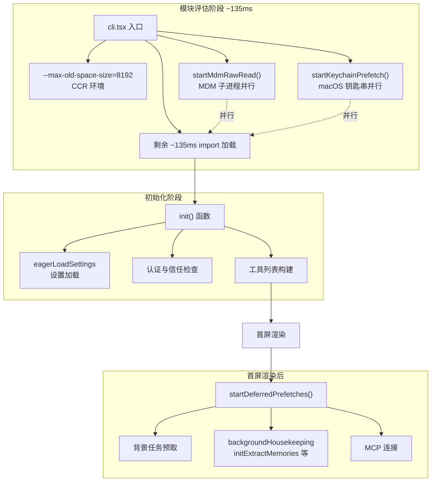

# 原生模块与性能优化

## 概述

Claude Code 在性能关键路径上采用了多层优化策略：原生模块替代（native modules）处理计算密集型操作，启动时序优化（eager prefetching）隐藏 I/O 延迟，React Compiler 自动记忆化减少重渲染开销，以及缓存感知的提示词构建最大化 API 缓存命中率。这些优化共同确保了一个基于 Node.js/Bun 的终端应用能在亚秒级完成首屏渲染，并在长时间会话中保持流畅响应。

## 原生模块体系

### 目录结构

`src/native-ts/` 目录包含三个性能关键模块的纯 TypeScript 实现：

| 模块 | 上游原生实现 | 用途 |
|------|------------|------|
| `yoga-layout/` | Meta Yoga (C++) | Flexbox 布局引擎 |
| `color-diff/` | Rust NAPI | 语法高亮与差异对比 |
| `file-index/` | nucleo (Rust NAPI) | 模糊文件搜索 |

这些模块原本使用原生代码（C++/Rust + NAPI）实现，现在已移植为纯 TypeScript，消除了原生依赖带来的 dlopen 开销、平台兼容性问题（特别是 Windows CI），同时保持了 API 兼容性。

### Yoga Layout（Flexbox 布局引擎）

`src/native-ts/yoga-layout/index.ts` 是 Meta Yoga 布局引擎的纯 TypeScript 移植，实现了 Ink 终端 UI 所需的 Flexbox 功能子集：

**已实现的核心特性**：
- `flex-direction`（row/column + reverse）
- `flex-grow` / `flex-shrink` / `flex-basis`
- `align-items` / `align-self`（stretch、flex-start、center、flex-end）
- `justify-content`（全部六种值）
- `margin` / `padding` / `border` / `gap`
- `width` / `height` / `min` / `max`（point、percent、auto）
- `position: relative` / `absolute`
- `display: flex` / `none`
- `measure` 函数（文本节点测量）

**规格一致性额外实现**（Ink 未使用但为规格完整性而实现）：
- `margin: auto`（主轴 + 交叉轴，覆盖 justify/align）
- 多轮 flex clamping（子元素命中 min/max 约束时）
- `flex-wrap: wrap` / `wrap-reverse`（多行 flex）
- `align-content`（定位换行后的行）
- `display: contents`（子元素提升到祖父级）
- `baseline` 对齐

**未实现**（Ink 不使用）：
- `aspect-ratio`
- `box-sizing: content-box`
- RTL 方向

**性能计数器**：通过 `getYogaCounters()` 暴露运行时统计：
- `visited`：布局遍历访问的节点数
- `measured`：实际执行测量的节点数
- `cacheHits`：缓存命中次数
- `live`：活跃布局节点数

### Color-Diff（语法高亮与差异对比）

`src/native-ts/color-diff/index.ts` 是 vendor/color-diff-src 的纯 TypeScript 移植。原版使用 syntect+bat 进行语法高亮和 similar crate 进行单词 diff，移植版使用 highlight.js 和 diff npm 包的 `diffArrays`。

**关键语义差异**：
- 语法高亮使用 highlight.js 而非 syntect，作用域颜色从 syntect 输出测量而来，大部分 token 匹配，但 hljs 的语法有缺口：纯标识符和 `=` `:` 等操作符不被作用域化，以默认前景色渲染
- `BAT_THEME` 环境变量支持是存根：highlight.js 没有 bat 主题设置
- 输出结构（行号、标记、背景、单词 diff）与原生版本相同

**懒加载优化**：highlight.js 延迟到首次渲染时加载。完整包注册 190+ 语言语法，require 时约 50MB，macOS 上耗时 100-200ms（Windows 上数倍）。使用顶层导入会导致任何引用此模块的调用者——包括测试预加载——在模块评估时付出代价。

```typescript
let cachedHljs: HLJSApi | null = null
function hljs(): HLJSApi {
  if (cachedHljs) return cachedHljs
  const mod = require('highlight.js')
  cachedHljs = 'default' in mod && mod.default ? mod.default : mod
  return cachedHljs!
}
```

### File-Index（模糊文件搜索）

`src/native-ts/file-index/index.ts` 是 vendor/file-index-src 的纯 TypeScript 移植，原版使用 nucleo（Helix 编辑器的模糊搜索引擎）。

**API 接口**：
```typescript
class FileIndex {
  loadFromFileList(fileList: string[]): void  // 去重 + 索引
  search(query: string, limit: number): SearchResult[]  // 模糊搜索
}
```

**评分语义**：分数越低越好。分数 = 位置/结果数，最佳匹配为 0.0。包含 "test" 的路径获得 1.05 倍惩罚（上限 1.0），使非测试文件排名略高。

**nucleo 风格评分常量**：
- `SCORE_MATCH = 16`：匹配基础分
- `BONUS_BOUNDARY = 8`：边界奖励（路径分隔符、点号等）
- `BONUS_CAMEL = 6`：驼峰命名奖励
- `BONUS_CONSECUTIVE = 4`：连续匹配奖励
- `BONUS_FIRST_CHAR = 8`：首字符匹配奖励
- `PENALTY_GAP_START = 3`：间隔起始惩罚
- `PENALTY_GAP_EXTENSION = 1`：间隔扩展惩罚

**时间切片**：搜索超过 `CHUNK_MS`（4ms）后让出事件循环，确保慢速机器上保持响应。

**异步构建**：支持边构建边搜索，`readyCount` 追踪已准备好的路径前缀。

## 启动性能优化

### 性能优化全景



### 入口点优化

`src/entrypoints/cli.tsx` 和 `src/main.tsx` 实现了关键的第一毫秒优化：

#### CCR 环境内存配置

```typescript
if (process.env.CLAUDE_CODE_ENTRYPOINT === 'ccr') {
  const existing = process.env.NODE_OPTIONS || ''
  process.env.NODE_OPTIONS = existing
    ? `${existing} --max-old-space-size=8192`
    : '--max-old-space-size=8192'
}
```

CCR（Claude Code Runner）环境中设置 8GB 堆内存上限，确保大规模项目索引和长时间会话不会因内存不足崩溃。

#### 模块评估时并行 I/O

`main.tsx` 的前三行 import 在模块评估阶段启动并行 I/O：

```typescript
// 这些副作用必须在所有其他 import 之前运行：
// 1. profileCheckpoint 标记入口点
// 2. startMdmRawRead 启动 MDM 子进程（plutil/reg query），
//    与剩余 ~135ms 的 import 并行
// 3. startKeychainPrefetch 启动 macOS 钥匙串读取（OAuth + legacy API key），
//    否则 isRemoteManagedSettingsEligible() 会在
//    applySafeConfigEnvironmentVariables() 中同步 spawn 读取它们（~65ms）
import { profileCheckpoint } from './utils/startupProfiler.js'
profileCheckpoint('main_tsx_entry')
import { startMdmRawRead } from './utils/settings/mdm/rawRead.js'
startMdmRawRead()
import { startKeychainPrefetch } from './utils/secureStorage/keychainPrefetch.js'
startKeychainPrefetch()
```

这些操作在 JavaScript 的模块评估阶段（import 声明处理时）即触发，与后续约 135ms 的模块加载并行运行。

### 延迟预取策略

`startDeferredPrefetches()` 函数在首屏渲染后启动，避免与渲染竞争 CPU 和事件循环时间：

```typescript
export function startDeferredPrefetches(): void {
  // 性能测量模式下跳过
  if (process.env.CLAUDE_CODE_EXIT_AFTER_FIRST_RENDER) return

  // 系统上下文预取（getUserContext、getSystemContext 的 memoize 缓存命中）
  void prefetchSystemContextIfSafe()

  // 凭证预取
  void prefetchAwsCredentialsAndBedRockInfoIfSafe()
  void prefetchGcpCredentialsIfSafe()

  // Fast mode 状态预取
  void prefetchFastModeStatus()

  // MCP 官方注册表 URL 预取
  void prefetchOfficialMcpUrls()

  // 推荐资格预取
  void prefetchPassesEligibility()
}
```

延迟预取的设计原则：
- **不阻塞首屏**：所有预取在首屏渲染后才启动
- **缓存预热**：预取结果是 memoize 缓存，后续同步调用直接命中
- **渐进可用**：即使预取未完成，应用也能正常运行（只是某些功能暂时不可用）

### setup() 中的并行化

在 `init()` 函数的 setup 阶段，多个操作并行启动：

```typescript
// 并行启动 git 状态查询，与后续 getCommands await 重叠
void getSystemContext()
// 并行启动 CLAUDE.md 目录遍历
void getUserContext()
// 并行启动 Bedrock 模型字符串初始化（100-200ms profile fetch）
void ensureModelStringsInitialized()
```

这些 `void` 调用触发异步操作但不等待结果。后续代码通过 `await` 加入这些 Promise 时，由于操作已在进行中，等待时间远短于串行执行。

## 启动性能分析器

### startupProfiler 设计

`src/utils/startupProfiler.ts` 提供两种性能分析模式：

1. **采样日志模式**：100% 的 Ant 用户、0.5% 的外部用户——将各阶段耗时记录到 Statsig
2. **详细分析模式**：`CLAUDE_CODE_PROFILE_STARTUP=1`——包含内存快照的完整报告

### 检查点机制

`profileCheckpoint(name)` 函数记录命名检查点：

```typescript
const PHASE_DEFINITIONS = {
  import_time: ['cli_entry', 'main_tsx_imports_loaded'],
  init_time: ['init_function_start', 'init_function_end'],
  settings_time: ['eagerLoadSettings_start', 'eagerLoadSettings_end'],
  total_time: ['cli_entry', 'main_after_run'],
}
```

每个检查点记录精确时间戳和（在详细模式下）内存使用快照。采样用户只记录阶段耗时，详细用户记录完整的检查点时间线。

### 135ms Import 加载

Claude Code 的模块加载阶段约耗时 135ms。这段期间启动的子进程（MDM、钥匙串）与模块评估并行运行，实际等待时间被重叠隐藏：

```
时间线:
0ms    cli.tsx 入口, startMdmRawRead(), startKeychainPrefetch()
       ├─ MDM 子进程 ──────────────────────┐
       ├─ 钥匙串读取 ───────────────┐       │
135ms  main.tsx imports 加载完成     │       │
       init() 开始                   │       │
~200ms 首屏渲染                     │       │
       startDeferredPrefetches()    ▼       ▼
                                     (MDM/钥匙串已完成)
```

## 缓存感知的提示词构建

### Prompt Cache 优化

Claude API 的 prompt caching 机制允许前缀相同的请求复用缓存，减少输入 token 计费和延迟。Claude Code 的提示词构建深度利用了这一机制：

1. **系统提示词前置**：系统提示词作为最长的前缀，优先保证缓存命中
2. **工具定义不变性**：工具列表在会话期间保持不变，确保 cache key 稳定
3. **Forked Agent 缓存共享**：extractMemories 和 autoDream 使用 `createCacheSafeParams` 与主代理共享缓存前缀
4. **消息前缀稳定**：`forkContextMessages` 作为消息前缀，保持与主对话的缓存连续性

### CacheSafeParams

```typescript
type CacheSafeParams = {
  systemPrompt: SystemPrompt
  userContext: UserContext
  systemContext: SystemContext
  toolUseContext: ToolUseContext
  forkContextMessages: Message[]
}
```

`createCacheSafeParams` 从当前上下文提取这些参数，确保 forked agent 的请求与主代理共享尽可能多的缓存前缀。工具列表必须一致——否则会破坏 prompt cache 共享（工具定义是缓存键的一部分）。

## React Compiler 与渲染优化

### 自动记忆化

React Compiler（通过 `_c` 运行时和缓存槽位）自动为组件生成记忆化代码。编译后的组件在 props 和 state 未变化时跳过重建：

```typescript
export function App(t0) {
  const $ = _c(9)  // 9 个缓存槽位
  const { children, initialState } = t0
  let t1
  if ($[0] !== children || $[1] !== initialState) {
    // props 变化，重新计算
    t1 = <AppStateProvider initialState={initialState}>
      {children}
    </AppStateProvider>
    $[0] = children
    $[1] = initialState
    $[2] = t1
  } else {
    t1 = $[2]  // 缓存命中
  }
  // ...
}
```

### 选择器模式减少重渲染

`useAppState(selector)` 模式确保组件只订阅需要的状态切片。当 AppState 的其他部分变化时，未受影响的组件不会重渲染：

```typescript
// 只订阅消息列表——其他状态变化不触发重渲染
const messages = useAppState(state => state.messages)

// 只订阅当前模型——消息更新不触发重渲染
const model = useAppState(state => state.mainLoopModel)
```

### Diff 补丁优化

`src/ink/optimizer.ts` 对渲染 Diff 应用多规则优化，减少终端写入量：

1. 移除空 stdout 补丁
2. 合并连续 cursorMove 补丁
3. 移除 no-op cursorMove(0,0)
4. 合并相邻样式补丁
5. 去重连续相同 URI 的超链接
6. 取消 cursor hide/show 对
7. 移除 count=0 的 clear 补丁

### Yoga 布局缓存

原生 Yoga 模块的布局缓存通过 dirty 标记实现增量计算：
- 只有 props 变化的节点标记为 dirty
- Yoga 遍历时跳过非 dirty 子树
- 文本测量结果缓存（charCache 持久化）

## 性能指标追踪

### FPS 追踪

`FpsMetricsProvider` 提供帧率指标，用于检测渲染卡顿。

### 提交统计

Reconciler 内置提交统计（`COMMIT_LOG` 模式）：
- 提交频率（commits/s）
- 最大提交间隔（maxGap）
- Yoga 布局耗时（`_lastYogaMs`）
- 提交总耗时（`_lastCommitMs`）
- 慢布局警告（>20ms）
- 慢渲染警告（>10ms）

### API 性能追踪

`logForDebugging` 记录 forked agent 的缓存性能：
```
[extractMemories] finished — 3 files written, cache: read=12345 create=0 input=0 (100.0% hit)
[autoDream] completed — cache: read=50000 created=2000
```

## 关键文件索引

| 文件路径 | 职责 |
|----------|------|
| `src/native-ts/yoga-layout/index.ts` | Flexbox 布局引擎 TS 移植 |
| `src/native-ts/color-diff/index.ts` | 语法高亮与差异对比 TS 移植 |
| `src/native-ts/file-index/index.ts` | 模糊文件搜索 TS 移植 |
| `src/utils/startupProfiler.ts` | 启动性能分析器 |
| `src/utils/profilerBase.ts` | 性能分析基础工具 |
| `src/main.tsx` | 入口点与延迟预取 |
| `src/entrypoints/cli.tsx` | CLI 入口点 |
| `src/ink/optimizer.ts` | 渲染 Diff 优化 |
| `src/ink/reconciler.ts` | Reconciler 提交统计 |
| `src/utils/settings/mdm/rawRead.ts` | MDM 原始读取（并行启动） |
| `src/utils/secureStorage/keychainPrefetch.ts` | 钥匙串预取（并行启动） |
| `src/utils/forkedAgent.ts` | Forked Agent 与缓存安全参数 |
