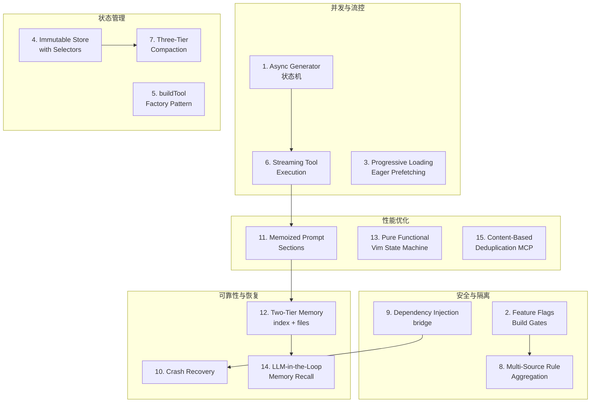

# 设计模式与架构权衡总结

## 概述

Claude Code 的代码库涵盖了约 15 种核心设计模式，每种模式都是为了解决特定的工程挑战而引入的。这些模式在带来显著收益的同时，也伴随着不可避免的架构权衡。本文系统性地梳理每一种模式的核心思想、使用动机、权衡取舍以及在代码库中的具体体现。

## 模式关系图

## 1. Async Generator as State Machine（异步生成器状态机）

### 是什么

使用 `async function*`（异步生成器函数）实现显式的状态机控制流。query.ts 中的主查询循环就是一个异步生成器，每个 `yield` 点代表一个状态转换——等待 LLM 响应、执行工具调用、处理权限请求等。

### 为什么使用

LLM 交互是天然的多步骤流程：发送请求 -> 接收流式响应 -> 解析工具调用 -> 请求权限 -> 执行工具 -> 发送工具结果 -> 再次请求 LLM。异步生成器将这个复杂流程编码为线性的、可读的控制流，每个步骤的入口和出口都清晰可见。调用者可以通过 `generator.next()` 推进状态机，也可以通过 `generator.return()` 提前终止。

### 权衡

- **优势**：控制流显式、可暂停/恢复、支持早期退出、状态转换一目了然
- **代价**：代码复杂度高，调试困难（生成器栈追踪不直观），与常规 async/await 模式不兼容，新开发者理解成本高

### 出现位置

`src/query/query.ts` — 主查询循环

## 2. Feature Flags as Build Gates（特性标志作为构建门控）

### 是什么

使用 `bun:bundle` 的 `feature()` 函数实现编译时特性门控。当特性未启用时，相关代码在构建时被完全移除（dead code elimination），而非运行时判断。

### 为什么使用

Claude Code 有多个构建变体：Ant 内部版、外部开源版、KAIROS 助手模式等。不同变体需要不同的功能集。编译时门控确保：
- 未使用的代码不增加包体积
- 未使用的代码不引入依赖
- 构建产物不包含内部功能的任何痕迹

### 权衡

- **优势**：零运行时开销、完美的代码隔离、包体积优化
- **代价**：双代码库维护成本（每个 `feature()` 调用点需要考虑启用/禁用两种情况）、测试矩阵膨胀（需要覆盖所有特性组合）、代码阅读困难（条件导入和 `require()` 散布各处）

### 出现位置

遍布整个代码库，关键特性包括：
- `feature('KAIROS')` — 助手模式
- `feature('TEAMMEM')` — 团队记忆
- `feature('VOICE_MODE')` — 语音模式
- `feature('QUICK_SEARCH')` — 快速搜索
- `feature('COORDINATOR_MODE')` — 协调器模式

## 3. Progressive Loading / Eager Prefetching（渐进式加载/急切预取）

### 是什么

在模块评估阶段（而非运行时）启动 I/O 密集操作，使其与后续的模块加载并行执行。关键操作在第一次需要之前就已启动，通过 memoize 缓存确保后续同步调用直接命中。

### 为什么使用

终端应用的首屏渲染时间直接影响用户感知。Claude Code 的启动路径中，MDM 配置读取和 macOS 钥匙串访问各自耗时 50-100ms，串行执行会显著延迟首屏。通过在 import 声明求值时即触发这些操作，与约 135ms 的模块加载时间重叠，实现了接近零额外延迟。

### 权衡

- **优势**：首屏渲染时间最小化、用户感知的启动速度快
- **代价**：初始化顺序复杂（必须确保预取的操作不依赖尚未加载的模块）、调试困难（副作用发生在 import 阶段）、潜在的资源浪费（如果应用早期退出，预取的操作白费了）

### 出现位置

- `src/main.tsx` — `startMdmRawRead()`、`startKeychainPrefetch()`、`startDeferredPrefetches()`
- `src/utils/settings/mdm/rawRead.ts` — MDM 配置预取
- `src/utils/secureStorage/keychainPrefetch.ts` — 钥匙串预取

## 4. Immutable Store with Selectors（不可变存储与选择器）

### 是什么

全局状态存储为不可变对象，组件通过选择器函数（selector）订阅状态的特定切片。只有选择器返回值变化时才触发组件重渲染。

### 为什么使用

终端 UI 在流式响应期间每秒可能更新数十次。如果所有组件都订阅整个状态树，每次 token 到达都会触发全量重渲染，导致严重的性能问题。选择器模式确保每个组件只关心自己需要的状态——消息列表组件不关心模型名称变化，状态栏不关心消息内容变化。

### 权衡

- **优势**：渲染效率高、状态变更可追踪、与 React Compiler 缓存配合良好
- **代价**：状态结构趋于单一化（monolithic state），所有状态挤在一个大对象中；选择器粒度选择困难（太粗导致不必要重渲染，太细导致选择器数量爆炸）；状态间依赖关系隐式化

### 出现位置

- `src/state/AppStateStore.ts` — 状态定义
- `src/state/AppState.tsx` — Provider 和 hooks
- `src/state/store.ts` — createStore 实现
- `src/hooks/useAppState.ts` — 选择器 hook

## 5. buildTool Factory Pattern（buildTool 工厂模式）

### 是什么

使用 `buildTool()` 工厂函数创建工具实例，提供统一的接口定义和默认实现。每个工具通过满足 `ToolDef<Input, Output>` 类型约束来定义。

### 为什么使用

Claude Code 有 20+ 个内置工具，每个工具需要实现 name、description、inputSchema、outputSchema、checkPermissions、call、renderToolUseMessage 等方法。工厂模式确保：
- 所有工具遵循统一接口
- 常见方法有合理默认值
- 类型安全（输入/输出类型与 schema 自动关联）

### 权衡

- **优势**：一致的接口、合理的默认值、类型安全
- **代价**：接口庞大（ToolDef 需要实现 15+ 方法）、新工具开发者需要理解全部方法语义、某些方法对特定工具无意义但仍需提供（如 renderToolUseErrorMessage 返回 null）

### 出现位置

- `src/Tool.ts` — `buildTool` 函数和 `ToolDef` 类型
- `src/tools/` — 所有工具实现

## 6. Streaming Tool Execution（流式工具执行）

### 是什么

工具执行结果通过流式方式逐步返回给 LLM，而非等待工具完全执行完毕。LLM 可以在工具产出部分结果时就开始处理，减少端到端延迟。

### 为什么使用

某些工具执行耗时较长（如 Bash 命令、文件搜索），如果等待完全结束再返回，会阻塞 LLM 的推理管道。流式执行允许 LLM 在工具产出的同时准备下一步，实现了工具执行和 LLM 推理的流水线化。

### 权衡

- **优势**：延迟优化、用户体验更流畅（实时看到工具输出）
- **代价**：错误处理复杂（流中途失败需要特殊处理）、部分结果语义不明确、与权限系统交互复杂（流开始后无法撤回）

### 出现位置

- `src/query/query.ts` — 工具调用处理循环
- `src/tools/BashTool/` — Bash 命令流式输出
- `src/services/mcp/` — MCP 工具流式响应

## 7. Three-Tier Compaction（三级压缩）

### 是什么

上下文压缩采用三层递进策略：SessionMemory 提取（保留关键信息的临时笔记）-> 标准压缩（摘要对话历史）-> 激进压缩（仅保留最核心信息）。每层在前一层不足时激活。

### 为什么使用

长对话的上下文窗口有限，当 token 使用接近限制时，必须压缩历史以腾出空间。但压缩是有损的——信息会丢失。三级策略确保：
- 优先保留最有价值的信息（当前状态、错误修正）
- 逐步降级而非突然截断
- 每层压缩的信息损失比上一层少

### 权衡

- **优势**：优雅降级、信息损失最小化、用户可感知的渐进式体验
- **代价**：压缩级联复杂性（第三层依赖第一层的输出质量）、调试困难（压缩后的上下文与原始对话差异大）、状态管理复杂（需要追踪压缩历史和 lastSummarizedMessageId）

### 出现位置

- `src/services/compact/` — 压缩服务
- `src/services/SessionMemory/sessionMemory.ts` — 会话记忆（压缩数据源）
- `src/services/compact/autoCompact.ts` — 自动压缩触发

## 8. Multi-Source Rule Aggregation（多源规则聚合）

### 是什么

权限规则从多个来源聚合：全局设置、项目设置、用户设置、远程管理设置、MCP 服务器规则等。聚合遵循优先级规则，高优先级来源覆盖低优先级。

### 为什么使用

Claude Code 运行在多种环境中（个人开发、团队协作、企业管控），每种环境有不同的安全需求。多源规则聚合允许：
- 管理员设置不可被用户覆盖的策略
- 项目级设置覆盖全局默认值
- MCP 服务器声明自己需要的权限

### 权衡

- **优势**：灵活性强、支持多租户、策略分层清晰
- **代价**：优先级复杂（哪个来源胜出不总是显而易见）、调试困难（需要追踪规则来源链）、冲突解决逻辑易出错

### 出现位置

- `src/utils/permissions/` — 权限分类和决策
- `src/services/remoteManagedSettings/` — 远程管理设置
- `src/services/policyLimits/` — 策略限制

## 9. Dependency Injection（依赖注入 — bridge 模式）

### 是什么

通过 bridge 对象将核心功能注入到子模块中，而非让子模块直接 import 依赖。bridge 对象在运行时由上层模块创建并传递。

### 为什么使用

模块间的直接 import 会创建硬依赖，导致：
- 测试困难（无法 mock 依赖）
- 循环依赖（A import B import A）
- 初始化顺序敏感（必须按特定顺序初始化）

bridge 模式解耦了模块间的依赖关系，使子模块可以在隔离环境中测试和运行。

### 权衡

- **优势**：可测试性高、解耦、避免循环依赖
- **代价**：间接层增加（调用链更长）、接口稳定性要求高（bridge 接口变更影响所有消费者）、初始化时序仍需注意（bridge 必须在使用前注入）

### 出现位置

- `src/utils/hooks/postSamplingHooks.ts` — REPLHookContext bridge
- `src/Tool.ts` — ToolUseContext bridge
- `src/utils/forkedAgent.ts` — CacheSafeParams bridge

## 10. Crash Recovery（崩溃恢复 — bridge pointer + session persistence）

### 是什么

通过 bridge 指针和会话持久化实现崩溃恢复。bridge 指针允许子进程重新连接到父进程的状态，会话持久化确保对话历史在进程崩溃后不丢失。

### 为什么使用

长时间运行的 AI 对话可能持续数小时，进程崩溃（OOM、信号、bug）是不可避免的。崩溃恢复确保：
- 用户不丢失对话历史
- 工具执行状态可恢复
- 代理可以从断点继续而非从头开始

### 权衡

- **优势**：弹性高、用户体验连续、数据安全
- **代价**：过期状态风险（恢复的状态可能不反映崩溃期间的外部变化）、恢复逻辑本身可能引入 bug、序列化/反序列化成本

### 出现位置

- `src/utils/sessionStorage.ts` — 会话持久化
- `src/services/compact/` — 压缩状态恢复
- `src/tasks/DreamTask/DreamTask.ts` — DreamTask 中止与回滚

## 11. Memoized Prompt Sections（记忆化提示词段）

### 是什么

提示词的各个段（系统提示、用户上下文、系统上下文、工具定义）独立计算并缓存，只在依赖变化时重新计算。

### 为什么使用

每次 API 调用都需要构建完整的提示词，但大部分段在连续调用间不变。记忆化确保：
- 不变的段不重新计算（节省 CPU）
- 不变的段在 API 请求中命中缓存（节省 token 费用和延迟）
- 段级别的缓存粒度比整体提示词更细

### 权衡

- **优势**：缓存命中率高、API 调用成本低
- **代价**：缓存失效复杂（何时需要重新计算某个段不总是清晰）、缓存键设计困难（深度对象比较昂贵）、内存占用（缓存的段占用堆空间）

### 出现位置

- `src/context.js` — `getSystemContext`、`getUserContext` 的 memoize
- `src/constants/prompts.ts` — `getSystemPrompt` 缓存
- `src/utils/forkedAgent.ts` — `createCacheSafeParams`

## 12. Two-Tier Memory（双层记忆 — index + files）

### 是什么

记忆系统采用双层架构：MEMORY.md 索引文件（轻量、总是加载到提示词中）+ 主题文件（详细、按需读取）。索引提供快速概览，主题文件提供深度内容。

### 为什么使用

LLM 的上下文窗口有限，无法在每次请求中加载所有记忆。双层架构确保：
- 索引总是可用（帮助 LLM 知道哪些记忆存在）
- 详细内容按需加载（通过 Read 工具读取特定主题文件）
- 记忆总量可以远超上下文窗口（只受磁盘空间限制）

### 权衡

- **优势**：召回效率高、记忆容量不受限、与 LLM 工具使用模式自然匹配
- **代价**：一致性维护困难（索引与文件可能不同步）、索引截断问题（超过 200 行被截断可能丢失重要指针）、两步查询增加延迟

### 出现位置

- `src/memdir/memdir.ts` — 记忆目录常量
- `src/memdir/paths.ts` — 记忆路径工具
- `src/memdir/memoryScan.ts` — 记忆文件扫描
- `src/services/extractMemories/prompts.ts` — 记忆保存指令

## 13. Pure Functional Vim State Machine（纯函数式 Vim 状态机）

### 是什么

Vim 编辑模式使用纯函数式状态机实现，每个输入事件产生一个新的状态对象，状态转换函数无副作用。

### 为什么使用

Vim 的模式系统（Normal/Insert/Visual/Command）是经典的状态机问题。纯函数式实现确保：
- 状态转换可预测（相同输入总是产生相同输出）
- 测试极其简单（无需 mock，纯输入/输出测试）
- 时间旅行调试可行（保存状态历史即可回溯）

### 权衡

- **优势**：可测试性极高、状态转换可预测、无竞态条件
- **代价**：副作用必须通过回调处理（纯状态机无法直接操作 DOM/终端）、对象分配频繁（每次按键创建新状态对象）、与 React 的命令式 API 桥接需要额外代码

### 出现位置

- `src/components/PromptInput/` — Vim 编辑器实现
- `src/types/textInputTypes.ts` — VimMode 类型定义

## 14. LLM-in-the-Loop Memory Recall（LLM 在环记忆召回）

### 是什么

记忆召回不是简单的关键词搜索，而是让 LLM 参与决定何时读取哪些记忆文件。系统提示词包含记忆索引，LLM 通过工具调用读取具体的记忆文件。

### 为什么使用

传统的关键词搜索无法理解语义相似性——"项目架构" 和 "代码结构" 可能指向同一份记忆，但关键词搜索无法匹配。LLM 在环召回利用 LLM 的语义理解能力：
- 理解当前上下文需要哪些记忆
- 从索引推断哪些文件可能相关
- 决定是否值得花费一个工具调用读取记忆

### 权衡

- **优势**：召回质量高（语义理解优于关键词匹配）、记忆使用更精准
- **代价**：延迟和成本增加（每次记忆召回需要一个工具调用轮次）、LLM 可能忽略相关记忆（未在索引中看到就不读取）、依赖 LLM 的工具使用能力

### 出现位置

- `src/services/extractMemories/` — 记忆提取与索引
- `src/services/autoDream/` — 梦境整合
- `src/memdir/` — 记忆目录管理

## 15. Content-Based Deduplication（基于内容的去重 — MCP）

### 是什么

MCP 工具调用使用基于内容的签名进行去重，相同参数的并发调用只执行一次，结果共享给所有调用者。

### 为什么使用

多个组件可能同时请求相同的 MCP 资源（如配置列表、工具定义）。如果每次请求都触发独立的 API 调用，会浪费网络和计算资源。内容去重确保：
- 并发请求自动合并
- 结果一致（所有调用者看到相同数据）
- 减少对 MCP 服务器的负载

### 权衡

- **优势**：正确性保证（相同输入得到相同输出）、资源节省
- **代价**：签名计算开销（需要序列化参数生成哈希）、缓存失效问题（MCP 服务器状态变化时缓存可能过期）、内存占用（缓存的结果占用堆空间）

### 出现位置

- `src/services/mcp/` — MCP 客户端实现
- `src/tools/FileReadTool/` — 文件读取去重（readFileState）

## 模式使用频率与复杂度

| 模式 | 使用频率 | 实现复杂度 | 调试难度 |
|------|---------|-----------|---------|
| Async Generator 状态机 | 核心路径 | 高 | 高 |
| Feature Flags | 极高频 | 低 | 中 |
| Eager Prefetching | 启动路径 | 中 | 高 |
| Immutable Store | 高频 | 中 | 低 |
| buildTool Factory | 每个工具 | 中 | 低 |
| Streaming Execution | 工具调用 | 高 | 高 |
| Three-Tier Compaction | 长对话 | 高 | 高 |
| Multi-Source Rules | 权限系统 | 高 | 高 |
| Dependency Injection | 跨模块 | 低 | 中 |
| Crash Recovery | 异常路径 | 中 | 高 |
| Memoized Prompts | 每次 API 调用 | 中 | 中 |
| Two-Tier Memory | 跨会话 | 中 | 中 |
| Vim State Machine | 输入编辑 | 中 | 低 |
| LLM-in-the-Loop Recall | 记忆系统 | 低 | 低 |
| Content Deduplication | MCP/FileRead | 中 | 中 |

## 总结

Claude Code 的设计模式选择反映了一个核心矛盾：**灵活性 vs. 复杂性**。几乎每个模式都在解决真实问题的同时引入了新的复杂度。这种权衡不是缺陷而是工程现实——一个支持多种部署模式、长时间交互、跨会话记忆、实时协作的 AI 助手，必然需要比简单的命令行工具更复杂的架构。

关键的经验教训：

1. **性能优化的代价是调试复杂度**——Eager Prefetching、Streaming Execution 和 Memoized Prompts 都以不同形式增加了调试难度
2. **状态管理的核心矛盾**——Immutable Store 带来渲染效率，但导致状态单一化；Two-Tier Memory 带来容量优势，但引入一致性问题
3. **安全与灵活性的张力**——Multi-Source Rules 支持多租户，但优先级复杂；Feature Flags 支持多构建变体，但维护成本高
4. **恢复机制的悖论**——Crash Recovery 提高弹性，但恢复的状态可能已过期
5. **LLM 在环的双刃剑**——利用 LLM 的语义能力提高质量，但增加延迟和成本
