# 01 - Dispatcher 分发机制

> Dispatcher 是 PyTorch 算子调用的核心路由机制，将每个算子请求路由到正确的内核实现。
> 它是一个多层分发表，支持自动微分、多后端、Python 扩展、量化等功能层的透明叠加。

---

## 目录

1. [架构概览](#1-架构概览)
2. [DispatchKey 体系](#2-dispatchkey-体系)
3. [DispatchKeySet 位布局](#3-dispatchkeyset-位布局)
4. [Dispatcher 单例](#4-dispatch器-单例)
5. [OperatorEntry 分发表](#5-operatorentry-分发表)
6. [KernelFunction 内核函数](#6-kernelfunction-内核函数)
7. [DispatchKeyExtractor 键提取](#7-dispatchkeyextractor-键提取)
8. [完整分发流程](#8-完整分发流程)
9. [算子注册 API](#9-算子注册-api)
10. [Python 端算子注册](#10-python-端算子注册)
11. [TLS 分发键操作](#11-tls-分发键操作)
12. [设计权衡](#12-设计权衡)

---

## 1. 架构概览

Dispatcher 是进程级单例，管理所有算子的注册、查找和调用。核心设计理念：

- **O(1) 热路径**：从算子调用到内核执行的路径只需 3 步
- **多层透明叠加**：自动微分、后端选择、Python 扩展等功能作为独立分发层叠加
- **预计算分发表**：注册时预计算，调用时直接数组索引

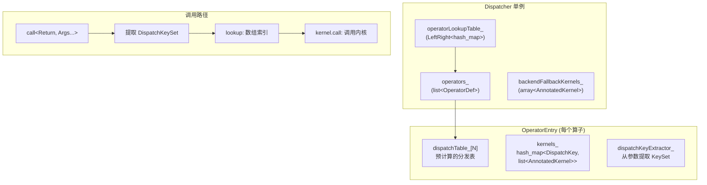

### 核心数据结构关系

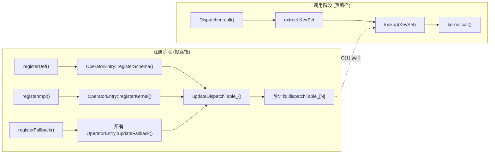

---

## 2. DispatchKey 体系

DispatchKey 是一个 `uint16_t` 枚举，定义了所有可能的分发层。

### 2.1 后端组件键 (BackendComponent)

占 DispatchKeySet 的低 15 位，表示硬件后端：

| 值 | 键 | 说明 |
|----|-----|------|
| 0 | InvalidBit | 无效/占位 |
| 1 | CPUBit | CPU 后端 |
| 2 | CUDABit | NVIDIA CUDA |
| 3 | HIPBit | AMD HIP |
| 4 | XLABit | Google XLA |
| 5 | MPSBit | Apple Metal Performance Shaders |
| 6 | IPUBit | Graphcore IPU |
| 7 | XPUBit | Intel XPU |
| 8 | HPUBit | Habana Gaudi |
| 9 | VEBit | NEC VE |
| 10 | LazyBit | Lazy Tensor (XLA 风格) |
| 11 | MTIABit | MTIA |
| 12 | PrivateUse1Bit | 用户自定义后端 1 |
| 13 | PrivateUse2Bit | 用户自定义后端 2 |
| 14 | PrivateUse3Bit | 用户自定义后端 3 |
| 15 | MetaBit | Meta (无数据) 张量 |

**Meta 必须是最后一个**，这确保了 TLS 中设置 Meta 时能触发 Meta 内核。

### 2.2 功能键 (Functionality Keys)

占 DispatchKeySet 的高位，按优先级从低到高排列：

| 优先级 | 键 | 类型 | 说明 |
|--------|-----|------|------|
| 低 | Dense | per-backend | 密集张量运算 |
| | Quantized | per-backend | 量化运算 |
| | Sparse | per-backend | COO 稀疏运算 |
| | SparseCsr | per-backend | CSR 稀疏运算 |
| | NestedTensor | per-backend | 嵌套张量运算 |
| | BackendSelect | 独立 | 无张量参数时选择后端 |
| | Python | 独立 | Python 内核覆盖 |
| | Fake | 独立 | FakeTensor 抽象执行 |
| | Functionalize | 独立 | 别名/变异消除 |
| | ADInplaceOrView | 独立 | 原地操作版本计数 + 视图追踪 |
| | AutogradOther | 独立 | 非显式后端的自动微分 |
| | AutogradFunctionality | per-backend | 自动微分功能 |
| | AutocastCPU/CUDA/... | 独立 | 自动混合精度 |
| | FuncTorch* | 独立 | 函数变换 |
| | PreDispatch | 独立 | 最前端的预处理分发 |
| 高 | PythonDispatcher | 独立 | 最高优先级，Python 模式拦截 |

**per-backend 功能键**：Dense、Quantized、Sparse、SparseCsr、NestedTensor、AutogradFunctionality 这 6 种功能键，每种与 15 个后端组合产生 15 个运行时键。

### 2.3 运行时键 (Per-Backend Runtime Keys)

功能键 + 后端组件的组合：

| 运行时键 | = 功能键 | + 后端组件 |
|----------|----------|-----------|
| CPU | Dense | CPUBit |
| CUDA | Dense | CUDABit |
| Meta | Dense | MetaBit |
| QuantizedCPU | Quantized | CPUBit |
| SparseCPU | Sparse | CPUBit |
| AutogradCPU | AutogradFunctionality | CPUBit |
| AutogradCUDA | AutogradFunctionality | CUDABit |
| ... | ... | ... |

**总数**：`num_runtime_entries = num_functionality_keys + numPerBackendFunctionalityKeys × (num_backends - 1)`

### 2.4 别名键 (Alias Keys)

别名键不直接参与分发，而是在注册时展开为多个运行时键：

| 别名键 | 展开为 |
|--------|--------|
| Autograd | AutogradFunctionality + AutogradOther + AutogradNestedTensor + 所有后端位 |
| CompositeImplicitAutograd | 数学内核分解 (仅当无后端内核时生效) |
| CompositeExplicitAutograd | 显式组合内核 (所有后端) |
| CompositeExplicitAutogradNonFunctional | 非功能性后端的组合内核 |
| FuncTorchBatchedDecomposition | 批量分解 |

---

## 3. DispatchKeySet 位布局

### 3.1 64 位位图结构

```
┌──────────────────────────────────────────────────────────────────┐
│ Bit 63                                                          │
│ ...  PythonDispatcher  ...  AutogradFunctionality  ...  Dense   │
│ ...  ← 高优先级功能键 ────────────────────── 低优先级功能键 →   │
│                            MetaBit ... CUDABit  CPUBit  Bit 0   │
│                            ← 后端组件键 ──────────────── →      │
└──────────────────────────────────────────────────────────────────┘
```

- **Bits [0, num_backends)**: 后端组件位（CPUBit=bit0, CUDABit=bit1, ..., MetaBit=bit15）
- **Bits [num_backends, 64)**: 功能位（Dense=最低, PythonDispatcher=最高）

### 3.2 关键构造规则

从 `DispatchKey` 构造 `DispatchKeySet` 时：
- **Undefined** → 0 (无位设置)
- **功能键** (如 Dense, AutogradOther) → 仅设置对应功能位
- **运行时键** (如 CPU) → 同时设置功能位 AND 后端位
- **别名键** → 0 (无法在 KeySet 中直接表示)
- **BackendComponent** (如 CPUBit) → 仅设置后端位

### 3.3 getDispatchTableIndexForDispatchKeySet 算法

这是热路径中最关键的方法，将 64 位 KeySet 映射到分发表索引：

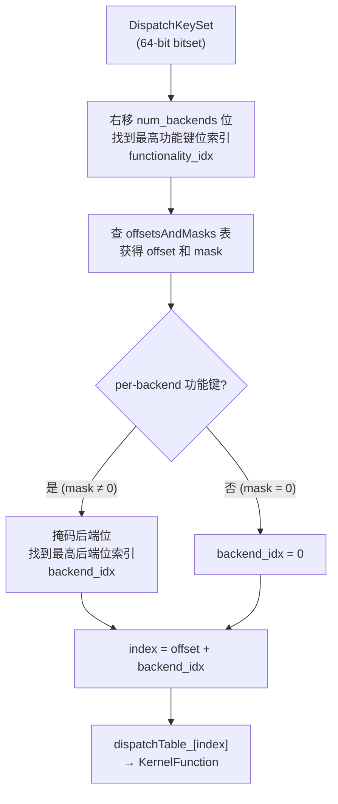

**offsetsAndMasks 预计算**：
- 非 per-backend 功能键：`offset = prev_offset + 1`，`mask = 0`
- per-backend 功能键：`offset = prev_offset + num_backends`，`mask = full_backend_mask`

示例：Dense (per-backend) 占用索引 0..14 (15 个后端)，下一个非 per-backend 键从索引 15 开始。

### 3.4 最高优先级键解析

`highestPriorityTypeId()` 算法：
1. 找到最高功能键位 → `highestFunctionalityKey()`
2. 如果是 per-backend 功能键，组合最高后端位 → `toRuntimePerBackendFunctionalityKey(functionality, backend)`
3. 否则直接返回功能键

### 3.5 集合操作的特殊语义

- **`operator-`**：仅移除功能键位，保留后端位。这确保了 redispatch 时后端信息不丢失。
- **`remove(key)`**：移除 key 的功能位，保留后端位。
- **`remove_backend(backend)`**：显式移除后端位。

### 3.6 预计算 KeySet 常量

| 常量 | 内容 | 用途 |
|------|------|------|
| `autograd_dispatch_keyset` | AutogradFunctionality + AutogradOther + AutogradNestedTensor | 检测是否需要自动微分 |
| `autocast_dispatch_keyset` | 所有 Autocast 键 | 检测是否在 autocast 模式 |
| `default_included_set` | BackendSelect + ADInplaceOrView | 默认 TLS 包含的键 |
| `default_excluded_set` | 所有 Autocast 键 | 默认 TLS 排除的键 |
| `after_autograd_keyset` | AutogradOther 及之后的所有键 | Autograd 内核 redispatch 时使用 |
| `backend_functionality_keys` | Dense + Quantized + Sparse + SparseCsr + 所有后端位 | 后端功能键集合 |

---

## 4. Dispatcher 单例

### 4.1 类结构

**文件**: `aten/src/ATen/core/dispatch/Dispatcher.h`

#### 内部类型

| 类型 | 说明 |
|------|------|
| `OperatorDef` | 每个算子的容器：`OperatorEntry op` + `def_count` + `def_and_impl_count` |
| `Guard` | `atomic<bool> alive` + `mutex`，RAII 注销回调中检查 Dispatcher 是否存活 |

#### 数据成员

| 成员 | 类型 | 说明 |
|------|------|------|
| `operators_` | `list<OperatorDef>` | 所有算子的持有容器。List 迭代器在插入时保持有效，使 OperatorHandle 安全 |
| `operatorLookupTable_` | `LeftRight<flat_hash_map<OperatorName, OperatorHandle>>` | 无锁读、写序列化的名称查找表 |
| `libraries_` | `flat_hash_map<string, string>` | 命名空间→调试字符串，强制每个 ns 只有一个 TORCH_LIBRARY |
| `backendFallbackKernels_` | `array<AnnotatedKernel, num_runtime_entries>` | 每个 DispatchKey 的全局回退内核 |
| `listeners_` | `unique_ptr<RegistrationListenerList>` | 注册/注销事件监听器 |
| `cond_var_` | `condition_variable` | 多解释器同步 (multipy/torchdeploy) |
| `guard_` | `shared_ptr<Guard>` | 共享的 mutex + alive 标志 |

#### OperatorHandle

轻量级、可复制的算子句柄，存储两个指针：
- `OperatorDef*` — 直接指针，快速访问
- `list<OperatorDef>::iterator` — 仅用于快速 `cleanup()` 擦除

#### TypedOperatorHandle<Return(Args...)>

继承 OperatorHandle，增加类型安全的 `call()` 和 `redispatch()` 方法。

### 4.2 关键方法

#### singleton()

```cpp
static Dispatcher& singleton() {
    // 非 mobile: 函数局部静态引用，避免重复 __cxa_guard_acquire
    // mobile: 每次调用 realSingleton()，减少代码体积
    static Dispatcher& s = realSingleton();
    return s;
}
```

#### call<Return, Args...> — 热路径

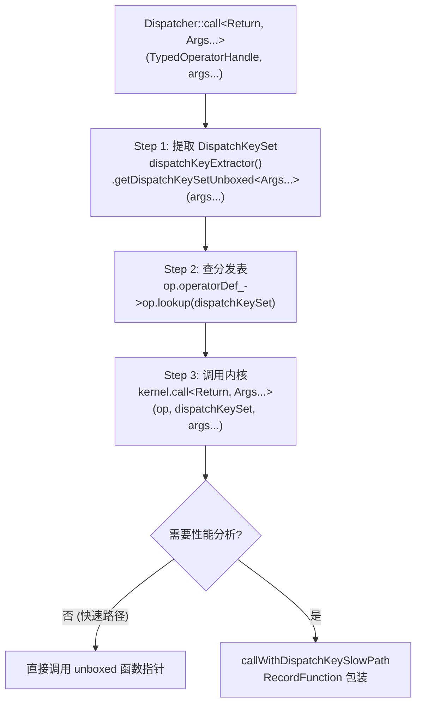

标记为 `C10_ALWAYS_INLINE_UNLIKELY_MOBILE`，强制内联。

#### callWithDispatchKeySlowPath

当 `is_observed_` 为 true 时进入慢路径：
- 包装 `RecordFunction` 进行性能分析
- 如果 guard 需要输入：装箱参数
- 如果 guard 需要输出：`CaptureKernelCall<Return>` 临时捕获返回值

#### redispatch<Return, Args...>

与 `call` 类似，但接受预计算的 `DispatchKeySet`，**不重新提取键**。用于内核内部的继续分发（如 Autograd 内核 → 后端内核）。

#### callBoxed / redispatchBoxed

使用栈式 (IValue Stack) 调用约定，用于 JIT 解释器。

---

## 5. OperatorEntry 分发表

**文件**: `aten/src/ATen/core/dispatch/OperatorEntry.h`, `OperatorEntry.cpp`

### 5.1 数据成员

| 成员 | 类型 | 说明 |
|------|------|------|
| `name_` | `OperatorName` | (namespace, name) 对 |
| `schema_` | `optional<AnnotatedSchema>` | 函数 schema + 调试字符串 |
| `tags_` | `vector<at::Tag>` | 算子标签 |
| `dispatchTable_` | `array<KernelFunction, num_runtime_entries>` | **预计算的分发表**，热路径查询目标 |
| `dispatchKeyExtractor_` | `DispatchKeyExtractor` | 知道哪些参数携带分发键 |
| `py_cache_` | `PyHandleCache` | 缓存的 Python op 对象指针 |
| `kernels_` | `flat_hash_map<DispatchKey, list<AnnotatedKernel>>` | 所有注册的内核（桌面端） |
| `cpp_signature_` | `optional<CppSignatureWithDebug>` | C++ 签名检查 |
| `is_observed_` | `bool` | 是否需要 RecordFunction 观察 |

### 5.2 内核解析优先级

`computeDispatchTableEntryWithDebug` 是分发表槽位计算的核心算法：

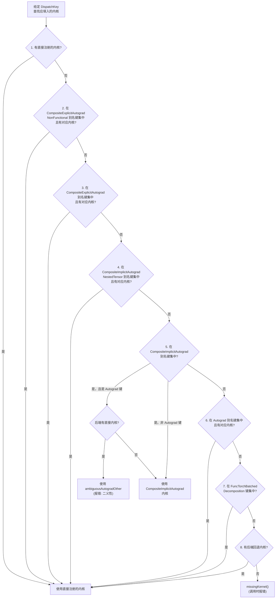

**关键约束**：
- `CompositeImplicitAutograd` 对 Autograd 键有特殊逻辑：如果任何后端有直接内核，不能使用数学分解，否则产生二义性错误
- `CompositeExplicitAutograd` 适用于所有后端的推理，但训练时需要单独的 Autograd 注册

### 5.3 分发表更新传播

当内核注册或回退更新后，`updateDispatchTable_` 传播变更：

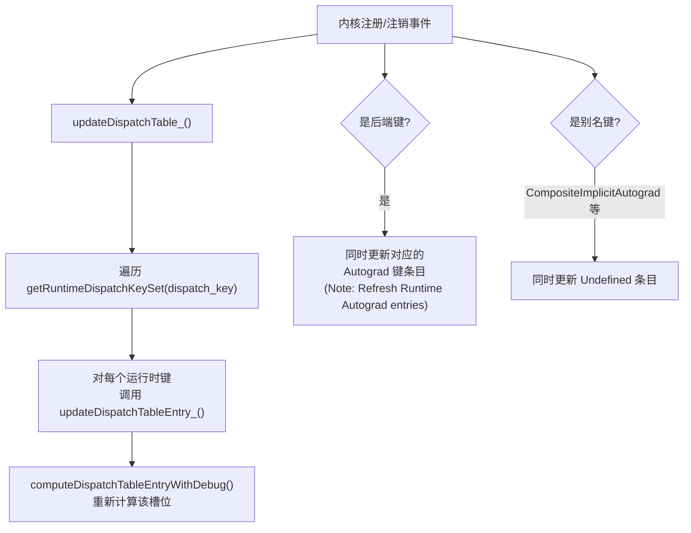

**完整重建** (`updateDispatchTableFull_`)：遍历所有运行时键。在构造和回退注册后调用。

### 5.4 lookup — 热路径查询

```cpp
const KernelFunction& lookup(DispatchKeySet ks) const {
    const auto idx = ks.getDispatchTableIndexForDispatchKeySet();
    if (C10_UNLIKELY(idx == -1)) reportError(...);
    const auto& kernel = dispatchTable_[idx];
    if (C10_UNLIKELY(!kernel.isValidUnboxed())) {
        if (!kernel.isValid()) reportError(...);
    }
    return kernel;
}
```

三步：计算索引 → 数组访问 → 有效性检查。

### 5.5 内核注册 (registerKernel)

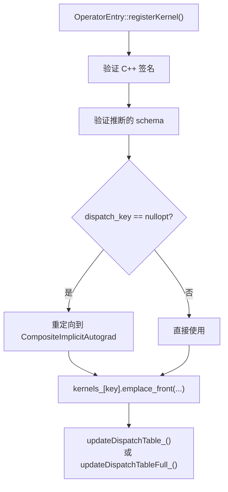

桌面端使用 `emplace_front`（最新的在前面），支持 Jupyter 风格的重注册。移动端替换单元素数组。

---

## 6. KernelFunction 内核函数

**文件**: `aten/src/ATen/core/boxing/KernelFunction.h`, `KernelFunction_impl.h`

### 6.1 存储结构

```cpp
class KernelFunction {
    BoxedKernel boxed_kernel_func_;   // 始终存在（有效内核时）
    void* unboxed_kernel_func_;       // 快速路径，可能为 null
    void* sym_unboxed_kernel_func_;   // SymInt 变体，可能为 null
};
```

三种表示：
- **Boxed**：操作 IValue 栈，签名 `void(OperatorKernel*, const OperatorHandle&, DispatchKeySet, Stack*)`
- **Unboxed**：类型化 C++ 函数指针，签名 `Return(OperatorKernel*, DispatchKeySet, Args...)`
- **SymInt Unboxed**：接受 SymInt 参数的 unboxed 变体

### 6.2 调用路径

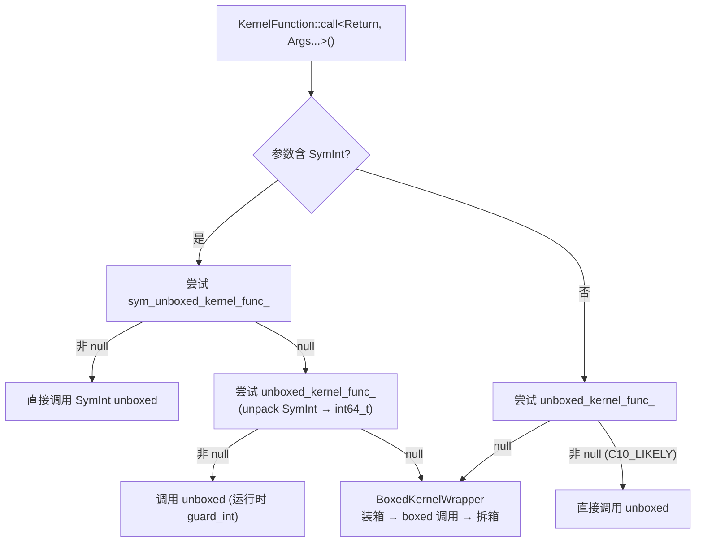

### 6.3 Unboxed 调用机制

```cpp
template <class Return, class... Args>
inline Return callUnboxedKernelFunction(
    void* unboxed_kernel_func, OperatorKernel* functor,
    DispatchKeySet dispatchKeySet, Args&&... args) {
    using ActualSignature = Return(OperatorKernel*, DispatchKeySet, Args...);
    ActualSignature* func = reinterpret_cast<ActualSignature*>(unboxed_kernel_func);
    return (*func)(functor, dispatchKeySet, std::forward<Args>(args)...);
}
```

通过 `reinterpret_cast` 将 `void*` 转为类型化函数指针直接调用。

### 6.4 工厂方法

| 方法 | 说明 |
|------|------|
| `makeFromUnboxedFunctor<KernelFunctor>()` | 从仿函数创建，提取 unboxed 和 boxed 指针 |
| `makeFromUnboxedFunction<FuncPtr>()` | 从编译时已知函数指针创建 |
| `makeFromUnboxedLambda<Lambda>()` | 从 lambda 创建 |
| `makeFromBoxedFunction<func>()` | 仅 boxed，无 unboxed |
| `makeFallthrough()` | 直通内核，继续分发到下一个键 |
| `makeAmbiguousAutogradOther()` | AutogradOther 二义性报错内核 |

### 6.5 SymInt 处理

- `has_symint<T>`：类型特征，检测 T 是否为 SymInt 类型
- `remove_symint<T>`：将 SymInt 映射为 int64_t 等价类型
- `unpackSymInt<T>()`：运行时将 SymInt 转为 int64_t（调用 `guard_int`，断言值为具体值）

---

## 7. DispatchKeyExtractor 键提取

**文件**: `aten/src/ATen/core/dispatch/DispatchKeyExtractor.h`

### 7.1 数据成员

| 成员 | 类型 | 说明 |
|------|------|------|
| `dispatch_arg_indices_reverse_` | `bitset` | 预计算的位图，标识哪些参数位置含张量 |
| `nonFallthroughKeys_` | `DispatchKeySet` | 非直通键集合 |
| `nonFallthroughKeysPerBackend_` | `array<DispatchKeySet, num_backends>` | 每后端的非直通键集合 |
| `requiresBitsetPerBackend_` | `bool` | 是否使用每后端直通追踪 |

### 7.2 Unboxed 键提取

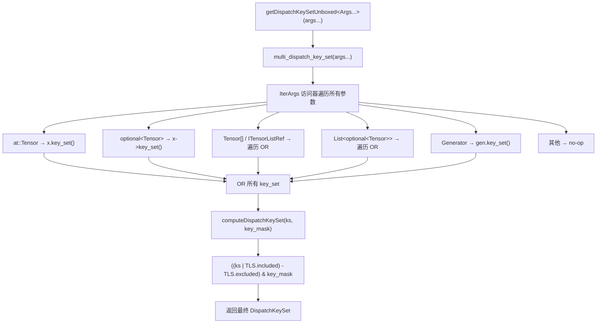

### 7.3 Boxed 键提取

1. 遍历 `dispatch_arg_indices_reverse_` 中设置的位
2. 从 IValue 栈上 peek 对应位置的值
3. 对张量：`unsafeToTensorImpl()->key_set()` (避免引用计数增加)
4. 对张量列表：遍历并 OR 每个 key_set
5. 应用 `computeDispatchKeySet`

### 7.4 computeDispatchKeySet

```cpp
static DispatchKeySet computeDispatchKeySet(
    DispatchKeySet ks, DispatchKeySet key_mask) {
    auto local = LocalDispatchKeySet();
    return (((ks | local.included_) - local.excluded_) & key_mask);
}
```

三步操作：
1. **OR TLS included**：添加 `BackendSelect` 和 `ADInplaceOrView` 等默认包含键
2. **Subtract TLS excluded**：移除 Autocast 等默认排除键
3. **AND key_mask**：屏蔽直通键

---

## 8. 完整分发流程

以 `torch.add(cpu_tensor_a, cpu_tensor_b)` 为例（CPU 张量且 requires_grad=True）：

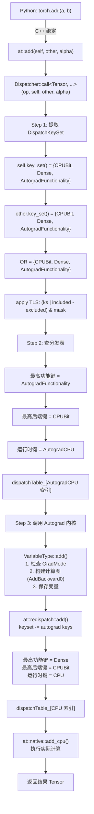

### Redispatch 键操作

Autograd 内核执行 `redispatch` 时，通过 `AutoDispatchBelowAutograd` RAII 守卫从 TLS 排除 Autograd 键，确保不再重新进入 Autograd 层：

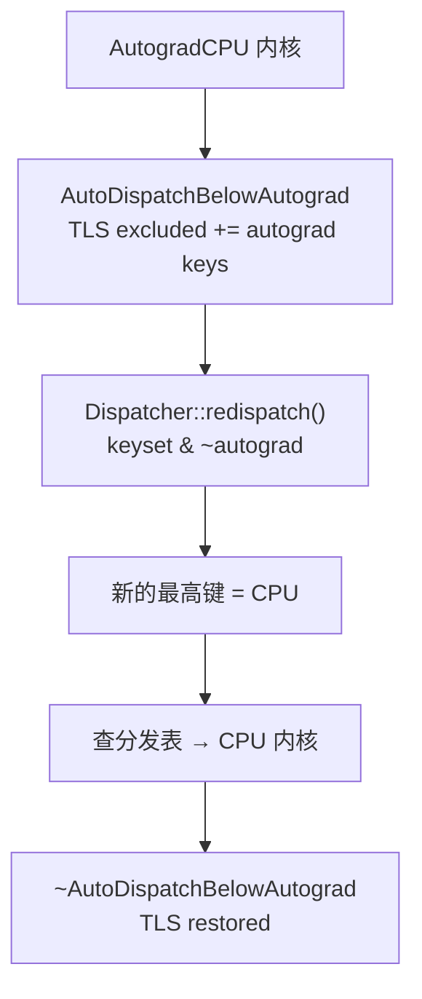

---

## 9. 算子注册 API

### 9.1 C++ 注册宏

```cpp
// 定义算子 schema
TORCH_LIBRARY(aten, m) {
    m.def("add.Tensor(Tensor self, Tensor other, *, Scalar alpha=1) -> Tensor");
}

// 注册特定 DispatchKey 的实现
TORCH_LIBRARY_IMPL(aten, CPU, m) {
    m.impl("add.Tensor", TORCH_FN(add_cpu));
}

// 注册 Autograd 层
TORCH_LIBRARY_IMPL(aten, Autograd, m) {
    m.impl("add.Tensor", TORCH_FN(add_autograd));
}

// 注册后端回退
TORCH_LIBRARY_IMPL(aten, CompositeImplicitAutograd, m) {
    m.impl("add.Tensor", math_add);  // 数学分解内核
}
```

### 9.2 RAII 注销机制

所有注册方法返回 `RegistrationHandleRAII`：

```cpp
class RegistrationHandleRAII {
    std::function<void()> onDestruction_;
public:
    ~RegistrationHandleRAII() { if (onDestruction_) onDestruction_(); }
    // 不可复制，可移动（移动后源对象的 onDestruction_ 被置空）
};
```

当句柄超出作用域时，自动调用注销回调。注销回调捕获 `shared_ptr<Guard>` 来安全检查 Dispatcher 是否仍然存活。

### 9.3 注册方法

| 方法 | 说明 | 注销行为 |
|------|------|----------|
| `registerDef(schema, debug)` | 注册 schema | `def_count--`；=0 时 `deregisterSchema()` |
| `registerImpl(name, key, kernel)` | 注册内核 | 从 `kernels_` 移除；更新分发表 |
| `registerFallback(key, kernel)` | 注册全局回退 | 清除 `backendFallbackKernels_`；更新所有算子 |
| `registerLibrary(ns, debug)` | 注册命名空间 | 从 `libraries_` 移除 |
| `registerName(name)` | 仅注册名称 | `def_and_impl_count--` |

### 9.4 生命周期管理

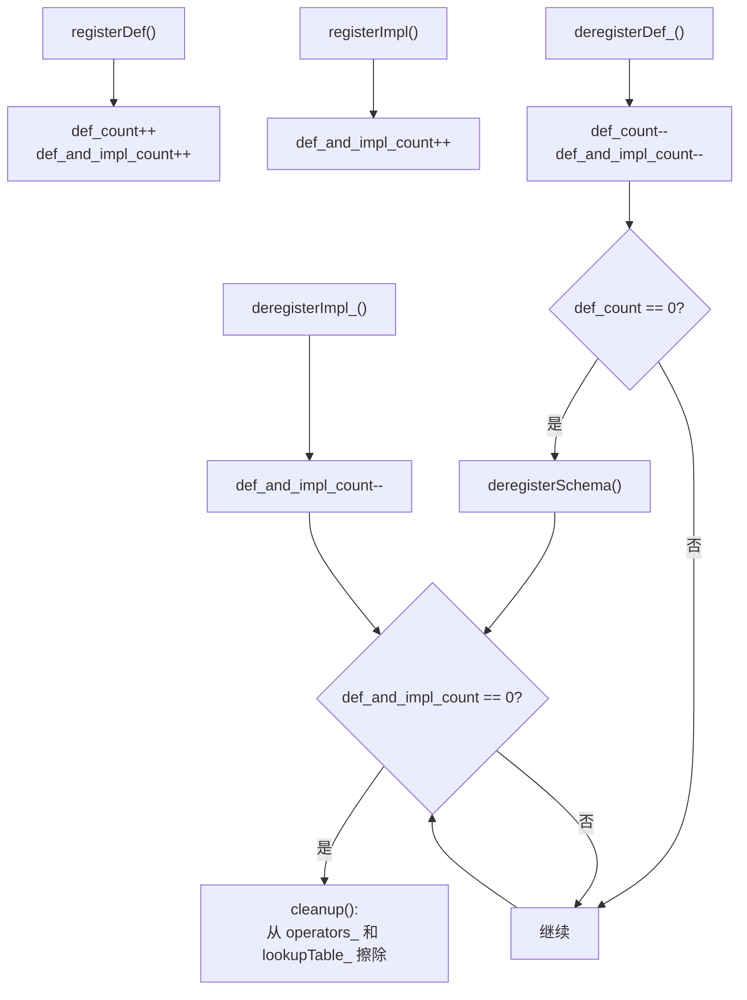

---

## 10. Python 端算子注册

### 10.1 torch.library.Library

```python
# 三种类型
lib = Library("myns", "DEF")        # 定义新算子 (每 ns 唯一)
lib = Library("myns", "IMPL")       # 注册实现
lib = Library("myns", "FRAGMENT")   # 允许多个 (用于 custom_op)
```

核心方法：
- `define(schema, alias_analysis, tags)` → `Dispatcher::registerDef`
- `impl(op_name, fn, dispatch_key, with_keyset)` → `Dispatcher::registerImpl`
- `fallback(fn, dispatch_key)` → `Dispatcher::registerFallback`
- `_register_fake(op_name, fn)` → 注册到 `SimpleLibraryRegistry`（非 C++ Dispatcher）
- `_register_torch_dispatch_rule(op_name, cls, fn)` → 注册 `__torch_dispatch__` 规则

### 10.2 torch.library.custom_op

高级 API，自动处理 schema 推断、fake impl、autograd 注册：

```python
@torch.library.custom_op("myns::my_op", mutates_args=())
def my_op(x: Tensor, alpha: float) -> Tensor:
    return x * alpha

# 自动注册：
# 1. Schema: myns::my_op(Tensor x, float alpha) -> Tensor
# 2. Fake impl: 通过 abstract impl 或自动推断
# 3. Autograd impl: 自动生成 torch.autograd.Function 子类
```

### 10.3 注册流程

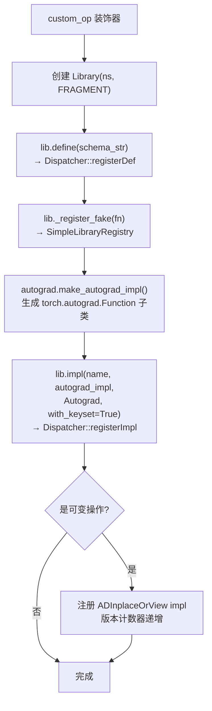

---

## 11. TLS 分发键操作

线程本地状态 (TLS) 可以修改分发行为：

| RAII 守卫 | 效果 | 使用场景 |
|-----------|------|----------|
| `IncludeDispatchKeyGuard(key)` | TLS included += key | 启用特定分发键 |
| `ExcludeDispatchKeyGuard(key)` | TLS excluded += key | 禁用特定分发键 |
| `AutoDispatchBelowAutograd` | TLS excluded += autograd keys | Autograd 内核 redispatch |
| `AutoDispatchBelowADInplaceOrView` | TLS excluded += ADInplaceOrView | ADInplaceOrView 内核 redispatch |
| `AutoDispatchBelowBackendSelect` | TLS excluded += BackendSelect | BackendSelect 之后 |

**LocalDispatchKeySet 结构**：

```cpp
struct LocalDispatchKeySet {
    DispatchKeySet included_;  // 默认: BackendSelect + ADInplaceOrView
    DispatchKeySet excluded_;  // 默认: 所有 Autocast 键
};
```

---

## 12. 设计权衡

### 12.1 预计算 vs 即时计算

分发表在注册时预计算，调用时只需数组索引。这是经典的"空间换时间"策略：
- 优点：O(1) 热路径，无需遍历内核列表
- 缺点：注册时开销较大（更新所有受影响的分发表条目）
- 评价：合理，因为注册是低频操作，调用是高频操作

### 12.2 Unboxed vs Boxed

优先使用 unboxed 函数指针，避免装箱/拆箱开销：
- Unboxed：直接类型化调用，零开销
- Boxed：通过 IValue 栈传递，需要类型转换
- 评价：对热路径算子（如 add、mul）使用 unboxed 可获得最大性能

### 12.3 别名键的展开时机

别名键在注册时展开为运行时键，不在分发时展开：
- 优点：分发时无需处理别名逻辑
- 缺点：注册一个别名内核会更新多个分发表条目
- 评价：正确，保持了分发路径的简洁

### 12.4 多解释器支持

`LeftRight` 数据结构实现无锁读、写序列化：
- 读操作从不阻塞
- 写操作等待所有读者完成
- 评价：适合读多写少的场景（注册是低频的）

### 12.5 Jupyter 风格重注册

桌面端 `kernels_` 使用 `list` + `emplace_front`，允许多次注册同一键：
- 最新注册的内核在最前面，立即生效
- 旧内核在 RAII 句柄销毁时被移除
- 评价：支持 Jupyter notebook 中反复定义同一算子

---

## 附录：核心文件索引

| 文件 | 说明 |
|------|------|
| `c10/core/DispatchKey.h` | DispatchKey 枚举定义、per-backend 键生成宏 |
| `c10/core/DispatchKeySet.h` / `.cpp` | 64 位 KeySet、索引计算、offsetsAndMasks 预计算 |
| `aten/src/ATen/core/dispatch/Dispatcher.h` / `.cpp` | Dispatcher 单例、注册/注销/调用方法 |
| `aten/src/ATen/core/dispatch/OperatorEntry.h` / `.cpp` | 分发表、内核解析优先级、更新传播 |
| `aten/src/ATen/core/boxing/KernelFunction.h` / `_impl.h` | 内核函数包装、unboxed/boxed 调用 |
| `aten/src/ATen/core/dispatch/DispatchKeyExtractor.h` | 从参数提取 KeySet |
| `c10/core/RegistrationHandleRAII.h` | RAII 注销句柄 |
| `torch/library.py` | Python 端 Library 类 |
| `torch/_library/custom_ops.py` | Python 端 custom_op 高级 API |
| `torch/_library/simple_registry.py` | 非 Dispatcher 的注册 (fake impl, torch_dispatch) |
