# 02 - Autograd 自动微分引擎

> Autograd 是 PyTorch 的核心自动微分系统，采用动态计算图 (Define-by-Run) 设计，
> 在前向传播时自动构建反向传播图，支持高效的梯度计算。

---

## 目录

1. [架构概览](#1-架构概览)
2. [Edge — 计算图的边](#2-edge--计算图的边)
3. [Node — 计算图的节点](#3-node--计算图的节点)
4. [AutogradMeta — 张量的自动微分元数据](#4-autogradmeta--张量的自动微分元数据)
5. [SavedVariable — 张量快照](#5-savedvariable--张量快照)
6. [GraphTask — 单次反向传播任务](#6-graphtask--单次反向传播任务)
7. [Engine — 反向传播执行引擎](#7-engine--反向传播执行引擎)
8. [InputBuffer — 梯度累加缓冲区](#8-inputbuffer--梯度累加缓冲区)
9. [AccumulateGrad — 叶子节点梯度累加](#9-accumulategrad--叶子节点梯度累加)
10. [计算图构建流程](#10-计算图构建流程)
11. [反向传播完整流程](#11-反向传播完整流程)
12. [Python 自定义 Function](#12-python-自定义-function)
13. [导数定义 — derivatives.yaml](#13-导数定义--derivativesyaml)
14. [设计权衡](#14-设计权衡)

---

## 1. 架构概览

PyTorch Autograd 系统由以下核心组件构成：

```mermaid
flowchart TD
    subgraph "前向传播 (图构建)"
        A["Tensor 操作<br/>(VariableType 分发包装)"] --> B["创建 Node 子类<br/>(如 AddBackward0)"]
        B --> C["collect_next_edges()<br/>收集输入的梯度边"]
        C --> D["设置输出变量的<br/>gradient_edge → 新 Node"]
        D --> E["SavedVariable 保存<br/>前向计算所需的张量"]
    end
    subgraph "反向传播 (图遍历)"
        F["Engine::execute()"] --> G["创建 GraphTask"]
        G --> H["compute_dependencies()"]
        H --> I["thread_main() 循环"]
        I --> J["evaluate_function()"]
        J --> K["call_function():<br/>hooks → apply() → hooks"]
        K --> L["InputBuffer::add()<br/>梯度累加"]
        L --> M["依赖计数 -1 → 0?"]
        M -->|"是"| N["push 到 ReadyQueue"]
        M -->|"否"| O["存入 not_ready_"]
        N --> I
    end
```

**关键文件索引**：

| 组件 | 文件 |
|------|------|
| Edge | `torch/csrc/autograd/edge.h` |
| Node | `torch/csrc/autograd/function.h`, `.cpp` |
| AutogradMeta | `torch/csrc/autograd/variable.h` |
| SavedVariable | `torch/csrc/autograd/saved_variable.h`, `.cpp` |
| GraphTask | `torch/csrc/autograd/graph_task.h` |
| Engine | `torch/csrc/autograd/engine.h`, `.cpp` |
| InputBuffer | `torch/csrc/autograd/input_buffer.h`, `.cpp` |
| AccumulateGrad | `torch/csrc/autograd/functions/accumulate_grad.h` |
| Python Function | `torch/autograd/function.py` |
| 导数定义 | `tools/autograd/derivatives.yaml` |

---

## 2. Edge — 计算图的边

**文件**: `torch/csrc/autograd/edge.h`

Edge 是计算图中的有向边，连接一个 Node 的输出到另一个 Node 的输入：

```cpp
struct Edge {
    std::shared_ptr<Node> function;  // 目标 Node
    uint32_t input_nr;               // 连接到目标 Node 的第几个输入
};
```

**关键设计**：
- `is_valid()` = `function != nullptr`
- 当多条边指向同一 `(function, input_nr)` 时，梯度通过 `InputBuffer::add()` 隐式求和
- `std::hash<Edge>` 特化使得 Edge 可用作 `unordered_map` 的键

---

## 3. Node — 计算图的节点

**文件**: `torch/csrc/autograd/function.h`

Node 是计算图中的顶点，表示一个反向计算函数。**不按算子类型子类化**——所有算子共享同一个 Node 类，通过 `kind_` 区分。代码生成的子类（如 `AddBackward0`）继承 Node 并实现 `apply()`。

### 3.1 核心成员

| 成员 | 类型 | 说明 |
|------|------|------|
| `next_edges_` | `edge_list` | 出边列表，指向前向输入对应的节点 |
| `input_metadata_` | `SmallVector<InputMetadata, 2>` | 每个输入的 dtype/shape/device/stream |
| `sequence_nr_` | `uint64_t` | 执行优先级（越高越先执行）+ profiler 关联 |
| `topological_nr_` | `uint64_t` | 到叶子最长路径长度，用于 O(1) 剪枝 |
| `has_parent_` | `bool` | topological_nr 是否已冻结 |
| `thread_id_` | `std::thread::id` | 创建该 Node 的线程 ID |
| `pyobj_` | `PyObject*` | Python 弱引用 |
| `mutex_` | `std::mutex` | 线程安全锁 |

### 3.2 执行优先级

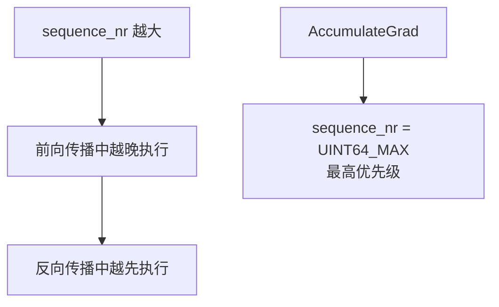

ReadyQueue 中 `CompareNodeTaskTime` 的排序规则：
1. Shutdown 任务最高优先级
2. 空 NodeTask 次高
3. 低 `reentrantDepth` 优先
4. 同深度下，高 `sequence_nr` 优先

### 3.3 拓扑编号与剪枝

`topological_nr_` = 所有子节点 topological_nr 最大值 + 1。关键性质：

- 如果有向路径 X → Y 存在，则 `topo_nr(X) > topo_nr(Y)`
- 逆命题**不成立**
- 用途：O(1) 判断 "Y 不可能从 X 到达"（`topo_nr(X) ≤ topo_nr(Y)` → 不可能到达）

`has_parent_` 标志确保 topo_nr 在节点成为子节点后冻结，防止不一致。

### 3.4 Hook 系统

Node 有多层 hook，按以下顺序执行：

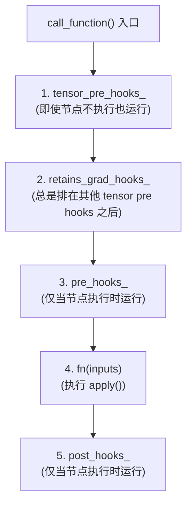

| Hook 类型 | 存储位置 | 何时执行 | 用途 |
|-----------|----------|----------|------|
| `tensor_pre_hooks_` | `vector<unique_ptr<FunctionPreHook>>` | 引擎遍历到节点时 | 梯度修改（即使节点不执行） |
| `retains_grad_hooks_` | `unordered_map<size_t, unique_ptr<FunctionPreHook>>` | tensor pre hooks 之后 | retain_grad 相关 |
| `pre_hooks_` | `vector<unique_ptr<FunctionPreHook>>` | 节点执行前 | 输入修改 |
| `post_hooks_` | `vector<unique_ptr<FunctionPostHook>>` | 节点执行后 | 输出修改 |

### 3.5 关键自由函数

- **`collect_next_edges(vars...)`**：收集所有变量的梯度边，构建 `next_edges` 列表
- **`create_gradient_edge(var, function)`**：连接变量到 Node，添加 input_metadata + 设置 gradient_edge
- **`any_variable_requires_grad(vars...)`**：检查是否有变量需要梯度

### 3.6 deleteNode — 防栈溢出删除

递归删除深度计算图会导致栈溢出。`deleteNode` 使用迭代算法：

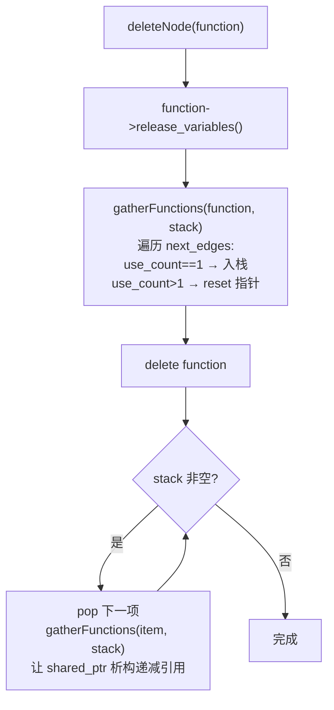

---

## 4. AutogradMeta — 张量的自动微分元数据

**文件**: `torch/csrc/autograd/variable.h`

`Variable` 现在只是 `at::Tensor` 的别名。自动微分元数据存储在 `AutogradMeta` 中，懒加载附加到 `TensorImpl`。

### 4.1 核心成员

| 成员 | 类型 | 说明 |
|------|------|------|
| `grad_` | `Variable` | 累积的梯度 |
| `grad_fn_` | `shared_ptr<Node>` | 非叶变量的梯度函数 |
| `grad_accumulator_` | `weak_ptr<Node>` | 叶变量的梯度累加器（弱引用，避免循环） |
| `fw_grad_` | `shared_ptr<ForwardGrad>` | 前向 AD 切线值 |
| `requires_grad_` | `bool` | 叶变量是否需要梯度 |
| `retains_grad_` | `bool` | 非叶变量是否保留梯度 |
| `is_view_` | `bool` | 是否为视图 |
| `output_nr_` | `uint32_t` | 该变量是 grad_fn 的第几个输出 |
| `hooks_` | `vector<unique_ptr<FunctionPreHook>>` | 梯度钩子 |
| `post_acc_grad_hooks_` | `unique_ptr<PostAccumulateGradHook>` | 累加后钩子 |
| `mutex_` | `mutable std::mutex` | 保护 grad_fn_, grad_accumulator_, fw_grad_ |

### 4.2 梯度边系统

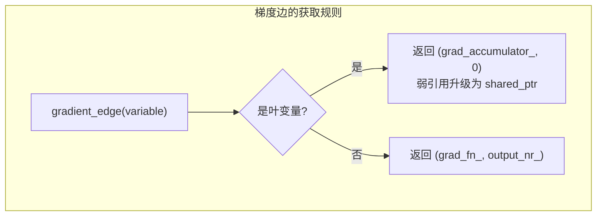

**关键函数**：

| 函数 | 说明 |
|------|------|
| `gradient_edge(var)` | 获取规范梯度边（叶→累加器，非叶→grad_fn） |
| `set_gradient_edge(var, edge)` | 设置 grad_fn_ 和 output_nr_ |
| `grad_accumulator(var)` | 获取或懒创建 AccumulateGrad |
| `rebase_history(var, edge)` | 原地操作后更新梯度边 |

### 4.3 DifferentiableViewMeta

视图变量的扩展元数据：

- `backward_info_` / `forward_info_`：ViewInfo 跟踪视图关系
- `attr_version_`：创建 grad_fn 时的版本号（检测原地修改是否使 grad_fn 过期）
- `creation_meta_`：控制视图创建上下文

---

## 5. SavedVariable — 张量快照

**文件**: `torch/csrc/autograd/saved_variable.h`, `.cpp`

SavedVariable 在前向时保存张量快照，反向时恢复使用。

### 5.1 核心成员

| 成员 | 类型 | 说明 |
|------|------|------|
| `data_` | `at::Tensor` | 原始变量或 tensor_data() |
| `fw_grad_` | `shared_ptr<ForwardGrad>` | 前向 AD 梯度 |
| `weak_grad_fn_` | `weak_ptr<Node>` | 原地视图操作的弱引用 |
| `saved_version_` | `uint32_t` | 保存时的版本号 |
| `output_nr_` | `uint32_t` | 产出函数的输出编号 |
| `saved_original_` | `bool` | 是否保存了原始变量 |
| `is_leaf_` / `is_output_` | `bool` | 来源标记 |
| `is_inplace_on_view_` | `bool` | 是否为视图上的原地操作 |
| `hooks_` | `unique_ptr<SavedVariableHooks>` | 自定义 pack/unpack 钩子 |

### 5.2 保存策略

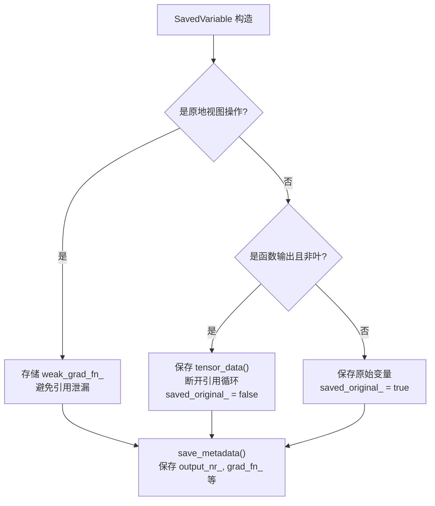

**引用循环问题**：如果函数的输出变量直接保存，其 `grad_fn_` 指回拥有 SavedVariable 的 Node，形成循环引用。解决方案是保存 `tensor_data()`（仅数据，无 autograd 元数据），在解包时重建。

### 5.3 解包流程

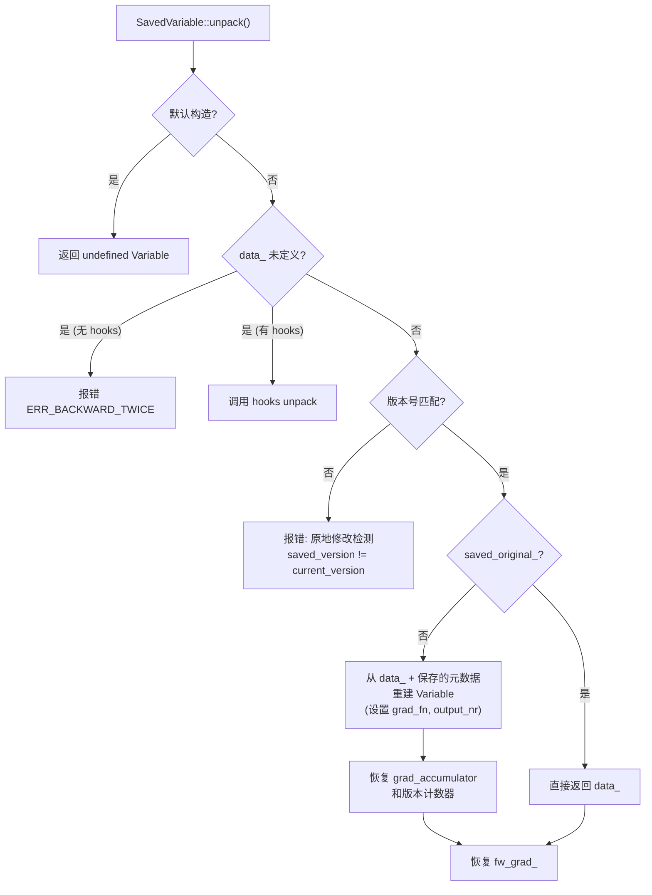

### 5.4 自定义 Hooks

允许用户定义 pack/unpack 逻辑（如保存张量到磁盘）：

1. `register_hooks(hooks)` — 注册钩子
2. `set_hooks_and_pack_data()` — 调用 pack_hook，释放原始 data_
3. unpack 时调用 unpack_hook 恢复

---

## 6. GraphTask — 单次反向传播任务

**文件**: `torch/csrc/autograd/graph_task.h`

GraphTask 持有单次 `backward()` 调用的所有元数据。

### 6.1 核心成员

**原子/无锁字段**：

| 成员 | 类型 | 说明 |
|------|------|------|
| `outstanding_tasks_` | `atomic<uint64_t>` | 未完成任务数；归零时 GraphTask 完成 |
| `has_error_` | `atomic_bool` | 错误信号，让所有线程停止 |
| `keep_graph_` | `bool` | 是否在执行后保留变量 |

**互斥锁保护字段** (mutex_)：

| 成员 | 类型 | 说明 |
|------|------|------|
| `not_ready_` | `unordered_map<Node*, InputBuffer>` | 未满足依赖的节点缓冲区 |
| `dependencies_` | `unordered_map<Node*, int>` | 每个节点的未满足依赖计数 |
| `exec_info_` | `unordered_map<Node*, ExecInfo>` | 执行过滤信息 |
| `captured_vars_` | `vector<Variable>` | 捕获的梯度（返回给用户） |
| `leaf_streams` | `unordered_set<c10::Stream>` | 叶节点运行所在的流 |
| `final_callbacks_` | `vector<function<void()>>` | 执行后回调 |

**其他重要字段**：

| 成员 | 类型 | 说明 |
|------|------|------|
| `owner_` | `int` | 创建该任务的 worker_device |
| `cpu_ready_queue_` | `shared_ptr<ReadyQueue>` | 每任务独立的 CPU 就绪队列 |
| `future_result_` | `intrusive_ptr<Future>` | 完成时标记的 Future |
| `reentrant_depth_` | `const int` | 父 GraphTask 的嵌套深度 |

### 6.2 ExecInfo — 执行过滤

控制哪些节点需要执行：

| 字段 | 说明 |
|------|------|
| `needed_` | 该节点必须执行 |
| `captures_` | 捕获梯度条目（用于 `grad()` 指定输入时） |

`should_execute()` = `needed_ || captures_`

**当 `exec_info_` 为空时**：所有 next_edges 都执行（默认 `.backward()` 模式）。当非空时：仅 `should_execute()` 为 true 的节点执行。

### 6.3 init_to_execute — 剪枝算法

当用户指定 `inputs=` 参数时，`init_to_execute()` 通过 DFS 标记可达节点：

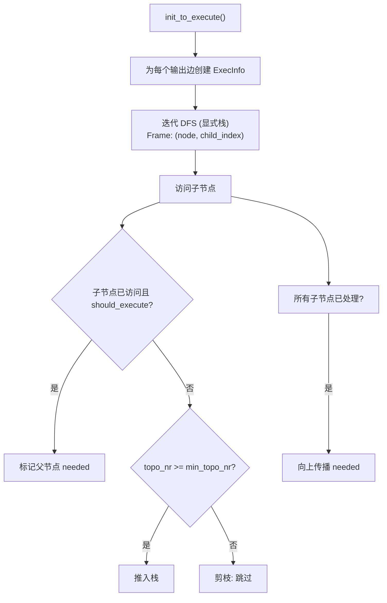

---

## 7. Engine — 反向传播执行引擎

**文件**: `torch/csrc/autograd/engine.h`, `.cpp`

### 7.1 类结构

**静态常量**：
- `MAX_DEPTH = 60`：最大重入深度（基于 TSAN 的 65 锁/线程限制）

**核心类型**：

| 类型 | 说明 |
|------|------|
| `NodeTask` | 工作单元：`(weak_ptr<GraphTask>, shared_ptr<Node>, InputBuffer)` |
| `ReadyQueue` | 线程安全优先队列 |
| `ThreadPoolShared` | 重入线程池共享状态 |

**成员变量**：

| 成员 | 说明 |
|------|------|
| `device_ready_queues_` | 每个加速器设备一个 ReadyQueue |
| `thread_pool_shared_` | 重入线程池管理 |
| `non_reentrant_device_thread_count_` | 非重入设备线程计数 |

### 7.2 线程局部变量

| 变量 | 说明 |
|------|------|
| `worker_device` | 当前线程服务的设备（NO_DEVICE/CPU_DEVICE/加速器索引） |
| `checkpoint_valid` | 梯度检查点是否有效 |
| `current_depth` | 当前线程的嵌套重入深度 |
| `total_depth` | 跨设备线程的总深度 |
| `current_graph_task` | 当前正在执行的 GraphTask |
| `local_ready_queue` | 当前线程的就绪队列 |

### 7.3 execute() — 入口点

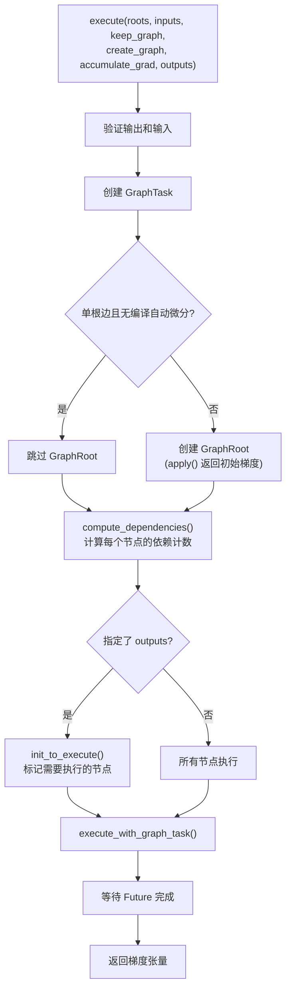

### 7.4 execute_with_graph_task()

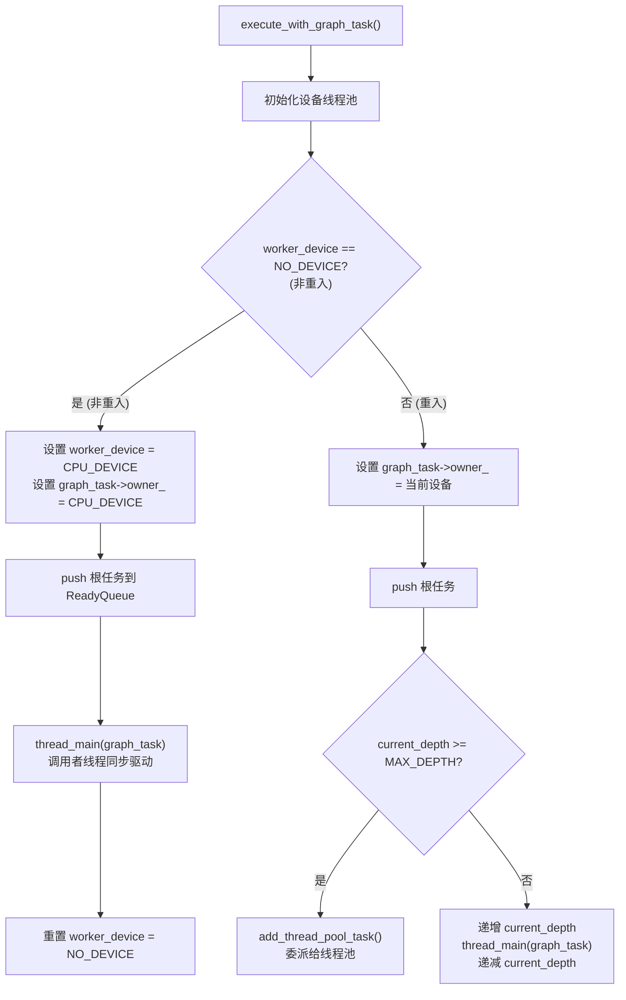

### 7.5 thread_main() — 主循环

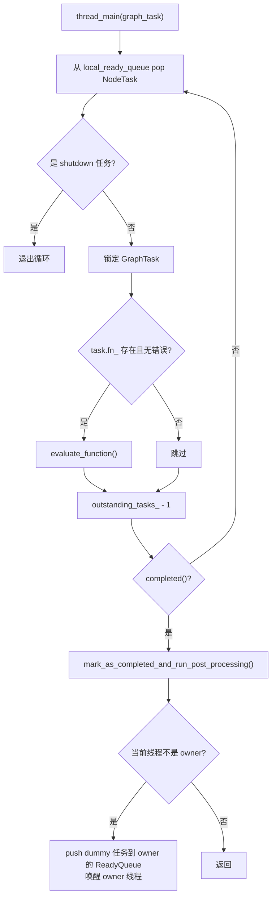

**设备线程**：每个加速器设备一个专用线程，从设备专属 ReadyQueue 取任务，永久循环。
**CPU 线程**：调用者线程同步驱动执行。
**重入处理**：重入深度 < MAX_DEPTH 时递归；超过则委派给线程池。

### 7.6 evaluate_function() — 核心评估逻辑

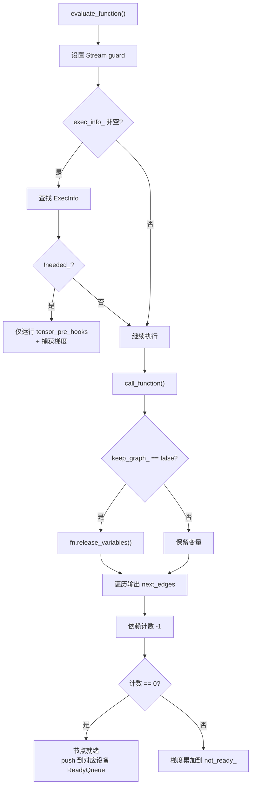

### 7.7 call_function() — 函数调用包装

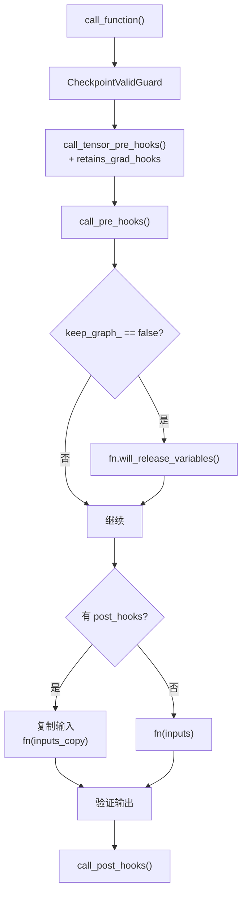

### 7.8 compute_dependencies() — 依赖计算

BFS 从根节点遍历，计算每个节点的入度（有多少边指向它）：

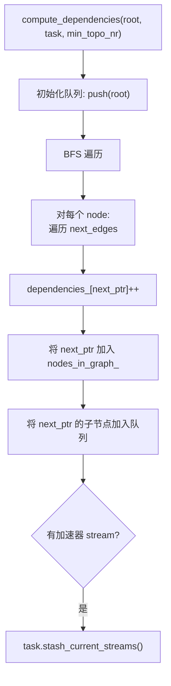

当 `evaluate_function` 中某节点的依赖计数减到 0 时，该节点所有输入梯度已就绪，可以执行。

### 7.9 流同步

在 CUDA 上，反向操作在与前向操作相同的流上运行。流同步发生在：
1. `InputBuffer::add()` — 生产者流与消费者流之间
2. `evaluate_function()` 开始时 — Guard 到函数的流
3. `exec_post_processing()` — 叶子流与调用者的当前流同步

### 7.10 设备线程管理

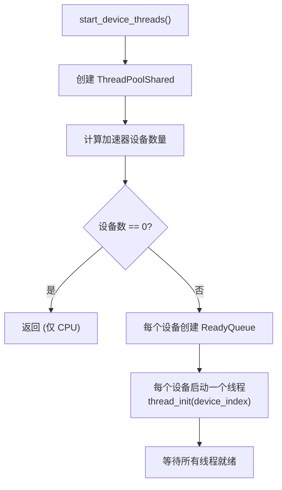

---

## 8. InputBuffer — 梯度累加缓冲区

**文件**: `torch/csrc/autograd/input_buffer.h`, `.cpp`

### 8.1 结构

```cpp
struct InputBuffer {
    vector<Variable> buffer;
    void add(size_t pos, Variable&& var,
             optional<c10::Stream> producer_stream,
             optional<c10::Stream> consumer_stream);
};
```

### 8.2 add() — 梯度累加与流同步

这是梯度累加和 CUDA 流同步的核心：

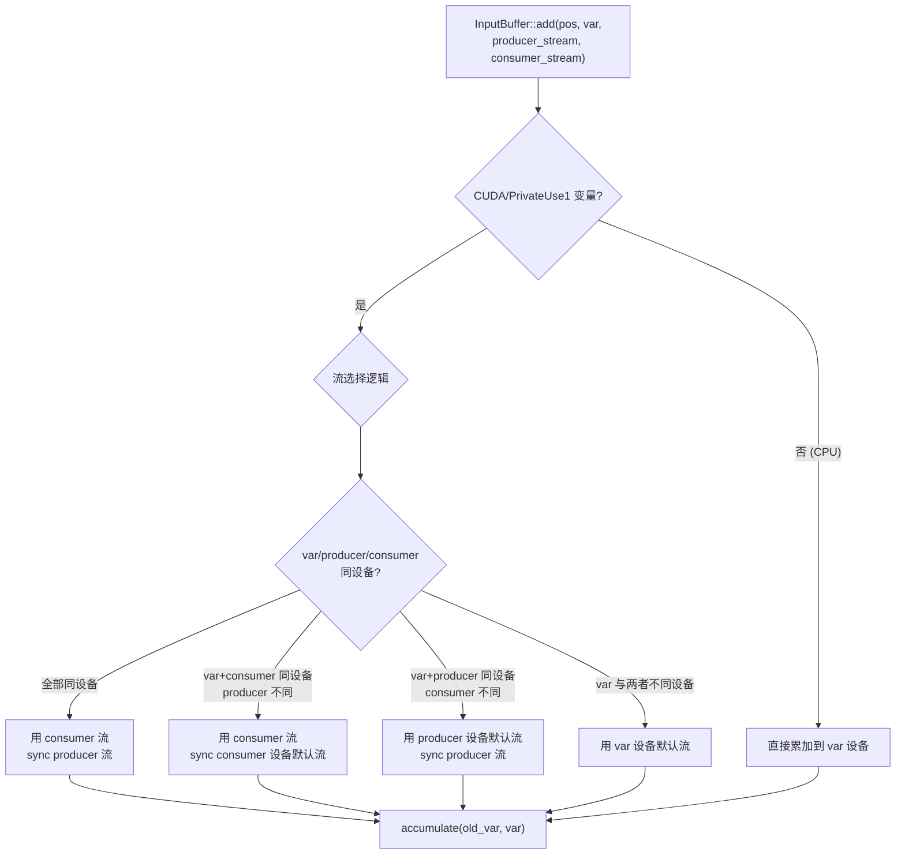

### 8.3 accumulate() — 实际梯度加法

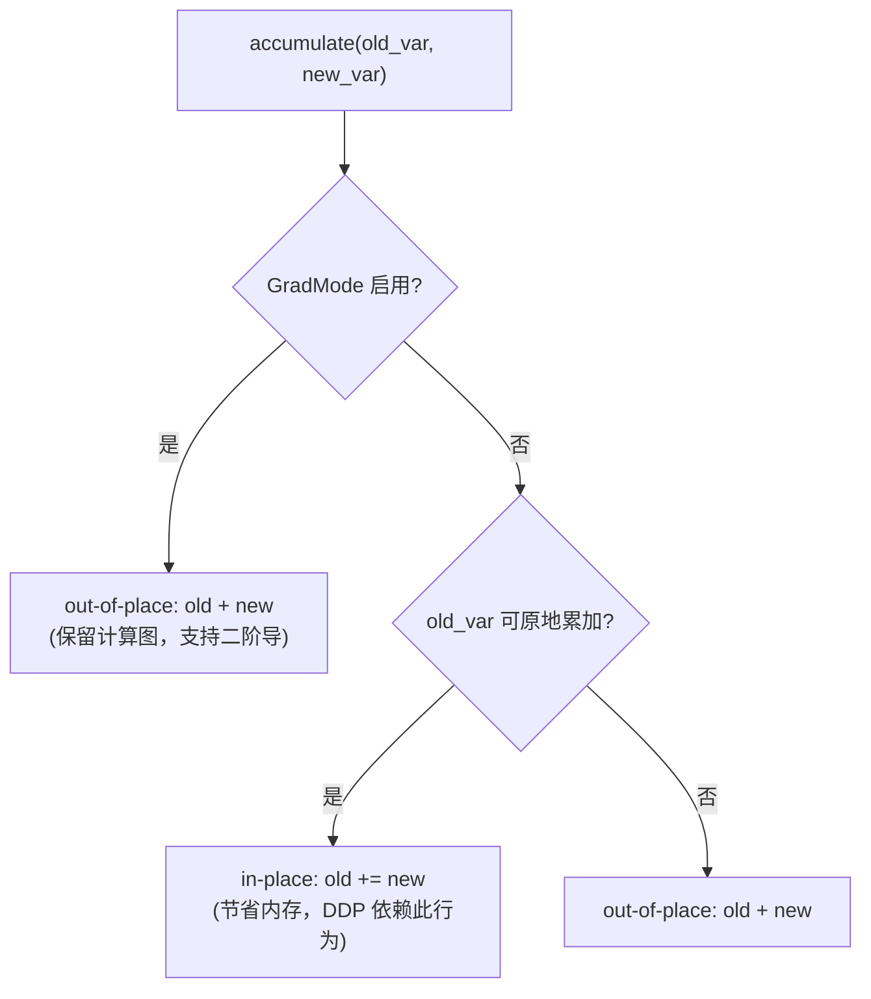

`can_accumulate_inplace()` 条件：普通 Tensor（非子类）、非零张量、非嵌套、非重叠且密集、`use_count==1`（仅一个引用）。

---

## 9. AccumulateGrad — 叶子节点梯度累加

**文件**: `torch/csrc/autograd/functions/accumulate_grad.h`

AccumulateGrad 是反向图的终点——它将梯度写入叶子变量的 `.grad` 字段。

### 9.1 梯度布局契约

AccumulateGrad 尝试确保：
1. 如果变量非重叠且密集，梯度的 strides 与变量匹配
2. 否则，梯度为行主序连续

这对优化器内核和 DDP Reducer 性能至关重要。

### 9.2 累加策略

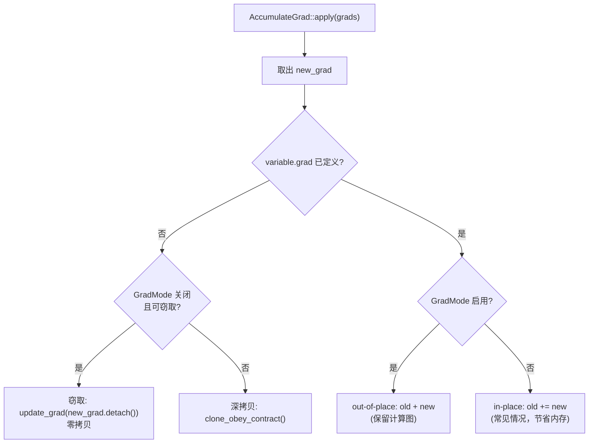

### 9.3 Hook 覆盖

AccumulateGrad 特殊之处在于其 hook 来自关联的变量而非节点本身：
- `tensor_pre_hooks()` → 懒读取 `impl::hooks(variable)`
- `tensor_post_acc_grad_hooks()` → 懒读取 `impl::post_acc_grad_hooks(variable)`

原因：AccumulateGrad 是从 Tensor 的弱引用创建的，可能在 Tensor 仍存活时被销毁。

---

## 10. 计算图构建流程

前向传播时，VariableType 分发包装自动构建计算图：

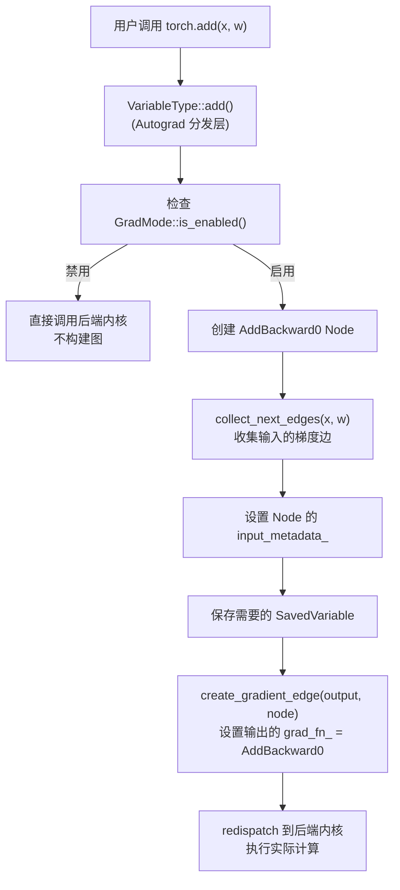

**梯度边的传播**：

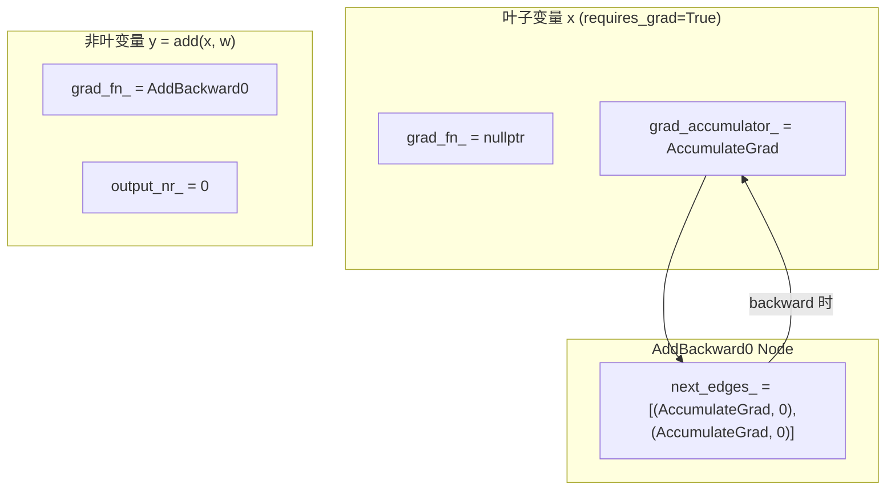

---

## 11. 反向传播完整流程

以 `loss.backward()` 为例，完整调用链：

```mermaid
flowchart TD
    A["loss.backward()"] --> B["torch.autograd.backward(loss, grad_tensors)"]
    B --> C["Engine::execute()"]
    C --> D["创建 GraphTask<br/>设置 keep_graph, owner, cpu_ready_queue"]
    D --> E["compute_dependencies()<br/>BFS 计算每个节点入度"]
    E --> F["init_to_execute()<br/>(如指定 inputs)"]
    F --> G["push 根任务到 ReadyQueue"]
    G --> H["thread_main() 循环"]

    H --> I["pop NodeTask"]
    I --> J["evaluate_function()"]
    J --> K["call_function():<br/>tensor_pre_hooks → pre_hooks<br/>→ apply() → post_hooks"]
    K --> L["AddBackward0::apply()<br/>计算 ∂L/∂x = grad * ∂add/∂x"]
    L --> M["遍历 next_edges_"]
    M --> N["对每条边: 依赖计数 -1"]
    N --> O{"计数 == 0?"}
    O -->|"否"| P["InputBuffer::add()<br/>累加到 not_ready_"]
    O -->|"是"| Q["创建新 NodeTask<br/>push 到目标设备 ReadyQueue"]
    Q --> H

    K --> R["AccumulateGrad::apply()<br/>将梯度写入 x.grad"]
    R --> S["outstanding_tasks_ - 1"]
    S --> T{"所有任务完成?"}
    T -->|"是"| U["mark_as_completed_and_run_post_processing()"]
    U --> V["流同步 + 最终回调"]
    V --> W["future_result_->markCompleted()"]
    W --> X["execute() 返回梯度"]
```

---

## 12. Python 自定义 Function

**文件**: `torch/autograd/function.py`

### 12.1 Function 类层次

```mermaid
flowchart TD
    A["Function (用户基类)"] --> B["FunctionMeta (元类)"]
    B --> C["自动创建 BackwardCFunction 子类<br/>(如 MyFuncBackward)"]
    C --> D["BackwardCFunction<br/>(连接 Python → C++)"]
    D --> E["_C._FunctionBase<br/>(C++ 绑定)"]
    A --> F["FunctionCtx<br/>(上下文对象)"]
    F --> G["save_for_backward()"]
    F --> H["save_for_forward()"]
    F --> I["mark_dirty()"]
    F --> J["mark_non_differentiable()"]
    F --> K["set_materialize_grads()"]
```

### 12.2 核心方法

| 方法 | 说明 |
|------|------|
| `forward(ctx, *args)` | 前向计算，必须重写 |
| `setup_context(ctx, inputs, output)` | 设置上下文（可选，与 forward 分离模式） |
| `backward(ctx, *grad_outputs)` | 反向计算，必须重写 |
| `vjp(ctx, *grad_outputs)` | backward 的别名 |
| `jvp(ctx, *grad_inputs)` | 前向 AD（可选） |
| `apply(*args)` | 类方法，入口，调用 C++ super().apply() |

### 12.3 FunctionMeta 元类

自动为每个 Function 子类创建 `_backward_cls`：

```python
# 当定义 class MyFunc(Function) 时:
# FunctionMeta 自动创建:
class MyFuncBackward(BackwardCFunction):
    _forward_cls = MyFunc
    
    def apply(self, *args):
        return self._forward_cls.backward(self, *args)
    
    def apply_jvp(self, *args):
        return self._forward_cls.jvp(self, *args)
```

### 12.4 once_differentiable 装饰器

阻止二阶导数：

1. 在 `torch.no_grad()` 下运行 backward
2. 如果任何输入需要梯度，用 `DelayedError` 包装输出
3. `DelayedError` 在下次反向时抛出错误

---

## 13. 导数定义 — derivatives.yaml

**文件**: `tools/autograd/derivatives.yaml`

### 13.1 格式

```yaml
- name: add.Tensor(Tensor self, Tensor other, *, Scalar alpha=1) -> Tensor
  self: handle_r_to_c(self.scalar_type(), grad)
  other: handle_r_to_c(other.scalar_type(), maybe_multiply(grad, alpha.conj()))
  result: self_t + maybe_multiply(other_t, alpha)
```

**字段说明**：
- `name`：ATen 函数名+签名
- `self` / `other`：各可微输入的梯度公式
- `result`：前向 AD 的切线传播公式

**梯度表达式可用的变量**：
- `grad` / `grads[i]` / `grad_{name}`：输出梯度
- 输入参数（按名称引用）
- `result` / `resultX`：前向输出
- `self_t` / `other_t`：保存的前向张量
- `grad_input_mask`：`array<bool, N>` 指示哪些输入需要梯度

### 13.2 特殊标记

| 标记 | 说明 |
|------|------|
| `non_differentiable` | 标记不可微参数 |
| `output_differentiability` | 控制哪些输出可微 |
| `dispatch` | 按自动微分 DispatchKey 提供不同导数 |
| `auto_linear` | 线性函数的自动前向 AD |
| `auto_element_wise` | 逐元素函数的自动前向 AD |
| `not_implemented("func")` | 标记未实现的导数 |

### 13.3 代码生成

torchgen 读取 `derivatives.yaml`，生成：
- **Functions.h / Functions.cpp**：自动生成的 Node 子类（如 `AddBackward0`）
- **VariableType_*.cpp**：Autograd 分发包装代码

---

## 14. 设计权衡

### 14.1 动态图 vs 静态图

动态图 (Define-by-Run) 每次前向传播构建新图：
- 优点：自然支持动态控制流、调试友好
- 缺点：无法全局优化；图构建有运行时开销
- PyTorch 的选择：优先用户体验和灵活性

### 14.2 引用循环处理

AutogradMeta 中 `grad_accumulator_` 使用 `weak_ptr`，SavedVariable 对输出保存 `tensor_data()`，都是为了打破引用循环。循环会导致内存泄漏。

### 14.3 线程模型

每个加速器设备一个专用线程：
- 优点：设备间并行、流同步正确
- 缺点：线程开销；重入时需要复杂的状态管理
- MAX_DEPTH=60 防止栈溢出（TSAN 限制）

### 14.4 梯度累加策略

- GradMode 关闭时：优先 in-place 累加（`old += new`），节省内存
- GradMode 开启时：始终 out-of-place（`old + new`），保留计算图支持二阶导
- DDP 依赖 in-place 累加行为来高效共享梯度缓冲区

### 14.5 SavedVariable 的空间优化

- 叶变量和非输出变量直接保存原始变量（`saved_original_ = true`）
- 输出变量仅保存 `tensor_data()`，解包时重建
- 避免了引用循环，同时最小化保存的数据量

### 14.6 拓扑编号用于剪枝

`topological_nr_` 提供 O(1) 的不可达性判断，在 `init_to_execute()` 中快速剪枝不需要计算的子图。代价是每次连接节点时需要更新（已冻结则断言失败）。
