# 03 - TensorImpl 张量核心实现

> TensorImpl 是 PyTorch 张量的 C++ 核心数据结构，承载了张量的全部元数据：
> 存储引用、形状步长、数据类型、分发键集、自动微分信息等。
> 它与 StorageImpl、intrusive_ptr_target 共同构成了张量的内存管理基础。

---

## 目录

1. [架构概览](#1-架构概览)
2. [intrusive_ptr_target — 引用计数基类](#2-intrusive_ptr_target--引用计数基类)
3. [intrusive_ptr — 强引用智能指针](#3-intrusive_ptr--强引用智能指针)
4. [weak_intrusive_ptr — 弱引用智能指针](#4-weak_intrusive_ptr--弱引用智能指针)
5. [StorageImpl — 存储实现](#5-storageimpl--存储实现)
6. [Storage — 存储包装器](#6-storage--存储包装器)
7. [Allocator 与 DataPtr — 内存分配](#7-allocator-与-dataptr--内存分配)
8. [SizesAndStrides — 形状与步长](#8-sizesandstrides--形状与步长)
9. [TensorImpl 核心成员与构造](#9-tensorimpl-核心成员与构造)
10. [TensorImpl 位域标志](#10-tensorimpl-位域标志)
11. [ExtraMeta — 扩展元数据](#11-extrameta--扩展元数据)
12. [VariableVersion — 版本追踪](#12-variableversion--版本追踪)
13. [TensorOptions — 构建器模式](#13-tensoroptions--构建器模式)
14. [ScalarType — 标量类型体系](#14-scalartype--标量类型体系)
15. [分发键集构建](#15-分发键集构建)
16. [连续性计算](#16-连续性计算)
17. [浅拷贝与元数据复制](#17-浅拷贝与元数据复制)
18. [COW 写时复制](#18-cow-写时复制)
19. [张量生命周期流程](#19-张量生命周期流程)
20. [设计权衡](#20-设计权衡)

---

## 1. 架构概览

TensorImpl 及其关联组件的层次结构：

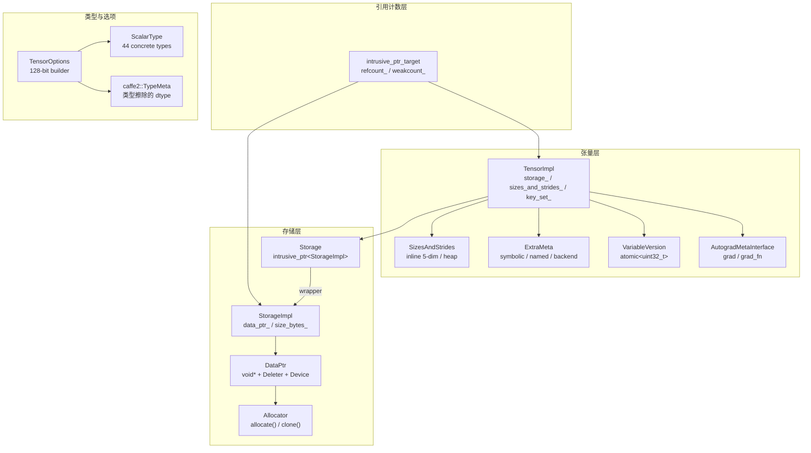

**关键文件索引**：

| 组件 | 文件 |
|------|------|
| intrusive_ptr_target | `c10/util/intrusive_ptr.h` |
| StorageImpl | `c10/core/StorageImpl.h` |
| Storage | `c10/core/Storage.h` |
| DataPtr / Allocator | `c10/core/Allocator.h` |
| CPUAllocator | `c10/core/CPUAllocator.h` |
| SizesAndStrides | `c10/core/impl/SizesAndStrides.h` |
| TensorImpl | `c10/core/TensorImpl.h`, `.cpp` |
| TensorOptions | `c10/core/TensorOptions.h` |
| ScalarType | `c10/core/ScalarType.h` |

---

## 2. intrusive_ptr_target — 引用计数基类

`intrusive_ptr_target` 是 TensorImpl 和 StorageImpl 的共同基类，提供侵入式引用计数。

### 2.1 引用计数方案

```
强引用 (refcount_)：  持有对象的所有权，refcount > 0 时对象存活
弱引用 (weakcount_)： 不持有所有权，但阻止对象内存被释放

不变量：refcount > 0 ⟹ weakcount > 0
初始：  refcount = 0, weakcount = 0（由 intrusive_ptr 构造时设为 1）
```

### 2.2 核心成员

```cpp
struct C10_API intrusive_ptr_target {
  mutable std::atomic<uint32_t> refcount_;   // 强引用计数
  mutable std::atomic<uint32_t> weakcount_;   // 弱引用计数 + (refcount>0 ? 1 : 0)

protected:
  virtual void release_resources();  // refcount 降为 0 时调用
  ~intrusive_ptr_target();           // protected 析构
};
```

### 2.3 引用计数操作内存序

| 操作 | 内存序 | 原因 |
|------|--------|------|
| refcount increment | `acq_rel` | 需要与其他线程的 decrement 同步 |
| refcount decrement | `acq_rel` | 析构前必须看到所有写操作 |
| weakcount increment | `relaxed` | 弱引用不需要强同步 |
| weakcount decrement | `acq_rel` | 可能触发析构 |

### 2.4 引用计数流程

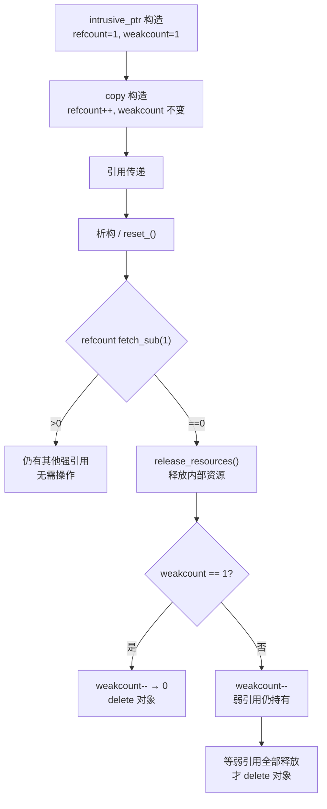

**关键常量**：`kImpracticallyHugeReferenceCount = 0x0FFFFFFF`，用于非堆分配对象的"无限"引用计数，防止意外析构。

---

## 3. intrusive_ptr — 强引用智能指针

### 3.1 核心结构

```cpp
template <typename TTarget, typename NullType = detail::intrusive_ptr_default_null_type<TTarget>>
class intrusive_ptr {
  TTarget* target_;  // 原始指针

  void retain_();    // refcount++
  void reset_();     // refcount--, 可能触发析构
};
```

### 3.2 所有权语义

| 操作 | refcount 变化 | 说明 |
|------|---------------|------|
| `intrusive_ptr(TTarget*)` | 0→1 | 新建，设置两个计数为 1 |
| `copy` | +1 | 共享所有权 |
| `move` | 不变 | 转移所有权 |
| `reset_()` | -1 | 可能析构 |
| `release()` | 不变 | 放弃管理权，返回裸指针 |

### 3.3 特殊构造方式

| 方法 | 用途 |
|------|------|
| `reclaim(TTarget*)` | 接管已有对象的所有权（不增加引用计数） |
| `reclaim_copy(TTarget*)` | 接管并增加引用计数 |
| `unsafe_steal_from_new(TTarget*)` | pybind11 兼容，从 new 表达式接管 |
| `unsafe_adapt_non_heap_allocated()` | 栈/arena 分配对象，设置巨大引用计数 |

---

## 4. weak_intrusive_ptr — 弱引用智能指针

### 4.1 核心结构

```cpp
template <typename TTarget, typename NullType>
class weak_intrusive_ptr {
  TTarget* target_;

  void retain_();  // weakcount++
  void reset_();   // weakcount--, 可能 delete 对象
};
```

### 4.2 lock() — 提升为强引用

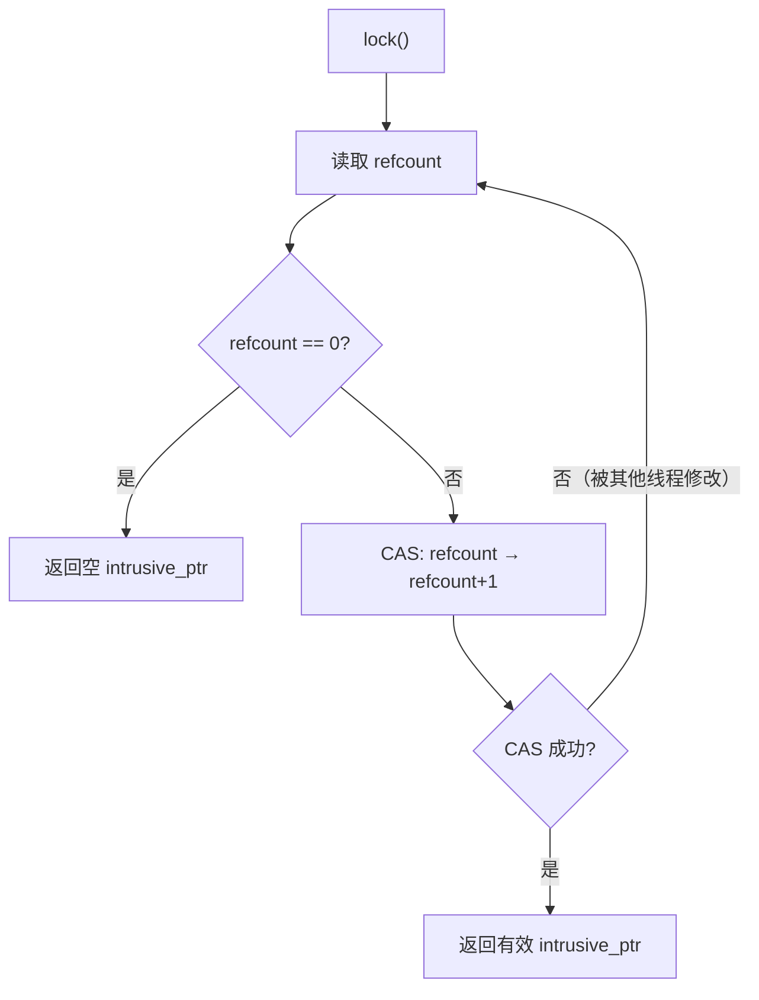

`lock()` 使用 CAS（Compare-And-Swap）循环，保证在并发环境下不会错误提升已析构对象的引用。

### 4.3 expired() 与 use_count()

- `expired()`：等价于 `use_count() == 0`
- `use_count()`：返回 `refcount_`（注意不是 `weakcount_`）

---

## 5. StorageImpl — 存储实现

StorageImpl 管理张量的底层数据缓冲区，是实际持有内存的实体。

### 5.1 核心成员

| 成员 | 类型 | 用途 |
|------|------|------|
| `data_ptr_` | `DataPtr` | 数据指针 + 删除器 + 设备信息 |
| `size_bytes_` | `SymInt` | 字节数（可能为符号值） |
| `size_bytes_is_heap_allocated_` | `bool` | size_bytes_ 是否在堆上 |
| `resizable_` | `bool` | 是否可调整大小 |
| `received_cuda_` | `bool` | 跨进程 CUDA 接收标志 |
| `has_mutable_data_ptr_check_` | `bool` | 热路径 data_ptr 守卫 |
| `throw_on_mutable_data_ptr_` | `bool` | 可变访问时抛异常 |
| `throw_on_immutable_data_ptr_` | `bool` | 不可变访问时抛异常 |
| `warn_deprecated_on_mutable_data_ptr_` | `bool` | 可变访问时警告 |
| `allocator_` | `Allocator*` | 内存分配器 |
| `pyobj_slot_` | `PyObjectSlot` | Python 对象槽 |
| `extra_meta_` | `unique_ptr<StorageExtraMeta>` | 扩展元数据 |

### 5.2 构造函数

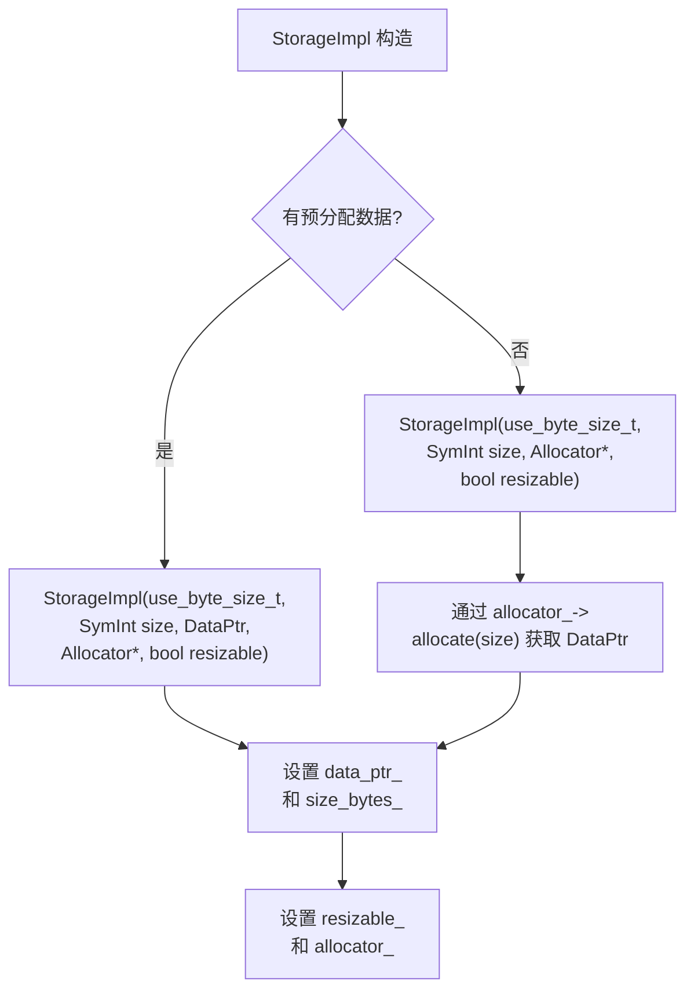

### 5.3 数据访问层级

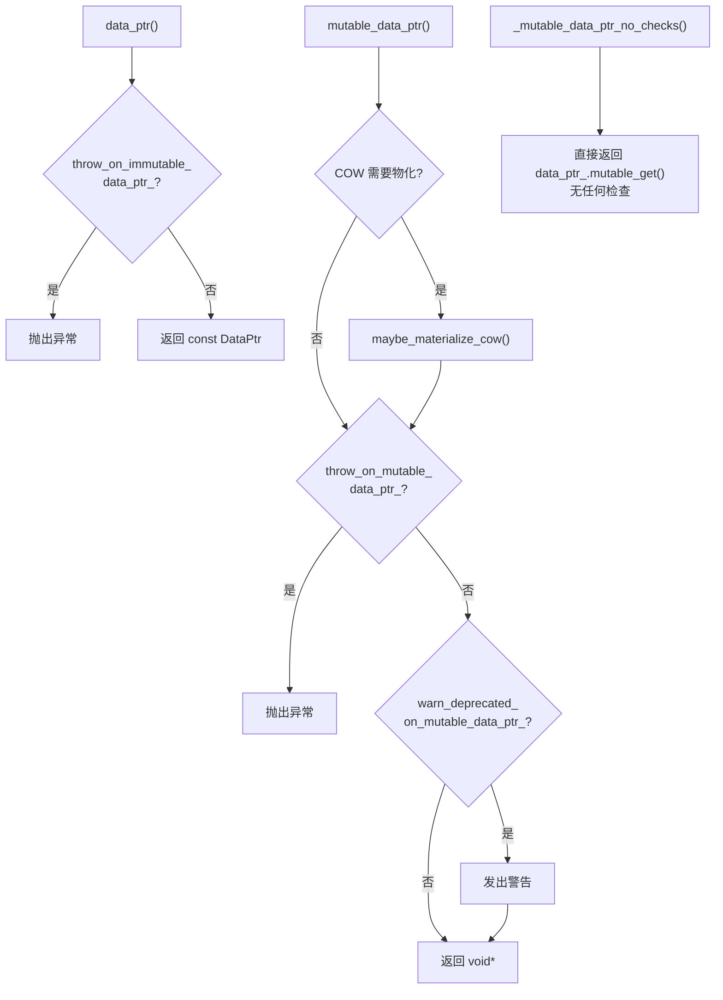

### 5.4 工厂函数

```cpp
using StorageImplCreateHelper = intrusive_ptr<StorageImpl>(*)(use_byte_size_t, SymInt, ...);

// 每种设备类型注册一个工厂函数
void SetStorageImplCreate(DeviceType, StorageImplCreateHelper);
StorageImplCreateHelper GetStorageImplCreate(DeviceType);

// 统一创建入口
intrusive_ptr<StorageImpl> make_storage_impl(use_byte_size_t, SymInt, ...);
```

---

## 6. Storage — 存储包装器

Storage 是 `intrusive_ptr<StorageImpl>` 的薄包装，提供值语义的存储接口。

### 6.1 核心

```cpp
struct C10_API Storage {
  c10::intrusive_ptr<StorageImpl> storage_impl_;
  // 所有方法均委托给 storage_impl_
};
```

### 6.2 MaybeOwned<Storage> 借用语义

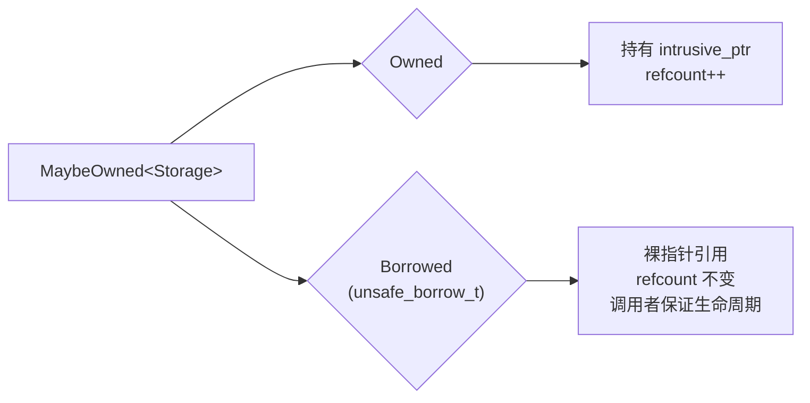

`unsafe_borrow_t` 标签构造的 `MaybeOwned<Storage>` 不增加引用计数，用于性能敏感路径中避免原子操作开销。调用者必须确保原始 Storage 在借用期间存活。

---

## 7. Allocator 与 DataPtr — 内存分配

### 7.1 DataPtr — 类型安全的内存持有者

```cpp
class DataPtr {
  c10::detail::UniqueVoidPtr ptr_;  // void* + 删除器 + 上下文
  Device device_;                    // 设备信息

  // 关键方法
  void* get() const;                // 只读访问
  void* mutable_get();              // 可变访问
  void* get_context() const;        // 获取自定义上下文
  DeleterFnPtr get_deleter() const; // 获取删除器
};
```

`UniqueVoidPtr` 将 `void*`、`DeleterFnPtr` 和自定义上下文打包，确保内存正确释放。

### 7.2 Allocator — 内存分配器基类

```cpp
class Allocator {
  virtual DataPtr allocate(size_t n) = 0;   // 纯虚：分配 n 字节
  virtual DataPtr clone(const void*, size_t); // 复制分配
  virtual bool is_simple_data_ptr(const DataPtr&); // 是否简单指针
  virtual DeleterFnPtr raw_deleter() const;  // 裸删除器
  virtual void copy_data(void* dst, const void* src, size_t count) const = 0;
};
```

### 7.3 全局分配器注册

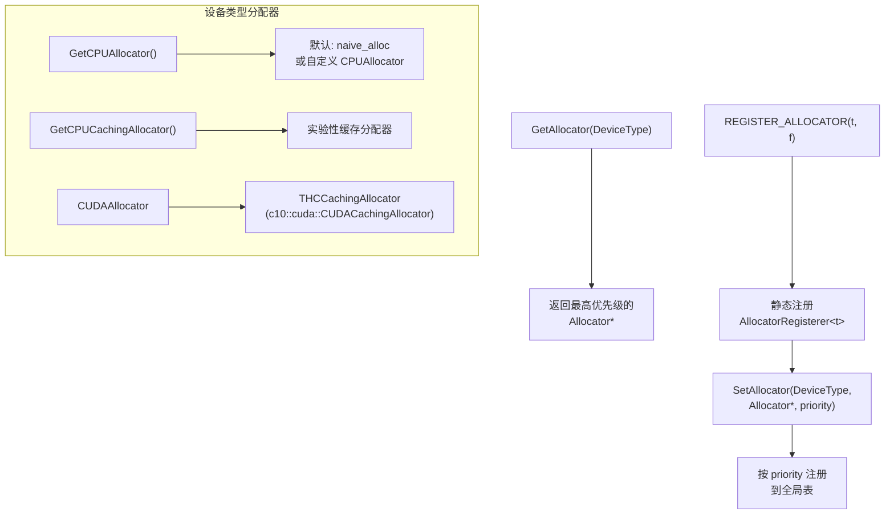

### 7.4 内存上报

```cpp
struct MemoryReportingInfoBase {
  virtual void reportMemoryUsage(void* ptr, int64_t nbytes, ...);
  virtual void reportOutOfMemory(int64_t nbytes, ...);
  virtual bool memoryProfilingEnabled();
};
```

`ProfiledCPUMemoryReporter` 实现了 CPU 内存追踪：维护 `size_table_`（指针→大小映射）和 `allocated_` 总量，支持内存分析。

---

## 8. SizesAndStrides — 形状与步长

SizesAndStrides 是一个针对小维度张量优化的紧凑容器，将 sizes 和 strides 存储在单一分配中。

### 8.1 内存布局

```
inline (dim ≤ 5):
┌─────────────────────────────────────────────────────────┐
│ size_ │ size[0] │ size[1] │ ... │ size[4] │ stride[0] │ stride[1] │ ... │ stride[4] │
│  5B   │                    5×8B                    │                        5×8B                        │
└─────────────────────────────────────────────────────────┘
                        inlineStorage_[10 × int64_t]

out-of-line (dim > 5):
┌──────────────────────────────────────────────────────────┐
│ size_ │ outOfLineStorage_ ──→ │ size[0] │ ... │ size[n-1] │ stride[0] │ ... │ stride[n-1] │
│  5B   │      8B               │          n×8B             │              n×8B               │
└──────────────────────────────────────────────────────────┘
```

### 8.2 内联优化决策

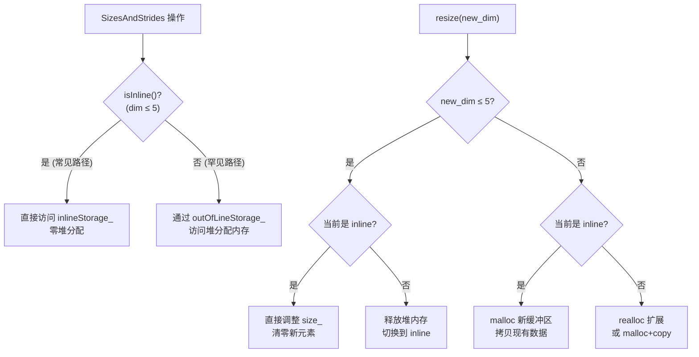

**关键常量**：`C10_SIZES_AND_STRIDES_MAX_INLINE_SIZE = 5`。选择 5 维是因为绝大多数张量（标量、1D 向量、2D 矩阵、3D 序列、4D NCHW 图像、5D NCDHW 视频）维度不超过 5。

### 8.3 访问方法

| 方法 | 返回类型 | 说明 |
|------|----------|------|
| `sizes_arrayref()` | `IntArrayRef` | 尺寸的不可变视图 |
| `strides_arrayref()` | `IntArrayRef` | 步长的不可变视图 |
| `size_at(d)` | `int64_t&` | 带边界检查的尺寸访问 |
| `stride_at(d)` | `int64_t&` | 带边界检查的步长访问 |
| `set_sizes(IntArrayRef)` | — | 设置尺寸并调整容量 |
| `set_strides(IntArrayRef)` | — | 设置步长（需与 sizes 维度一致） |
| `resize(size_t)` | — | 调整维度，可能触发 inline/out-of-line 切换 |

---

## 9. TensorImpl 核心成员与构造

### 9.1 核心成员变量

| 成员 | 类型 | 用途 |
|------|------|------|
| `storage_` | `Storage` | 底层数据缓冲区的引用 |
| `autograd_meta_` | `unique_ptr<AutogradMetaInterface>` | 自动微分元数据；null 表示无 autograd |
| `extra_meta_` | `unique_ptr<ExtraMeta>` | 扩展元数据（符号形状、命名张量、后端元数据） |
| `version_counter_` | `c10::VariableVersion` | 原地修改的版本追踪 |
| `pyobj_slot_` | `impl::PyObjectSlot` | 延迟创建的 Python 对象关联 |
| `sizes_and_strides_` | `c10::impl::SizesAndStrides` | 形状与步长（内联优化） |
| `storage_offset_` | `int64_t` | 存储偏移（元素数，非字节数） |
| `numel_` | `int64_t` | 元素总数，默认 1 |
| `data_type_` | `caffe2::TypeMeta` | 元素数据类型 |
| `device_opt_` | `optional<c10::Device>` | 设备；nullopt 仅用于未定义张量 |
| `key_set_` | `DispatchKeySet` | 所有分发键，不含 Autograd（构造时按需添加） |

### 9.2 SizesStridesPolicy 枚举

```cpp
enum SizesStridesPolicy : uint8_t {
  Default = 0,       // 密集张量行为，无覆盖
  CustomStrides = 1, // 可覆盖 strides() 和 is_contiguous()
  CustomSizes = 2,   // 还可覆盖 sizes(), dim(), numel()
};
```

此策略实现快路径/慢路径分流：热方法先检查策略位，为 `Default` 时直接返回缓存值，否则调用虚方法。

### 9.3 构造函数体系

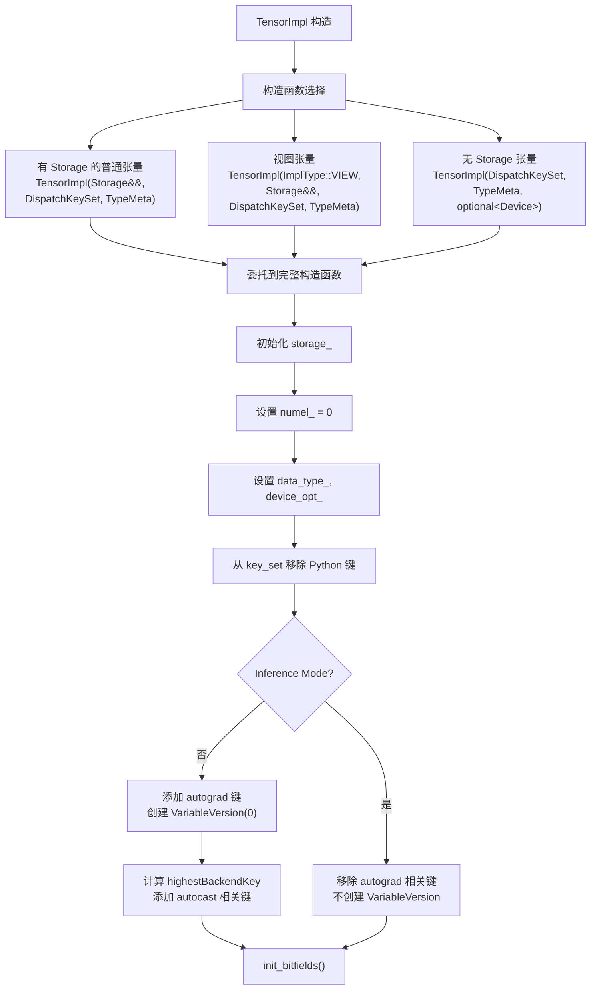

### 9.4 关键访问器方法

| 方法 | 返回 | 说明 |
|------|------|------|
| `key_set()` | `DispatchKeySet` | 返回分发键集 |
| `sizes()` | `IntArrayRef` | 检查 CustomSizes 策略后返回 |
| `sym_sizes()` | `SymIntArrayRef` | 符号化尺寸 |
| `numel()` | `int64_t` | 元素总数 |
| `dim()` | `int64_t` | 维度数 = sizes_and_strides_.size() |
| `storage_offset()` | `int64_t` | 存储偏移（元素数） |
| `strides()` | `IntArrayRef` | 步长数组 |
| `is_contiguous()` | `bool` | 检查连续性标志 |
| `layout()` | `Layout` | 从 key_set_ 推导（strided/sparse/sparse_csr/mkldnn） |
| `device()` | `Device` | 检查 device_policy_ 后返回 |
| `dtype()` | `TypeMeta` | 元素类型 |
| `has_storage()` | `bool` | 可去虚化（C10_DISABLE_TENSORIMPL_EXTENSIBILITY） |
| `storage()` | `Storage&` | 可能抛出 storage_access_should_throw_ |

### 9.5 布尔属性检查方法

| 方法 | 检查方式 |
|------|----------|
| `is_sparse()` | `key_set_.has(c10::sparse_ks)` |
| `is_sparse_csr()` | layout 检查 |
| `is_quantized()` | `key_set_.has(DispatchKey::Quantized)` |
| `is_meta()` | `device_type() == kMeta` |
| `is_cpu()` | `device_type() == kCPU` |
| `is_cuda()` | `device_type() == kCUDA` |
| `is_xpu()` | `device_type() == kXPU` |
| `is_conj()` | `key_set_.has(DispatchKey::Conjugate)` |
| `is_neg()` | `key_set_.has(DispatchKey::Negative)` |
| `_is_zerotensor()` | `key_set_.has(DispatchKey::ZeroTensor)` |
| `is_inference()` | 无 Autograd 和 ADInplaceOrView 键 |
| `is_nested()` | `key_set_.has(DispatchKey::NestedTensor)` |
| `is_python_dispatch()` | `key_set_.has(c10::python_ks)` |

---

## 10. TensorImpl 位域标志

所有布尔标志以位域形式存储，最小化内存占用。

### 10.1 完整位域表

| 标志 | 位数 | 用途 |
|------|------|------|
| `is_contiguous_` | 1 | 张量内存连续 |
| `storage_access_should_throw_` | 1 | 子类禁止 storage 访问 |
| `is_channels_last_` | 1 | Channels-last 2D 格式 (NCHW) |
| `is_channels_last_contiguous_` | 1 | Channels-last 且连续 |
| `is_channels_last_3d_` | 1 | Channels-last 3D 格式 (NCDHW) |
| `is_channels_last_3d_contiguous_` | 1 | Channels-last 3D 且连续 |
| `is_non_overlapping_and_dense_` | 1 | 元素无重叠且内存稠密 |
| `is_wrapped_number_` | 1 | 从 Python/C++ 数字自动包装 |
| `allow_tensor_metadata_change_` | 1 | 是否允许元数据修改 |
| `reserved_` | 1 | Extend/ReserveSpace 已调用 |
| `sizes_strides_policy_` | 2 | 合并策略（custom/python/symbolic 最大值） |
| `has_symbolic_sizes_strides_` | 1 | sizes/strides 含 SymInt |
| `custom_sizes_strides_` | 2 | C++ 子类自定义级别 |
| `device_policy_` | 1 | 是否调用 device_custom() |
| `layout_policy_` | 1 | 是否调用 layout_custom() |
| `custom_device_` | 1 | C++ 子类自定义设备 |
| `custom_layout_` | 1 | C++ 子类自定义布局 |
| `python_custom_sizes_strides_` | 2 | Python 级别自定义 sizes/strides |
| `python_custom_device_` | 1 | Python 级别自定义设备 |
| `python_custom_layout_` | 1 | Python 级别自定义布局 |

### 10.2 策略合并规则

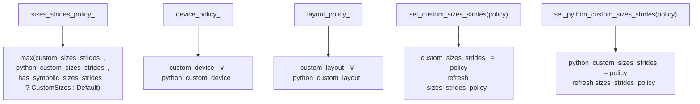

当 `sizes_strides_policy_` 为 `Default` 时，`sizes()`、`strides()` 等方法直接返回缓存值；否则调用虚方法。这是典型的快路径/慢路径模式。

---

## 11. ExtraMeta — 扩展元数据

ExtraMeta 通过 `unique_ptr` 延迟分配，仅在实际需要时才创建，避免为大多数张量增加内存开销。

### 11.1 结构

```cpp
struct ExtraMeta {
  std::unique_ptr<SymbolicShapeMeta> symbolic_shape_meta_;  // 动态形状
  std::unique_ptr<NamedTensorMetaInterface> named_tensor_meta_; // 命名维度
  intrusive_ptr<BackendMeta> backend_meta_;                  // 设备特定元数据
  std::optional<std::string> custom_data_ptr_error_msg_;     // 自定义 data_ptr 错误
  std::optional<std::string> custom_storage_error_msg_;      // 自定义 storage 错误

  ExtraMeta clone() const;  // 深拷贝
};
```

### 11.2 触发 ExtraMeta 创建的场景

| 场景 | 填充的字段 |
|------|------------|
| SymInt sizes/strides | `symbolic_shape_meta_` |
| Named tensor | `named_tensor_meta_` |
| XPU/Metal 等后端元数据 | `backend_meta_` |
| FakeTensor / Python dispatch | `custom_data_ptr_error_msg_`, `custom_storage_error_msg_` |

---

## 12. VariableVersion — 版本追踪

VariableVersion 追踪张量的原地修改次数，用于 autograd 检测无效的梯度计算。

### 12.1 结构

```cpp
struct VariableVersion {
  struct VersionCounter : intrusive_ptr_target {
    std::atomic<uint32_t> version_;
  };
  intrusive_ptr<VersionCounter> version_counter_;

  enum Disabled { DISABLED };  // 廉价构造，不分配内存
};
```

### 12.2 关键操作

| 操作 | 行为 |
|------|------|
| `VariableVersion(0)` | 分配 VersionCounter，version=0 |
| `VariableVersion(DISABLED)` | 不分配，enabled()=false |
| `bump()` | version++，检查 inference mode |
| `current_version()` | 读取当前版本 |
| `unique()` | refcount==1（可安全修改） |
| `enabled()` | version_counter_ 非空 |

### 12.3 设计要点

VariableVersion 独立于 AutogradMeta，原因：
1. 即使不需要梯度的张量也可能需要版本追踪（in-place 操作检测）
2. AutogradMeta 的创建成本更高（包含梯度、梯度函数等），而 VariableVersion 仅需一个原子计数器
3. 通过 `Disabled` 标签可零成本禁用版本追踪

---

## 13. TensorOptions — 构建器模式

TensorOptions 以 128 位打包所有张量构造参数，采用构建器模式。

### 13.1 内存布局

```
┌─────────────── 128 bits ───────────────┐
│ Device (16b) │ TypeMeta (16b) │ Layout (8b) │ MemoryFormat (8b) │
│ requires_grad (1b) │ pinned_memory (1b) │ has_device (1b) │
│ has_dtype (1b) │ has_layout (1b) │ has_requires_grad (1b) │
│ has_pinned_memory (1b) │ has_memory_format (1b) │ padding (40b) │
└────────────────────────────────────────┘
```

### 13.2 computeDispatchKey — 从选项推导分发键

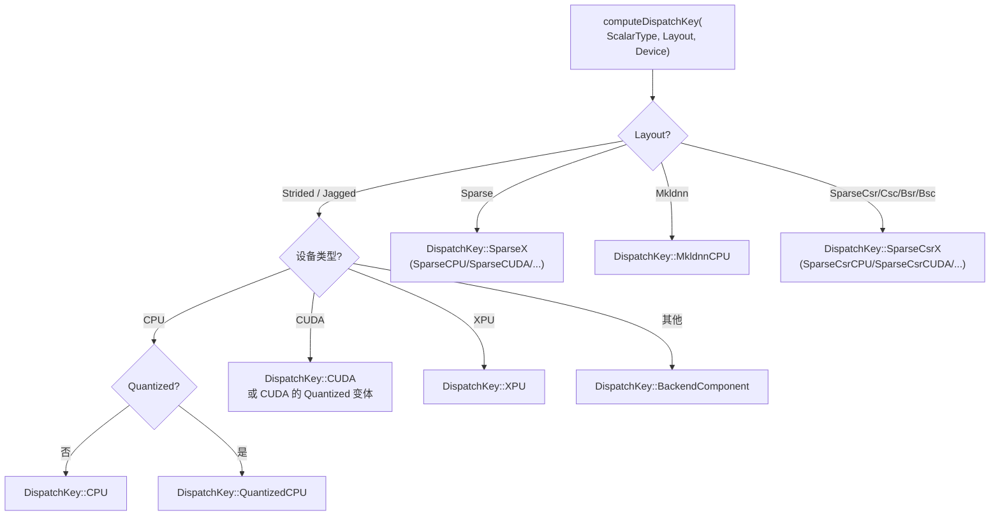

### 13.3 merge_in — 选项合并

```cpp
TensorOptions::merge_in(TensorOptions other) {
  // 右偏向合并：other 中明确设置的值覆盖 this 的值
  // 未设置的值保留 this 的值
}
```

---

## 14. ScalarType — 标量类型体系

### 14.1 类型列表

| 值 | 类型 | C++ 映射 | 类别 |
|----|------|----------|------|
| 0 | Byte | `uint8_t` | 无符号整数 |
| 1 | Char | `int8_t` | 有符号整数 |
| 2 | Short | `int16_t` | 有符号整数 |
| 3 | Int | `int32_t` | 有符号整数 |
| 4 | Long | `int64_t` | 有符号整数 |
| 5 | Half | `float16_t` | 缩减浮点 |
| 6 | Float | `float` | 标准浮点 |
| 7 | Double | `double` | 标准浮点 |
| 8 | ComplexHalf | `complex<float16_t>` | 复数 |
| 9 | ComplexFloat | `complex<float>` | 复数 |
| 10 | ComplexDouble | `complex<double>` | 复数 |
| 11 | Bool | `bool` | 布尔 |
| 12 | QInt8 | `qint8` | 量化 |
| 13 | QUInt8 | `quint8` | 量化 |
| 14 | QInt32 | `qint32` | 量化 |
| 15 | BFloat16 | `bfloat16` | 缩减浮点 |
| 16 | QUInt4x2 | `quint4x2` | 量化 |
| 17 | QUInt2x4 | `quint2x4` | 量化 |
| 18-22 | Bits1x8~Bits16 | — | 位类型 |
| 23 | Float8_e5m2 | `float8_e5m2` | FP8 |
| 24 | Float8_e4m3fn | `float8_e4m3fn` | FP8 |
| 25 | Float8_e5m2fnuz | `float8_e5m2fnuz` | FP8 |
| 26 | Float8_e4m3fnuz | `float8_e4m3fnuz` | FP8 |
| 27 | UInt16 | `uint16_t` | 无符号整数 |
| 28 | UInt32 | `uint32_t` | 无符号整数 |
| 29 | UInt64 | `uint64_t` | 无符号整数 |
| 30-36 | UInt1~UInt7 | — | Python 实现 |
| 37-43 | Int1~Int7 | — | Python 实现 |

### 14.2 类型分类函数

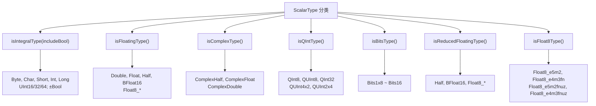

### 14.3 类型提升

`promoteTypes(a, b)` 实现类型提升规则：
- 复数 + 非复数 → 复数
- 高精度 + 低精度 → 高精度
- 量化类型有专门提升规则
- 类型转换限制：`canCast()` 禁止 complex→non-complex、float→integral、non-bool→bool

---

## 15. 分发键集构建

TensorImpl 构造时，分发键集的构建遵循严格的步骤。

### 15.1 键集构建流程

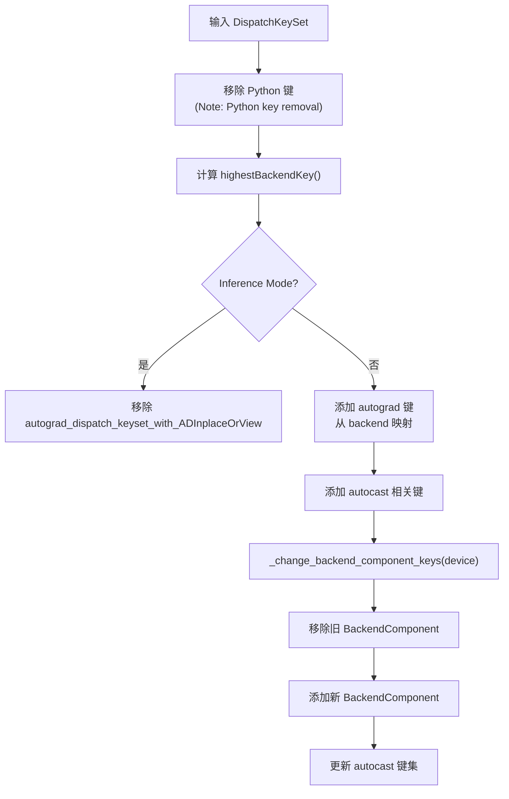

### 15.2 Autograd 键添加规则

| 后端 | 添加的 Autograd 键 |
|------|---------------------|
| CPU | `AutogradCPU`, `ADInplaceOrView` |
| CUDA | `AutogradCUDA`, `ADInplaceOrView` |
| XPU | `AutogradXPU`, `ADInplaceOrView` |
| Meta | 无额外 Autograd 键 |
| 其他 | `AutogradOther`, `ADInplaceOrView` |

### 15.3 _change_backend_component_keys — 后端切换

```cpp
void TensorImpl::_change_backend_component_keys(c10::Device device) {
  // 1. 获取当前后端键
  auto old_keys = key_set_.backend_key();
  // 2. 移除旧后端键
  key_set_ = key_set_ - old_keys;
  // 3. 从 device 推导新后端键
  auto new_backend = backendComponentDispatchKey(device.type());
  key_set_ = key_set_ | DispatchKeySet(new_backend);
  // 4. 更新 autocast 相关键
  // ...
}
```

此方法用于张量在不同设备间迁移时更新分发键。

---

## 16. 连续性计算

TensorImpl 缓存多种连续性标志，在 sizes/strides 变化时重新计算。

### 16.1 连续性类别

| 标志 | 含义 |
|------|------|
| `is_contiguous_` | 标准 C 连续（行主序） |
| `is_channels_last_contiguous_` | NCHW channels-last 且内存连续 |
| `is_channels_last_3d_contiguous_` | NCDHW channels-last 3D 且连续 |
| `is_channels_last_` | NCHW channels-last 步长模式（可能不连续） |
| `is_channels_last_3d_` | NCDHW channels-last 步长模式 |
| `is_non_overlapping_and_dense_` | 无重叠且稠密 |

### 16.2 连续性判定算法

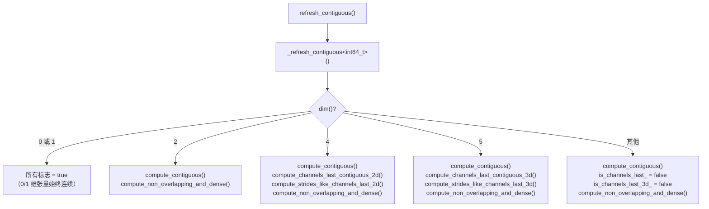

### 16.3 compute_contiguous 算法

```
从最内层维度向外检查：
  expected_stride = 1
  for d from (dim-1) down to 0:
    if size[d] != 1:  // size=1 的维度步长无关紧要
      if stride[d] != expected_stride:
        return false
      expected_stride *= size[d]
  return true
```

### 16.4 channels-last 2D 步长判定

对于 4D 张量 (N, C, H, W)，channels-last 的步长模式为：
```
stride[3] = 1          (W)
stride[2] = W          (H)
stride[1] = W*H        (C) — 注意：C 维步长 < N 维步长
stride[0] = C*W*H      (N)
```

关键特征：`stride[C维度] < stride[N维度]`，即通道维度的步长小于批量维度。

---

## 17. 浅拷贝与元数据复制

浅拷贝创建一个新的 TensorImpl，共享底层 Storage，但拥有独立的元数据。

### 17.1 shallow_copy_and_detach 流程

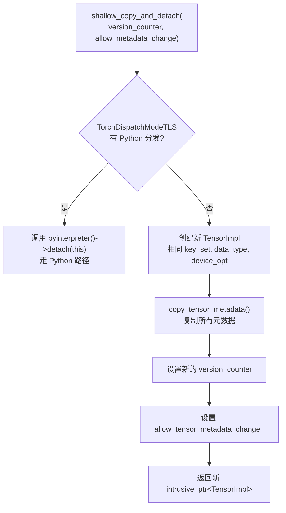

### 17.2 元数据复制层次

| 方法 | 复制的内容 | 不复制的内容 |
|------|------------|--------------|
| `copy_tensor_metadata()` | 全部元数据 + storage + key_set 合并 | version_counter |
| `copy_generic_tensor_metadata()` | sizes, strides, offset, dtype, device, contiguity flags, numel, extra_meta (clone) | key_set, storage, storage_access_should_throw_, sizes_strides_policy_, version_counter, allow_metadata_change |
| `copy_tensor_metadata_except_version_counter()` | generic + storage + key_set 合并 + allow_metadata_change | version_counter |

### 17.3 key_set 合并规则

```cpp
// 合并时保留目标（dest）的 Python 键
auto merged_keys = (src_key_set - c10::python_ks) |
                   (dest_key_set & c10::python_ks);
```

---

## 18. COW 写时复制

StorageImpl 支持 Copy-On-Write 语义，允许多个张量共享同一存储，仅在需要可变访问时才复制。

### 18.1 COW 流程

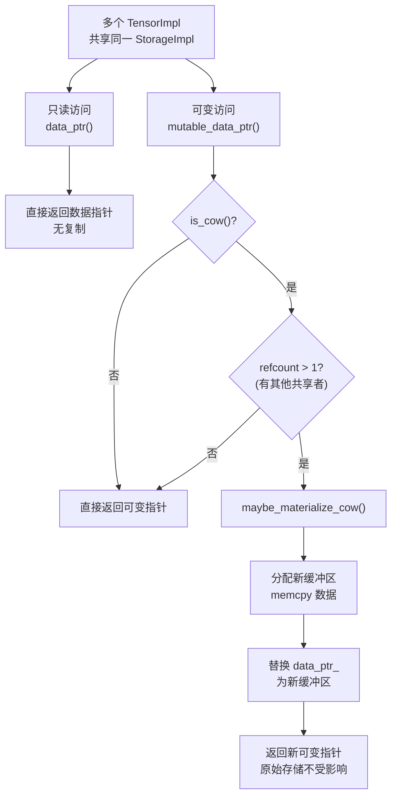

### 18.2 COW DataPtr 识别

`c10::impl::cow::is_cow_data_ptr()` 检查 DataPtr 的删除器是否为 COW 专用删除器。COW DataPtr 使用特殊的上下文结构追踪共享状态。

---

## 19. 张量生命周期流程

### 19.1 张量创建

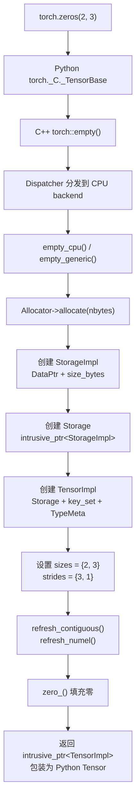

### 19.2 张量视图

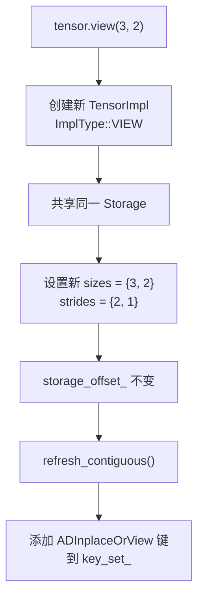

### 19.3 张量销毁

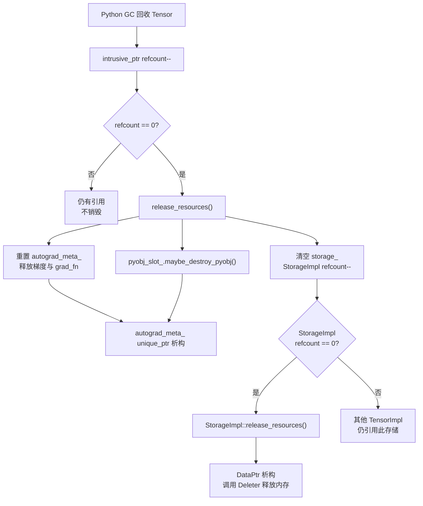

---

## 20. 设计权衡

### 20.1 侵入式引用计数 vs std::shared_ptr

| 方面 | intrusive_ptr | shared_ptr |
|------|--------------|------------|
| 控制块 | 内嵌在对象中 | 单独堆分配 |
| 内存开销 | 零额外开销 | 一个控制块（~32 bytes） |
| 缓存友好性 | 更好（计数与数据相邻） | 更差（控制块可能在不同缓存行） |
| 自定义 | release_resources() 可控 | 析构顺序不可定制 |
| 代价 | 侵入性（必须继承基类） | 非侵入性（任意类型） |

### 20.2 内联 sizes/strides 优化

- **收益**：5 维以内张量零堆分配，减少内存碎片和分配延迟
- **代价**：代码复杂度增加（inline/out-of-line 双路径）
- **数据**：实际生产中 >99% 的张量维度 ≤ 5

### 20.3 位域标志压缩

- **收益**：400M 活跃张量时，每 64 位字节省 3.2GB RAM
- **代价**：位域访问比普通 bool 慢（需要位操作）；不可取地址
- **取舍**：内存节省远大于访问延迟

### 20.4 延迟分配的 ExtraMeta

- **收益**：大多数张量不需要符号形状、命名张量等，避免无效内存
- **代价**：需要 extra_meta_ 指针本身（8 bytes）和间接访问
- **替代方案**：所有字段直接内嵌 → 不可接受的增加基础张量大小

### 20.5 VariableVersion 独立于 AutogradMeta

- **收益**：不需要梯度的张量也能追踪版本，无需创建 AutogradMeta
- **代价**：VariableVersion 始终占用 `intrusive_ptr<VersionCounter>` （8 bytes），即使禁用
- **替代方案**：将版本计数放入 AutogradMeta → 无法为非梯度张量提供版本追踪

### 20.6 COW 存储

- **收益**：视图张量零拷贝共享存储，可变访问时才复制
- **代价**：每次 mutable_data_ptr() 需要检查 COW 状态
- **权衡**：用少量检查开销换取大量共享场景的内存节省

---

## 附录：关键代码行号参考

| 内容 | 文件 | 行号 |
|------|------|------|
| TensorImpl 类声明 | `c10/core/TensorImpl.h` | 509 |
| SizesStridesPolicy 枚举 | `c10/core/TensorImpl.h` | 930-944 |
| ImplType 枚举 | `c10/core/TensorImpl.h` | 518 |
| 核心成员变量表 | `c10/core/TensorImpl.h` | 2841-3024 |
| 位域标志 | `c10/core/TensorImpl.h` | 2930-3016 |
| ExtraMeta 结构 | `c10/core/TensorImpl.h` | 238-284 |
| VariableVersion 结构 | `c10/core/TensorImpl.h` | 327-417 |
| 构造函数 | `c10/core/TensorImpl.cpp` | 79-178 |
| _change_backend_component_keys | `c10/core/TensorImpl.cpp` | 180-197 |
| 连续性计算 | `c10/core/TensorImpl.cpp` | 221-274 |
| release_resources | `c10/core/TensorImpl.cpp` | 276-282 |
| set_sizes_and_strides (SymInt) | `c10/core/TensorImpl.cpp` | 846-886 |
| shallow_copy_and_detach_core | `c10/core/TensorImpl.cpp` | 488-524 |
| copy_generic_tensor_metadata | `c10/core/TensorImpl.cpp` | 551-590 |
| intrusive_ptr_target | `c10/util/intrusive_ptr.h` | 60-180 |
| intrusive_ptr | `c10/util/intrusive_ptr.h` | 229-583 |
| weak_intrusive_ptr | `c10/util/intrusive_ptr.h` | 685-940 |
| StorageImpl 成员 | `c10/core/StorageImpl.h` | 326-345 |
| SizesAndStrides | `c10/core/impl/SizesAndStrides.h` | 23-315 |
| TensorOptions | `c10/core/TensorOptions.h` | 134 |
| computeDispatchKey | `c10/core/TensorOptions.h` | 629-719 |
| ScalarType 枚举 | `c10/core/ScalarType.h` | 151-157 |
