# 04 - DispatchKey 分发键体系

> DispatchKey 是 PyTorch 调度器的核心抽象，定义了算子调用的分层路由机制。
> 每个 DispatchKey 代表一种功能层（如 Autograd、Quantized、Sparse），
> 调度器按照固定优先级从高到低逐层查找注册的内核函数。

---

## 目录

1. [架构概览](#1-架构概览)
2. [DispatchKey 枚举定义](#2-dispatchkey-枚举定义)
3. [BackendComponent — 后端组件](#3-backendcomponent--后端组件)
4. [功能键分类体系](#4-功能键分类体系)
5. [每后端功能键生成](#5-每后端功能键生成)
6. [别名键](#6-别名键)
7. [DispatchKeySet 位集](#7-dispatchkeyset-位集)
8. [键集操作语义](#8-键集操作语义)
9. [优先级与最高键提取](#9-优先级与最高键提取)
10. [分发表索引计算](#10-分发表索引计算)
11. [DispatchKeyExtractor — 键集提取](#11-dispatchkeyextractor--键集提取)
12. [重要常量键集](#12-重要常量键集)
13. [Autograd 键与后端映射](#13-autograd-键与后端映射)
14. [Autocast 键体系](#14-autocast-键体系)
15. [Autograd 未实现回退](#15-autograd-未实现回退)
16. [分发键集构建完整流程](#16-分发键集构建完整流程)
17. [设计权衡](#17-设计权衡)

---

## 1. 架构概览

DispatchKey 体系将算子调度划分为多个功能层，每层可按后端独立实现：

```mermaid
flowchart TD
    subgraph "调度层 (优先级从高到低)"
        L1["PreDispatch / PythonDispatcher"]
        L2["Functorch 层 (DynamicLayerFront, Batched, Vmap, GradWrapper...)"]
        L3["Autocast 层 (AutocastCPU/CUDA/XPU/...)"]
        L4["Autograd 层 (AutogradCPU/CUDA/..., AutogradOther, ADInplaceOrView)"]
        L5["变换层 (ZeroTensor, Negative, Conjugate, Named, Functionalize)"]
        L6["Fake / Python / BackendSelect"]
        L7["NestedTensor / SparseCsr / Sparse"]
        L8["Quantized"]
        L9["非可扩展后端 (MkldnnCPU, Metal, Vulkan, FPGA, MAIA)"]
        L10["Dense 后端 (CPU, CUDA, XPU, HIP, Meta, ...)"]
    end
    L1 --> L2 --> L3 --> L4 --> L5 --> L6 --> L7 --> L8 --> L9 --> L10
```

**关键文件索引**：

| 组件 | 文件 |
|------|------|
| DispatchKey 枚举 | `c10/core/DispatchKey.h` |
| DispatchKeySet | `c10/core/DispatchKeySet.h` |
| DispatchKeyExtractor | `aten/src/ATen/core/dispatch/DispatchKeyExtractor.h` |
| OperatorEntry/分发表 | `aten/src/ATen/core/dispatch/OperatorEntry.h` |
| Autograd 回退 | `torch/csrc/autograd/autograd_not_implemented_fallback.cpp` |

---

## 2. DispatchKey 枚举定义

`DispatchKey` 是 `uint16_t` 枚举，按区间划分为五个段：

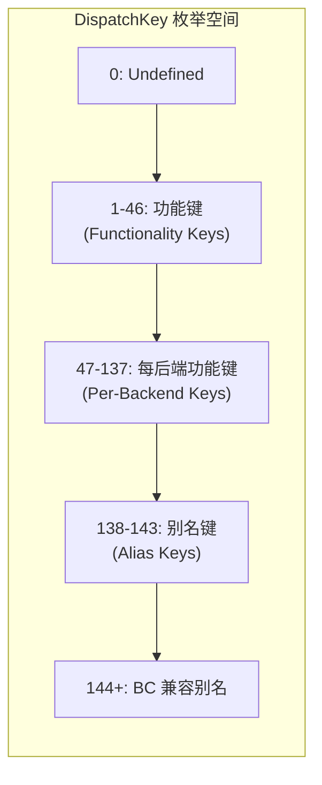

### 2.1 功能键完整列表

| 数值 | 名称 | 类别 | 说明 |
|------|------|------|------|
| 0 | Undefined | 特殊 | 空键集 |
| 1 | Dense | 每后端功能 | 密集张量构建块键 |
| 2 | FPGA | 非可扩展后端 | FPGA 加速 |
| 3 | MAIA | 非可扩展后端 | 树外后端 |
| 4 | Vulkan | 非可扩展后端 | GPU 计算 |
| 5 | Metal | 非可扩展后端 | Apple GPU |
| 6 | Quantized | 每后端功能 | 量化构建块键 |
| 7 | CustomRNGKeyId | 非可扩展功能 | 自定义随机数生成器 |
| 8 | MkldnnCPU | 非可扩展后端 | MKL-DNN 布局 |
| 9 | Sparse | 每后端功能 | 稀疏构建块键 |
| 10 | SparseCsr | 每后端功能 | CSR 稀疏构建块键 |
| 11 | NestedTensor | 每后端功能 | 嵌套张量构建块键 |
| 12 | BackendSelect | 功能 | 非张量参数的后端选择 |
| 13 | Python | 功能 | Python 解释器分发 |
| 14 | Fake | 功能 | torchdistx fake tensor |
| 15 | FuncTorchDynamicLayerBackMode | 功能 | functorch 动态层后插入 |
| 16 | Functionalize | 功能 | 别名与变异消除 |
| 17 | Named | 功能 | 命名维度（错误信息） |
| 18 | Conjugate | 功能 | 共轭变换 |
| 19 | Negative | 功能 | 取反变换 |
| 20 | ZeroTensor | 功能 | 零张量处理 |
| 21 | ADInplaceOrView | 功能 | 原地版本号 / 视图设置 |
| 22 | AutogradOther | Autograd | 无专用键的后端的 catch-all |
| 23 | AutogradFunctionality | 每后端功能 | Autograd 构建块键 |
| 24 | AutogradNestedTensor | Autograd | NestedTensor autograd 覆盖 |
| 25 | Tracer | 功能 | JIT 追踪器 |
| 26-33 | AutocastCPU...AutocastPrivateUse1 | Autocast | 各后端自动混合精度 |
| 34 | FuncTorchBatched | 包装器 | vmap+grad 原型 |
| 35 | BatchedNestedTensor | 包装器 | 批量化嵌套张量 |
| 36 | FuncTorchVmapMode | 包装器 | vmap 模式 |
| 37 | Batched | 包装器 | BatchedTensorImpl |
| 38 | VmapMode | 包装器 | vmap 内部分发 |
| 39 | FuncTorchGradWrapper | 包装器 | functorch grad |
| 40 | DeferredInit | 包装器 | 延迟初始化 |
| 41 | PythonTLSSnapshot | 包装器 | TLS 快照 |
| 42 | FuncTorchDynamicLayerFrontMode | 包装器 | 调度器最前端 |
| 43 | TESTING_ONLY_GenericWrapper | 测试 | 通用测试包装器 |
| 44 | TESTING_ONLY_GenericMode | 测试 | 通用测试模式 |
| 45 | PreDispatch | 预调度 | make_fx 预调度追踪 |
| 46 | PythonDispatcher | 预调度 | 完全绕过 C++ 调度器 |
| 47 | EndOfFunctionalityKeys | 哨兵 | 功能键结束标记 |

---

## 3. BackendComponent — 后端组件

`BackendComponent` 枚举（`uint8_t`）定义了 DispatchKeySet 的低位部分，代表物理或逻辑后端。

| 位位置 | 名称 | 说明 |
|--------|------|------|
| 0 | InvalidBit | 空值 |
| 1 | CPUBit | CPU 后端 |
| 2 | CUDABit | NVIDIA CUDA |
| 3 | HIPBit | AMD ROCm/HIP |
| 4 | XLABit | Google XLA (TPU) |
| 5 | MPSBit | Apple Metal Performance Shaders |
| 6 | IPUBit | Graphcore IPU |
| 7 | XPUBit | Intel XPU (oneAPI) |
| 8 | HPUBit | Habana Gaudi HPU |
| 9 | VEBit | NEC SX-Aurora VE |
| 10 | LazyBit | Lazy Tensor (延迟执行) |
| 11 | MTIABit | Meta 内部 MTIA |
| 12 | PrivateUse1Bit | 用户自定义后端 1 |
| 13 | PrivateUse2Bit | 用户自定义后端 2 |
| 14 | PrivateUse3Bit | 用户自定义后端 3 |
| 15 | MetaBit | 元张量（形状推断） |

**关键约束**：
- Meta 必须在最后（位 15），确保 TLS 中的 meta 键能正确触发 meta 内核
- 最多 16 个后端（4 位编码）
- `EndOfBackendKeys = MetaBit = 15`

---

## 4. 功能键分类体系

DispatchKey 分为五大类别，每类的行为不同：

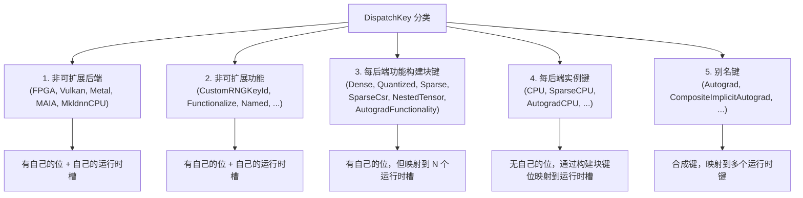

### 4.1 类别行为对比

| 类别 | 有独立位? | 有运行时槽? | 示例 |
|------|-----------|-------------|------|
| 非可扩展后端 | 是 | 1 个 | FPGA, Vulkan |
| 非可扩展功能 | 是 | 1 个 | Functionalize, Named |
| 每后端功能构建块 | 是 | N 个（每后端一个） | Dense, Sparse |
| 每后端实例 | 否 | 1 个 | CPU, SparseCPU |
| 别名 | 否 | 0 个（扩展为多个） | Autograd |

### 4.2 判断函数

```cpp
bool isPerBackendFunctionalityKey(DispatchKey k);  // Dense, Quantized, Sparse, SparseCsr, AutogradFunctionality, NestedTensor
bool isAliasDispatchKey(DispatchKey k);             // StartOfAliasKeys <= k <= EndOfAliasKeys
```

---

## 5. 每后端功能键生成

6 个构建块键各自生成 15 个每后端实例键（一个 BackendComponent 一个）：

| 构建块键 | 前缀 | 生成范围 | 示例 |
|-----------|------|----------|------|
| Dense | (无) | StartOfDenseBackends ~ EndOfDenseBackends | CPU, CUDA, XPU, Meta |
| Quantized | Quantized | StartOfQuantizedBackends ~ EndOfQuantizedBackends | QuantizedCPU, QuantizedCUDA |
| Sparse | Sparse | StartOfSparseBackends ~ EndOfSparseBackends | SparseCPU, SparseCUDA |
| SparseCsr | SparseCsr | StartOfSparseCsrBackends ~ EndOfSparseCsrBackends | SparseCsrCPU, SparseCsrCUDA |
| NestedTensor | NestedTensor | StartOfNestedTensorBackends ~ EndOfNestedTensorBackends | NestedTensorCPU, NestedTensorCUDA |
| AutogradFunctionality | Autograd | StartOfAutogradFunctionalityBackends ~ EndOfAutogradFunctionalityBackends | AutogradCPU, AutogradCUDA |

### 5.1 键间转换函数

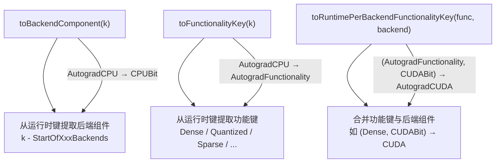

---

## 6. 别名键

别名键是合成键，不占 DispatchKeySet 的位，扩展为多个运行时键：

| 别名键 | 扩展为 | 用途 |
|--------|--------|------|
| Autograd | 所有 AutogradCPU/CUDA/... + AutogradOther + AutogradNestedTensor | 注册到所有后端的 autograd |
| CompositeImplicitAutograd | 按最低后端分发 | 不需要显式 autograd 的组合算子 |
| CompositeImplicitAutogradNestedTensor | 类似上，支持 NestedTensor | 组合算子（NestedTensor 变体） |
| CompositeExplicitAutograd | Dense 后端分发 | 需要显式 autograd 处理的组合算子 |
| CompositeExplicitAutogradNonFunctional | 同上，非函数式 | 非函数式组合算子 |
| FuncTorchBatchedDecomposition | — | functorch 批量分解 |

### 6.1 BC 兼容别名

| 旧名称 | 映射到 |
|--------|--------|
| CPUTensorId | CPU |
| CUDATensorId | CUDA |
| DefaultBackend | CompositeExplicitAutograd |
| PrivateUse1_PreAutograd | AutogradPrivateUse1 |
| PrivateUse2_PreAutograd | AutogradPrivateUse2 |
| PrivateUse3_PreAutograd | AutogradPrivateUse3 |
| Autocast | AutocastCUDA |

---

## 7. DispatchKeySet 位集

`DispatchKeySet` 是一个 64 位位集，编码了张量的所有分发键。

### 7.1 位布局

```
 63                                                          0
┌──────────────────────────────────────────────────────────────┐
│     功能键位 (bits 15+)        │   后端组件位 (bits 0-14)     │
│  Dense|Quantized|Sparse|...    │  CPU|CUDA|HIP|...|Meta      │
│  每个功能键占 1 位              │  每个后端组件占 1 位          │
└──────────────────────────────────────────────────────────────┘
```

- **位 0-14**：BackendComponent 位（CPUBit=位1, CUDABit=位2, ..., MetaBit=位15）
- **位 15+**：Functionality 键位（Dense=位15, FPGA=位16, ...）

### 7.2 键到位的映射

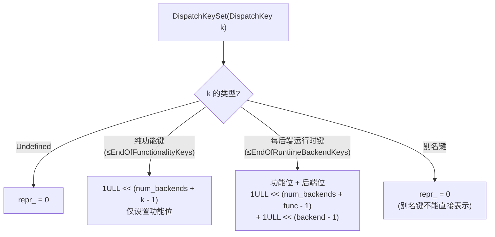

### 7.3 关键示例

| 键集内容 | 位表示 |
|----------|--------|
| `{CPU}` | 后端位[1] + 功能位[Dense] |
| `{CUDA, AutogradCUDA}` | 后端位[2] + 功能位[Dense] + 功能位[AutogradFunctionality] |
| `{SparseCPU}` | 后端位[1] + 功能位[Sparse] |
| `{AutogradOther}` | 功能位[AutogradOther]（无后端位） |

---

## 8. 键集操作语义

### 8.1 基本操作

| 操作 | 语义 | 注意事项 |
|------|------|----------|
| `has(k)` | 测试键是否在集合中 | 断言 k != Undefined |
| `has_backend(b)` | 测试后端位是否设置 | — |
| `has_all(ks)` | ks 的所有位都在此集合中 | — |
| `has_any(ks)` | ks 的任一位在此集合中 | 不允许混合后端位与每后端功能位 |
| `add(k)` | 添加键 | 返回新集合 |
| `remove(k)` | 移除键的功能位 | 后端位不受影响 |
| `remove_backend(b)` | 移除指定后端位 | — |

### 8.2 集合运算

| 运算符 | 语义 | 关键细节 |
|--------|------|----------|
| `a \| b` | 并集 | 功能位和后端位都取并 |
| `a & b` | 交集 | 功能位和后端位都取交 |
| `a - b` | 差集 | **仅移除功能位，后端位始终保留** |
| `a ^ b` | 对称差 | 功能位取对称差 |

### 8.3 差集操作的特殊语义

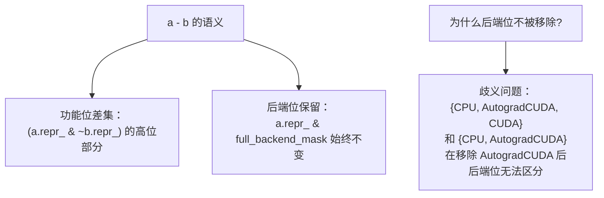

这是一个关键设计决策：`operator-` 只移除功能位，后端位始终保留。这避免了键集表示的歧义。

---

## 9. 优先级与最高键提取

调度器从高位到低位查找，优先级由位位置决定。

### 9.1 最高键提取方法

| 方法 | 返回 | 算法 |
|------|------|------|
| `highestFunctionalityKey()` | `DispatchKey` | 找 repr_ 的 MSB，减去 num_backends 得功能键 |
| `highestBackendKey()` | `BackendComponent` | 取 repr_ & full_backend_mask 的 MSB |
| `highestPriorityTypeId()` | `DispatchKey` | 合并最高功能 + 最高后端 |

### 9.2 highestPriorityTypeId 算法

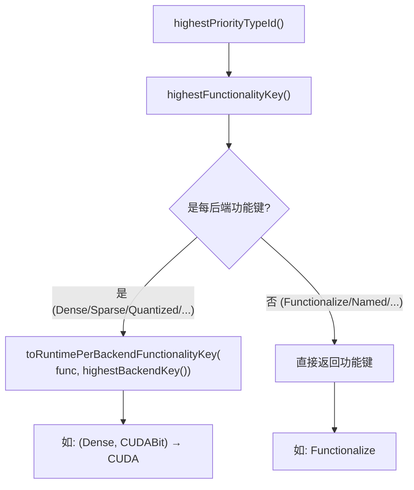

### 9.3 完整优先级顺序（从高到低）

```
PythonDispatcher > PreDispatch >
TESTING_ONLY_GenericMode > TESTING_ONLY_GenericWrapper >
FuncTorchDynamicLayerFrontMode > PythonTLSSnapshot >
DeferredInit > FuncTorchGradWrapper > VmapMode > Batched >
FuncTorchVmapMode > BatchedNestedTensor > FuncTorchBatched >
AutocastPrivateUse1 > AutocastCUDA > AutocastMPS > AutocastXLA >
  AutocastHPU > AutocastIPU > AutocastXPU > AutocastCPU >
Tracer > AutogradNestedTensor >
AutogradPrivateUse3 > ... > AutogradCUDA > AutogradCPU >
AutogradOther > ADInplaceOrView >
ZeroTensor > Negative > Conjugate > Named > Functionalize >
FuncTorchDynamicLayerBackMode > Fake > Python > BackendSelect >
NestedTensor_(per backend) > SparseCsr_(per backend) > Sparse_(per backend) >
MkldnnCPU > CustomRNGKeyId > Quantized_(per backend) >
Metal > Vulkan > MAIA > FPGA >
Dense_(per backend: Meta > ... > CUDA > CPU)
```

**同功能层内后端优先级**：Meta > PrivateUse3 > ... > CUDA > CPU（BackendComponent 枚举值越大优先级越高）。

---

## 10. 分发表索引计算

分发表是一个扁平数组，索引由功能位和后端位联合计算。

### 10.1 索引计算流程

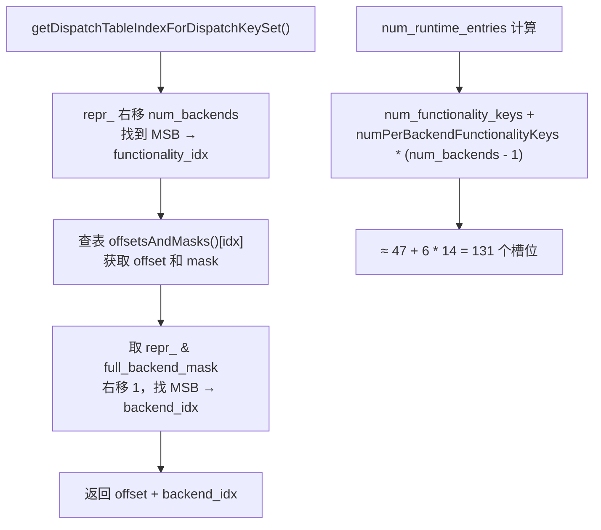

### 10.2 FunctionalityOffsetAndMask 结构

```cpp
struct FunctionalityOffsetAndMask {
    uint16_t offset;  // 在分发表中的起始偏移
    uint16_t mask;    // 后端位的掩码
};
```

每个每后端功能键占用一段连续的槽位（offset 到 offset + num_backends - 1），非每后端功能键只占单个槽位。

### 10.3 Mobile 优化

移动端仅分配 8 个分发表条目，通过 switch-case 直接映射，大幅减少内存占用。

---

## 11. DispatchKeyExtractor — 键集提取

DispatchKeyExtractor 从算子调用的参数中提取 DispatchKeySet。

### 11.1 核心公式

```
最终键集 = ((张量参数键集 | TLS包含键集) - TLS排除键集) & 非直通键掩码
```

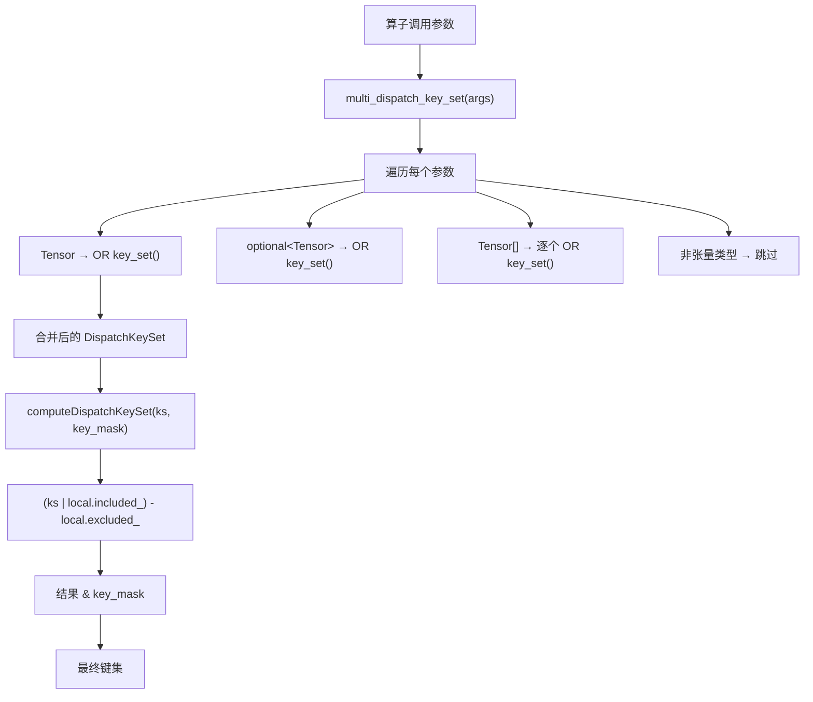

### 11.2 MultiDispatchKeySet 参数处理

| 参数类型 | 处理方式 |
|----------|----------|
| `Tensor` | OR `x.key_set()` |
| `optional<Tensor>` | 有值时 OR key_set() |
| `ArrayRef<Tensor>` | 逐个 OR |
| `List<optional<Tensor>>` | 逐个有值时 OR |
| `ITensorListRef` | 结构化张量列表 |
| `Generator` | OR `g.key_set()` |
| 其他类型 | 无操作 |

### 11.3 DispatchKeyExtractor 类

| 成员 | 用途 |
|------|------|
| `dispatch_arg_indices_reverse_` | 标记哪些参数位置是张量（逆序位集，适配栈访问） |
| `nonFallthroughKeys_` | 非直通功能键集合（快速路径，单一集合） |
| `nonFallthroughKeysPerBackend_` | 每后端的非直通键集（慢速路径，当不同后端直通状态不同时使用） |
| `requiresBitsetPerBackend_` | 是否需要使用每后端慢路径 |

### 11.4 直通键掩码

如果一个算子在某个功能键层注册了直通（fallthrough）内核，该层不会参与键集提取，从而跳过不必要的调度层。`nonFallthroughKeys_` 就是排除了所有直通层后的键集掩码。

---

## 12. 重要常量键集

### 12.1 核心常量

| 常量 | 定义 | 用途 |
|------|------|------|
| `autograd_dispatch_keyset` | `{AutogradFunctionality, AutogradOther, AutogradNestedTensor}` | 所有 autograd 功能位 |
| `autocast_dispatch_keyset` | 所有 Autocast 键 | 所有自动混合精度键 |
| `default_included_set` | `{BackendSelect, ADInplaceOrView}` | 始终包含的分发键 |
| `default_excluded_set` | 所有 Autocast 键 | 默认排除的键 |
| `autograd_dispatch_keyset_with_ADInplaceOrView` | autograd + ADInplaceOrView | autograd + 原地/视图 |
| `after_autograd_keyset` | `FULL_AFTER(AutogradOther)` | autograd 层之后的所有键 |
| `after_ADInplaceOrView_keyset` | `FULL_AFTER(ADInplaceOrView)` | ADInplaceOrView 之后的所有键 |
| `after_func_keyset` | `FULL_AFTER(Functionalize).remove(ADInplaceOrView)` | 功能化之后的键 |
| `functorch_transforms_ks` | `{FuncTorchBatched, FuncTorchVmapMode, Batched, VmapMode, FuncTorchGradWrapper}` | 所有 functorch 键 |
| `backend_functionality_keys` | `{Dense, Quantized, Sparse, SparseCsr} \| full_backend_mask` | 后端功能位 + 所有后端位 |

### 12.2 FULL_AFTER 宏语义

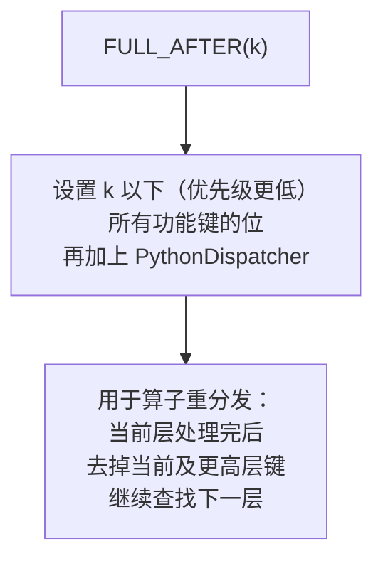

---

## 13. Autograd 键与后端映射

### 13.1 后端到 Autograd 键的映射

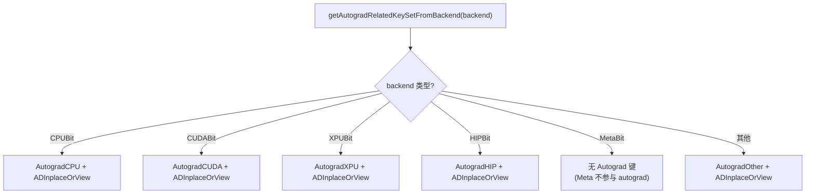

### 13.2 AutogradOther 的后端集合

`autogradother_backends` 包含所有没有专用 Autograd 键的后端和功能：
```
{FPGA, MAIA, Vulkan, Metal, CustomRNGKeyId, MkldnnCPU, Sparse, SparseCsr, Quantized}
| full_backend_mask
```

这些后端的张量使用 AutogradOther 作为 catch-all autograd 键。

---

## 14. Autocast 键体系

Autocast 键为每种后端提供独立的自动混合精度分发：

| Autocast 键 | 对应后端 |
|-------------|----------|
| AutocastCPU | CPU |
| AutocastCUDA | CUDA |
| AutocastXPU | XPU |
| AutocastIPU | IPU |
| AutocastHPU | HPU |
| AutocastXLA | XLA |
| AutocastMPS | MPS |
| AutocastPrivateUse1 | PrivateUse1 |

### 14.1 后端到 Autocast 键映射

```cpp
DispatchKeySet getAutocastRelatedKeySetFromBackend(BackendComponent t);
// CPUBit → {AutocastCPU}
// CUDABit → {AutocastCUDA}
// 未识别后端 → 空集
```

---

## 15. Autograd 未实现回退

当算子没有注册 autograd 内核时，使用回退机制。

### 15.1 回退模式

| 模式 | 行为 |
|------|------|
| `Nothing` | 静默跳过 autograd |
| `Warn` | 反向传播时发出警告（默认） |

### 15.2 basicAutogradNotImplementedFallbackImpl 流程

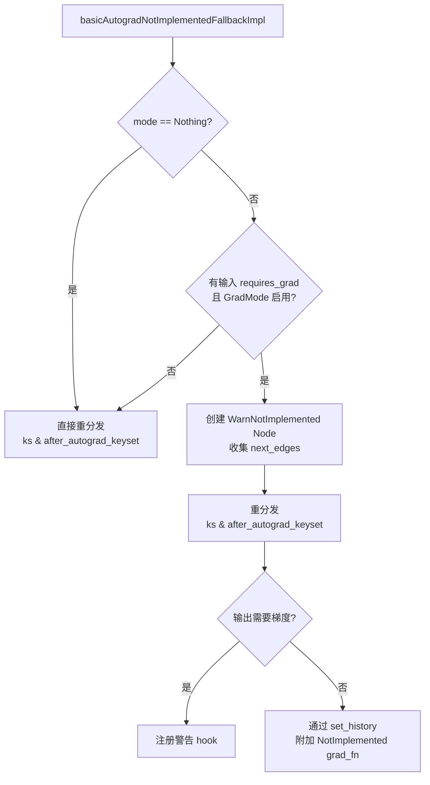

### 15.3 autogradNotImplementedFallbackImpl 完整流程

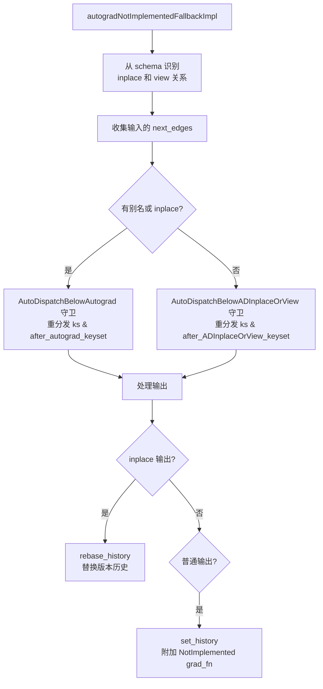

### 15.4 ADInplaceOrView 回退

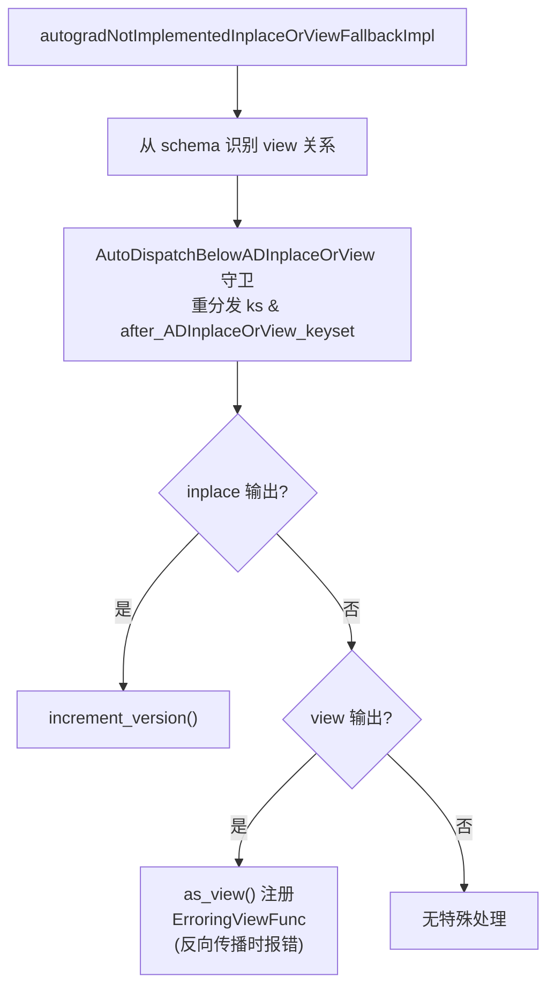

---

## 16. 分发键集构建完整流程

从张量参数到最终内核查找的完整路径：

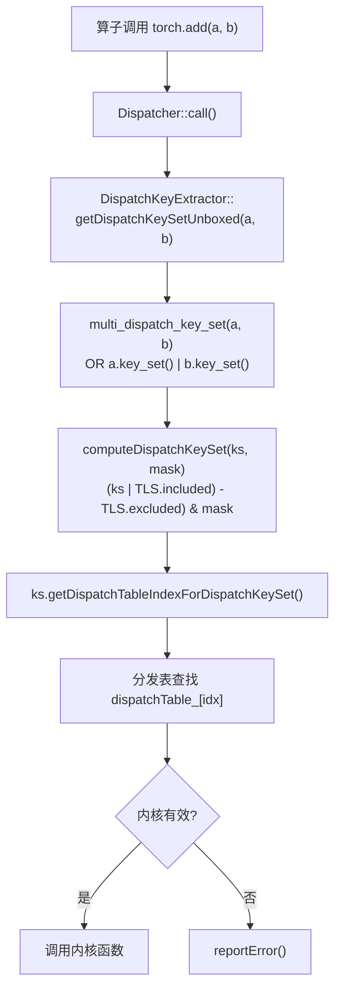

### 16.1 典型 CPU 张量的键集构建

```
输入: CPU Float tensor
  key_set_ = {CPUBit, Dense, AutogradFunctionality, ADInplaceOrView}

提取后:
  张量键集 = {CPUBit, Dense, AutogradFunctionality, ADInplaceOrView}
  TLS included = {BackendSelect, ADInplaceOrView}
  TLS excluded = {} (正常模式)
  非直通掩码 = ~fallthrough_keys

最终键集:
  功能位: Dense, AutogradFunctionality, ADInplaceOrView
  后端位: CPUBit

最高优先级:
  AutogradFunctionality + CPUBit → AutogradCPU
  → 查找 AutogradCPU 内核
  → 如果无，降级到 ADInplaceOrView → Dense + CPUBit → CPU
```

### 16.2 重分发路径

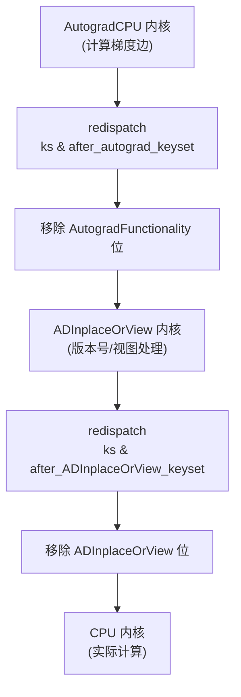

---

## 17. 设计权衡

### 17.1 64 位键集限制

- **当前**：15 个后端 + ~46 个功能键 = 61 位，接近 64 位上限
- **扩展**：新增后端或功能键需要审慎评估位空间
- **替代方案**：128 位键集 → 所有键集操作的性能下降

### 17.2 每后端功能键的笛卡尔积

- **收益**：每种功能 × 每种后端的精确分发，避免歧义
- **代价**：6 个功能 × 15 个后端 = 90 个运行时键，分发表 131 个槽位
- **Mobile**：压缩为 8 个槽位，牺牲灵活性换取内存

### 17.3 差集操作保留后端位

- **问题**：移除功能键时，后端位无法判断是否属于被移除的功能
- **方案**：`operator-` 始终保留后端位，需要移除后端位时显式使用 `remove_backend()`
- **代价**：API 不对称，需文档说明

### 17.4 别名键不可编码

- **原因**：别名键（如 Autograd）映射到多个运行时键，无法用单一 64 位表示
- **后果**：`DispatchKeySet(Autograd)` 的 repr_ = 0，必须通过特殊 API 处理
- **设计**：别名键仅在内核注册时使用，运行时分发不涉及

### 17.5 Meta 后端必须最后

- **原因**：TLS 中设置 Meta 键时，需要确保 Meta 内核被优先选择
- **实现**：MetaBit = 15（最高位），MSB 查找自然优先选择
- **代价**：Meta 张量的后端位值最大，可能影响某些位操作的假设

---

## 附录：关键代码行号参考

| 内容 | 文件 | 行号 |
|------|------|------|
| BackendComponent 枚举 | `c10/core/DispatchKey.h` | 64-102 |
| DispatchKey 枚举 | `c10/core/DispatchKey.h` | 135-497 |
| 每后端功能键范围 | `c10/core/DispatchKey.h` | 430-447 |
| 别名键 | `c10/core/DispatchKey.h` | 449-485 |
| isPerBackendFunctionalityKey | `c10/core/DispatchKey.h` | 547 |
| toBackendComponent | `c10/core/DispatchKey.h` | 619-659 |
| toFunctionalityKey | `c10/core/DispatchKey.h` | 661-679 |
| toRuntimePerBackendFunctionalityKey | `c10/core/DispatchKey.h` | 689-724 |
| DispatchKeySet 位布局 | `c10/core/DispatchKeySet.h` | 48-163 |
| 构造函数 | `c10/core/DispatchKeySet.h` | 167-275 |
| 集合运算 | `c10/core/DispatchKeySet.h` | 277-406 |
| 最高优先级提取 | `c10/core/DispatchKeySet.h` | 401-506 |
| 分发表索引计算 | `c10/core/DispatchKeySet.h` | 482-493 |
| 重要常量键集 | `c10/core/DispatchKeySet.h` | 633-949 |
| computeDispatchKeySet | `aten/src/ATen/core/dispatch/DispatchKeyExtractor.h` | 24-48 |
| MultiDispatchKeySet | `aten/src/ATen/core/dispatch/DispatchKeyExtractor.h` | 54-108 |
| DispatchKeyExtractor 类 | `aten/src/ATen/core/dispatch/DispatchKeyExtractor.h` | 127-258 |
| 分发表结构 | `aten/src/ATen/core/dispatch/OperatorEntry.h` | 236 |
| lookup 热路径 | `aten/src/ATen/core/dispatch/OperatorEntry.h` | 182-200 |
